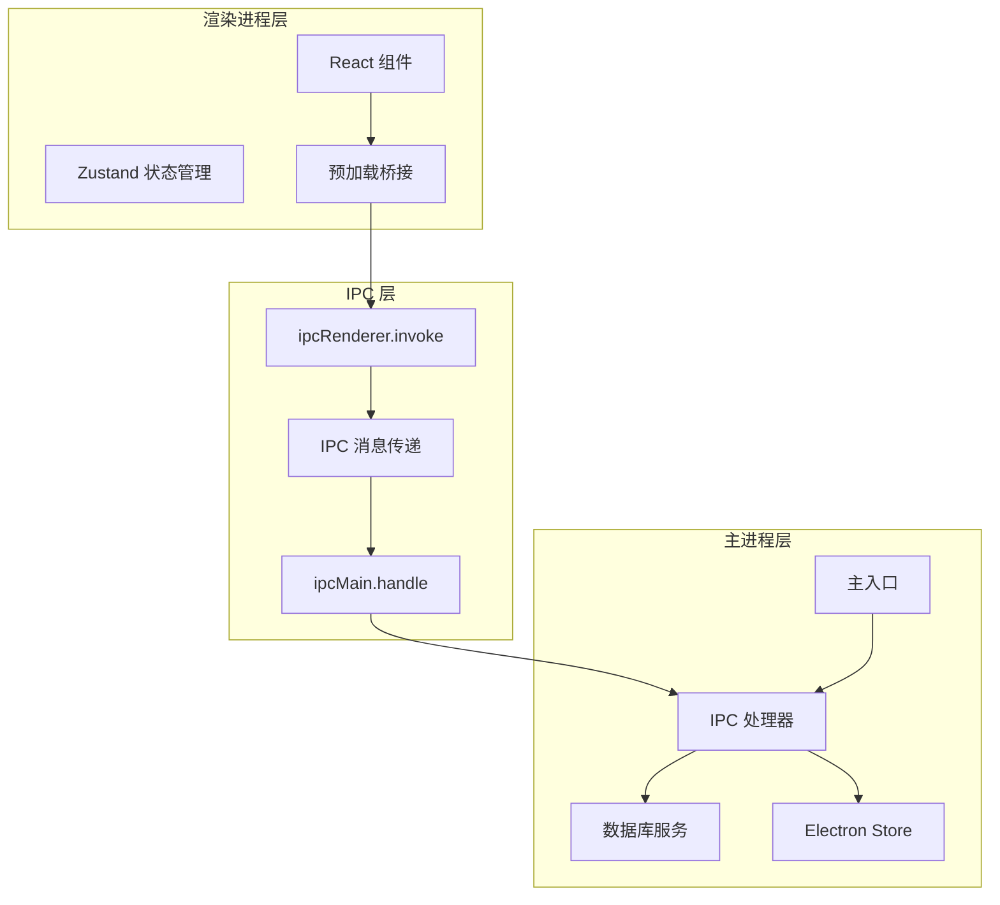
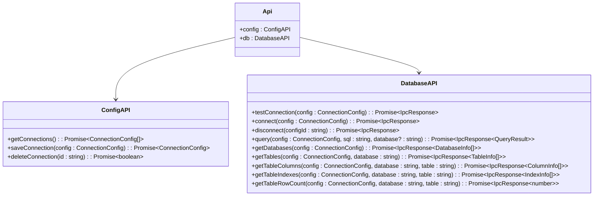
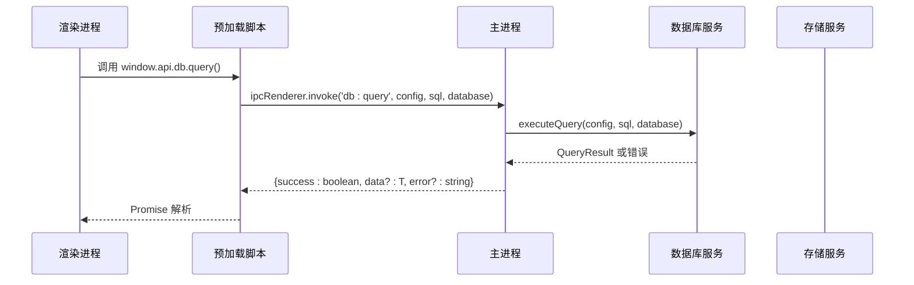
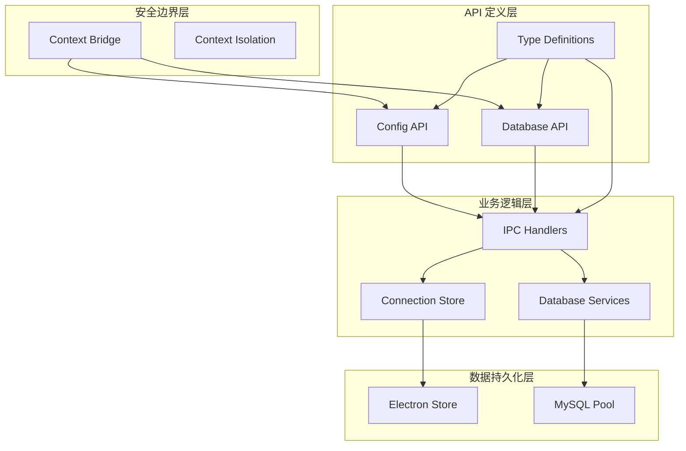
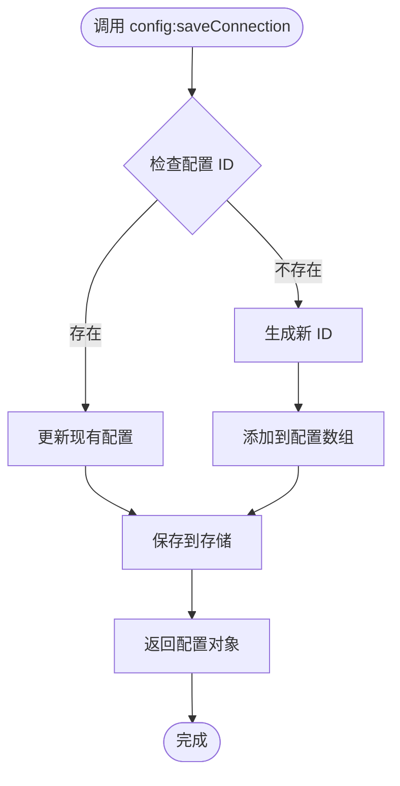
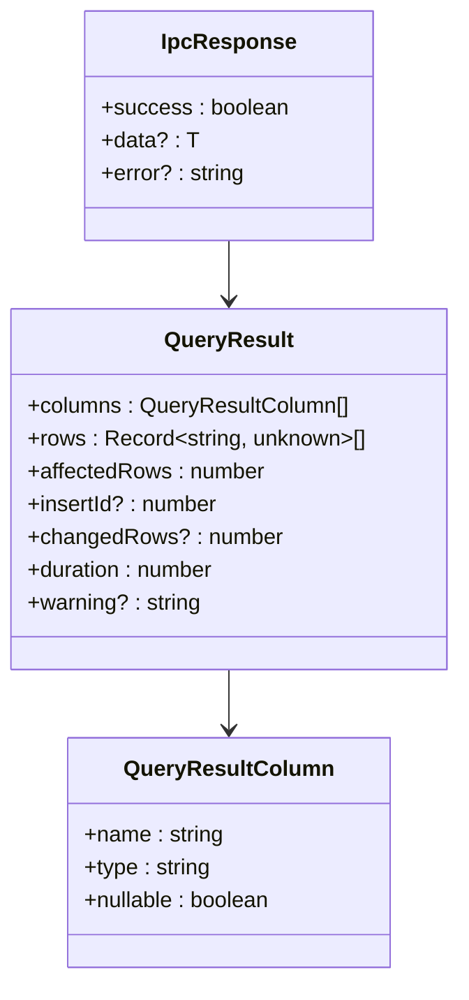
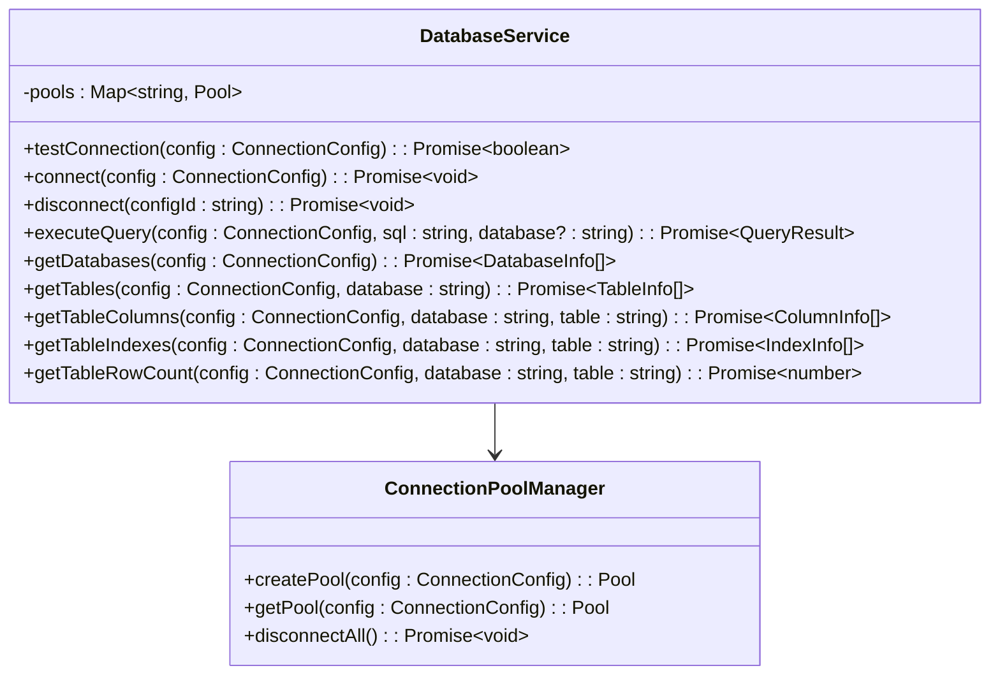
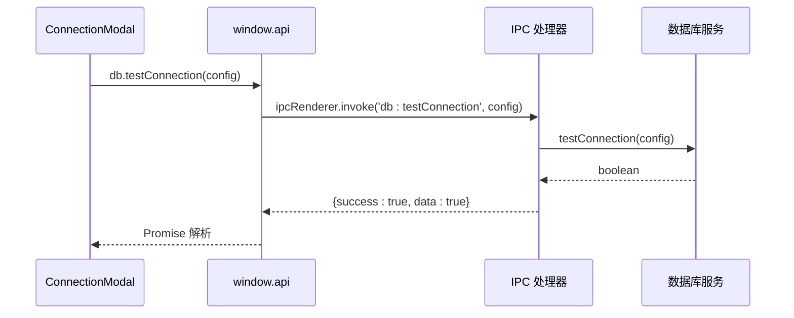
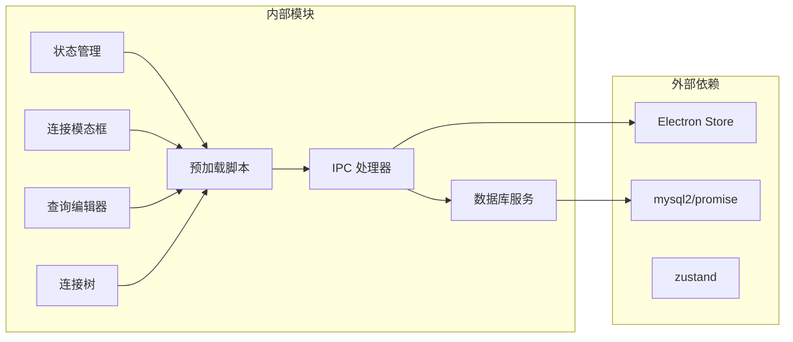
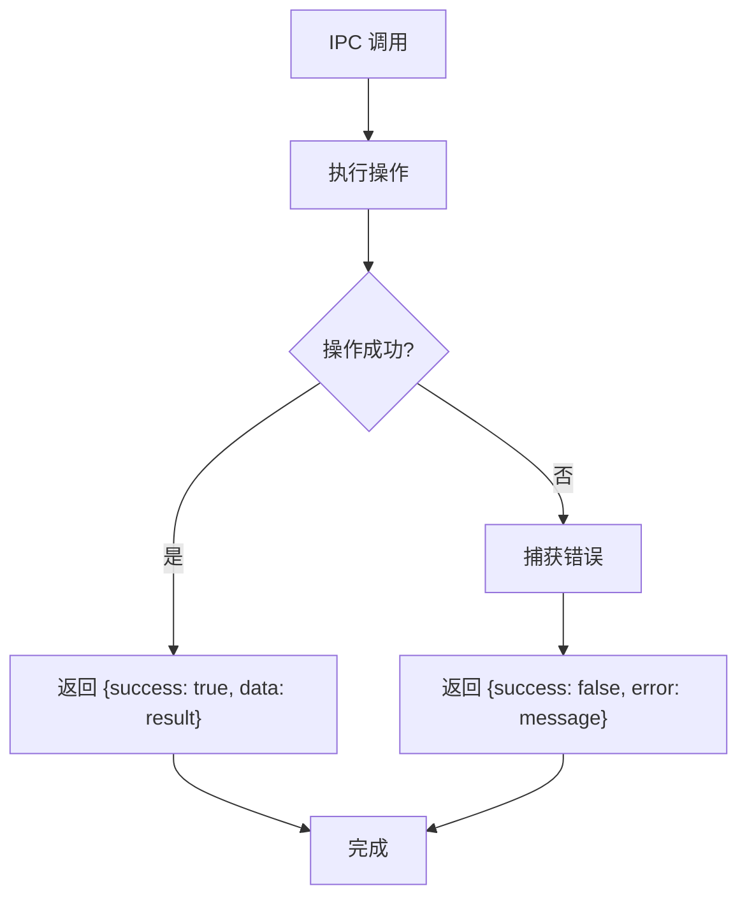

# IPC 通信系统

<cite>
**本文档引用的文件**
- [src/main/ipc.ts](file://src/main/ipc.ts)
- [src/preload/index.ts](file://src/preload/index.ts)
- [src/main/services/db.ts](file://src/main/services/db.ts)
- [src/main/index.ts](file://src/main/index.ts)
- [src/renderer/src/stores/connection.ts](file://src/renderer/src/stores/connection.ts)
- [src/shared/types/index.ts](file://src/shared/types/index.ts)
- [src/preload/index.d.ts](file://src/preload/index.d.ts)
- [src/renderer/src/components/ConnectionModal.tsx](file://src/renderer/src/components/ConnectionModal.tsx)
- [src/renderer/src/components/QueryEditor.tsx](file://src/renderer/src/components/QueryEditor.tsx)
- [src/renderer/src/components/ConnectionTree.tsx](file://src/renderer/src/components/ConnectionTree.tsx)
</cite>

## 目录
1. [简介](#简介)
2. [项目结构](#项目结构)
3. [核心组件](#核心组件)
4. [架构概览](#架构概览)
5. [详细组件分析](#详细组件分析)
6. [依赖关系分析](#依赖关系分析)
7. [性能考虑](#性能考虑)
8. [故障排除指南](#故障排除指南)
9. [结论](#结论)

## 简介

本项目是一个基于 Electron 的数据库管理工具，采用安全的 IPC（进程间通信）机制实现主进程与渲染进程之间的数据交换。系统通过预加载脚本暴露受限的 API 接口，确保渲染进程只能通过明确定义的接口与主进程进行通信，从而避免了直接访问 Node.js API 的安全风险。

IPC 通信系统主要负责以下功能：
- 连接配置的持久化存储和管理
- 数据库连接测试、建立和断开
- 数据库元数据查询（数据库、表、列、索引）
- SQL 查询执行和结果处理
- 错误处理和异常传播

## 项目结构

项目的 IPC 通信系统围绕三个核心层次构建：

**图表来源**
- [src/main/index.ts:1-64](file://src/main/index.ts#L1-L64)
- [src/preload/index.ts:1-60](file://src/preload/index.ts#L1-L60)
- [src/main/ipc.ts:1-132](file://src/main/ipc.ts#L1-L132)

**章节来源**
- [src/main/index.ts:1-64](file://src/main/index.ts#L1-L64)
- [src/preload/index.ts:1-60](file://src/preload/index.ts#L1-L60)
- [src/main/ipc.ts:1-132](file://src/main/ipc.ts#L1-L132)

## 核心组件

### 预加载脚本（Preload Bridge）

预加载脚本是 IPC 通信的安全边界，它通过 `contextBridge` API 将受限的 API 暴露给渲染进程：

**图表来源**
- [src/preload/index.ts:14-46](file://src/preload/index.ts#L14-L46)

### IPC 处理器

主进程中的 IPC 处理器负责接收来自渲染进程的消息并执行相应的操作：

**图表来源**
- [src/preload/index.ts:33](file://src/preload/index.ts#L33)
- [src/main/ipc.ts:74-81](file://src/main/ipc.ts#L74-L81)
- [src/main/services/db.ts:73-135](file://src/main/services/db.ts#L73-L135)

**章节来源**
- [src/preload/index.ts:1-60](file://src/preload/index.ts#L1-L60)
- [src/main/ipc.ts:1-132](file://src/main/ipc.ts#L1-L132)

## 架构概览

IPC 通信系统采用分层架构设计，确保了安全性、可维护性和扩展性：

**图表来源**
- [src/preload/index.ts:50-59](file://src/preload/index.ts#L50-L59)
- [src/shared/types/index.ts:1-124](file://src/shared/types/index.ts#L1-L124)
- [src/main/ipc.ts:16-127](file://src/main/ipc.ts#L16-L127)

## 详细组件分析

### 配置管理 API

配置管理模块负责连接配置的持久化存储和管理：

#### 接口定义

| 接口名称 | 参数 | 返回值 | 描述 |
|---------|------|--------|------|
| `config:getConnections` | 无 | `ConnectionConfig[]` | 获取所有连接配置 |
| `config:saveConnection` | `ConnectionConfig` | `ConnectionConfig` | 保存连接配置（支持更新和新增） |
| `config:deleteConnection` | `string` | `boolean` | 删除指定 ID 的连接配置 |

#### 实现细节

**图表来源**
- [src/main/ipc.ts:23-34](file://src/main/ipc.ts#L23-L34)

**章节来源**
- [src/main/ipc.ts:19-43](file://src/main/ipc.ts#L19-L43)
- [src/preload/index.ts:17-23](file://src/preload/index.ts#L17-L23)

### 数据库操作 API

数据库操作模块提供了完整的数据库管理功能：

#### 接口定义

| 接口名称 | 参数 | 返回值 | 描述 |
|---------|------|--------|------|
| `db:testConnection` | `ConnectionConfig` | `IpcResponse<boolean>` | 测试数据库连接 |
| `db:connect` | `ConnectionConfig` | `IpcResponse<void>` | 建立数据库连接 |
| `db:disconnect` | `string` | `IpcResponse<void>` | 断开数据库连接 |
| `db:query` | `ConnectionConfig, string, string?` | `IpcResponse<QueryResult>` | 执行 SQL 查询 |
| `db:getDatabases` | `ConnectionConfig` | `IpcResponse<DatabaseInfo[]>` | 获取数据库列表 |
| `db:getTables` | `ConnectionConfig, string` | `IpcResponse<TableInfo[]>` | 获取表列表 |
| `db:getTableColumns` | `ConnectionConfig, string, string` | `IpcResponse<ColumnInfo[]>` | 获取表列信息 |
| `db:getTableIndexes` | `ConnectionConfig, string, string` | `IpcResponse<IndexInfo[]>` | 获取表索引信息 |
| `db:getTableRowCount` | `ConnectionConfig, string, string` | `IpcResponse<number>` | 获取表行数 |

#### 查询结果处理

数据库查询结果通过统一的 `QueryResult` 结构返回：

**图表来源**
- [src/shared/types/index.ts:80-88](file://src/shared/types/index.ts#L80-L88)
- [src/shared/types/index.ts:104-108](file://src/shared/types/index.ts#L104-L108)

**章节来源**
- [src/main/ipc.ts:47-126](file://src/main/ipc.ts#L47-L126)
- [src/preload/index.ts:27-44](file://src/preload/index.ts#L27-L44)
- [src/shared/types/index.ts:72-108](file://src/shared/types/index.ts#L72-L108)

### 数据库服务层

数据库服务层实现了连接池管理和查询执行逻辑：

**图表来源**
- [src/main/services/db.ts:11-71](file://src/main/services/db.ts#L11-L71)
- [src/main/services/db.ts:73-135](file://src/main/services/db.ts#L73-L135)

**章节来源**
- [src/main/services/db.ts:1-277](file://src/main/services/db.ts#L1-L277)

### 渲染进程集成

渲染进程通过预加载脚本提供的 API 与主进程通信：

**图表来源**
- [src/renderer/src/components/ConnectionModal.tsx:46-50](file://src/renderer/src/components/ConnectionModal.tsx#L46-L50)
- [src/preload/index.ts:27-28](file://src/preload/index.ts#L27-L28)
- [src/main/ipc.ts:47-54](file://src/main/ipc.ts#L47-L54)

**章节来源**
- [src/renderer/src/components/ConnectionModal.tsx:44-50](file://src/renderer/src/components/ConnectionModal.tsx#L44-L50)
- [src/renderer/src/components/QueryEditor.tsx:55-64](file://src/renderer/src/components/QueryEditor.tsx#L55-L64)
- [src/renderer/src/components/ConnectionTree.tsx:42-56](file://src/renderer/src/components/ConnectionTree.tsx#L42-L56)

## 依赖关系分析

IPC 通信系统的依赖关系呈现清晰的分层结构：

**图表来源**
- [src/main/services/db.ts:1](file://src/main/services/db.ts#L1)
- [src/main/ipc.ts:2](file://src/main/ipc.ts#L2)
- [src/renderer/src/stores/connection.ts:1](file://src/renderer/src/stores/connection.ts#L1)

**章节来源**
- [src/main/services/db.ts:1-2](file://src/main/services/db.ts#L1-L2)
- [src/main/ipc.ts:1-5](file://src/main/ipc.ts#L1-L5)
- [src/renderer/src/stores/connection.ts:1](file://src/renderer/src/stores/connection.ts#L1)

## 性能考虑

### 连接池优化

系统使用连接池管理数据库连接，通过以下策略优化性能：

1. **连接复用**：每个连接配置维护独立的连接池
2. **连接限制**：默认最大连接数为 5，平衡资源使用和并发性能
3. **心跳机制**：启用 keep-alive 确保连接有效性
4. **超时控制**：可配置连接超时时间，默认 10 秒

### 查询性能监控

查询执行包含性能监控机制：

- 使用 `performance.now()` 记录查询执行时间
- 返回结果包含 `duration` 字段用于性能分析
- 支持查询警告信息收集

### 内存管理

- 连接池在断开连接时自动清理
- 数据库服务提供 `disconnectAll` 方法用于应用退出时的资源清理
- 预加载脚本中的 API 对象在上下文隔离环境中安全管理

## 故障排除指南

### 常见错误类型

系统通过统一的 `IpcResponse` 结构处理错误：

**图表来源**
- [src/main/ipc.ts:47-54](file://src/main/ipc.ts#L47-L54)
- [src/main/ipc.ts:74-81](file://src/main/ipc.ts#L74-L81)

### 错误处理策略

1. **连接测试失败**：返回详细的错误消息，便于用户诊断
2. **查询执行异常**：包含原始错误信息和警告提示
3. **存储操作失败**：确保数据一致性，避免部分更新
4. **网络超时**：提供合理的超时配置和重试机制

**章节来源**
- [src/main/ipc.ts:47-126](file://src/main/ipc.ts#L47-L126)
- [src/main/services/db.ts:38-56](file://src/main/services/db.ts#L38-L56)

## 结论

本 IPC 通信系统通过精心设计的架构实现了安全、高效的应用程序通信机制。系统的主要优势包括：

1. **安全性**：通过预加载脚本和上下文隔离确保渲染进程无法直接访问 Node.js API
2. **可维护性**：清晰的分层架构和标准化的 API 设计便于代码维护和扩展
3. **性能优化**：连接池管理和查询性能监控确保系统响应速度
4. **错误处理**：统一的错误处理机制提供良好的用户体验
5. **类型安全**：完整的 TypeScript 类型定义确保开发时的类型安全

该系统为数据库管理工具提供了可靠的 IPC 通信基础，支持复杂的数据库操作和实时数据交互，是整个应用程序架构的核心组成部分。