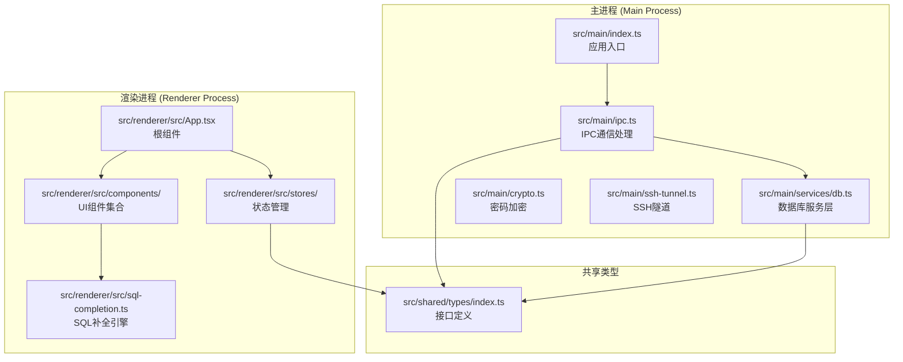
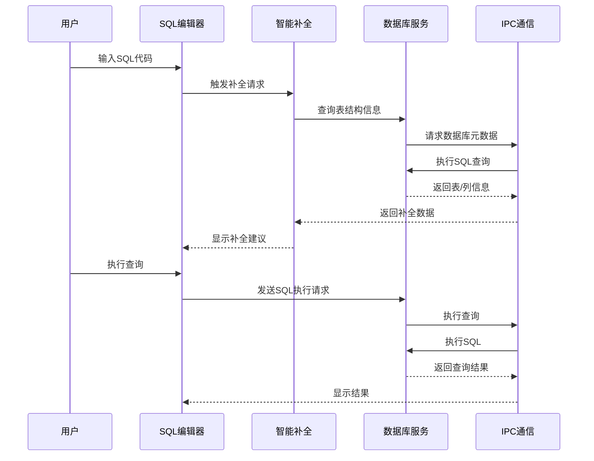
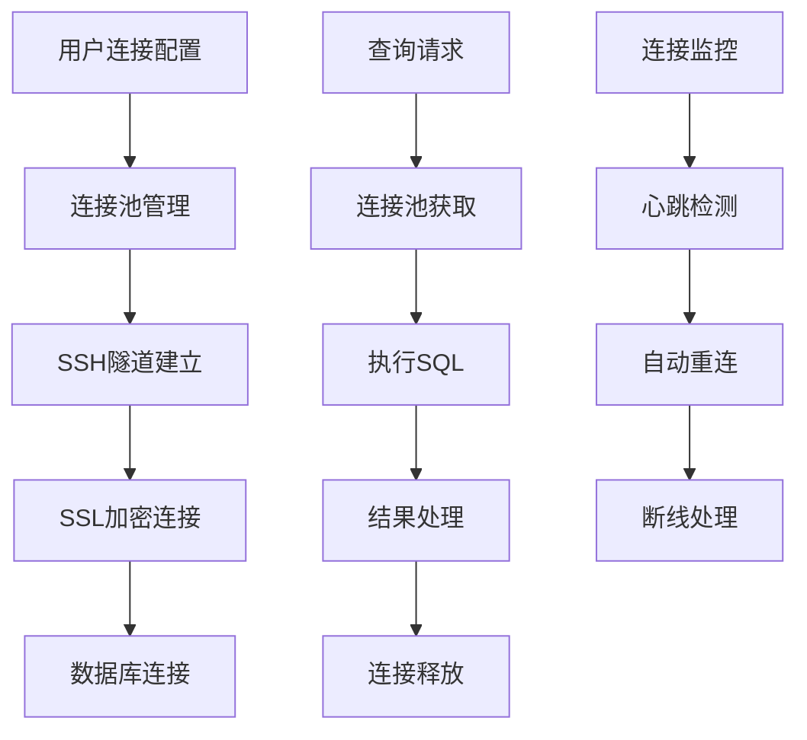
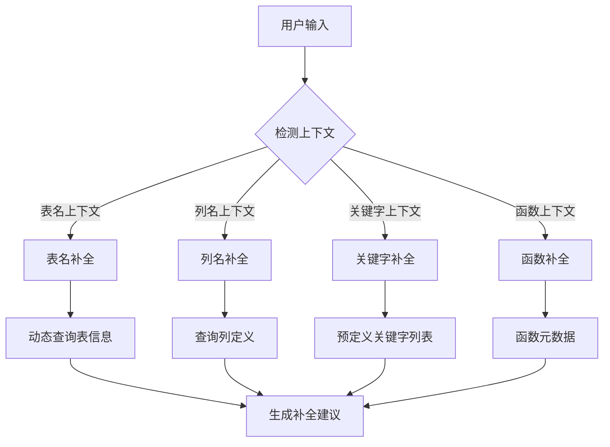
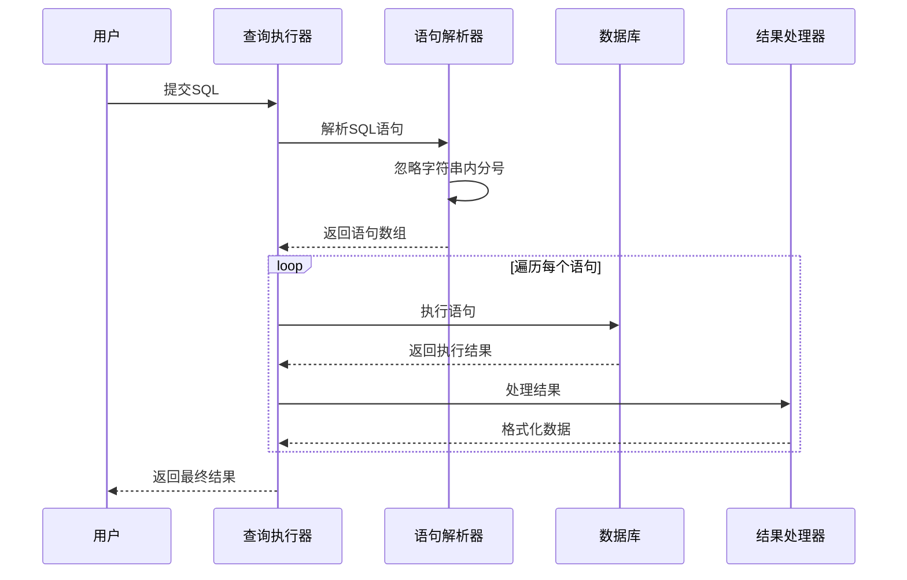
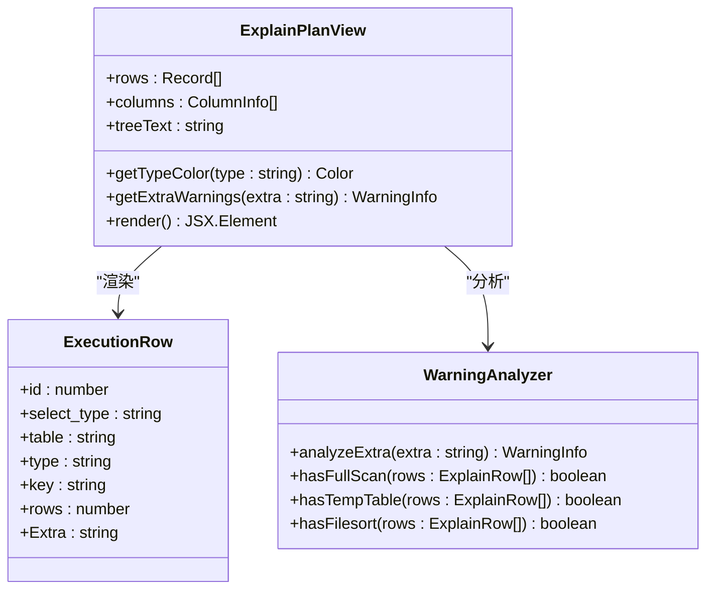
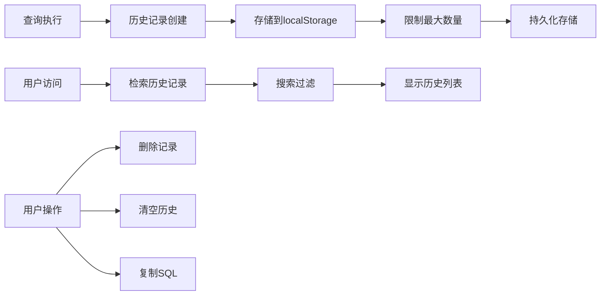
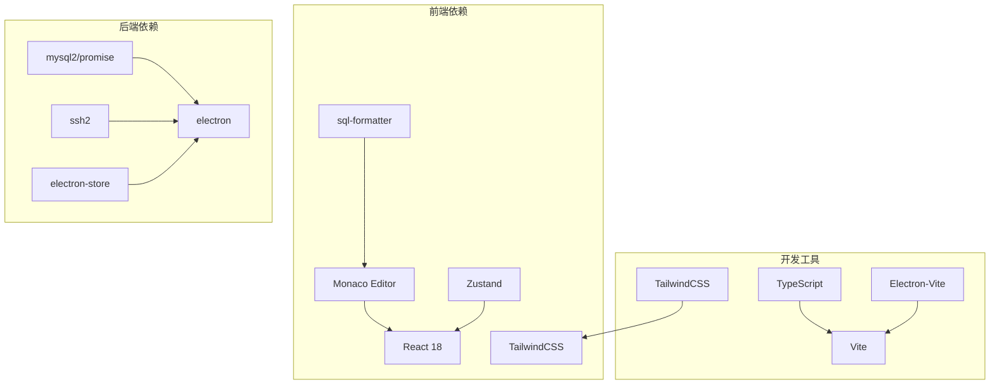
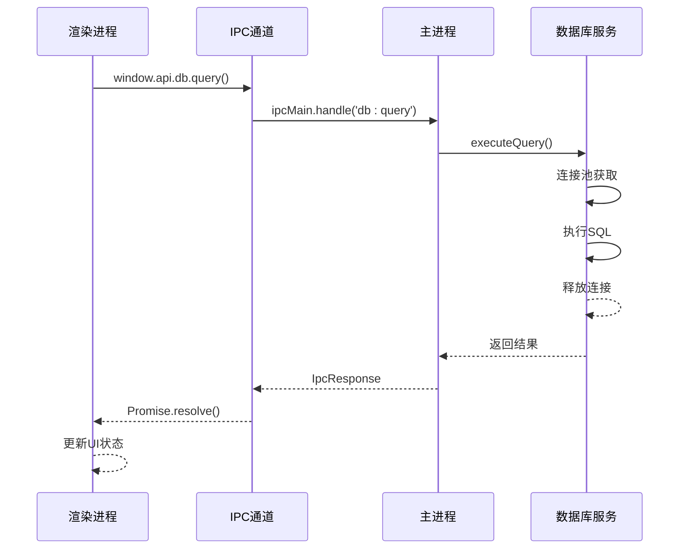

# SQL智能编辑功能

<cite>
**本文档引用的文件**
- [package.json](file://package.json)
- [README.md](file://README.md)
- [src/main/index.ts](file://src/main/index.ts)
- [src/main/ipc.ts](file://src/main/ipc.ts)
- [src/main/services/db.ts](file://src/main/services/db.ts)
- [src/renderer/src/App.tsx](file://src/renderer/src/App.tsx)
- [src/renderer/src/sql-completion.ts](file://src/renderer/src/sql-completion.ts)
- [src/renderer/src/components/QueryEditor.tsx](file://src/renderer/src/components/QueryEditor.tsx)
- [src/renderer/src/components/QueryPanel.tsx](file://src/renderer/src/components/QueryPanel.tsx)
- [src/renderer/src/components/ExplainPlanView.tsx](file://src/renderer/src/components/ExplainPlanView.tsx)
- [src/renderer/src/components/QueryHistoryPanel.tsx](file://src/renderer/src/components/QueryHistoryPanel.tsx)
- [src/renderer/src/stores/tab.ts](file://src/renderer/src/stores/tab.ts)
- [src/renderer/src/stores/history.ts](file://src/renderer/src/stores/history.ts)
- [src/shared/types/index.ts](file://src/shared/types/index.ts)
</cite>

## 目录
1. [简介](#简介)
2. [项目结构](#项目结构)
3. [核心组件](#核心组件)
4. [架构概览](#架构概览)
5. [详细组件分析](#详细组件分析)
6. [依赖关系分析](#依赖关系分析)
7. [性能考虑](#性能考虑)
8. [故障排除指南](#故障排除指南)
9. [结论](#结论)

## 简介

nexSql 是一款基于 Electron + React 构建的现代化桌面数据库管理客户端，专为 MySQL 设计。该项目的核心功能之一是提供强大的 SQL 智能编辑功能，包括语法高亮、智能补全、自动补全、SQL 格式化、执行计划分析等高级特性。

该应用程序采用前后端分离的架构，使用 Monaco Editor 作为代码编辑器，结合 MySQL 数据库驱动和丰富的前端状态管理，为用户提供类似 VSCode 的 SQL 编辑体验。

## 项目结构

项目采用典型的 Electron 应用程序结构，分为主进程、渲染进程和共享类型三个主要部分：



**图表来源**
- [src/main/index.ts:1-64](file://src/main/index.ts#L1-L64)
- [src/main/ipc.ts:48-448](file://src/main/ipc.ts#L48-L448)
- [src/main/services/db.ts:1-778](file://src/main/services/db.ts#L1-L778)
- [src/renderer/src/App.tsx:1-136](file://src/renderer/src/App.tsx#L1-L136)
- [src/renderer/src/sql-completion.ts:1-240](file://src/renderer/src/sql-completion.ts#L1-L240)

**章节来源**
- [package.json:1-45](file://package.json#L1-L45)
- [README.md:135-184](file://README.md#L135-L184)

## 核心组件

### SQL 编辑器组件

SQL 智能编辑功能主要由以下核心组件构成：

1. **Monaco Editor 集成** - 基于 VSCode 同款编辑器，提供语法高亮和智能提示
2. **智能补全系统** - 支持四级智能提示：关键字、表名、列名、函数
3. **SQL 格式化** - 基于 sql-formatter 库的 SQL 美化功能
4. **执行计划分析** - EXPLAIN 查询的可视化展示
5. **查询历史管理** - 自动记录和管理执行历史

### 数据流架构



**图表来源**
- [src/renderer/src/components/QueryEditor.tsx:46-85](file://src/renderer/src/components/QueryEditor.tsx#L46-L85)
- [src/renderer/src/sql-completion.ts:127-239](file://src/renderer/src/sql-completion.ts#L127-L239)
- [src/main/ipc.ts:125-136](file://src/main/ipc.ts#L125-L136)

**章节来源**
- [src/renderer/src/components/QueryEditor.tsx:1-426](file://src/renderer/src/components/QueryEditor.tsx#L1-L426)
- [src/renderer/src/components/QueryPanel.tsx:1-567](file://src/renderer/src/components/QueryPanel.tsx#L1-L567)

## 架构概览

### 整体架构设计

```mermaid
graph TB
subgraph "用户界面层"
A[QueryEditor<br/>查询编辑器]
B[QueryPanel<br/>查询面板]
C[ExplainPlanView<br/>执行计划视图]
D[QueryHistoryPanel<br/>查询历史面板]
end
subgraph "状态管理层"
E[useTabStore<br/>标签页状态]
F[useHistoryStore<br/>历史记录状态]
G[useConnectionStore<br/>连接状态]
H[useUiStore<br/>UI状态]
end
subgraph "业务逻辑层"
I[SQL补全引擎]
J[查询执行器]
K[格式化器]
L[执行计划分析器]
end
subgraph "数据访问层"
M[数据库服务(db.ts)]
N[IPC通信(ipc.ts)]
O[连接池管理]
end
A --> I
B --> J
C --> L
D --> F
A --> E
B --> G
C --> H
I --> N
J --> N
L --> N
N --> M
M --> O
```

**图表来源**
- [src/renderer/src/components/QueryEditor.tsx:1-426](file://src/renderer/src/components/QueryEditor.tsx#L1-L426)
- [src/renderer/src/stores/tab.ts:1-99](file://src/renderer/src/stores/tab.ts#L1-L99)
- [src/main/services/db.ts:1-778](file://src/main/services/db.ts#L1-L778)

### 数据库连接架构



**图表来源**
- [src/main/services/db.ts:37-53](file://src/main/services/db.ts#L37-L53)
- [src/main/services/db.ts:91-153](file://src/main/services/db.ts#L91-L153)

**章节来源**
- [src/main/services/db.ts:1-778](file://src/main/services/db.ts#L1-L778)
- [src/main/ipc.ts:48-448](file://src/main/ipc.ts#L48-L448)

## 详细组件分析

### SQL 智能补全系统

#### 补全算法实现

SQL 智能补全系统采用四级智能提示机制：



**图表来源**
- [src/renderer/src/sql-completion.ts:153-196](file://src/renderer/src/sql-completion.ts#L153-L196)
- [src/renderer/src/sql-completion.ts:198-234](file://src/renderer/src/sql-completion.ts#L198-L234)

#### 补全上下文检测

系统通过正则表达式检测 SQL 语句的上下文，准确识别补全需求：

| 上下文类型 | 检测模式 | 补全内容 |
|------------|----------|----------|
| 表名补全 | `(FROM|JOIN|INTO|UPDATE|TABLE|TRUNCATE)` | 数据库中的所有表 |
| 列名补全 | `(SELECT|WHERE|SET|ON|BY|AND|OR|HAVING)` | 当前数据库的列 |
| 关键字补全 | 任意位置 | SQL 关键字列表 |
| 函数补全 | `(SELECT|WHERE)` | MySQL 内置函数 |

**章节来源**
- [src/renderer/src/sql-completion.ts:153-239](file://src/renderer/src/sql-completion.ts#L153-L239)

### 查询执行器

#### 多语句执行机制

查询执行器支持复杂的多语句执行，具有智能的分号处理能力：



**图表来源**
- [src/renderer/src/components/QueryPanel.tsx:116-170](file://src/renderer/src/components/QueryPanel.tsx#L116-L170)

#### 错误处理策略

系统实现了完善的错误处理机制：

1. **语句级错误处理** - 单个语句失败不影响其他语句执行
2. **事务回滚** - 自动停止后续语句执行
3. **详细错误信息** - 包含语句编号和具体错误描述
4. **性能监控** - 记录每个语句的执行时间和影响行数

**章节来源**
- [src/renderer/src/components/QueryPanel.tsx:101-200](file://src/renderer/src/components/QueryPanel.tsx#L101-L200)

### 执行计划分析器

#### EXPLAIN 结果可视化

执行计划分析器提供了两种显示模式：

1. **TREE 格式** - MySQL 8.0.16+ 的新格式，提供更详细的执行计划
2. **传统表格格式** - 标准的 EXPLAIN 输出，兼容所有 MySQL 版本



**图表来源**
- [src/renderer/src/components/ExplainPlanView.tsx:9-29](file://src/renderer/src/components/ExplainPlanView.tsx#L9-L29)
- [src/renderer/src/components/ExplainPlanView.tsx:63-99](file://src/renderer/src/components/ExplainPlanView.tsx#L63-L99)

**章节来源**
- [src/renderer/src/components/ExplainPlanView.tsx:1-239](file://src/renderer/src/components/ExplainPlanView.tsx#L1-L239)

### 查询历史管理系统

#### 历史记录存储

查询历史管理系统采用本地存储机制：



**图表来源**
- [src/renderer/src/stores/history.ts:40-75](file://src/renderer/src/stores/history.ts#L40-L75)

**章节来源**
- [src/renderer/src/stores/history.ts:1-76](file://src/renderer/src/stores/history.ts#L1-L76)
- [src/renderer/src/components/QueryHistoryPanel.tsx:1-182](file://src/renderer/src/components/QueryHistoryPanel.tsx#L1-L182)

## 依赖关系分析

### 核心依赖关系



**图表来源**
- [package.json:16-42](file://package.json#L16-L42)

### IPC 通信流程



**图表来源**
- [src/main/ipc.ts:125-136](file://src/main/ipc.ts#L125-L136)
- [src/main/services/db.ts:91-153](file://src/main/services/db.ts#L91-L153)

**章节来源**
- [package.json:16-42](file://package.json#L16-L42)
- [src/main/ipc.ts:48-448](file://src/main/ipc.ts#L48-L448)

## 性能考虑

### 连接池优化

系统使用连接池管理数据库连接，具有以下优化特性：

1. **连接复用** - 避免频繁创建和销毁连接
2. **自动重连** - 断线自动重连机制
3. **连接限制** - 最大连接数限制，防止资源耗尽
4. **心跳检测** - 定期检测连接有效性

### 内存管理

1. **补全数据缓存** - 表结构信息缓存在内存中
2. **历史记录限制** - 最大保留200条查询历史
3. **组件卸载清理** - 自动清理事件监听器和定时器
4. **图片和大文件处理** - 异步加载和懒加载策略

### 前端性能优化

1. **虚拟滚动** - 大数据集的虚拟化处理
2. **状态分片** - 使用 Zustand 实现细粒度状态管理
3. **组件懒加载** - 按需加载大型组件
4. **防抖节流** - 输入事件的防抖处理

## 故障排除指南

### 常见问题及解决方案

#### 连接问题

| 问题症状 | 可能原因 | 解决方案 |
|----------|----------|----------|
| 连接超时 | 网络延迟或防火墙 | 检查网络连接，调整超时设置 |
| 认证失败 | 用户名或密码错误 | 验证凭据，检查权限 |
| SSL连接失败 | 证书问题 | 禁用SSL或修复证书 |
| SSH隧道失败 | 端口被占用 | 检查SSH配置，更换端口 |

#### SQL执行问题

| 问题症状 | 可能原因 | 解决方案 |
|----------|----------|----------|
| 查询超时 | SQL语句复杂 | 优化SQL，添加索引 |
| 内存不足 | 大结果集 | 分页查询，限制结果集大小 |
| 权限不足 | 用户权限不够 | 授予相应权限 |
| 语法错误 | SQL语法问题 | 检查语法，参考MySQL文档 |

#### 补全功能问题

| 问题症状 | 可能原因 | 解决方案 |
|----------|----------|----------|
| 补全不准确 | 缓存过期 | 刷新表结构缓存 |
| 补全速度慢 | 数据库响应慢 | 检查数据库性能 |
| 补全缺失 | 权限限制 | 检查用户权限 |
| 补全冲突 | 多数据库同名对象 | 指定数据库前缀 |

**章节来源**
- [src/main/services/db.ts:55-80](file://src/main/services/db.ts#L55-L80)
- [src/main/ipc.ts:95-103](file://src/main/ipc.ts#L95-L103)

### 调试技巧

1. **启用详细日志** - 在开发模式下查看控制台输出
2. **检查IPC通信** - 监控主进程和渲染进程之间的消息传递
3. **数据库连接监控** - 查看连接池状态和活动连接数
4. **性能分析** - 使用浏览器开发者工具分析性能瓶颈

## 结论

nexSql 的 SQL 智能编辑功能通过精心设计的架构和丰富的功能特性，为用户提供了专业的 SQL 开发体验。系统的主要优势包括：

1. **完整的智能补全** - 四级智能提示满足各种开发场景
2. **强大的查询执行** - 支持多语句执行和详细的错误处理
3. **可视化执行计划** - EXPLAIN 结果的直观展示
4. **完善的查询历史** - 便捷的历史记录管理和搜索功能
5. **高性能架构** - 基于连接池和缓存的优化设计

该系统不仅提供了丰富的功能特性，还具备良好的扩展性和维护性，为后续的功能增强奠定了坚实的基础。通过模块化的架构设计和清晰的职责分离，开发者可以轻松地添加新的功能特性和优化现有功能。