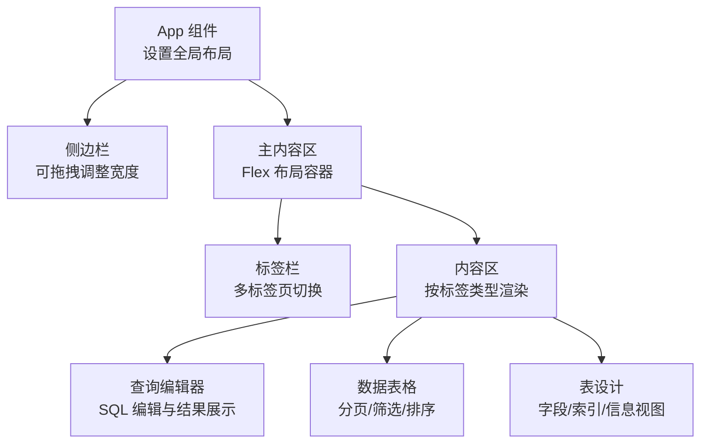
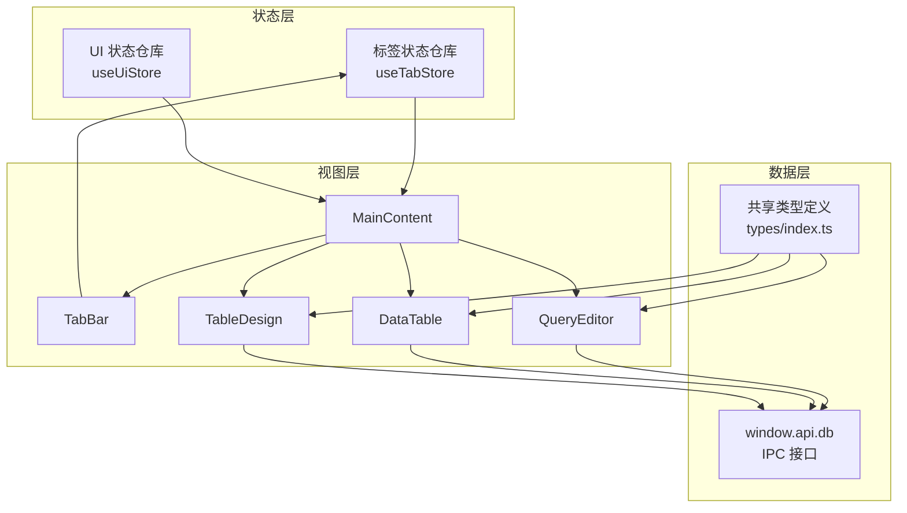
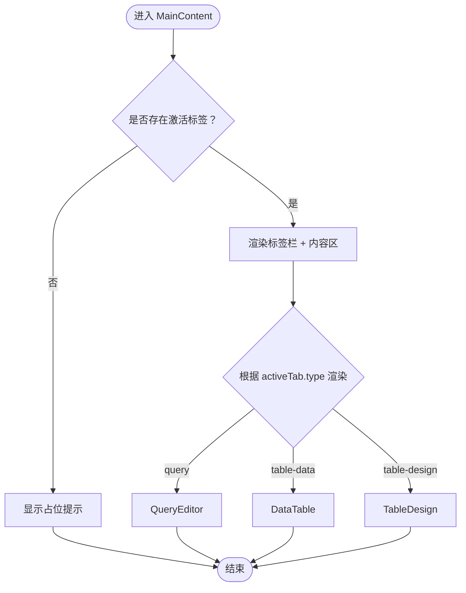
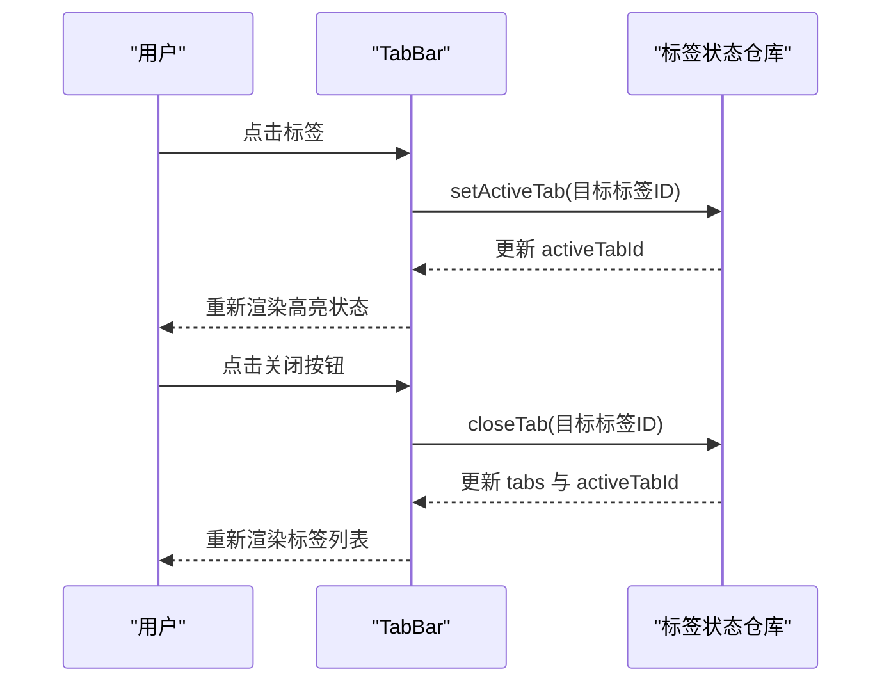
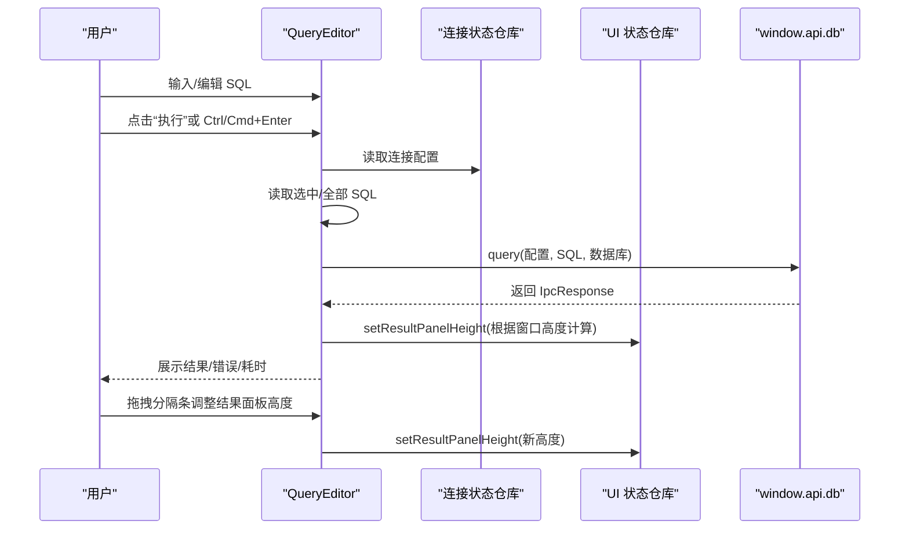
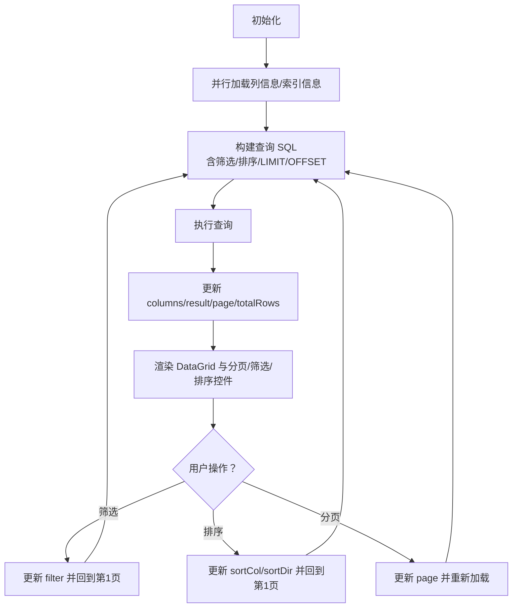
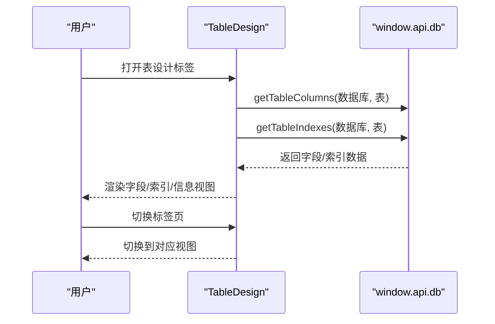
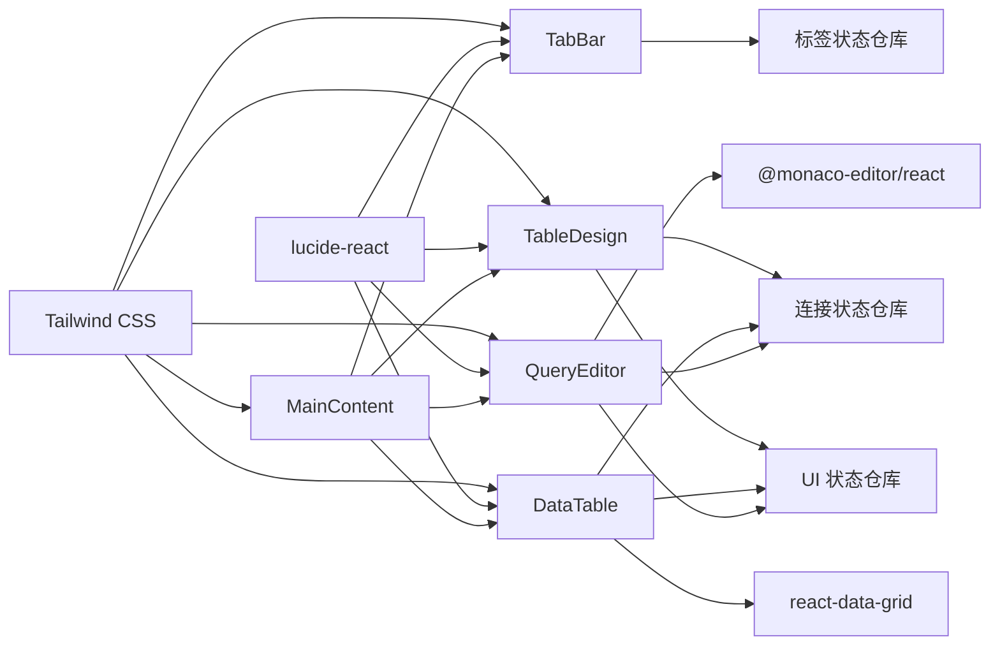

# 主内容区组件

<cite>
**本文引用的文件**
- [MainContent.tsx](file://src/renderer/src/components/MainContent.tsx)
- [TabBar.tsx](file://src/renderer/src/components/TabBar.tsx)
- [QueryEditor.tsx](file://src/renderer/src/components/QueryEditor.tsx)
- [DataTable.tsx](file://src/renderer/src/components/DataTable.tsx)
- [TableDesign.tsx](file://src/renderer/src/components/TableDesign.tsx)
- [tab.ts](file://src/renderer/src/stores/tab.ts)
- [ui.ts](file://src/renderer/src/stores/ui.ts)
- [types/index.ts](file://src/shared/types/index.ts)
- [App.tsx](file://src/renderer/src/App.tsx)
- [Sidebar.tsx](file://src/renderer/src/components/Sidebar.tsx)
- [index.css](file://src/renderer/src/index.css)
- [tailwind.config.js](file://src/renderer/src/index.css)
- [package.json](file://package.json)
- [electron.vite.config.ts](file://electron.vite.config.ts)
</cite>

## 目录
1. [简介](#简介)
2. [项目结构](#项目结构)
3. [核心组件](#核心组件)
4. [架构总览](#架构总览)
5. [详细组件分析](#详细组件分析)
6. [依赖关系分析](#依赖关系分析)
7. [性能考虑](#性能考虑)
8. [故障排查指南](#故障排查指南)
9. [结论](#结论)
10. [附录](#附录)

## 简介
本文件聚焦于 nexSql 的“主内容区”组件体系，系统性阐述其整体布局与功能组织，重点解析标签栏、查询编辑器、数据表格与表设计组件之间的协同机制，说明内容切换逻辑、状态管理与数据传递流程，并给出布局配置、自定义选项、响应式设计与多窗口支持建议，以及性能优化与用户体验改进建议。

## 项目结构
主内容区位于应用根组件之下，采用左右布局：左侧为可拖拽调整宽度的侧边栏，右侧为主内容区容器。主内容区内部由标签栏与内容区组成，内容区根据当前激活标签动态渲染不同类型的子组件（查询编辑器、数据表格、表设计）。

图表来源
- [App.tsx:15-34](file://src/renderer/src/App.tsx#L15-L34)
- [Sidebar.tsx:43-79](file://src/renderer/src/components/Sidebar.tsx#L43-L79)
- [MainContent.tsx:8-33](file://src/renderer/src/components/MainContent.tsx#L8-L33)
- [TabBar.tsx:5-52](file://src/renderer/src/components/TabBar.tsx#L5-L52)
- [QueryEditor.tsx:140-328](file://src/renderer/src/components/QueryEditor.tsx#L140-L328)
- [DataTable.tsx:151-296](file://src/renderer/src/components/DataTable.tsx#L151-L296)
- [TableDesign.tsx:83-240](file://src/renderer/src/components/TableDesign.tsx#L83-L240)

章节来源
- [App.tsx:8-34](file://src/renderer/src/App.tsx#L8-L34)
- [Sidebar.tsx:6-79](file://src/renderer/src/components/Sidebar.tsx#L6-L79)
- [MainContent.tsx:8-33](file://src/renderer/src/components/MainContent.tsx#L8-L33)

## 核心组件
- 主内容区容器：负责布局与内容区的条件渲染，依据当前激活标签决定显示查询编辑器、数据表格或表设计。
- 标签栏：维护标签集合与激活状态，支持关闭标签、切换标签、显示脏标记等。
- 查询编辑器：提供 SQL 编辑、快捷键执行、结果面板拖拽调整、CSV 导出、错误与耗时展示。
- 数据表格：基于 react-data-grid 展示数据，支持筛选、排序、分页与状态栏反馈。
- 表设计：并行加载字段与索引信息，提供字段/索引/信息三段式视图。

章节来源
- [MainContent.tsx:1-34](file://src/renderer/src/components/MainContent.tsx#L1-L34)
- [TabBar.tsx:1-53](file://src/renderer/src/components/TabBar.tsx#L1-L53)
- [QueryEditor.tsx:1-329](file://src/renderer/src/components/QueryEditor.tsx#L1-L329)
- [DataTable.tsx:1-297](file://src/renderer/src/components/DataTable.tsx#L1-L297)
- [TableDesign.tsx:1-241](file://src/renderer/src/components/TableDesign.tsx#L1-L241)

## 架构总览
主内容区通过状态驱动的条件渲染实现内容切换，标签状态来自独立的状态仓库；UI 状态（如结果面板高度、侧边栏宽度）也由状态仓库统一管理。各子组件通过 window.api.db 与后端交互，返回统一的 IpcResponse 结构，保证错误处理与数据格式一致性。

图表来源
- [tab.ts:15-64](file://src/renderer/src/stores/tab.ts#L15-L64)
- [ui.ts:26-40](file://src/renderer/src/stores/ui.ts#L26-L40)
- [MainContent.tsx:8-33](file://src/renderer/src/components/MainContent.tsx#L8-L33)
- [TabBar.tsx:5-52](file://src/renderer/src/components/TabBar.tsx#L5-L52)
- [QueryEditor.tsx:34-64](file://src/renderer/src/components/QueryEditor.tsx#L34-L64)
- [DataTable.tsx:27-87](file://src/renderer/src/components/DataTable.tsx#L27-L87)
- [TableDesign.tsx:10-46](file://src/renderer/src/components/TableDesign.tsx#L10-L46)
- [types/index.ts:110-124](file://src/shared/types/index.ts#L110-L124)

## 详细组件分析

### 主内容区容器（MainContent）
- 职责：读取标签状态，当存在激活标签时渲染标签栏与内容区；否则显示占位提示。
- 协同：内容区根据 activeTab.type 条件渲染三种子组件之一。
- 布局：flex-1 填充剩余空间，垂直方向分隔标签栏与内容区。

图表来源
- [MainContent.tsx:8-33](file://src/renderer/src/components/MainContent.tsx#L8-L33)

章节来源
- [MainContent.tsx:8-33](file://src/renderer/src/components/MainContent.tsx#L8-L33)

### 标签栏（TabBar）
- 职责：展示所有标签，标识当前激活项，支持关闭标签与切换标签。
- 视觉：根据标签类型显示不同图标；激活项带强调边框；可选脏标记指示未保存更改。
- 交互：点击标签切换激活状态；悬停显示关闭按钮。

图表来源
- [TabBar.tsx:22-51](file://src/renderer/src/components/TabBar.tsx#L22-L51)
- [tab.ts:36-51](file://src/renderer/src/stores/tab.ts#L36-L51)

章节来源
- [TabBar.tsx:1-53](file://src/renderer/src/components/TabBar.tsx#L1-L53)
- [tab.ts:15-64](file://src/renderer/src/stores/tab.ts#L15-L64)

### 查询编辑器（QueryEditor）
- 职责：提供 SQL 编辑、执行、结果展示、导出与面板尺寸调整。
- 执行流程：从 Monaco 编辑器读取选中或全部 SQL，调用 window.api.db.query，更新结果状态。
- 结果面板：可折叠/展开；支持拖拽调整高度；显示耗时、行数、影响行数等统计；支持 CSV 导出与清空。
- 快捷键：Ctrl/Cmd + Enter 执行查询。

图表来源
- [QueryEditor.tsx:36-64](file://src/renderer/src/components/QueryEditor.tsx#L36-L64)
- [QueryEditor.tsx:116-138](file://src/renderer/src/components/QueryEditor.tsx#L116-L138)
- [QueryEditor.tsx:140-328](file://src/renderer/src/components/QueryEditor.tsx#L140-L328)
- [ui.ts:26-40](file://src/renderer/src/stores/ui.ts#L26-L40)

章节来源
- [QueryEditor.tsx:17-64](file://src/renderer/src/components/QueryEditor.tsx#L17-L64)
- [QueryEditor.tsx:108-138](file://src/renderer/src/components/QueryEditor.tsx#L108-L138)
- [QueryEditor.tsx:140-328](file://src/renderer/src/components/QueryEditor.tsx#L140-L328)
- [ui.ts:26-40](file://src/renderer/src/stores/ui.ts#L26-L40)

### 数据表格（DataTable）
- 职责：展示表数据，支持筛选、排序、分页与状态栏反馈。
- 加载策略：首次加载时并行获取列信息、行数与数据；后续变更仅重载数据。
- 分页：固定每页大小，计算总页数与当前范围；支持首页/上一页/下一页/末页跳转。
- 排序：点击列头切换升序/降序/取消排序；排序变更重置到第一页。

图表来源
- [DataTable.tsx:41-87](file://src/renderer/src/components/DataTable.tsx#L41-L87)
- [DataTable.tsx:121-147](file://src/renderer/src/components/DataTable.tsx#L121-L147)
- [DataTable.tsx:151-296](file://src/renderer/src/components/DataTable.tsx#L151-L296)

章节来源
- [DataTable.tsx:27-87](file://src/renderer/src/components/DataTable.tsx#L27-L87)
- [DataTable.tsx:121-147](file://src/renderer/src/components/DataTable.tsx#L121-L147)
- [DataTable.tsx:151-296](file://src/renderer/src/components/DataTable.tsx#L151-L296)

### 表设计（TableDesign）
- 职责：展示表的字段、索引与基本信息，支持三段式切换。
- 并行加载：同时请求字段与索引信息，提升首屏速度。
- 字段类型可视化：根据类型字符串映射不同图标，增强可读性。
- 信息视图：展示数据库、表名、字段数、索引数与主键列表。

图表来源
- [TableDesign.tsx:20-46](file://src/renderer/src/components/TableDesign.tsx#L20-L46)
- [TableDesign.tsx:83-240](file://src/renderer/src/components/TableDesign.tsx#L83-L240)

章节来源
- [TableDesign.tsx:10-46](file://src/renderer/src/components/TableDesign.tsx#L10-L46)
- [TableDesign.tsx:83-240](file://src/renderer/src/components/TableDesign.tsx#L83-L240)

## 依赖关系分析
- 组件间耦合：主内容区对标签栏与三个子组件均为组合关系；子组件之间无直接耦合，通过状态与 IPC 间接协作。
- 状态依赖：标签状态仓库与 UI 状态仓库分别驱动标签切换与布局尺寸；子组件通过 hooks 访问状态。
- 外部依赖：Monaco Editor 提供 SQL 编辑体验；react-data-grid 提供高性能数据网格；lucide-react 提供图标；Tailwind 提供样式基础。

图表来源
- [MainContent.tsx:1-6](file://src/renderer/src/components/MainContent.tsx#L1-L6)
- [TabBar.tsx:1-3](file://src/renderer/src/components/TabBar.tsx#L1-L3)
- [QueryEditor.tsx:1-15](file://src/renderer/src/components/QueryEditor.tsx#L1-L15)
- [DataTable.tsx:1-2](file://src/renderer/src/components/DataTable.tsx#L1-L2)
- [TableDesign.tsx:1-4](file://src/renderer/src/components/TableDesign.tsx#L1-L4)
- [tab.ts:1-2](file://src/renderer/src/stores/tab.ts#L1-L2)
- [ui.ts:1-2](file://src/renderer/src/stores/ui.ts#L1-L2)
- [package.json:16-26](file://package.json#L16-L26)
- [tailwind.config.js:1-38](file://src/renderer/src/index.css#L1-L38)

章节来源
- [package.json:16-26](file://package.json#L16-L26)
- [tailwind.config.js:1-38](file://src/renderer/src/index.css#L1-L38)

## 性能考虑
- 子组件懒加载与条件渲染：主内容区仅在存在激活标签时渲染内容区，避免不必要的 DOM。
- 查询编辑器结果面板拖拽：使用全局 mousemove/mouseup 监听，注意在卸载时移除事件监听，防止内存泄漏。
- 数据表格分页与排序：固定页大小，避免一次性加载大量数据；排序与筛选变更重置到第一页，减少复杂度。
- 并行加载：表设计组件并行获取字段与索引，缩短首屏时间。
- 样式与字体：Monaco 与 DataGrid 使用深色主题与等宽字体，降低视觉负担；Tailwind 提供原子化样式，减少重复定义。

章节来源
- [MainContent.tsx:13-21](file://src/renderer/src/components/MainContent.tsx#L13-L21)
- [QueryEditor.tsx:131-138](file://src/renderer/src/components/QueryEditor.tsx#L131-L138)
- [DataTable.tsx:147-149](file://src/renderer/src/components/DataTable.tsx#L147-L149)
- [TableDesign.tsx:26-29](file://src/renderer/src/components/TableDesign.tsx#L26-L29)
- [index.css:44-64](file://src/renderer/src/index.css#L44-L64)

## 故障排查指南
- 执行查询无结果或报错
  - 检查连接配置是否正确，确认连接状态仓库中存在有效配置。
  - 查看查询编辑器错误区域是否显示具体错误信息。
  - 确认数据库与表名是否正确传入。
- 结果面板无法拖拽调整
  - 确认全局事件监听是否正常注册与注销。
  - 检查 UI 状态仓库中的结果面板高度是否被限制在合理范围内。
- 数据表格无数据或分页异常
  - 检查筛选条件是否导致查询结果为空。
  - 确认排序列是否为真实存在的列名。
  - 验证总行数与页码计算逻辑。
- 表设计信息不完整
  - 确认字段与索引接口返回成功后再渲染。
  - 检查字段类型映射逻辑是否覆盖常见类型。

章节来源
- [QueryEditor.tsx:55-64](file://src/renderer/src/components/QueryEditor.tsx#L55-L64)
- [QueryEditor.tsx:116-138](file://src/renderer/src/components/QueryEditor.tsx#L116-L138)
- [DataTable.tsx:78-83](file://src/renderer/src/components/DataTable.tsx#L78-L83)
- [DataTable.tsx:121-137](file://src/renderer/src/components/DataTable.tsx#L121-L137)
- [TableDesign.tsx:31-42](file://src/renderer/src/components/TableDesign.tsx#L31-L42)

## 结论
主内容区通过清晰的标签驱动与状态管理，实现了查询、数据浏览与表设计三大场景的无缝切换。配合 Monaco 编辑器、react-data-grid 与 Tailwind 样式体系，既保证了良好的开发体验，也提供了稳定的运行表现。未来可在标签复用策略、结果缓存与滚动优化等方面进一步提升性能与用户体验。

## 附录

### 布局配置与自定义选项
- 侧边栏宽度：可通过拖拽分隔条调整，最小 180px，最大 500px。
- 结果面板高度：可通过拖拽分隔条调整，最小 100px，最大 600px。
- 标签页图标：根据标签类型自动匹配图标，支持脏标记提示。
- 字体与主题：Monaco 编辑器与 DataGrid 均采用深色主题与等宽字体，适配数据库工作流。

章节来源
- [Sidebar.tsx:13-41](file://src/renderer/src/components/Sidebar.tsx#L13-L41)
- [ui.ts:33-34](file://src/renderer/src/stores/ui.ts#L33-L34)
- [QueryEditor.tsx:178-192](file://src/renderer/src/components/QueryEditor.tsx#L178-L192)
- [index.css:44-64](file://src/renderer/src/index.css#L44-L64)

### 响应式设计与多窗口支持
- 响应式：主内容区采用 Flex 布局，随窗口变化自适应；侧边栏与结果面板均支持拖拽调整。
- 多窗口：应用采用 Electron 架构，支持多窗口实例；macOS 标题栏区域设置为可拖拽，提升跨平台一致性。

章节来源
- [App.tsx:16-22](file://src/renderer/src/App.tsx#L16-L22)
- [index.css:131-139](file://src/renderer/src/index.css#L131-L139)
- [electron.vite.config.ts:1-31](file://electron.vite.config.ts#L1-L31)