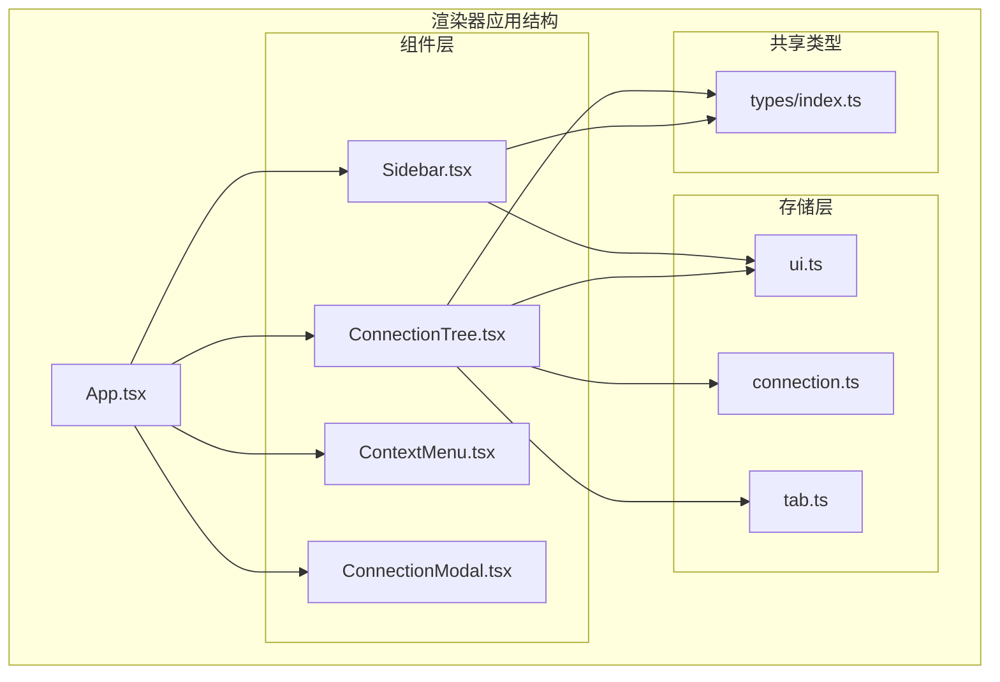
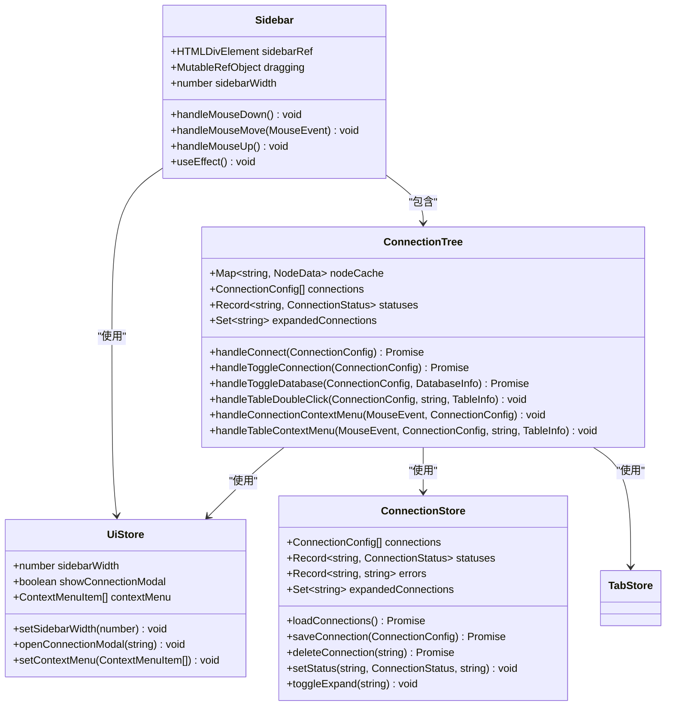
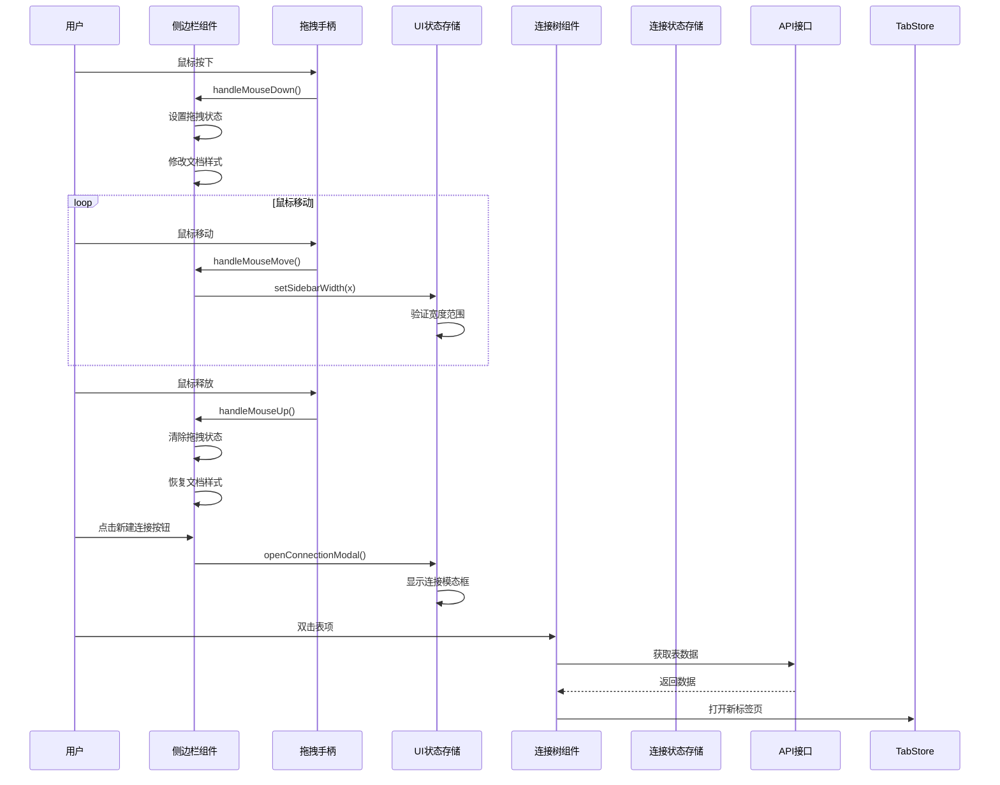
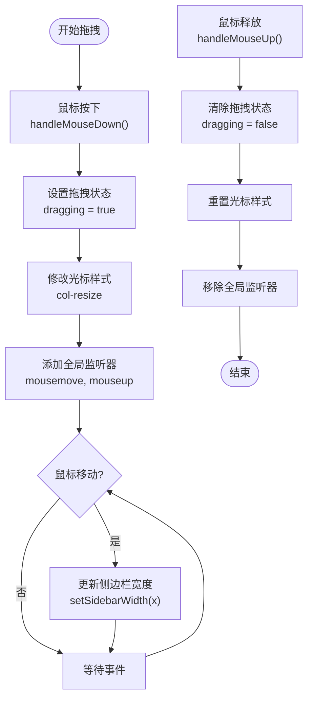
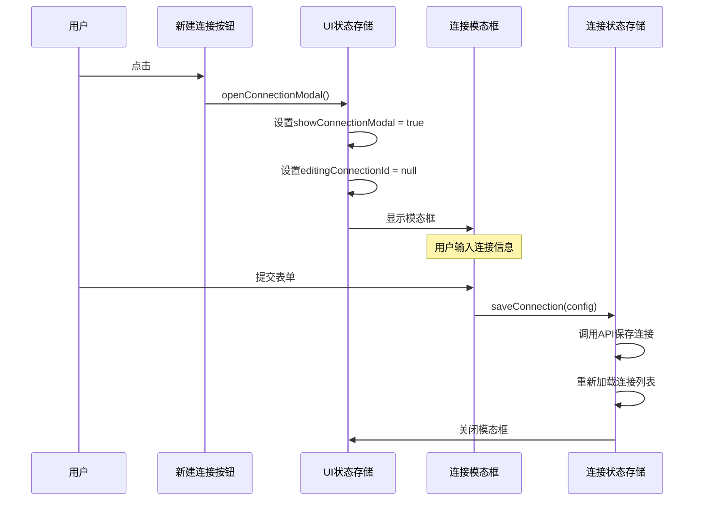
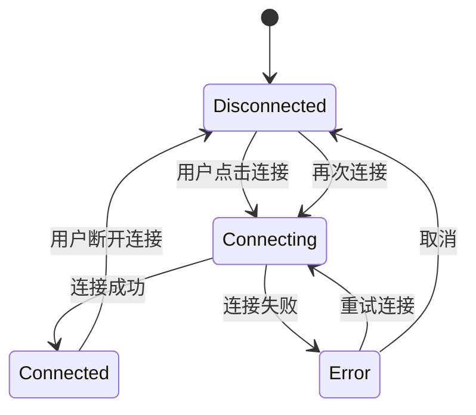
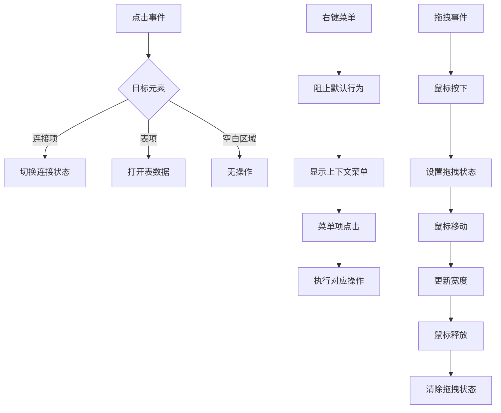
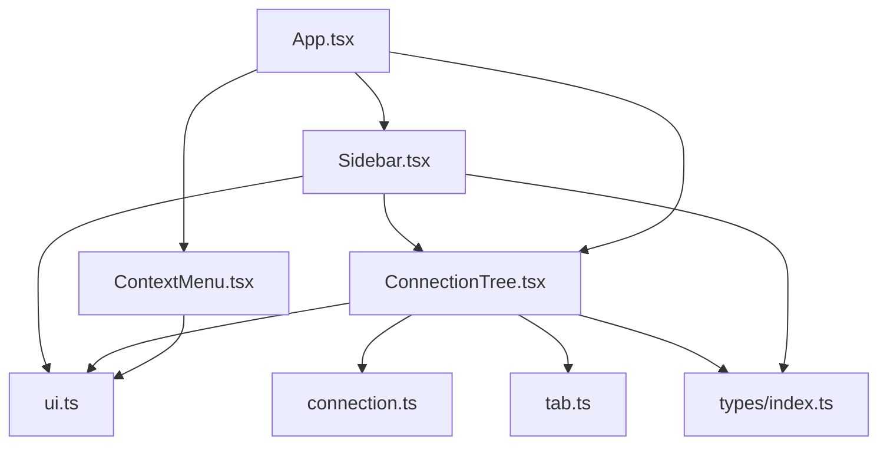

# 侧边栏组件

<cite>
**本文档引用的文件**
- [Sidebar.tsx](file://src/renderer/src/components/Sidebar.tsx)
- [ConnectionTree.tsx](file://src/renderer/src/components/ConnectionTree.tsx)
- [ui.ts](file://src/renderer/src/stores/ui.ts)
- [connection.ts](file://src/renderer/src/stores/connection.ts)
- [types/index.ts](file://src/shared/types/index.ts)
- [ContextMenu.tsx](file://src/renderer/src/components/ContextMenu.tsx)
- [App.tsx](file://src/renderer/src/App.tsx)
- [index.css](file://src/renderer/src/index.css)
- [tailwind.config.js](file://tailwind.config.js)
</cite>

## 目录
1. [简介](#简介)
2. [项目结构](#项目结构)
3. [核心组件](#核心组件)
4. [架构概览](#架构概览)
5. [详细组件分析](#详细组件分析)
6. [依赖关系分析](#依赖关系分析)
7. [性能考虑](#性能考虑)
8. [故障排除指南](#故障排除指南)
9. [结论](#结论)

## 简介

nexSql 的侧边栏组件是应用程序的核心界面组件之一，负责管理数据库连接、提供连接树视图以及支持用户交互操作。该组件采用现代化的 React 构建，结合 Zustand 状态管理库，实现了响应式的侧边栏功能。

侧边栏组件的主要功能包括：
- 可拖拽调整宽度的侧边栏容器
- 连接管理按钮（新建连接）
- 连接树集成（显示数据库连接状态和层次结构）
- 支持多种连接状态的可视化反馈
- 上下文菜单集成
- 响应式布局设计

## 项目结构

侧边栏组件位于渲染器应用的组件目录中，与连接树、上下文菜单等其他UI组件协同工作。

**图表来源**
- [App.tsx:1-24](file://src/renderer/src/App.tsx#L1-L24)
- [Sidebar.tsx:1-80](file://src/renderer/src/components/Sidebar.tsx#L1-L80)
- [ConnectionTree.tsx:1-313](file://src/renderer/src/components/ConnectionTree.tsx#L1-L313)

**章节来源**
- [App.tsx:1-24](file://src/renderer/src/App.tsx#L1-L24)
- [Sidebar.tsx:1-80](file://src/renderer/src/components/Sidebar.tsx#L1-L80)

## 核心组件

### 侧边栏组件架构

侧边栏组件采用函数式组件设计，集成了多个功能模块：

**图表来源**
- [Sidebar.tsx:6-80](file://src/renderer/src/components/Sidebar.tsx#L6-L80)
- [ConnectionTree.tsx:31-313](file://src/renderer/src/components/ConnectionTree.tsx#L31-L313)
- [ui.ts:26-41](file://src/renderer/src/stores/ui.ts#L26-L41)
- [connection.ts:17-64](file://src/renderer/src/stores/connection.ts#L17-L64)

### 状态管理设计

组件采用分层状态管理模式：

1. **UI状态管理**：通过 Zustand 管理侧边栏宽度、模态框状态、上下文菜单等UI相关状态
2. **连接状态管理**：独立的状态存储管理数据库连接信息、连接状态和错误信息
3. **缓存机制**：使用内存缓存优化连接树的性能表现

**章节来源**
- [ui.ts:1-41](file://src/renderer/src/stores/ui.ts#L1-L41)
- [connection.ts:1-64](file://src/renderer/src/stores/connection.ts#L1-L64)

## 架构概览

侧边栏组件的整体架构体现了清晰的关注点分离和模块化设计：

**图表来源**
- [Sidebar.tsx:13-41](file://src/renderer/src/components/Sidebar.tsx#L13-L41)
- [ui.ts:33-39](file://src/renderer/src/stores/ui.ts#L33-L39)
- [ConnectionTree.tsx:100-125](file://src/renderer/src/components/ConnectionTree.tsx#L100-L125)

## 详细组件分析

### 侧边栏宽度调整功能

侧边栏的宽度调整功能是通过拖拽手柄实现的，采用了全局事件监听机制：

#### 拖拽交互机制

**图表来源**
- [Sidebar.tsx:13-41](file://src/renderer/src/components/Sidebar.tsx#L13-L41)

#### 状态验证和边界控制

UI状态存储对侧边栏宽度进行了严格的边界控制：

- 最小宽度：180px
- 最大宽度：500px
- 自动边界检查确保用户体验的一致性

**章节来源**
- [Sidebar.tsx:13-41](file://src/renderer/src/components/Sidebar.tsx#L13-L41)
- [ui.ts:33](file://src/renderer/src/stores/ui.ts#L33)

### 连接管理按钮

侧边栏顶部提供了连接管理功能，包括新建连接按钮和连接状态指示器：

#### 连接按钮功能

**图表来源**
- [Sidebar.tsx:56-62](file://src/renderer/src/components/Sidebar.tsx#L56-L62)
- [ui.ts:35-36](file://src/renderer/src/stores/ui.ts#L35-L36)
- [connection.ts:28-31](file://src/renderer/src/stores/connection.ts#L28-L31)

**章节来源**
- [Sidebar.tsx:56-62](file://src/renderer/src/components/Sidebar.tsx#L56-L62)
- [ui.ts:35-36](file://src/renderer/src/stores/ui.ts#L35-L36)

### 连接树集成

连接树组件提供了完整的数据库连接层次结构展示：

#### 连接状态管理

**图表来源**
- [ConnectionTree.tsx:40-75](file://src/renderer/src/components/ConnectionTree.tsx#L40-L75)
- [types/index.ts:24](file://src/shared/types/index.ts#L24)

#### 数据缓存策略

连接树使用内存缓存优化性能：

- **连接级缓存**：缓存每个连接的数据库列表
- **数据库级缓存**：缓存每个数据库的表列表
- **懒加载机制**：仅在用户展开时加载数据
- **缓存清理**：断开连接时自动清理相关缓存

**章节来源**
- [ConnectionTree.tsx:22-29](file://src/renderer/src/components/ConnectionTree.tsx#L22-L29)
- [ConnectionTree.tsx:77-98](file://src/renderer/src/components/ConnectionTree.tsx#L77-L98)

### 事件处理流程

组件实现了完整的事件处理机制，包括用户交互和系统事件：

#### 鼠标事件处理

**图表来源**
- [ConnectionTree.tsx:127-157](file://src/renderer/src/components/ConnectionTree.tsx#L127-L157)
- [Sidebar.tsx:13-31](file://src/renderer/src/components/Sidebar.tsx#L13-L31)

**章节来源**
- [ConnectionTree.tsx:127-189](file://src/renderer/src/components/ConnectionTree.tsx#L127-L189)
- [Sidebar.tsx:13-41](file://src/renderer/src/components/Sidebar.tsx#L13-L41)

## 依赖关系分析

### 组件间依赖关系

**图表来源**
- [Sidebar.tsx:3-4](file://src/renderer/src/components/Sidebar.tsx#L3-L4)
- [ConnectionTree.tsx:17-19](file://src/renderer/src/components/ConnectionTree.tsx#L17-L19)
- [App.tsx:3-6](file://src/renderer/src/App.tsx#L3-L6)

### 外部依赖分析

组件依赖的关键外部库和工具：

- **Lucide React**：图标库，提供统一的视觉元素
- **Zustand**：轻量级状态管理库
- **Tailwind CSS**：原子化CSS框架
- **React**：用户界面库

**章节来源**
- [Sidebar.tsx:1-4](file://src/renderer/src/components/Sidebar.tsx#L1-L4)
- [ConnectionTree.tsx:16-19](file://src/renderer/src/components/ConnectionTree.tsx#L16-L19)

## 性能考虑

### 缓存优化策略

1. **内存缓存**：使用 Map 结构缓存连接和数据库信息
2. **懒加载**：仅在需要时才加载数据
3. **状态最小化**：避免不必要的重新渲染

### 渲染优化

- 使用 React.memo 优化子组件渲染
- 合理的条件渲染减少DOM节点数量
- 防抖处理优化高频事件

### 内存管理

- 及时清理事件监听器
- 断开连接时清理缓存
- 控制状态存储大小

## 故障排除指南

### 常见问题及解决方案

#### 拖拽功能失效

**问题描述**：侧边栏无法调整宽度

**可能原因**：
- 全局事件监听器未正确绑定
- 拖拽状态管理异常
- 样式冲突

**解决步骤**：
1. 检查 handleMouseDown 函数是否正确设置拖拽状态
2. 验证全局 mousemove 和 mouseup 事件监听器
3. 确认样式文件中的 resize-handle 类定义

#### 连接状态显示异常

**问题描述**：连接状态图标不正确或状态更新延迟

**可能原因**：
- 状态存储同步问题
- API调用失败
- 缓存数据过期

**解决步骤**：
1. 检查 setStatus 函数的调用时机
2. 验证 API 响应格式
3. 确认缓存更新逻辑

#### 上下文菜单显示问题

**问题描述**：右键菜单无法正常显示或点击无效

**可能原因**：
- 事件冒泡阻止不当
- 菜单项配置错误
- DOM元素定位计算问题

**解决步骤**：
1. 检查 preventDefault 和 stopPropagation 的使用
2. 验证 ContextMenuItem 接口定义
3. 确认菜单定位算法

**章节来源**
- [Sidebar.tsx:13-41](file://src/renderer/src/components/Sidebar.tsx#L13-L41)
- [ConnectionTree.tsx:127-189](file://src/renderer/src/components/ConnectionTree.tsx#L127-L189)
- [ContextMenu.tsx:9-34](file://src/renderer/src/components/ContextMenu.tsx#L9-L34)

## 结论

nexSql 的侧边栏组件展现了现代前端开发的最佳实践，通过精心设计的状态管理和事件处理机制，提供了流畅的用户体验。组件具有以下特点：

### 设计优势

1. **模块化设计**：清晰的职责分离和组件边界
2. **状态管理**：合理的状态划分和持久化策略
3. **性能优化**：智能缓存和渲染优化
4. **用户体验**：直观的交互设计和视觉反馈

### 技术亮点

1. **拖拽交互**：平滑的宽度调整体验
2. **连接管理**：完整的连接生命周期管理
3. **上下文菜单**：丰富的右键操作支持
4. **响应式设计**：适配不同屏幕尺寸

### 扩展建议

1. **键盘导航**：支持键盘快捷键操作
2. **多语言支持**：国际化文本本地化
3. **主题定制**：支持用户自定义主题
4. **性能监控**：集成性能指标收集

该组件为整个应用程序提供了坚实的基础，通过其良好的架构设计和实现质量，为后续的功能扩展奠定了良好基础。