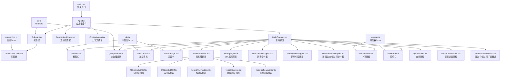
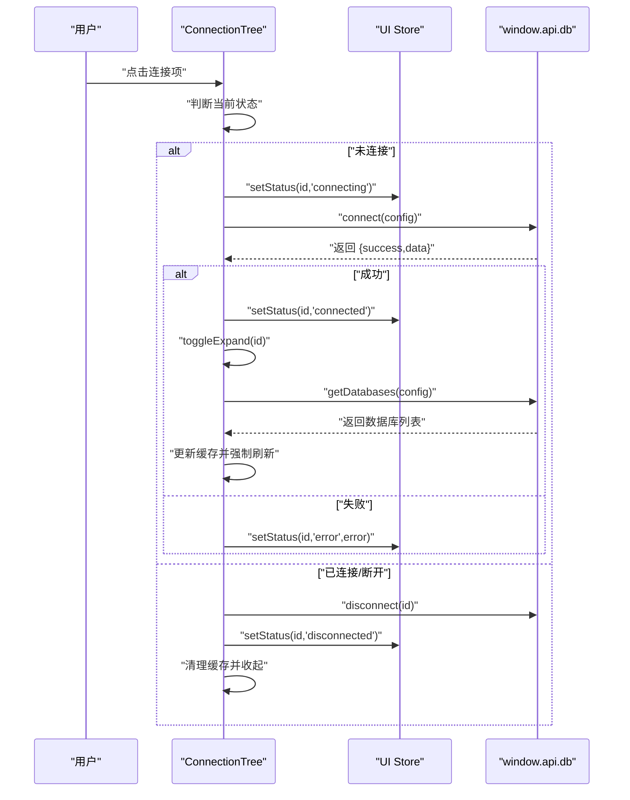
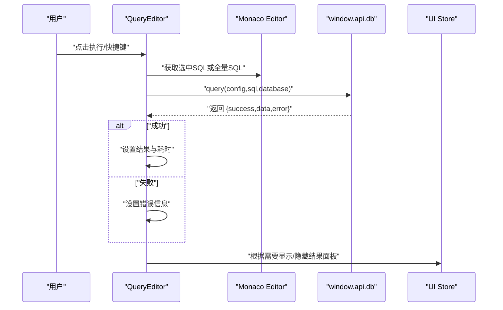
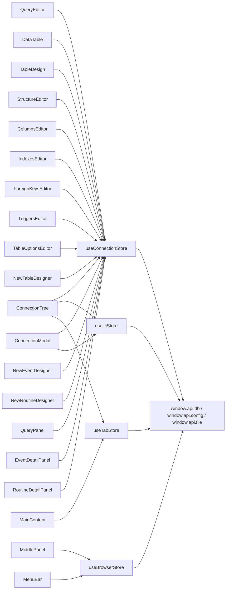

# 前端组件系统

<cite>
**本文档引用的文件**
- [src/renderer/src/App.tsx](file://src/renderer/src/App.tsx)
- [src/renderer/src/main.tsx](file://src/renderer/src/main.tsx)
- [src/renderer/src/components/Sidebar.tsx](file://src/renderer/src/components/Sidebar.tsx)
- [src/renderer/src/components/MainContent.tsx](file://src/renderer/src/components/MainContent.tsx)
- [src/renderer/src/components/ConnectionTree.tsx](file://src/renderer/src/components/ConnectionTree.tsx)
- [src/renderer/src/components/QueryEditor.tsx](file://src/renderer/src/components/QueryEditor.tsx)
- [src/renderer/src/components/DataTable.tsx](file://src/renderer/src/components/DataTable.tsx)
- [src/renderer/src/components/TableDesign.tsx](file://src/renderer/src/components/TableDesign.tsx)
- [src/renderer/src/components/TabBar.tsx](file://src/renderer/src/components/TabBar.tsx)
- [src/renderer/src/components/ConnectionModal.tsx](file://src/renderer/src/components/ConnectionModal.tsx)
- [src/renderer/src/components/ContextMenu.tsx](file://src/renderer/src/components/ContextMenu.tsx)
- [src/renderer/src/components/StructureEditor.tsx](file://src/renderer/src/components/StructureEditor.tsx)
- [src/renderer/src/components/SqlHighlight.tsx](file://src/renderer/src/components/SqlHighlight.tsx)
- [src/renderer/src/components/NewTableDesigner.tsx](file://src/renderer/src/components/NewTableDesigner.tsx)
- [src/renderer/src/components/NewEventDesigner.tsx](file://src/renderer/src/components/NewEventDesigner.tsx)
- [src/renderer/src/components/NewRoutineDesigner.tsx](file://src/renderer/src/components/NewRoutineDesigner.tsx)
- [src/renderer/src/components/editors/ColumnsEditor.tsx](file://src/renderer/src/components/editors/ColumnsEditor.tsx)
- [src/renderer/src/components/editors/IndexesEditor.tsx](file://src/renderer/src/components/editors/IndexesEditor.tsx)
- [src/renderer/src/components/editors/ForeignKeysEditor.tsx](file://src/renderer/src/components/editors/ForeignKeysEditor.tsx)
- [src/renderer/src/components/editors/TriggersEditor.tsx](file://src/renderer/src/components/editors/TriggersEditor.tsx)
- [src/renderer/src/components/editors/TableOptionsEditor.tsx](file://src/renderer/src/components/editors/TableOptionsEditor.tsx)
- [src/renderer/src/components/MiddlePanel.tsx](file://src/renderer/src/components/MiddlePanel.tsx)
- [src/renderer/src/components/MenuBar.tsx](file://src/renderer/src/components/MenuBar.tsx)
- [src/renderer/src/components/QueryPanel.tsx](file://src/renderer/src/components/QueryPanel.tsx)
- [src/renderer/src/components/EventDetailPanel.tsx](file://src/renderer/src/components/EventDetailPanel.tsx)
- [src/renderer/src/components/RoutineDetailPanel.tsx](file://src/renderer/src/components/RoutineDetailPanel.tsx)
- [src/renderer/src/stores/connection.ts](file://src/renderer/src/stores/connection.ts)
- [src/renderer/src/stores/tab.ts](file://src/renderer/src/stores/tab.ts)
- [src/renderer/src/stores/ui.ts](file://src/renderer/src/stores/ui.ts)
- [src/shared/types/index.ts](file://src/shared/types/index.ts)
</cite>

## 目录
1. [简介](#简介)
2. [项目结构](#项目结构)
3. [核心组件](#核心组件)
4. [架构总览](#架构总览)
5. [详细组件分析](#详细组件分析)
6. [依赖关系分析](#依赖关系分析)
7. [性能考量](#性能考量)
8. [故障排查指南](#故障排查指南)
9. [结论](#结论)
10. [附录](#附录)

## 简介
本文件面向 nexSql 前端组件系统，系统采用 Electron + React + TypeScript 技术栈，结合 Zustand 状态管理与 Monaco Editor 查询编辑器，构建了连接管理、树形导航、标签页切换、SQL 查询执行与结果展示、数据表格浏览与表结构设计等功能模块。本次更新反映了应用的重大架构演进：新增了完整的数据库对象设计器体系（表、事件、函数/存储过程）、结构编辑器与专用编辑器组件、中间面板与菜单栏等核心组件，形成了更加完善的数据库管理界面。本文从架构、组件职责、数据流与事件流、UI 规范与交互行为、可复用性与扩展性等方面进行深入解析，并提供可视化图示与使用建议。

## 项目结构
- 渲染进程入口位于 main.tsx，挂载根组件 App。
- App 负责初始化连接列表并渲染侧边栏、主内容区、连接模态框与上下文菜单。
- 新增组件体系包括：结构编辑器（StructureEditor）及其专用编辑器（ColumnsEditor、IndexesEditor、ForeignKeysEditor、TriggersEditor、TableOptionsEditor）、数据库对象设计器（NewTableDesigner、NewEventDesigner、NewRoutineDesigner）、中间面板（MiddlePanel）、菜单栏（MenuBar）、查询面板（QueryPanel）、详情面板（EventDetailPanel、RoutineDetailPanel）等。
- 组件按功能拆分为 Sidebar、MainContent、ConnectionTree、QueryEditor、DataTable、TableDesign、TabBar、ConnectionModal、ContextMenu、StructureEditor、SqlHighlight 等。
- 状态管理通过 Zustand 的 connection、tab、ui 三个 Store 实现，分别管理连接配置、标签页状态与 UI 尺寸/菜单状态。
- 类型定义集中在 shared/types 中，统一约束连接、元数据、查询结果与 IPC 响应格式。

**图表来源**
- [src/renderer/src/main.tsx:1-11](file://src/renderer/src/main.tsx#L1-L11)
- [src/renderer/src/App.tsx:1-24](file://src/renderer/src/App.tsx#L1-L24)
- [src/renderer/src/components/Sidebar.tsx:1-80](file://src/renderer/src/components/Sidebar.tsx#L1-L80)
- [src/renderer/src/components/MainContent.tsx:1-34](file://src/renderer/src/components/MainContent.tsx#L1-L34)
- [src/renderer/src/components/ConnectionTree.tsx:1-313](file://src/renderer/src/components/ConnectionTree.tsx#L1-L313)
- [src/renderer/src/components/QueryEditor.tsx:1-329](file://src/renderer/src/components/QueryEditor.tsx#L1-L329)
- [src/renderer/src/components/DataTable.tsx:1-297](file://src/renderer/src/components/DataTable.tsx#L1-L297)
- [src/renderer/src/components/TableDesign.tsx:1-241](file://src/renderer/src/components/TableDesign.tsx#L1-L241)
- [src/renderer/src/components/TabBar.tsx:1-53](file://src/renderer/src/components/TabBar.tsx#L1-L53)
- [src/renderer/src/components/ConnectionModal.tsx:1-230](file://src/renderer/src/components/ConnectionModal.tsx#L1-L230)
- [src/renderer/src/components/ContextMenu.tsx:1-79](file://src/renderer/src/components/ContextMenu.tsx#L1-L79)
- [src/renderer/src/components/StructureEditor.tsx:1-67](file://src/renderer/src/components/StructureEditor.tsx#L1-L67)
- [src/renderer/src/components/SqlHighlight.tsx:1-142](file://src/renderer/src/components/SqlHighlight.tsx#L1-L142)
- [src/renderer/src/components/NewTableDesigner.tsx:1-320](file://src/renderer/src/components/NewTableDesigner.tsx#L1-L320)
- [src/renderer/src/components/NewEventDesigner.tsx:1-166](file://src/renderer/src/components/NewEventDesigner.tsx#L1-L166)
- [src/renderer/src/components/NewRoutineDesigner.tsx:1-153](file://src/renderer/src/components/NewRoutineDesigner.tsx#L1-L153)
- [src/renderer/src/components/editors/ColumnsEditor.tsx:1-261](file://src/renderer/src/components/editors/ColumnsEditor.tsx#L1-L261)
- [src/renderer/src/components/editors/IndexesEditor.tsx:1-158](file://src/renderer/src/components/editors/IndexesEditor.tsx#L1-L158)
- [src/renderer/src/components/editors/ForeignKeysEditor.tsx:1-162](file://src/renderer/src/components/editors/ForeignKeysEditor.tsx#L1-L162)
- [src/renderer/src/components/editors/TriggersEditor.tsx:1-152](file://src/renderer/src/components/editors/TriggersEditor.tsx#L1-L152)
- [src/renderer/src/components/editors/TableOptionsEditor.tsx:1-146](file://src/renderer/src/components/editors/TableOptionsEditor.tsx#L1-L146)
- [src/renderer/src/components/MiddlePanel.tsx:1-770](file://src/renderer/src/components/MiddlePanel.tsx#L1-L770)
- [src/renderer/src/components/MenuBar.tsx:1-335](file://src/renderer/src/components/MenuBar.tsx#L1-L335)
- [src/renderer/src/components/QueryPanel.tsx:1-567](file://src/renderer/src/components/QueryPanel.tsx#L1-L567)
- [src/renderer/src/components/EventDetailPanel.tsx:1-149](file://src/renderer/src/components/EventDetailPanel.tsx#L1-L149)
- [src/renderer/src/components/RoutineDetailPanel.tsx:1-156](file://src/renderer/src/components/RoutineDetailPanel.tsx#L1-L156)
- [src/renderer/src/stores/connection.ts:1-64](file://src/renderer/src/stores/connection.ts#L1-L64)
- [src/renderer/src/stores/tab.ts:1-65](file://src/renderer/src/stores/tab.ts#L1-L65)
- [src/renderer/src/stores/ui.ts:1-41](file://src/renderer/src/stores/ui.ts#L1-L41)

**章节来源**
- [src/renderer/src/main.tsx:1-11](file://src/renderer/src/main.tsx#L1-L11)
- [src/renderer/src/App.tsx:1-24](file://src/renderer/src/App.tsx#L1-L24)

## 核心组件
- 侧边栏（Sidebar）：提供连接树区域与宽度拖拽能力；触发连接模态框。
- 连接树（ConnectionTree）：展示连接、数据库与表的层级结构；支持连接/断开、展开/折叠、上下文菜单、双击打开数据表、新建查询等。
- 主内容区（MainContent）：根据当前激活标签页动态渲染查询编辑器、数据表格或表设计视图。
- 查询编辑器（QueryEditor）：基于 Monaco Editor 的 SQL 编辑与执行；支持选择性执行、结果面板拖拽、CSV 导出、错误与耗时展示。
- 数据表格（DataTable）：分页加载表数据；支持筛选、排序、刷新与状态栏信息。
- 表设计（TableDesign）：展示表字段与索引信息，支持切换"字段/索引/信息"三个子页面。
- 结构编辑器（StructureEditor）：统一的表结构编辑入口，集成字段、索引、外键、触发器、表选项五个子编辑器。
- SQL高亮组件（SqlHighlight）：提供SQL语法高亮渲染功能，支持关键字、数据类型、字符串、注释等多类别着色。
- 数据库对象设计器：包括新表设计器（NewTableDesigner）、新事件设计器（NewEventDesigner）、新函数/存储过程设计器（NewRoutineDesigner），提供可视化的数据库对象创建界面。
- 专用编辑器组件：ColumnsEditor（字段编辑）、IndexesEditor（索引编辑）、ForeignKeysEditor（外键编辑）、TriggersEditor（触发器编辑）、TableOptionsEditor（表选项编辑），提供细粒度的数据库对象结构修改能力。
- 中间面板（MiddlePanel）：数据库对象管理面板，支持表、视图、函数、事件、查询等多种对象类型的列表展示与操作。
- 菜单栏（MenuBar）：应用级菜单系统，提供文件、视图、对象、工具、帮助等菜单项的操作入口。
- 查询面板（QueryPanel）：基于Monaco Editor的专业SQL编辑器，支持语法高亮、自动补全、多语句执行、结果导出等功能。
- 详情面板：EventDetailPanel（事件详情）、RoutineDetailPanel（函数/存储过程详情），提供数据库对象的详细信息展示与DDL查看功能。
- 标签栏（TabBar）：多标签页切换与关闭；根据标签类型显示不同图标。
- 连接模态框（ConnectionModal）：新建/编辑连接配置；支持测试连接与保存。
- 上下文菜单（ContextMenu）：全局上下文菜单，自动避屏。

**章节来源**
- [src/renderer/src/components/Sidebar.tsx:1-80](file://src/renderer/src/components/Sidebar.tsx#L1-L80)
- [src/renderer/src/components/ConnectionTree.tsx:1-313](file://src/renderer/src/components/ConnectionTree.tsx#L1-L313)
- [src/renderer/src/components/MainContent.tsx:1-34](file://src/renderer/src/components/MainContent.tsx#L1-L34)
- [src/renderer/src/components/QueryEditor.tsx:1-329](file://src/renderer/src/components/QueryEditor.tsx#L1-L329)
- [src/renderer/src/components/DataTable.tsx:1-297](file://src/renderer/src/components/DataTable.tsx#L1-L297)
- [src/renderer/src/components/TableDesign.tsx:1-241](file://src/renderer/src/components/TableDesign.tsx#L1-L241)
- [src/renderer/src/components/StructureEditor.tsx:1-67](file://src/renderer/src/components/StructureEditor.tsx#L1-L67)
- [src/renderer/src/components/SqlHighlight.tsx:1-142](file://src/renderer/src/components/SqlHighlight.tsx#L1-L142)
- [src/renderer/src/components/NewTableDesigner.tsx:1-320](file://src/renderer/src/components/NewTableDesigner.tsx#L1-L320)
- [src/renderer/src/components/NewEventDesigner.tsx:1-166](file://src/renderer/src/components/NewEventDesigner.tsx#L1-L166)
- [src/renderer/src/components/NewRoutineDesigner.tsx:1-153](file://src/renderer/src/components/NewRoutineDesigner.tsx#L1-L153)
- [src/renderer/src/components/editors/ColumnsEditor.tsx:1-261](file://src/renderer/src/components/editors/ColumnsEditor.tsx#L1-L261)
- [src/renderer/src/components/editors/IndexesEditor.tsx:1-158](file://src/renderer/src/components/editors/IndexesEditor.tsx#L1-L158)
- [src/renderer/src/components/editors/ForeignKeysEditor.tsx:1-162](file://src/renderer/src/components/editors/ForeignKeysEditor.tsx#L1-L162)
- [src/renderer/src/components/editors/TriggersEditor.tsx:1-152](file://src/renderer/src/components/editors/TriggersEditor.tsx#L1-L152)
- [src/renderer/src/components/editors/TableOptionsEditor.tsx:1-146](file://src/renderer/src/components/editors/TableOptionsEditor.tsx#L1-L146)
- [src/renderer/src/components/MiddlePanel.tsx:1-770](file://src/renderer/src/components/MiddlePanel.tsx#L1-L770)
- [src/renderer/src/components/MenuBar.tsx:1-335](file://src/renderer/src/components/MenuBar.tsx#L1-L335)
- [src/renderer/src/components/QueryPanel.tsx:1-567](file://src/renderer/src/components/QueryPanel.tsx#L1-L567)
- [src/renderer/src/components/EventDetailPanel.tsx:1-149](file://src/renderer/src/components/EventDetailPanel.tsx#L1-L149)
- [src/renderer/src/components/RoutineDetailPanel.tsx:1-156](file://src/renderer/src/components/RoutineDetailPanel.tsx#L1-L156)
- [src/renderer/src/components/TabBar.tsx:1-53](file://src/renderer/src/components/TabBar.tsx#L1-L53)
- [src/renderer/src/components/ConnectionModal.tsx:1-230](file://src/renderer/src/components/ConnectionModal.tsx#L1-L230)
- [src/renderer/src/components/ContextMenu.tsx:1-79](file://src/renderer/src/components/ContextMenu.tsx#L1-L79)

## 架构总览
系统采用"组件 + Store + IPC"的分层架构，新增了专门的对象设计器体系和结构编辑器：
- 组件层：负责 UI 展示与用户交互，包含基础组件、专用编辑器、数据库对象设计器、中间面板等。
- Store 层：Zustand 管理连接、标签页、UI 状态与浏览器状态，避免跨组件复杂 props 传递。
- IPC 层：通过 window.api.db 与 window.api.config 与主进程通信，执行数据库操作与读写配置。

```mermaid
graph TB
subgraph "组件层"
S["Sidebar"]
CT["ConnectionTree"]
MC["MainContent"]
TB["TabBar"]
QE["QueryEditor"]
DT["DataTable"]
TD["TableDesign"]
CM["ConnectionModal"]
CX["ContextMenu"]
SE["StructureEditor"]
CE["ColumnsEditor"]
IE["IndexesEditor"]
FE["ForeignKeysEditor"]
TE["TriggersEditor"]
TOE["TableOptionsEditor"]
SH["SqlHighlight"]
NTD["NewTableDesigner"]
NED["NewEventDesigner"]
NRD["NewRoutineDesigner"]
MP["MiddlePanel"]
MB["MenuBar"]
QP["QueryPanel"]
EDP["EventDetailPanel"]
RDP["RoutineDetailPanel"]
end
subgraph "状态层(Zustand)"
ST1["useConnectionStore"]
ST2["useTabStore"]
ST3["useUiStore"]
ST4["useBrowserStore"]
end
subgraph "IPC 层"
IPC1["window.api.db.*"]
IPC2["window.api.config.*"]
IPC3["window.api.file.*"]
end
S --> ST3
CT --> ST1
CT --> ST3
MC --> ST2
TB --> ST2
QE --> ST1
DT --> ST1
TD --> ST1
CM --> ST1
CM --> ST3
SE --> ST1
CE --> ST1
IE --> ST1
FE --> ST1
TE --> ST1
TOE --> ST1
NTD --> ST1
NED --> ST1
NRD --> ST1
MP --> ST4
MB --> ST4
QP --> ST1
EDP --> ST1
RDP --> ST1
ST1 --> IPC2
ST1 --> IPC1
ST2 --> IPC1
ST3 --> IPC1
ST4 --> IPC1
QE --> IPC1
DT --> IPC1
TD --> IPC1
SE --> IPC1
CE --> IPC1
IE --> IPC1
FE --> IPC1
TE --> IPC1
TOE --> IPC1
NTD --> IPC1
NED --> IPC1
NRD --> IPC1
QP --> IPC1
EDP --> IPC1
RDP --> IPC1
```

**图表来源**
- [src/renderer/src/components/Sidebar.tsx:1-80](file://src/renderer/src/components/Sidebar.tsx#L1-L80)
- [src/renderer/src/components/ConnectionTree.tsx:1-313](file://src/renderer/src/components/ConnectionTree.tsx#L1-L313)
- [src/renderer/src/components/MainContent.tsx:1-34](file://src/renderer/src/components/MainContent.tsx#L1-L34)
- [src/renderer/src/components/QueryEditor.tsx:1-329](file://src/renderer/src/components/QueryEditor.tsx#L1-L329)
- [src/renderer/src/components/DataTable.tsx:1-297](file://src/renderer/src/components/DataTable.tsx#L1-L297)
- [src/renderer/src/components/TableDesign.tsx:1-241](file://src/renderer/src/components/TableDesign.tsx#L1-L241)
- [src/renderer/src/components/TabBar.tsx:1-53](file://src/renderer/src/components/TabBar.tsx#L1-L53)
- [src/renderer/src/components/ConnectionModal.tsx:1-230](file://src/renderer/src/components/ConnectionModal.tsx#L1-L230)
- [src/renderer/src/components/ContextMenu.tsx:1-79](file://src/renderer/src/components/ContextMenu.tsx#L1-L79)
- [src/renderer/src/components/StructureEditor.tsx:1-67](file://src/renderer/src/components/StructureEditor.tsx#L1-L67)
- [src/renderer/src/components/SqlHighlight.tsx:1-142](file://src/renderer/src/components/SqlHighlight.tsx#L1-L142)
- [src/renderer/src/components/NewTableDesigner.tsx:1-320](file://src/renderer/src/components/NewTableDesigner.tsx#L1-L320)
- [src/renderer/src/components/NewEventDesigner.tsx:1-166](file://src/renderer/src/components/NewEventDesigner.tsx#L1-L166)
- [src/renderer/src/components/NewRoutineDesigner.tsx:1-153](file://src/renderer/src/components/NewRoutineDesigner.tsx#L1-L153)
- [src/renderer/src/components/editors/ColumnsEditor.tsx:1-261](file://src/renderer/src/components/editors/ColumnsEditor.tsx#L1-L261)
- [src/renderer/src/components/editors/IndexesEditor.tsx:1-158](file://src/renderer/src/components/editors/IndexesEditor.tsx#L1-L158)
- [src/renderer/src/components/editors/ForeignKeysEditor.tsx:1-162](file://src/renderer/src/components/ForeignKeysEditor.tsx#L1-L162)
- [src/renderer/src/components/editors/TriggersEditor.tsx:1-152](file://src/renderer/src/components/TriggersEditor.tsx#L1-L152)
- [src/renderer/src/components/editors/TableOptionsEditor.tsx:1-146](file://src/renderer/src/components/TableOptionsEditor.tsx#L1-L146)
- [src/renderer/src/components/MiddlePanel.tsx:1-770](file://src/renderer/src/components/MiddlePanel.tsx#L1-L770)
- [src/renderer/src/components/MenuBar.tsx:1-335](file://src/renderer/src/components/MenuBar.tsx#L1-L335)
- [src/renderer/src/components/QueryPanel.tsx:1-567](file://src/renderer/src/components/QueryPanel.tsx#L1-L567)
- [src/renderer/src/components/EventDetailPanel.tsx:1-149](file://src/renderer/src/components/EventDetailPanel.tsx#L1-L149)
- [src/renderer/src/components/RoutineDetailPanel.tsx:1-156](file://src/renderer/src/components/RoutineDetailPanel.tsx#L1-L156)
- [src/renderer/src/stores/connection.ts:1-64](file://src/renderer/src/stores/connection.ts#L1-L64)
- [src/renderer/src/stores/tab.ts:1-65](file://src/renderer/src/stores/tab.ts#L1-L65)
- [src/renderer/src/stores/ui.ts:1-41](file://src/renderer/src/stores/ui.ts#L1-L41)
- [src/renderer/src/stores/browser.ts](file://src/renderer/src/stores/browser.ts)

## 详细组件分析

### 侧边栏（Sidebar）
- 功能要点
  - 顶部工具栏：标题与"新建连接"按钮，点击触发 UI Store 打开连接模态框。
  - 连接树容器：承载 ConnectionTree。
  - 水平拖拽：通过全局 mousemove/mouseup 监听改变侧边栏宽度，受 UI Store 管理。
- 关键交互
  - 鼠标按下进入拖拽状态，移动时调用 setSidebarWidth；抬起结束拖拽。
  - 使用 useRef 引用 div 容器，样式通过响应式宽度控制。
- 设计规范
  - 背景色与边框遵循主题变量，宽度范围限制在 180–500px。

**章节来源**
- [src/renderer/src/components/Sidebar.tsx:1-80](file://src/renderer/src/components/Sidebar.tsx#L1-L80)
- [src/renderer/src/stores/ui.ts:26-40](file://src/renderer/src/stores/ui.ts#L26-L40)

### 连接树（ConnectionTree）
- 功能要点
  - 展示连接列表，支持连接/断开、展开/折叠数据库与表。
  - 双击表项打开"表数据"标签页；右键弹出上下文菜单。
  - 新建查询、编辑连接、删除连接等操作。
- 数据与状态
  - 使用连接 Store 管理连接配置、状态与展开集合；UI Store 管理上下文菜单。
  - 使用内存缓存 nodeCache 存储数据库与表列表，减少重复请求。
- 事件流程（连接/断开）

**图表来源**
- [src/renderer/src/components/ConnectionTree.tsx:40-75](file://src/renderer/src/components/ConnectionTree.tsx#L40-L75)
- [src/renderer/src/stores/connection.ts:47-51](file://src/renderer/src/stores/connection.ts#L47-L51)

**章节来源**
- [src/renderer/src/components/ConnectionTree.tsx:1-313](file://src/renderer/src/components/ConnectionTree.tsx#L1-L313)
- [src/renderer/src/stores/connection.ts:1-64](file://src/renderer/src/stores/connection.ts#L1-L64)
- [src/renderer/src/stores/ui.ts:17-24](file://src/renderer/src/stores/ui.ts#L17-L24)

### 主内容区（MainContent）
- 功能要点
  - 根据激活标签页类型渲染对应视图：查询编辑器、数据表格、表设计。
  - 当无激活标签时，显示引导占位。
- 控制逻辑
  - 通过标签页 Store 获取 tabs 与 activeTabId，定位当前激活项。

**章节来源**
- [src/renderer/src/components/MainContent.tsx:1-34](file://src/renderer/src/components/MainContent.tsx#L1-L34)
- [src/renderer/src/stores/tab.ts:15-64](file://src/renderer/src/stores/tab.ts#L15-L64)

### 查询编辑器（QueryEditor）
- 功能要点
  - 基于 Monaco Editor 的 SQL 编辑与快捷键执行（Ctrl/Cmd + Enter）。
  - 支持选择性执行、结果面板拖拽调整高度、CSV 导出、错误与耗时展示。
  - 自动识别当前连接与数据库，执行 SQL 并渲染结果。
- 关键流程（执行查询）

**图表来源**
- [src/renderer/src/components/QueryEditor.tsx:36-64](file://src/renderer/src/components/QueryEditor.tsx#L36-L64)
- [src/renderer/src/components/QueryEditor.tsx:108-138](file://src/renderer/src/components/QueryEditor.tsx#L108-L138)
- [src/renderer/src/stores/ui.ts:33-34](file://src/renderer/src/stores/ui.ts#L33-L34)

**章节来源**
- [src/renderer/src/components/QueryEditor.tsx:1-329](file://src/renderer/src/components/QueryEditor.tsx#L1-L329)
- [src/renderer/src/stores/connection.ts:30](file://src/renderer/src/stores/connection.ts#L30)
- [src/renderer/src/stores/ui.ts:26-40](file://src/renderer/src/stores/ui.ts#L26-L40)

### 数据表格（DataTable）
- 功能要点
  - 分页加载表数据（每页固定大小），支持筛选、排序、刷新与状态栏信息。
  - 通过 react-data-grid 渲染，冻结首列行号，列宽可调，排序由 Grid 内部处理。
- 关键流程（加载数据）

**图表来源**
- [src/renderer/src/components/DataTable.tsx:41-87](file://src/renderer/src/components/DataTable.tsx#L41-L87)
- [src/renderer/src/components/DataTable.tsx:90-110](file://src/renderer/src/components/DataTable.tsx#L90-L110)
- [src/renderer/src/components/DataTable.tsx:121-137](file://src/renderer/src/components/DataTable.tsx#L121-L137)

**章节来源**
- [src/renderer/src/components/DataTable.tsx:1-297](file://src/renderer/src/components/DataTable.tsx#L1-L297)

### 表设计（TableDesign）
- 功能要点
  - "字段/索引/信息"三页切换，异步加载列与索引信息。
  - 字段类型图标分类，主键高亮。
- 交互行为
  - 通过 Promise.all 并行加载列与索引，提升响应速度。

**章节来源**
- [src/renderer/src/components/TableDesign.tsx:1-241](file://src/renderer/src/components/TableDesign.tsx#L1-L241)

### 结构编辑器（StructureEditor）
- 功能要点
  - 统一的表结构编辑入口，提供"字段/索引/外键/触发器/表选项"五个子标签页。
  - 集成专用编辑器组件，支持表结构的可视化编辑与批量操作。
- 交互行为
  - 通过子标签页切换不同的编辑器，每个编辑器独立管理自己的状态与操作。
  - 支持批量提交与回滚操作，提供状态提示与错误处理。

**章节来源**
- [src/renderer/src/components/StructureEditor.tsx:1-67](file://src/renderer/src/components/StructureEditor.tsx#L1-L67)

### SQL高亮组件（SqlHighlight）
- 功能要点
  - 提供SQL语法高亮渲染功能，支持关键字、数据类型、字符串、反引号标识符、数字、注释、函数、标点符号等多类别着色。
  - 内置完整的SQL关键字和数据类型词典，支持精确的语法分析。
- 技术实现
  - 通过正则表达式进行词法分析，将SQL文本分解为Token序列。
  - 每个Token根据类型应用相应的CSS类名进行着色。
  - 支持自定义样式类名映射，便于主题定制。

**章节来源**
- [src/renderer/src/components/SqlHighlight.tsx:1-142](file://src/renderer/src/components/SqlHighlight.tsx#L1-L142)

### 数据库对象设计器

#### 新表设计器（NewTableDesigner）
- 功能要点
  - 提供可视化的表创建界面，支持字段定义、表选项配置、引擎选择等。
  - 支持字段的增删改、排序、主键设置、默认值配置等。
  - 自动生成标准的CREATE TABLE SQL语句并执行创建。
- 关键特性
  - 字段表格支持实时编辑，提供MySQL数据类型下拉选择。
  - 支持表选项配置（引擎、字符集、注释等）。
  - 错误提示与验证，确保表名和字段的有效性。

**章节来源**
- [src/renderer/src/components/NewTableDesigner.tsx:1-320](file://src/renderer/src/components/NewTableDesigner.tsx#L1-L320)

#### 新事件设计器（NewEventDesigner）
- 功能要点
  - 提供事件创建的可视化界面，支持一次性事件和周期性事件两种模式。
  - 支持事件调度配置（AT时间点或EVERY间隔）、完成后处理、状态控制等。
  - 事件体编辑支持多行SQL语句编写。
- 关键特性
  - 动态生成CREATE EVENT SQL语句。
  - 支持事件状态的启用/禁用切换。
  - 完整的事件生命周期管理。

**章节来源**
- [src/renderer/src/components/NewEventDesigner.tsx:1-166](file://src/renderer/src/components/NewEventDesigner.tsx#L1-L166)

#### 新函数/存储过程设计器（NewRoutineDesigner）
- 功能要点
  - 提供函数和存储过程创建的统一界面，支持两种类型的选择。
  - 支持参数定义、返回类型配置（函数特有）、函数体编辑等。
  - 自动生成标准的CREATE FUNCTION/PROCEDURE SQL语句。
- 关键特性
  - 根据选择的类型自动切换界面元素（函数返回类型输入框）。
  - 函数体和存储过程体的编辑器支持多行SQL编写。
  - 内置基本的函数体模板，便于快速开始。

**章节来源**
- [src/renderer/src/components/NewRoutineDesigner.tsx:1-153](file://src/renderer/src/components/NewRoutineDesigner.tsx#L1-L153)

### 专用编辑器组件

#### 字段编辑器（ColumnsEditor）
- 功能要点
  - 提供表字段的可视化编辑界面，支持字段的增删改、排序、主键设置等。
  - 支持字段类型的实时验证与默认值配置。
  - 自动生成ALTER TABLE SQL语句并执行结构变更。
- 关键特性
  - 支持字段的新增、删除、修改操作，区分新字段与现有字段。
  - 提供字段级别的状态跟踪（新增、修改、删除）。
  - 支持批量提交与回滚操作。

**章节来源**
- [src/renderer/src/components/editors/ColumnsEditor.tsx:1-261](file://src/renderer/src/components/editors/ColumnsEditor.tsx#L1-L261)

#### 索引编辑器（IndexesEditor）
- 功能要点
  - 提供表索引的可视化管理界面，支持索引的创建、修改、删除等操作。
  - 支持唯一索引与普通索引的配置，索引字段的定义。
  - 自动生成ALTER TABLE SQL语句并执行索引结构变更。
- 关键特性
  - 区分主键索引与其他索引的特殊处理。
  - 支持索引名称的唯一性验证。
  - 提供索引类型的可视化标识。

**章节来源**
- [src/renderer/src/components/editors/IndexesEditor.tsx:1-158](file://src/renderer/src/components/editors/IndexesEditor.tsx#L1-L158)

#### 外键编辑器（ForeignKeysEditor）
- 功能要点
  - 提供表外键的可视化配置界面，支持外键约束的创建与管理。
  - 支持引用表、引用字段、更新/删除动作等配置。
  - 自动生成ALTER TABLE SQL语句并执行外键约束设置。
- 关键特性
  - 支持多种外键动作配置（RESTRICT、CASCADE、SET NULL等）。
  - 提供引用关系的可视化标识。
  - 区分新外键与现有外键的管理方式。

**章节来源**
- [src/renderer/src/components/editors/ForeignKeysEditor.tsx:1-162](file://src/renderer/src/components/editors/ForeignKeysEditor.tsx#L1-L162)

#### 触发器编辑器（TriggersEditor）
- 功能要点
  - 提供表触发器的可视化创建界面，支持触发时机（BEFORE/AFTER）和事件类型（INSERT/UPDATE/DELETE）配置。
  - 支持触发器主体的多行SQL语句编辑。
  - 自动生成CREATE TRIGGER SQL语句并执行触发器创建。
- 关键特性
  - 支持触发器的展开/折叠显示，便于管理复杂的触发器逻辑。
  - 提供触发器类型的可视化标识。
  - 支持触发器的创建与删除操作。

**章节来源**
- [src/renderer/src/components/editors/TriggersEditor.tsx:1-152](file://src/renderer/src/components/editors/TriggersEditor.tsx#L1-L152)

#### 表选项编辑器（TableOptionsEditor）
- 功能要点
  - 提供表级别的选项配置界面，支持存储引擎、字符集、排序规则、行格式等配置。
  - 支持表注释、自增起始值等高级选项的设置。
  - 自动生成ALTER TABLE SQL语句并执行表选项变更。
- 关键特性
  - 提供预定义的选项值列表，确保配置的有效性。
  - 支持表选项的增量修改，只提交变更的内容。
  - 提供表选项的可视化分类展示。

**章节来源**
- [src/renderer/src/components/editors/TableOptionsEditor.tsx:1-146](file://src/renderer/src/components/editors/TableOptionsEditor.tsx#L1-L146)

### 中间面板（MiddlePanel）
- 功能要点
  - 数据库对象管理面板，支持表、视图、函数、事件、查询等多种对象类型的列表展示。
  - 提供对象的搜索、排序、批量操作等功能。
  - 支持对象的右键菜单操作（复制、重命名、删除、导出等）。
- 关键特性
  - 动态加载不同类型的数据库对象列表。
  - 支持对象的双击打开、右键菜单、工具栏操作等。
  - 提供对象状态的可视化标识（引擎、可更新性、状态等）。

**章节来源**
- [src/renderer/src/components/MiddlePanel.tsx:1-770](file://src/renderer/src/components/MiddlePanel.tsx#L1-L770)

### 菜单栏（MenuBar）
- 功能要点
  - 应用级菜单系统，提供文件、视图、对象、工具、帮助等菜单项的操作入口。
  - 支持快捷键操作，提供丰富的数据库管理功能。
  - 集成全局事件处理，支持外部组件的菜单操作。
- 关键特性
  - 下拉菜单的动态展开与关闭控制。
  - 支持菜单项的禁用状态管理。
  - 提供数据库状态的实时显示。

**章节来源**
- [src/renderer/src/components/MenuBar.tsx:1-335](file://src/renderer/src/components/MenuBar.tsx#L1-L335)

### 查询面板（QueryPanel）
- 功能要点
  - 基于Monaco Editor的专业SQL编辑器，支持语法高亮、自动补全、多语句执行、结果导出等功能。
  - 提供SQL格式化、查询保存、结果集导出等高级功能。
  - 支持表字段的智能补全，提升SQL编写效率。
- 关键特性
  - 多语句执行支持，提供详细的执行结果统计。
  - 表字段缓存机制，避免重复查询。
  - 支持SQL格式化和结果集的CSV/JSON导出。

**章节来源**
- [src/renderer/src/components/QueryPanel.tsx:1-567](file://src/renderer/src/components/QueryPanel.tsx#L1-L567)

### 详情面板

#### 事件详情面板（EventDetailPanel）
- 功能要点
  - 提供事件对象的详细信息展示，支持常规信息与DDL查看两个标签页。
  - 显示事件的基本信息（类型、状态、时间等）和完整的DDL语句。
  - 支持DDL语句的复制功能。
- 关键特性
  - 动态加载事件的DDL语句，支持SHOW CREATE EVENT命令。
  - 提供事件状态的可视化标识。
  - 支持事件注释的详细展示。

**章节来源**
- [src/renderer/src/components/EventDetailPanel.tsx:1-149](file://src/renderer/src/components/EventDetailPanel.tsx#L1-L149)

#### 函数/存储过程详情面板（RoutineDetailPanel）
- 功能要点
  - 提供函数和存储过程对象的详细信息展示，支持常规信息与DDL查看两个标签页。
  - 显示对象的基本信息（类型、返回类型、安全属性等）和完整的DDL语句。
  - 支持DDL语句的复制功能。
- 关键特性
  - 根据对象类型动态加载对应的DDL语句（SHOW CREATE FUNCTION/PROCEDURE）。
  - 提供对象类型的可视化标识（橙色表示函数，黄色表示存储过程）。
  - 支持对象注释的详细展示。

**章节来源**
- [src/renderer/src/components/RoutineDetailPanel.tsx:1-156](file://src/renderer/src/components/RoutineDetailPanel.tsx#L1-L156)

### 标签栏（TabBar）
- 功能要点
  - 渲染所有标签页，支持点击切换与关闭；根据类型显示不同图标；脏标记指示。
- 交互行为
  - 关闭按钮阻止冒泡，避免误触切换。

**章节来源**
- [src/renderer/src/components/TabBar.tsx:1-53](file://src/renderer/src/components/TabBar.tsx#L1-L53)
- [src/renderer/src/stores/tab.ts:15-64](file://src/renderer/src/stores/tab.ts#L15-L64)

### 连接模态框（ConnectionModal）
- 功能要点
  - 表单字段覆盖连接配置；支持颜色标签；测试连接与保存。
  - 校验必填项并在保存后关闭。
- 交互行为
  - 打开时根据是否处于编辑模式填充表单；测试结果以状态提示反馈。

**章节来源**
- [src/renderer/src/components/ConnectionModal.tsx:1-230](file://src/renderer/src/components/ConnectionModal.tsx#L1-L230)
- [src/renderer/src/stores/connection.ts:28-31](file://src/renderer/src/stores/connection.ts#L28-L31)
- [src/renderer/src/stores/ui.ts:35-39](file://src/renderer/src/stores/ui.ts#L35-L39)

### 上下文菜单（ContextMenu）
- 功能要点
  - 全局监听，点击外部或按 Esc 关闭；自动计算菜单位置避免越界。
  - 支持分隔线、危险项样式与禁用状态。
- 交互行为
  - 通过全局事件触发，支持任意组件的上下文菜单需求。

**章节来源**
- [src/renderer/src/components/ContextMenu.tsx:1-79](file://src/renderer/src/components/ContextMenu.tsx#L1-L79)
- [src/renderer/src/stores/ui.ts:17-24](file://src/renderer/src/stores/ui.ts#L17-L24)

## 依赖关系分析
- 组件耦合
  - Sidebar 与 UI Store 强耦合（宽度与模态框控制）。
  - ConnectionTree 与 Connection Store、UI Store、Tab Store 联动。
  - MainContent 仅依赖 Tab Store，解耦良好。
  - QueryEditor、DataTable、TableDesign 依赖 Connection Store 与 IPC。
  - 结构编辑器与其专用编辑器形成组合关系，共享连接上下文。
  - 数据库对象设计器依赖连接Store和浏览器Store，提供完整的对象创建体验。
- 外部依赖
  - Monaco Editor：查询编辑器与SQL高亮组件。
  - react-data-grid：数据表格渲染与排序。
  - Zustand：轻量状态管理。
  - IPC：window.api.db、window.api.config、window.api.file。

**图表来源**
- [src/renderer/src/components/ConnectionTree.tsx:17-36](file://src/renderer/src/components/ConnectionTree.tsx#L17-L36)
- [src/renderer/src/components/MainContent.tsx:1-11](file://src/renderer/src/components/MainContent.tsx#L1-L11)
- [src/renderer/src/components/QueryEditor.tsx:13-32](file://src/renderer/src/components/QueryEditor.tsx#L13-L32)
- [src/renderer/src/components/DataTable.tsx:16-29](file://src/renderer/src/components/DataTable.tsx#L16-L29)
- [src/renderer/src/components/TableDesign.tsx:3-12](file://src/renderer/src/components/TableDesign.tsx#L3-L12)
- [src/renderer/src/components/ConnectionModal.tsx:3-25](file://src/renderer/src/components/ConnectionModal.tsx#L3-L25)
- [src/renderer/src/components/StructureEditor.tsx:8-12](file://src/renderer/src/components/StructureEditor.tsx#L8-L12)
- [src/renderer/src/components/NewTableDesigner.tsx:15-16](file://src/renderer/src/components/NewTableDesigner.tsx#L15-L16)
- [src/renderer/src/components/NewEventDesigner.tsx:3-4](file://src/renderer/src/components/NewEventDesigner.tsx#L3-L4)
- [src/renderer/src/components/NewRoutineDesigner.tsx:3-4](file://src/renderer/src/components/NewRoutineDesigner.tsx#L3-L4)
- [src/renderer/src/components/MiddlePanel.tsx:21-22](file://src/renderer/src/components/MiddlePanel.tsx#L21-L22)
- [src/renderer/src/components/MenuBar.tsx:24-26](file://src/renderer/src/components/MenuBar.tsx#L24-L26)
- [src/renderer/src/components/QueryPanel.tsx:5-6](file://src/renderer/src/components/QueryPanel.tsx#L5-L6)
- [src/renderer/src/components/EventDetailPanel.tsx:3-4](file://src/renderer/src/components/EventDetailPanel.tsx#L3-L4)
- [src/renderer/src/components/RoutineDetailPanel.tsx:3-4](file://src/renderer/src/components/RoutineDetailPanel.tsx#L3-L4)
- [src/renderer/src/stores/connection.ts:17-63](file://src/renderer/src/stores/connection.ts#L17-L63)
- [src/renderer/src/stores/tab.ts:15-64](file://src/renderer/src/stores/tab.ts#L15-L64)
- [src/renderer/src/stores/ui.ts:26-40](file://src/renderer/src/stores/ui.ts#L26-L40)
- [src/renderer/src/stores/browser.ts](file://src/renderer/src/stores/browser.ts)

## 性能考量
- 渲染优化
  - ConnectionTree 使用内存缓存 nodeCache，避免重复请求数据库/表列表。
  - DataTable 使用分页加载与 useMemo 生成列定义，降低重渲染成本。
  - 结构编辑器的专用编辑器组件采用懒加载，仅在激活时加载。
  - SQL高亮组件使用高效的正则表达式匹配，避免重复计算。
- 交互优化
  - QueryEditor 与 DataTable 的拖拽尺寸均限制最小/最大值，保证可用性。
  - Monaco Editor 选项启用自动布局与行高亮，提升可读性。
  - 数据库对象设计器提供批量操作与状态缓存，提升用户体验。
- IPC 优化
  - ConnectionModal 并行加载列与索引（TableDesign），缩短等待时间。
  - 查询面板使用表字段缓存，避免重复查询数据库元数据。
  - 结构编辑器的专用编辑器组件支持增量提交，减少数据库操作次数。
- 建议
  - 对大数据量表，建议优先使用过滤条件与分页策略。
  - 对频繁切换的标签页，可考虑懒加载非活跃视图。
  - 对复杂的数据库对象操作，建议使用设计器组件而非手动编写SQL。

## 故障排查指南
- 连接问题
  - 现象：连接状态为 error，侧边栏显示错误信息。
  - 排查：检查主机、端口、用户名、密码；使用连接模态框"测试连接"验证。
  - 相关位置：[ConnectionTree:40-58](file://src/renderer/src/components/ConnectionTree.tsx#L40-L58)，[ConnectionModal:44-50](file://src/renderer/src/components/ConnectionModal.tsx#L44-L50)
- 查询失败
  - 现象：查询编辑器结果显示错误信息。
  - 排查：检查 SQL 语法、数据库选择、权限；查看耗时与警告。
  - 相关位置：[QueryEditor:55-64](file://src/renderer/src/components/QueryEditor.tsx#L55-L64)
- 表格无数据
  - 现象：数据表格显示"表中没有数据"。
  - 排查：确认筛选条件、排序方向、分页是否正确；尝试刷新。
  - 相关位置：[DataTable:275-279](file://src/renderer/src/components/DataTable.tsx#L275-L279)
- 上下文菜单不消失
  - 现象：右键菜单无法关闭。
  - 排查：确保点击外部或按 Esc；检查全局监听是否生效。
  - 相关位置：[ContextMenu:9-34](file://src/renderer/src/components/ContextMenu.tsx#L9-L34)
- 结构编辑器操作失败
  - 现象：表结构修改操作失败或出现异常。
  - 排查：检查字段定义的有效性、索引名称的唯一性、外键引用的正确性；查看专用编辑器的错误提示。
  - 相关位置：[ColumnsEditor:145-184](file://src/renderer/src/components/editors/ColumnsEditor.tsx#L145-L184)，[IndexesEditor:76-108](file://src/renderer/src/components/editors/IndexesEditor.tsx#L76-L108)
- 数据库对象设计器创建失败
  - 现象：新表、新事件或新函数/存储过程创建失败。
  - 排查：检查对象名称的有效性、字段定义的完整性、SQL语法的正确性；查看设计器的错误提示。
  - 相关位置：[NewTableDesigner:93-143](file://src/renderer/src/components/NewTableDesigner.tsx#L93-L143)，[NewEventDesigner:22-50](file://src/renderer/src/components/NewEventDesigner.tsx#L22-L50)

**章节来源**
- [src/renderer/src/components/ConnectionTree.tsx:40-58](file://src/renderer/src/components/ConnectionTree.tsx#L40-L58)
- [src/renderer/src/components/ConnectionModal.tsx:44-50](file://src/renderer/src/components/ConnectionModal.tsx#L44-L50)
- [src/renderer/src/components/QueryEditor.tsx:55-64](file://src/renderer/src/components/QueryEditor.tsx#L55-L64)
- [src/renderer/src/components/DataTable.tsx:275-279](file://src/renderer/src/components/DataTable.tsx#L275-L279)
- [src/renderer/src/components/ContextMenu.tsx:9-34](file://src/renderer/src/components/ContextMenu.tsx#L9-L34)
- [src/renderer/src/components/editors/ColumnsEditor.tsx:145-184](file://src/renderer/src/components/editors/ColumnsEditor.tsx#L145-L184)
- [src/renderer/src/components/editors/IndexesEditor.tsx:76-108](file://src/renderer/src/components/editors/IndexesEditor.tsx#L76-L108)
- [src/renderer/src/components/NewTableDesigner.tsx:93-143](file://src/renderer/src/components/NewTableDesigner.tsx#L93-L143)
- [src/renderer/src/components/NewEventDesigner.tsx:22-50](file://src/renderer/src/components/NewEventDesigner.tsx#L22-L50)

## 结论
nexSql 前端组件系统经过重大架构演进，现已形成完整的数据库管理界面体系。新增的结构编辑器与专用编辑器组件提供了强大的表结构可视化编辑能力，数据库对象设计器支持表、事件、函数/存储过程的可视化创建，中间面板与菜单栏提供了丰富的数据库对象管理功能。系统采用清晰的分层与状态管理实现了连接、查询、数据浏览与表设计的完整工作流。组件间通过 Store 解耦，IPC 作为边界层，既保证了可维护性，也提供了良好的扩展空间。建议后续在以下方面持续演进：增强错误恢复与重试机制、引入查询历史与模板能力、完善主题与无障碍支持、扩展更多数据库对象的可视化设计器。

## 附录

### 组件属性接口与事件
- QueryEditor
  - 属性：tab（包含连接、数据库、表等上下文）
  - 事件：执行查询、导出 CSV、调整结果面板高度
  - 相关位置：[QueryEditor:17-19](file://src/renderer/src/components/QueryEditor.tsx#L17-L19)
- DataTable
  - 属性：tab（包含连接、数据库、表）
  - 事件：筛选、排序、分页、刷新
  - 相关位置：[DataTable:19-21](file://src/renderer/src/components/DataTable.tsx#L19-L21)
- TableDesign
  - 属性：tab（包含连接、数据库、表）
  - 事件：切换"字段/索引/信息"
  - 相关位置：[TableDesign:6-8](file://src/renderer/src/components/TableDesign.tsx#L6-L8)
- StructureEditor
  - 属性：connectionId, database, table
  - 事件：切换子标签页、提交结构变更
  - 相关位置：[StructureEditor:8-12](file://src/renderer/src/components/StructureEditor.tsx#L8-L12)
- SqlHighlight
  - 属性：sql, className
  - 事件：无
  - 相关位置：[SqlHighlight:30](file://src/renderer/src/components/SqlHighlight.tsx#L30)
- NewTableDesigner
  - 属性：无
  - 事件：创建表、取消创建、字段编辑
  - 相关位置：[NewTableDesigner:35](file://src/renderer/src/components/NewTableDesigner.tsx#L35)
- ConnectionTree
  - 事件：连接/断开、展开/折叠、上下文菜单、双击打开数据、新建查询
  - 相关位置：[ConnectionTree:100-125](file://src/renderer/src/components/ConnectionTree.tsx#L100-L125)
- TabBar
  - 事件：切换标签、关闭标签
  - 相关位置：[TabBar:22-49](file://src/renderer/src/components/TabBar.tsx#L22-L49)

### 状态管理与数据流
- 连接状态（Connection Store）
  - 管理 connections、statuses、errors、expandedConnections
  - 提供 load/save/delete 与状态切换
  - 相关位置：[connection.ts:17-63](file://src/renderer/src/stores/connection.ts#L17-L63)
- 标签页状态（Tab Store）
  - 管理 tabs、activeTabId、脏标记
  - 提供 open/close/set/update/get
  - 相关位置：[tab.ts:15-64](file://src/renderer/src/stores/tab.ts#L15-L64)
- UI 状态（UI Store）
  - 管理 sidebarWidth、resultPanelHeight、连接模态框、上下文菜单
  - 相关位置：[ui.ts:26-40](file://src/renderer/src/stores/ui.ts#L26-L40)
- 浏览器状态（Browser Store）
  - 管理数据库对象列表、当前选择、创建/编辑状态等
  - 相关位置：[browser.ts](file://src/renderer/src/stores/browser.ts)

### 类型定义概览
- 连接配置与状态
  - ConnectionConfig、ConnectionStatus、ConnectionInfo
  - 相关位置：[types/index.ts:3-30](file://src/shared/types/index.ts#L3-L30)
- 元数据类型
  - DatabaseInfo、TableInfo、ColumnInfo、IndexInfo、ForeignKeyInfo、TriggerInfo、TableOptions、EventInfo、RoutineInfo、ViewInfo
  - 相关位置：[types/index.ts:34-100](file://src/shared/types/index.ts#L34-L100)
- 查询结果与历史
  - QueryResult、QueryResultColumn、QueryHistory
  - 相关位置：[types/index.ts:104-123](file://src/shared/types/index.ts#L104-L123)
- IPC 响应
  - IpcResponse
  - 相关位置：[types/index.ts:127-131](file://src/shared/types/index.ts#L127-L131)
- Tab 类型
  - Tab、TabType
  - 相关位置：[types/index.ts:135-146](file://src/shared/types/index.ts#L135-L146)