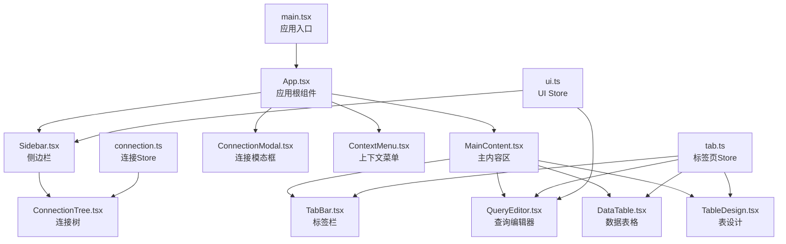
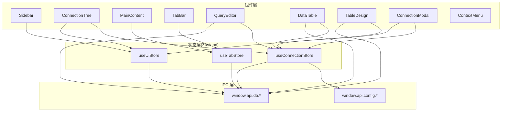
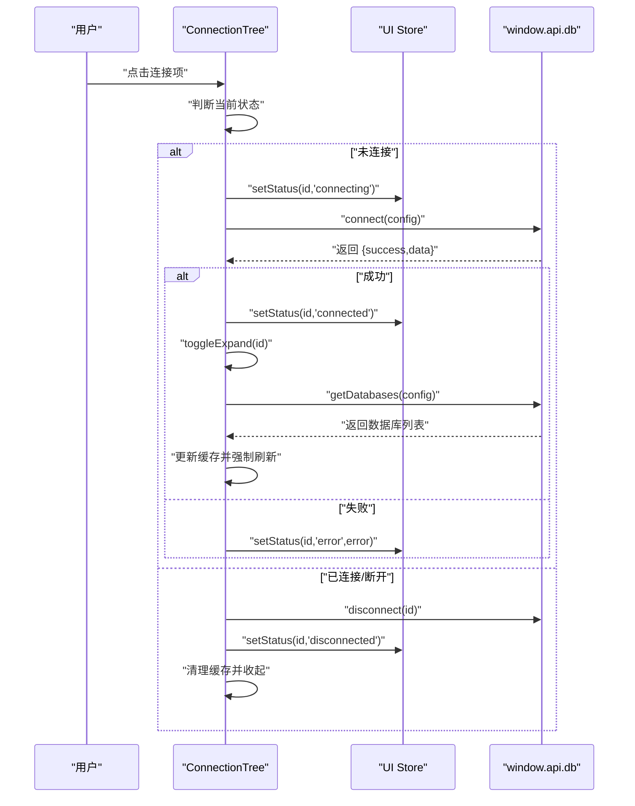
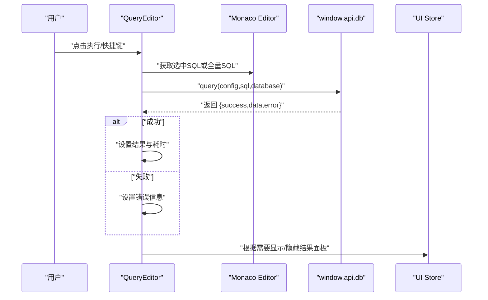
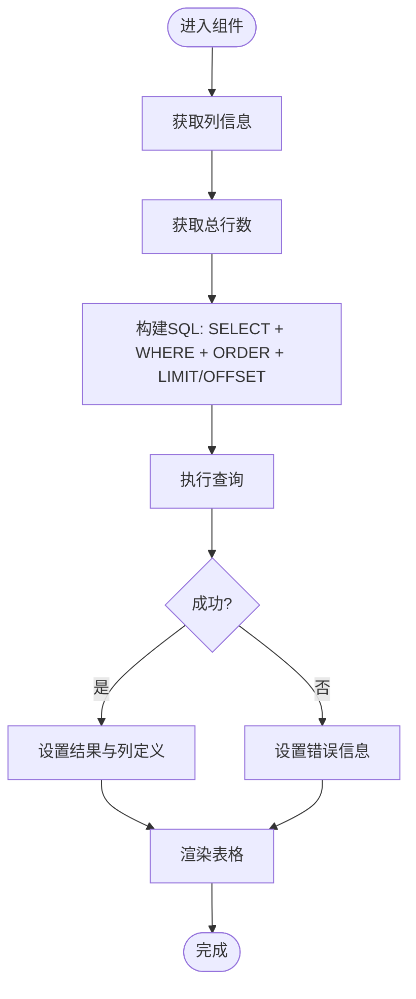
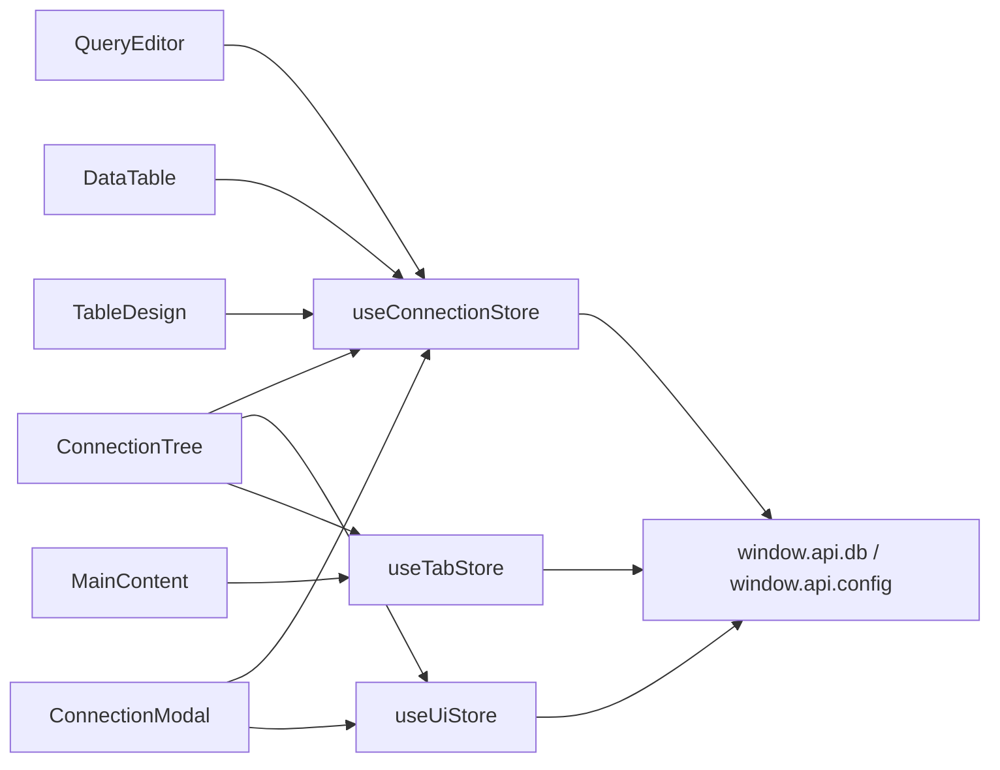

# 前端组件系统

<cite>
**本文引用的文件**
- [src/renderer/src/App.tsx](file://src/renderer/src/App.tsx)
- [src/renderer/src/main.tsx](file://src/renderer/src/main.tsx)
- [src/renderer/src/components/Sidebar.tsx](file://src/renderer/src/components/Sidebar.tsx)
- [src/renderer/src/components/MainContent.tsx](file://src/renderer/src/components/MainContent.tsx)
- [src/renderer/src/components/ConnectionTree.tsx](file://src/renderer/src/components/ConnectionTree.tsx)
- [src/renderer/src/components/QueryEditor.tsx](file://src/renderer/src/components/QueryEditor.tsx)
- [src/renderer/src/components/DataTable.tsx](file://src/renderer/src/components/DataTable.tsx)
- [src/renderer/src/components/TableDesign.tsx](file://src/renderer/src/components/TableDesign.tsx)
- [src/renderer/src/components/TabBar.tsx](file://src/renderer/src/components/TabBar.tsx)
- [src/renderer/src/components/ConnectionModal.tsx](file://src/renderer/src/components/ConnectionModal.tsx)
- [src/renderer/src/components/ContextMenu.tsx](file://src/renderer/src/components/ContextMenu.tsx)
- [src/renderer/src/stores/connection.ts](file://src/renderer/src/stores/connection.ts)
- [src/renderer/src/stores/tab.ts](file://src/renderer/src/stores/tab.ts)
- [src/renderer/src/stores/ui.ts](file://src/renderer/src/stores/ui.ts)
- [src/shared/types/index.ts](file://src/shared/types/index.ts)
</cite>

## 目录
1. [简介](#简介)
2. [项目结构](#项目结构)
3. [核心组件](#核心组件)
4. [架构总览](#架构总览)
5. [详细组件分析](#详细组件分析)
6. [依赖关系分析](#依赖关系分析)
7. [性能考量](#性能考量)
8. [故障排查指南](#故障排查指南)
9. [结论](#结论)
10. [附录](#附录)

## 简介
本文件面向 nexSql 前端组件系统，系统采用 Electron + React + TypeScript 技术栈，结合 Zustand 状态管理与 Monaco Editor 查询编辑器，构建了连接管理、树形导航、标签页切换、SQL 查询执行与结果展示、数据表格浏览与表结构设计等功能模块。本文从架构、组件职责、数据流与事件流、UI 规范与交互行为、可复用性与扩展性等方面进行深入解析，并提供可视化图示与使用建议。

## 项目结构
- 渲染进程入口位于 main.tsx，挂载根组件 App。
- App 负责初始化连接列表并渲染侧边栏、主内容区、连接模态框与上下文菜单。
- 组件按功能拆分为 Sidebar、MainContent、ConnectionTree、QueryEditor、DataTable、TableDesign、TabBar、ConnectionModal、ContextMenu。
- 状态管理通过 Zustand 的 connection、tab、ui 三个 Store 实现，分别管理连接配置、标签页状态与 UI 尺寸/菜单状态。
- 类型定义集中在 shared/types 中，统一约束连接、元数据、查询结果与 IPC 响应格式。

图表来源
- [src/renderer/src/main.tsx:1-11](file://src/renderer/src/main.tsx#L1-L11)
- [src/renderer/src/App.tsx:1-24](file://src/renderer/src/App.tsx#L1-L24)
- [src/renderer/src/components/Sidebar.tsx:1-80](file://src/renderer/src/components/Sidebar.tsx#L1-L80)
- [src/renderer/src/components/MainContent.tsx:1-34](file://src/renderer/src/components/MainContent.tsx#L1-L34)
- [src/renderer/src/components/ConnectionTree.tsx:1-313](file://src/renderer/src/components/ConnectionTree.tsx#L1-L313)
- [src/renderer/src/components/QueryEditor.tsx:1-329](file://src/renderer/src/components/QueryEditor.tsx#L1-L329)
- [src/renderer/src/components/DataTable.tsx:1-297](file://src/renderer/src/components/DataTable.tsx#L1-L297)
- [src/renderer/src/components/TableDesign.tsx:1-241](file://src/renderer/src/components/TableDesign.tsx#L1-L241)
- [src/renderer/src/components/TabBar.tsx:1-53](file://src/renderer/src/components/TabBar.tsx#L1-L53)
- [src/renderer/src/components/ConnectionModal.tsx:1-230](file://src/renderer/src/components/ConnectionModal.tsx#L1-L230)
- [src/renderer/src/components/ContextMenu.tsx:1-79](file://src/renderer/src/components/ContextMenu.tsx#L1-L79)
- [src/renderer/src/stores/connection.ts:1-64](file://src/renderer/src/stores/connection.ts#L1-L64)
- [src/renderer/src/stores/tab.ts:1-65](file://src/renderer/src/stores/tab.ts#L1-L65)
- [src/renderer/src/stores/ui.ts:1-41](file://src/renderer/src/stores/ui.ts#L1-L41)

章节来源
- [src/renderer/src/main.tsx:1-11](file://src/renderer/src/main.tsx#L1-L11)
- [src/renderer/src/App.tsx:1-24](file://src/renderer/src/App.tsx#L1-L24)

## 核心组件
- 侧边栏（Sidebar）：提供连接树区域与宽度拖拽能力；触发连接模态框。
- 连接树（ConnectionTree）：展示连接、数据库与表的层级结构；支持连接/断开、展开/折叠、上下文菜单、双击打开数据表、新建查询等。
- 主内容区（MainContent）：根据当前激活标签页动态渲染查询编辑器、数据表格或表设计视图。
- 查询编辑器（QueryEditor）：基于 Monaco Editor 的 SQL 编辑与执行；支持选择性执行、结果面板拖拽、CSV 导出、错误与耗时展示。
- 数据表格（DataTable）：分页加载表数据；支持筛选、排序、刷新与状态栏信息。
- 表设计（TableDesign）：展示表字段与索引信息，支持切换“字段/索引/信息”三个子页面。
- 标签栏（TabBar）：多标签页切换与关闭；根据标签类型显示不同图标。
- 连接模态框（ConnectionModal）：新建/编辑连接配置；支持测试连接与保存。
- 上下文菜单（ContextMenu）：全局上下文菜单，自动避屏。

章节来源
- [src/renderer/src/components/Sidebar.tsx:1-80](file://src/renderer/src/components/Sidebar.tsx#L1-L80)
- [src/renderer/src/components/ConnectionTree.tsx:1-313](file://src/renderer/src/components/ConnectionTree.tsx#L1-L313)
- [src/renderer/src/components/MainContent.tsx:1-34](file://src/renderer/src/components/MainContent.tsx#L1-L34)
- [src/renderer/src/components/QueryEditor.tsx:1-329](file://src/renderer/src/components/QueryEditor.tsx#L1-L329)
- [src/renderer/src/components/DataTable.tsx:1-297](file://src/renderer/src/components/DataTable.tsx#L1-L297)
- [src/renderer/src/components/TableDesign.tsx:1-241](file://src/renderer/src/components/TableDesign.tsx#L1-L241)
- [src/renderer/src/components/TabBar.tsx:1-53](file://src/renderer/src/components/TabBar.tsx#L1-L53)
- [src/renderer/src/components/ConnectionModal.tsx:1-230](file://src/renderer/src/components/ConnectionModal.tsx#L1-L230)
- [src/renderer/src/components/ContextMenu.tsx:1-79](file://src/renderer/src/components/ContextMenu.tsx#L1-L79)

## 架构总览
系统采用“组件 + Store + IPC”的分层架构：
- 组件层：负责 UI 展示与用户交互。
- Store 层：Zustand 管理连接、标签页与 UI 状态，避免跨组件复杂 props 传递。
- IPC 层：通过 window.api.db 与 window.api.config 与主进程通信，执行数据库操作与读写配置。

图表来源
- [src/renderer/src/components/Sidebar.tsx:1-80](file://src/renderer/src/components/Sidebar.tsx#L1-L80)
- [src/renderer/src/components/ConnectionTree.tsx:1-313](file://src/renderer/src/components/ConnectionTree.tsx#L1-L313)
- [src/renderer/src/components/MainContent.tsx:1-34](file://src/renderer/src/components/MainContent.tsx#L1-L34)
- [src/renderer/src/components/QueryEditor.tsx:1-329](file://src/renderer/src/components/QueryEditor.tsx#L1-L329)
- [src/renderer/src/components/DataTable.tsx:1-297](file://src/renderer/src/components/DataTable.tsx#L1-L297)
- [src/renderer/src/components/TableDesign.tsx:1-241](file://src/renderer/src/components/TableDesign.tsx#L1-L241)
- [src/renderer/src/components/TabBar.tsx:1-53](file://src/renderer/src/components/TabBar.tsx#L1-L53)
- [src/renderer/src/components/ConnectionModal.tsx:1-230](file://src/renderer/src/components/ConnectionModal.tsx#L1-L230)
- [src/renderer/src/components/ContextMenu.tsx:1-79](file://src/renderer/src/components/ContextMenu.tsx#L1-L79)
- [src/renderer/src/stores/connection.ts:1-64](file://src/renderer/src/stores/connection.ts#L1-L64)
- [src/renderer/src/stores/tab.ts:1-65](file://src/renderer/src/stores/tab.ts#L1-L65)
- [src/renderer/src/stores/ui.ts:1-41](file://src/renderer/src/stores/ui.ts#L1-L41)

## 详细组件分析

### 侧边栏（Sidebar）
- 功能要点
  - 顶部工具栏：标题与“新建连接”按钮，点击触发 UI Store 打开连接模态框。
  - 连接树容器：承载 ConnectionTree。
  - 水平拖拽：通过全局 mousemove/mouseup 监听改变侧边栏宽度，受 UI Store 管理。
- 关键交互
  - 鼠标按下进入拖拽状态，移动时调用 setSidebarWidth；抬起结束拖拽。
  - 使用 useRef 引用 div 容器，样式通过响应式宽度控制。
- 设计规范
  - 背景色与边框遵循主题变量，宽度范围限制在 180–500px。

章节来源
- [src/renderer/src/components/Sidebar.tsx:1-80](file://src/renderer/src/components/Sidebar.tsx#L1-L80)
- [src/renderer/src/stores/ui.ts:26-40](file://src/renderer/src/stores/ui.ts#L26-L40)

### 连接树（ConnectionTree）
- 功能要点
  - 展示连接列表，支持连接/断开、展开/折叠数据库与表。
  - 双击表项打开“表数据”标签页；右键弹出上下文菜单。
  - 新建查询、编辑连接、删除连接等操作。
- 数据与状态
  - 使用连接 Store 管理连接配置、状态与展开集合；UI Store 管理上下文菜单。
  - 使用内存缓存 nodeCache 存储数据库与表列表，减少重复请求。
- 事件流程（连接/断开）

图表来源
- [src/renderer/src/components/ConnectionTree.tsx:40-75](file://src/renderer/src/components/ConnectionTree.tsx#L40-L75)
- [src/renderer/src/stores/connection.ts:47-51](file://src/renderer/src/stores/connection.ts#L47-L51)

章节来源
- [src/renderer/src/components/ConnectionTree.tsx:1-313](file://src/renderer/src/components/ConnectionTree.tsx#L1-L313)
- [src/renderer/src/stores/connection.ts:1-64](file://src/renderer/src/stores/connection.ts#L1-L64)
- [src/renderer/src/stores/ui.ts:17-24](file://src/renderer/src/stores/ui.ts#L17-L24)

### 主内容区（MainContent）
- 功能要点
  - 根据激活标签页类型渲染对应视图：查询编辑器、数据表格、表设计。
  - 当无激活标签时，显示引导占位。
- 控制逻辑
  - 通过标签页 Store 获取 tabs 与 activeTabId，定位当前激活项。

章节来源
- [src/renderer/src/components/MainContent.tsx:1-34](file://src/renderer/src/components/MainContent.tsx#L1-L34)
- [src/renderer/src/stores/tab.ts:15-64](file://src/renderer/src/stores/tab.ts#L15-L64)

### 查询编辑器（QueryEditor）
- 功能要点
  - 基于 Monaco Editor 的 SQL 编辑与快捷键执行（Ctrl/Cmd + Enter）。
  - 支持选择性执行、结果面板拖拽调整高度、CSV 导出、错误与耗时展示。
  - 自动识别当前连接与数据库，执行 SQL 并渲染结果。
- 关键流程（执行查询）

图表来源
- [src/renderer/src/components/QueryEditor.tsx:36-64](file://src/renderer/src/components/QueryEditor.tsx#L36-L64)
- [src/renderer/src/components/QueryEditor.tsx:108-138](file://src/renderer/src/components/QueryEditor.tsx#L108-L138)
- [src/renderer/src/stores/ui.ts:33-34](file://src/renderer/src/stores/ui.ts#L33-L34)

章节来源
- [src/renderer/src/components/QueryEditor.tsx:1-329](file://src/renderer/src/components/QueryEditor.tsx#L1-L329)
- [src/renderer/src/stores/connection.ts:30](file://src/renderer/src/stores/connection.ts#L30)
- [src/renderer/src/stores/ui.ts:26-40](file://src/renderer/src/stores/ui.ts#L26-L40)

### 数据表格（DataTable）
- 功能要点
  - 分页加载表数据（每页固定大小），支持筛选、排序、刷新与状态栏信息。
  - 通过 react-data-grid 渲染，冻结首列行号，列宽可调，排序由 Grid 内部处理。
- 关键流程（加载数据）

图表来源
- [src/renderer/src/components/DataTable.tsx:41-87](file://src/renderer/src/components/DataTable.tsx#L41-L87)
- [src/renderer/src/components/DataTable.tsx:90-110](file://src/renderer/src/components/DataTable.tsx#L90-L110)
- [src/renderer/src/components/DataTable.tsx:121-137](file://src/renderer/src/components/DataTable.tsx#L121-L137)

章节来源
- [src/renderer/src/components/DataTable.tsx:1-297](file://src/renderer/src/components/DataTable.tsx#L1-L297)

### 表设计（TableDesign）
- 功能要点
  - “字段/索引/信息”三页切换，异步加载列与索引信息。
  - 字段类型图标分类，主键高亮。
- 交互行为
  - 通过 Promise.all 并行加载列与索引，提升响应速度。

章节来源
- [src/renderer/src/components/TableDesign.tsx:1-241](file://src/renderer/src/components/TableDesign.tsx#L1-L241)

### 标签栏（TabBar）
- 功能要点
  - 渲染所有标签页，支持点击切换与关闭；根据类型显示不同图标；脏标记指示。
- 交互行为
  - 关闭按钮阻止冒泡，避免误触切换。

章节来源
- [src/renderer/src/components/TabBar.tsx:1-53](file://src/renderer/src/components/TabBar.tsx#L1-L53)
- [src/renderer/src/stores/tab.ts:15-64](file://src/renderer/src/stores/tab.ts#L15-L64)

### 连接模态框（ConnectionModal）
- 功能要点
  - 表单字段覆盖连接配置；支持颜色标签；测试连接与保存。
  - 校验必填项并在保存后关闭。
- 交互行为
  - 打开时根据是否处于编辑模式填充表单；测试结果以状态提示反馈。

章节来源
- [src/renderer/src/components/ConnectionModal.tsx:1-230](file://src/renderer/src/components/ConnectionModal.tsx#L1-L230)
- [src/renderer/src/stores/connection.ts:28-31](file://src/renderer/src/stores/connection.ts#L28-L31)
- [src/renderer/src/stores/ui.ts:35-39](file://src/renderer/src/stores/ui.ts#L35-L39)

### 上下文菜单（ContextMenu）
- 功能要点
  - 全局监听，点击外部或按 Esc 关闭；自动计算菜单位置避免越界。
  - 支持分隔线、危险项样式与禁用状态。

章节来源
- [src/renderer/src/components/ContextMenu.tsx:1-79](file://src/renderer/src/components/ContextMenu.tsx#L1-L79)
- [src/renderer/src/stores/ui.ts:17-24](file://src/renderer/src/stores/ui.ts#L17-L24)

## 依赖关系分析
- 组件耦合
  - Sidebar 与 UI Store 强耦合（宽度与模态框控制）。
  - ConnectionTree 与 Connection Store、UI Store、Tab Store 联动。
  - MainContent 仅依赖 Tab Store，解耦良好。
  - QueryEditor、DataTable、TableDesign 依赖 Connection Store 与 IPC。
- 外部依赖
  - Monaco Editor：查询编辑器。
  - react-data-grid：数据表格渲染与排序。
  - Zustand：轻量状态管理。
  - IPC：window.api.db 与 window.api.config。

图表来源
- [src/renderer/src/components/ConnectionTree.tsx:17-36](file://src/renderer/src/components/ConnectionTree.tsx#L17-L36)
- [src/renderer/src/components/MainContent.tsx:1-11](file://src/renderer/src/components/MainContent.tsx#L1-L11)
- [src/renderer/src/components/QueryEditor.tsx:13-32](file://src/renderer/src/components/QueryEditor.tsx#L13-L32)
- [src/renderer/src/components/DataTable.tsx:16-29](file://src/renderer/src/components/DataTable.tsx#L16-L29)
- [src/renderer/src/components/TableDesign.tsx:3-12](file://src/renderer/src/components/TableDesign.tsx#L3-L12)
- [src/renderer/src/components/ConnectionModal.tsx:3-25](file://src/renderer/src/components/ConnectionModal.tsx#L3-L25)
- [src/renderer/src/stores/connection.ts:17-63](file://src/renderer/src/stores/connection.ts#L17-L63)
- [src/renderer/src/stores/tab.ts:15-64](file://src/renderer/src/stores/tab.ts#L15-L64)
- [src/renderer/src/stores/ui.ts:26-40](file://src/renderer/src/stores/ui.ts#L26-L40)

## 性能考量
- 渲染优化
  - ConnectionTree 使用内存缓存 nodeCache，避免重复请求数据库/表列表。
  - DataTable 使用分页加载与 useMemo 生成列定义，降低重渲染成本。
- 交互优化
  - QueryEditor 与 DataTable 的拖拽尺寸均限制最小/最大值，保证可用性。
  - Monaco Editor 选项启用自动布局与行高亮，提升可读性。
- IPC 优化
  - ConnectionModal 并行加载列与索引（TableDesign），缩短等待时间。
- 建议
  - 对大数据量表，建议优先使用过滤条件与分页策略。
  - 对频繁切换的标签页，可考虑懒加载非活跃视图。

## 故障排查指南
- 连接问题
  - 现象：连接状态为 error，侧边栏显示错误信息。
  - 排查：检查主机、端口、用户名、密码；使用连接模态框“测试连接”验证。
  - 相关位置：[ConnectionTree:40-58](file://src/renderer/src/components/ConnectionTree.tsx#L40-L58)，[ConnectionModal:44-50](file://src/renderer/src/components/ConnectionModal.tsx#L44-L50)
- 查询失败
  - 现象：查询编辑器结果显示错误信息。
  - 排查：检查 SQL 语法、数据库选择、权限；查看耗时与警告。
  - 相关位置：[QueryEditor:55-64](file://src/renderer/src/components/QueryEditor.tsx#L55-L64)
- 表格无数据
  - 现象：数据表格显示“表中没有数据”。
  - 排查：确认筛选条件、排序方向、分页是否正确；尝试刷新。
  - 相关位置：[DataTable:275-279](file://src/renderer/src/components/DataTable.tsx#L275-L279)
- 上下文菜单不消失
  - 现象：右键菜单无法关闭。
  - 排查：确保点击外部或按 Esc；检查全局监听是否生效。
  - 相关位置：[ContextMenu:9-34](file://src/renderer/src/components/ContextMenu.tsx#L9-L34)

章节来源
- [src/renderer/src/components/ConnectionTree.tsx:40-58](file://src/renderer/src/components/ConnectionTree.tsx#L40-L58)
- [src/renderer/src/components/ConnectionModal.tsx:44-50](file://src/renderer/src/components/ConnectionModal.tsx#L44-L50)
- [src/renderer/src/components/QueryEditor.tsx:55-64](file://src/renderer/src/components/QueryEditor.tsx#L55-L64)
- [src/renderer/src/components/DataTable.tsx:275-279](file://src/renderer/src/components/DataTable.tsx#L275-L279)
- [src/renderer/src/components/ContextMenu.tsx:9-34](file://src/renderer/src/components/ContextMenu.tsx#L9-L34)

## 结论
nexSql 前端组件系统以清晰的分层与状态管理实现了连接、查询、数据浏览与表设计的完整工作流。组件间通过 Store 解耦，IPC 作为边界层，既保证了可维护性，也提供了良好的扩展空间。建议后续在以下方面持续演进：增强错误恢复与重试机制、引入查询历史与模板能力、完善主题与无障碍支持。

## 附录

### 组件属性接口与事件
- QueryEditor
  - 属性：tab（包含连接、数据库、表等上下文）
  - 事件：执行查询、导出 CSV、调整结果面板高度
  - 相关位置：[QueryEditor:17-19](file://src/renderer/src/components/QueryEditor.tsx#L17-L19)
- DataTable
  - 属性：tab（包含连接、数据库、表）
  - 事件：筛选、排序、分页、刷新
  - 相关位置：[DataTable:19-21](file://src/renderer/src/components/DataTable.tsx#L19-L21)
- TableDesign
  - 属性：tab（包含连接、数据库、表）
  - 事件：切换“字段/索引/信息”
  - 相关位置：[TableDesign:6-8](file://src/renderer/src/components/TableDesign.tsx#L6-L8)
- ConnectionTree
  - 事件：连接/断开、展开/折叠、上下文菜单、双击打开数据、新建查询
  - 相关位置：[ConnectionTree:100-125](file://src/renderer/src/components/ConnectionTree.tsx#L100-L125)
- TabBar
  - 事件：切换标签、关闭标签
  - 相关位置：[TabBar:22-49](file://src/renderer/src/components/TabBar.tsx#L22-L49)

### 状态管理与数据流
- 连接状态（Connection Store）
  - 管理 connections、statuses、errors、expandedConnections
  - 提供 load/save/delete 与状态切换
  - 相关位置：[connection.ts:17-63](file://src/renderer/src/stores/connection.ts#L17-L63)
- 标签页状态（Tab Store）
  - 管理 tabs、activeTabId、脏标记
  - 提供 open/close/set/update/get
  - 相关位置：[tab.ts:15-64](file://src/renderer/src/stores/tab.ts#L15-L64)
- UI 状态（UI Store）
  - 管理 sidebarWidth、resultPanelHeight、连接模态框、上下文菜单
  - 相关位置：[ui.ts:26-40](file://src/renderer/src/stores/ui.ts#L26-L40)

### 类型定义概览
- 连接配置与状态
  - ConnectionConfig、ConnectionStatus、ConnectionInfo
  - 相关位置：[types/index.ts:3-30](file://src/shared/types/index.ts#L3-L30)
- 元数据类型
  - DatabaseInfo、TableInfo、ColumnInfo、IndexInfo、TableSchema
  - 相关位置：[types/index.ts:34-70](file://src/shared/types/index.ts#L34-L70)
- 查询结果与历史
  - QueryResult、QueryResultColumn、QueryHistory
  - 相关位置：[types/index.ts:74-100](file://src/shared/types/index.ts#L74-L100)
- IPC 响应
  - IpcResponse
  - 相关位置：[types/index.ts:104-108](file://src/shared/types/index.ts#L104-L108)
- Tab 类型
  - Tab、TabType
  - 相关位置：[types/index.ts:112-123](file://src/shared/types/index.ts#L112-L123)