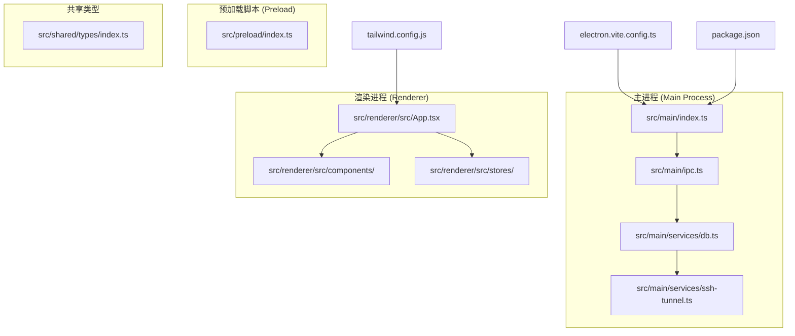
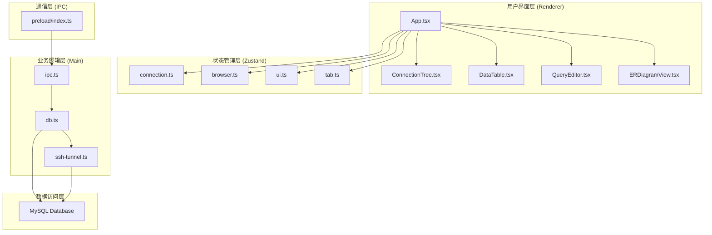
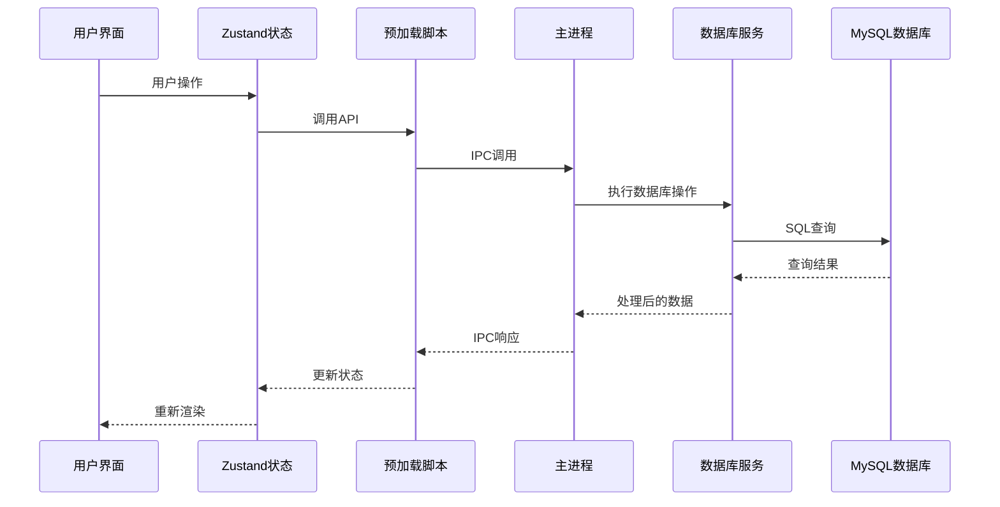
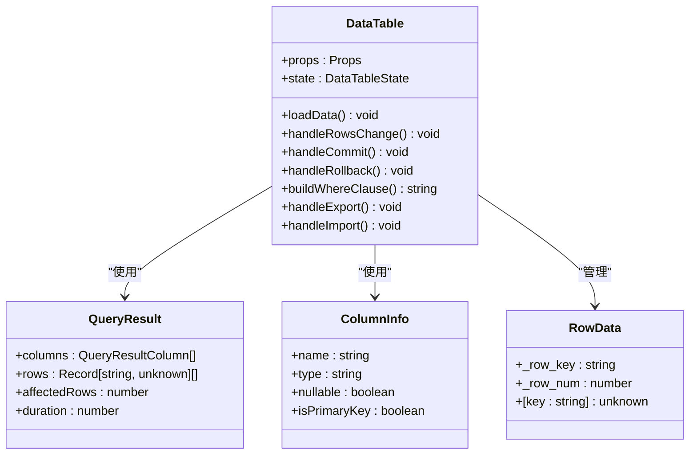
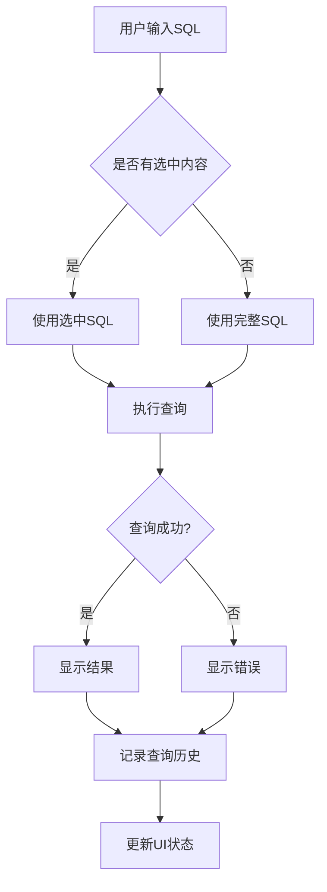
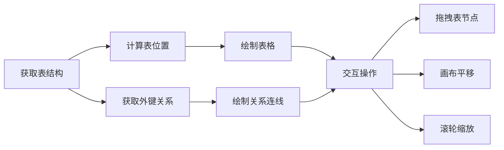
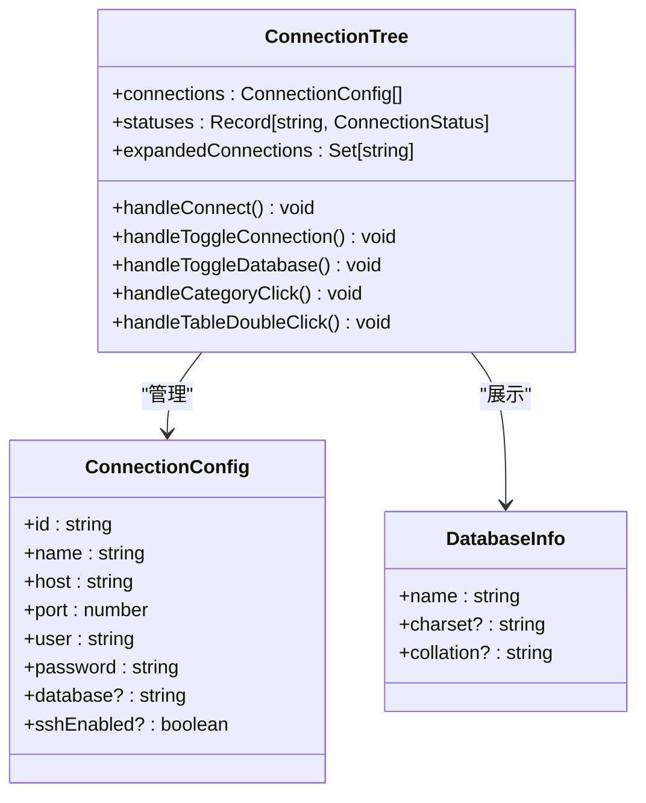
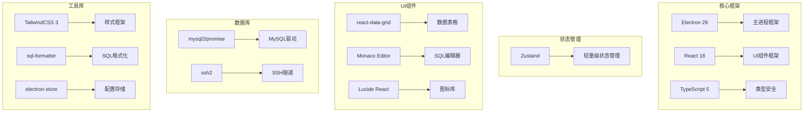
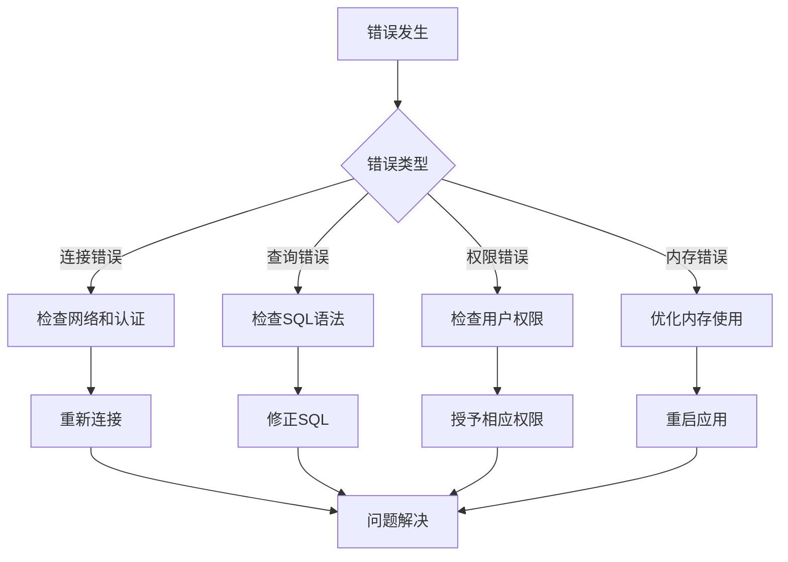

# 可视化工具集

<cite>
**本文档引用的文件**
- [README.md](file://README.md)
- [package.json](file://package.json)
- [src/main/index.ts](file://src/main/index.ts)
- [src/main/ipc.ts](file://src/main/ipc.ts)
- [src/main/services/db.ts](file://src/main/services/db.ts)
- [src/main/services/ssh-tunnel.ts](file://src/main/services/ssh-tunnel.ts)
- [src/preload/index.ts](file://src/preload/index.ts)
- [src/renderer/src/App.tsx](file://src/renderer/src/App.tsx)
- [src/renderer/src/components/DataTable.tsx](file://src/renderer/src/components/DataTable.tsx)
- [src/renderer/src/components/QueryEditor.tsx](file://src/renderer/src/components/QueryEditor.tsx)
- [src/renderer/src/components/ERDiagramView.tsx](file://src/renderer/src/components/ERDiagramView.tsx)
- [src/renderer/src/components/NewTableDesigner.tsx](file://src/renderer/src/components/NewTableDesigner.tsx)
- [src/renderer/src/components/ConnectionTree.tsx](file://src/renderer/src/components/ConnectionTree.tsx)
- [src/renderer/src/stores/connection.ts](file://src/renderer/src/stores/connection.ts)
- [src/renderer/src/stores/browser.ts](file://src/renderer/src/stores/browser.ts)
- [src/shared/types/index.ts](file://src/shared/types/index.ts)
- [electron.vite.config.ts](file://electron.vite.config.ts)
- [tailwind.config.js](file://tailwind.config.js)
</cite>

## 目录
1. [简介](#简介)
2. [项目结构](#项目结构)
3. [核心组件](#核心组件)
4. [架构概览](#架构概览)
5. [详细组件分析](#详细组件分析)
6. [依赖分析](#依赖分析)
7. [性能考虑](#性能考虑)
8. [故障排除指南](#故障排除指南)
9. [结论](#结论)

## 简介

nexSql 是一款现代化的桌面数据库管理客户端，基于 Electron + React 构建，专为 MySQL 设计的数据库可视化与开发工具。该项目提供了完整的数据库管理解决方案，包括连接管理、数据表格操作、查询面板、数据导入导出、对象设计等功能。

该工具集采用三层架构设计：主进程负责数据库连接和系统级操作，渲染进程提供用户界面交互，预加载脚本实现安全的 IPC 通信桥接。项目使用 TypeScript 进行类型安全编程，Zustand 进行状态管理，TailwindCSS 实现响应式界面设计。

## 项目结构

项目采用模块化的目录结构，按照职责分离原则组织代码：

**图表来源**
- [src/main/index.ts:1-64](file://src/main/index.ts#L1-L64)
- [src/main/ipc.ts:1-448](file://src/main/ipc.ts#L1-L448)
- [src/main/services/db.ts:1-778](file://src/main/services/db.ts#L1-L778)

**章节来源**
- [README.md:135-184](file://README.md#L135-L184)
- [package.json:1-45](file://package.json#L1-L45)

## 核心组件

### 数据库服务层

数据库服务层是整个应用的核心，负责与 MySQL 数据库的交互和连接管理：

- **连接池管理**：使用 mysql2/promise 库维护连接池，支持并发连接和自动重连
- **SSH隧道支持**：通过 ssh2 库实现安全的 SSH 隧道连接
- **SSL加密连接**：支持 SSL 加密的数据库连接
- **元数据查询**：提供完整的数据库对象查询接口

### IPC 通信层

IPC 通信层实现了主进程与渲染进程之间的安全通信：

- **配置管理**：连接配置的保存、加载和删除
- **数据库操作**：查询执行、元数据获取、备份恢复
- **文件操作**：导入导出功能的文件对话框处理
- **错误处理**：统一的错误捕获和日志记录机制

### 用户界面组件

渲染进程包含丰富的 UI 组件，提供直观的数据库管理界面：

- **连接树**：展示数据库连接、数据库、表等层次结构
- **数据表格**：高性能的数据展示和编辑功能
- **查询编辑器**：基于 Monaco Editor 的 SQL 编辑环境
- **ER 关系图**：可视化数据库表关系图

**章节来源**
- [src/main/services/db.ts:1-778](file://src/main/services/db.ts#L1-L778)
- [src/main/ipc.ts:1-448](file://src/main/ipc.ts#L1-L448)
- [src/renderer/src/components/DataTable.tsx:1-800](file://src/renderer/src/components/DataTable.tsx#L1-L800)

## 架构概览

系统采用典型的 Electron 应用架构，分为三个主要层次：

**图表来源**
- [src/renderer/src/App.tsx:1-136](file://src/renderer/src/App.tsx#L1-L136)
- [src/preload/index.ts:1-99](file://src/preload/index.ts#L1-L99)
- [src/main/ipc.ts:1-448](file://src/main/ipc.ts#L1-L448)

### 数据流架构

**图表来源**
- [src/preload/index.ts:21-84](file://src/preload/index.ts#L21-L84)
- [src/main/ipc.ts:48-448](file://src/main/ipc.ts#L48-L448)

## 详细组件分析

### 数据表格组件 (DataTable)

数据表格组件是应用的核心功能之一，提供了高性能的数据展示和编辑能力：

**图表来源**
- [src/renderer/src/components/DataTable.tsx:121-800](file://src/renderer/src/components/DataTable.tsx#L121-L800)

数据表格的主要特性包括：

- **虚拟滚动**：使用 react-data-grid 实现百万级数据的高性能展示
- **单元格编辑**：支持直接在单元格中编辑数据，包括特殊类型的处理
- **智能字段识别**：自动检测 JSON、二进制/BLOB、布尔等字段类型
- **批量操作**：支持行选择、批量删除、批量插入，事务保障原子性
- **排序与筛选**：列排序和多条件筛选功能

**章节来源**
- [src/renderer/src/components/DataTable.tsx:1-800](file://src/renderer/src/components/DataTable.tsx#L1-L800)

### 查询编辑器组件 (QueryEditor)

查询编辑器提供了强大的 SQL 编写和执行环境：

**图表来源**
- [src/renderer/src/components/QueryEditor.tsx:46-126](file://src/renderer/src/components/QueryEditor.tsx#L46-L126)

查询编辑器的关键功能：

- **Monaco 编辑器**：VSCode 同款编辑器，提供语法高亮和智能提示
- **SQL 自动补全**：四级智能提示（关键字、表名、列名、函数）
- **执行计划**：EXPLAIN 可视化，支持 TREE 格式和标准表格格式
- **查询历史**：自动记录执行历史，支持搜索和复用
- **结果导出**：支持导出为 CSV/JSON

**章节来源**
- [src/renderer/src/components/QueryEditor.tsx:1-426](file://src/renderer/src/components/QueryEditor.tsx#L1-L426)

### ER 关系图组件 (ERDiagramView)

ER 关系图提供了数据库表关系的可视化展示：

**图表来源**
- [src/renderer/src/components/ERDiagramView.tsx:81-113](file://src/renderer/src/components/ERDiagramView.tsx#L81-L113)

ER 关系图的核心特性：

- **SVG 可视化**：基于 SVG 的关系图绘制
- **拖拽交互**：支持拖拽表节点进行重新布局
- **画布操作**：支持平移和滚轮缩放
- **自动布局**：简单的网格布局算法
- **关系高亮**：悬停时高亮显示相关关系

**章节来源**
- [src/renderer/src/components/ERDiagramView.tsx:1-200](file://src/renderer/src/components/ERDiagramView.tsx#L1-L200)

### 连接树组件 (ConnectionTree)

连接树组件管理数据库连接和对象浏览：

**图表来源**
- [src/renderer/src/components/ConnectionTree.tsx:46-200](file://src/renderer/src/components/ConnectionTree.tsx#L46-L200)

连接树的功能特点：

- **多连接管理**：支持同时管理多个 MySQL 连接
- **连接分组**：按环境分组显示连接，支持自定义标签
- **数据库浏览**：树形结构展示表、视图、函数/存储过程、事件
- **快速切换**：支持连接的快速切换和断开
- **缓存机制**：使用内存缓存优化性能

**章节来源**
- [src/renderer/src/components/ConnectionTree.tsx:1-200](file://src/renderer/src/components/ConnectionTree.tsx#L1-L200)

## 依赖分析

项目使用了现代化的技术栈，各依赖项的作用如下：

**图表来源**
- [package.json:16-27](file://package.json#L16-L27)
- [package.json:29-42](file://package.json#L29-L42)

### 核心依赖说明

- **Electron**：提供桌面应用的底层框架
- **React + TypeScript**：构建用户界面的现代前端技术栈
- **Zustand**：轻量级状态管理库，替代 Redux
- **mysql2/promise**：高性能的 MySQL 驱动程序
- **react-data-grid**：专业的数据表格组件
- **Monaco Editor**：VSCode 同款代码编辑器
- **TailwindCSS**：实用优先的 CSS 框架

**章节来源**
- [package.json:1-45](file://package.json#L1-L45)
- [README.md:73-88](file://README.md#L73-L88)

## 性能考虑

### 数据库连接优化

- **连接池管理**：使用 mysql2 的连接池，默认连接数为 5，支持自动重连
- **SSH 隧道缓存**：建立 SSH 隧道后进行缓存，避免重复创建
- **超时设置**：默认连接超时时间为 10 秒，可根据网络情况调整

### 前端性能优化

- **虚拟滚动**：数据表格使用虚拟滚动技术，支持百万级数据展示
- **组件懒加载**：按需加载大型组件，减少初始加载时间
- **状态分片**：使用 Zustand 进行细粒度状态管理，避免不必要的重渲染

### 内存管理

- **缓存策略**：合理使用内存缓存数据库元数据，平衡内存使用和性能
- **垃圾回收**：及时清理不再使用的组件和事件监听器
- **图片和资源**：优化图标和资源文件大小

## 故障排除指南

### 连接问题

**常见问题**：
- 连接超时：检查网络连接和防火墙设置
- 认证失败：验证用户名、密码和主机地址
- SSL 连接错误：确认 SSL 证书配置

**解决步骤**：
1. 检查连接配置是否正确
2. 验证网络连通性
3. 查看主进程日志获取详细错误信息
4. 尝试禁用 SSL 或 SSH 隧道进行测试

### 性能问题

**症状**：
- 数据表格加载缓慢
- 查询执行超时
- 内存使用过高

**解决方案**：
1. 调整连接池大小
2. 优化查询语句，添加适当的索引
3. 减少一次性加载的数据量
4. 清理不再使用的连接和缓存

### 常见错误处理

**章节来源**
- [src/main/ipc.ts:18-46](file://src/main/ipc.ts#L18-L46)
- [src/main/services/db.ts:55-80](file://src/main/services/db.ts#L55-L80)

## 结论

nexSql 可视化工具集是一个功能完整、架构清晰的数据库管理应用。它成功地结合了现代前端技术和传统的桌面应用优势，为开发者和数据库管理员提供了高效的数据库管理解决方案。

### 主要优势

1. **功能全面**：涵盖了数据库管理的所有核心功能
2. **性能优秀**：采用虚拟滚动和连接池等优化技术
3. **用户体验好**：直观的界面设计和流畅的操作体验
4. **安全性高**：支持 SSH 隧道和 SSL 加密连接
5. **扩展性强**：模块化的架构便于功能扩展

### 技术亮点

- Electron + React 的现代化桌面应用架构
- TypeScript 提供完整的类型安全保障
- Zustand 简化的状态管理模式
- TailwindCSS 实现的响应式界面设计
- 完善的错误处理和日志记录机制

该工具集为 MySQL 数据库管理提供了一个专业、可靠的解决方案，适合个人开发者和企业用户使用。