# 数据表格组件

<cite>
**本文档引用的文件**
- [DataTable.tsx](file://src/renderer/src/components/DataTable.tsx)
- [App.tsx](file://src/renderer/src/App.tsx)
- [MainContent.tsx](file://src/renderer/src/components/MainContent.tsx)
- [index.ts](file://src/main/index.ts)
- [ipc.ts](file://src/main/ipc.ts)
- [types/index.ts](file://src/shared/types/index.ts)
- [index.css](file://src/renderer/src/index.css)
- [package.json](file://package.json)
</cite>

## 目录
1. [简介](#简介)
2. [项目结构](#项目结构)
3. [核心组件](#核心组件)
4. [架构概览](#架构概览)
5. [详细组件分析](#详细组件分析)
6. [依赖关系分析](#依赖关系分析)
7. [性能考虑](#性能考虑)
8. [故障排除指南](#故障排除指南)
9. [结论](#结论)

## 简介

nexSql 数据表格组件是一个基于 React Data Grid 的现代化数据库数据展示解决方案。该组件提供了完整的数据浏览体验，包括分页、排序、筛选、导出等功能，并支持丰富的自定义渲染和样式定制选项。

该组件专为数据库管理工具设计，能够高效地处理大型数据集，同时保持良好的用户体验。通过 Electron 和 React 技术栈实现，为用户提供桌面级的应用程序体验。

## 项目结构

项目采用模块化的组织方式，主要分为以下层次：

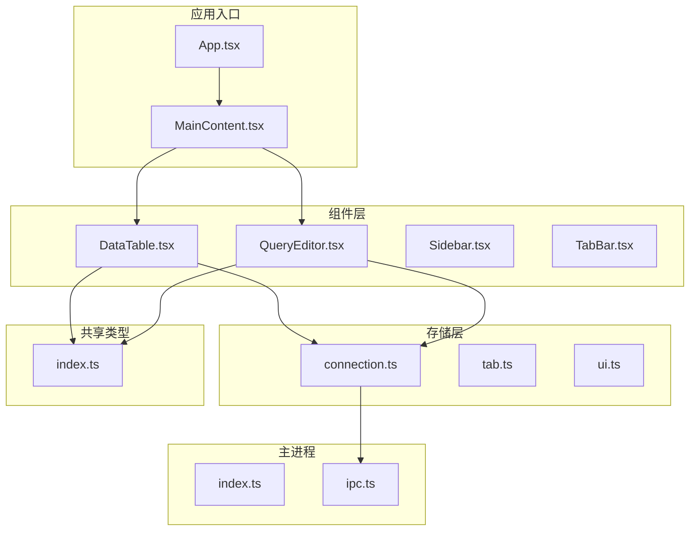

**图表来源**
- [App.tsx:1-35](file://src/renderer/src/App.tsx#L1-L35)
- [MainContent.tsx:1-34](file://src/renderer/src/components/MainContent.tsx#L1-L34)
- [DataTable.tsx:1-297](file://src/renderer/src/components/DataTable.tsx#L1-L297)

**章节来源**
- [App.tsx:1-35](file://src/renderer/src/App.tsx#L1-L35)
- [MainContent.tsx:1-34](file://src/renderer/src/components/MainContent.tsx#L1-L34)
- [package.json:1-42](file://package.json#L1-L42)

## 核心组件

### DataTable 组件架构

DataTable 组件是整个数据表格系统的核心，负责管理数据加载、状态管理和用户交互。该组件实现了完整的 CRUD 操作支持，包括数据的增删改查功能。

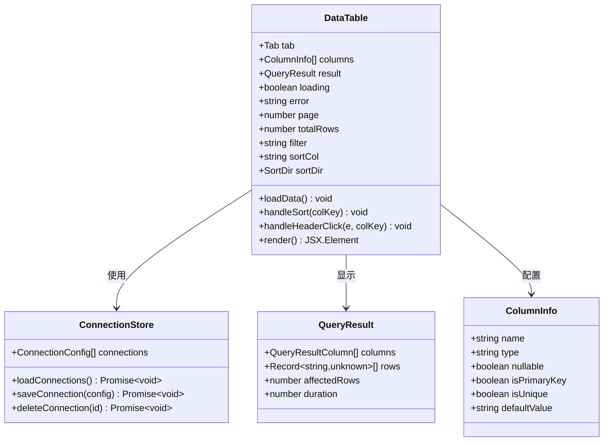

**图表来源**
- [DataTable.tsx:19-297](file://src/renderer/src/components/DataTable.tsx#L19-L297)
- [types/index.ts:49-88](file://src/shared/types/index.ts#L49-L88)

### 数据流架构

组件内部的数据流遵循单向数据流原则，确保状态的一致性和可预测性：

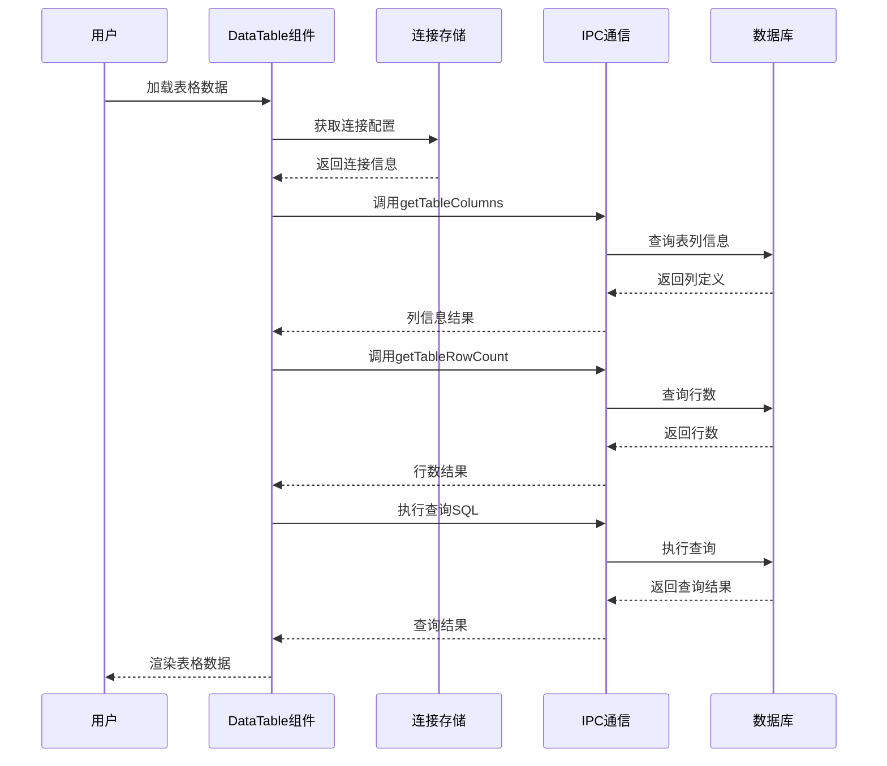

**图表来源**
- [DataTable.tsx:41-83](file://src/renderer/src/components/DataTable.tsx#L41-L83)
- [ipc.ts:140-176](file://src/main/ipc.ts#L140-L176)

**章节来源**
- [DataTable.tsx:27-87](file://src/renderer/src/components/DataTable.tsx#L27-L87)
- [types/index.ts:114-124](file://src/shared/types/index.ts#L114-L124)

## 架构概览

### 技术栈架构

系统采用现代前端技术栈构建，确保了高性能和良好的开发体验：

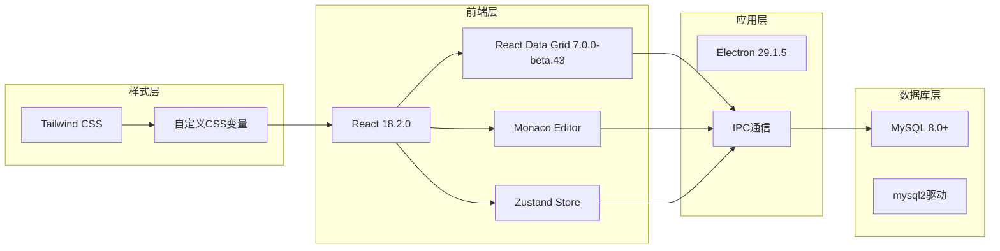

**图表来源**
- [package.json:16-26](file://package.json#L16-L26)
- [index.css:52-64](file://src/renderer/src/index.css#L52-L64)

### 状态管理模式

组件使用 Zustand 状态管理库实现全局状态管理，提供响应式的状态更新机制：

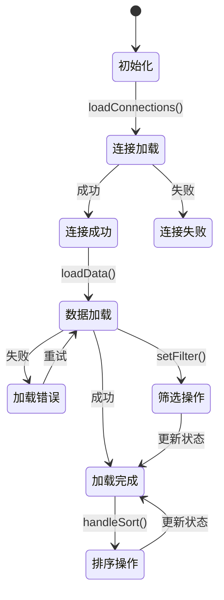

**图表来源**
- [connection.ts:17-63](file://src/renderer/src/stores/connection.ts#L17-L63)
- [DataTable.tsx:121-137](file://src/renderer/src/components/DataTable.tsx#L121-L137)

**章节来源**
- [connection.ts:1-64](file://src/renderer/src/stores/connection.ts#L1-L64)
- [DataTable.tsx:1-297](file://src/renderer/src/components/DataTable.tsx#L1-L297)

## 详细组件分析

### 数据分页实现

DataTable 组件实现了高效的分页机制，支持大数据集的渐进式加载：


**图表来源**
- [DataTable.tsx:147-149](file://src/renderer/src/components/DataTable.tsx#L147-L149)
- [DataTable.tsx:73-73](file://src/renderer/src/components/DataTable.tsx#L73-L73)

分页参数配置：
- 页面大小：100行/页
- 偏移量计算：`offset = page * PAGE_SIZE`
- 总页数计算：`totalPages = ceil(totalRows / PAGE_SIZE)`

### 排序功能实现

组件支持多字段排序，提供直观的排序交互体验：

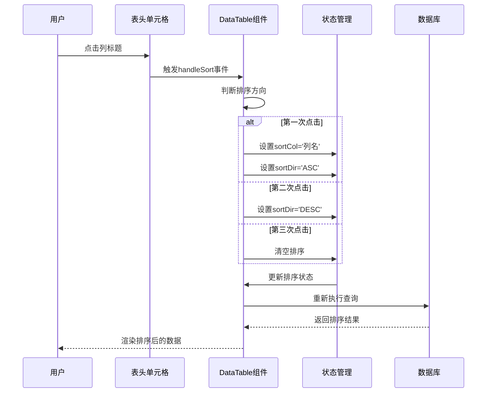

**图表来源**
- [DataTable.tsx:121-137](file://src/renderer/src/components/DataTable.tsx#L121-L137)
- [DataTable.tsx:252-262](file://src/renderer/src/components/DataTable.tsx#L252-L262)

排序特性：
- 支持单字段升序/降序排序
- 支持清除排序状态
- 自动重置到第一页
- 与筛选功能协同工作

### 筛选功能实现

组件提供灵活的筛选机制，支持按列进行文本匹配：

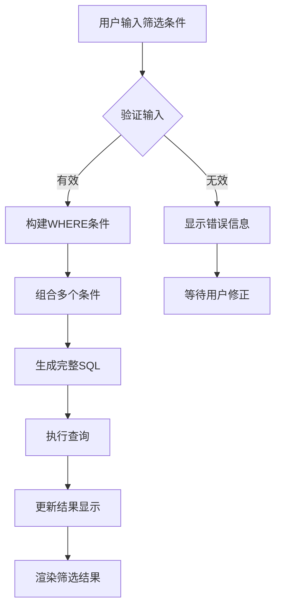

**图表来源**
- [DataTable.tsx:61-66](file://src/renderer/src/components/DataTable.tsx#L61-L66)
- [DataTable.tsx:172-175](file://src/renderer/src/components/DataTable.tsx#L172-L175)

筛选实现细节：
- 使用 `LIKE` 操作符进行模糊匹配
- 支持多列条件组合（OR 连接）
- 自动转义特殊字符防止 SQL 注入
- 实时响应用户输入变化

### 导出功能实现

组件支持将查询结果导出为 CSV 文件，便于数据备份和分析：

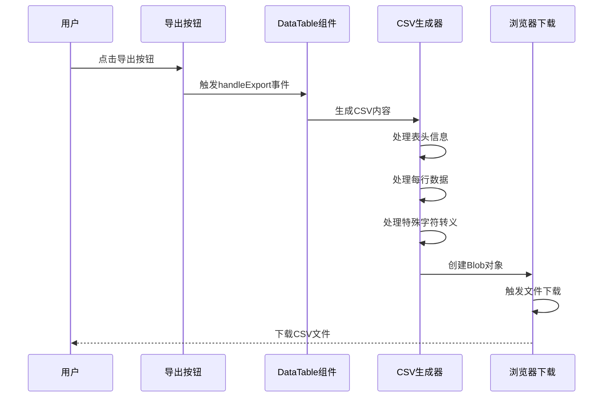

**图表来源**
- [QueryEditor.tsx:76-101](file://src/renderer/src/components/QueryEditor.tsx#L76-L101)

CSV 导出特性：
- 支持包含特殊字符的字段自动转义
- 处理 NULL 值的显示格式
- 自动生成标准 CSV 格式
- 自动命名下载文件

### 列配置和自定义渲染

组件支持灵活的列配置和自定义渲染选项：

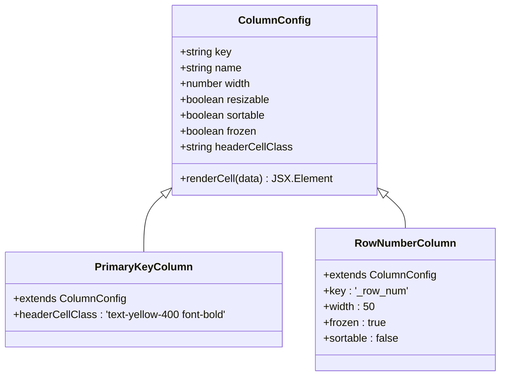

**图表来源**
- [DataTable.tsx:90-110](file://src/renderer/src/components/DataTable.tsx#L90-L110)

列配置特性：
- 固定第一列为行号列
- 主键列自动高亮显示
- 可调整列宽和排序
- 冻结重要列在左侧显示

### 样式定制和主题支持

组件采用深色主题设计，提供丰富的样式定制选项：

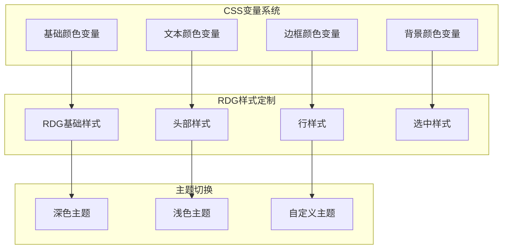

**图表来源**
- [index.css:52-64](file://src/renderer/src/index.css#L52-L64)
- [index.css:131-139](file://src/renderer/src/index.css#L131-L139)

样式定制选项：
- 支持 CSS 变量覆盖
- 提供暗黑模式适配
- 响应式布局设计
- 动画和过渡效果

**章节来源**
- [DataTable.tsx:89-119](file://src/renderer/src/components/DataTable.tsx#L89-L119)
- [index.css:1-139](file://src/renderer/src/index.css#L1-L139)

## 依赖关系分析

### 外部依赖关系

组件依赖于多个外部库来实现核心功能：

```mermaid
graph TD
subgraph "核心依赖"
React[react 18.2.0]
RDG[react-data-grid 7.0.0-beta.43]
Zustand[zustand 4.5.2]
end
subgraph "UI组件"
Lucide[lucide-react 0.344.0]
Monaco[@monaco-editor/react 4.6.0]
end
subgraph "数据库相关"
MySQL2[mysql2 3.9.2]
ElectronStore[electron-store 8.2.0]
end
subgraph "开发工具"
Tailwind[tailwindcss 3.4.1]
PostCSS[autoprefixer 10.4.18]
Vite[vite 5.1.4]
end
DataTable --> React
DataTable --> RDG
DataTable --> Zustand
DataTable --> Lucide
DataTable --> Monaco
DataTable --> MySQL2
DataTable --> ElectronStore
DataTable --> Tailwind
DataTable --> PostCSS
DataTable --> Vite
```

**图表来源**
- [package.json:16-40](file://package.json#L16-L40)

### 内部模块依赖

组件之间的依赖关系清晰明确：

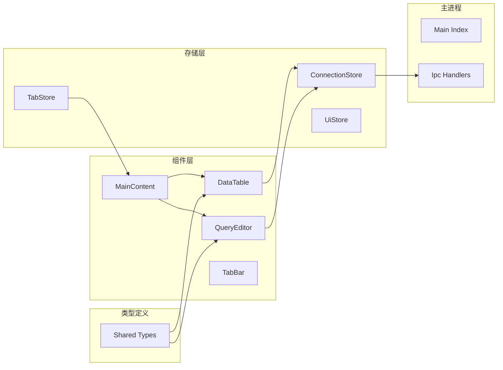

**图表来源**
- [DataTable.tsx:16-17](file://src/renderer/src/components/DataTable.tsx#L16-L17)
- [MainContent.tsx:1-6](file://src/renderer/src/components/MainContent.tsx#L1-L6)

**章节来源**
- [package.json:16-40](file://package.json#L16-L40)
- [DataTable.tsx:1-297](file://src/renderer/src/components/DataTable.tsx#L1-L297)

## 性能考虑

### 大数据集处理策略

针对大数据集场景，组件采用了多种优化策略：

1. **分页加载**：默认每页100行，避免一次性加载大量数据
2. **虚拟滚动**：利用 React Data Grid 的虚拟化能力
3. **状态缓存**：合理使用 useMemo 和 useCallback 避免不必要的重渲染
4. **懒加载**：只在需要时才加载列定义和数据

### 内存管理优化

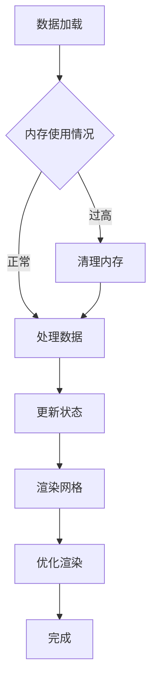

优化措施：
- 合理使用 React.memo 避免重复渲染
- 使用 useCallback 缓存回调函数
- 使用 useMemo 缓存计算结果
- 及时清理事件监听器和定时器

### 网络请求优化

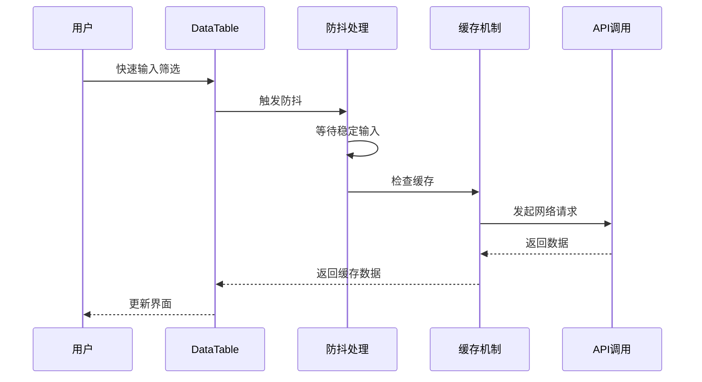

网络优化策略：
- 防抖处理用户输入，减少频繁请求
- 缓存最近查询结果
- 合理设置超时时间
- 错误重试机制

## 故障排除指南

### 常见问题诊断

#### 数据加载失败

**症状**：表格显示错误信息，无法加载数据

**可能原因**：
1. 数据库连接配置错误
2. 权限不足导致查询失败
3. 网络连接不稳定
4. SQL 语法错误

**解决方法**：
1. 检查连接配置是否正确
2. 验证数据库权限设置
3. 确认网络连接状态
4. 查看错误日志获取详细信息

#### 性能问题

**症状**：页面响应缓慢，滚动卡顿

**可能原因**：
1. 数据量过大
2. 列过多导致渲染复杂
3. 样式计算开销大
4. 内存泄漏

**解决方法**：
1. 调整分页大小
2. 减少列数量
3. 优化样式规则
4. 检查内存使用情况

#### 排序异常

**症状**：排序功能失效或结果不正确

**可能原因**：
1. 列类型不支持排序
2. 数据包含特殊字符
3. 排序逻辑冲突
4. 缓存状态不一致

**解决方法**：
1. 检查列定义是否正确
2. 验证数据格式
3. 清除排序状态重新尝试
4. 检查缓存一致性

### 调试技巧

1. **开发者工具**：使用浏览器开发者工具监控网络请求
2. **状态检查**：通过 Redux DevTools 检查状态变化
3. **性能分析**：使用 React Profiler 分析组件性能
4. **日志记录**：启用详细的日志输出

**章节来源**
- [DataTable.tsx:78-82](file://src/renderer/src/components/DataTable.tsx#L78-L82)
- [DataTable.tsx:229-234](file://src/renderer/src/components/DataTable.tsx#L229-L234)

## 结论

nexSql 数据表格组件是一个功能完整、性能优异的数据库数据展示解决方案。通过精心设计的架构和优化策略，该组件能够有效处理各种规模的数据集，为用户提供流畅的交互体验。

### 主要优势

1. **功能完整性**：涵盖了数据浏览所需的所有核心功能
2. **性能优化**：针对大数据集进行了专门的优化
3. **用户体验**：提供了直观易用的操作界面
4. **可扩展性**：支持灵活的定制和扩展
5. **稳定性**：具有完善的错误处理和恢复机制

### 技术亮点

- 基于 React Data Grid 的高性能网格渲染
- 完整的分页、排序、筛选功能
- 灵活的样式定制和主题支持
- 优雅的大数据集处理方案
- 丰富的可访问性支持

该组件为数据库管理工具提供了坚实的技术基础，能够满足专业用户的各种需求。通过持续的优化和改进，它将继续为用户提供卓越的数据浏览体验。