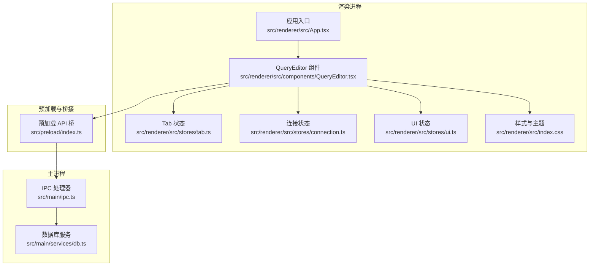
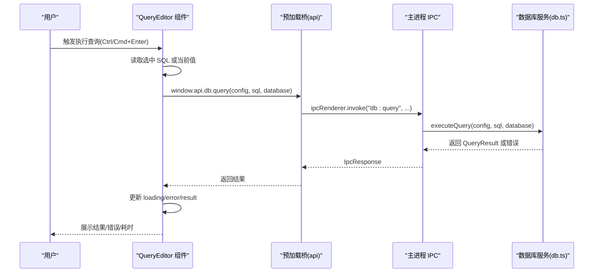
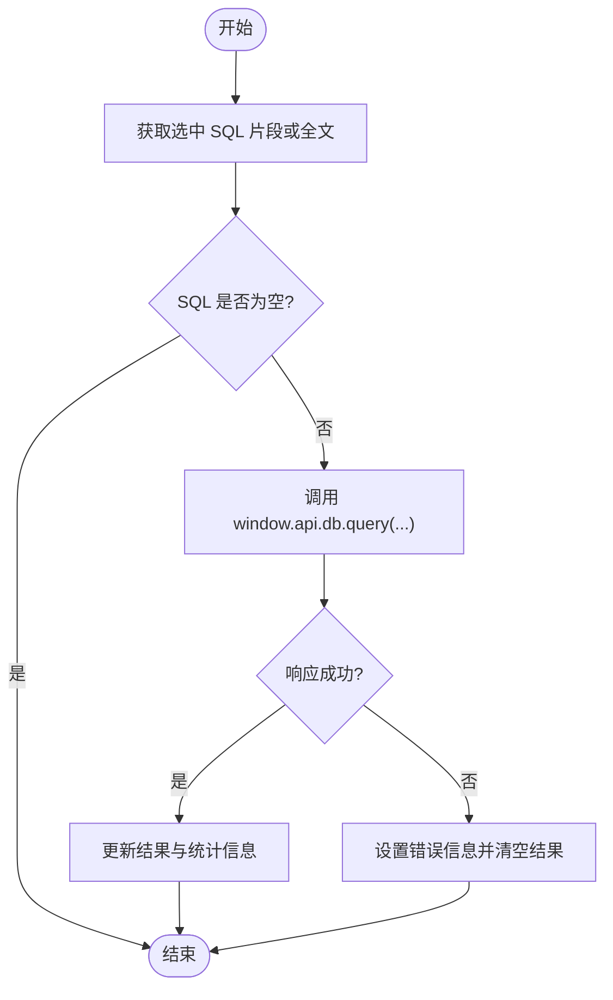
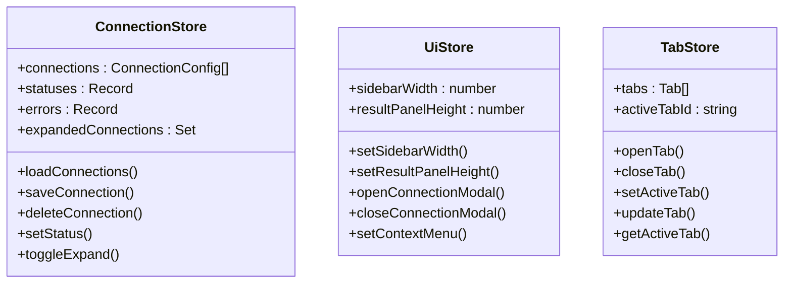
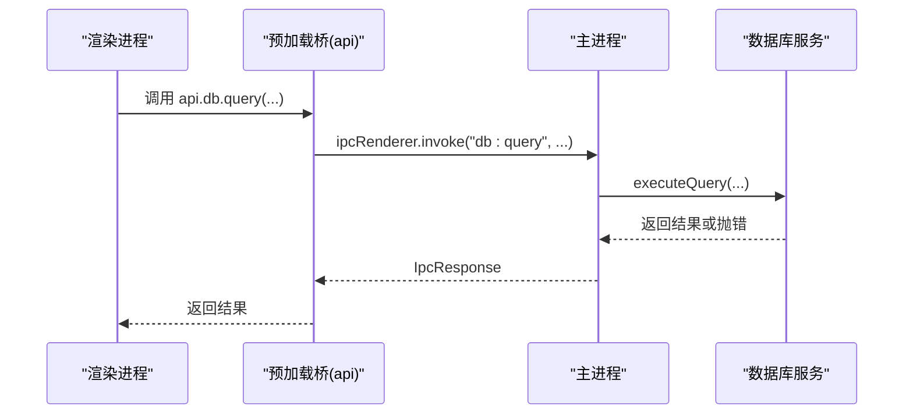
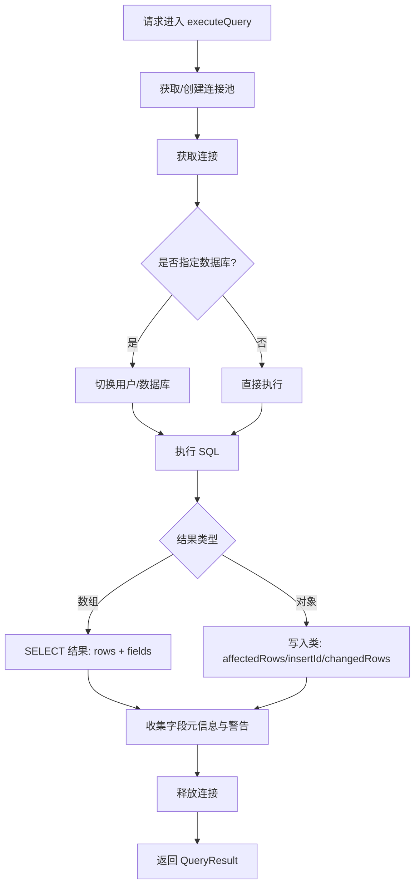
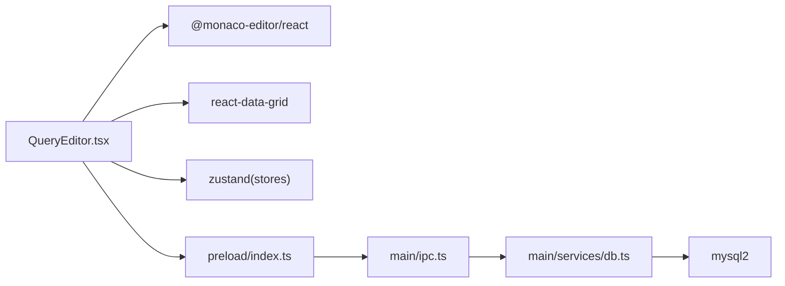

# 查询编辑器组件

<cite>
**本文引用的文件**
- [src/renderer/src/components/QueryEditor.tsx](file://src/renderer/src/components/QueryEditor.tsx)
- [src/renderer/src/stores/tab.ts](file://src/renderer/src/stores/tab.ts)
- [src/renderer/src/stores/connection.ts](file://src/renderer/src/stores/connection.ts)
- [src/renderer/src/stores/ui.ts](file://src/renderer/src/stores/ui.ts)
- [src/main/services/db.ts](file://src/main/services/db.ts)
- [src/main/ipc.ts](file://src/main/ipc.ts)
- [src/preload/index.ts](file://src/preload/index.ts)
- [src/shared/types/index.ts](file://src/shared/types/index.ts)
- [package.json](file://package.json)
- [src/renderer/src/index.css](file://src/renderer/src/index.css)
- [src/renderer/src/App.tsx](file://src/renderer/src/App.tsx)
</cite>

## 目录
1. [简介](#简介)
2. [项目结构](#项目结构)
3. [核心组件](#核心组件)
4. [架构总览](#架构总览)
5. [详细组件分析](#详细组件分析)
6. [依赖关系分析](#依赖关系分析)
7. [性能考虑](#性能考虑)
8. [故障排查指南](#故障排查指南)
9. [结论](#结论)
10. [附录](#附录)

## 简介
本文件面向“nexSql 查询编辑器组件”，系统化阐述其基于 Monaco Editor 的实现与集成方式，覆盖以下方面：
- SQL 语法高亮、智能提示与代码补全的现状与扩展建议
- 错误检测与运行时诊断
- 编辑器配置项、主题定制与快捷键绑定
- 使用示例与扩展开发指南
- 性能优化与大文件处理能力
- 可访问性与国际化配置建议

该组件通过 React + Monaco Editor 实现，配合 Electron 的 IPC 通道与后端 MySQL 连接池完成查询执行与结果展示。

## 项目结构
查询编辑器位于渲染进程的组件层，与状态管理、预加载桥接、主进程服务共同构成完整的查询执行链路。

**图表来源**
- [src/renderer/src/components/QueryEditor.tsx:1-329](file://src/renderer/src/components/QueryEditor.tsx#L1-L329)
- [src/renderer/src/stores/connection.ts:1-64](file://src/renderer/src/stores/connection.ts#L1-L64)
- [src/renderer/src/stores/ui.ts:1-41](file://src/renderer/src/stores/ui.ts#L1-L41)
- [src/renderer/src/stores/tab.ts:1-65](file://src/renderer/src/stores/tab.ts#L1-L65)
- [src/renderer/src/index.css:1-139](file://src/renderer/src/index.css#L1-L139)
- [src/renderer/src/App.tsx:1-35](file://src/renderer/src/App.tsx#L1-L35)
- [src/preload/index.ts:1-60](file://src/preload/index.ts#L1-L60)
- [src/main/ipc.ts:1-182](file://src/main/ipc.ts#L1-L182)
- [src/main/services/db.ts:1-277](file://src/main/services/db.ts#L1-L277)

**章节来源**
- [src/renderer/src/components/QueryEditor.tsx:1-329](file://src/renderer/src/components/QueryEditor.tsx#L1-L329)
- [src/renderer/src/stores/connection.ts:1-64](file://src/renderer/src/stores/connection.ts#L1-L64)
- [src/renderer/src/stores/ui.ts:1-41](file://src/renderer/src/stores/ui.ts#L1-L41)
- [src/renderer/src/stores/tab.ts:1-65](file://src/renderer/src/stores/tab.ts#L1-L65)
- [src/renderer/src/index.css:1-139](file://src/renderer/src/index.css#L1-L139)
- [src/renderer/src/App.tsx:1-35](file://src/renderer/src/App.tsx#L1-L35)
- [src/preload/index.ts:1-60](file://src/preload/index.ts#L1-L60)
- [src/main/ipc.ts:1-182](file://src/main/ipc.ts#L1-L182)
- [src/main/services/db.ts:1-277](file://src/main/services/db.ts#L1-L277)

## 核心组件
- 查询编辑器组件：负责编辑器初始化、SQL 执行、结果展示与交互（工具栏、结果面板、CSV 导出、面板拖拽等）
- 状态管理：
  - 连接状态：维护连接列表、连接状态与错误
  - UI 状态：侧边栏宽度、结果面板高度、上下文菜单等
  - Tab 状态：打开/关闭标签页、激活标签页、更新标签页
- 预加载桥接：在渲染进程暴露安全的 API 调用，通过 IPC 与主进程通信
- 主进程服务：连接池管理、数据库元数据查询、SQL 执行与结果封装
- 共享类型：统一的连接配置、查询结果、Tab 类型等接口定义

**章节来源**
- [src/renderer/src/components/QueryEditor.tsx:17-64](file://src/renderer/src/components/QueryEditor.tsx#L17-L64)
- [src/renderer/src/stores/connection.ts:4-15](file://src/renderer/src/stores/connection.ts#L4-L15)
- [src/renderer/src/stores/ui.ts:3-15](file://src/renderer/src/stores/ui.ts#L3-L15)
- [src/renderer/src/stores/tab.ts:4-13](file://src/renderer/src/stores/tab.ts#L4-L13)
- [src/preload/index.ts:14-46](file://src/preload/index.ts#L14-L46)
- [src/main/ipc.ts:46-177](file://src/main/ipc.ts#L46-L177)
- [src/main/services/db.ts:73-135](file://src/main/services/db.ts#L73-L135)
- [src/shared/types/index.ts:3-22](file://src/shared/types/index.ts#L3-L22)

## 架构总览
查询执行的关键流程如下：

**图表来源**
- [src/renderer/src/components/QueryEditor.tsx:36-64](file://src/renderer/src/components/QueryEditor.tsx#L36-L64)
- [src/preload/index.ts:33](file://src/preload/index.ts#L33)
- [src/main/ipc.ts:106-117](file://src/main/ipc.ts#L106-L117)
- [src/main/services/db.ts:73-135](file://src/main/services/db.ts#L73-L135)

## 详细组件分析

### 查询编辑器组件（QueryEditor）
- 编辑器初始化与事件绑定
  - 使用 @monaco-editor/react 渲染编辑器，默认语言为 SQL，主题 vs-dark
  - 通过 onMount 注入快捷键命令：Ctrl/Cmd+Enter 执行查询
- SQL 执行逻辑
  - 优先取当前选中片段；若无选中则执行全文
  - 调用 window.api.db.query 发起 IPC 请求
  - 成功返回 QueryResult，失败记录 error 并清空结果
- 结果面板
  - 展示耗时、影响行数、警告等统计信息
  - 支持 CSV 导出与清空结果
  - 支持拖拽调整结果面板高度
- 工具栏
  - 执行按钮、结果面板开关、连接标识

**图表来源**
- [src/renderer/src/components/QueryEditor.tsx:36-64](file://src/renderer/src/components/QueryEditor.tsx#L36-L64)
- [src/preload/index.ts:33](file://src/preload/index.ts#L33)
- [src/main/ipc.ts:106-117](file://src/main/ipc.ts#L106-L117)
- [src/main/services/db.ts:73-135](file://src/main/services/db.ts#L73-L135)

**章节来源**
- [src/renderer/src/components/QueryEditor.tsx:21-329](file://src/renderer/src/components/QueryEditor.tsx#L21-L329)

### 状态管理与数据流
- 连接状态（Zustand）
  - 维护连接列表、连接状态与错误
  - 提供增删改查与展开折叠等动作
- UI 状态（Zustand）
  - 结果面板高度、侧边栏宽度、上下文菜单等
- Tab 状态（Zustand）
  - 打开/关闭标签页、切换激活、更新属性、获取当前激活标签

**图表来源**
- [src/renderer/src/stores/connection.ts:17-63](file://src/renderer/src/stores/connection.ts#L17-L63)
- [src/renderer/src/stores/ui.ts:26-40](file://src/renderer/src/stores/ui.ts#L26-L40)
- [src/renderer/src/stores/tab.ts:15-64](file://src/renderer/src/stores/tab.ts#L15-L64)

**章节来源**
- [src/renderer/src/stores/connection.ts:1-64](file://src/renderer/src/stores/connection.ts#L1-L64)
- [src/renderer/src/stores/ui.ts:1-41](file://src/renderer/src/stores/ui.ts#L1-L41)
- [src/renderer/src/stores/tab.ts:1-65](file://src/renderer/src/stores/tab.ts#L1-L65)

### 预加载桥接与 IPC
- 预加载桥接暴露安全 API，包括配置管理与数据库操作
- 主进程注册 IPC 处理器，转发到数据库服务
- 统一的 IpcResponse 包裹错误信息，便于前端展示

**图表来源**
- [src/preload/index.ts:14-46](file://src/preload/index.ts#L14-L46)
- [src/main/ipc.ts:106-117](file://src/main/ipc.ts#L106-L117)
- [src/main/services/db.ts:73-135](file://src/main/services/db.ts#L73-L135)

**章节来源**
- [src/preload/index.ts:1-60](file://src/preload/index.ts#L1-L60)
- [src/main/ipc.ts:46-177](file://src/main/ipc.ts#L46-L177)

### 数据库服务与连接池
- 基于 mysql2/promise 的连接池管理
- 支持测试连接、建立连接、断开连接、查询执行、元数据查询
- 查询执行包含耗时统计与警告提取

**图表来源**
- [src/main/services/db.ts:73-135](file://src/main/services/db.ts#L73-L135)

**章节来源**
- [src/main/services/db.ts:1-277](file://src/main/services/db.ts#L1-L277)

## 依赖关系分析
- 前端依赖
  - @monaco-editor/react 与 monaco-editor：编辑器核心
  - lucide-react：图标
  - react-data-grid：结果表格展示
  - zustand：轻量状态管理
- 后端依赖
  - mysql2：MySQL 连接与查询
  - electron-store：本地配置持久化
  - electron：主进程与 IPC

**图表来源**
- [package.json:16-26](file://package.json#L16-L26)
- [src/renderer/src/components/QueryEditor.tsx:1-15](file://src/renderer/src/components/QueryEditor.tsx#L1-L15)
- [src/preload/index.ts:14-46](file://src/preload/index.ts#L14-L46)
- [src/main/ipc.ts:46-177](file://src/main/ipc.ts#L46-L177)
- [src/main/services/db.ts:1-2](file://src/main/services/db.ts#L1-L2)

**章节来源**
- [package.json:16-26](file://package.json#L16-L26)

## 性能考虑
- 编辑器性能
  - 关闭 minimap，减少渲染开销
  - 自动布局开启，适配窗口变化
  - 行号、折叠、自动换行按需启用
- 查询性能
  - 连接池限制并发连接数，避免资源争用
  - 对 SELECT 结果仅返回必要字段元信息，避免传输冗余
  - 写入类语句仅返回影响行数等关键指标
- 大文件处理
  - 当前未见专门的大文件分片/虚拟滚动实现
  - 建议：对超长 SQL 分块执行；结果表格采用虚拟滚动；限制一次性导出行数
- 内存与连接
  - 连接池按连接配置缓存；断开连接时及时释放
  - 避免在渲染进程中持有过大的字符串或二进制数据

**章节来源**
- [src/renderer/src/components/QueryEditor.tsx:177-194](file://src/renderer/src/components/QueryEditor.tsx#L177-L194)
- [src/main/services/db.ts:11-28](file://src/main/services/db.ts#L11-L28)
- [src/main/services/db.ts:73-135](file://src/main/services/db.ts#L73-L135)

## 故障排查指南
- 常见问题
  - 执行按钮不可用：确认已选择有效连接（config 存在）
  - 无结果：检查 SQL 是否为空；查看错误面板中的错误信息
  - 结果面板无法拖拽：确认 showResult 为 true 且存在结果
- 错误捕获与日志
  - 主进程统一记录错误堆栈与附加信息
  - 前端收到 IpcResponse 后根据 success 字段更新 UI
- 建议排查步骤
  - 检查连接配置与网络连通性
  - 尝试最小化 SQL 复现问题
  - 查看控制台错误输出

**章节来源**
- [src/renderer/src/components/QueryEditor.tsx:36-64](file://src/renderer/src/components/QueryEditor.tsx#L36-L64)
- [src/main/ipc.ts:16-44](file://src/main/ipc.ts#L16-L44)
- [src/main/ipc.ts:106-117](file://src/main/ipc.ts#L106-L117)

## 结论
该查询编辑器组件以 React + Monaco Editor 为基础，结合 Electron IPC 与 mysql2 连接池，实现了从 SQL 编辑、执行到结果展示的完整闭环。当前版本聚焦基础功能与稳定性，后续可在智能提示、错误检测、大文件处理与可访问性方面持续增强。

## 附录

### 编辑器配置与主题定制
- 主题
  - 默认主题 vs-dark，背景色由样式覆盖
- 字体与排版
  - 字体族 JetBrains Mono，字号 13，行号开启，自动换行开启
- 交互特性
  - 折叠、行高亮、平滑滚动、光标平滑闪烁
- 样式覆盖
  - Monaco 编辑器容器背景色与滚动条样式统一

**章节来源**
- [src/renderer/src/components/QueryEditor.tsx:177-194](file://src/renderer/src/components/QueryEditor.tsx#L177-L194)
- [src/renderer/src/index.css:44-50](file://src/renderer/src/index.css#L44-L50)

### 快捷键绑定
- Ctrl/Cmd+Enter：执行查询
- 通过编辑器实例注入命令实现

**章节来源**
- [src/renderer/src/components/QueryEditor.tsx:66-74](file://src/renderer/src/components/QueryEditor.tsx#L66-L74)

### 使用示例与扩展开发指南
- 基础使用
  - 在标签页中传入 Tab 参数，组件会根据连接 ID 与数据库名进行查询
- 扩展方向
  - 语法高亮与智能提示：Monaco Editor 支持自定义语言与提供程序，可引入 SQL 语言包与建议提供程序
  - 错误检测：在渲染进程解析后端返回的错误信息，结合 Monaco 的诊断能力展示
  - 大文件处理：对超长 SQL 分块执行；结果表格采用虚拟滚动；限制导出行数
  - 可访问性：为工具栏按钮添加 aria-label；确保键盘可达；提供屏幕阅读器友好的错误提示
  - 国际化：将 UI 文案抽取为 i18n 资源，按语言动态切换

**章节来源**
- [src/renderer/src/components/QueryEditor.tsx:21-329](file://src/renderer/src/components/QueryEditor.tsx#L21-L329)
- [src/shared/types/index.ts:114-123](file://src/shared/types/index.ts#L114-L123)