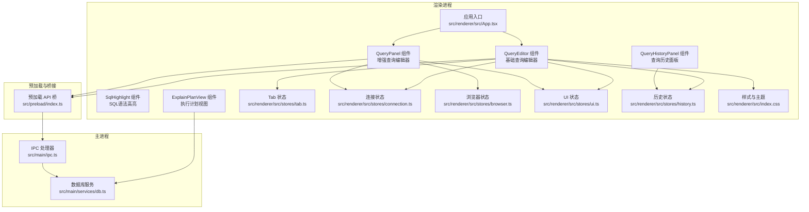
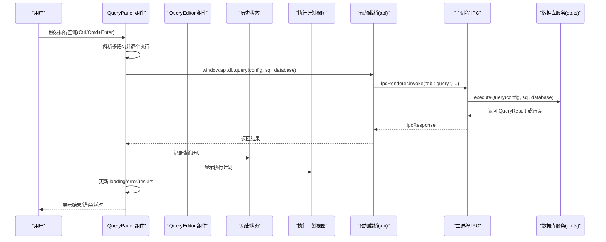
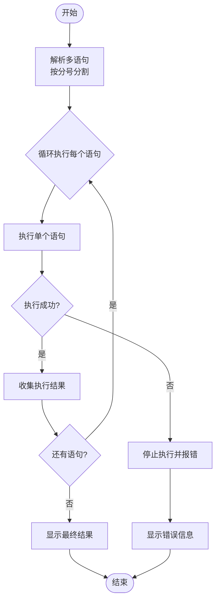
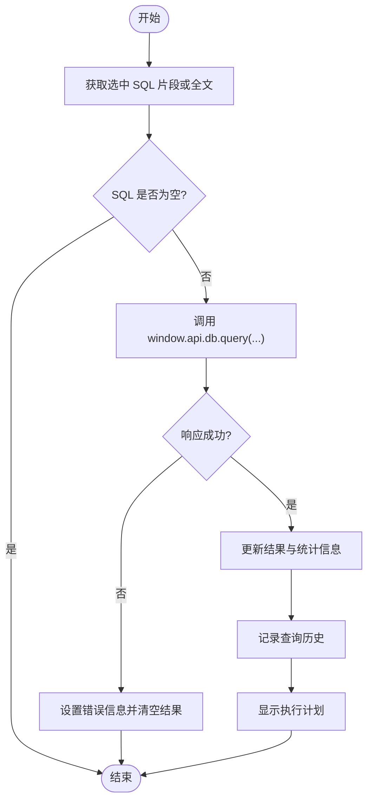
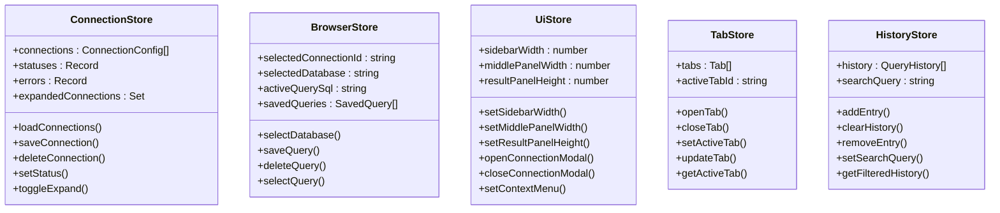
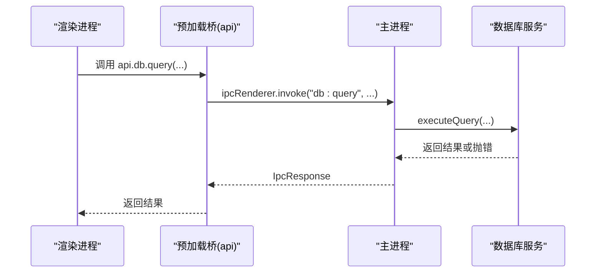
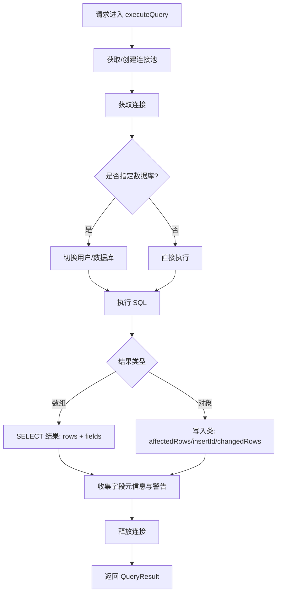
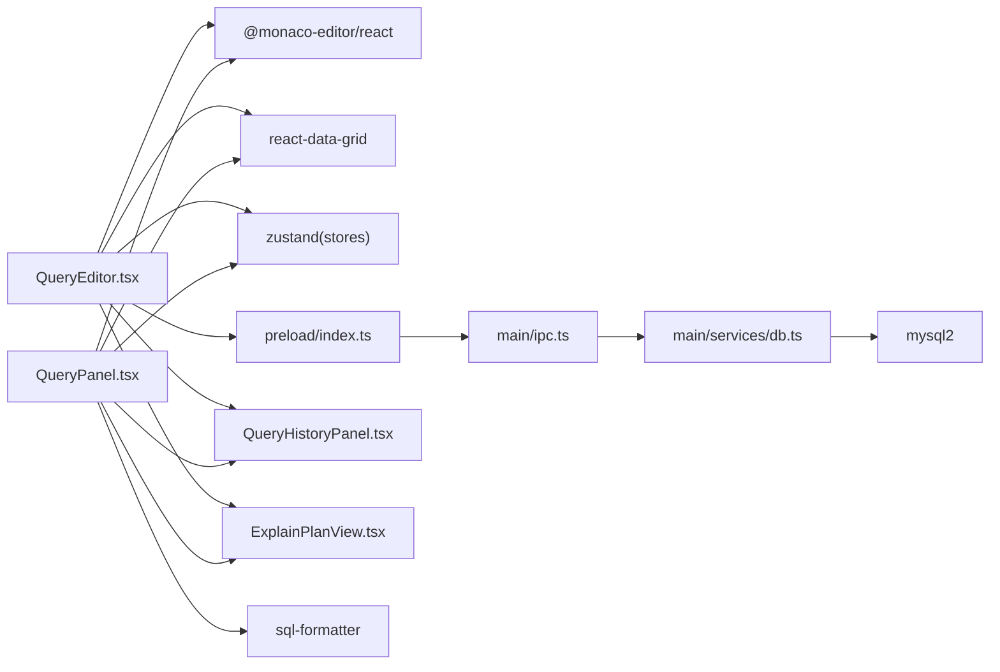

# 查询编辑器组件

<cite>
**本文引用的文件**
- [src/renderer/src/components/QueryEditor.tsx](file://src/renderer/src/components/QueryEditor.tsx)
- [src/renderer/src/components/QueryPanel.tsx](file://src/renderer/src/components/QueryPanel.tsx)
- [src/renderer/src/components/SqlHighlight.tsx](file://src/renderer/src/components/SqlHighlight.tsx)
- [src/renderer/src/components/QueryHistoryPanel.tsx](file://src/renderer/src/components/QueryHistoryPanel.tsx)
- [src/renderer/src/components/ExplainPlanView.tsx](file://src/renderer/src/components/ExplainPlanView.tsx)
- [src/renderer/src/stores/tab.ts](file://src/renderer/src/stores/tab.ts)
- [src/renderer/src/stores/connection.ts](file://src/renderer/src/stores/connection.ts)
- [src/renderer/src/stores/ui.ts](file://src/renderer/src/stores/ui.ts)
- [src/renderer/src/stores/browser.ts](file://src/renderer/src/stores/browser.ts)
- [src/renderer/src/stores/history.ts](file://src/renderer/src/stores/history.ts)
- [src/main/services/db.ts](file://src/main/services/db.ts)
- [src/main/ipc.ts](file://src/main/ipc.ts)
- [src/preload/index.ts](file://src/preload/index.ts)
- [src/shared/types/index.ts](file://src/shared/types/index.ts)
- [package.json](file://package.json)
- [src/renderer/src/index.css](file://src/renderer/src/index.css)
- [src/renderer/src/App.tsx](file://src/renderer/src/App.tsx)
</cite>

## 更新摘要
**变更内容**
- 新增了基于 Monaco Editor 的增强查询编辑器组件
- 实现了 SQL 语法高亮、智能补全、多语句执行等功能
- 新增查询历史记录管理功能，支持本地存储和搜索
- 新增执行计划分析功能，支持 EXPLAIN 和 EXPLAIN FORMAT=TREE
- 新增代码片段管理，支持查询保存和复用
- 添加了 QueryPanel 组件，提供更完整的查询编辑体验
- 增强了 SQL 格式化、自动补全、错误检测能力
- 改进了用户界面和交互体验

## 目录
1. [简介](#简介)
2. [项目结构](#项目结构)
3. [核心组件](#核心组件)
4. [架构总览](#架构总览)
5. [详细组件分析](#详细组件分析)
6. [依赖关系分析](#依赖关系分析)
7. [性能考虑](#性能考虑)
8. [故障排查指南](#故障排查指南)
9. [结论](#结论)
10. [附录](#附录)

## 简介
本文件面向"nexSql 查询编辑器组件"，系统化阐述其基于 Monaco Editor 的实现与集成方式，覆盖以下方面：
- **SQL 语法高亮**：内置 SQL 关键字识别和颜色标记
- **智能提示与代码补全**：基于表结构的自动补全，支持关键字、表名、字段名补全
- **查询历史管理**：本地存储查询历史，支持搜索、筛选和管理
- **执行计划分析**：支持 EXPLAIN 和 EXPLAIN FORMAT=TREE，提供可视化执行计划
- **代码片段管理**：支持查询保存、复用和管理
- **多语句执行**：支持批量执行多个 SQL 语句，按分号分割并逐个执行
- **错误检测与运行时诊断**：实时错误提示和执行状态反馈
- **编辑器配置项**：字体、主题、快捷键绑定等配置
- **使用示例与扩展开发指南**：如何使用和扩展编辑器功能
- **性能优化与大文件处理**：连接池管理和内存优化策略
- **可访问性与国际化配置**：无障碍支持和多语言配置

该组件通过 React + Monaco Editor 实现，配合 Electron 的 IPC 通道与后端 MySQL 连接池完成查询执行与结果展示。

## 项目结构
查询编辑器位于渲染进程的组件层，与状态管理、预加载桥接、主进程服务共同构成完整的查询执行链路。

**图表来源**
- [src/renderer/src/components/QueryEditor.tsx:1-426](file://src/renderer/src/components/QueryEditor.tsx#L1-L426)
- [src/renderer/src/components/QueryPanel.tsx:1-567](file://src/renderer/src/components/QueryPanel.tsx#L1-L567)
- [src/renderer/src/components/QueryHistoryPanel.tsx:1-182](file://src/renderer/src/components/QueryHistoryPanel.tsx#L1-L182)
- [src/renderer/src/components/ExplainPlanView.tsx:1-239](file://src/renderer/src/components/ExplainPlanView.tsx#L1-L239)
- [src/renderer/src/components/SqlHighlight.tsx:1-142](file://src/renderer/src/components/SqlHighlight.tsx#L1-L142)
- [src/renderer/src/stores/connection.ts:1-64](file://src/renderer/src/stores/connection.ts#L1-L64)
- [src/renderer/src/stores/browser.ts:1-179](file://src/renderer/src/stores/browser.ts#L1-L179)
- [src/renderer/src/stores/ui.ts:1-45](file://src/renderer/src/stores/ui.ts#L1-L45)
- [src/renderer/src/stores/tab.ts:1-65](file://src/renderer/src/stores/tab.ts#L1-L65)
- [src/renderer/src/stores/history.ts:1-76](file://src/renderer/src/stores/history.ts#L1-L76)
- [src/renderer/src/index.css:1-139](file://src/renderer/src/index.css#L1-L139)
- [src/renderer/src/App.tsx:1-35](file://src/renderer/src/App.tsx#L1-L35)
- [src/preload/index.ts:1-60](file://src/preload/index.ts#L1-L60)
- [src/main/ipc.ts:1-182](file://src/main/ipc.ts#L1-L182)
- [src/main/services/db.ts:1-200](file://src/main/services/db.ts#L1-L200)

## 核心组件
- **基础查询编辑器组件**：QueryEditor - 负责基本的 SQL 编辑、执行、结果显示，现已集成查询历史和执行计划功能
- **增强查询编辑器组件**：QueryPanel - 提供完整的查询编辑体验，包含智能补全、多语句执行、格式化、查询保存等功能
- **SQL 语法高亮组件**：SqlHighlight - 内置 SQL 关键字识别和颜色标记
- **查询历史面板组件**：QueryHistoryPanel - 管理查询历史，支持搜索、筛选、删除和导入
- **执行计划视图组件**：ExplainPlanView - 可视化显示 SQL 执行计划，支持标准 EXPLAIN 和 TREE 格式
- **状态管理**：
  - 连接状态：维护连接列表、连接状态与错误
  - 浏览器状态：保存查询历史、活动查询 SQL、数据库选择等
  - UI 状态：侧边栏宽度、结果面板高度、上下文菜单等
  - Tab 状态：打开/关闭标签页、激活标签页、更新标签页
  - 历史状态：查询历史的本地存储和管理
- **预加载桥接**：在渲染进程暴露安全的 API 调用，通过 IPC 与主进程通信
- **主进程服务**：连接池管理、数据库元数据查询、SQL 执行与结果封装
- **共享类型**：统一的连接配置、查询结果、查询历史、Tab 类型等接口定义

**章节来源**
- [src/renderer/src/components/QueryEditor.tsx:17-64](file://src/renderer/src/components/QueryEditor.tsx#L17-L64)
- [src/renderer/src/components/QueryPanel.tsx:38-567](file://src/renderer/src/components/QueryPanel.tsx#L38-L567)
- [src/renderer/src/components/QueryHistoryPanel.tsx:15-182](file://src/renderer/src/components/QueryHistoryPanel.tsx#L15-L182)
- [src/renderer/src/components/ExplainPlanView.tsx:24-239](file://src/renderer/src/components/ExplainPlanView.tsx#L24-L239)
- [src/renderer/src/components/SqlHighlight.tsx:1-142](file://src/renderer/src/components/SqlHighlight.tsx#L1-L142)
- [src/renderer/src/stores/connection.ts:4-15](file://src/renderer/src/stores/connection.ts#L4-L15)
- [src/renderer/src/stores/browser.ts:37-74](file://src/renderer/src/stores/browser.ts#L37-L74)
- [src/renderer/src/stores/ui.ts:3-15](file://src/renderer/src/stores/ui.ts#L3-L15)
- [src/renderer/src/stores/tab.ts:4-13](file://src/renderer/src/stores/tab.ts#L4-L13)
- [src/renderer/src/stores/history.ts:25-76](file://src/renderer/src/stores/history.ts#L25-L76)
- [src/preload/index.ts:14-46](file://src/preload/index.ts#L14-L46)
- [src/main/ipc.ts:46-177](file://src/main/ipc.ts#L46-L177)
- [src/main/services/db.ts:73-135](file://src/main/services/db.ts#L73-L135)
- [src/shared/types/index.ts:3-22](file://src/shared/types/index.ts#L3-L22)

## 架构总览
查询执行的关键流程如下：

**图表来源**
- [src/renderer/src/components/QueryPanel.tsx:102-200](file://src/renderer/src/components/QueryPanel.tsx#L102-L200)
- [src/renderer/src/components/QueryEditor.tsx:46-85](file://src/renderer/src/components/QueryEditor.tsx#L46-L85)
- [src/renderer/src/components/QueryEditor.tsx:68-77](file://src/renderer/src/components/QueryEditor.tsx#L68-L77)
- [src/preload/index.ts:33](file://src/preload/index.ts#L33)
- [src/main/ipc.ts:106-117](file://src/main/ipc.ts#L106-L117)
- [src/main/services/db.ts:73-135](file://src/main/services/db.ts#L73-L135)

## 详细组件分析

### 增强查询编辑器组件（QueryPanel）
**新增功能** - QueryPanel 是基于 Monaco Editor 的增强查询编辑器，提供了完整的查询编辑体验。

- **编辑器初始化与事件绑定**
  - 使用 @monaco-editor/react 渲染编辑器，默认语言为 SQL，主题 vs-dark
  - 通过 onMount 注入快捷键命令：Ctrl/Cmd+Enter 执行查询
  - 支持智能补全、语法高亮、错误检测等高级功能
- **多语句执行逻辑**
  - 支持批量执行多个 SQL 语句，按分号分割并逐个执行
  - 智能跳过字符串内的分号，避免误分割
  - 遇到错误时停止后续执行，提供详细的错误信息
- **智能补全系统**
  - 基于数据库元数据的自动补全
  - 支持关键字、表名、字段名补全
  - 按上下文智能推荐补全项
  - 支持表名.字段名的智能补全
- **SQL 格式化**
  - 内置 SQL 格式化功能
  - 支持 MySQL 语法格式化
  - 可自定义缩进和关键字大小写
- **代码片段管理**
  - 支持查询保存功能
  - 保存查询名称和 SQL 内容
  - 支持查询选择和管理
- **结果面板**
  - 展示耗时、影响行数、警告等统计信息
  - 支持 CSV 和 JSON 导出
  - 支持多语句执行摘要显示

**图表来源**
- [src/renderer/src/components/QueryPanel.tsx:116-184](file://src/renderer/src/components/QueryPanel.tsx#L116-L184)
- [src/renderer/src/components/QueryPanel.tsx:202-291](file://src/renderer/src/components/QueryPanel.tsx#L202-L291)

**章节来源**
- [src/renderer/src/components/QueryPanel.tsx:38-567](file://src/renderer/src/components/QueryPanel.tsx#L38-L567)

### 基础查询编辑器组件（QueryEditor）
**增强功能** - QueryEditor 提供基础的查询编辑功能，并集成了新的智能编辑功能。

- **编辑器初始化与事件绑定**
  - 使用 @monaco-editor/react 渲染编辑器，默认语言为 SQL，主题 vs-dark
  - 通过 onMount 注入快捷键命令：Ctrl/Cmd+Enter 执行查询
- **查询历史集成**
  - 自动记录查询执行历史
  - 支持查询历史面板显示和管理
  - 历史记录包含 SQL、连接、数据库、耗时、行数等信息
- **执行计划分析**
  - 支持 EXPLAIN 执行计划分析
  - 自动回退到标准 EXPLAIN 或 TREE 格式
  - 可视化显示执行计划详情
- **SQL 执行逻辑**
  - 优先取当前选中片段；若无选中则执行全文
  - 调用 window.api.db.query 发起 IPC 请求
  - 成功返回 QueryResult，失败记录 error 并清空结果
- **结果面板**
  - 展示耗时、影响行数、警告等统计信息
  - 支持 CSV 导出与清空结果
  - 支持拖拽调整结果面板高度
- **工具栏**
  - 执行按钮、结果面板开关、连接标识
  - 新增查询历史和执行计划按钮

**图表来源**
- [src/renderer/src/components/QueryEditor.tsx:46-85](file://src/renderer/src/components/QueryEditor.tsx#L46-L85)
- [src/renderer/src/components/QueryEditor.tsx:68-77](file://src/renderer/src/components/QueryEditor.tsx#L68-L77)
- [src/preload/index.ts:33](file://src/preload/index.ts#L33)
- [src/main/ipc.ts:106-117](file://src/main/ipc.ts#L106-L117)
- [src/main/services/db.ts:73-135](file://src/main/services/db.ts#L73-L135)

**章节来源**
- [src/renderer/src/components/QueryEditor.tsx:21-426](file://src/renderer/src/components/QueryEditor.tsx#L21-L426)

### 查询历史面板组件（QueryHistoryPanel）
**新增功能** - QueryHistoryPanel 提供查询历史的管理界面。

- **历史记录存储**
  - 使用 localStorage 持久化存储查询历史
  - 最大历史记录数量限制为 200 条
  - 支持查询历史的增删改查操作
- **搜索与筛选**
  - 支持按 SQL 内容、数据库、错误信息搜索
  - 实时过滤显示匹配的历史记录
- **历史记录管理**
  - 支持单条删除和批量清空
  - 支持复制 SQL 到剪贴板
  - 支持将历史记录插入到编辑器
- **历史记录展示**
  - 显示执行时间、数据库、耗时、行数等信息
  - 错误状态用红色图标标识，成功状态用绿色图标标识
  - 支持鼠标悬停显示完整 SQL 内容

**章节来源**
- [src/renderer/src/components/QueryHistoryPanel.tsx:1-182](file://src/renderer/src/components/QueryHistoryPanel.tsx#L1-L182)

### 执行计划视图组件（ExplainPlanView）
**新增功能** - ExplainPlanView 提供 SQL 执行计划的可视化分析。

- **执行计划类型**
  - 支持标准 EXPLAIN 输出格式
  - 支持 MySQL 8.0.16+ 的 EXPLAIN FORMAT=TREE
  - 自动检测并选择合适的执行计划格式
- **执行计划分析**
  - 统计分析：全表扫描、临时表、filesort 等警告
  - 访问类型颜色编码：系统表、常量、唯一索引、普通索引等
  - 预估行数和过滤率分析
- **可视化展示**
  - 表格形式展示执行计划详情
  - 颜色编码的访问类型标识
  - 附加信息的分类标签显示
- **总体评估**
  - 基于执行计划质量的评分系统
  - 提供高效、一般、低效的评估结果
  - 识别潜在的性能问题

**章节来源**
- [src/renderer/src/components/ExplainPlanView.tsx:1-239](file://src/renderer/src/components/ExplainPlanView.tsx#L1-L239)

### SQL 语法高亮组件（SqlHighlight）
**新增功能** - SqlHighlight 提供内建的 SQL 语法高亮功能。

- **关键词识别**
  - 支持 MySQL 关键字识别
  - 包含 DDL、DML、数据类型等关键字
  - 智能区分关键字和标识符
- **语法标记**
  - 关键字：粉色高亮
  - 数据类型：天蓝色高亮
  - 字符串：绿色高亮
  - 反引号标识符：琥珀色高亮
  - 数字：橙色高亮
  - 注释：灰色斜体
- **词法分析**
  - 支持多行注释和单行注释
  - 正确处理字符串和反引号标识符
  - 智能标点符号识别

**章节来源**
- [src/renderer/src/components/SqlHighlight.tsx:1-142](file://src/renderer/src/components/SqlHighlight.tsx#L1-L142)

### 状态管理与数据流
- **连接状态（Zustand）**
  - 维护连接列表、连接状态与错误
  - 提供增删改查与展开折叠等动作
- **浏览器状态（Zustand）**
  - 保存查询历史、活动查询 SQL、数据库选择等
  - 支持保存查询、删除查询、选择查询
- **UI 状态（Zustand）**
  - 结果面板高度、侧边栏宽度、上下文菜单等
- **Tab 状态（Zustand）**
  - 打开/关闭标签页、切换激活、更新属性、获取当前激活标签
- **历史状态（Zustand）**
  - 查询历史的本地存储和管理
  - 支持搜索、过滤、增删操作

**图表来源**
- [src/renderer/src/stores/connection.ts:17-63](file://src/renderer/src/stores/connection.ts#L17-L63)
- [src/renderer/src/stores/browser.ts:76-178](file://src/renderer/src/stores/browser.ts#L76-L178)
- [src/renderer/src/stores/ui.ts:28-44](file://src/renderer/src/stores/ui.ts#L28-L44)
- [src/renderer/src/stores/tab.ts:15-64](file://src/renderer/src/stores/tab.ts#L15-L64)
- [src/renderer/src/stores/history.ts:36-76](file://src/renderer/src/stores/history.ts#L36-L76)

**章节来源**
- [src/renderer/src/stores/connection.ts:1-64](file://src/renderer/src/stores/connection.ts#L1-L64)
- [src/renderer/src/stores/browser.ts:1-179](file://src/renderer/src/stores/browser.ts#L1-L179)
- [src/renderer/src/stores/ui.ts:1-45](file://src/renderer/src/stores/ui.ts#L1-L45)
- [src/renderer/src/stores/tab.ts:1-65](file://src/renderer/src/stores/tab.ts#L1-L65)
- [src/renderer/src/stores/history.ts:1-76](file://src/renderer/src/stores/history.ts#L1-L76)

### 预加载桥接与 IPC
- **预加载桥接**暴露安全 API，包括配置管理与数据库操作
- **主进程注册 IPC 处理器**，转发到数据库服务
- **统一的 IpcResponse** 包裹错误信息，便于前端展示

**图表来源**
- [src/preload/index.ts:14-46](file://src/preload/index.ts#L14-L46)
- [src/main/ipc.ts:106-117](file://src/main/ipc.ts#L106-L117)
- [src/main/services/db.ts:73-135](file://src/main/services/db.ts#L73-L135)

**章节来源**
- [src/preload/index.ts:1-60](file://src/preload/index.ts#L1-L60)
- [src/main/ipc.ts:46-177](file://src/main/ipc.ts#L46-L177)

### 数据库服务与连接池
- **基于 mysql2/promise 的连接池管理**
- **支持测试连接、建立连接、断开连接、查询执行、元数据查询**
- **查询执行包含耗时统计与警告提取**

**图表来源**
- [src/main/services/db.ts:73-135](file://src/main/services/db.ts#L73-L135)

**章节来源**
- [src/main/services/db.ts:1-200](file://src/main/services/db.ts#L1-L200)

## 依赖关系分析
- **前端依赖**
  - @monaco-editor/react 与 monaco-editor：编辑器核心
  - lucide-react：图标
  - react-data-grid：结果表格展示
  - zustand：轻量状态管理
  - sql-formatter：SQL 格式化
- **后端依赖**
  - mysql2：MySQL 连接与查询
  - electron-store：本地配置持久化
  - electron：主进程与 IPC

**图表来源**
- [package.json:16-26](file://package.json#L16-L26)
- [src/renderer/src/components/QueryEditor.tsx:1-15](file://src/renderer/src/components/QueryEditor.tsx#L1-L15)
- [src/renderer/src/components/QueryPanel.tsx:1-5](file://src/renderer/src/components/QueryPanel.tsx#L1-L5)
- [src/preload/index.ts:14-46](file://src/preload/index.ts#L14-L46)
- [src/main/ipc.ts:46-177](file://src/main/ipc.ts#L46-L177)
- [src/main/services/db.ts:1-2](file://src/main/services/db.ts#L1-L2)

**章节来源**
- [package.json:16-26](file://package.json#L16-L26)

## 性能考虑
- **编辑器性能**
  - 关闭 minimap，减少渲染开销
  - 自动布局开启，适配窗口变化
  - 行号、折叠、自动换行按需启用
- **查询性能**
  - 连接池限制并发连接数，避免资源争用
  - 对 SELECT 结果仅返回必要字段元信息，避免传输冗余
  - 写入类语句仅返回影响行数等关键指标
- **多语句执行优化**
  - 智能分号分割，避免误分割
  - 遇错即停，减少无效执行
  - 结果缓存，避免重复查询
- **智能补全性能**
  - 表字段缓存，避免重复查询
  - 数据库切换时预加载字段
  - 按需加载补全数据
- **历史记录管理**
  - 本地存储限制最大历史数量
  - 实时搜索过滤，避免全量匹配
  - 异步存储，不影响编辑器性能
- **内存与连接**
  - 连接池按连接配置缓存；断开连接时及时释放
  - 避免在渲染进程中持有过大的字符串或二进制数据

**章节来源**
- [src/renderer/src/components/QueryEditor.tsx:177-194](file://src/renderer/src/components/QueryEditor.tsx#L177-L194)
- [src/renderer/src/components/QueryPanel.tsx:116-184](file://src/renderer/src/components/QueryPanel.tsx#L116-L184)
- [src/renderer/src/components/QueryPanel.tsx:61-87](file://src/renderer/src/components/QueryPanel.tsx#L61-L87)
- [src/renderer/src/stores/history.ts:4-23](file://src/renderer/src/stores/history.ts#L4-L23)
- [src/main/services/db.ts:11-28](file://src/main/services/db.ts#L11-L28)
- [src/main/services/db.ts:73-135](file://src/main/services/db.ts#L73-L135)

## 故障排查指南
- **常见问题**
  - 执行按钮不可用：确认已选择有效连接（config 存在）
  - 无结果：检查 SQL 是否为空；查看错误面板中的错误信息
  - 多语句执行中断：检查是否有语法错误导致执行停止
  - 查询历史不显示：检查 localStorage 是否可用
  - 执行计划无法显示：确认数据库版本支持 EXPLAIN
- **错误捕获与日志**
  - 主进程统一记录错误堆栈与附加信息
  - 前端收到 IpcResponse 后根据 success 字段更新 UI
- **建议排查步骤**
  - 检查连接配置与网络连通性
  - 尝试最小化 SQL 复现问题
  - 查看控制台错误输出
  - 检查数据库权限和表结构
  - 验证浏览器 localStorage 功能

**章节来源**
- [src/renderer/src/components/QueryEditor.tsx:36-64](file://src/renderer/src/components/QueryEditor.tsx#L36-L64)
- [src/renderer/src/components/QueryPanel.tsx:175-184](file://src/renderer/src/components/QueryPanel.tsx#L175-L184)
- [src/main/ipc.ts:16-44](file://src/main/ipc.ts#L16-L44)
- [src/main/ipc.ts:106-117](file://src/main/ipc.ts#L106-L117)

## 结论
该查询编辑器组件以 React + Monaco Editor 为基础，结合 Electron IPC 与 mysql2 连接池，实现了从 SQL 编辑、执行到结果展示的完整闭环。当前版本包含了三个主要组件：基础的 QueryEditor、增强的 QueryPanel 和专门的功能组件（QueryHistoryPanel、ExplainPlanView）。新增的智能编辑功能包括查询历史管理、执行计划分析、代码片段管理和 SQL 自动补全，显著提升了用户的查询效率和体验。系统在性能、可扩展性和用户体验方面都有显著提升，为后续的功能扩展奠定了良好的基础。

## 附录

### 编辑器配置与主题定制
- **主题**
  - 默认主题 vs-dark，背景色由样式覆盖
- **字体与排版**
  - 字体族 JetBrains Mono，字号 13，行号开启，自动换行开启
- **交互特性**
  - 折叠、行高亮、平滑滚动、光标平滑闪烁
- **智能补全配置**
  - 支持关键字、表名、字段名自动补全
  - 触发字符：空格、点号、反引号
  - 快速建议：开启字符串和注释建议
- **样式覆盖**
  - Monaco 编辑器容器背景色与滚动条样式统一

**章节来源**
- [src/renderer/src/components/QueryEditor.tsx:177-194](file://src/renderer/src/components/QueryEditor.tsx#L177-L194)
- [src/renderer/src/components/QueryPanel.tsx:444-466](file://src/renderer/src/components/QueryPanel.tsx#L444-L466)
- [src/renderer/src/index.css:44-50](file://src/renderer/src/index.css#L44-L50)

### 快捷键绑定
- **Ctrl/Cmd+Enter**：执行查询
- **Ctrl/Cmd+S**：保存查询（QueryPanel）
- **Ctrl/Cmd+Shift+F**：SQL 格式化（QueryPanel）
- **通过编辑器实例注入命令实现**

**章节来源**
- [src/renderer/src/components/QueryEditor.tsx:66-74](file://src/renderer/src/components/QueryEditor.tsx#L66-L74)
- [src/renderer/src/components/QueryPanel.tsx:287-291](file://src/renderer/src/components/QueryPanel.tsx#L287-L291)

### 使用示例与扩展开发指南
- **基础使用**
  - 在标签页中传入 Tab 参数，组件会根据连接 ID 与数据库名进行查询
  - QueryPanel 支持保存查询、格式化 SQL、多语句执行
  - QueryEditor 集成了查询历史和执行计划功能
- **扩展方向**
  - **语法高亮增强**：可以扩展 SqlHighlight 组件，支持更多 SQL 方言
  - **智能补全扩展**：可以增加函数名、存储过程、视图等补全项
  - **错误检测**：在渲染进程解析后端返回的错误信息，结合 Monaco 的诊断能力展示
  - **大文件处理**：对超长 SQL 分块执行；结果表格采用虚拟滚动；限制导出行数
  - **可访问性**：为工具栏按钮添加 aria-label；确保键盘可达；提供屏幕阅读器友好的错误提示
  - **国际化**：将 UI 文案抽取为 i18n 资源，按语言动态切换
  - **查询历史扩展**：可以增加查询分类、标签管理、分享功能
  - **执行计划增强**：可以增加性能对比、慢查询分析、索引建议等功能

**章节来源**
- [src/renderer/src/components/QueryEditor.tsx:21-426](file://src/renderer/src/components/QueryEditor.tsx#L21-L426)
- [src/renderer/src/components/QueryPanel.tsx:302-336](file://src/renderer/src/components/QueryPanel.tsx#L302-L336)
- [src/shared/types/index.ts:114-123](file://src/shared/types/index.ts#L114-L123)

### 多语句执行机制
**新增功能** - QueryPanel 支持多语句执行，提供完整的批处理能力。

- **语句分割算法**
  - 智能识别字符串边界，避免在字符串内分割
  - 支持单引号、双引号、反引号三种字符串类型
  - 支持转义字符处理
- **执行策略**
  - 逐个执行每个语句
  - 遇到错误立即停止
  - 记录每个语句的执行结果
- **结果展示**
  - 显示最后一条有结果集的语句结果
  - 统计总影响行数
  - 多语句模式下显示执行摘要

**章节来源**
- [src/renderer/src/components/QueryPanel.tsx:116-184](file://src/renderer/src/components/QueryPanel.tsx#L116-L184)

### SQL 自动补全系统
**新增功能** - 基于数据库元数据的智能补全。

- **补全类型**
  - **关键字补全**：SQL 关键字、函数名、数据类型
  - **表名补全**：当前数据库下的所有表
  - **字段名补全**：特定表的字段列表
  - **上下文感知**：根据当前位置智能推荐
- **触发机制**
  - 空格、点号、反引号触发补全
  - 支持快速建议和接受建议
  - 智能排序补全项
- **性能优化**
  - 表字段缓存，避免重复查询
  - 数据库切换时预加载字段
  - 按需加载补全数据

**章节来源**
- [src/renderer/src/components/QueryPanel.tsx:202-291](file://src/renderer/src/components/QueryPanel.tsx#L202-L291)
- [src/renderer/src/stores/browser.ts:61-73](file://src/renderer/src/stores/browser.ts#L61-L73)

### 查询历史管理系统
**新增功能** - 基于本地存储的查询历史管理。

- **存储机制**
  - 使用 localStorage 持久化存储查询历史
  - 最大历史记录数量限制为 200 条
  - 自动清理超出限制的历史记录
- **管理功能**
  - 实时搜索和过滤历史记录
  - 支持单条删除和批量清空
  - 支持复制 SQL 到剪贴板
- **历史记录结构**
  - 包含 SQL 内容、连接信息、数据库、执行时间
  - 记录执行耗时、影响行数、错误状态
  - 支持按多种条件搜索和筛选

**章节来源**
- [src/renderer/src/stores/history.ts:1-76](file://src/renderer/src/stores/history.ts#L1-L76)
- [src/shared/types/index.ts:170-180](file://src/shared/types/index.ts#L170-L180)

### 执行计划分析功能
**新增功能** - 基于 MySQL EXPLAIN 的执行计划分析。

- **执行计划类型**
  - 标准 EXPLAIN：兼容所有 MySQL 版本
  - EXPLAIN FORMAT=TREE：MySQL 8.0.16+ 新特性
  - 自动格式检测和回退机制
- **分析维度**
  - 访问类型分析：系统表、常量、唯一索引、普通索引等
  - 性能警告识别：全表扫描、临时表、filesort 等
  - 预估行数和过滤率统计
- **可视化展示**
  - 颜色编码的访问类型标识
  - 附加信息的分类标签显示
  - 总体性能评分和建议

**章节来源**
- [src/renderer/src/components/QueryEditor.tsx:87-126](file://src/renderer/src/components/QueryEditor.tsx#L87-L126)
- [src/renderer/src/components/ExplainPlanView.tsx:31-61](file://src/renderer/src/components/ExplainPlanView.tsx#L31-L61)