# 表设计组件

<cite>
**本文档引用的文件**
- [TableDesign.tsx](file://src/renderer/src/components/TableDesign.tsx)
- [NewTableDesigner.tsx](file://src/renderer/src/components/NewTableDesigner.tsx)
- [ColumnsEditor.tsx](file://src/renderer/src/components/editors/ColumnsEditor.tsx)
- [ForeignKeysEditor.tsx](file://src/renderer/src/components/editors/ForeignKeysEditor.tsx)
- [IndexesEditor.tsx](file://src/renderer/src/components/editors/IndexesEditor.tsx)
- [TableOptionsEditor.tsx](file://src/renderer/src/components/editors/TableOptionsEditor.tsx)
- [index.ts](file://src/shared/types/index.ts)
- [connection.ts](file://src/renderer/src/stores/connection.ts)
- [db.ts](file://src/main/services/db.ts)
- [index.ts](file://src/preload/index.ts)
- [ipc.ts](file://src/main/ipc.ts)
- [App.tsx](file://src/renderer/src/App.tsx)
- [MainContent.tsx](file://src/renderer/src/components/MainContent.tsx)
- [ConnectionTree.tsx](file://src/renderer/src/components/ConnectionTree.tsx)
- [tab.ts](file://src/renderer/src/stores/tab.ts)
- [package.json](file://package.json)
</cite>

## 更新摘要
**所做更改**
- 新增了完整的表设计编辑器组件体系
- 增强了可视化列定义和类型验证功能
- 新增主键外键关系管理功能
- 完善了索引管理和表选项编辑功能
- 实现了变更追踪和批量提交机制
- 更新了数据同步和错误处理机制

## 目录
1. [简介](#简介)
2. [项目结构](#项目结构)
3. [核心组件](#核心组件)
4. [架构概览](#架构概览)
5. [详细组件分析](#详细组件分析)
6. [增强功能详解](#增强功能详解)
7. [依赖关系分析](#依赖关系分析)
8. [性能考虑](#性能考虑)
9. [故障排除指南](#故障排除指南)
10. [结论](#结论)

## 简介

表设计组件是 nexSql 数据库管理工具中的核心功能模块，经过重大增强后，现已支持完整的可视化表设计功能。该组件提供了直观的可视化界面，让用户能够创建、编辑和管理数据库表的结构，包括字段定义、类型验证、主键外键关系、索引管理和表选项配置等高级功能。

**更新** 组件现已从简单的表结构展示升级为完整的表设计编辑器，支持实时预览、变更追踪和批量提交等企业级功能。

## 项目结构

nexSql 采用 Electron + React 架构，项目结构清晰地分离了前端界面、后端服务和共享类型定义。经过增强后，新增了完整的编辑器组件体系：

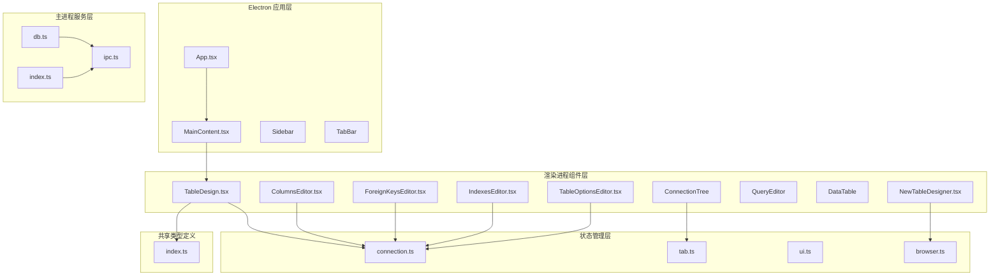

**图表来源**
- [App.tsx:1-35](file://src/renderer/src/App.tsx#L1-L35)
- [MainContent.tsx:1-34](file://src/renderer/src/components/MainContent.tsx#L1-L34)
- [NewTableDesigner.tsx:1-320](file://src/renderer/src/components/NewTableDesigner.tsx#L1-L320)
- [ColumnsEditor.tsx:1-261](file://src/renderer/src/components/editors/ColumnsEditor.tsx#L1-L261)

**章节来源**
- [package.json:1-42](file://package.json#L1-L42)
- [App.tsx:1-35](file://src/renderer/src/App.tsx#L1-L35)

## 核心组件

表设计组件体系由多个专业化的编辑器组件构成，每个组件专注于特定的表设计功能：

### 数据模型定义

组件使用统一的类型系统来确保前后端数据的一致性，新增了丰富的表设计相关类型：

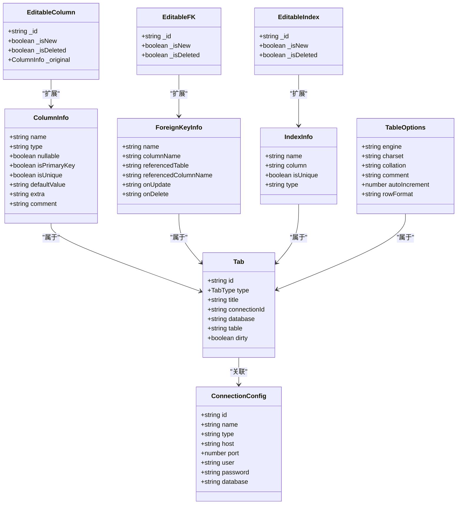

**图表来源**
- [index.ts:49-74](file://src/shared/types/index.ts#L49-L74)
- [index.ts:85-92](file://src/shared/types/index.ts#L85-L92)
- [index.ts:191-202](file://src/shared/types/index.ts#L191-L202)

### 组件架构

表设计组件采用模块化架构，每个编辑器组件都独立负责特定功能领域：

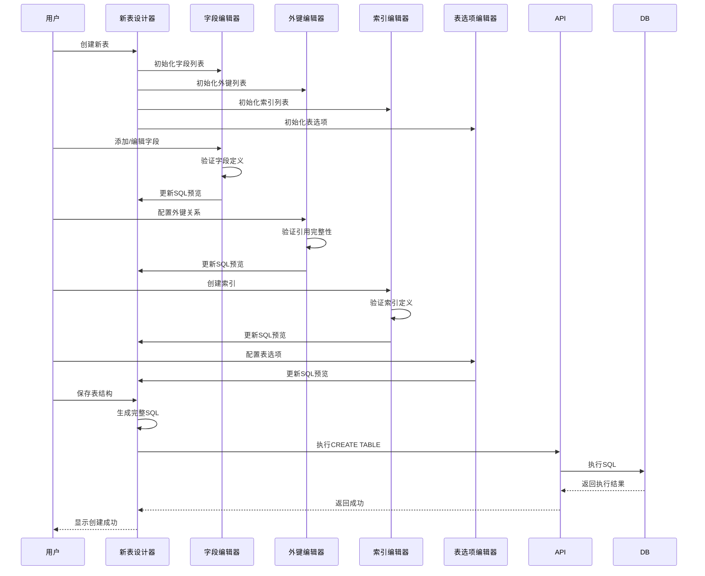

**图表来源**
- [NewTableDesigner.tsx:93-143](file://src/renderer/src/components/NewTableDesigner.tsx#L93-L143)
- [ColumnsEditor.tsx:145-184](file://src/renderer/src/components/editors/ColumnsEditor.tsx#L145-L184)
- [ForeignKeysEditor.tsx:77-107](file://src/renderer/src/components/editors/ForeignKeysEditor.tsx#L77-L107)
- [IndexesEditor.tsx:76-108](file://src/renderer/src/components/editors/IndexesEditor.tsx#L76-L108)
- [TableOptionsEditor.tsx:62-82](file://src/renderer/src/components/editors/TableOptionsEditor.tsx#L62-L82)

**章节来源**
- [NewTableDesigner.tsx:1-320](file://src/renderer/src/components/NewTableDesigner.tsx#L1-L320)
- [ColumnsEditor.tsx:1-261](file://src/renderer/src/components/editors/ColumnsEditor.tsx#L1-L261)
- [ForeignKeysEditor.tsx:1-162](file://src/renderer/src/components/editors/ForeignKeysEditor.tsx#L1-L162)
- [IndexesEditor.tsx:1-158](file://src/renderer/src/components/editors/IndexesEditor.tsx#L1-L158)
- [TableOptionsEditor.tsx:1-146](file://src/renderer/src/components/editors/TableOptionsEditor.tsx#L1-L146)

## 架构概览

表设计组件遵循分层架构设计，确保各层职责明确且松耦合。经过增强后，架构更加完善，支持复杂的表设计场景：

```mermaid
graph TB
subgraph "表现层"
UI[React组件]
TableDesign[TableDesign.tsx]
NewTableDesigner[NewTableDesigner.tsx]
Editors[编辑器组件群]
UIComponents[UI组件库]
end
subgraph "状态管理层"
Zustand[Zustand Store]
ConnectionStore[连接状态]
TabStore[标签状态]
BrowserStore[浏览器状态]
end
subgraph "业务逻辑层"
ColumnsEditor[字段编辑器]
ForeignKeysEditor[外键编辑器]
IndexesEditor[索引编辑器]
TableOptionsEditor[表选项编辑器]
NewTableDesigner[新表设计器]
end
subgraph "数据访问层"
IPC[IPC桥接]
API[DbService接口]
MySQL[MySQL连接池]
end
subgraph "类型安全层"
SharedTypes[共享类型]
Validation[类型验证]
ChangeTracking[变更追踪]
End
UI --> TableDesign
UI --> NewTableDesigner
NewTableDesigner --> Editors
Editors --> BrowserStore
TableDesign --> ConnectionStore
NewTableDesigner --> ConnectionStore
ColumnsEditor --> ConnectionStore
ForeignKeysEditor --> ConnectionStore
IndexesEditor --> ConnectionStore
TableOptionsEditor --> ConnectionStore
Zustand --> SharedTypes
IPC --> API
API --> MySQL
SharedTypes --> Validation
Validation --> ChangeTracking
```

**图表来源**
- [NewTableDesigner.tsx:1-17](file://src/renderer/src/components/NewTableDesigner.tsx#L1-L17)
- [ColumnsEditor.tsx:1-14](file://src/renderer/src/components/editors/ColumnsEditor.tsx#L1-L14)
- [connection.ts:17-63](file://src/renderer/src/stores/connection.ts#L17-L63)
- [db.ts:30-36](file://src/main/services/db.ts#L30-L36)

### 数据流设计

组件内部采用单向数据流模式，确保状态更新的可预测性和变更追踪的准确性：

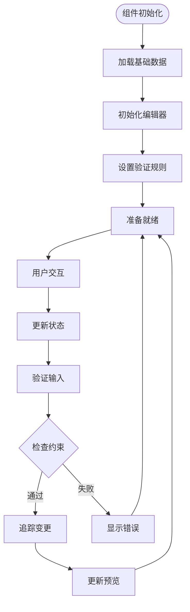

**图表来源**
- [ColumnsEditor.tsx:52-78](file://src/renderer/src/components/editors/ColumnsEditor.tsx#L52-L78)
- [NewTableDesigner.tsx:93-143](file://src/renderer/src/components/NewTableDesigner.tsx#L93-L143)

**章节来源**
- [NewTableDesigner.tsx:10-46](file://src/renderer/src/components/NewTableDesigner.tsx#L10-L46)

## 详细组件分析

### TableDesign 组件核心功能

TableDesign 组件保持了原有的表结构展示功能，为用户提供简洁的只读视图：

#### 字段管理标签页

字段标签页展示了表的所有列信息，包括字段名称、数据类型、是否允许为空、默认值、额外属性和注释：

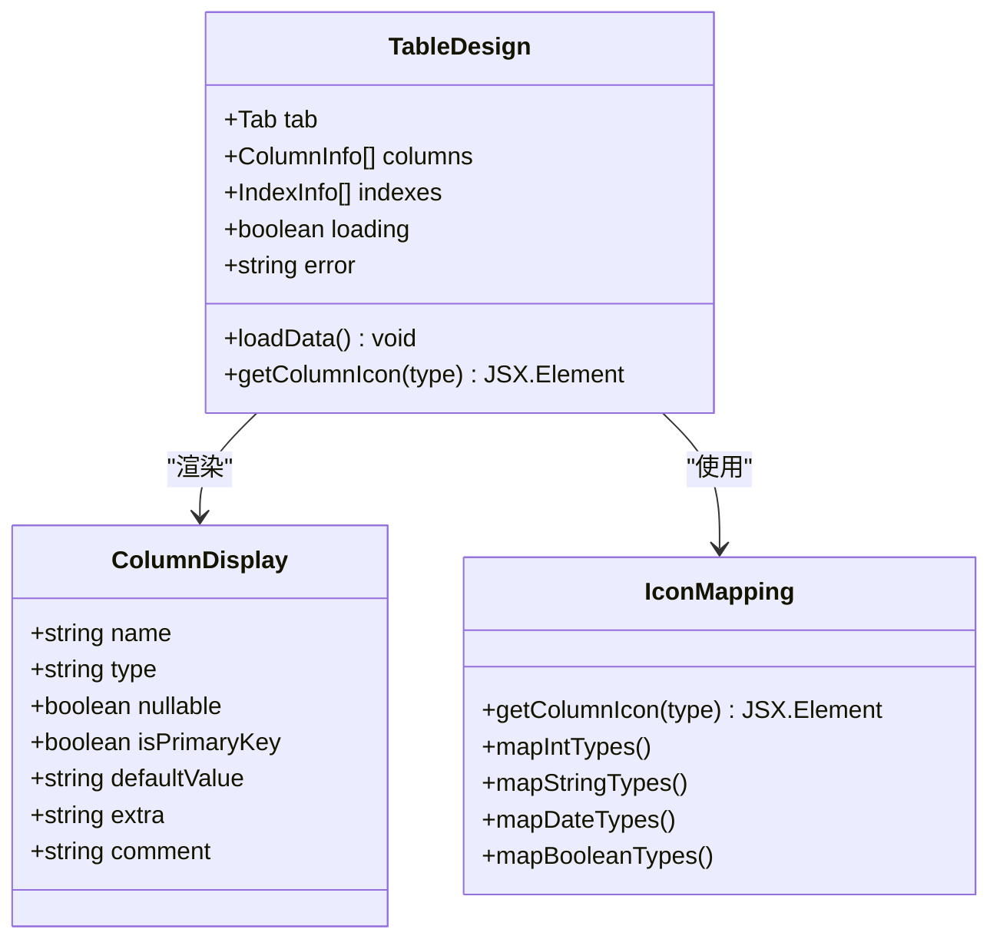

**图表来源**
- [TableDesign.tsx:48-63](file://src/renderer/src/components/TableDesign.tsx#L48-L63)
- [TableDesign.tsx:112-164](file://src/renderer/src/components/TableDesign.tsx#L112-L164)

#### 索引管理标签页

索引标签页提供了表索引的详细信息，包括索引名称、关联字段、唯一性标识和索引类型：

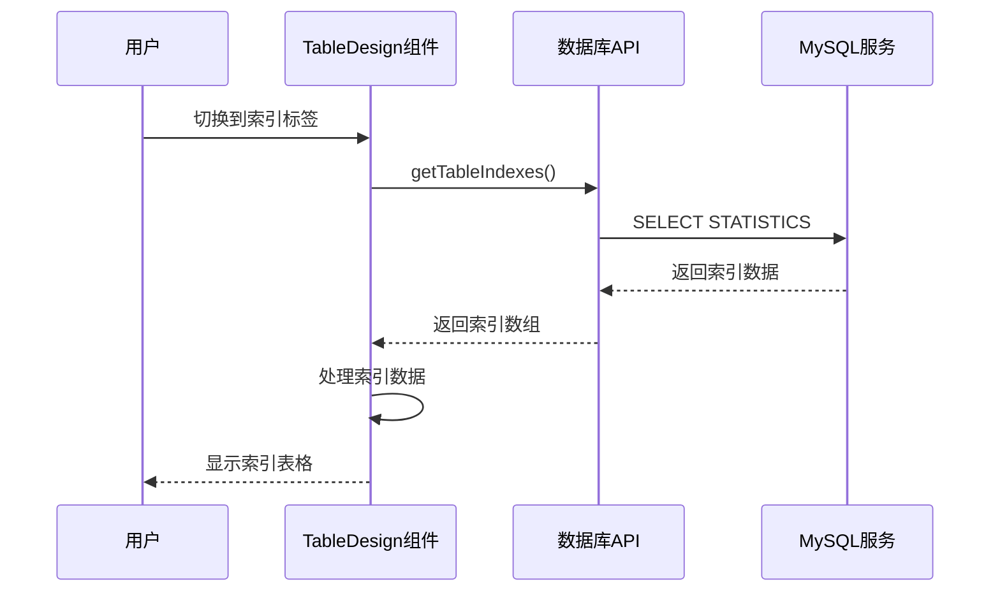

**图表来源**
- [TableDesign.tsx:166-208](file://src/renderer/src/components/TableDesign.tsx#L166-L208)
- [db.ts:226-253](file://src/main/services/db.ts#L226-L253)

#### 表信息标签页

表信息标签页展示了表的基本元数据，包括数据库名、表名、字段数量、索引数量和主键信息。

**章节来源**
- [TableDesign.tsx:210-236](file://src/renderer/src/components/TableDesign.tsx#L210-L236)

### NewTableDesigner 组件核心功能

NewTableDesigner 是全新的表设计编辑器，提供了完整的可视化表创建功能：

#### 可视化表创建界面

NewTableDesigner 提供了直观的表格化界面，支持实时字段编辑和 SQL 预览：

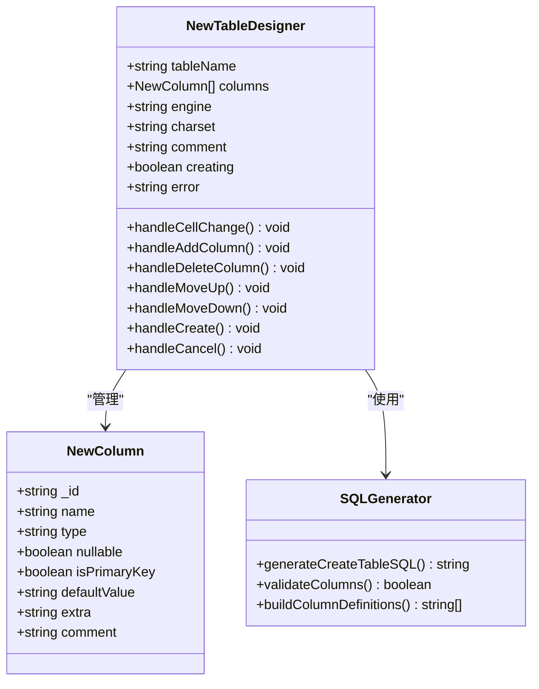

**图表来源**
- [NewTableDesigner.tsx:35-53](file://src/renderer/src/components/NewTableDesigner.tsx#L35-L53)
- [NewTableDesigner.tsx:93-143](file://src/renderer/src/components/NewTableDesigner.tsx#L93-L143)

#### 实时 SQL 预览功能

组件实现了智能的 SQL 生成和预览机制，用户可以实时看到表结构对应的 SQL 语句：

**章节来源**
- [NewTableDesigner.tsx:100-125](file://src/renderer/src/components/NewTableDesigner.tsx#L100-L125)

## 增强功能详解

### 字段编辑器组件

ColumnsEditor 提供了完整的字段管理功能，支持字段的增删改查和实时验证：

#### 字段验证机制

字段编辑器实现了多层次的验证机制，确保字段定义的准确性和完整性：

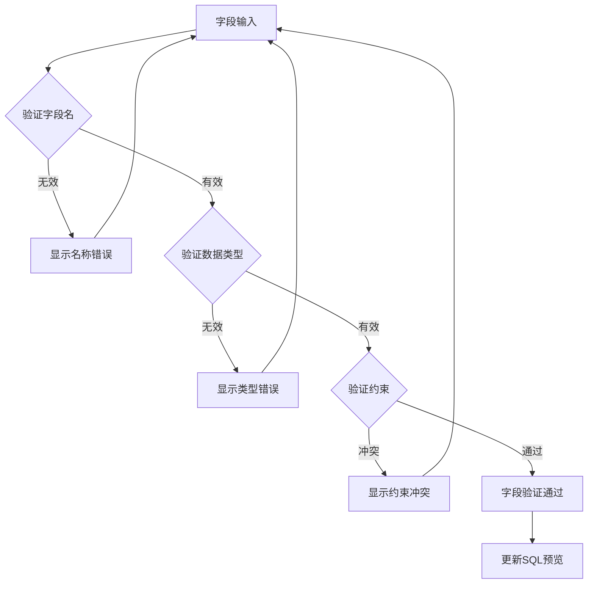

**图表来源**
- [ColumnsEditor.tsx:92-94](file://src/renderer/src/components/editors/ColumnsEditor.tsx#L92-L94)
- [ColumnsEditor.tsx:145-184](file://src/renderer/src/components/editors/ColumnsEditor.tsx#L145-L184)

#### 变更追踪机制

组件实现了智能的变更追踪系统，能够准确识别和记录用户的每次修改：

**章节来源**
- [ColumnsEditor.tsx:80-90](file://src/renderer/src/components/editors/ColumnsEditor.tsx#L80-L90)
- [ColumnsEditor.tsx:145-184](file://src/renderer/src/components/editors/ColumnsEditor.tsx#L145-L184)

### 外键编辑器组件

ForeignKeysEditor 专门负责外键关系的创建和管理，提供了完整的引用完整性保证：

#### 外键关系验证

外键编辑器实现了严格的外键关系验证机制：

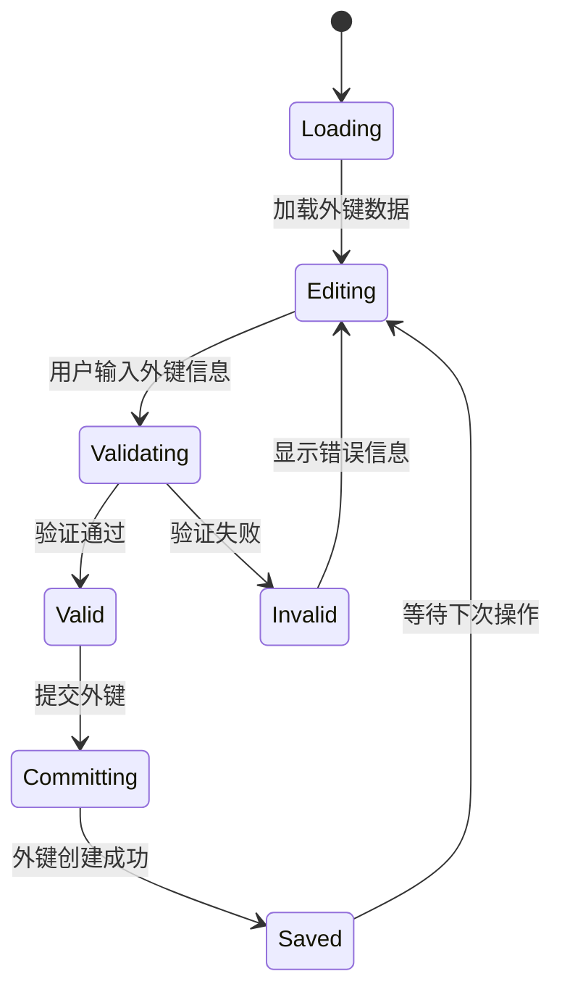

**图表来源**
- [ForeignKeysEditor.tsx:31-46](file://src/renderer/src/components/editors/ForeignKeysEditor.tsx#L31-L46)
- [ForeignKeysEditor.tsx:77-107](file://src/renderer/src/components/editors/ForeignKeysEditor.tsx#L77-L107)

#### 引用动作配置

组件支持多种引用动作配置，包括 RESTRICT、CASCADE、SET NULL 等标准选项：

**章节来源**
- [ForeignKeysEditor.tsx:21](file://src/renderer/src/components/editors/ForeignKeysEditor.tsx#L21)
- [ForeignKeysEditor.tsx:137-153](file://src/renderer/src/components/editors/ForeignKeysEditor.tsx#L137-L153)

### 索引编辑器组件

IndexesEditor 提供了灵活的索引管理功能，支持各种类型的索引创建和维护：

#### 索引类型支持

组件支持多种索引类型，包括普通索引、唯一索引、主键索引等：

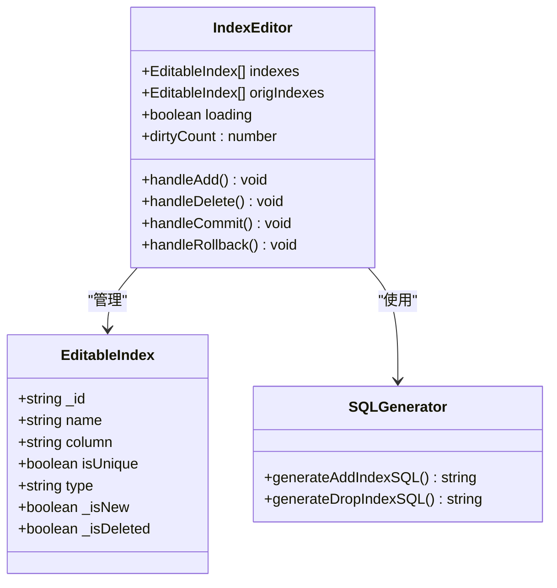

**图表来源**
- [IndexesEditor.tsx:21-44](file://src/renderer/src/components/editors/IndexesEditor.tsx#L21-L44)
- [IndexesEditor.tsx:76-108](file://src/renderer/src/components/editors/IndexesEditor.tsx#L76-L108)

#### 索引字段配置

组件支持复合索引的创建，用户可以指定多个字段组成索引：

**章节来源**
- [IndexesEditor.tsx:135-149](file://src/renderer/src/components/editors/IndexesEditor.tsx#L135-L149)

### 表选项编辑器组件

TableOptionsEditor 负责表级别的配置管理，提供了丰富的存储选项：

#### 存储引擎选择

组件支持多种 MySQL 存储引擎的选择和配置：

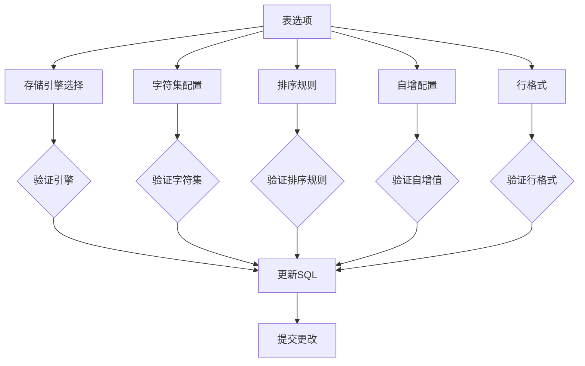

**图表来源**
- [TableOptionsEditor.tsx:16-38](file://src/renderer/src/components/editors/TableOptionsEditor.tsx#L16-L38)
- [TableOptionsEditor.tsx:62-82](file://src/renderer/src/components/editors/TableOptionsEditor.tsx#L62-L82)

#### 表注释管理

组件支持表注释的添加和修改，便于团队协作和文档管理：

**章节来源**
- [TableOptionsEditor.tsx:137-140](file://src/renderer/src/components/editors/TableOptionsEditor.tsx#L137-L140)

## 依赖关系分析

### 外部依赖

项目使用了现代化的前端技术栈，增强了表设计功能：

| 依赖包 | 版本 | 用途 |
|--------|------|------|
| react | ^18.2.0 | 用户界面框架 |
| electron | ^29.1.5 | 桌面应用平台 |
| mysql2 | ^3.9.2 | MySQL数据库驱动 |
| lucide-react | ^0.344.0 | 图标库 |
| zustand | ^4.5.2 | 状态管理 |

### 内部依赖关系

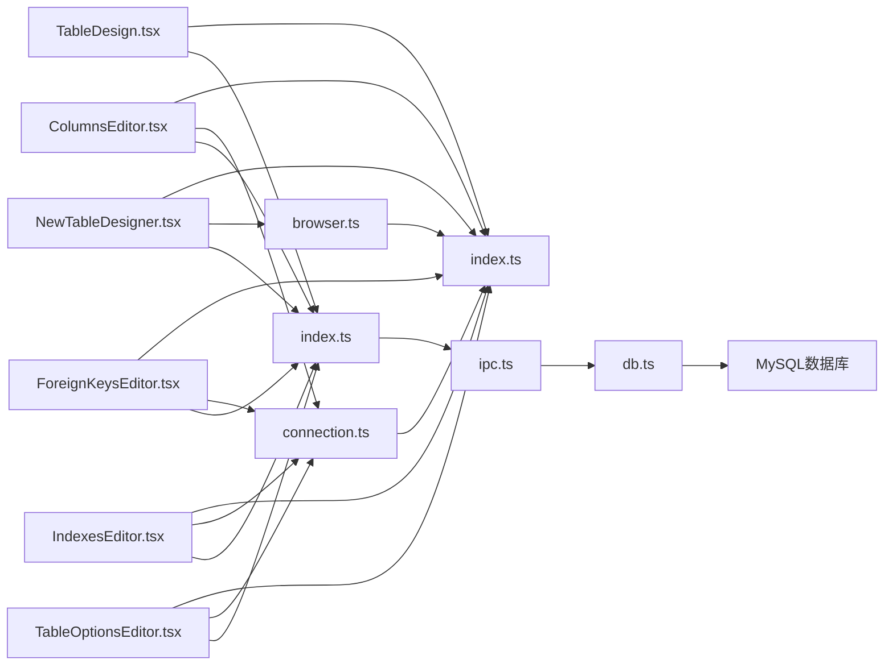

**图表来源**
- [NewTableDesigner.tsx:15-16](file://src/renderer/src/components/NewTableDesigner.tsx#L15-L16)
- [ColumnsEditor.tsx:13](file://src/renderer/src/components/editors/ColumnsEditor.tsx#L13)
- [db.ts:1-2](file://src/main/services/db.ts#L1-L2)

**章节来源**
- [package.json:16-26](file://package.json#L16-L26)

## 性能考虑

### 连接池管理

数据库连接通过连接池进行管理，避免频繁建立和销毁连接：

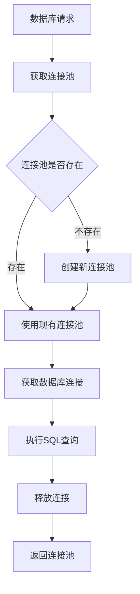

**图表来源**
- [db.ts:30-36](file://src/main/services/db.ts#L30-L36)
- [db.ts:78-134](file://src/main/services/db.ts#L78-L134)

### 并行数据加载

组件使用 Promise.all 实现并行数据加载，提升用户体验：

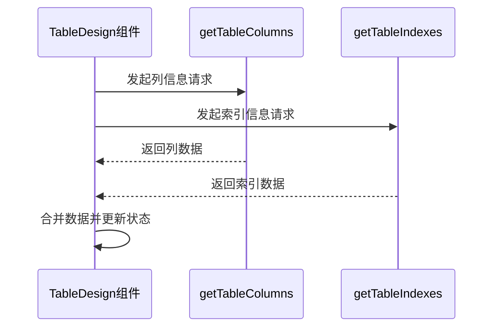

**图表来源**
- [TableDesign.tsx:25-31](file://src/renderer/src/components/TableDesign.tsx#L25-L31)

### 内存优化策略

- 使用 React.memo 优化组件渲染
- 实现懒加载机制减少初始内存占用
- 及时清理事件监听器和定时器
- 优化大表设计时的虚拟滚动

### 变更追踪优化

- 实现增量变更追踪，减少不必要的重新计算
- 使用不可变数据结构确保状态一致性
- 优化大量字段编辑时的性能表现

## 故障排除指南

### 常见问题及解决方案

| 问题类型 | 症状 | 解决方案 |
|----------|------|----------|
| 连接超时 | 加载数据时出现超时错误 | 检查网络连接和数据库服务器状态 |
| 权限不足 | 访问表结构时报权限错误 | 验证数据库用户权限配置 |
| 数据库不可达 | 连接测试失败 | 检查主机地址、端口和防火墙设置 |
| 内存泄漏 | 应用运行时间越长内存占用越高 | 确保正确清理事件监听器和定时器 |
| SQL 语法错误 | 保存表结构时SQL执行失败 | 检查字段类型和约束配置是否正确 |
| 外键冲突 | 外键创建失败 | 验证引用表和字段的存在性 |

### 调试技巧

1. **启用开发者工具**：按 F12 打开开发者工具查看控制台日志
2. **检查网络请求**：在 Network 标签中查看 IPC 调用状态
3. **监控内存使用**：使用 Performance 标签分析内存泄漏
4. **验证数据格式**：检查从数据库返回的数据结构是否符合预期
5. **调试变更追踪**：使用 React DevTools 查看状态变化

### 错误处理机制

组件实现了多层次的错误处理机制：

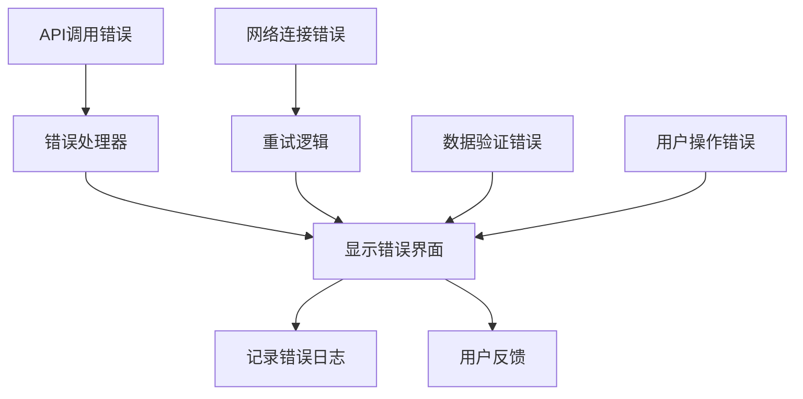

**图表来源**
- [NewTableDesigner.tsx:179-184](file://src/renderer/src/components/NewTableDesigner.tsx#L179-L184)
- [ColumnsEditor.tsx:191-193](file://src/renderer/src/components/editors/ColumnsEditor.tsx#L191-L193)

**章节来源**
- [NewTableDesigner.tsx:74-81](file://src/renderer/src/components/NewTableDesigner.tsx#L74-L81)

## 结论

表设计组件经过重大增强后，已成为 nexSql 中功能最完整的数据库表设计工具。组件采用了模块化架构、类型安全和响应式设计等最佳实践，为用户提供直观的企业级表设计体验。

### 增强功能总结

- **可视化表创建**：完整的表格化界面，支持实时字段编辑
- **智能验证系统**：多层次的数据类型和约束验证机制
- **变更追踪功能**：精确记录和管理每次结构变更
- **批量提交机制**：支持多个编辑器的协同工作和批量提交
- **实时预览功能**：即时生成和显示对应的 SQL 语句
- **引用完整性保证**：严格的外键关系验证和管理
- **索引管理功能**：灵活的索引创建和维护工具
- **表选项配置**：丰富的存储引擎和字符集选项

### 技术架构优势

- **模块化设计**：每个编辑器组件职责单一，易于维护和扩展
- **类型安全**：完整的 TypeScript 支持，确保数据一致性
- **状态管理**：使用 Zustand 实现高效的状态管理
- **错误处理**：完善的错误捕获和用户反馈机制
- **性能优化**：连接池管理、并行数据加载和内存优化

### 未来发展方向

基于当前架构，建议优先实现以下功能：
1. **表结构导入导出**：支持从其他数据库工具导入表结构
2. **版本控制集成**：与 Git 等版本控制系统集成
3. **团队协作功能**：支持多人协作和变更审批流程
4. **性能分析工具**：提供索引使用情况和查询性能分析
5. **自动化重构**：支持安全的表结构自动重构和迁移

该组件体系为后续的功能扩展奠定了坚实的基础，其模块化的架构设计使得新增功能更加容易实现和维护，完全满足现代数据库管理工具的需求。