# 表设计组件

<cite>
**本文档引用的文件**
- [TableDesign.tsx](file://src/renderer/src/components/TableDesign.tsx)
- [index.ts](file://src/shared/types/index.ts)
- [connection.ts](file://src/renderer/src/stores/connection.ts)
- [db.ts](file://src/main/services/db.ts)
- [index.ts](file://src/preload/index.ts)
- [ipc.ts](file://src/main/ipc.ts)
- [App.tsx](file://src/renderer/src/App.tsx)
- [MainContent.tsx](file://src/renderer/src/components/MainContent.tsx)
- [ConnectionTree.tsx](file://src/renderer/src/components/ConnectionTree.tsx)
- [tab.ts](file://src/renderer/src/stores/tab.ts)
- [package.json](file://package.json)
</cite>

## 目录
1. [简介](#简介)
2. [项目结构](#项目结构)
3. [核心组件](#核心组件)
4. [架构概览](#架构概览)
5. [详细组件分析](#详细组件分析)
6. [依赖关系分析](#依赖关系分析)
7. [性能考虑](#性能考虑)
8. [故障排除指南](#故障排除指南)
9. [结论](#结论)

## 简介

表设计组件是 nexSql 数据库管理工具中的核心功能模块，负责展示和管理数据库表的结构信息。该组件提供了直观的可视化界面，让用户能够查看表的字段定义、索引信息和表的基本元数据。虽然当前版本主要实现了表结构的展示功能，但为未来的表设计编辑功能奠定了坚实的基础。

## 项目结构

nexSql 采用 Electron + React 架构，项目结构清晰地分离了前端界面、后端服务和共享类型定义：

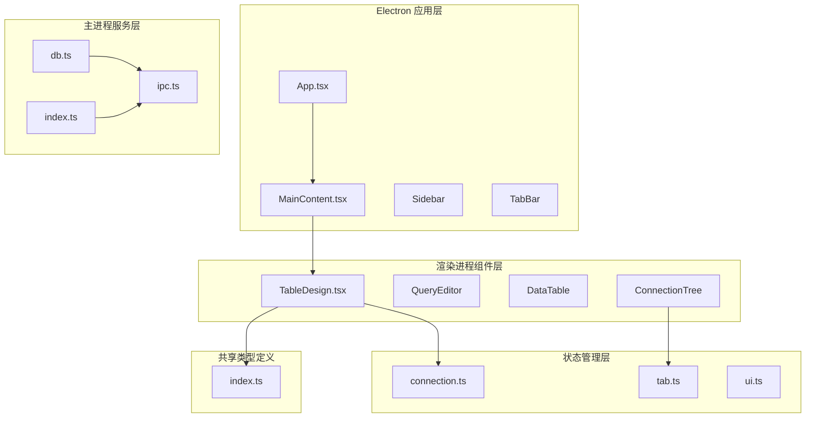

**图表来源**
- [App.tsx:1-35](file://src/renderer/src/App.tsx#L1-L35)
- [MainContent.tsx:1-34](file://src/renderer/src/components/MainContent.tsx#L1-L34)
- [TableDesign.tsx:1-241](file://src/renderer/src/components/TableDesign.tsx#L1-L241)

**章节来源**
- [package.json:1-42](file://package.json#L1-L42)
- [App.tsx:1-35](file://src/renderer/src/App.tsx#L1-L35)

## 核心组件

表设计组件的核心功能围绕以下关键组件构建：

### 数据模型定义

组件使用统一的类型系统来确保前后端数据的一致性：

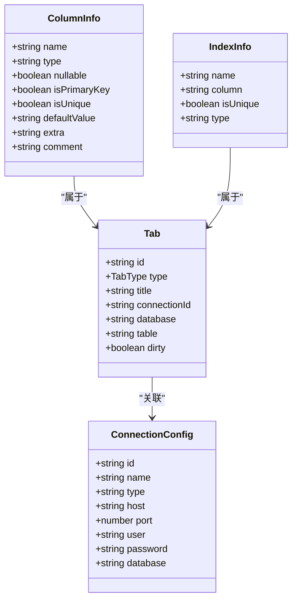

**图表来源**
- [index.ts:49-65](file://src/shared/types/index.ts#L49-L65)
- [index.ts:114-123](file://src/shared/types/index.ts#L114-L123)

### 组件架构

表设计组件采用函数式组件模式，结合 React Hooks 实现响应式状态管理：

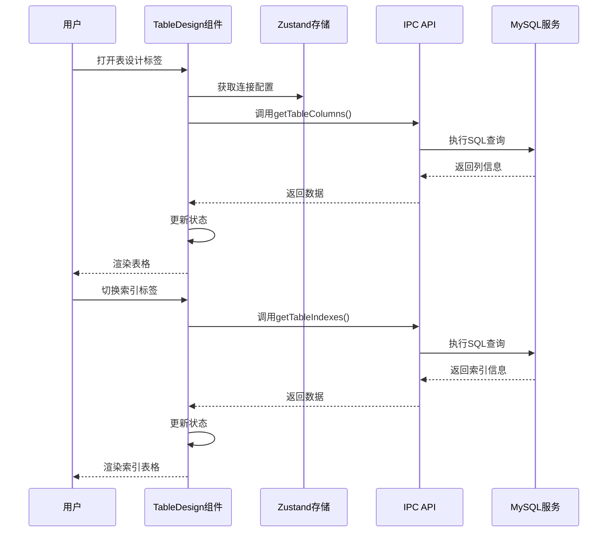

**图表来源**
- [TableDesign.tsx:20-46](file://src/renderer/src/components/TableDesign.tsx#L20-L46)
- [index.ts:39-44](file://src/main/services/db.ts#L190-L224)

**章节来源**
- [TableDesign.tsx:1-241](file://src/renderer/src/components/TableDesign.tsx#L1-L241)
- [index.ts:49-65](file://src/shared/types/index.ts#L49-L65)

## 架构概览

表设计组件遵循分层架构设计，确保各层职责明确且松耦合：

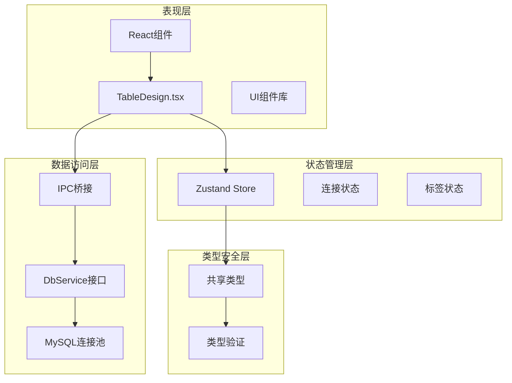

**图表来源**
- [TableDesign.tsx:1-8](file://src/renderer/src/components/TableDesign.tsx#L1-L8)
- [connection.ts:17-63](file://src/renderer/src/stores/connection.ts#L17-L63)
- [db.ts:30-36](file://src/main/services/db.ts#L30-L36)

### 数据流设计

组件内部采用单向数据流模式，确保状态更新的可预测性：

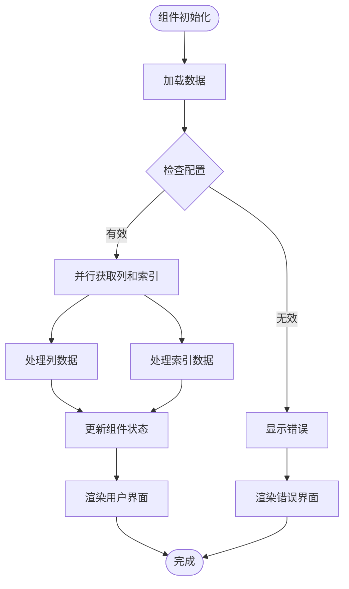

**图表来源**
- [TableDesign.tsx:20-46](file://src/renderer/src/components/TableDesign.tsx#L20-L46)
- [TableDesign.tsx:65-81](file://src/renderer/src/components/TableDesign.tsx#L65-L81)

**章节来源**
- [TableDesign.tsx:10-46](file://src/renderer/src/components/TableDesign.tsx#L10-L46)

## 详细组件分析

### TableDesign 组件核心功能

TableDesign 组件是表设计功能的主要实现，提供了三个主要的功能标签页：

#### 字段管理标签页

字段标签页展示了表的所有列信息，包括字段名称、数据类型、是否允许为空、默认值、额外属性和注释：

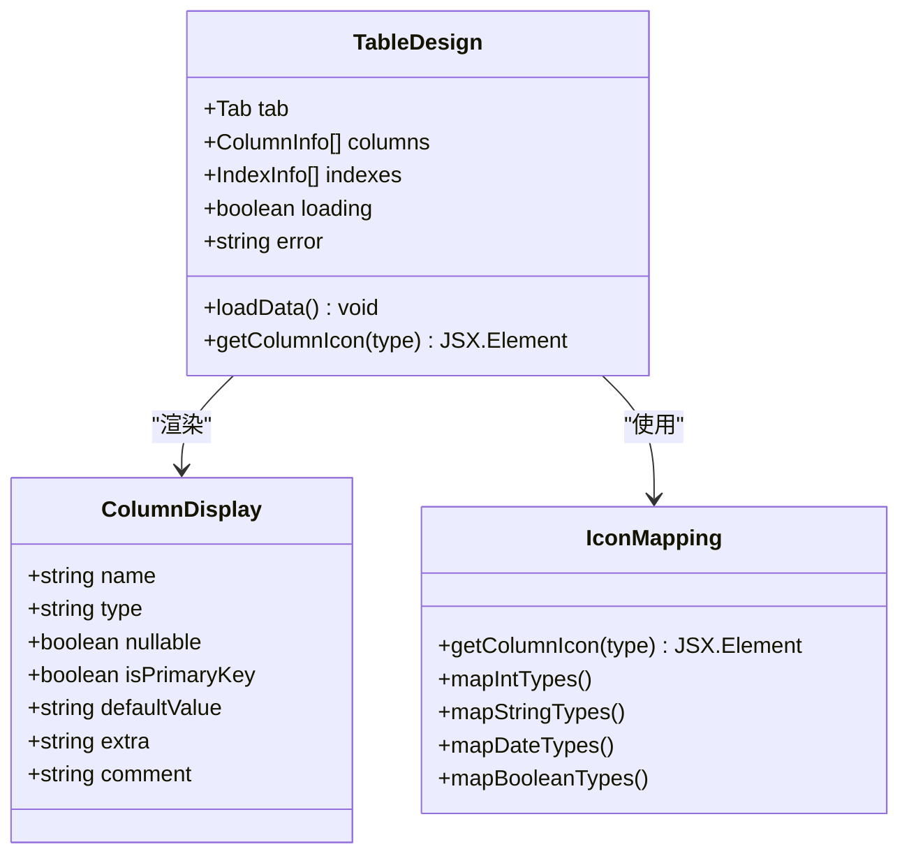

**图表来源**
- [TableDesign.tsx:48-63](file://src/renderer/src/components/TableDesign.tsx#L48-L63)
- [TableDesign.tsx:112-164](file://src/renderer/src/components/TableDesign.tsx#L112-L164)

#### 索引管理标签页

索引标签页提供了表索引的详细信息，包括索引名称、关联字段、唯一性标识和索引类型：

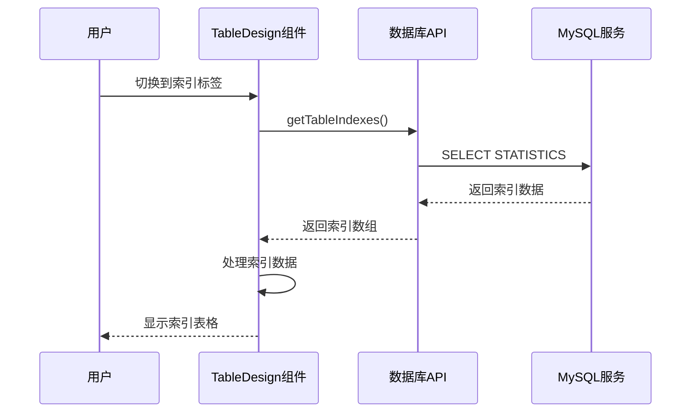

**图表来源**
- [TableDesign.tsx:166-208](file://src/renderer/src/components/TableDesign.tsx#L166-L208)
- [db.ts:226-253](file://src/main/services/db.ts#L226-L253)

#### 表信息标签页

表信息标签页展示了表的基本元数据，包括数据库名、表名、字段数量、索引数量和主键信息：

**章节来源**
- [TableDesign.tsx:210-236](file://src/renderer/src/components/TableDesign.tsx#L210-L236)

### 状态管理与数据同步

组件使用 Zustand 状态管理库来维护连接配置和标签状态：

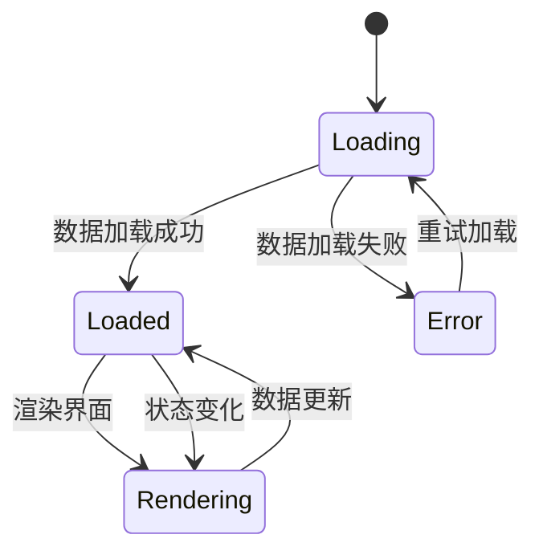

**图表来源**
- [connection.ts:17-63](file://src/renderer/src/stores/connection.ts#L17-L63)
- [tab.ts:15-64](file://src/renderer/src/stores/tab.ts#L15-L64)

### 错误处理机制

组件实现了多层次的错误处理机制：

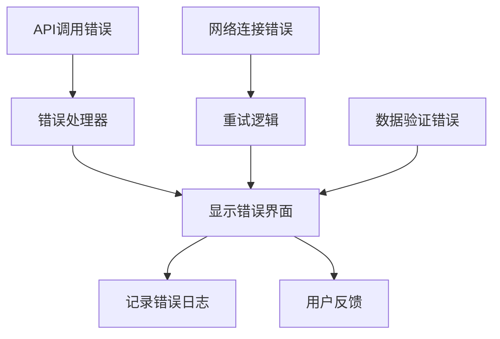

**图表来源**
- [TableDesign.tsx:74-81](file://src/renderer/src/components/TableDesign.tsx#L74-L81)

**章节来源**
- [TableDesign.tsx:74-81](file://src/renderer/src/components/TableDesign.tsx#L74-L81)

## 依赖关系分析

### 外部依赖

项目使用了现代化的前端技术栈：

| 依赖包 | 版本 | 用途 |
|--------|------|------|
| react | ^18.2.0 | 用户界面框架 |
| electron | ^29.1.5 | 桌面应用平台 |
| mysql2 | ^3.9.2 | MySQL数据库驱动 |
| lucide-react | ^0.344.0 | 图标库 |
| zustand | ^4.5.2 | 状态管理 |

### 内部依赖关系

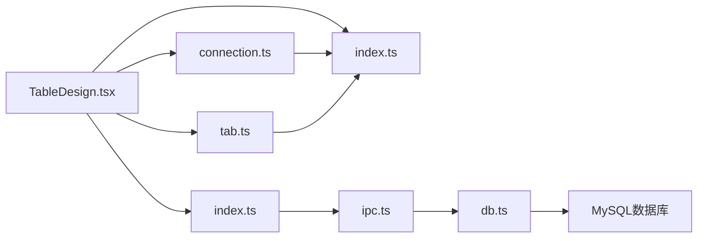

**图表来源**
- [TableDesign.tsx:1-8](file://src/renderer/src/components/TableDesign.tsx#L1-L8)
- [connection.ts:1-2](file://src/renderer/src/stores/connection.ts#L1-L2)
- [db.ts:1-2](file://src/main/services/db.ts#L1-L2)

**章节来源**
- [package.json:16-26](file://package.json#L16-L26)

## 性能考虑

### 连接池管理

数据库连接通过连接池进行管理，避免频繁建立和销毁连接：

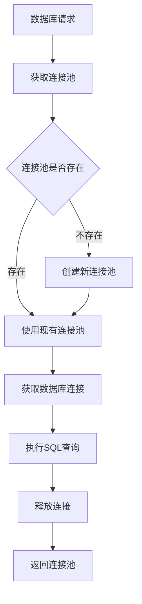

**图表来源**
- [db.ts:30-36](file://src/main/services/db.ts#L30-L36)
- [db.ts:78-134](file://src/main/services/db.ts#L78-L134)

### 并行数据加载

组件使用 Promise.all 实现并行数据加载，提升用户体验：

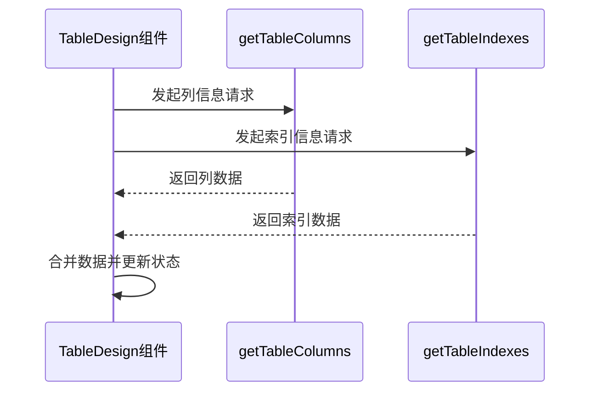

**图表来源**
- [TableDesign.tsx:25-31](file://src/renderer/src/components/TableDesign.tsx#L25-L31)

### 内存优化策略

- 使用 React.memo 优化组件渲染
- 实现懒加载机制减少初始内存占用
- 及时清理事件监听器和定时器

## 故障排除指南

### 常见问题及解决方案

| 问题类型 | 症状 | 解决方案 |
|----------|------|----------|
| 连接超时 | 加载数据时出现超时错误 | 检查网络连接和数据库服务器状态 |
| 权限不足 | 访问表结构时报权限错误 | 验证数据库用户权限配置 |
| 数据库不可达 | 连接测试失败 | 检查主机地址、端口和防火墙设置 |
| 内存泄漏 | 应用运行时间越长内存占用越高 | 确保正确清理事件监听器和定时器 |

### 调试技巧

1. **启用开发者工具**：按 F12 打开开发者工具查看控制台日志
2. **检查网络请求**：在 Network 标签中查看 IPC 调用状态
3. **监控内存使用**：使用 Performance 标签分析内存泄漏
4. **验证数据格式**：检查从数据库返回的数据结构是否符合预期

**章节来源**
- [TableDesign.tsx:37-41](file://src/renderer/src/components/TableDesign.tsx#L37-L41)

## 结论

表设计组件作为 nexSql 的核心功能模块，展现了现代数据库管理工具的设计理念。组件采用了分层架构、类型安全和响应式设计等最佳实践，为用户提供直观的表结构管理体验。

### 当前功能总结

- **表结构展示**：完整展示表的字段定义和索引信息
- **多标签页导航**：支持字段、索引和表信息三个视图
- **类型安全**：使用 TypeScript 确保数据一致性
- **错误处理**：完善的错误捕获和用户反馈机制
- **性能优化**：连接池管理和并行数据加载

### 未来发展方向

基于当前架构，建议优先实现以下功能：
1. **表设计编辑功能**：支持字段的增删改查和约束设置
2. **可视化设计器**：提供拖拽式的表结构设计界面
3. **实时预览功能**：设计过程中实时预览 SQL 语句
4. **变更追踪**：记录和回滚表结构变更历史
5. **批量操作**：支持多个表的批量设计和管理

该组件为后续的功能扩展奠定了良好的基础，其模块化的架构设计使得新增功能更加容易实现和维护。