# 连接树组件

<cite>
**本文档引用的文件**
- [ConnectionTree.tsx](file://src/renderer/src/components/ConnectionTree.tsx)
- [ERDiagramView.tsx](file://src/renderer/src/components/ERDiagramView.tsx)
- [TableCompareView.tsx](file://src/renderer/src/components/TableCompareView.tsx)
- [QueryHistoryPanel.tsx](file://src/renderer/src/components/QueryHistoryPanel.tsx)
- [connection.ts](file://src/renderer/src/stores/connection.ts)
- [browser.ts](file://src/renderer/src/stores/browser.ts)
- [ui.ts](file://src/renderer/src/stores/ui.ts)
- [tab.ts](file://src/renderer/src/stores/tab.ts)
- [history.ts](file://src/renderer/src/stores/history.ts)
- [types/index.ts](file://src/shared/types/index.ts)
- [db.ts](file://src/main/services/db.ts)
- [App.tsx](file://src/renderer/src/App.tsx)
- [Sidebar.tsx](file://src/renderer/src/components/Sidebar.tsx)
- [ContextMenu.tsx](file://src/renderer/src/components/ContextMenu.tsx)
- [ConnectionModal.tsx](file://src/renderer/src/components/ConnectionModal.tsx)
- [MiddlePanel.tsx](file://src/renderer/src/components/MiddlePanel.tsx)
</cite>

## 更新摘要
**变更内容**
- 连接树组件新增数据库备份/恢复功能，支持完整数据库的导入导出
- 新增 ER 图可视化功能，提供数据库表关系的图形化展示
- 新增表结构比较工具，支持跨数据库表结构对比和同步
- 新增查询历史管理功能，提供查询执行历史的查看和管理
- 增强的上下文菜单系统，集成高级数据库操作
- 改进的中间面板联动机制，支持多维度数据库对象管理

## 目录
1. [简介](#简介)
2. [项目结构](#项目结构)
3. [核心组件](#核心组件)
4. [架构概览](#架构概览)
5. [详细组件分析](#详细组件分析)
6. [数据库对象导航增强](#数据库对象导航增强)
7. [高级数据库管理功能](#高级数据库管理功能)
8. [ER 图可视化系统](#er-图可视化系统)
9. [表结构比较工具](#表结构比较工具)
10. [查询历史管理系统](#查询历史管理系统)
11. [上下文菜单系统](#上下文菜单系统)
12. [数据库管理功能](#数据库管理功能)
13. [中间面板联动机制](#中间面板联动机制)
14. [依赖关系分析](#依赖关系分析)
15. [性能考虑](#性能考虑)
16. [故障排除指南](#故障排除指南)
17. [结论](#结论)

## 简介
连接树组件是 nexSql 应用中的核心界面组件，负责以树形结构展示数据库连接、数据库实例和各种数据库对象。该组件经过重大增强，现在支持复杂的数据库对象导航、层级化浏览、上下文菜单操作、数据库备份恢复、ER 图可视化、表结构比较和查询历史管理等高级功能。组件采用现代 React 架构，结合 Zustand 状态管理和 IPC 通信机制，实现了高性能的数据库连接可视化体验。

## 项目结构
连接树组件位于渲染进程的组件目录中，与状态管理、类型定义和主进程服务形成清晰的分层架构：

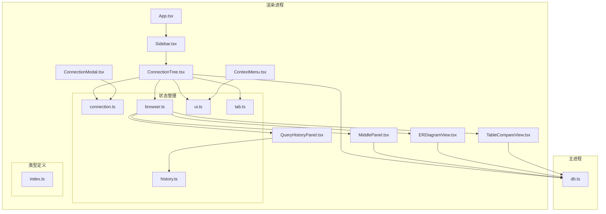

**图表来源**
- [App.tsx:1-24](file://src/renderer/src/App.tsx#L1-L24)
- [Sidebar.tsx:1-80](file://src/renderer/src/components/Sidebar.tsx#L1-L80)
- [ConnectionTree.tsx:1-655](file://src/renderer/src/components/ConnectionTree.tsx#L1-L655)

**章节来源**
- [App.tsx:1-24](file://src/renderer/src/App.tsx#L1-L24)
- [Sidebar.tsx:1-80](file://src/renderer/src/components/Sidebar.tsx#L1-L80)

## 核心组件
连接树组件的核心功能围绕以下关键特性构建：

### 数据结构设计
组件采用四层嵌套的数据结构：
- **连接层**：展示数据库连接配置和状态
- **数据库层**：显示连接下的数据库实例
- **分类层**：展示数据库中的对象分类（表、视图、函数、事件）
- **对象层**：呈现具体的数据库对象信息

### 状态管理机制
组件通过多个 Zustand store 实现状态分离：
- 连接状态存储：管理连接配置、状态和展开状态
- 浏览器状态存储：管理数据库对象的选择和显示
- UI 状态存储：控制上下文菜单和模态框
- 标签页状态存储：处理标签页的打开和切换
- 历史状态存储：管理查询历史记录

### 缓存策略
实现智能缓存机制，避免重复的数据库查询：
- 节点数据缓存：存储已加载的数据库和表信息
- 展开状态缓存：保持用户操作的展开状态
- 连接池管理：主进程维护数据库连接池

**章节来源**
- [ConnectionTree.tsx:26-40](file://src/renderer/src/components/ConnectionTree.tsx#L26-L40)
- [connection.ts:4-15](file://src/renderer/src/stores/connection.ts#L4-L15)

## 架构概览
连接树组件采用分层架构设计，确保各层职责清晰且松耦合：

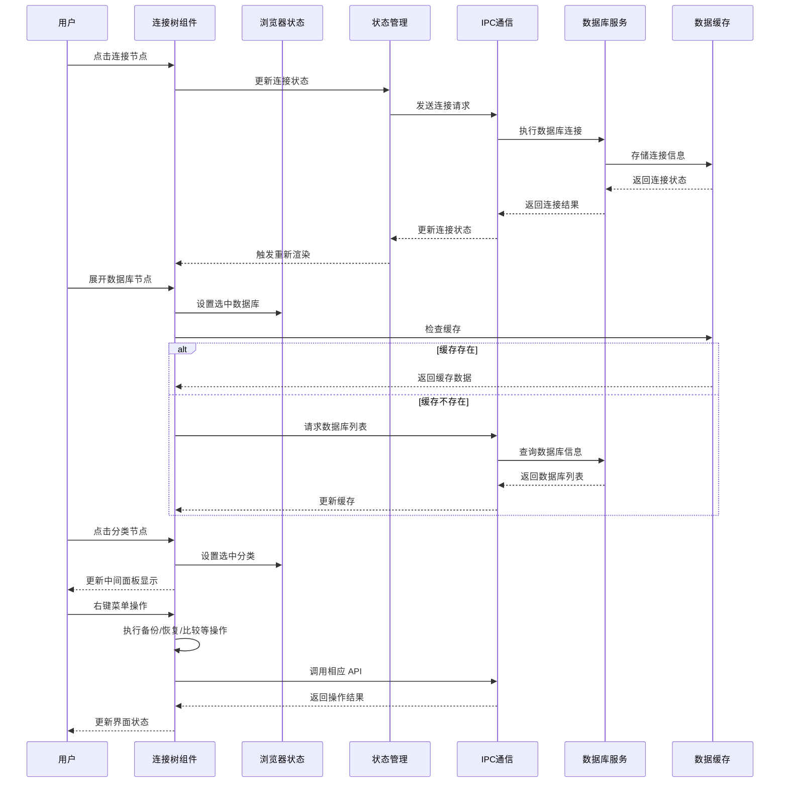

**图表来源**
- [ConnectionTree.tsx:56-124](file://src/renderer/src/components/ConnectionTree.tsx#L56-L124)
- [db.ts:137-155](file://src/main/services/db.ts#L137-L155)
- [browser.ts:94-114](file://src/renderer/src/stores/browser.ts#L94-L114)

## 详细组件分析

### 组件类图
连接树组件的类结构体现了清晰的职责分离：

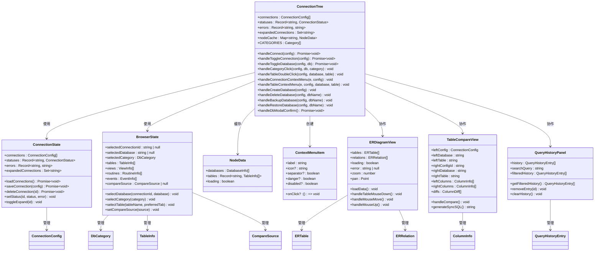

**图表来源**
- [ConnectionTree.tsx:42-124](file://src/renderer/src/components/ConnectionTree.tsx#L42-L124)
- [connection.ts:17-63](file://src/renderer/src/stores/connection.ts#L17-L63)
- [browser.ts:37-74](file://src/renderer/src/stores/browser.ts#L37-L74)
- [types/index.ts:3-47](file://src/shared/types/index.ts#L3-L47)

### 数据流分析
连接树组件的数据流遵循单向数据流原则：

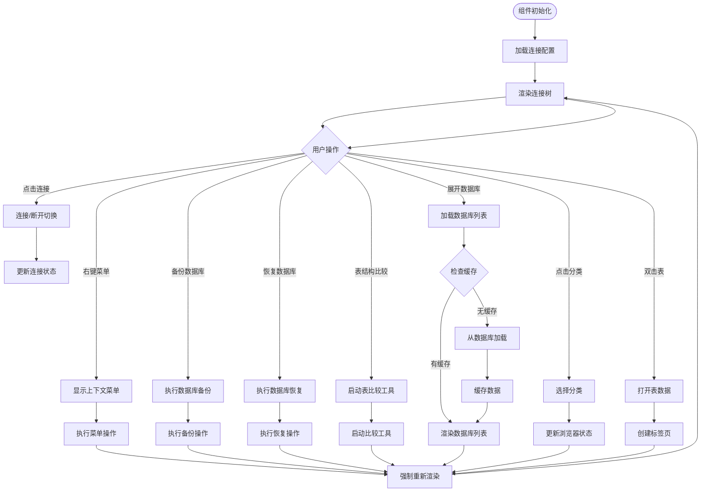

**图表来源**
- [ConnectionTree.tsx:281-655](file://src/renderer/src/components/ConnectionTree.tsx#L281-L655)
- [browser.ts:94-114](file://src/renderer/src/stores/browser.ts#L94-L114)

**章节来源**
- [ConnectionTree.tsx:281-655](file://src/renderer/src/components/ConnectionTree.tsx#L281-L655)
- [browser.ts:94-114](file://src/renderer/src/stores/browser.ts#L94-L114)

## 数据库对象导航增强

### 分类层次结构
连接树组件现在支持四层嵌套的数据库对象导航：

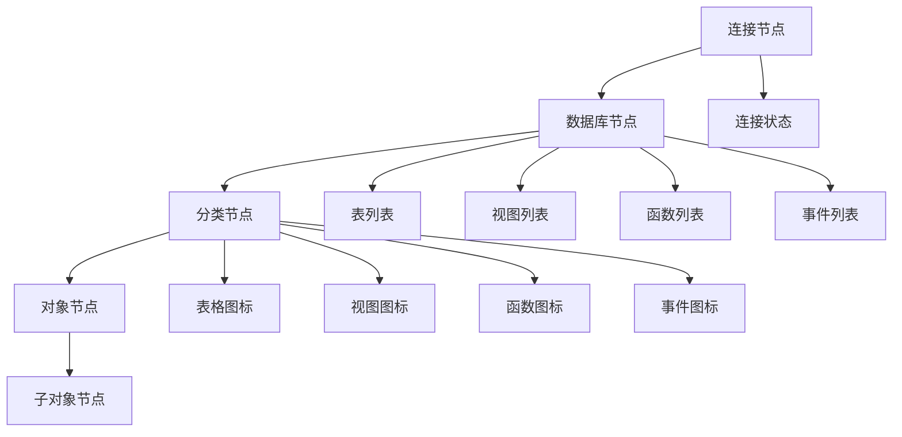

**图表来源**
- [ConnectionTree.tsx:35-40](file://src/renderer/src/components/ConnectionTree.tsx#L35-L40)
- [ConnectionTree.tsx:377-413](file://src/renderer/src/components/ConnectionTree.tsx#L377-L413)

### 对象类型支持
组件支持多种数据库对象类型的展示和操作：

- **表（Tables）**：支持表的双击打开、设计表、复制表名等操作
- **视图（Views）**：支持视图的查看和管理
- **函数（Functions）**：支持存储函数的查看和管理
- **事件（Events）**：支持数据库事件的查看和管理

**章节来源**
- [ConnectionTree.tsx:35-40](file://src/renderer/src/components/ConnectionTree.tsx#L35-L40)
- [types/index.ts:115-149](file://src/shared/types/index.ts#L115-L149)

## 高级数据库管理功能

### 数据库备份和恢复
连接树组件新增了完整的数据库备份和恢复功能：

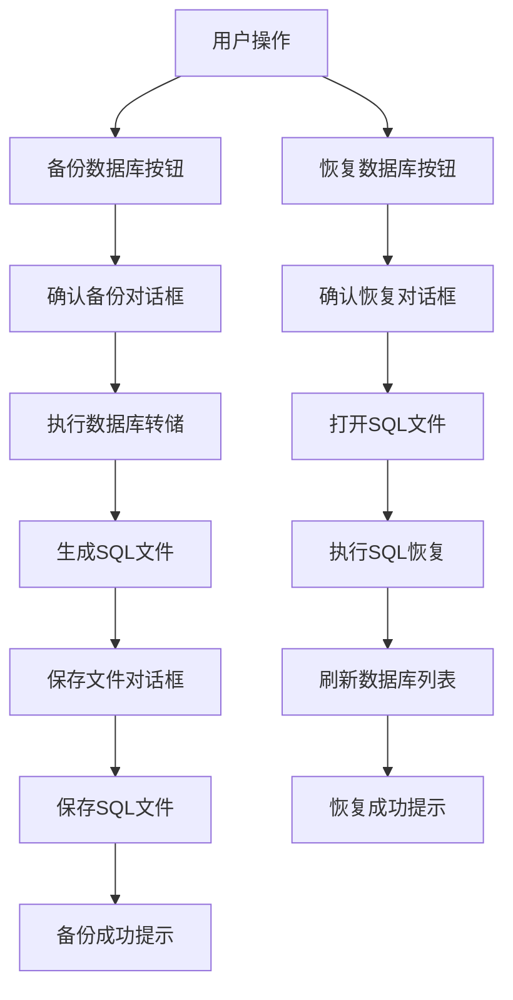

**图表来源**
- [ConnectionTree.tsx:206-261](file://src/renderer/src/components/ConnectionTree.tsx#L206-L261)

### 备份恢复流程
组件实现了完整的数据库生命周期管理：

1. **备份数据库**：用户确认备份操作，系统执行数据库转储
2. **生成SQL文件**：将数据库结构和数据转换为SQL格式
3. **文件保存**：提供保存对话框让用户选择保存位置
4. **恢复数据库**：用户选择SQL文件，系统执行恢复操作
5. **状态更新**：刷新数据库列表并更新缓存

**章节来源**
- [ConnectionTree.tsx:206-261](file://src/renderer/src/components/ConnectionTree.tsx#L206-L261)

## ER 图可视化系统

### ER 图组件架构
ER 图可视化系统提供了数据库表关系的图形化展示：

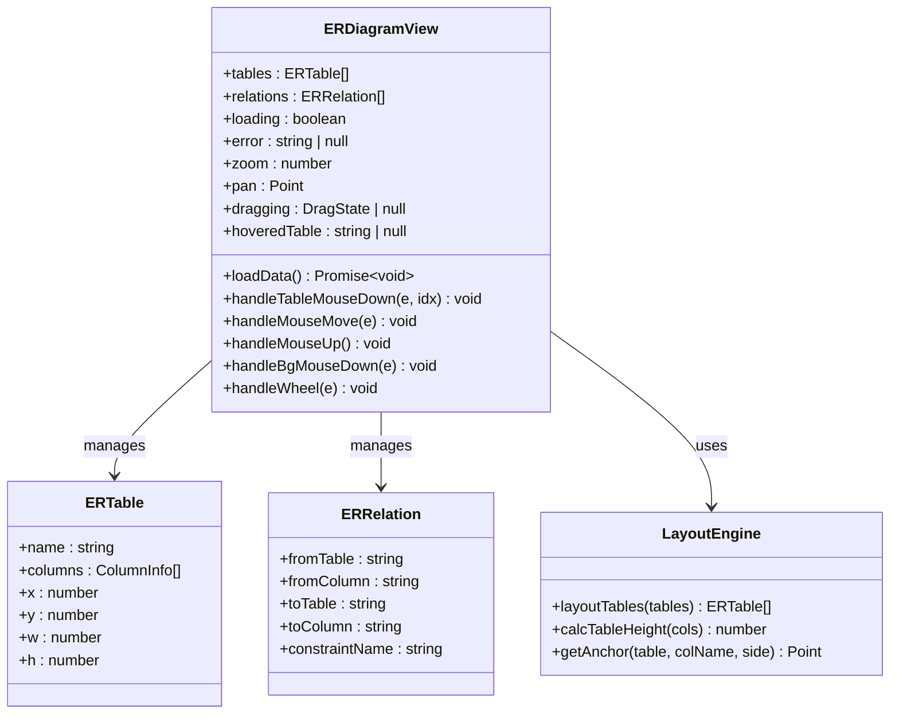

**图表来源**
- [ERDiagramView.tsx:15-31](file://src/renderer/src/components/ERDiagramView.tsx#L15-L31)
- [ERDiagramView.tsx:42-55](file://src/renderer/src/components/ERDiagramView.tsx#L42-L55)

### ER 图交互功能
ER 图组件支持丰富的交互操作：

- **拖拽布局**：用户可以拖拽表来重新排列位置
- **缩放和平移**：支持滚轮缩放和背景拖拽平移
- **悬停高亮**：悬停表时高亮显示相关关系
- **自动布局**：使用网格算法自动计算表的位置

**章节来源**
- [ERDiagramView.tsx:64-321](file://src/renderer/src/components/ERDiagramView.tsx#L64-L321)

## 表结构比较工具

### 表比较组件架构
表结构比较工具提供了跨数据库表结构对比功能：

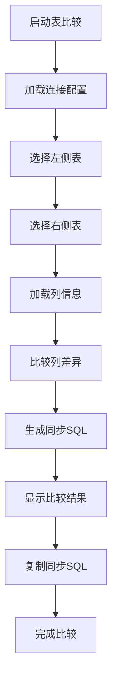

**图表来源**
- [TableCompareView.tsx:74-94](file://src/renderer/src/components/TableCompareView.tsx#L74-L94)

### 比较功能特性
表比较工具支持以下功能：

- **跨连接比较**：可以在不同的数据库连接之间比较表结构
- **详细差异分析**：显示类型、可空性、默认值等差异
- **同步SQL生成**：自动生成使右侧表匹配左侧表的SQL语句
- **实时对比**：支持动态选择不同的表进行对比

**章节来源**
- [TableCompareView.tsx:39-332](file://src/renderer/src/components/TableCompareView.tsx#L39-L332)

## 查询历史管理系统

### 查询历史组件架构
查询历史管理系统提供了查询执行历史的查看和管理：

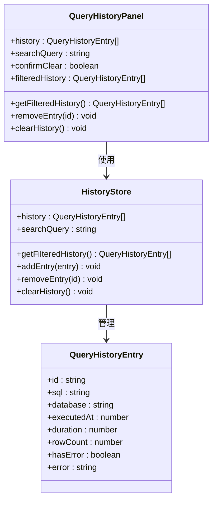

**图表来源**
- [QueryHistoryPanel.tsx:15-18](file://src/renderer/src/components/QueryHistoryPanel.tsx#L15-L18)
- [QueryHistoryPanel.tsx:31-33](file://src/renderer/src/components/QueryHistoryPanel.tsx#L31-L33)

### 历史管理功能
查询历史系统支持以下功能：

- **历史记录存储**：自动记录查询执行的时间、结果和错误信息
- **搜索过滤**：支持按SQL内容、数据库、时间等条件搜索
- **批量管理**：支持清空历史记录和删除单条记录
- **快速插入**：可以将历史记录快速插入到查询编辑器

**章节来源**
- [QueryHistoryPanel.tsx:31-182](file://src/renderer/src/components/QueryHistoryPanel.tsx#L31-L182)

## 上下文菜单系统

### 连接级菜单
连接树组件实现了完整的上下文菜单交互系统：

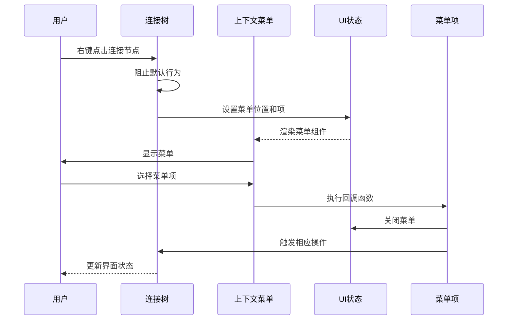

**图表来源**
- [ConnectionTree.tsx:273-308](file://src/renderer/src/components/ConnectionTree.tsx#L273-L308)
- [ContextMenu.tsx:4-79](file://src/renderer/src/components/ContextMenu.tsx#L4-L79)

### 菜单项功能
连接级菜单支持以下功能：
- **连接/断开连接**：根据当前连接状态动态显示
- **新建数据库**：仅在已连接状态下可用
- **新建查询**：创建新的查询标签页
- **编辑连接**：打开连接配置对话框
- **删除连接**：安全删除数据库连接
- **备份数据库**：执行数据库备份操作
- **恢复数据库**：执行数据库恢复操作
- **删除数据库**：删除指定数据库

**章节来源**
- [ConnectionTree.tsx:273-308](file://src/renderer/src/components/ConnectionTree.tsx#L273-L308)
- [ContextMenu.tsx:1-79](file://src/renderer/src/components/ContextMenu.tsx#L1-L79)

## 数据库管理功能

### 数据库创建和删除
连接树组件新增了完整的数据库管理功能：

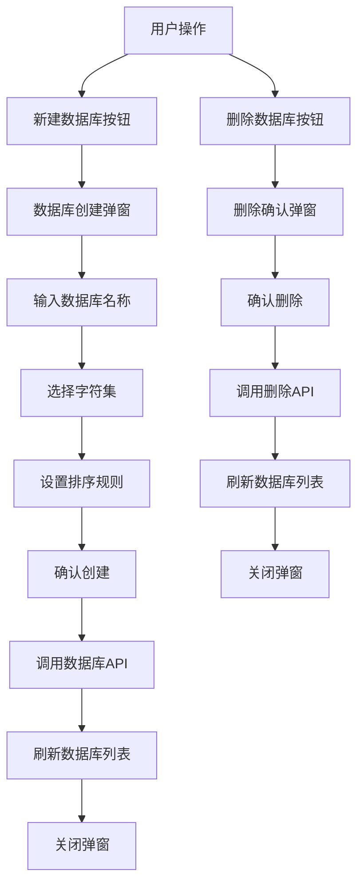

**图表来源**
- [ConnectionTree.tsx:151-204](file://src/renderer/src/components/ConnectionTree.tsx#L151-L204)
- [ConnectionTree.tsx:424-502](file://src/renderer/src/components/ConnectionTree.tsx#L424-L502)

### 数据库操作流程
组件实现了完整的数据库生命周期管理：

1. **创建数据库**：用户输入数据库名称和字符集配置
2. **验证输入**：检查数据库名称的有效性
3. **执行SQL**：发送 CREATE DATABASE SQL 语句
4. **刷新列表**：重新获取数据库列表并更新缓存
5. **错误处理**：显示创建失败的错误信息

**章节来源**
- [ConnectionTree.tsx:151-204](file://src/renderer/src/components/ConnectionTree.tsx#L151-L204)
- [ConnectionTree.tsx:424-502](file://src/renderer/src/components/ConnectionTree.tsx#L424-L502)

## 中间面板联动机制

### 浏览器状态管理
连接树组件与中间面板建立了紧密的状态联动：

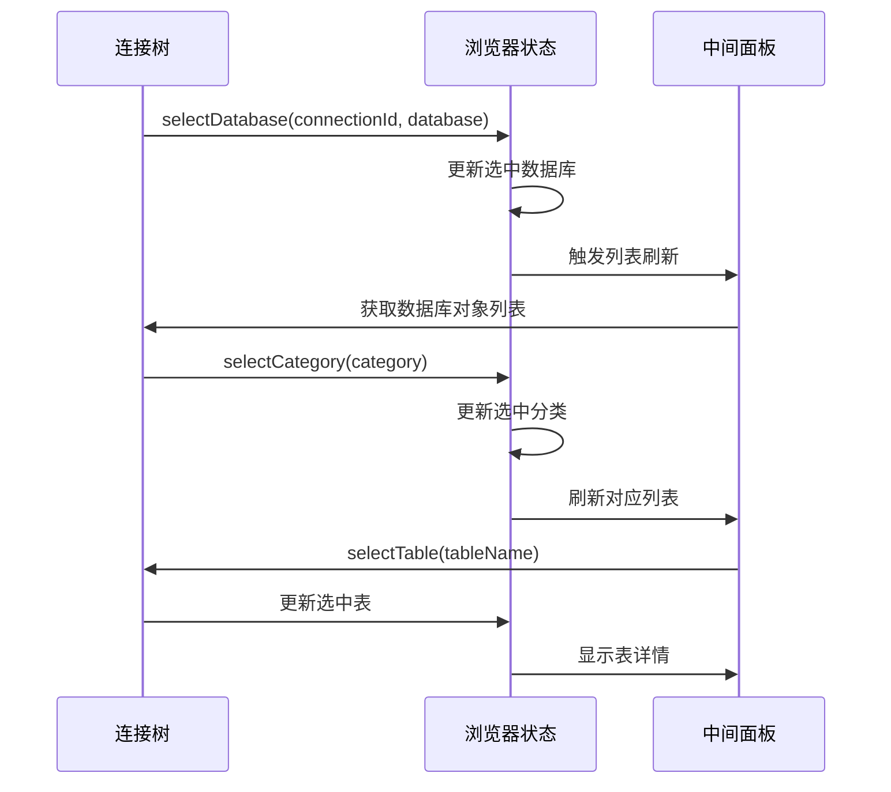

**图表来源**
- [ConnectionTree.tsx:98-124](file://src/renderer/src/components/ConnectionTree.tsx#L98-L124)
- [browser.ts:94-114](file://src/renderer/src/stores/browser.ts#L94-L114)

### 状态同步机制
组件通过浏览器状态存储实现多组件间的协调：

- **数据库选择**：当用户展开数据库节点时，自动更新中间面板的数据库选择
- **分类切换**：点击分类节点时，中间面板显示对应的数据库对象列表
- **表选择**：双击表节点时，中间面板显示表的详细信息
- **比较源设置**：支持设置表比较的源表和目标表

**章节来源**
- [ConnectionTree.tsx:98-124](file://src/renderer/src/components/ConnectionTree.tsx#L98-L124)
- [browser.ts:94-114](file://src/renderer/src/stores/browser.ts#L94-L114)

## 依赖关系分析
连接树组件的依赖关系体现了清晰的模块化设计：

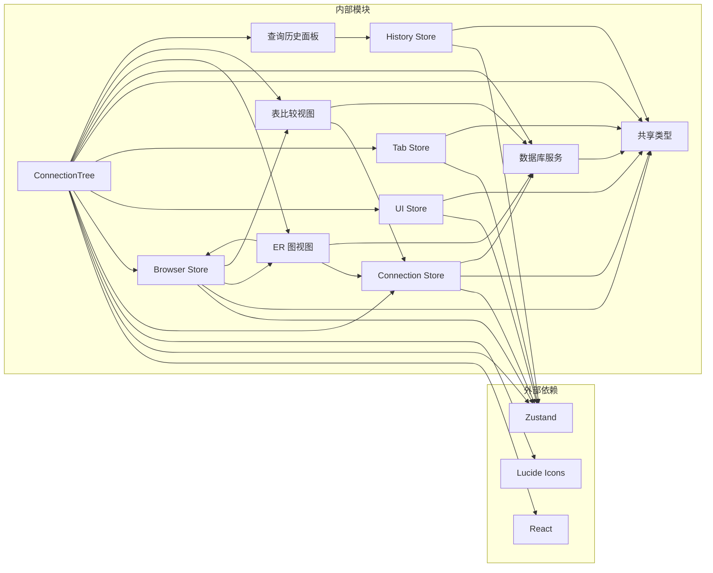

**图表来源**
- [ConnectionTree.tsx:1-28](file://src/renderer/src/components/ConnectionTree.tsx#L1-L28)
- [connection.ts:1-2](file://src/renderer/src/stores/connection.ts#L1-L2)
- [browser.ts:1](file://src/renderer/src/stores/browser.ts#L1)

### 组件耦合度评估
- **低耦合**：组件通过接口和状态管理进行通信
- **高内聚**：每个组件专注于特定的功能领域
- **可测试性**：清晰的依赖关系便于单元测试

**章节来源**
- [ConnectionTree.tsx:17-36](file://src/renderer/src/components/ConnectionTree.tsx#L17-L36)
- [connection.ts:17-63](file://src/renderer/src/stores/connection.ts#L17-L63)

## 性能考虑
连接树组件在设计时充分考虑了性能优化：

### 缓存策略
- **节点数据缓存**：使用 Map 结构缓存数据库和表信息
- **展开状态缓存**：保持用户操作的展开状态
- **连接池管理**：主进程维护数据库连接池，避免频繁创建销毁
- **ER 图布局缓存**：缓存表的布局位置以提高渲染性能

### 渲染优化
- **条件渲染**：仅渲染当前可见的节点
- **状态更新**：使用最小化的状态更新策略
- **事件委托**：减少事件处理器的数量
- **虚拟滚动**：对于大量表的情况，可考虑实现虚拟滚动

### 大数据集处理
对于大型数据库，组件提供了以下优化方案：
- **懒加载**：仅在展开时加载子节点数据
- **分页加载**：支持分批加载表列表
- **增量更新**：只更新发生变化的数据部分

### 内存管理
- **缓存清理**：断开连接时自动清理相关缓存
- **垃圾回收**：合理管理 DOM 节点引用
- **组件卸载**：确保组件卸载时清理所有订阅和定时器

**章节来源**
- [ConnectionTree.tsx:26-34](file://src/renderer/src/components/ConnectionTree.tsx#L26-L34)
- [db.ts:4-28](file://src/main/services/db.ts#L4-L28)

## 故障排除指南
连接树组件可能遇到的问题及解决方案：

### 连接问题
- **连接超时**：检查网络连接和数据库服务器状态
- **认证失败**：验证用户名、密码和权限设置
- **连接池耗尽**：调整连接池大小配置

### 渲染问题
- **节点不显示**：检查缓存是否正确更新
- **状态不同步**：确认状态管理器的响应式更新
- **内存泄漏**：确保事件监听器正确清理

### 功能问题
- **备份失败**：检查磁盘空间和文件权限
- **恢复失败**：验证SQL文件格式和完整性
- **ER 图加载失败**：检查数据库连接和表结构
- **表比较异常**：确认两个表都存在且可访问

### 性能问题
- **渲染卡顿**：启用懒加载和虚拟滚动
- **内存占用过高**：定期清理缓存数据
- **响应缓慢**：优化数据库查询和索引

**章节来源**
- [ConnectionTree.tsx:56-91](file://src/renderer/src/components/ConnectionTree.tsx#L56-L91)
- [db.ts:38-56](file://src/main/services/db.ts#L38-L56)

## 结论
连接树组件展现了现代前端应用的最佳实践，通过清晰的架构设计、完善的缓存策略和优秀的用户体验，为数据库连接管理提供了高效可靠的解决方案。组件经过重大增强后，现在支持复杂的数据库对象导航、层级化浏览、上下文菜单操作、数据库备份恢复、ER 图可视化、表结构比较和查询历史管理等高级功能，大大提升了数据库管理的便利性和效率。

组件的模块化设计使其易于维护和扩展，同时性能优化确保了在大数据集场景下的流畅体验。新增的数据库管理功能、中间面板联动机制、ER 图可视化、表比较工具和查询历史管理等特性，使得用户能够更加直观地管理和操作数据库对象。

未来可以进一步增强的功能包括键盘导航支持、无障碍访问改进、搜索过滤功能、批量操作支持和更高级的数据库对象管理工具。这些改进将进一步提升组件的可用性和专业性，为数据库开发者提供更好的工作体验。