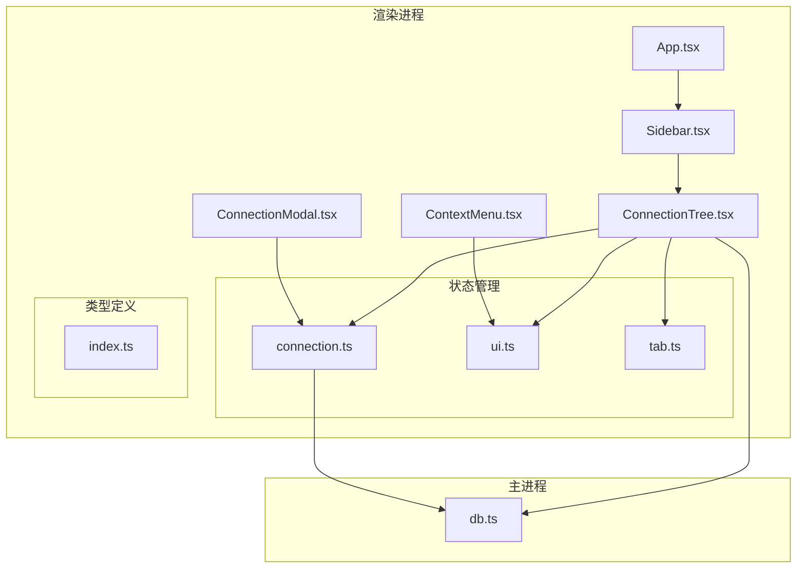
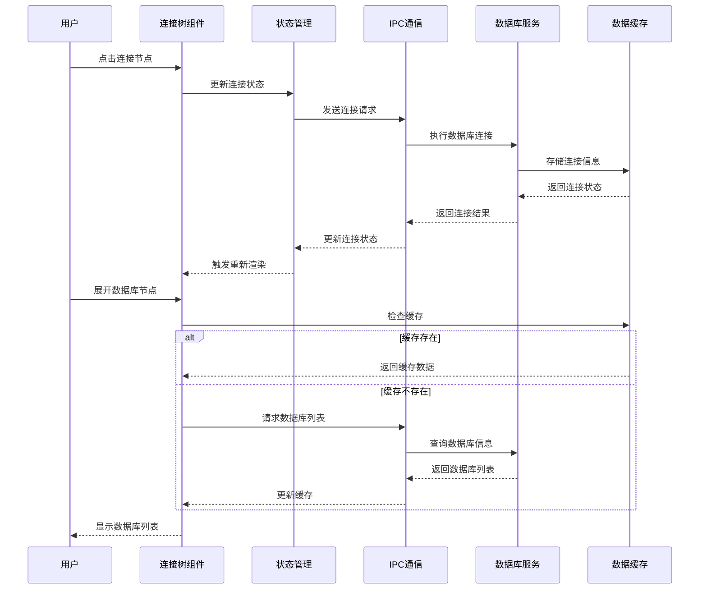
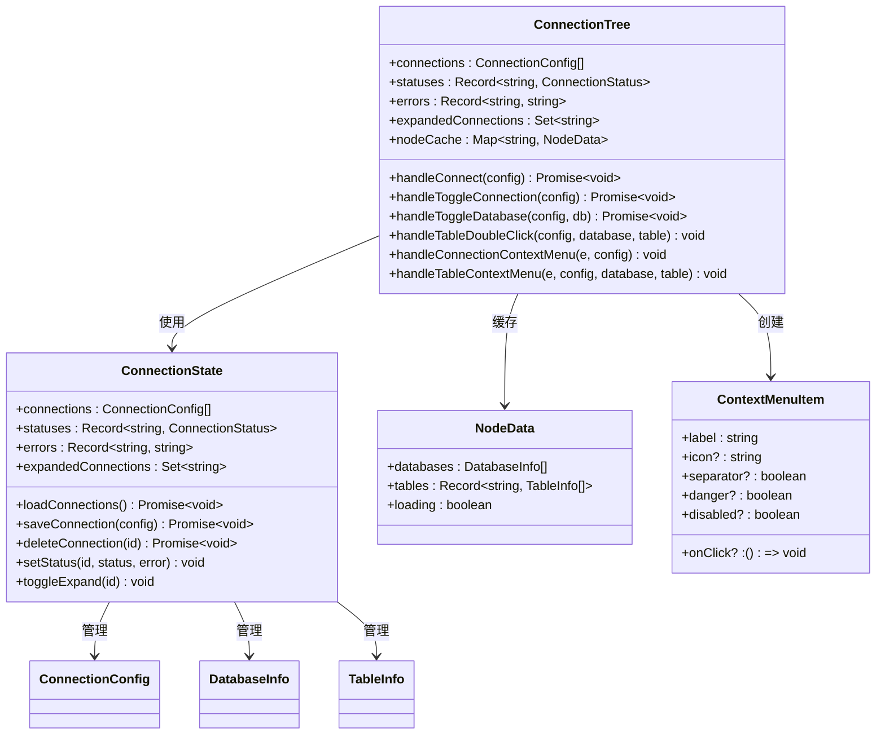
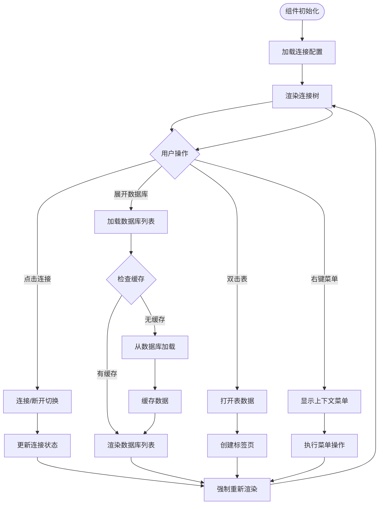
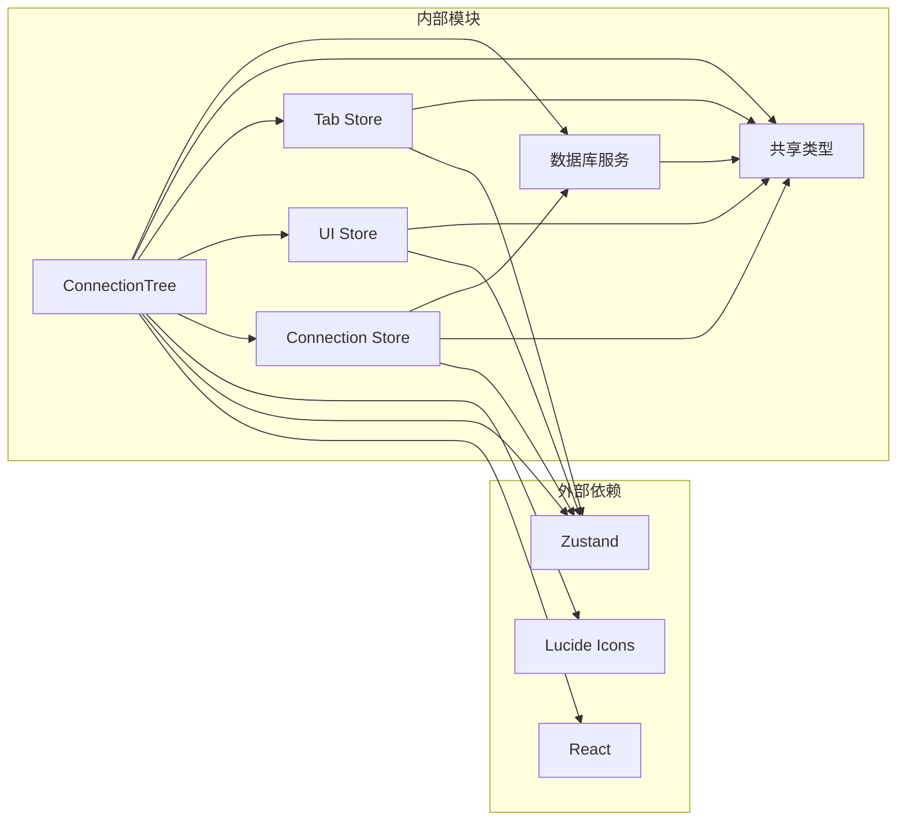

# 连接树组件

<cite>
**本文档引用的文件**
- [ConnectionTree.tsx](file://src/renderer/src/components/ConnectionTree.tsx)
- [connection.ts](file://src/renderer/src/stores/connection.ts)
- [ui.ts](file://src/renderer/src/stores/ui.ts)
- [tab.ts](file://src/renderer/src/stores/tab.ts)
- [types/index.ts](file://src/shared/types/index.ts)
- [db.ts](file://src/main/services/db.ts)
- [App.tsx](file://src/renderer/src/App.tsx)
- [Sidebar.tsx](file://src/renderer/src/components/Sidebar.tsx)
- [ContextMenu.tsx](file://src/renderer/src/components/ContextMenu.tsx)
- [ConnectionModal.tsx](file://src/renderer/src/components/ConnectionModal.tsx)
</cite>

## 目录
1. [简介](#简介)
2. [项目结构](#项目结构)
3. [核心组件](#核心组件)
4. [架构概览](#架构概览)
5. [详细组件分析](#详细组件分析)
6. [依赖关系分析](#依赖关系分析)
7. [性能考虑](#性能考虑)
8. [故障排除指南](#故障排除指南)
9. [结论](#结论)

## 简介
连接树组件是 nexSql 应用中的核心界面组件，负责以树形结构展示数据库连接、数据库实例和表信息。该组件提供了完整的数据库连接管理功能，包括连接状态显示、节点展开折叠、右键菜单交互、双击打开表数据等功能。组件采用现代 React 架构，结合 Zustand 状态管理和 IPC 通信机制，实现了高性能的数据库连接可视化体验。

## 项目结构
连接树组件位于渲染进程的组件目录中，与状态管理、类型定义和主进程服务形成清晰的分层架构：

**图表来源**
- [App.tsx:1-24](file://src/renderer/src/App.tsx#L1-L24)
- [Sidebar.tsx:1-80](file://src/renderer/src/components/Sidebar.tsx#L1-L80)
- [ConnectionTree.tsx:1-313](file://src/renderer/src/components/ConnectionTree.tsx#L1-L313)

**章节来源**
- [App.tsx:1-24](file://src/renderer/src/App.tsx#L1-L24)
- [Sidebar.tsx:1-80](file://src/renderer/src/components/Sidebar.tsx#L1-L80)

## 核心组件
连接树组件的核心功能围绕以下关键特性构建：

### 数据结构设计
组件采用三层嵌套的数据结构：
- **连接层**：展示数据库连接配置和状态
- **数据库层**：显示连接下的数据库实例
- **表层**：呈现数据库中的表和视图信息

### 状态管理机制
组件通过多个 Zustand store 实现状态分离：
- 连接状态存储：管理连接配置、状态和展开状态
- UI 状态存储：控制上下文菜单和模态框
- 标签页状态存储：处理标签页的打开和切换

### 缓存策略
实现智能缓存机制，避免重复的数据库查询：
- 节点数据缓存：存储已加载的数据库和表信息
- 展开状态缓存：保持用户操作的展开状态
- 连接池管理：主进程维护数据库连接池

**章节来源**
- [ConnectionTree.tsx:22-29](file://src/renderer/src/components/ConnectionTree.tsx#L22-L29)
- [connection.ts:4-15](file://src/renderer/src/stores/connection.ts#L4-L15)

## 架构概览
连接树组件采用分层架构设计，确保各层职责清晰且松耦合：

**图表来源**
- [ConnectionTree.tsx:40-75](file://src/renderer/src/components/ConnectionTree.tsx#L40-L75)
- [db.ts:58-71](file://src/main/services/db.ts#L58-L71)
- [connection.ts:17-63](file://src/renderer/src/stores/connection.ts#L17-L63)

## 详细组件分析

### 组件类图
连接树组件的类结构体现了清晰的职责分离：

**图表来源**
- [ConnectionTree.tsx:31-157](file://src/renderer/src/components/ConnectionTree.tsx#L31-L157)
- [connection.ts:17-63](file://src/renderer/src/stores/connection.ts#L17-L63)
- [types/index.ts:3-47](file://src/shared/types/index.ts#L3-L47)

### 数据流分析
连接树组件的数据流遵循单向数据流原则：

**图表来源**
- [ConnectionTree.tsx:203-312](file://src/renderer/src/components/ConnectionTree.tsx#L203-L312)
- [connection.ts:47-62](file://src/renderer/src/stores/connection.ts#L47-L62)

### 右键菜单系统
组件实现了完整的上下文菜单交互系统：

**图表来源**
- [ConnectionTree.tsx:127-189](file://src/renderer/src/components/ConnectionTree.tsx#L127-L189)
- [ContextMenu.tsx:4-79](file://src/renderer/src/components/ContextMenu.tsx#L4-L79)

**章节来源**
- [ConnectionTree.tsx:127-189](file://src/renderer/src/components/ConnectionTree.tsx#L127-L189)
- [ContextMenu.tsx:1-79](file://src/renderer/src/components/ContextMenu.tsx#L1-L79)

## 依赖关系分析
连接树组件的依赖关系体现了清晰的模块化设计：

**图表来源**
- [ConnectionTree.tsx:1-20](file://src/renderer/src/components/ConnectionTree.tsx#L1-L20)
- [connection.ts:1-2](file://src/renderer/src/stores/connection.ts#L1-L2)
- [ui.ts:1](file://src/renderer/src/stores/ui.ts#L1)

### 组件耦合度评估
- **低耦合**：组件通过接口和状态管理进行通信
- **高内聚**：每个组件专注于特定的功能领域
- **可测试性**：清晰的依赖关系便于单元测试

**章节来源**
- [ConnectionTree.tsx:17-36](file://src/renderer/src/components/ConnectionTree.tsx#L17-L36)
- [connection.ts:17-63](file://src/renderer/src/stores/connection.ts#L17-L63)

## 性能考虑
连接树组件在设计时充分考虑了性能优化：

### 缓存策略
- **节点数据缓存**：使用 Map 结构缓存数据库和表信息
- **展开状态缓存**：保持用户操作的展开状态
- **连接池管理**：主进程维护数据库连接池，避免频繁创建销毁

### 渲染优化
- **条件渲染**：仅渲染当前可见的节点
- **状态更新**：使用最小化的状态更新策略
- **事件委托**：减少事件处理器的数量

### 大数据集处理
对于大型数据库，组件提供了以下优化方案：
- **懒加载**：仅在展开时加载子节点数据
- **虚拟滚动**：对于大量表的情况，可考虑实现虚拟滚动
- **分页加载**：支持分批加载表列表

### 内存管理
- **缓存清理**：断开连接时自动清理相关缓存
- **垃圾回收**：合理管理 DOM 节点引用

**章节来源**
- [ConnectionTree.tsx:22-29](file://src/renderer/src/components/ConnectionTree.tsx#L22-L29)
- [db.ts:5-28](file://src/main/services/db.ts#L5-L28)

## 故障排除指南
连接树组件可能遇到的问题及解决方案：

### 连接问题
- **连接超时**：检查网络连接和数据库服务器状态
- **认证失败**：验证用户名、密码和权限设置
- **连接池耗尽**：调整连接池大小配置

### 渲染问题
- **节点不显示**：检查缓存是否正确更新
- **状态不同步**：确认状态管理器的响应式更新
- **内存泄漏**：确保事件监听器正确清理

### 性能问题
- **渲染卡顿**：启用懒加载和虚拟滚动
- **内存占用过高**：定期清理缓存数据
- **响应缓慢**：优化数据库查询和索引

**章节来源**
- [ConnectionTree.tsx:40-58](file://src/renderer/src/components/ConnectionTree.tsx#L40-L58)
- [db.ts:38-56](file://src/main/services/db.ts#L38-L56)

## 结论
连接树组件展现了现代前端应用的最佳实践，通过清晰的架构设计、完善的缓存策略和优秀的用户体验，为数据库连接管理提供了高效可靠的解决方案。组件的模块化设计使其易于维护和扩展，同时性能优化确保了在大数据集场景下的流畅体验。未来可以进一步增强的功能包括键盘导航支持、无障碍访问改进和更高级的搜索过滤功能。