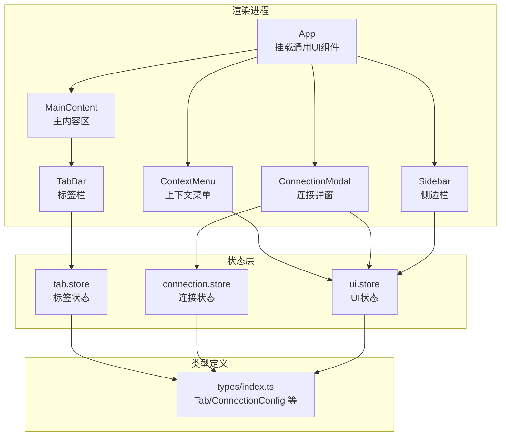
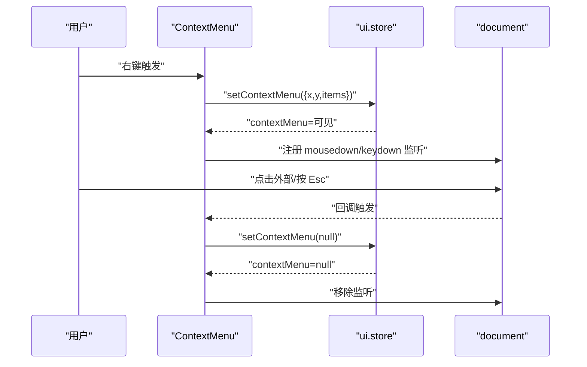
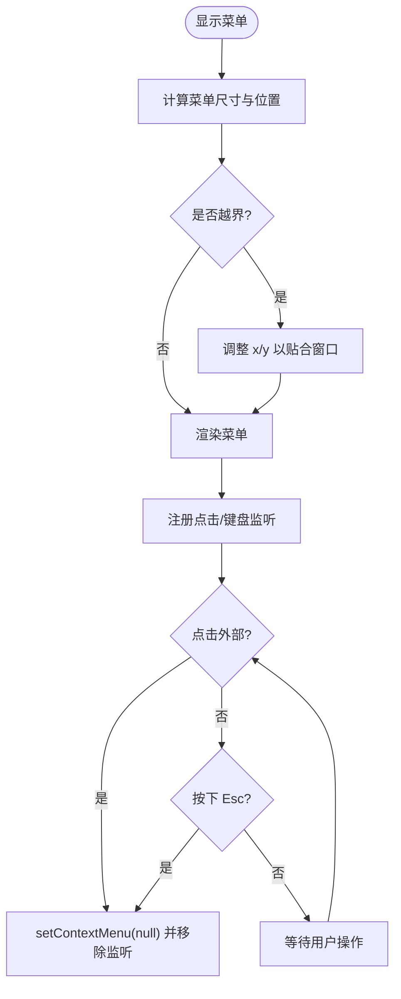
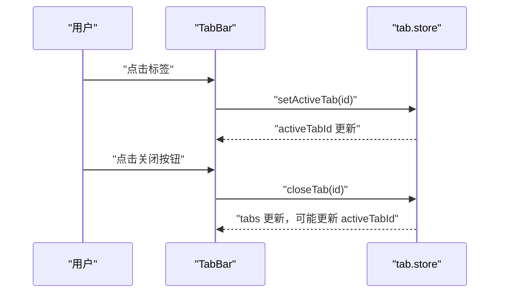
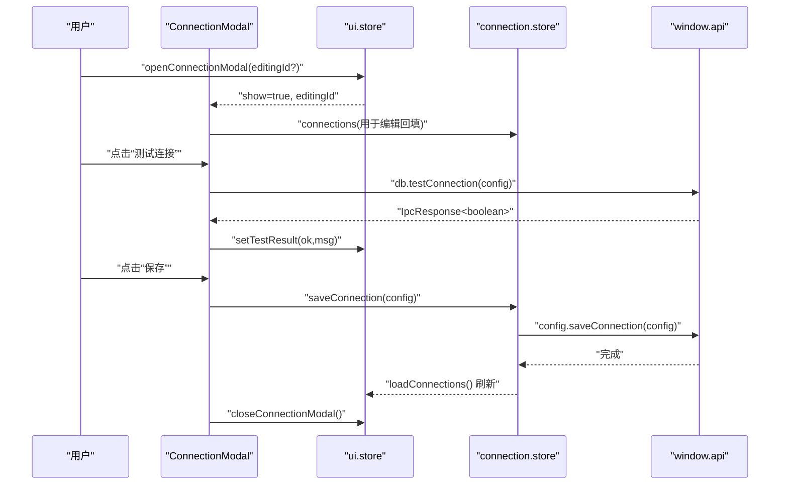
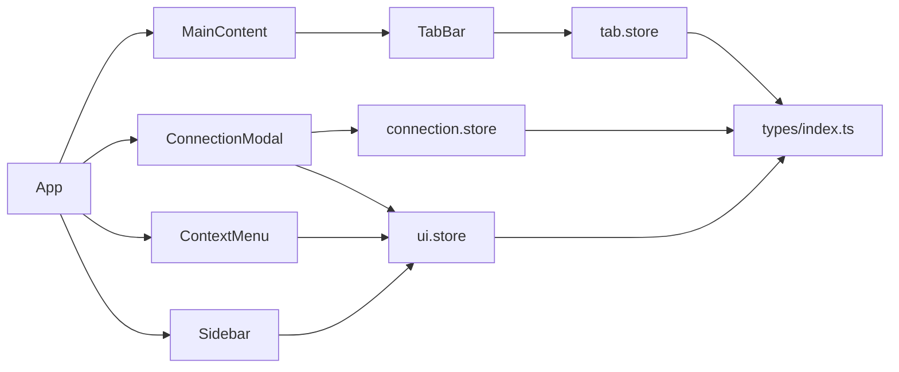

# 通用UI组件

<cite>
**本文引用的文件**
- [src/renderer/src/components/ContextMenu.tsx](file://src/renderer/src/components/ContextMenu.tsx)
- [src/renderer/src/components/TabBar.tsx](file://src/renderer/src/components/TabBar.tsx)
- [src/renderer/src/components/ConnectionModal.tsx](file://src/renderer/src/components/ConnectionModal.tsx)
- [src/renderer/src/stores/ui.ts](file://src/renderer/src/stores/ui.ts)
- [src/renderer/src/stores/tab.ts](file://src/renderer/src/stores/tab.ts)
- [src/renderer/src/stores/connection.ts](file://src/renderer/src/stores/connection.ts)
- [src/shared/types/index.ts](file://src/shared/types/index.ts)
- [src/renderer/src/App.tsx](file://src/renderer/src/App.tsx)
- [src/renderer/src/main.tsx](file://src/renderer/src/main.tsx)
- [src/renderer/src/components/Sidebar.tsx](file://src/renderer/src/components/Sidebar.tsx)
- [src/renderer/src/components/MainContent.tsx](file://src/renderer/src/components/MainContent.tsx)
- [src/renderer/src/index.css](file://src/renderer/src/index.css)
</cite>

## 目录
1. [简介](#简介)
2. [项目结构](#项目结构)
3. [核心组件](#核心组件)
4. [架构总览](#架构总览)
5. [详细组件分析](#详细组件分析)
6. [依赖关系分析](#依赖关系分析)
7. [性能考虑](#性能考虑)
8. [故障排查指南](#故障排查指南)
9. [结论](#结论)
10. [附录](#附录)

## 简介
本文件系统化梳理 nexSql 的通用 UI 组件，重点覆盖上下文菜单、标签栏与连接弹窗三大组件。文档从架构设计、组件职责、状态管理、事件处理、主题适配与样式定制、可访问性与跨浏览器兼容性等方面进行深入解析，并提供使用示例与自定义配置建议，帮助开发者高效复用与扩展。

## 项目结构
- 渲染进程采用 React + Zustand 架构，组件位于 src/renderer/src/components，全局状态位于 src/renderer/src/stores，共享类型定义在 src/shared/types。
- App 作为根组件挂载通用 UI 组件（连接弹窗、上下文菜单），并在主内容区根据活动标签渲染不同视图（查询编辑器、数据表、表设计）。

图表来源
- [src/renderer/src/App.tsx:15-34](file://src/renderer/src/App.tsx#L15-L34)
- [src/renderer/src/components/ContextMenu.tsx:1-79](file://src/renderer/src/components/ContextMenu.tsx#L1-L79)
- [src/renderer/src/components/ConnectionModal.tsx:1-232](file://src/renderer/src/components/ConnectionModal.tsx#L1-L232)
- [src/renderer/src/components/Sidebar.tsx:1-80](file://src/renderer/src/components/Sidebar.tsx#L1-L80)
- [src/renderer/src/components/MainContent.tsx:1-34](file://src/renderer/src/components/MainContent.tsx#L1-L34)
- [src/renderer/src/stores/ui.ts:1-41](file://src/renderer/src/stores/ui.ts#L1-L41)
- [src/renderer/src/stores/tab.ts:1-65](file://src/renderer/src/stores/tab.ts#L1-L65)
- [src/renderer/src/stores/connection.ts:1-64](file://src/renderer/src/stores/connection.ts#L1-L64)
- [src/shared/types/index.ts:1-124](file://src/shared/types/index.ts#L1-L124)

章节来源
- [src/renderer/src/App.tsx:15-34](file://src/renderer/src/App.tsx#L15-L34)
- [src/renderer/src/main.tsx:1-11](file://src/renderer/src/main.tsx#L1-L11)

## 核心组件
- 上下文菜单：全局显示的右键菜单，支持项禁用、分隔符、危险项高亮，自动避屏计算位置，支持点击外部与 Esc 关闭。
- 标签栏：多页签容器，按类型显示图标与脏点，支持切换与关闭，关闭时自动维护活动页签。
- 连接弹窗：连接配置表单，支持测试连接、保存、颜色标签、必填校验与加载状态提示。

章节来源
- [src/renderer/src/components/ContextMenu.tsx:1-79](file://src/renderer/src/components/ContextMenu.tsx#L1-L79)
- [src/renderer/src/components/TabBar.tsx:1-53](file://src/renderer/src/components/TabBar.tsx#L1-L53)
- [src/renderer/src/components/ConnectionModal.tsx:1-232](file://src/renderer/src/components/ConnectionModal.tsx#L1-L232)

## 架构总览
- 组件间通过全局状态解耦：ContextMenu 与 ConnectionModal 由 ui.store 控制显隐；TabBar 由 tab.store 管理标签集合与活动状态；ConnectionModal 通过 connection.store 读写连接列表。
- 类型统一：Tab、ConnectionConfig 等类型集中于 shared/types，确保组件与 store 的契约一致。

图表来源
- [src/renderer/src/components/ContextMenu.tsx:9-34](file://src/renderer/src/components/ContextMenu.tsx#L9-L34)
- [src/renderer/src/stores/ui.ts:35-39](file://src/renderer/src/stores/ui.ts#L35-L39)

## 详细组件分析

### 上下文菜单（ContextMenu）
- 设计要点
  - 单例状态：通过 ui.store 的 contextMenu 字段控制显示与隐藏。
  - 交互行为：点击外部与 Esc 键均可关闭；延迟注册监听避免立即关闭。
  - 位置计算：动态计算菜单位置，避免超出窗口边界。
  - 项渲染：支持普通项、禁用项、分隔符、危险项高亮。
- 属性接口
  - 输入：x、y、items 数组（每项含 label、icon、onClick、separator、danger、disabled）。
  - 输出：无直接返回值，通过 onClick 回调执行业务逻辑后由上层关闭菜单。
- 事件处理
  - mousedown：检测点击目标是否在菜单内，否则关闭。
  - keydown：Esc 键关闭。
- 状态管理
  - setContextMenu(menu|null) 控制显示；内部在卸载时清理监听。
- 使用示例
  - 在任意组件中调用：useUiStore.getState().setContextMenu({ x, y, items })。
  - items 示例：[{ label:"重命名", onClick:()=>{} }, { separator:true }, { label:"删除", danger:true, onClick:()=>{} }]。
- 自定义配置
  - 可通过传入 items 的 danger/disable 控制视觉与交互。
- 主题适配与样式定制
  - 菜单容器与项均使用 Tailwind 变量类名，支持暗色主题；Hover 与禁用态通过类名切换。
  - 可通过自定义 CSS 覆盖 .context-menu-item 的 hover 样式。
- 可访问性与兼容性
  - 支持键盘关闭；建议在 items 中提供键盘快捷键提示（当前未内置）。

图表来源
- [src/renderer/src/components/ContextMenu.tsx:38-48](file://src/renderer/src/components/ContextMenu.tsx#L38-L48)
- [src/renderer/src/components/ContextMenu.tsx:12-22](file://src/renderer/src/components/ContextMenu.tsx#L12-L22)
- [src/renderer/src/stores/ui.ts:39](file://src/renderer/src/stores/ui.ts#L39)

章节来源
- [src/renderer/src/components/ContextMenu.tsx:1-79](file://src/renderer/src/components/ContextMenu.tsx#L1-L79)
- [src/renderer/src/stores/ui.ts:3-24](file://src/renderer/src/stores/ui.ts#L3-L24)

### 标签栏（TabBar）
- 设计要点
  - 多标签展示，按类型映射图标；活动标签高亮，非活动悬停态过渡。
  - 支持关闭按钮（带渐隐显式），点击标签切换活动状态。
  - 脏点标识（如编辑未保存）。
- 属性接口
  - 无外部 props，内部订阅 tab.store 的 tabs、activeTabId。
- 事件处理
  - 点击标签：setActiveTab 切换活动页签。
  - 点击关闭：closeTab 关闭指定页签，维护活动页签一致性。
- 状态管理
  - openTab：去重判断相同连接/数据库/表/类型的标签，存在则聚焦，否则新增并激活。
  - closeTab：删除对应标签，若关闭的是活动标签，按顺序回退到相邻或末尾标签。
  - updateTab/getActiveTab：更新标签信息与获取当前活动标签。
- 使用示例
  - 打开新标签：useTabStore.getState().openTab({ id,type,title,connectionId,... })。
  - 关闭标签：useTabStore.getState().closeTab(id)。
- 自定义配置
  - 可扩展 Tab 类型与图标映射；支持在 Tab 中加入 icon、dirty 等字段。
- 主题适配与样式定制
  - 使用 Tailwind 变量类名实现深色主题；可通过自定义类名覆盖 hover/active 样式。
- 可访问性与兼容性
  - 当前为纯 UI 交互，建议增加键盘导航与 ARIA 标注（当前未内置）。

图表来源
- [src/renderer/src/components/TabBar.tsx:28-46](file://src/renderer/src/components/TabBar.tsx#L28-L46)
- [src/renderer/src/stores/tab.ts:36-51](file://src/renderer/src/stores/tab.ts#L36-L51)

章节来源
- [src/renderer/src/components/TabBar.tsx:1-53](file://src/renderer/src/components/TabBar.tsx#L1-L53)
- [src/renderer/src/stores/tab.ts:15-64](file://src/renderer/src/stores/tab.ts#L15-L64)
- [src/shared/types/index.ts:110-124](file://src/shared/types/index.ts#L110-L124)

### 连接弹窗（ConnectionModal）
- 设计要点
  - 弹窗居中遮罩，点击遮罩或取消关闭；点击内部阻止冒泡。
  - 表单字段：名称（必填）、颜色标签、主机/端口、用户名/密码、默认数据库。
  - 测试连接：调用 window.api.db.testConnection 返回结果并展示；保存连接：调用 window.api.config.saveConnection 后刷新列表。
- 属性接口
  - 无外部 props，内部订阅 ui.store 的 showConnectionModal/editingConnectionId，以及 connection.store 的 connections/saveConnection。
- 事件处理
  - 打开：openConnectionModal(editingId?) 设置显隐与编辑 ID。
  - 关闭：closeConnectionModal 清空编辑 ID。
  - 测试：handleTest -> window.api.db.testConnection -> setTestResult。
  - 保存：handleSave -> 校验必填 -> saveConnection -> close。
- 状态管理
  - ui.store：控制显隐与编辑 ID。
  - connection.store：加载/保存/删除连接，维护 statuses/errors/expandedConnections。
- 使用示例
  - 新建连接：useUiStore.getState().openConnectionModal()。
  - 编辑连接：useUiStore.getState().openConnectionModal(id)。
- 自定义配置
  - 支持扩展 ConnectionConfig 字段（如 SSH/SSL/超时等），并在表单中新增输入项。
- 主题适配与样式定制
  - 使用 Tailwind 变量类名；Monaco Editor 与 react-data-grid 的深色主题变量已内联在 index.css。
- 可访问性与兼容性
  - 表单输入具备基本可访问性；建议补充 aria-label 与错误提示语（当前未内置）。

图表来源
- [src/renderer/src/components/ConnectionModal.tsx:32-65](file://src/renderer/src/components/ConnectionModal.tsx#L32-L65)
- [src/renderer/src/stores/ui.ts:35-39](file://src/renderer/src/stores/ui.ts#L35-L39)
- [src/renderer/src/stores/connection.ts:23-31](file://src/renderer/src/stores/connection.ts#L23-L31)

章节来源
- [src/renderer/src/components/ConnectionModal.tsx:1-232](file://src/renderer/src/components/ConnectionModal.tsx#L1-L232)
- [src/renderer/src/stores/ui.ts:26-40](file://src/renderer/src/stores/ui.ts#L26-L40)
- [src/renderer/src/stores/connection.ts:17-63](file://src/renderer/src/stores/connection.ts#L17-L63)
- [src/shared/types/index.ts:3-30](file://src/shared/types/index.ts#L3-L30)

### 通用设计模式与复用机制
- 单例 UI 组件
  - ContextMenu 与 ConnectionModal 通过 ui.store 控制全局显隐，避免重复实例化与状态分散。
- 去重与状态收敛
  - TabBar 的 openTab 对同类标签进行去重，减少冗余页签与状态碎片。
- 事件冒泡与拦截
  - 弹窗内部点击阻止冒泡，避免误触关闭；标签关闭按钮阻止冒泡以便独立处理。
- 类型驱动
  - Tab/ConnectionConfig 等类型集中定义，组件与 store 严格遵循契约，降低耦合。

章节来源
- [src/renderer/src/stores/ui.ts:35-39](file://src/renderer/src/stores/ui.ts#L35-L39)
- [src/renderer/src/stores/tab.ts:19-34](file://src/renderer/src/stores/tab.ts#L19-L34)
- [src/shared/types/index.ts:110-124](file://src/shared/types/index.ts#L110-L124)

## 依赖关系分析
- 组件依赖
  - App 挂载 ConnectionModal 与 ContextMenu。
  - MainContent 根据活动标签渲染 TabBar 与具体视图。
  - Sidebar 通过 ui.store 控制侧栏宽度与打开连接弹窗。
- 状态依赖
  - ui.store：UI 尺寸、弹窗显隐、上下文菜单。
  - tab.store：标签集合、活动标签、标签更新。
  - connection.store：连接列表、连接状态与错误、展开状态。
- 类型依赖
  - shared/types 提供 Tab、ConnectionConfig、ConnectionStatus 等核心类型。

图表来源
- [src/renderer/src/App.tsx:15-34](file://src/renderer/src/App.tsx#L15-L34)
- [src/renderer/src/components/MainContent.tsx:8-33](file://src/renderer/src/components/MainContent.tsx#L8-L33)
- [src/renderer/src/components/Sidebar.tsx:6-69](file://src/renderer/src/components/Sidebar.tsx#L6-L69)
- [src/renderer/src/stores/ui.ts:1-41](file://src/renderer/src/stores/ui.ts#L1-L41)
- [src/renderer/src/stores/tab.ts:1-65](file://src/renderer/src/stores/tab.ts#L1-L65)
- [src/renderer/src/stores/connection.ts:1-64](file://src/renderer/src/stores/connection.ts#L1-L64)
- [src/shared/types/index.ts:1-124](file://src/shared/types/index.ts#L1-L124)

章节来源
- [src/renderer/src/App.tsx:15-34](file://src/renderer/src/App.tsx#L15-L34)
- [src/renderer/src/components/MainContent.tsx:8-33](file://src/renderer/src/components/MainContent.tsx#L8-L33)
- [src/renderer/src/components/Sidebar.tsx:6-69](file://src/renderer/src/components/Sidebar.tsx#L6-L69)
- [src/renderer/src/stores/ui.ts:1-41](file://src/renderer/src/stores/ui.ts#L1-L41)
- [src/renderer/src/stores/tab.ts:1-65](file://src/renderer/src/stores/tab.ts#L1-L65)
- [src/renderer/src/stores/connection.ts:1-64](file://src/renderer/src/stores/connection.ts#L1-L64)
- [src/shared/types/index.ts:1-124](file://src/shared/types/index.ts#L1-L124)

## 性能考虑
- 渲染优化
  - TabBar 使用 map 渲染标签，建议为标签项提供稳定 key（已使用 id）。
  - ContextMenu 仅在 contextMenu 存在时渲染，避免常驻 DOM。
- 事件监听
  - ContextMenu 在显示时才注册/移除监听，避免常驻事件占用。
- 状态粒度
  - ui.store 与 tab.store 分离关注点，避免无关状态变更导致重渲染。
- 大数据表格
  - react-data-grid 已提供深色主题变量，建议配合虚拟滚动与列宽缓存提升大数据集渲染性能。

## 故障排查指南
- 上下文菜单无法关闭
  - 检查是否正确调用 setContextMenu(null)，确认监听是否被移除。
  - 章节来源: [src/renderer/src/components/ContextMenu.tsx:30-34](file://src/renderer/src/components/ContextMenu.tsx#L30-L34)
- 标签关闭后活动页签异常
  - 检查 closeTab 的活动页签回退逻辑，确认 idx 边界条件。
  - 章节来源: [src/renderer/src/stores/tab.ts:36-51](file://src/renderer/src/stores/tab.ts#L36-L51)
- 连接弹窗保存失败
  - 检查必填校验与 window.api.config.saveConnection 返回值；确认 loadConnections 是否成功刷新。
  - 章节来源: [src/renderer/src/components/ConnectionModal.tsx:52-65](file://src/renderer/src/components/ConnectionModal.tsx#L52-L65), [src/renderer/src/stores/connection.ts:28-31](file://src/renderer/src/stores/connection.ts#L28-L31)
- 深色主题样式不生效
  - 确认 Tailwind 变量类名与 index.css 中的变量覆盖是否正确应用。
  - 章节来源: [src/renderer/src/index.css:1-139](file://src/renderer/src/index.css#L1-L139)

## 结论
nexSql 的通用 UI 组件通过全局状态与类型契约实现了清晰的职责分离与良好的复用性。上下文菜单、标签栏与连接弹窗分别覆盖了右键交互、多页签管理与连接配置场景，具备完善的事件处理、状态管理与主题适配能力。建议在后续迭代中增强可访问性标注与键盘导航，进一步提升用户体验与跨平台一致性。

## 附录
- 主题与样式定制
  - 深色主题变量：Tailwind 变量类名与 CSS 变量覆盖（Monaco Editor、react-data-grid）。
  - 章节来源: [src/renderer/src/index.css:1-139](file://src/renderer/src/index.css#L1-L139)
- 类型参考
  - Tab、ConnectionConfig、ConnectionStatus 等类型定义。
  - 章节来源: [src/shared/types/index.ts:3-30](file://src/shared/types/index.ts#L3-L30), [src/shared/types/index.ts:110-124](file://src/shared/types/index.ts#L110-L124)