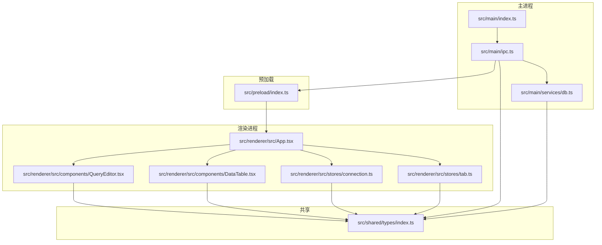
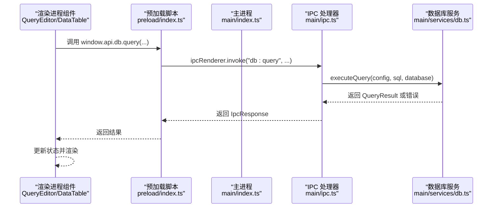
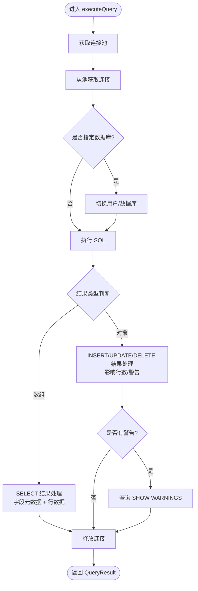
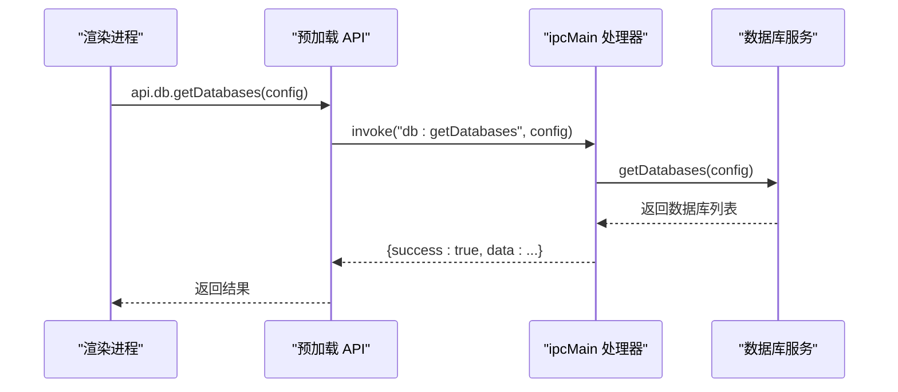
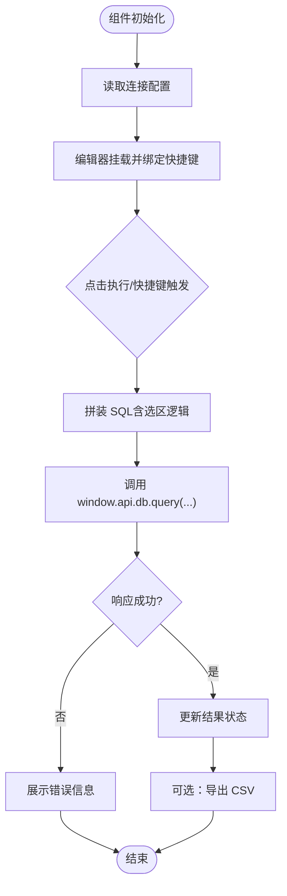
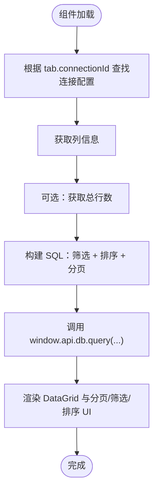
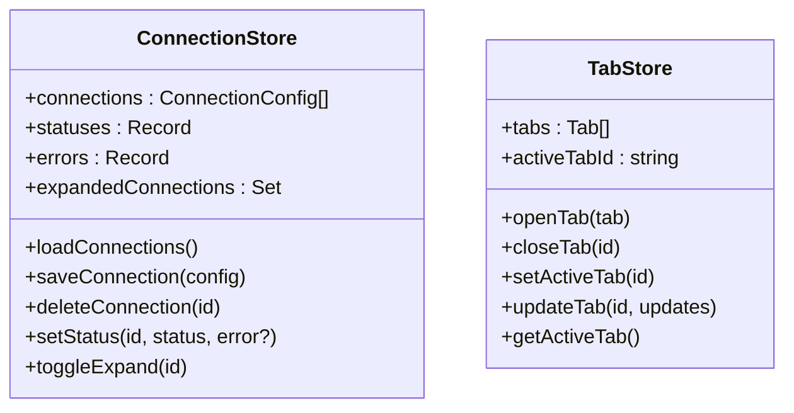
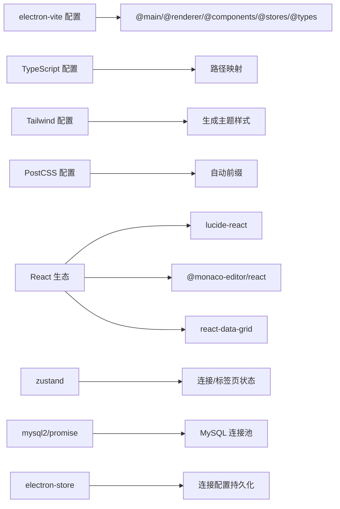

# 开发指南

<cite>
**本文引用的文件**
- [package.json](file://package.json)
- [electron.vite.config.ts](file://electron.vite.config.ts)
- [tsconfig.json](file://tsconfig.json)
- [tsconfig.node.json](file://tsconfig.node.json)
- [tsconfig.web.json](file://tsconfig.web.json)
- [tailwind.config.js](file://tailwind.config.js)
- [postcss.config.js](file://postcss.config.js)
- [src/main/index.ts](file://src/main/index.ts)
- [src/main/ipc.ts](file://src/main/ipc.ts)
- [src/main/services/db.ts](file://src/main/services/db.ts)
- [src/preload/index.ts](file://src/preload/index.ts)
- [src/shared/types/index.ts](file://src/shared/types/index.ts)
- [src/renderer/src/App.tsx](file://src/renderer/src/App.tsx)
- [src/renderer/src/components/DataTable.tsx](file://src/renderer/src/components/DataTable.tsx)
- [src/renderer/src/components/QueryEditor.tsx](file://src/renderer/src/components/QueryEditor.tsx)
- [src/renderer/src/stores/connection.ts](file://src/renderer/src/stores/connection.ts)
- [src/renderer/src/stores/tab.ts](file://src/renderer/src/stores/tab.ts)
</cite>

## 目录
1. [简介](#简介)
2. [项目结构](#项目结构)
3. [核心组件](#核心组件)
4. [架构总览](#架构总览)
5. [详细组件分析](#详细组件分析)
6. [依赖关系分析](#依赖关系分析)
7. [性能考虑](#性能考虑)
8. [故障排查指南](#故障排查指南)
9. [结论](#结论)
10. [附录](#附录)

## 简介
本指南面向 nexSql 的开发者，提供从代码规范、架构设计到开发流程、调试与性能优化的完整说明。项目采用 Electron + React + TypeScript 技术栈，通过 IPC 在主进程与渲染进程之间进行数据库连接与查询交互，并使用 Zustand 管理前端状态，TailwindCSS 提供主题样式。

## 项目结构
项目采用按职责分层的组织方式：
- 主进程：负责窗口生命周期、IPC 注册、数据库连接池管理
- 预加载脚本：在隔离上下文中暴露受控 API 至渲染进程
- 渲染进程：React 组件与 Zustand 状态管理，提供查询编辑器、数据表展示、侧边栏与标签页等界面
- 共享类型：定义 IPC 通信与数据库元数据的数据模型

图表来源
- [src/main/index.ts:1-64](file://src/main/index.ts#L1-L64)
- [src/main/ipc.ts:1-132](file://src/main/ipc.ts#L1-L132)
- [src/main/services/db.ts:1-277](file://src/main/services/db.ts#L1-L277)
- [src/preload/index.ts:1-60](file://src/preload/index.ts#L1-L60)
- [src/renderer/src/App.tsx:1-24](file://src/renderer/src/App.tsx#L1-L24)
- [src/renderer/src/components/QueryEditor.tsx:1-329](file://src/renderer/src/components/QueryEditor.tsx#L1-L329)
- [src/renderer/src/components/DataTable.tsx:1-297](file://src/renderer/src/components/DataTable.tsx#L1-L297)
- [src/renderer/src/stores/connection.ts:1-64](file://src/renderer/src/stores/connection.ts#L1-L64)
- [src/renderer/src/stores/tab.ts:1-65](file://src/renderer/src/stores/tab.ts#L1-L65)
- [src/shared/types/index.ts:1-124](file://src/shared/types/index.ts#L1-L124)

章节来源
- [package.json:1-42](file://package.json#L1-L42)
- [electron.vite.config.ts:1-31](file://electron.vite.config.ts#L1-L31)
- [tsconfig.json:1-29](file://tsconfig.json#L1-L29)

## 核心组件
- 主进程入口与窗口管理：负责创建 BrowserWindow、设置 webPreferences、加载开发或打包资源、注册 IPC 处理函数、应用退出前断开所有数据库连接。
- IPC 层：集中处理连接配置读写、数据库连接测试/建立/断开、SQL 查询与元数据获取（数据库列表、表、列、索引、行数）。
- 数据库服务：基于 mysql2/promise 的连接池管理，封装查询执行、元数据查询与连接生命周期。
- 预加载脚本：通过 contextBridge 暴露受控 API，统一渲染进程调用入口。
- 渲染进程应用：App 负责布局与初始化加载连接；QueryEditor 提供 SQL 编辑、执行、结果展示与导出；DataTable 支持分页、筛选、排序与行数统计。
- 状态管理：Zustand stores 管理连接配置、连接状态与错误、展开节点、标签页集合与活动标签。

章节来源
- [src/main/index.ts:1-64](file://src/main/index.ts#L1-L64)
- [src/main/ipc.ts:1-132](file://src/main/ipc.ts#L1-L132)
- [src/main/services/db.ts:1-277](file://src/main/services/db.ts#L1-L277)
- [src/preload/index.ts:1-60](file://src/preload/index.ts#L1-L60)
- [src/renderer/src/App.tsx:1-24](file://src/renderer/src/App.tsx#L1-L24)
- [src/renderer/src/components/QueryEditor.tsx:1-329](file://src/renderer/src/components/QueryEditor.tsx#L1-L329)
- [src/renderer/src/components/DataTable.tsx:1-297](file://src/renderer/src/components/DataTable.tsx#L1-L297)
- [src/renderer/src/stores/connection.ts:1-64](file://src/renderer/src/stores/connection.ts#L1-L64)
- [src/renderer/src/stores/tab.ts:1-65](file://src/renderer/src/stores/tab.ts#L1-L65)

## 架构总览
Electron 应用采用主进程-渲染进程双线程模型，通过 IPC 实现安全通信。预加载脚本在隔离环境中暴露受限 API，避免直接访问 Node.js 能力。

图表来源
- [src/preload/index.ts:1-60](file://src/preload/index.ts#L1-L60)
- [src/main/ipc.ts:74-81](file://src/main/ipc.ts#L74-L81)
- [src/main/services/db.ts:73-135](file://src/main/services/db.ts#L73-L135)
- [src/renderer/src/components/QueryEditor.tsx:55-64](file://src/renderer/src/components/QueryEditor.tsx#L55-L64)

## 详细组件分析

### 数据库服务与连接池
- 连接池键值：以连接配置 id 作为池标识，避免重复连接同一配置造成资源浪费。
- 连接限制：默认连接池上限为 5，兼顾并发与资源占用。
- 查询计时：使用 performance.now() 记录查询耗时，返回 QueryResult 中包含 duration。
- 元数据查询：封装 information_schema 查询，支持数据库、表、列、索引与行数统计。
- 连接生命周期：提供单个连接与全部断开方法，应用退出前统一释放。

图表来源
- [src/main/services/db.ts:73-135](file://src/main/services/db.ts#L73-L135)
- [src/main/services/db.ts:137-269](file://src/main/services/db.ts#L137-L269)

章节来源
- [src/main/services/db.ts:1-277](file://src/main/services/db.ts#L1-L277)

### IPC 与预加载桥接
- 预加载 API：暴露 config 与 db 两大命名空间，统一通过 ipcRenderer.invoke 调用主进程处理器。
- 主进程处理器：集中处理连接配置 CRUD、数据库连接测试/连接/断开、SQL 查询与元数据查询。
- 错误包装：统一返回 IpcResponse，包含 success、data、error 字段，便于渲染进程处理。

图表来源
- [src/preload/index.ts:25-36](file://src/preload/index.ts#L25-L36)
- [src/main/ipc.ts:83-89](file://src/main/ipc.ts#L83-L89)
- [src/main/services/db.ts:137-155](file://src/main/services/db.ts#L137-L155)

章节来源
- [src/main/ipc.ts:1-132](file://src/main/ipc.ts#L1-L132)
- [src/preload/index.ts:1-60](file://src/preload/index.ts#L1-L60)

### 查询编辑器组件
- 功能要点：SQL 编辑、快捷键执行（Ctrl/Cmd+Enter）、选择性执行、结果面板拖拽调整高度、CSV 导出、执行耗时与影响行数展示。
- 状态管理：使用 Zustand 管理连接配置与 UI 尺寸，减少跨层级传递。
- 错误处理：捕获并展示后端返回的错误信息，避免阻断后续操作。

图表来源
- [src/renderer/src/components/QueryEditor.tsx:36-101](file://src/renderer/src/components/QueryEditor.tsx#L36-L101)
- [src/renderer/src/stores/connection.ts:23-31](file://src/renderer/src/stores/connection.ts#L23-L31)

章节来源
- [src/renderer/src/components/QueryEditor.tsx:1-329](file://src/renderer/src/components/QueryEditor.tsx#L1-L329)
- [src/renderer/src/stores/connection.ts:1-64](file://src/renderer/src/stores/connection.ts#L1-L64)

### 数据表展示组件
- 分页与行数：固定每页 100 条，结合 totalRows 计算页码范围；支持筛选与排序。
- 安全构建 SQL：对 LIKE 条件进行转义；排序列名与表名使用反引号包裹。
- 性能注意：列定义与行格式化使用 useMemo 降低重渲染成本。

图表来源
- [src/renderer/src/components/DataTable.tsx:41-83](file://src/renderer/src/components/DataTable.tsx#L41-L83)
- [src/renderer/src/components/DataTable.tsx:89-147](file://src/renderer/src/components/DataTable.tsx#L89-L147)

章节来源
- [src/renderer/src/components/DataTable.tsx:1-297](file://src/renderer/src/components/DataTable.tsx#L1-L297)

### 状态管理（Zustand）
- 连接状态：维护连接列表、连接状态与错误信息、展开节点集合；提供增删改查与状态切换。
- 标签页状态：支持打开、关闭、激活与更新标签页属性，避免重复打开相同内容的标签。

图表来源
- [src/renderer/src/stores/connection.ts:1-64](file://src/renderer/src/stores/connection.ts#L1-L64)
- [src/renderer/src/stores/tab.ts:1-65](file://src/renderer/src/stores/tab.ts#L1-L65)

章节来源
- [src/renderer/src/stores/connection.ts:1-64](file://src/renderer/src/stores/connection.ts#L1-L64)
- [src/renderer/src/stores/tab.ts:1-65](file://src/renderer/src/stores/tab.ts#L1-L65)

## 依赖关系分析
- 构建与运行时
  - electron-vite 提供主/预加载/渲染三端别名与插件配置
  - TypeScript 使用 bundler 解析与严格模式，路径映射至 @main/@renderer/@components/@stores/@types
  - TailwindCSS 与 PostCSS 配置用于样式生成与自动前缀
- 运行时依赖
  - React 生态与 lucide-react 图标
  - monaco-editor 与 @monaco-editor/react 提供 SQL 编辑体验
  - react-data-grid 用于高性能表格展示
  - mysql2/promise 作为 MySQL 引擎
  - electron-store 本地持久化
  - zustand 轻量状态管理

图表来源
- [electron.vite.config.ts:5-29](file://electron.vite.config.ts#L5-L29)
- [tsconfig.json:14-21](file://tsconfig.json#L14-L21)
- [tailwind.config.js:1-38](file://tailwind.config.js#L1-L38)
- [postcss.config.js:1-7](file://postcss.config.js#L1-L7)
- [package.json:16-26](file://package.json#L16-L26)

章节来源
- [package.json:1-42](file://package.json#L1-L42)
- [electron.vite.config.ts:1-31](file://electron.vite.config.ts#L1-L31)
- [tsconfig.json:1-29](file://tsconfig.json#L1-L29)
- [tailwind.config.js:1-38](file://tailwind.config.js#L1-L38)
- [postcss.config.js:1-7](file://postcss.config.js#L1-L7)

## 性能考虑
- 渲染性能
  - 使用 useMemo 缓存列定义与行格式化，减少 DataGrid 重渲染
  - 固定分页大小（每页 100 行），避免一次性加载大量数据
  - 控制台与结果面板按需渲染，避免不必要的 DOM 更新
- 数据库性能
  - 连接池上限为 5，避免过多并发导致数据库压力
  - 查询计时记录 duration，便于定位慢查询
  - 对 LIKE 条件进行转义，防止注入与错误的 LIKE 匹配
- UI 交互
  - 拖拽调整结果面板高度时，仅更新高度样式，避免重排
  - 快捷键执行查询，减少鼠标交互延迟

章节来源
- [src/renderer/src/components/DataTable.tsx:89-147](file://src/renderer/src/components/DataTable.tsx#L89-L147)
- [src/renderer/src/components/QueryEditor.tsx:108-138](file://src/renderer/src/components/QueryEditor.tsx#L108-L138)
- [src/main/services/db.ts:18-25](file://src/main/services/db.ts#L18-L25)

## 故障排查指南
- 常见问题
  - 无法连接数据库：检查连接配置、网络连通性与防火墙；使用“测试连接”接口验证
  - 查询报错：查看后端返回的错误信息，确认 SQL 语法与权限
  - 表格无数据：确认筛选条件与排序列是否正确；检查 totalRows 与分页参数
- 日志与错误
  - 主进程与预加载均未显式输出日志，建议在需要时添加 console.error 输出
  - 渲染进程通过 IpcResponse 的 error 字段展示错误，可在 UI 中增强错误提示
- 内存与连接
  - 应用退出前会断开所有连接，确保连接池被正确释放
  - 若出现连接泄漏，检查是否存在未释放的连接或未调用断开接口

章节来源
- [src/main/ipc.ts:47-54](file://src/main/ipc.ts#L47-L54)
- [src/main/services/db.ts:271-277](file://src/main/services/db.ts#L271-L277)
- [src/renderer/src/components/QueryEditor.tsx:219-224](file://src/renderer/src/components/QueryEditor.tsx#L219-L224)

## 结论
本项目以清晰的分层架构与严格的 IPC 边界实现了桌面端数据库管理工具的核心能力。通过连接池、分页与缓存策略提升性能，借助 Zustand 与 TailwindCSS 优化开发效率与用户体验。建议在后续迭代中补充日志体系、完善单元测试与 E2E 测试，并持续优化错误提示与性能监控。

## 附录

### 代码规范与最佳实践
- TypeScript
  - 严格模式开启，使用明确的类型注解与联合类型
  - 使用路径映射别名（@main/@renderer/@components/@stores/@types）提升可维护性
  - 接口与类型定义集中在共享目录，避免重复
- React 组件
  - 使用 hooks 管理状态与副作用，避免在渲染期间产生副作用
  - 合理拆分组件，单一职责；利用 memo 化减少重渲染
  - 事件处理与回调使用 useCallback 包裹，避免闭包陷阱
- 状态管理
  - 使用 Zustand 管理轻量状态；避免过度拆分 store
  - 通过 selector 读取局部状态，减少全局订阅
- 样式与主题
  - 使用 TailwindCSS 自定义深色主题变量，保持一致的视觉语言
  - 通过 PostCSS 自动前缀，兼容多浏览器

章节来源
- [tsconfig.json:2-13](file://tsconfig.json#L2-L13)
- [electron.vite.config.ts:14-29](file://electron.vite.config.ts#L14-L29)
- [tailwind.config.js:4-34](file://tailwind.config.js#L4-L34)

### 开发流程与工作流
- 开发启动
  - 使用开发脚本启动热更新开发服务器
  - 主进程加载开发服务器地址，渲染进程热更新
- 构建与打包
  - 使用 electron-vite 构建主/预加载/渲染三端
  - 使用 electron-builder 生成各平台安装包
- 版本与分支
  - 建议采用 Git Flow 或 GitHub Flow，区分 develop、release、hotfix 分支
  - 使用语义化版本号，变更记录在 CHANGELOG 中维护

章节来源
- [package.json:8-14](file://package.json#L8-L14)
- [electron.vite.config.ts:5-29](file://electron.vite.config.ts#L5-L29)

### 调试技巧与工具
- Electron 开发者工具
  - 在主进程 BrowserWindow 中启用开发者工具，定位渲染进程问题
- React DevTools
  - 在渲染进程中集成 React DevTools，检查组件树与状态变化
- 日志与断点
  - 在预加载与主进程关键路径添加日志输出
  - 使用浏览器断点与条件断点定位异步流程

章节来源
- [src/main/index.ts:18-24](file://src/main/index.ts#L18-L24)

### 错误处理与日志记录规范
- 统一返回 IpcResponse，包含 success、data、error 字段
- 渲染进程在 UI 中展示错误信息，必要时提供复制错误的能力
- 建议在主进程与预加载中增加结构化日志输出，便于问题追踪

章节来源
- [src/main/ipc.ts:104-108](file://src/main/ipc.ts#L104-L108)
- [src/renderer/src/components/QueryEditor.tsx:219-224](file://src/renderer/src/components/QueryEditor.tsx#L219-L224)

### 代码审查与质量保证
- 代码审查清单
  - 类型安全与边界条件检查
  - IPC 调用的错误处理与返回值校验
  - 渲染组件的性能优化与内存泄漏风险
- 质量工具
  - ESLint + Prettier（如引入）统一风格
  - 单元测试覆盖核心业务逻辑（如 query、分页、排序）
  - E2E 测试覆盖关键用户路径（连接、查询、导出）

章节来源
- [src/main/services/db.ts:73-135](file://src/main/services/db.ts#L73-L135)
- [src/renderer/src/components/DataTable.tsx:121-137](file://src/renderer/src/components/DataTable.tsx#L121-L137)

### 扩展开发与插件开发指导
- 插件化思路
  - 通过扩展 IPC 命名空间或新增处理器，支持新数据库类型
  - 将 UI 组件抽象为可复用模块，按功能拆分
- 配置与元数据
  - 新增连接类型时，扩展共享类型定义与 UI 表单
  - 适配不同数据库的元数据查询（information_schema 变体）

章节来源
- [src/shared/types/index.ts:3-22](file://src/shared/types/index.ts#L3-L22)
- [src/main/ipc.ts:16-127](file://src/main/ipc.ts#L16-L127)

### 版本控制与分支管理策略
- 分支策略
  - develop：日常合并特性分支
  - release：准备发布版本，进行回归测试
  - hotfix：紧急修复，快速回滚并同步到 develop
- 提交规范
  - 使用清晰的提交信息描述变更类型与影响范围
  - 重要变更在 PR 描述中说明风险与测试情况

章节来源
- [package.json:1-42](file://package.json#L1-L42)