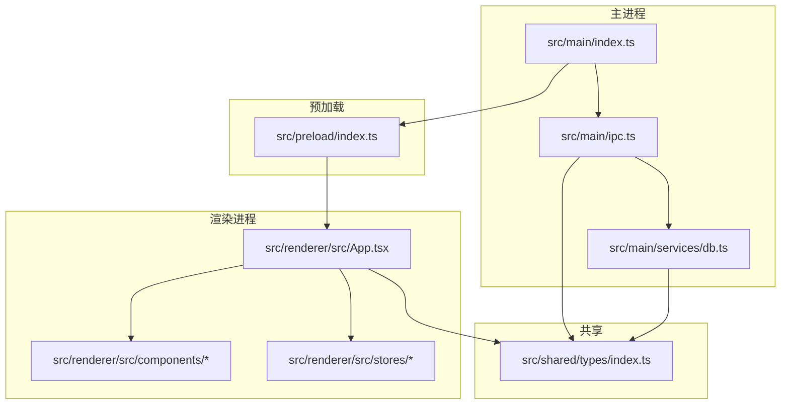
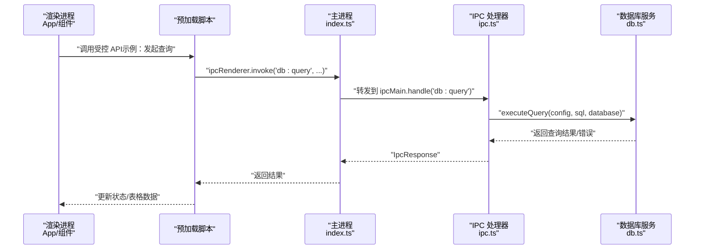

# 开发流程

<cite>
**本文引用的文件**
- [package.json](file://package.json)
- [electron.vite.config.ts](file://electron.vite.config.ts)
- [tsconfig.json](file://tsconfig.json)
- [tsconfig.node.json](file://tsconfig.node.json)
- [tsconfig.web.json](file://tsconfig.web.json)
- [electron-builder.yml](file://electron-builder.yml)
- [.gitignore](file://.gitignore)
- [postcss.config.js](file://postcss.config.js)
- [tailwind.config.js](file://tailwind.config.js)
- [src/main/index.ts](file://src/main/index.ts)
- [src/main/ipc.ts](file://src/main/ipc.ts)
- [src/main/services/db.ts](file://src/main/services/db.ts)
- [src/renderer/src/App.tsx](file://src/renderer/src/App.tsx)
</cite>

## 目录
1. [简介](#简介)
2. [项目结构](#项目结构)
3. [核心组件](#核心组件)
4. [架构总览](#架构总览)
5. [详细组件分析](#详细组件分析)
6. [依赖分析](#依赖分析)
7. [性能考虑](#性能考虑)
8. [故障排查指南](#故障排查指南)
9. [结论](#结论)
10. [附录](#附录)

## 简介
本指南面向 nexSql 项目的开发者，提供从环境准备、本地开发、代码规范与工作流、代码评审与质量保障、版本发布与自动化部署，到开发工具与 IDE 配置建议以及团队协作最佳实践的全流程说明。项目采用 Electron + React + TypeScript 技术栈，使用 electron-vite 构建多端（主进程、预加载、渲染进程）一体化工程，并通过 electron-builder 打包分发。

## 项目结构
项目采用按职责分层的组织方式：
- 主进程：负责窗口生命周期、IPC 通信、数据库连接池管理
- 预加载脚本：隔离上下文，暴露受控 API 给渲染进程
- 渲染进程：React 应用，组件化 UI，状态管理（Zustand）
- 共享类型：定义 IPC 与数据库交互的数据模型
- 构建与打包：统一在 electron-vite 中配置，electron-builder 负责跨平台产物

图表来源
- [src/main/index.ts:1-64](file://src/main/index.ts#L1-L64)
- [src/main/ipc.ts:1-182](file://src/main/ipc.ts#L1-L182)
- [src/main/services/db.ts:1-277](file://src/main/services/db.ts#L1-L277)
- [src/renderer/src/App.tsx:1-35](file://src/renderer/src/App.tsx#L1-L35)

章节来源
- [package.json:1-42](file://package.json#L1-L42)
- [electron.vite.config.ts:1-31](file://electron.vite.config.ts#L1-L31)
- [tsconfig.json:1-29](file://tsconfig.json#L1-L29)
- [tsconfig.node.json:1-20](file://tsconfig.node.json#L1-L20)
- [tsconfig.web.json:1-28](file://tsconfig.web.json#L1-L28)

## 核心组件
- 主进程入口：初始化窗口、设置 webPreferences、加载开发或打包资源、注册 IPC 处理器
- IPC 层：集中处理连接配置、数据库测试/连接/断开、SQL 查询与元数据读取
- 数据库服务：基于 mysql2 的连接池管理，封装查询执行、元数据枚举（库/表/列/索引/行数）
- 渲染应用：App 作为根组件，挂载侧边栏、主内容区、连接弹窗与上下文菜单；使用 TailwindCSS 定义深色主题样式

章节来源
- [src/main/index.ts:1-64](file://src/main/index.ts#L1-L64)
- [src/main/ipc.ts:46-177](file://src/main/ipc.ts#L46-L177)
- [src/main/services/db.ts:38-277](file://src/main/services/db.ts#L38-L277)
- [src/renderer/src/App.tsx:8-34](file://src/renderer/src/App.tsx#L8-L34)

## 架构总览
下图展示从用户操作到数据库查询的端到端调用链路，涵盖主进程 IPC、数据库服务与渲染进程状态更新。

图表来源
- [src/main/index.ts:36-41](file://src/main/index.ts#L36-L41)
- [src/main/ipc.ts:106-117](file://src/main/ipc.ts#L106-L117)
- [src/main/services/db.ts:73-135](file://src/main/services/db.ts#L73-L135)

## 详细组件分析

### 主进程与窗口生命周期
- 创建窗口时设置尺寸、最小宽高、标题栏样式、背景色与 webPreferences（禁用 Node 集成、启用上下文隔离）
- 开发模式下从环境变量加载前端开发服务器地址，否则加载打包后的 HTML
- 注册 IPC 处理器后进入事件循环，处理窗口激活与退出前断开所有数据库连接

章节来源
- [src/main/index.ts:8-41](file://src/main/index.ts#L8-L41)
- [src/main/index.ts:43-64](file://src/main/index.ts#L43-L64)

### IPC 通信与错误日志
- 使用 electron-store 存储连接配置，支持增删改查
- 对数据库相关操作统一捕获异常，记录带时间戳的错误信息与堆栈，返回标准化 IpcResponse
- 提供连接测试、连接、断开、查询、数据库/表/列/索引/行数枚举等接口

章节来源
- [src/main/ipc.ts:49-72](file://src/main/ipc.ts#L49-L72)
- [src/main/ipc.ts:76-176](file://src/main/ipc.ts#L76-L176)
- [src/main/ipc.ts:16-44](file://src/main/ipc.ts#L16-L44)

### 数据库服务与连接池
- 基于 mysql2/promise，按连接配置 ID 维护连接池映射
- 支持连接测试、建立连接、执行查询、断开单个连接或全部连接
- 查询结果区分 SELECT 与 DML，分别返回列定义、行数据或影响行数、警告信息等

章节来源
- [src/main/services/db.ts:11-36](file://src/main/services/db.ts#L11-L36)
- [src/main/services/db.ts:38-63](file://src/main/services/db.ts#L38-L63)
- [src/main/services/db.ts:73-135](file://src/main/services/db.ts#L73-L135)
- [src/main/services/db.ts:137-269](file://src/main/services/db.ts#L137-L269)

### 渲染应用与主题
- App 根组件负责加载连接配置并挂载侧边栏、主内容区、连接弹窗与上下文菜单
- TailwindCSS 定义深色主题配色、字体族与扩展规则，确保一致的视觉体验

章节来源
- [src/renderer/src/App.tsx:8-34](file://src/renderer/src/App.tsx#L8-L34)
- [tailwind.config.js:1-38](file://tailwind.config.js#L1-L38)

## 依赖分析
- 构建与运行时
  - electron-vite：多端一体化构建工具，配置主进程、预加载与渲染进程别名与插件
  - electron：框架运行时
  - vite：开发服务器与打包基础
- 前端生态
  - react/react-dom：视图层
  - @monaco-editor/react + monaco-editor：SQL 编辑器
  - react-data-grid：数据表格
  - lucide-react：图标
  - zustand：轻量状态管理
- 数据库
  - mysql2：MySQL 连接与查询
- 样式与工具
  - tailwindcss + autoprefixer：原子化样式
  - electron-store：本地配置持久化

章节来源
- [package.json:8-15](file://package.json#L8-L15)
- [package.json:16-26](file://package.json#L16-L26)
- [package.json:27-40](file://package.json#L27-L40)
- [electron.vite.config.ts:5-29](file://electron.vite.config.ts#L5-L29)
- [postcss.config.js:1-7](file://postcss.config.js#L1-L7)

## 性能考虑
- 连接池复用：按连接 ID 缓存连接池，减少重复握手与鉴权开销
- 查询计时：记录查询耗时，便于定位慢查询与优化
- 资源释放：每次查询后及时 release 连接；应用退出前断开所有连接池
- UI 渲染：合理拆分组件与状态，避免不必要的重渲染

章节来源
- [src/main/services/db.ts:5-36](file://src/main/services/db.ts#L5-L36)
- [src/main/services/db.ts:86-88](file://src/main/services/db.ts#L86-L88)
- [src/main/index.ts:61-63](file://src/main/index.ts#L61-L63)

## 故障排查指南
- 启动失败
  - 检查开发服务器是否正常（开发脚本会尝试加载 ELETRON_RENDERER_URL），若未启动请先运行开发命令
  - 查看主进程窗口创建参数与 webPreferences 设置是否符合当前平台
- 数据库连接问题
  - 使用“测试连接”接口验证凭据与网络连通性
  - 若出现超时，检查连接超时配置与网络策略
- 查询异常
  - 查看 IPC 层错误日志输出（含堆栈），确认 SQL 语法与目标库/表是否存在
  - 对于 DML 操作，关注 warning 字段以获取 MySQL 警告详情
- 打包产物缺失
  - 确认 electron-builder 配置与目标平台脚本已正确执行

章节来源
- [src/main/index.ts:36-41](file://src/main/index.ts#L36-L41)
- [src/main/ipc.ts:16-44](file://src/main/ipc.ts#L16-L44)
- [src/main/ipc.ts:76-94](file://src/main/ipc.ts#L76-L94)
- [src/main/services/db.ts:106-131](file://src/main/services/db.ts#L106-L131)
- [electron-builder.yml:1-34](file://electron-builder.yml#L1-L34)

## 结论
本指南提供了从环境搭建到发布运维的完整开发流程参考。建议团队在日常协作中严格遵循分支与提交规范，配合代码评审与质量门禁，确保交付稳定可靠的桌面应用。

## 附录

### 开发环境搭建步骤
- Node.js 版本
  - 项目使用 TypeScript 5 与 Vite 5，建议使用 Node.js LTS（如 18.x 或 20.x）以获得最佳兼容性
- 依赖安装
  - 使用 npm 安装依赖，确保 node_modules 与构建产物目录被忽略
- 启动开发服务器
  - 运行开发脚本以启动 electron-vite 开发服务器与热更新
  - 生产构建与预览可使用对应脚本
- 平台打包
  - 使用 electron-builder 脚本生成各平台安装包，产物命名与目标由打包配置决定

章节来源
- [package.json:8-15](file://package.json#L8-L15)
- [.gitignore:1-30](file://.gitignore#L1-L30)
- [electron-builder.yml:1-34](file://electron-builder.yml#L1-L34)

### 代码提交规范与 Git 工作流
- 分支管理
  - 建议采用功能分支开发，主分支仅合并通过评审的功能
- 提交信息规范
  - 类型：feat/fix/docs/style/refactor/test/build/ci/chore
  - 范围：模块或文件路径（如 main/ipc、renderer/components）
  - 描述：简明扼要说明变更内容，必要时补充动机与影响
- Pull Request 流程
  - PR 描述需包含变更概述、影响范围、测试要点与风险提示
  - 至少一次代码评审通过后方可合并

[本节为通用规范说明，不直接分析具体文件，故无“章节来源”]

### 代码审查流程与质量保证
- 代码评审
  - 关注安全性（SQL 注入防护）、健壮性（异常处理与资源释放）、可维护性（模块职责与接口设计）
- 质量门禁
  - 本地运行构建脚本与打包脚本，确保产物可用
  - 在 CI 中执行构建与打包，确保跨平台产物一致性

章节来源
- [src/main/ipc.ts:16-44](file://src/main/ipc.ts#L16-L44)
- [src/main/services/db.ts:65-71](file://src/main/services/db.ts#L65-L71)
- [electron-builder.yml:1-34](file://electron-builder.yml#L1-L34)

### 版本发布流程与自动化部署
- 发布流程
  - 更新版本号与变更日志，确保语义化版本规范
  - 在各平台执行打包脚本，产出 dmg/zip（macOS）、nsis/deb/AppImage（Linux）等
- 自动化部署
  - 可在 CI 中集成 electron-builder，自动上传制品至发布渠道或包仓库

章节来源
- [package.json:3-4](file://package.json#L3-L4)
- [electron-builder.yml:15-33](file://electron-builder.yml#L15-L33)

### 开发工具推荐与 IDE 配置建议
- 编辑器
  - VS Code：启用 TypeScript/TSX 诊断、ESLint/Prettier 插件，配置工作区路径映射
- 调试
  - 使用 Electron DevTools 调试主进程与渲染进程；为预加载脚本开启断点
- 路径别名
  - 利用 tsconfig 与 electron-vite 配置中的路径别名，提升导入可读性与重构便利性

章节来源
- [tsconfig.json:14-21](file://tsconfig.json#L14-L21)
- [tsconfig.node.json:13-18](file://tsconfig.node.json#L13-L18)
- [tsconfig.web.json:13-19](file://tsconfig.web.json#L13-L19)
- [electron.vite.config.ts:8-26](file://electron.vite.config.ts#L8-L26)

### 团队协作最佳实践与沟通规范
- 沟通
  - 使用统一的沟通渠道同步进度与问题，重大变更提前同步
- 文档
  - 新增或修改公共接口时同步更新类型定义与注释
- 测试
  - 为关键路径编写单元或端到端测试，确保回归安全

[本节为通用规范说明，不直接分析具体文件，故无“章节来源”]