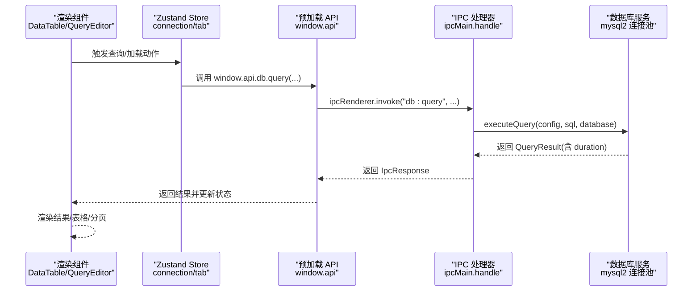
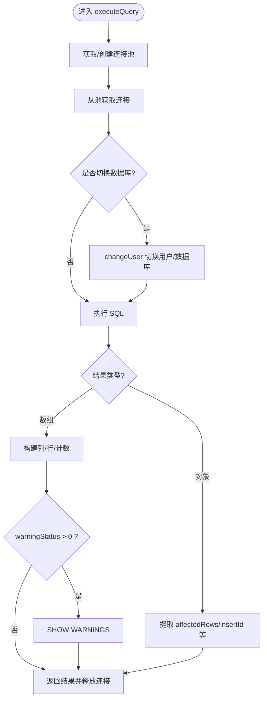
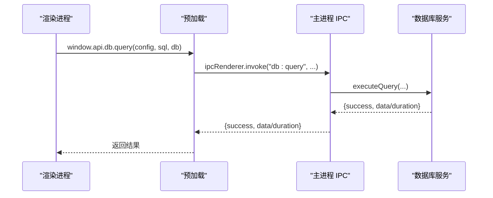
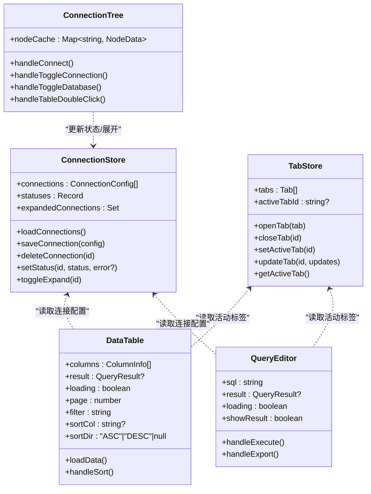
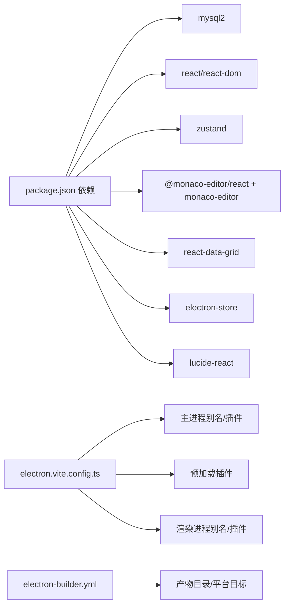

# 性能优化

<cite>
**本文引用的文件**
- [src/main/index.ts](file://src/main/index.ts)
- [src/preload/index.ts](file://src/preload/index.ts)
- [src/main/ipc.ts](file://src/main/ipc.ts)
- [src/main/services/db.ts](file://src/main/services/db.ts)
- [package.json](file://package.json)
- [src/renderer/src/App.tsx](file://src/renderer/src/App.tsx)
- [src/renderer/src/main.tsx](file://src/renderer/src/main.tsx)
- [src/renderer/src/stores/connection.ts](file://src/renderer/src/stores/connection.ts)
- [src/renderer/src/stores/tab.ts](file://src/renderer/src/stores/tab.ts)
- [src/shared/types/index.ts](file://src/shared/types/index.ts)
- [src/renderer/src/components/DataTable.tsx](file://src/renderer/src/components/DataTable.tsx)
- [src/renderer/src/components/QueryEditor.tsx](file://src/renderer/src/components/QueryEditor.tsx)
- [src/renderer/src/components/ConnectionTree.tsx](file://src/renderer/src/components/ConnectionTree.tsx)
- [electron.vite.config.ts](file://electron.vite.config.ts)
- [electron-builder.yml](file://electron-builder.yml)
</cite>

## 目录
1. [简介](#简介)
2. [项目结构](#项目结构)
3. [核心组件](#核心组件)
4. [架构总览](#架构总览)
5. [详细组件分析](#详细组件分析)
6. [依赖关系分析](#依赖关系分析)
7. [性能考量与优化建议](#性能考量与优化建议)
8. [故障排查指南](#故障排查指南)
9. [结论](#结论)
10. [附录：性能测试与分析案例](#附录性能测试与分析案例)

## 简介
本指南面向 nexSql 项目的性能优化，覆盖以下方面：
- Electron 应用的内存管理、进程间通信（IPC）优化、资源加载优化
- React 应用的组件渲染优化、状态管理优化、懒加载策略
- 数据库连接池与查询性能优化最佳实践
- 性能监控工具与指标分析方法
- 打包与体积优化策略
- 具体的性能测试与分析案例

## 项目结构
项目采用 Electron-Vite 的多端分离架构：主进程负责系统集成与数据库连接池管理；预加载脚本暴露受控 API；渲染进程基于 React + Zustand 状态管理，组件通过 IPC 调用数据库服务。

```mermaid
graph TB
subgraph "主进程"
MIDX["src/main/index.ts"]
MIPC["src/main/ipc.ts"]
MDB["src/main/services/db.ts"]
end
subgraph "预加载"
PLOAD["src/preload/index.ts"]
end
subgraph "渲染进程"
RAPP["src/renderer/src/App.tsx"]
RMAIN["src/renderer/src/main.tsx"]
RCONN["src/renderer/src/stores/connection.ts"]
RTAB["src/renderer/src/stores/tab.ts"]
RCMP_DT["src/renderer/src/components/DataTable.tsx"]
RCMP_QE["src/renderer/src/components/QueryEditor.tsx"]
RCMP_CT["src/renderer/src/components/ConnectionTree.tsx"]
end
subgraph "共享类型"
STYPE["src/shared/types/index.ts"]
end
MIDX --> MIPC
MIPC --> MDB
PLOAD <- --> MIPC
RAPP --> RMAIN
RAPP --> RCONN
RAPP --> RTAB
RCONN --> PLOAD
RTAB --> PLOAD
RCMP_DT --> PLOAD
RCMP_QE --> PLOAD
RCMP_CT --> PLOAD
RCONN --> STYPE
RTAB --> STYPE
RCMP_DT --> STYPE
RCMP_QE --> STYPE
RCMP_CT --> STYPE
```

图示来源
- [src/main/index.ts:1-64](file://src/main/index.ts#L1-L64)
- [src/main/ipc.ts:1-182](file://src/main/ipc.ts#L1-L182)
- [src/main/services/db.ts:1-277](file://src/main/services/db.ts#L1-L277)
- [src/preload/index.ts:1-60](file://src/preload/index.ts#L1-L60)
- [src/renderer/src/App.tsx:1-35](file://src/renderer/src/App.tsx#L1-L35)
- [src/renderer/src/main.tsx:1-11](file://src/renderer/src/main.tsx#L1-L11)
- [src/renderer/src/stores/connection.ts:1-64](file://src/renderer/src/stores/connection.ts#L1-L64)
- [src/renderer/src/stores/tab.ts:1-65](file://src/renderer/src/stores/tab.ts#L1-L65)
- [src/renderer/src/components/DataTable.tsx:1-297](file://src/renderer/src/components/DataTable.tsx#L1-L297)
- [src/renderer/src/components/QueryEditor.tsx:1-329](file://src/renderer/src/components/QueryEditor.tsx#L1-L329)
- [src/renderer/src/components/ConnectionTree.tsx:1-313](file://src/renderer/src/components/ConnectionTree.tsx#L1-L313)
- [src/shared/types/index.ts:1-124](file://src/shared/types/index.ts#L1-L124)

章节来源
- [src/main/index.ts:1-64](file://src/main/index.ts#L1-L64)
- [src/preload/index.ts:1-60](file://src/preload/index.ts#L1-L60)
- [src/main/ipc.ts:1-182](file://src/main/ipc.ts#L1-L182)
- [src/main/services/db.ts:1-277](file://src/main/services/db.ts#L1-L277)
- [src/renderer/src/App.tsx:1-35](file://src/renderer/src/App.tsx#L1-L35)
- [src/renderer/src/main.tsx:1-11](file://src/renderer/src/main.tsx#L1-L11)
- [src/renderer/src/stores/connection.ts:1-64](file://src/renderer/src/stores/connection.ts#L1-L64)
- [src/renderer/src/stores/tab.ts:1-65](file://src/renderer/src/stores/tab.ts#L1-L65)
- [src/shared/types/index.ts:1-124](file://src/shared/types/index.ts#L1-L124)

## 核心组件
- 主进程窗口与生命周期：负责创建 BrowserWindow、设置 webPreferences、处理 ready-to-show、外部链接拦截、开发/生产加载逻辑以及退出前断开所有数据库连接。
- 预加载层：通过 contextBridge 暴露受控 API，封装 config/db 的 invoke 调用，统一错误处理与日志输出。
- IPC 层：集中注册 config/db 相关通道，统一错误记录与响应包装，避免在渲染进程直接处理底层异常。
- 数据库服务：基于 mysql2/promise 的连接池管理，按连接 id 缓存池实例，支持连接测试、连接、断开、查询、元数据获取等。
- 渲染层应用：Zustand 管理连接与标签页状态，组件通过 window.api 调用 IPC，实现查询执行、数据展示与树形导航。

章节来源
- [src/main/index.ts:1-64](file://src/main/index.ts#L1-L64)
- [src/preload/index.ts:1-60](file://src/preload/index.ts#L1-L60)
- [src/main/ipc.ts:1-182](file://src/main/ipc.ts#L1-L182)
- [src/main/services/db.ts:1-277](file://src/main/services/db.ts#L1-L277)
- [src/renderer/src/App.tsx:1-35](file://src/renderer/src/App.tsx#L1-L35)
- [src/renderer/src/stores/connection.ts:1-64](file://src/renderer/src/stores/connection.ts#L1-L64)
- [src/renderer/src/stores/tab.ts:1-65](file://src/renderer/src/stores/tab.ts#L1-L65)

## 架构总览
Electron 应用采用“主进程-预加载-渲染进程”三层模型，数据库访问通过 IPC 通道完成，渲染层使用 React + Zustand 实现高性能交互。



图示来源
- [src/renderer/src/components/DataTable.tsx:1-297](file://src/renderer/src/components/DataTable.tsx#L1-L297)
- [src/renderer/src/components/QueryEditor.tsx:1-329](file://src/renderer/src/components/QueryEditor.tsx#L1-L329)
- [src/renderer/src/stores/connection.ts:1-64](file://src/renderer/src/stores/connection.ts#L1-L64)
- [src/renderer/src/stores/tab.ts:1-65](file://src/renderer/src/stores/tab.ts#L1-L65)
- [src/preload/index.ts:1-60](file://src/preload/index.ts#L1-L60)
- [src/main/ipc.ts:106-117](file://src/main/ipc.ts#L106-L117)
- [src/main/services/db.ts:73-135](file://src/main/services/db.ts#L73-L135)

## 详细组件分析

### 数据库连接池与查询执行（db.ts）
- 连接池管理：按连接 id 缓存 Pool，首次使用时创建，释放时移除；支持全局断开清理。
- 连接测试：临时池单连接 ping，确保可用性。
- 查询执行：记录开始时间，执行后计算 duration 并返回；对 SELECT 与 DML 分支处理字段与警告。
- 元数据查询：数据库、表、列、索引、行数等均通过连接池获取，注意 changeUser 的使用场景。



图示来源
- [src/main/services/db.ts:73-135](file://src/main/services/db.ts#L73-L135)

章节来源
- [src/main/services/db.ts:1-277](file://src/main/services/db.ts#L1-L277)

### 预加载 API 与 IPC 通道（preload/index.ts 与 main/ipc.ts）
- 预加载 API：将 config/db 方法映射为 window.api.config/window.api.db，统一调用 ipcRenderer.invoke。
- IPC 注册：集中处理 config/getConnections/saveConnection/deleteConnection 与 db:* 通道，统一错误记录与响应包装。
- 错误处理：logError 输出带时间戳的错误；getFullErrorMessage 汇总错误细节（含 requireStack）。



图示来源
- [src/preload/index.ts:14-45](file://src/preload/index.ts#L14-L45)
- [src/main/ipc.ts:106-117](file://src/main/ipc.ts#L106-L117)
- [src/main/services/db.ts:73-135](file://src/main/services/db.ts#L73-L135)

章节来源
- [src/preload/index.ts:1-60](file://src/preload/index.ts#L1-L60)
- [src/main/ipc.ts:1-182](file://src/main/ipc.ts#L1-L182)

### 渲染层组件与状态管理（App.tsx、stores、DataTable、QueryEditor、ConnectionTree）
- App.tsx：初始化连接列表加载，组织布局与模态框。
- Zustand stores：connection.ts 管理连接列表、状态与展开项；tab.ts 管理标签页集合与活动状态。
- DataTable：分页（固定 PAGE_SIZE）、过滤、排序，使用 useMemo 生成列定义与行数据，减少重渲染。
- QueryEditor：Monaco 编辑器、快捷键执行、结果面板拖拽调整高度、CSV 导出。
- ConnectionTree：连接/数据库/表的树形结构，按需加载与缓存节点数据，右键菜单与双击打开。



图示来源
- [src/renderer/src/stores/connection.ts:1-64](file://src/renderer/src/stores/connection.ts#L1-L64)
- [src/renderer/src/stores/tab.ts:1-65](file://src/renderer/src/stores/tab.ts#L1-L65)
- [src/renderer/src/components/DataTable.tsx:1-297](file://src/renderer/src/components/DataTable.tsx#L1-L297)
- [src/renderer/src/components/QueryEditor.tsx:1-329](file://src/renderer/src/components/QueryEditor.tsx#L1-L329)
- [src/renderer/src/components/ConnectionTree.tsx:1-313](file://src/renderer/src/components/ConnectionTree.tsx#L1-L313)

章节来源
- [src/renderer/src/App.tsx:1-35](file://src/renderer/src/App.tsx#L1-L35)
- [src/renderer/src/stores/connection.ts:1-64](file://src/renderer/src/stores/connection.ts#L1-L64)
- [src/renderer/src/stores/tab.ts:1-65](file://src/renderer/src/stores/tab.ts#L1-L65)
- [src/renderer/src/components/DataTable.tsx:1-297](file://src/renderer/src/components/DataTable.tsx#L1-L297)
- [src/renderer/src/components/QueryEditor.tsx:1-329](file://src/renderer/src/components/QueryEditor.tsx#L1-L329)
- [src/renderer/src/components/ConnectionTree.tsx:1-313](file://src/renderer/src/components/ConnectionTree.tsx#L1-L313)

## 依赖关系分析
- 构建与打包：electron-vite 配置了主进程、预加载与渲染进程的别名与插件；electron-builder 控制产物目录与平台目标。
- 运行时依赖：mysql2 用于连接池；react/react-dom/zustand 用于界面与状态；monaco-editor 与 @monaco-editor/react 用于 SQL 编辑器；react-data-grid 用于表格展示。



图示来源
- [package.json:16-26](file://package.json#L16-L26)
- [electron.vite.config.ts:5-30](file://electron.vite.config.ts#L5-L30)
- [electron-builder.yml:1-34](file://electron-builder.yml#L1-L34)

章节来源
- [package.json:1-42](file://package.json#L1-L42)
- [electron.vite.config.ts:1-31](file://electron.vite.config.ts#L1-L31)
- [electron-builder.yml:1-34](file://electron-builder.yml#L1-L34)

## 性能考量与优化建议

### Electron 应用性能优化
- 内存管理
  - 连接池复用：确保每个连接配置仅维护一个 Pool，避免重复创建导致内存与句柄泄漏。参考 [src/main/services/db.ts:5-36]。
  - 退出清理：应用退出前断开所有连接池，防止进程残留连接占用资源。参考 [src/main/index.ts:61-63]。
  - 预加载隔离：启用 contextIsolation 与禁用 nodeIntegration，降低内存与安全风险。参考 [src/main/index.ts:18-23]。
- 进程通信优化
  - 使用 invoke/reply 模式替代频繁的事件监听，减少 IPC 往返次数与回调层级。参考 [src/preload/index.ts:14-45]、[src/main/ipc.ts:46-177]。
  - 响应体统一包装 IpcResponse，便于前端快速判定成功/失败与错误详情。参考 [src/shared/types/index.ts:104-108]。
- 资源加载优化
  - 开发/生产环境分别加载 dev server 或打包 HTML，避免不必要的网络请求。参考 [src/main/index.ts:35-40]。
  - 预加载与主进程插件 externalizeDepsPlugin，减少打包体积与启动时间。参考 [electron.vite.config.ts:7,16]。

章节来源
- [src/main/services/db.ts:1-277](file://src/main/services/db.ts#L1-L277)
- [src/main/index.ts:1-64](file://src/main/index.ts#L1-L64)
- [src/preload/index.ts:1-60](file://src/preload/index.ts#L1-L60)
- [src/main/ipc.ts:1-182](file://src/main/ipc.ts#L1-L182)
- [src/shared/types/index.ts:104-108](file://src/shared/types/index.ts#L104-L108)
- [electron.vite.config.ts:5-30](file://electron.vite.config.ts#L5-L30)

### React 应用性能优化
- 组件渲染优化
  - DataTable 使用 useMemo 生成列定义与行数据，避免每次渲染都重建数组。参考 [src/renderer/src/components/DataTable.tsx:90-119]。
  - QueryEditor 中结果面板高度通过 ref 管理拖拽，减少无关状态更新。参考 [src/renderer/src/components/QueryEditor.tsx:109-138]。
- 状态管理优化
  - Zustand 将连接状态与标签页状态拆分，按需订阅，降低全局重渲染范围。参考 [src/renderer/src/stores/connection.ts:17-63]、[src/renderer/src/stores/tab.ts:15-64]。
  - ConnectionTree 使用 nodeCache 缓存节点数据，避免重复请求与重复渲染。参考 [src/renderer/src/components/ConnectionTree.tsx:22-29]。
- 懒加载策略
  - 对重型组件（如 Monaco 编辑器）采用按需加载与最小化初始包体，结合 Vite 插件与构建配置优化。参考 [electron.vite.config.ts:28]。

章节来源
- [src/renderer/src/components/DataTable.tsx:1-297](file://src/renderer/src/components/DataTable.tsx#L1-L297)
- [src/renderer/src/components/QueryEditor.tsx:1-329](file://src/renderer/src/components/QueryEditor.tsx#L1-L329)
- [src/renderer/src/stores/connection.ts:1-64](file://src/renderer/src/stores/connection.ts#L1-L64)
- [src/renderer/src/stores/tab.ts:1-65](file://src/renderer/src/stores/tab.ts#L1-L65)
- [src/renderer/src/components/ConnectionTree.tsx:1-313](file://src/renderer/src/components/ConnectionTree.tsx#L1-L313)
- [electron.vite.config.ts:28](file://electron.vite.config.ts#L28)

### 数据库连接池与查询性能优化
- 连接池参数
  - connectionLimit：当前默认 5，建议根据并发查询量与数据库最大连接数动态评估，避免过高导致数据库压力过大或过低导致排队。参考 [src/main/services/db.ts:18]。
  - enableKeepAlive/keepAliveInitialDelay：开启长连接保活，减少握手开销。参考 [src/main/services/db.ts:20-21]。
  - connectTimeout：连接超时可按网络状况调整，避免长时间阻塞。参考 [src/main/services/db.ts:19]。
- 查询性能
  - 选择性查询：DataTable 默认分页（PAGE_SIZE=100），避免一次性拉取大量数据。参考 [src/renderer/src/components/DataTable.tsx:23]。
  - 索引与 LIMIT/OFFSET：在大数据表上进行分页时，建议配合合适的索引与覆盖查询，减少排序成本。参考 [src/renderer/src/components/DataTable.tsx:73]。
  - 警告与诊断：执行 DML 后检查 warningStatus 并查询 SHOW WARNINGS，定位潜在问题。参考 [src/main/services/db.ts:114-121]。
- 元数据查询
  - 使用 information_schema 查询数据库/表/列/索引，注意权限与性能影响，必要时缓存结果。参考 [src/main/services/db.ts:137-269]。

章节来源
- [src/main/services/db.ts:1-277](file://src/main/services/db.ts#L1-L277)
- [src/renderer/src/components/DataTable.tsx:1-297](file://src/renderer/src/components/DataTable.tsx#L1-L297)

### 性能监控与指标分析
- 查询耗时：db.ts 记录 duration 并在结果中返回，可用于前端统计与可视化。参考 [src/main/services/db.ts:86-88]、[src/main/services/db.ts:104]。
- IPC 错误追踪：IPC 层统一记录错误堆栈与详细信息，便于定位问题。参考 [src/main/ipc.ts:16-44]。
- 建议扩展
  - 在渲染层记录查询开始/结束时间，对比后端 duration 与前端感知延迟。
  - 使用浏览器性能面板（Performance/Network）观察主线程阻塞与 IPC 延迟。
  - 对高频操作（如分页、排序、筛选）增加节流/防抖，减少请求频率。

章节来源
- [src/main/services/db.ts:73-135](file://src/main/services/db.ts#L73-L135)
- [src/main/ipc.ts:16-44](file://src/main/ipc.ts#L16-L44)

### 打包优化与体积减小
- 构建配置
  - externalizeDepsPlugin：将依赖外置，减少打包体积与编译时间。参考 [electron.vite.config.ts:7,16]。
  - 别名优化：为主进程、预加载与渲染进程设置别名，提升开发体验与构建效率。参考 [electron.vite.config.ts:9-26]。
- 产物控制
  - electron-builder 指定输出目录与平台目标，避免打包无关文件。参考 [electron-builder.yml:3-33]。
- 依赖裁剪
  - 评估 react-data-grid 的体积与功能匹配度，必要时考虑更轻量的替代方案或按需引入。
  - 对 monaco-editor 的主题与语言包进行按需加载，减少首屏体积。

章节来源
- [electron.vite.config.ts:1-31](file://electron.vite.config.ts#L1-L31)
- [electron-builder.yml:1-34](file://electron-builder.yml#L1-L34)
- [package.json:16-26](file://package.json#L16-L26)

## 故障排查指南
- IPC 错误排查
  - 检查 logError 输出的详细错误信息与堆栈，确认通道名称与参数传递是否正确。参考 [src/main/ipc.ts:16-27]。
  - 若出现未知错误类型，使用 getFullErrorMessage 汇总 requireStack 等额外信息。参考 [src/main/ipc.ts:29-44]。
- 数据库连接问题
  - 使用 testConnection 快速验证连通性与凭据。参考 [src/main/services/db.ts:38-56]。
  - 断开连接后检查 pools Map 是否被清理，避免悬挂连接。参考 [src/main/services/db.ts:65-71]、[src/main/services/db.ts:271-276]。
- 渲染层卡顿
  - 检查 DataTable 的 useMemo 使用是否覆盖列定义与行数据生成，避免重复计算。参考 [src/renderer/src/components/DataTable.tsx:90-119]。
  - 对高频事件（拖拽、滚动、输入）添加节流/防抖，减少重渲染。参考 [src/renderer/src/components/QueryEditor.tsx:109-138]。

章节来源
- [src/main/ipc.ts:16-44](file://src/main/ipc.ts#L16-L44)
- [src/main/services/db.ts:38-71](file://src/main/services/db.ts#L38-L71)
- [src/renderer/src/components/DataTable.tsx:90-119](file://src/renderer/src/components/DataTable.tsx#L90-L119)
- [src/renderer/src/components/QueryEditor.tsx:109-138](file://src/renderer/src/components/QueryEditor.tsx#L109-L138)

## 结论
通过合理的连接池参数、IPC 错误处理、渲染层 useMemo 与状态拆分、以及构建与打包优化，nexSql 可在保证功能完整性的同时显著提升性能与稳定性。建议持续关注查询耗时与前端感知延迟，结合实际业务负载迭代优化。

## 附录：性能测试与分析案例

### 案例一：大数据表分页与排序
- 场景描述：对包含百万级数据的大表进行分页浏览与列排序。
- 优化措施
  - 使用 LIMIT/OFFSET 分页（PAGE_SIZE=100）。参考 [src/renderer/src/components/DataTable.tsx:73]。
  - 为排序列建立合适索引，避免全表扫描。
  - 前端使用 useMemo 缓存列定义与格式化行数据。参考 [src/renderer/src/components/DataTable.tsx:90-119]。
- 指标观测
  - 后端 duration 与前端渲染耗时对比，定位瓶颈（网络/解析/渲染）。
  - 监控数据库慢查询日志与连接池利用率。

章节来源
- [src/renderer/src/components/DataTable.tsx:1-297](file://src/renderer/src/components/DataTable.tsx#L1-L297)
- [src/main/services/db.ts:73-135](file://src/main/services/db.ts#L73-L135)

### 案例二：并发查询与连接池压力
- 场景描述：多个标签同时执行查询，观察连接池饱和与排队情况。
- 优化措施
  - 调整 connectionLimit 与 enableKeepAlive，平衡并发与数据库压力。参考 [src/main/services/db.ts:18-21]。
  - 在渲染层对高频查询进行节流/防抖，减少无效请求。参考 [src/renderer/src/components/QueryEditor.tsx:109-138]。
- 指标观测
  - 连接池等待队列长度与平均等待时间。
  - 数据库连接数与慢查询比例。

章节来源
- [src/main/services/db.ts:1-277](file://src/main/services/db.ts#L1-L277)
- [src/renderer/src/components/QueryEditor.tsx:1-329](file://src/renderer/src/components/QueryEditor.tsx#L1-L329)

### 案例三：编辑器执行与结果面板
- 场景描述：SQL 编辑器执行复杂查询，结果面板较大。
- 优化措施
  - 使用 Monaco 编辑器的自动布局与平滑滚动，减少重绘。参考 [src/renderer/src/components/QueryEditor.tsx:178-191]。
  - 结果面板高度拖拽使用 ref 管理，避免状态风暴。参考 [src/renderer/src/components/QueryEditor.tsx:109-138]。
- 指标观测
  - 执行耗时 duration 与前端渲染耗时差异。
  - CSV 导出时的大对象处理与内存峰值。

章节来源
- [src/renderer/src/components/QueryEditor.tsx:1-329](file://src/renderer/src/components/QueryEditor.tsx#L1-L329)
- [src/main/services/db.ts:73-135](file://src/main/services/db.ts#L73-L135)