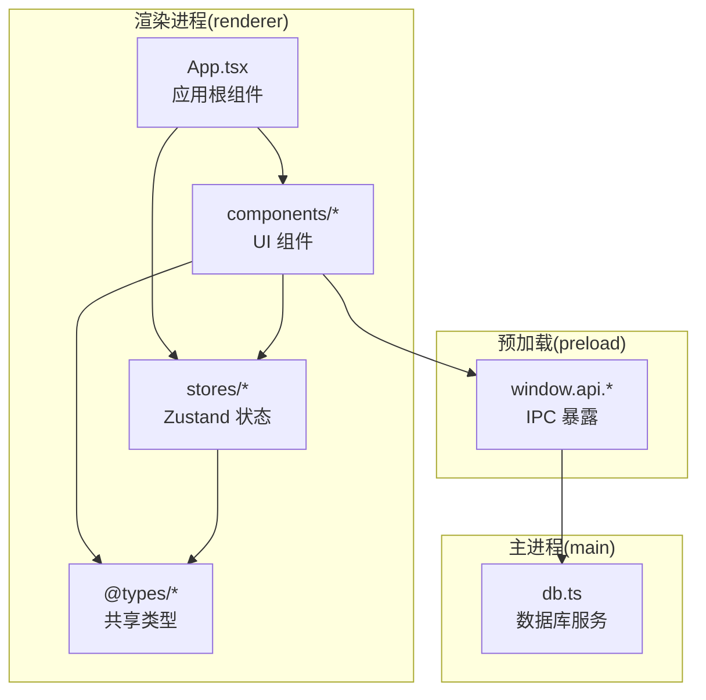
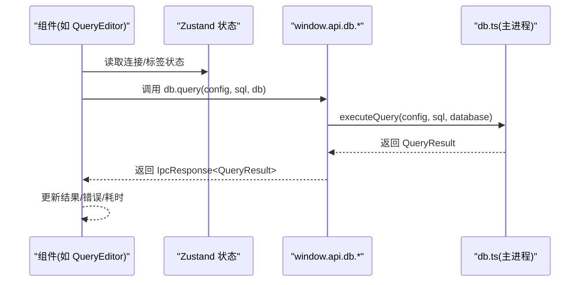
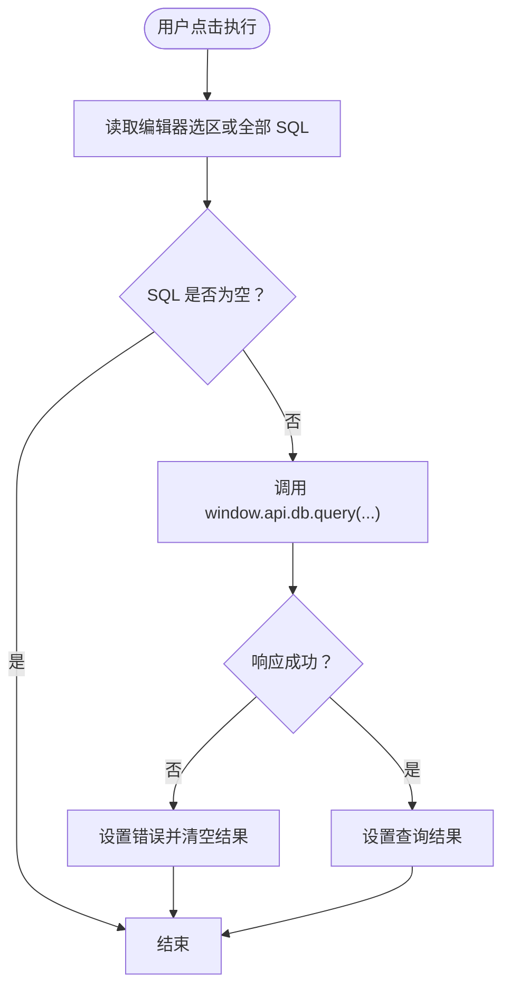
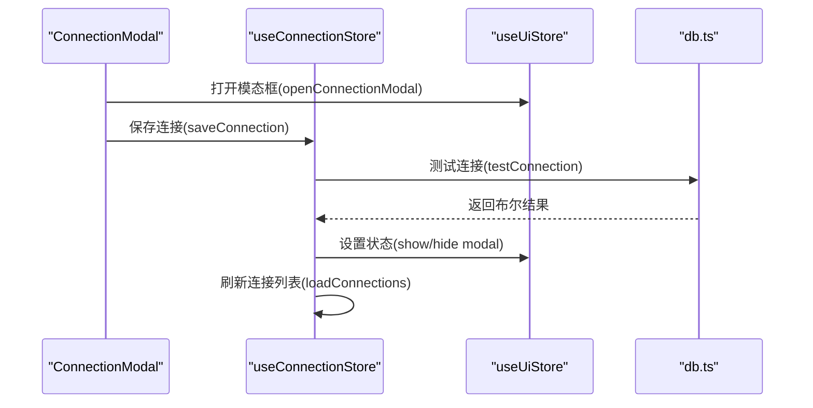

# 编码规范

<cite>
**本文引用的文件**
- [package.json](file://package.json)
- [tsconfig.json](file://tsconfig.json)
- [electron.vite.config.ts](file://electron.vite.config.ts)
- [src/shared/types/index.ts](file://src/shared/types/index.ts)
- [src/renderer/src/App.tsx](file://src/renderer/src/App.tsx)
- [src/renderer/src/stores/connection.ts](file://src/renderer/src/stores/connection.ts)
- [src/renderer/src/stores/tab.ts](file://src/renderer/src/stores/tab.ts)
- [src/renderer/src/stores/ui.ts](file://src/renderer/src/stores/ui.ts)
- [src/renderer/src/components/ConnectionModal.tsx](file://src/renderer/src/components/ConnectionModal.tsx)
- [src/renderer/src/components/QueryEditor.tsx](file://src/renderer/src/components/QueryEditor.tsx)
- [src/renderer/src/components/MainContent.tsx](file://src/renderer/src/components/MainContent.tsx)
- [src/renderer/src/components/DataTable.tsx](file://src/renderer/src/components/DataTable.tsx)
- [src/main/services/db.ts](file://src/main/services/db.ts)
</cite>

## 目录
1. [引言](#引言)
2. [项目结构](#项目结构)
3. [核心组件](#核心组件)
4. [架构总览](#架构总览)
5. [详细组件分析](#详细组件分析)
6. [依赖分析](#依赖分析)
7. [性能考虑](#性能考虑)
8. [故障排查指南](#故障排查指南)
9. [结论](#结论)
10. [附录](#附录)

## 引言
本编码规范面向 nexSql 项目，旨在统一 TypeScript 类型系统与 React 组件开发风格，明确命名约定、文件组织、注释规范以及工具链配置（ESLint、Prettier），并通过具体示例与反例帮助团队高效协作、提升代码质量与可维护性。

## 项目结构
项目采用 Electron-Vite 多端（main/preload/renderer）一体化工程，前端使用 React + Zustand 状态管理，共享类型定义集中于 @shared/types。路径别名在 tsconfig 与 electron-vite 中统一配置，确保跨环境一致性。

图表来源
- [src/renderer/src/App.tsx:1-24](file://src/renderer/src/App.tsx#L1-L24)
- [src/renderer/src/components/QueryEditor.tsx:1-329](file://src/renderer/src/components/QueryEditor.tsx#L1-L329)
- [src/renderer/src/stores/connection.ts:1-64](file://src/renderer/src/stores/connection.ts#L1-L64)
- [src/main/services/db.ts:1-277](file://src/main/services/db.ts#L1-L277)

章节来源
- [tsconfig.json:1-29](file://tsconfig.json#L1-L29)
- [electron.vite.config.ts:1-31](file://electron.vite.config.ts#L1-L31)

## 核心组件
- 类型系统：通过 @shared/types 定义连接、元数据、查询结果、Tab 等核心类型，保证前后端一致的数据契约。
- 状态管理：使用 Zustand 轻量实现连接、标签页、UI 状态，避免 Provider 层级复杂度。
- 组件体系：函数组件 + Hooks，Props 明确、副作用集中在 useEffect/useCallback 中，便于测试与复用。
- 工具链：TypeScript 严格模式、路径别名、React JSX 选项统一；建议补充 ESLint/Prettier 规则以固化格式与质量门禁。

章节来源
- [src/shared/types/index.ts:1-124](file://src/shared/types/index.ts#L1-L124)
- [src/renderer/src/stores/connection.ts:1-64](file://src/renderer/src/stores/connection.ts#L1-L64)
- [src/renderer/src/stores/tab.ts:1-65](file://src/renderer/src/stores/tab.ts#L1-L65)
- [src/renderer/src/stores/ui.ts:1-41](file://src/renderer/src/stores/ui.ts#L1-L41)

## 架构总览
下图展示从 UI 到数据库服务的关键调用链路，体现“渲染层组件 -> Zustand 状态 -> IPC -> 主进程服务”的清晰边界。

图表来源
- [src/renderer/src/components/QueryEditor.tsx:36-64](file://src/renderer/src/components/QueryEditor.tsx#L36-L64)
- [src/main/services/db.ts:73-135](file://src/main/services/db.ts#L73-L135)

## 详细组件分析

### 类型系统与接口设计
- 命名与语义
  - 使用名词短语命名接口（如 ConnectionConfig、TableInfo），避免动词或缩写。
  - 使用字面量联合类型表达有限枚举值（如 ConnectionStatus、TabType），增强编译期安全。
- 可选字段与默认值
  - 对可选字段使用 ? 标记，并在组件/服务侧提供合理默认值或空值处理。
- 泛型与响应封装
  - IpcResponse<T> 封装通用响应结构，统一 success/data/error 字段，便于前端消费。
- 复杂对象拆分
  - 将大对象拆分为子接口（如 TableSchema 含 columns/indexes），提升可读性与可维护性。

章节来源
- [src/shared/types/index.ts:1-124](file://src/shared/types/index.ts#L1-L124)

### React 组件设计原则
- 函数组件与 Hooks
  - 优先使用函数组件与 Hooks，避免类组件；将副作用集中在 useEffect/useCallback/useMemo 中。
  - 将与 UI 无关的纯逻辑抽离为自定义 Hook 或独立模块，保持组件职责单一。
- Props 设计
  - Props 明确、不可变；必要时使用 Partial<Tab> 进行局部更新。
  - 对外暴露的组件应尽量无副作用，通过回调或状态管理解耦。
- 渲染与交互
  - 使用受控组件（controlled components）管理输入状态，减少 DOM 直接触发。
  - 对高频事件（如拖拽、滚动）使用 useCallback 包裹回调，避免重渲染。

章节来源
- [src/renderer/src/App.tsx:1-24](file://src/renderer/src/App.tsx#L1-L24)
- [src/renderer/src/components/QueryEditor.tsx:1-329](file://src/renderer/src/components/QueryEditor.tsx#L1-L329)
- [src/renderer/src/components/DataTable.tsx:1-297](file://src/renderer/src/components/DataTable.tsx#L1-L297)
- [src/renderer/src/components/ConnectionModal.tsx:1-230](file://src/renderer/src/components/ConnectionModal.tsx#L1-L230)

### 状态管理（Zustand）
- 状态切片
  - 按功能划分 store（connection/tab/ui），避免单体 store。
  - 动作（actions）集中在 create 回调内，返回完整状态更新。
- 并发与副作用
  - 异步动作内部先调用 window.api.* 再更新本地状态，保证 UI 与后端一致。
  - 删除连接时同步清理相关映射（statuses/errors/expansions），避免悬挂状态。
- 计算派生
  - 使用 get() 获取当前状态进行计算，避免重复订阅导致的不必要渲染。

章节来源
- [src/renderer/src/stores/connection.ts:1-64](file://src/renderer/src/stores/connection.ts#L1-L64)
- [src/renderer/src/stores/tab.ts:1-65](file://src/renderer/src/stores/tab.ts#L1-L65)
- [src/renderer/src/stores/ui.ts:1-41](file://src/renderer/src/stores/ui.ts#L1-L41)

### 数据库服务（主进程）
- 连接池管理
  - 以连接 id 为键缓存连接池，避免重复创建；支持测试连接与断开。
- 查询执行
  - 统一封装 SELECT/非 SELECT 的结果处理，自动采集耗时与警告信息。
- 元数据查询
  - 提供数据库、表、列、索引、行数等信息查询，统一返回结构化数据。

章节来源
- [src/main/services/db.ts:1-277](file://src/main/services/db.ts#L1-L277)

### 组件与流程图示例

#### 查询执行流程（组件到服务）

图表来源
- [src/renderer/src/components/QueryEditor.tsx:36-64](file://src/renderer/src/components/QueryEditor.tsx#L36-L64)
- [src/main/services/db.ts:73-135](file://src/main/services/db.ts#L73-L135)

#### 连接状态变更（状态到 UI）

图表来源
- [src/renderer/src/components/ConnectionModal.tsx:52-65](file://src/renderer/src/components/ConnectionModal.tsx#L52-L65)
- [src/renderer/src/stores/connection.ts:28-31](file://src/renderer/src/stores/connection.ts#L28-L31)
- [src/main/services/db.ts:38-56](file://src/main/services/db.ts#L38-L56)

## 依赖分析
- 语言与构建
  - TypeScript 严格模式开启，启用 ESNext 模块与 bundler 解析，JSX 使用 react-jsx。
  - electron-vite 配置 main/preload/renderer 三端别名，统一 @main/@shared/@renderer/@components/@stores/@types。
- 运行时依赖
  - React 18、Zustand、Monaco Editor、React Data Grid、Lucide React、mysql2 等。
- 开发依赖
  - Vite、TailwindCSS、PostCSS、Electron、Electron Builder、@vitejs/plugin-react 等。

章节来源
- [package.json:1-42](file://package.json#L1-L42)
- [tsconfig.json:1-29](file://tsconfig.json#L1-L29)
- [electron.vite.config.ts:1-31](file://electron.vite.config.ts#L1-L31)

## 性能考虑
- 渲染优化
  - 使用 useMemo/useCallback 缓存昂贵计算与回调，避免不必要的重渲染。
  - 列表渲染使用稳定 key，减少节点重建。
- 网络与数据库
  - 连接池复用与 ping 校验，避免频繁创建连接。
  - 分页查询（如 DataTable）限制单页大小，降低内存占用。
- 事件与监听
  - 组件卸载时移除全局事件监听，防止内存泄漏。

## 故障排查指南
- 类型错误
  - 若出现类型不匹配，检查 @shared/types 中接口定义是否与实际数据一致。
- 状态异常
  - 删除连接后 UI 仍显示旧状态，确认是否同步清理 statuses/errors/expansions。
- 查询失败
  - 检查 window.api.db.query 返回的 error 字段，定位 SQL 语法或权限问题。
- 连接测试
  - 使用 testConnection 快速验证主机、端口、账号、密码与超时设置。

章节来源
- [src/renderer/src/stores/connection.ts:33-44](file://src/renderer/src/stores/connection.ts#L33-L44)
- [src/renderer/src/components/QueryEditor.tsx:60-63](file://src/renderer/src/components/QueryEditor.tsx#L60-L63)
- [src/main/services/db.ts:38-56](file://src/main/services/db.ts#L38-L56)

## 结论
本规范基于现有代码库提炼出 TypeScript 类型设计、React 组件与 Hooks 使用、Zustand 状态组织、主进程服务封装等最佳实践。建议后续补充 ESLint/Prettier 规则，形成完整的质量保障闭环。

## 附录

### 命名约定
- 文件与目录
  - 组件文件使用帕斯卡命名（如 ConnectionModal.tsx），常量与类型使用大驼峰（如 ConnectionConfig）。
- 类型与接口
  - 接口以名词短语命名（如 ConnectionInfo），枚举型联合使用字面量（如 'query' | 'table-data'）。
- 变量与函数
  - 变量使用小驼峰，函数以动词开头（如 loadConnections、executeQuery）。
- 路径别名
  - 使用 @main/@shared/@renderer/@components/@stores/@types 统一导入路径。

章节来源
- [src/shared/types/index.ts:1-124](file://src/shared/types/index.ts#L1-L124)
- [tsconfig.json:14-21](file://tsconfig.json#L14-L21)
- [electron.vite.config.ts:8-26](file://electron.vite.config.ts#L8-L26)

### 文件组织结构
- src/main：主进程业务（数据库服务）
- src/preload：IPC 暴露层
- src/renderer/src：渲染进程
  - components：UI 组件
  - stores：Zustand 状态
  - App.tsx、index.css、main.tsx：入口与样式
- src/shared/types：共享类型定义

章节来源
- [src/main/services/db.ts:1-277](file://src/main/services/db.ts#L1-L277)
- [src/renderer/src/App.tsx:1-24](file://src/renderer/src/App.tsx#L1-L24)
- [src/renderer/src/stores/connection.ts:1-64](file://src/renderer/src/stores/connection.ts#L1-L64)
- [src/shared/types/index.ts:1-124](file://src/shared/types/index.ts#L1-L124)

### 注释规范
- 接口与类型
  - 对关键字段添加简要说明，尤其是枚举值与可选字段。
- 函数与方法
  - 对入参、返回值与异常场景进行注释；复杂逻辑分步骤注释。
- 组件
  - 对 Props、事件回调与副作用进行注释；对外暴露的组件需说明使用场景。

### 工具链配置建议（ESLint 与 Prettier）
- ESLint
  - 推荐规则族：@typescript-eslint、eslint-plugin-react-hooks、eslint-plugin-import
  - 关键规则：no-unused-vars、prefer-const、no-undef、react-hooks/rules-of-hooks、import/order
- Prettier
  - 半角制表符宽度 2，行尾无分号，单引号，尾随逗号仅函数参数
- 提交前钩子
  - 使用 lint-staged + husky 在提交前自动格式化与静态检查

[本节为通用实践建议，不直接分析具体文件，故无章节来源]