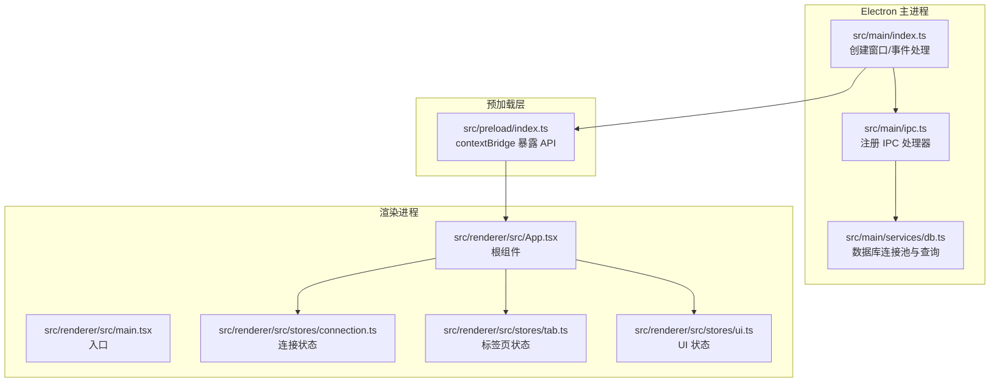
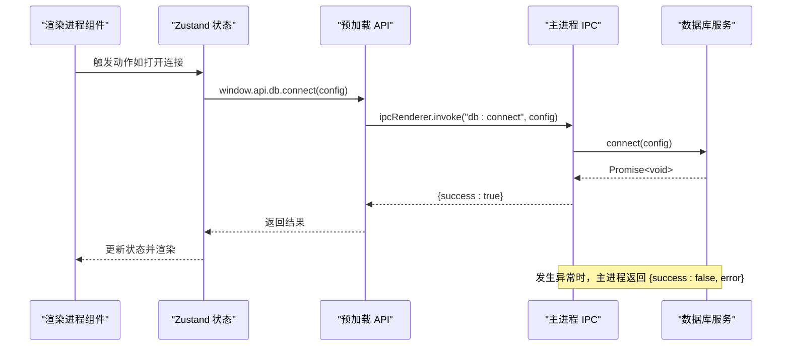
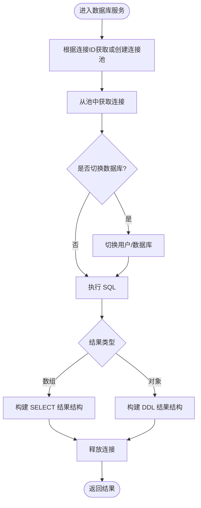
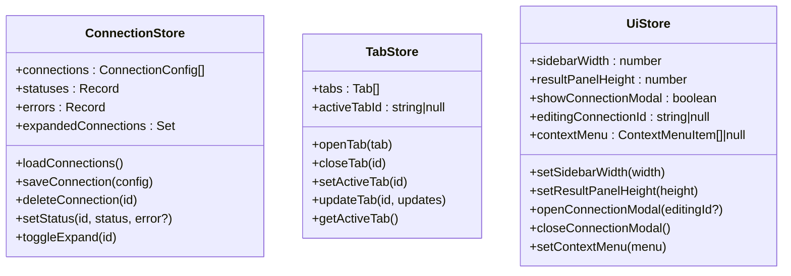
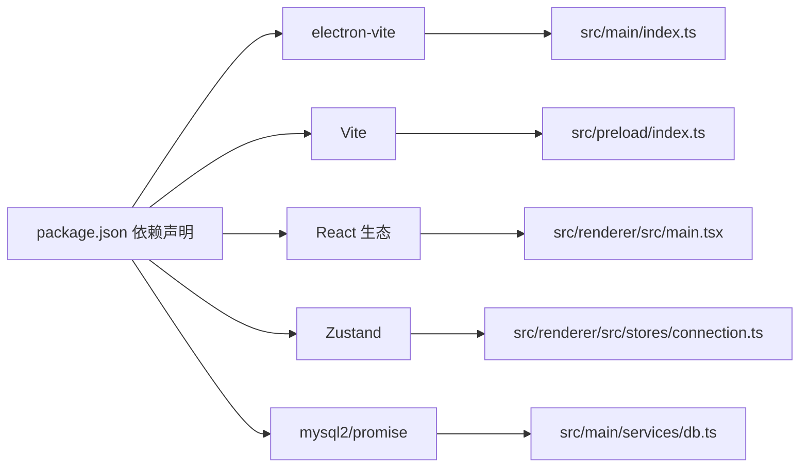

# 调试与测试

<cite>
**本文引用的文件**
- [package.json](file://package.json)
- [electron.vite.config.ts](file://electron.vite.config.ts)
- [src/main/index.ts](file://src/main/index.ts)
- [src/main/ipc.ts](file://src/main/ipc.ts)
- [src/preload/index.ts](file://src/preload/index.ts)
- [src/main/services/db.ts](file://src/main/services/db.ts)
- [src/renderer/src/main.tsx](file://src/renderer/src/main.tsx)
- [src/renderer/src/App.tsx](file://src/renderer/src/App.tsx)
- [src/renderer/src/stores/connection.ts](file://src/renderer/src/stores/connection.ts)
- [src/renderer/src/stores/tab.ts](file://src/renderer/src/stores/tab.ts)
- [src/renderer/src/stores/ui.ts](file://src/renderer/src/stores/ui.ts)
- [src/shared/types/index.ts](file://src/shared/types/index.ts)
</cite>

## 目录
1. [简介](#简介)
2. [项目结构](#项目结构)
3. [核心组件](#核心组件)
4. [架构总览](#架构总览)
5. [详细组件分析](#详细组件分析)
6. [依赖分析](#依赖分析)
7. [性能考虑](#性能考虑)
8. [故障排除指南](#故障排除指南)
9. [结论](#结论)
10. [附录](#附录)

## 简介
本指南面向 nexSql 项目的开发者与测试工程师，系统性地阐述如何在 Electron 应用中进行调试与测试，覆盖主进程、渲染进程、IPC 通道、数据库服务层以及前端状态管理与组件层。文档同时给出 React DevTools 与状态管理调试建议、单元测试与集成测试的编写思路（基于现有技术栈），以及端到端测试策略与常见问题排查方法。

## 项目结构
项目采用 Electron-Vite 架构，主进程负责窗口生命周期与 IPC 注册，预加载脚本通过 contextBridge 暴露受限 API 至渲染进程，渲染进程基于 React + Zustand 实现 UI 与状态管理，数据库操作由主进程内的服务模块封装并经 IPC 提供给前端调用。

**图示来源**
- [src/main/index.ts:1-64](file://src/main/index.ts#L1-L64)
- [src/main/ipc.ts:1-132](file://src/main/ipc.ts#L1-L132)
- [src/preload/index.ts:1-60](file://src/preload/index.ts#L1-L60)
- [src/renderer/src/main.tsx:1-11](file://src/renderer/src/main.tsx#L1-L11)
- [src/renderer/src/App.tsx:1-24](file://src/renderer/src/App.tsx#L1-L24)
- [src/renderer/src/stores/connection.ts:1-64](file://src/renderer/src/stores/connection.ts#L1-L64)
- [src/renderer/src/stores/tab.ts:1-65](file://src/renderer/src/stores/tab.ts#L1-L65)
- [src/renderer/src/stores/ui.ts:1-41](file://src/renderer/src/stores/ui.ts#L1-L41)

**章节来源**
- [package.json:1-42](file://package.json#L1-L42)
- [electron.vite.config.ts:1-31](file://electron.vite.config.ts#L1-L31)
- [src/main/index.ts:1-64](file://src/main/index.ts#L1-L64)
- [src/main/ipc.ts:1-132](file://src/main/ipc.ts#L1-L132)
- [src/preload/index.ts:1-60](file://src/preload/index.ts#L1-L60)
- [src/renderer/src/main.tsx:1-11](file://src/renderer/src/main.tsx#L1-L11)
- [src/renderer/src/App.tsx:1-24](file://src/renderer/src/App.tsx#L1-L24)
- [src/renderer/src/stores/connection.ts:1-64](file://src/renderer/src/stores/connection.ts#L1-L64)
- [src/renderer/src/stores/tab.ts:1-65](file://src/renderer/src/stores/tab.ts#L1-L65)
- [src/renderer/src/stores/ui.ts:1-41](file://src/renderer/src/stores/ui.ts#L1-L41)

## 核心组件
- 主进程入口：负责创建 BrowserWindow、设置 webPreferences、注册 IPC、处理应用生命周期事件，并在退出前断开所有数据库连接。
- 预加载脚本：通过 contextBridge 将受控 API 暴露至渲染进程，统一通过 ipcRenderer.invoke 调用主进程能力。
- IPC 处理器：集中注册配置与数据库相关 IPC 方法，返回标准化 IpcResponse 结构，便于前端消费。
- 数据库服务：以连接池管理多连接，提供连通性测试、连接、断开、查询与元数据读取等能力。
- 渲染进程：React 应用入口，Zustand 状态管理（连接、标签页、UI），组件按功能拆分。

**章节来源**
- [src/main/index.ts:1-64](file://src/main/index.ts#L1-L64)
- [src/preload/index.ts:1-60](file://src/preload/index.ts#L1-L60)
- [src/main/ipc.ts:1-132](file://src/main/ipc.ts#L1-L132)
- [src/main/services/db.ts:1-277](file://src/main/services/db.ts#L1-L277)
- [src/renderer/src/main.tsx:1-11](file://src/renderer/src/main.tsx#L1-L11)
- [src/renderer/src/stores/connection.ts:1-64](file://src/renderer/src/stores/connection.ts#L1-L64)
- [src/renderer/src/stores/tab.ts:1-65](file://src/renderer/src/stores/tab.ts#L1-L65)
- [src/renderer/src/stores/ui.ts:1-41](file://src/renderer/src/stores/ui.ts#L1-L41)

## 架构总览
下图展示从渲染进程发起请求到数据库执行的完整链路，以及错误返回路径。

**图示来源**
- [src/renderer/src/stores/connection.ts:23-31](file://src/renderer/src/stores/connection.ts#L23-L31)
- [src/preload/index.ts:26-32](file://src/preload/index.ts#L26-L32)
- [src/main/ipc.ts:56-63](file://src/main/ipc.ts#L56-L63)
- [src/main/services/db.ts:58-63](file://src/main/services/db.ts#L58-L63)

## 详细组件分析

### 主进程调试要点
- 启动参数与环境变量
  - 使用开发模式启动时，主进程会读取环境变量中的渲染地址；生产模式则加载打包后的 HTML。可结合脚本与环境变量进行本地联调。
- 窗口与安全策略
  - webPreferences 中启用了上下文隔离，禁用 Node 集成，合理设置 preload 路径，避免在非隔离环境下直接挂载 API。
- 生命周期与资源回收
  - 在 before-quit 事件中主动断开所有数据库连接，防止进程退出时资源泄漏。

**章节来源**
- [src/main/index.ts:8-41](file://src/main/index.ts#L8-L41)
- [src/main/index.ts:61-63](file://src/main/index.ts#L61-L63)

### 预加载与 IPC 调试要点
- API 暴露与调用
  - 预加载层通过 contextBridge 将有限 API 暴露到 window，渲染侧统一使用 ipcRenderer.invoke 调用主进程处理器。
- IPC 响应格式
  - 所有 IPC 返回值遵循 IpcResponse 结构，前端据此判断成功/失败与错误信息，便于统一处理与调试。

**章节来源**
- [src/preload/index.ts:14-48](file://src/preload/index.ts#L14-L48)
- [src/main/ipc.ts:19-43](file://src/main/ipc.ts#L19-L43)
- [src/shared/types/index.ts:104-108](file://src/shared/types/index.ts#L104-L108)

### 数据库服务调试要点
- 连接池管理
  - 以连接 ID 作为键缓存连接池，避免重复创建；提供测试连接、连通性验证、断开与批量断开能力。
- 查询与元数据
  - 支持 SELECT/DDL 统一返回结构，包含列定义、行数据、影响行数、耗时与警告信息；元数据接口返回数据库、表、列、索引等信息。
- 错误处理
  - 所有异步操作均在 try/finally 中确保连接释放，避免连接泄漏。

**图示来源**
- [src/main/services/db.ts:30-135](file://src/main/services/db.ts#L30-L135)

**章节来源**
- [src/main/services/db.ts:1-277](file://src/main/services/db.ts#L1-L277)

### 渲染进程与状态管理调试要点
- 入口与根组件
  - React 应用在 main.tsx 中挂载，App 组件在初始化时拉取连接配置并驱动 UI。
- 状态模型
  - 连接状态：维护连接列表、连接状态与错误、展开节点集合。
  - 标签页状态：打开/关闭标签、激活标签、更新标签信息与获取当前活动标签。
  - UI 状态：侧边栏宽度、结果面板高度、连接弹窗显示与上下文菜单。

**图示来源**
- [src/renderer/src/stores/connection.ts:17-63](file://src/renderer/src/stores/connection.ts#L17-L63)
- [src/renderer/src/stores/tab.ts:15-64](file://src/renderer/src/stores/tab.ts#L15-L64)
- [src/renderer/src/stores/ui.ts:26-40](file://src/renderer/src/stores/ui.ts#L26-L40)

**章节来源**
- [src/renderer/src/main.tsx:1-11](file://src/renderer/src/main.tsx#L1-L11)
- [src/renderer/src/App.tsx:1-24](file://src/renderer/src/App.tsx#L1-L24)
- [src/renderer/src/stores/connection.ts:1-64](file://src/renderer/src/stores/connection.ts#L1-L64)
- [src/renderer/src/stores/tab.ts:1-65](file://src/renderer/src/stores/tab.ts#L1-L65)
- [src/renderer/src/stores/ui.ts:1-41](file://src/renderer/src/stores/ui.ts#L1-L41)

## 依赖分析
- 技术栈与工具链
  - 构建：electron-vite、Vite、React 插件
  - 运行时：Electron、React、Zustand
  - 数据库：mysql2/promise
  - 工具：TailwindCSS、PostCSS、TypeScript
- 关键依赖关系
  - 主进程依赖 IPC 处理器与数据库服务；预加载依赖共享类型；渲染进程依赖状态与组件。

**图示来源**
- [package.json:16-40](file://package.json#L16-L40)
- [electron.vite.config.ts:1-31](file://electron.vite.config.ts#L1-31)
- [src/main/index.ts:1-64](file://src/main/index.ts#L1-L64)
- [src/preload/index.ts:1-60](file://src/preload/index.ts#L1-L60)
- [src/renderer/src/main.tsx:1-11](file://src/renderer/src/main.tsx#L1-L11)
- [src/renderer/src/stores/connection.ts:1-64](file://src/renderer/src/stores/connection.ts#L1-L64)
- [src/main/services/db.ts:1-277](file://src/main/services/db.ts#L1-L277)

**章节来源**
- [package.json:1-42](file://package.json#L1-L42)
- [electron.vite.config.ts:1-31](file://electron.vite.config.ts#L1-L31)

## 性能考虑
- 连接池与超时
  - 数据库连接池限制并发，设置合理的连接超时与 keep-alive，避免长时间占用连接导致阻塞。
- 查询耗时统计
  - 查询执行前后记录时间戳，返回结果中包含耗时字段，可用于前端性能展示与日志追踪。
- UI 响应
  - 避免在渲染进程中执行重逻辑，尽量通过 IPC 异步调用主进程处理，保证界面流畅。

**章节来源**
- [src/main/services/db.ts:18-25](file://src/main/services/db.ts#L18-L25)
- [src/main/services/db.ts:86-88](file://src/main/services/db.ts#L86-L88)
- [src/main/services/db.ts:104](file://src/main/services/db.ts#L104)

## 故障排除指南
- 主进程无法打开窗口或白屏
  - 检查 webPreferences 的 preload 路径与 contextIsolation 设置；确认开发/生产两种加载方式的 URL 或 HTML 文件存在。
- 预加载 API 未生效
  - 确认 contextBridge 成功暴露 API；在非隔离环境下会降级挂载到 window，需检查运行环境。
- IPC 调用无响应
  - 核对 ipcRenderer.invoke 的通道名与主进程 ipcMain.handle 是否一致；检查返回的 IpcResponse.success 字段。
- 数据库连接失败
  - 使用 testConnection 快速验证连通性；检查主机、端口、账号密码与超时设置；关注断开与释放逻辑。
- 应用退出后连接未释放
  - 确认 before-quit 事件已触发并调用断开所有连接的方法。

**章节来源**
- [src/main/index.ts:18-24](file://src/main/index.ts#L18-L24)
- [src/preload/index.ts:50-59](file://src/preload/index.ts#L50-L59)
- [src/main/ipc.ts:47-54](file://src/main/ipc.ts#L47-L54)
- [src/main/services/db.ts:38-56](file://src/main/services/db.ts#L38-L56)
- [src/main/index.ts:61-63](file://src/main/index.ts#L61-L63)

## 结论
本指南提供了从架构到实现细节的调试与测试实践路径。通过明确主/渲染进程职责、规范 IPC 交互与返回结构、利用连接池与状态管理提升稳定性与可观测性，可在保证用户体验的同时快速定位问题并迭代优化。

## 附录

### Electron 调试方法（主进程与渲染进程）
- 主进程
  - 使用 electron-vite 提供的开发模式启动，配合断点在主进程源码处设置；注意 webPreferences 的上下文隔离与 Node 集成开关。
- 渲染进程
  - 在浏览器开发者工具中启用“允许远程调试”（DevTools），在渲染进程中打断点；对于 React 18 的 StrictMode，注意组件重复渲染的影响。
- 预加载与主进程通信
  - 利用 DevTools 的 Network/Console 面板观察 IPC 请求与响应；核对通道名与返回结构。

**章节来源**
- [electron.vite.config.ts:5-29](file://electron.vite.config.ts#L5-L29)
- [src/main/index.ts:18-24](file://src/main/index.ts#L18-L24)
- [src/preload/index.ts:14-48](file://src/preload/index.ts#L14-L48)

### React DevTools 与状态管理调试
- React DevTools
  - 安装浏览器扩展后，在渲染进程页面打开 DevTools，查看组件树、Props 与 State；结合 StrictMode 定位副作用与重复渲染问题。
- Zustand 状态
  - 可在控制台打印 store 状态快照，或在关键动作前后输出变更；结合 UI 层组件订阅，确认状态同步是否正确。

**章节来源**
- [src/renderer/src/stores/connection.ts:17-63](file://src/renderer/src/stores/connection.ts#L17-L63)
- [src/renderer/src/stores/tab.ts:15-64](file://src/renderer/src/stores/tab.ts#L15-L64)
- [src/renderer/src/stores/ui.ts:26-40](file://src/renderer/src/stores/ui.ts#L26-L40)

### 单元测试与集成测试（编写指南）
- 测试框架选择
  - 基于现有 React/Vite 技术栈，可采用 Vitest（与 Vite 集成度高）或 Jest；组件测试推荐 React Testing Library。
- 测试范围
  - 单元：纯函数、状态选择器、工具函数；集成：IPC 通道模拟、Zustand store 行为、数据库服务方法（可注入 mock 连接池）。
- 配置要点
  - 路径别名：确保与 electron-vite 配置一致（@renderer、@stores、@components、@shared）。
  - 环境：Node 环境即可运行单元测试；如需 DOM，请引入 jsdom 或使用 Testing Library 默认环境。
  - Mock：对 IPC 调用进行 mock，避免真实主进程参与；对数据库服务可注入内存池或 stub。

**章节来源**
- [electron.vite.config.ts:19-26](file://electron.vite.config.ts#L19-L26)
- [src/shared/types/index.ts:1-124](file://src/shared/types/index.ts#L1-L124)

### 端到端测试策略与工具
- 策略
  - 覆盖关键业务流程：新建连接、连接测试、查询执行、标签页切换、断开连接与退出清理。
- 工具
  - Playwright/Cypress：支持原生 Electron 应用或通过特殊配置运行；必要时可使用 Spectron（Electron 专用）。
- 注意事项
  - 避免真实数据库依赖，使用内存数据库或测试实例；对 IPC 通道进行桩/替身，确保可重复性与隔离性。

[本节为通用策略说明，不直接分析具体文件]

### 测试覆盖率与持续集成
- 覆盖率目标建议
  - 关键业务函数（数据库服务、状态管理动作）达到较高覆盖率；组件层至少覆盖主要分支与错误路径。
- CI 集成
  - 在 CI 中执行：安装依赖 → 构建 → 单元测试（含覆盖率）→ E2E 测试（可选）→ 打包构建（可选）。
  - 对于数据库相关测试，确保 CI 环境具备可用的测试数据库实例或容器化依赖。

[本节为通用指导，不直接分析具体文件]