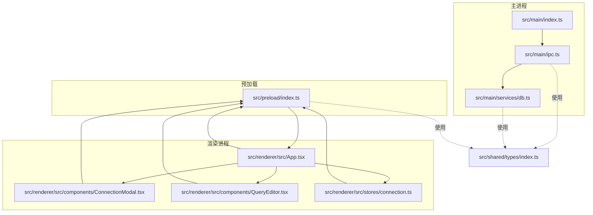
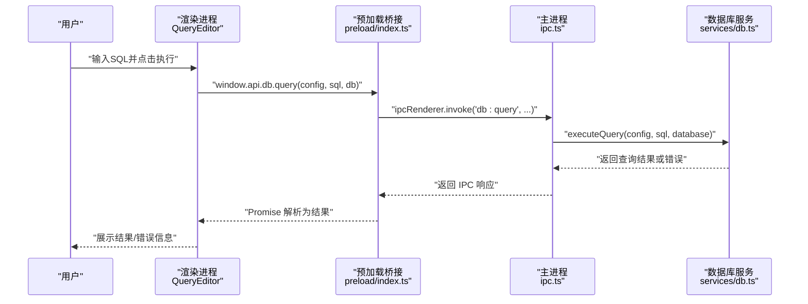
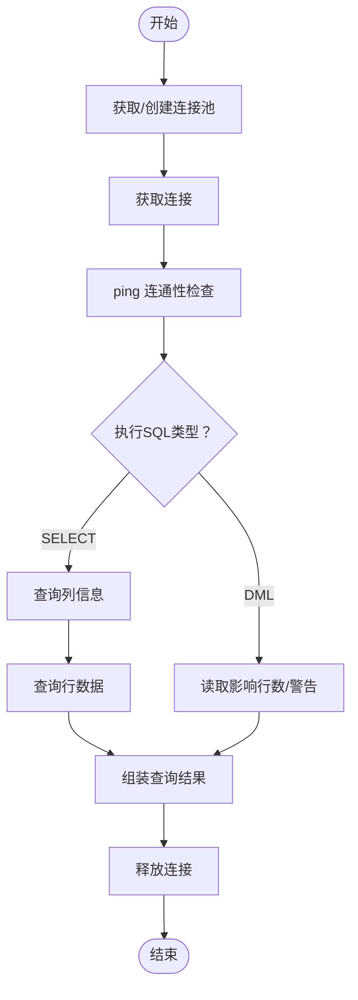
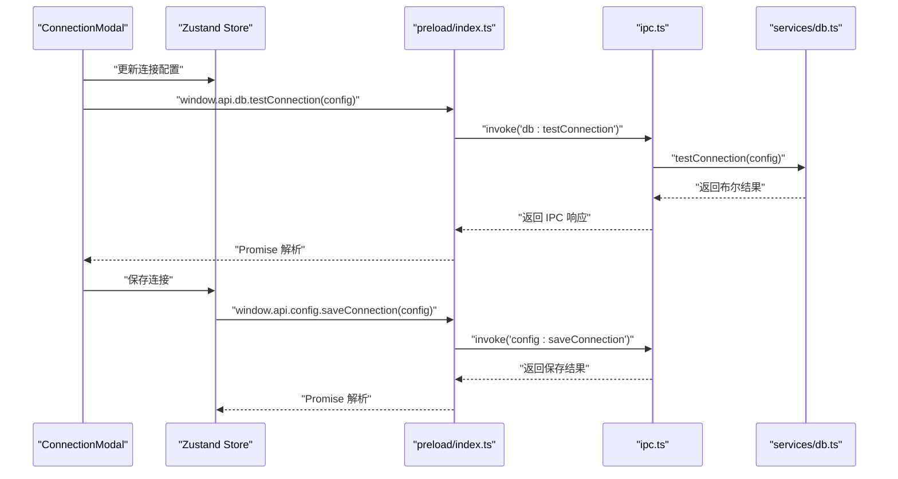
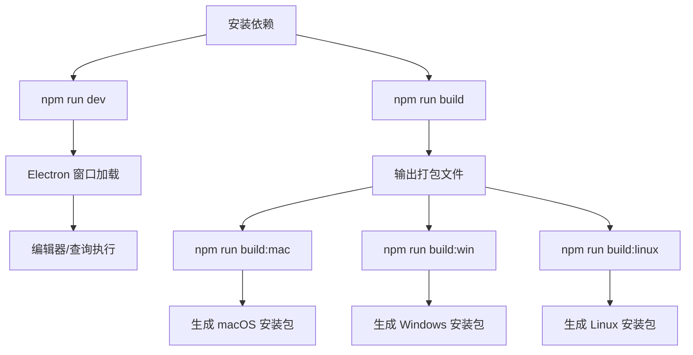

# 快速开始

<cite>
**本文引用的文件**
- [package.json](file://package.json)
- [electron.vite.config.ts](file://electron.vite.config.ts)
- [src/main/index.ts](file://src/main/index.ts)
- [src/main/ipc.ts](file://src/main/ipc.ts)
- [src/main/services/db.ts](file://src/main/services/db.ts)
- [src/preload/index.ts](file://src/preload/index.ts)
- [src/renderer/src/App.tsx](file://src/renderer/src/App.tsx)
- [src/renderer/src/components/ConnectionModal.tsx](file://src/renderer/src/components/ConnectionModal.tsx)
- [src/renderer/src/components/QueryEditor.tsx](file://src/renderer/src/components/QueryEditor.tsx)
- [src/renderer/src/stores/connection.ts](file://src/renderer/src/stores/connection.ts)
- [src/shared/types/index.ts](file://src/shared/types/index.ts)
- [tsconfig.json](file://tsconfig.json)
- [tailwind.config.js](file://tailwind.config.js)
- [postcss.config.js](file://postcss.config.js)
- [electron-builder.yml](file://electron-builder.yml)
</cite>

## 目录
1. [简介](#简介)
2. [项目结构](#项目结构)
3. [核心组件](#核心组件)
4. [架构总览](#架构总览)
5. [详细组件分析](#详细组件分析)
6. [依赖与环境要求](#依赖与环境要求)
7. [开发与构建流程](#开发与构建流程)
8. [首次使用示例](#首次使用示例)
9. [常见问题排查](#常见问题排查)
10. [性能与优化建议](#性能与优化建议)
11. [结语](#结语)

## 简介
nexSql 是一款基于 Electron + React + TypeScript 的桌面数据库管理工具，支持 MySQL 数据库连接、可视化查询、结果展示与导出等功能。本文面向初学者，提供从环境准备到首次使用的完整指南，并覆盖开发、构建与常见问题排查。

## 项目结构
项目采用 Electron-Vite 多入口架构，分为主进程、预加载脚本与渲染进程三部分，配合共享类型与状态管理实现跨进程通信与数据库操作。

**图示来源**
- [src/main/index.ts:1-64](file://src/main/index.ts#L1-L64)
- [src/main/ipc.ts:1-132](file://src/main/ipc.ts#L1-L132)
- [src/main/services/db.ts:1-277](file://src/main/services/db.ts#L1-L277)
- [src/preload/index.ts:1-60](file://src/preload/index.ts#L1-L60)
- [src/renderer/src/App.tsx:1-24](file://src/renderer/src/App.tsx#L1-L24)
- [src/renderer/src/components/ConnectionModal.tsx:1-230](file://src/renderer/src/components/ConnectionModal.tsx#L1-L230)
- [src/renderer/src/components/QueryEditor.tsx:1-329](file://src/renderer/src/components/QueryEditor.tsx#L1-L329)
- [src/renderer/src/stores/connection.ts:1-64](file://src/renderer/src/stores/connection.ts#L1-L64)
- [src/shared/types/index.ts:1-124](file://src/shared/types/index.ts#L1-L124)

**章节来源**
- [package.json:1-42](file://package.json#L1-L42)
- [electron.vite.config.ts:1-31](file://electron.vite.config.ts#L1-L31)
- [tsconfig.json:1-29](file://tsconfig.json#L1-L29)

## 核心组件
- 主进程窗口与生命周期控制：负责创建 BrowserWindow、加载开发或打包资源、处理退出前清理。
- IPC 通道：在主进程注册配置与数据库相关 IPC 处理函数，供渲染进程调用。
- 数据库服务：封装 mysql2 连接池、连接测试、查询执行、元数据获取等能力。
- 预加载桥接：通过 contextBridge 暴露受控 API 到渲染进程，统一调用 IPC。
- 渲染侧应用：App 组件组织侧边栏、主内容区、连接弹窗与上下文菜单；QueryEditor 提供 SQL 编辑与结果展示；ConnectionModal 负责连接配置与测试。
- 状态管理：Zustand 管理连接列表、连接状态与 UI 尺寸等。

**章节来源**
- [src/main/index.ts:1-64](file://src/main/index.ts#L1-L64)
- [src/main/ipc.ts:1-132](file://src/main/ipc.ts#L1-L132)
- [src/main/services/db.ts:1-277](file://src/main/services/db.ts#L1-L277)
- [src/preload/index.ts:1-60](file://src/preload/index.ts#L1-L60)
- [src/renderer/src/App.tsx:1-24](file://src/renderer/src/App.tsx#L1-L24)
- [src/renderer/src/components/ConnectionModal.tsx:1-230](file://src/renderer/src/components/ConnectionModal.tsx#L1-L230)
- [src/renderer/src/components/QueryEditor.tsx:1-329](file://src/renderer/src/components/QueryEditor.tsx#L1-L329)
- [src/renderer/src/stores/connection.ts:1-64](file://src/renderer/src/stores/connection.ts#L1-L64)

## 架构总览
下图展示了从用户操作到数据库查询的端到端流程，包括渲染进程调用、预加载桥接、主进程 IPC 处理以及数据库服务执行。

**图示来源**
- [src/renderer/src/components/QueryEditor.tsx:36-64](file://src/renderer/src/components/QueryEditor.tsx#L36-L64)
- [src/preload/index.ts:25-45](file://src/preload/index.ts#L25-L45)
- [src/main/ipc.ts:74-81](file://src/main/ipc.ts#L74-L81)
- [src/main/services/db.ts:73-135](file://src/main/services/db.ts#L73-L135)

## 详细组件分析

### 数据库连接与查询执行
- 连接池管理：按连接配置生成唯一键，复用连接池，避免重复建立连接。
- 连接测试：临时连接验证连通性与鉴权。
- 查询执行：区分 SELECT 与 DML，分别返回列信息/行数据或影响行数/警告等。
- 元数据查询：支持获取数据库、表、列、索引及行数等信息。

**图示来源**
- [src/main/services/db.ts:38-135](file://src/main/services/db.ts#L38-L135)

**章节来源**
- [src/main/services/db.ts:1-277](file://src/main/services/db.ts#L1-L277)

### 渲染侧连接与查询工作流
- 连接弹窗：收集连接参数、颜色标签，支持测试连接与保存。
- 查询编辑器：支持快捷键执行、选择区域执行、结果面板拖拽、CSV 导出与错误展示。
- 状态管理：集中维护连接列表、连接状态与 UI 尺寸。

**图示来源**
- [src/renderer/src/components/ConnectionModal.tsx:44-65](file://src/renderer/src/components/ConnectionModal.tsx#L44-L65)
- [src/renderer/src/stores/connection.ts:28-31](file://src/renderer/src/stores/connection.ts#L28-L31)
- [src/preload/index.ts:25-45](file://src/preload/index.ts#L25-L45)
- [src/main/ipc.ts:47-54](file://src/main/ipc.ts#L47-L54)
- [src/main/services/db.ts:38-56](file://src/main/services/db.ts#L38-L56)

**章节来源**
- [src/renderer/src/components/ConnectionModal.tsx:1-230](file://src/renderer/src/components/ConnectionModal.tsx#L1-L230)
- [src/renderer/src/stores/connection.ts:1-64](file://src/renderer/src/stores/connection.ts#L1-L64)
- [src/renderer/src/components/QueryEditor.tsx:1-329](file://src/renderer/src/components/QueryEditor.tsx#L1-L329)

## 依赖与环境要求
- Node.js 与包管理器
  - 使用 npm（package.json 中定义了脚本与依赖）。
  - 建议使用 Node.js LTS 版本以获得最佳稳定性。
- 操作系统
  - 项目为 Electron 应用，可在 Windows、macOS、Linux 上运行。
  - 构建产物支持 dmg/zip（macOS）、nsis/zip（Windows）、AppImage/deb（Linux）。
- 数据库驱动
  - 使用 mysql2/promise 作为 MySQL 客户端，需确保目标数据库可访问且版本兼容。
- 构建与开发工具
  - Vite + React（渲染进程）
  - Electron-Vite（多入口配置）
  - TailwindCSS + PostCSS（样式）

**章节来源**
- [package.json:16-40](file://package.json#L16-L40)
- [electron-builder.yml:15-33](file://electron-builder.yml#L15-L33)
- [tailwind.config.js:1-38](file://tailwind.config.js#L1-L38)
- [postcss.config.js:1-7](file://postcss.config.js#L1-L7)
- [electron.vite.config.ts:1-31](file://electron.vite.config.ts#L1-L31)

## 开发与构建流程
- 安装依赖
  - 在项目根目录执行安装命令（推荐使用 npm）。
- 启动开发服务器
  - 运行开发脚本，Electron-Vite 会启动主进程与渲染进程热更新。
- 运行项目
  - 开发模式下，主进程会优先加载开发服务器地址；生产模式加载打包后的 HTML。
- 生产构建
  - 使用构建脚本生成打包产物；可进一步使用 electron-builder 产出平台安装包。
- 常见命令
  - dev：启动开发服务器
  - build：构建渲染与主进程
  - preview：预览生产构建
  - build:mac / build:win / build:linux：分别构建对应平台安装包

**图示来源**
- [package.json:8-14](file://package.json#L8-L14)
- [src/main/index.ts:35-40](file://src/main/index.ts#L35-L40)
- [electron-builder.yml:15-33](file://electron-builder.yml#L15-L33)

**章节来源**
- [package.json:8-14](file://package.json#L8-L14)
- [src/main/index.ts:35-40](file://src/main/index.ts#L35-L40)
- [electron-builder.yml:1-34](file://electron-builder.yml#L1-L34)

## 首次使用示例
- 创建第一个数据库连接
  - 打开连接弹窗，填写连接名称、主机、端口、用户名、密码等必要字段，点击“测试连接”确认连通性，再点击“保存”。
  - 保存后连接会出现在侧边栏，可展开查看数据库树。
- 执行简单查询
  - 新建查询标签页，在编辑器中输入 SQL（如查询某张表的前几行），使用快捷键或按钮执行，查看结果面板与耗时统计。
  - 支持选择区域执行、结果导出为 CSV、拖拽调整结果面板高度。

**章节来源**
- [src/renderer/src/components/ConnectionModal.tsx:44-65](file://src/renderer/src/components/ConnectionModal.tsx#L44-L65)
- [src/renderer/src/components/QueryEditor.tsx:36-64](file://src/renderer/src/components/QueryEditor.tsx#L36-L64)
- [src/renderer/src/App.tsx:8-23](file://src/renderer/src/App.tsx#L8-L23)

## 常见问题排查
- 端口冲突或无法访问数据库
  - 检查数据库监听地址与防火墙设置；确认连接弹窗中的主机与端口正确。
  - 使用“测试连接”功能快速定位网络/认证问题。
- 权限不足或认证失败
  - 确认用户名与密码正确；若启用 SSH/SSL，请在连接配置中按需开启相应选项。
- 构建失败或平台安装包异常
  - 确保已安装对应平台的构建依赖；参考构建脚本与 electron-builder 配置。
- 开发时页面空白或资源加载失败
  - 确认开发服务器已启动且未被代理/安全策略拦截；检查主进程是否加载开发 URL 或打包 HTML。
- 退出时连接未释放
  - 应用退出前会尝试断开所有连接；若出现异常，可手动断开或重启应用。

**章节来源**
- [src/main/ipc.ts:65-72](file://src/main/ipc.ts#L65-L72)
- [src/main/index.ts:61-63](file://src/main/index.ts#L61-L63)
- [src/main/services/db.ts:271-277](file://src/main/services/db.ts#L271-L277)

## 性能与优化建议
- 连接池参数
  - 合理设置连接池大小与超时时间，避免过多并发导致数据库压力过大。
- 查询优化
  - 对大数据量查询添加 LIMIT；避免一次性导出超大结果集。
- UI 交互
  - 结果面板支持拖拽调整高度，合理利用空间；仅在需要时显示结果，减少 DOM 渲染压力。
- 构建优化
  - 使用 electron-builder 的 asar 与目标平台产物，减小体积并提升启动速度。

[本节为通用建议，不涉及具体文件分析]

## 结语
通过以上步骤，你可以在本地完成环境准备、安装依赖、启动开发服务器、创建首个数据库连接并执行查询。随着使用深入，可结合构建脚本产出各平台安装包，满足团队协作与分发需求。遇到问题时，优先使用内置的“测试连接”与错误提示定位原因，并参考本文档的排查建议。