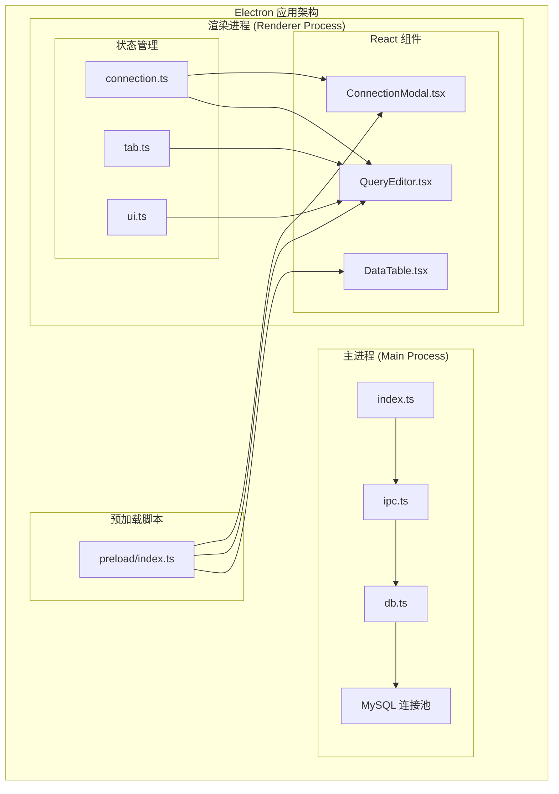
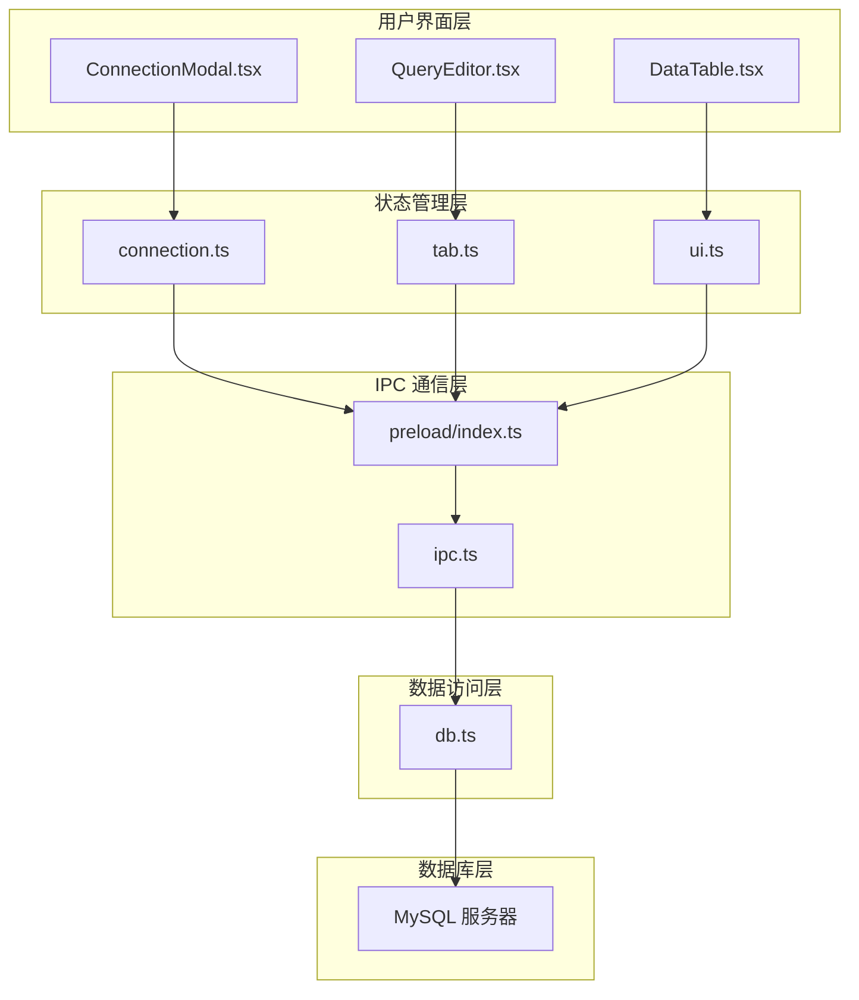
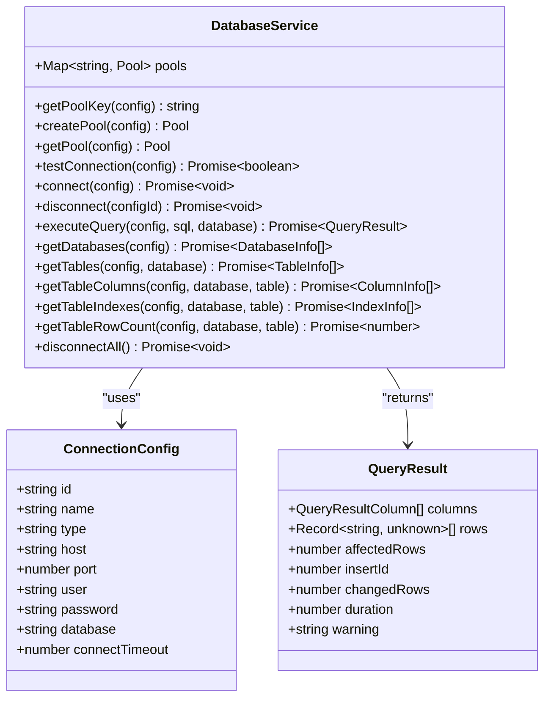
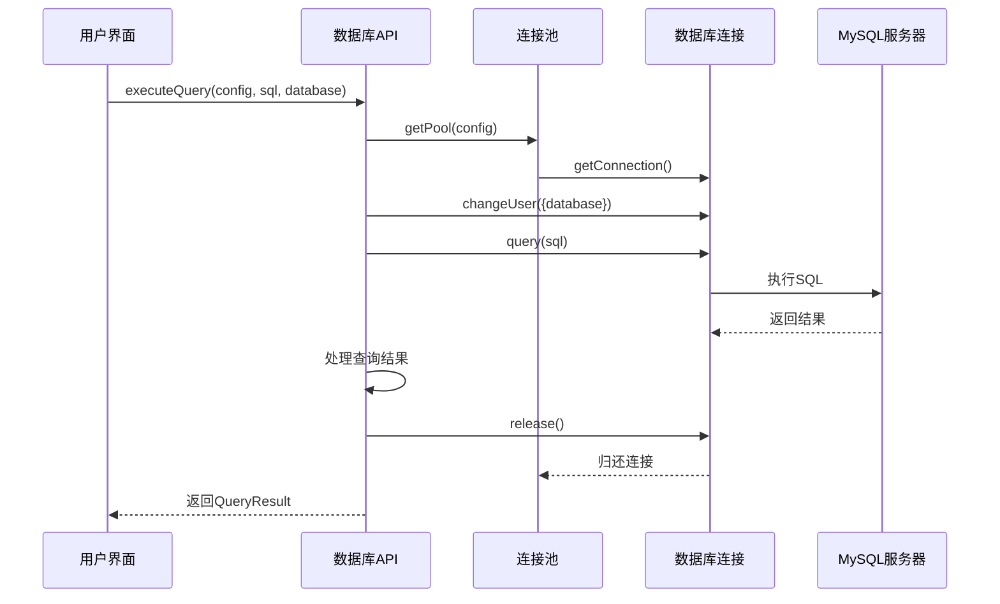
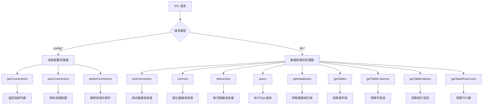
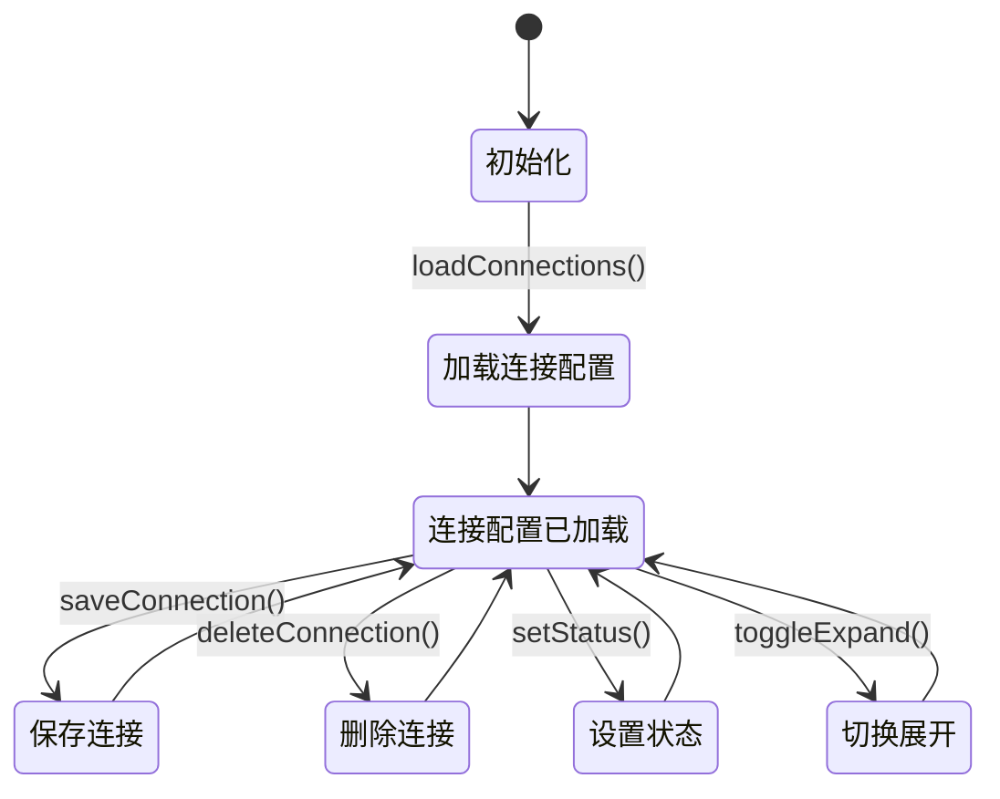
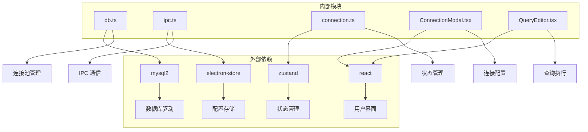
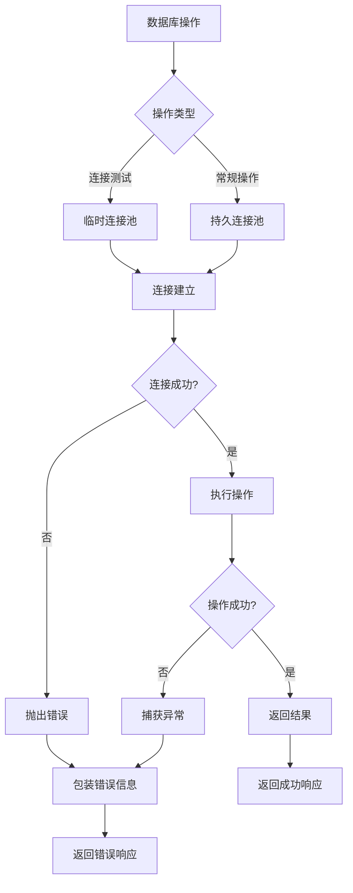

# 数据库服务层

<cite>
**本文档引用的文件**
- [db.ts](file://src/main/services/db.ts)
- [index.ts](file://src/main/index.ts)
- [ipc.ts](file://src/main/ipc.ts)
- [preload/index.ts](file://src/preload/index.ts)
- [connection.ts](file://src/renderer/src/stores/connection.ts)
- [types/index.ts](file://src/shared/types/index.ts)
- [ConnectionModal.tsx](file://src/renderer/src/components/ConnectionModal.tsx)
- [QueryEditor.tsx](file://src/renderer/src/components/QueryEditor.tsx)
- [package.json](file://package.json)
</cite>

## 目录
1. [简介](#简介)
2. [项目结构](#项目结构)
3. [核心组件](#核心组件)
4. [架构概览](#架构概览)
5. [详细组件分析](#详细组件分析)
6. [依赖关系分析](#依赖关系分析)
7. [性能考虑](#性能考虑)
8. [故障排除指南](#故障排除指南)
9. [结论](#结论)

## 简介

nexSql 是一个基于 Electron 和 React 的现代化数据库管理工具，专注于提供高效的数据库连接池管理和查询执行功能。该系统采用 MySQL 作为主要支持的数据库类型，通过连接池机制实现了高性能的数据库连接管理，并提供了完整的数据库元数据查询和数据操作功能。

系统的核心优势在于其精心设计的连接池管理策略，能够有效复用数据库连接，减少连接建立和销毁的开销，同时通过完善的错误处理机制确保系统的稳定性和可靠性。

## 项目结构

该项目采用典型的 Electron 应用架构，分为主进程（Main Process）和渲染进程（Renderer Process）两个部分，通过 IPC（Inter-Process Communication）进行通信。



**图表来源**
- [index.ts:1-64](file://src/main/index.ts#L1-L64)
- [ipc.ts:1-132](file://src/main/ipc.ts#L1-L132)
- [db.ts:1-277](file://src/main/services/db.ts#L1-L277)

**章节来源**
- [index.ts:1-64](file://src/main/index.ts#L1-L64)
- [package.json:1-42](file://package.json#L1-L42)

## 核心组件

### 数据库连接池管理

系统实现了基于 Map 的连接池缓存机制，每个连接配置对应一个独立的连接池实例。连接池的关键特性包括：

- **连接复用**：通过 `connectionLimit: 5` 限制每个连接池的最大连接数
- **自动保活**：启用 `enableKeepAlive` 和 `keepAliveInitialDelay: 0`
- **超时控制**：支持自定义连接超时时间
- **字符集设置**：统一使用 `utf8mb4` 字符集
- **时区处理**：设置为 UTC 时间 (`+00:00`)

### 数据库操作接口

系统提供了完整的数据库操作接口，涵盖以下核心功能：

- **连接测试**：验证数据库连接的有效性
- **查询执行**：支持 SELECT、INSERT、UPDATE、DELETE 等 SQL 操作
- **元数据查询**：获取数据库、表、列、索引等信息
- **事务处理**：通过连接池的事务管理机制实现
- **连接生命周期管理**：创建、维护、销毁连接池

**章节来源**
- [db.ts:11-36](file://src/main/services/db.ts#L11-L36)
- [db.ts:73-135](file://src/main/services/db.ts#L73-L135)
- [db.ts:137-276](file://src/main/services/db.ts#L137-L276)

## 架构概览

系统采用分层架构设计，清晰分离了数据访问层、业务逻辑层和用户界面层。



**图表来源**
- [preload/index.ts:14-45](file://src/preload/index.ts#L14-L45)
- [ipc.ts:16-127](file://src/main/ipc.ts#L16-L127)
- [db.ts:1-277](file://src/main/services/db.ts#L1-L277)

## 详细组件分析

### 数据库服务层 (db.ts)

数据库服务层是整个系统的核心，负责所有数据库相关的操作。该模块实现了完整的连接池管理机制。

#### 连接池管理机制



**图表来源**
- [db.ts:11-36](file://src/main/services/db.ts#L11-L36)
- [db.ts:73-135](file://src/main/services/db.ts#L73-L135)
- [types/index.ts:3-22](file://src/shared/types/index.ts#L3-L22)
- [types/index.ts:80-88](file://src/shared/types/index.ts#L80-L88)

#### 查询执行流程



**图表来源**
- [db.ts:73-135](file://src/main/services/db.ts#L73-L135)
- [db.ts:190-224](file://src/main/services/db.ts#L190-L224)

**章节来源**
- [db.ts:1-277](file://src/main/services/db.ts#L1-L277)

### IPC 通信层 (ipc.ts)

IPC 层负责主进程和渲染进程之间的通信，提供了完整的数据库操作 API。

#### IPC 处理器设计



**图表来源**
- [ipc.ts:16-127](file://src/main/ipc.ts#L16-L127)

**章节来源**
- [ipc.ts:1-132](file://src/main/ipc.ts#L1-L132)

### 前端状态管理 (connection.ts)

前端使用 Zustand 实现轻量级状态管理，专门用于管理数据库连接配置和状态。

#### 状态管理模式



**图表来源**
- [connection.ts:17-63](file://src/renderer/src/stores/connection.ts#L17-L63)

**章节来源**
- [connection.ts:1-64](file://src/renderer/src/stores/connection.ts#L1-L64)

### 数据类型定义 (types/index.ts)

系统定义了完整的数据传输对象（DTO），确保前后端数据交换的一致性和类型安全。

#### 核心数据类型

```mermaid
erDiagram
CONNECTION_CONFIG {
string id PK
string name
string type
string host
number port
string user
string password
string database
number connectTimeout
}
QUERY_RESULT {
QueryResultColumn[] columns
Record<string, unknown>[] rows
number affectedRows
number insertId
number changedRows
number duration
string warning
}
DATABASE_INFO {
string name PK
string charset
string collation
}
TABLE_INFO {
string name PK
string type
string engine
number rows
number dataSize
string comment
}
COLUMN_INFO {
string name PK
string type
boolean nullable
boolean isPrimaryKey
boolean isUnique
string defaultValue
string extra
string comment
}
INDEX_INFO {
string name PK
string column
boolean isUnique
string type
}
QUERY_RESULT ||--o{ QUERY_RESULT_COLUMN : contains
TABLE_INFO ||--o{ COLUMN_INFO : contains
TABLE_INFO ||--o{ INDEX_INFO : contains
```

**图表来源**
- [types/index.ts:3-22](file://src/shared/types/index.ts#L3-L22)
- [types/index.ts:80-88](file://src/shared/types/index.ts#L80-L88)
- [types/index.ts:34-47](file://src/shared/types/index.ts#L34-L47)
- [types/index.ts:49-58](file://src/shared/types/index.ts#L49-L58)
- [types/index.ts:60-65](file://src/shared/types/index.ts#L60-L65)

**章节来源**
- [types/index.ts:1-124](file://src/shared/types/index.ts#L1-L124)

## 依赖关系分析

系统依赖关系清晰，各模块职责明确，耦合度适中。



**图表来源**
- [package.json:16-26](file://package.json#L16-L26)
- [db.ts:1](file://src/main/services/db.ts#L1)
- [ipc.ts:2](file://src/main/ipc.ts#L2)

**章节来源**
- [package.json:1-42](file://package.json#L1-L42)

## 性能考虑

### 连接池优化策略

1. **连接复用**：通过 `connectionLimit: 5` 控制并发连接数，避免过度占用数据库资源
2. **连接保活**：启用 keep-alive 机制，减少连接重建开销
3. **超时控制**：合理的连接超时设置，防止长时间阻塞
4. **字符集优化**：使用 `utf8mb4` 支持完整的 Unicode 字符集

### 查询性能优化

1. **结果集处理**：对于 SELECT 查询，系统会同时获取列信息和数据，提高元数据查询效率
2. **错误处理**：自动检测和报告 SQL 警告信息
3. **性能监控**：记录查询执行时间，便于性能分析

### 内存管理

1. **连接释放**：所有数据库操作都确保在 finally 块中释放连接
2. **池清理**：应用退出时清理所有连接池
3. **状态同步**：前端状态与后端连接状态保持同步

## 故障排除指南

### 常见连接问题

1. **连接超时**：检查网络连接和防火墙设置
2. **认证失败**：验证用户名和密码正确性
3. **数据库不存在**：确认目标数据库已创建
4. **权限不足**：检查用户权限配置

### 错误处理机制

系统实现了多层次的错误处理：



**图表来源**
- [db.ts:38-56](file://src/main/services/db.ts#L38-L56)
- [ipc.ts:47-81](file://src/main/ipc.ts#L47-L81)

### 调试建议

1. **启用详细日志**：在开发环境中添加更多调试信息
2. **监控连接池**：定期检查连接池状态和使用情况
3. **性能分析**：使用浏览器开发者工具分析前端性能
4. **内存泄漏检测**：定期检查内存使用情况

**章节来源**
- [db.ts:38-56](file://src/main/services/db.ts#L38-L56)
- [ipc.ts:47-81](file://src/main/ipc.ts#L47-L81)

## 结论

nexSql 数据库服务层展现了现代桌面应用的最佳实践，通过精心设计的连接池管理、清晰的架构分层和完善的错误处理机制，为用户提供了一个高效、可靠的数据库管理工具。

### 主要优势

1. **高性能连接池**：通过合理的连接复用策略，显著提升数据库操作性能
2. **类型安全**：完整的 TypeScript 类型定义，确保前后端数据交换的准确性
3. **用户体验**：直观的界面设计和流畅的操作体验
4. **扩展性**：模块化的架构设计，便于功能扩展和维护

### 技术亮点

- 基于 Electron 的跨平台桌面应用
- 使用 React 构建现代化用户界面
- 通过 IPC 实现主进程和渲染进程的安全通信
- 完整的数据库元数据查询功能
- 优雅的错误处理和异常恢复机制

该系统为数据库管理工具的开发提供了优秀的参考模板，展示了如何在桌面应用中实现高性能的数据库连接管理和查询执行功能。