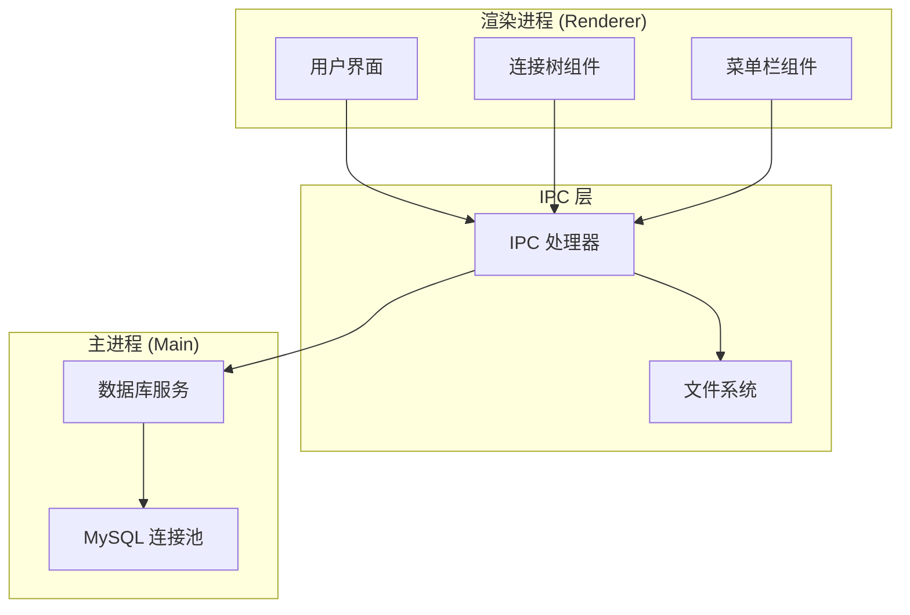
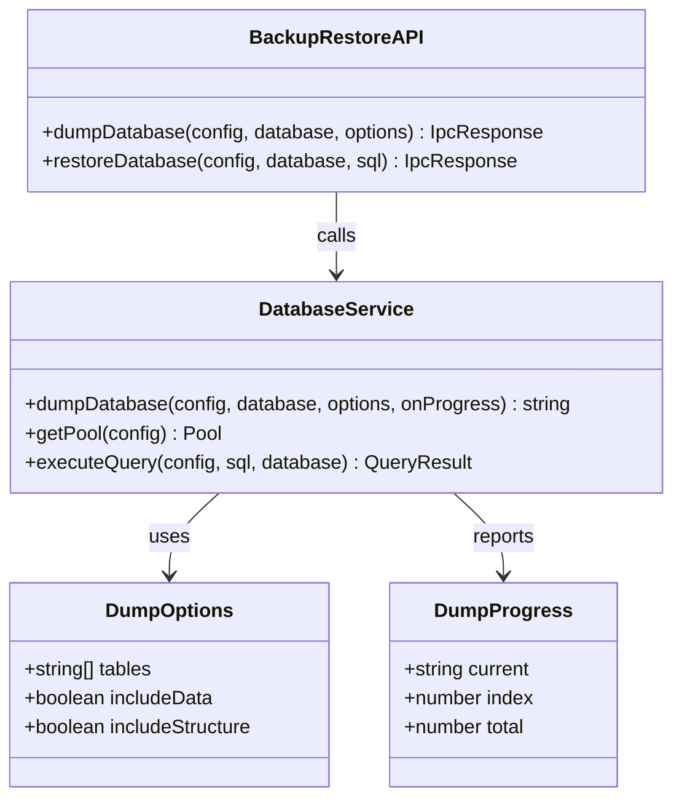
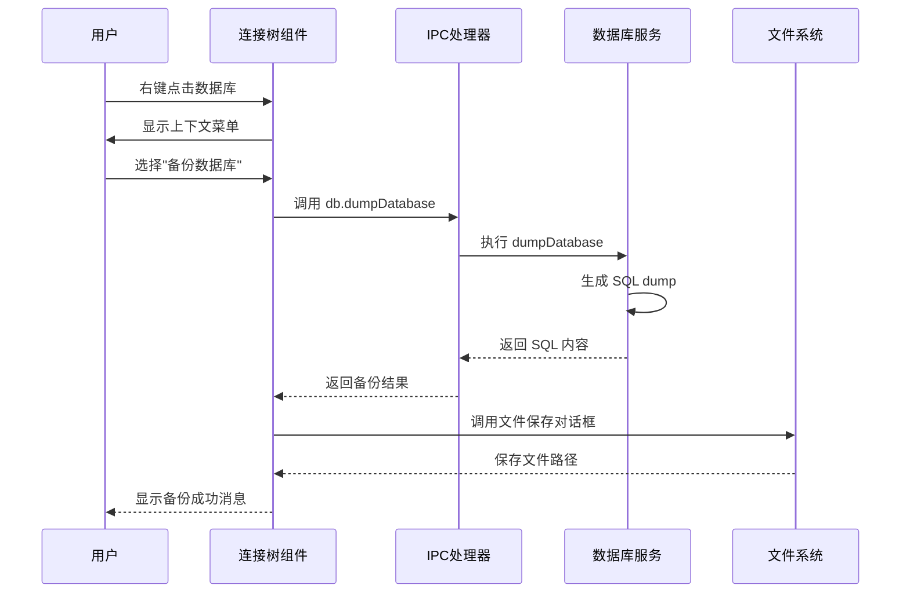
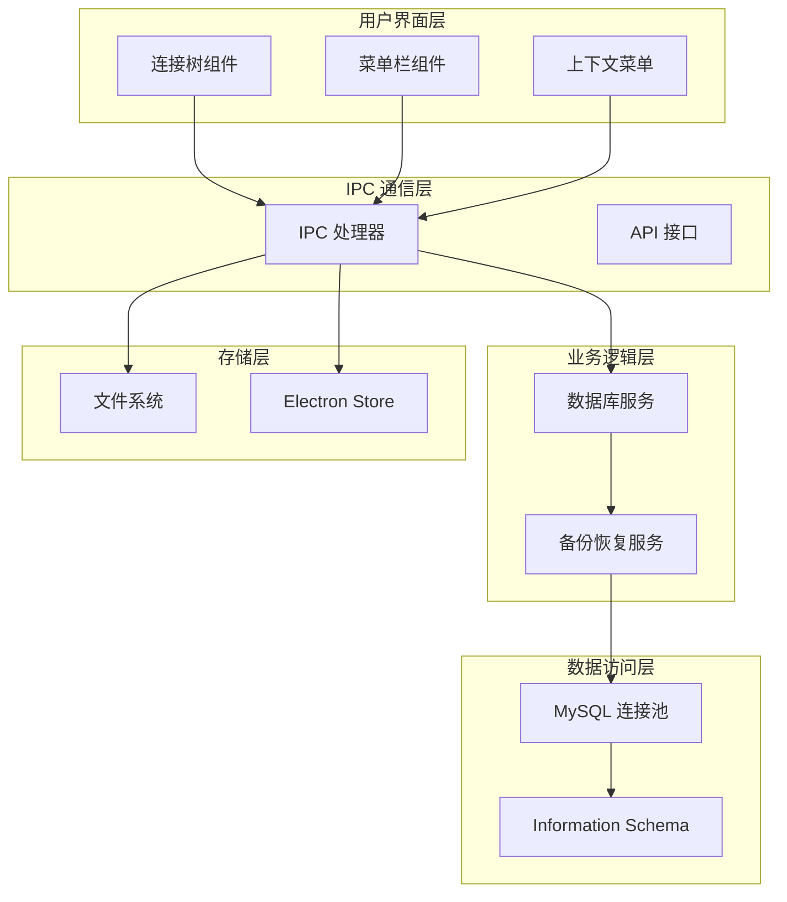
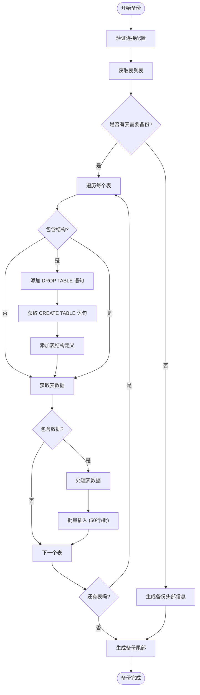
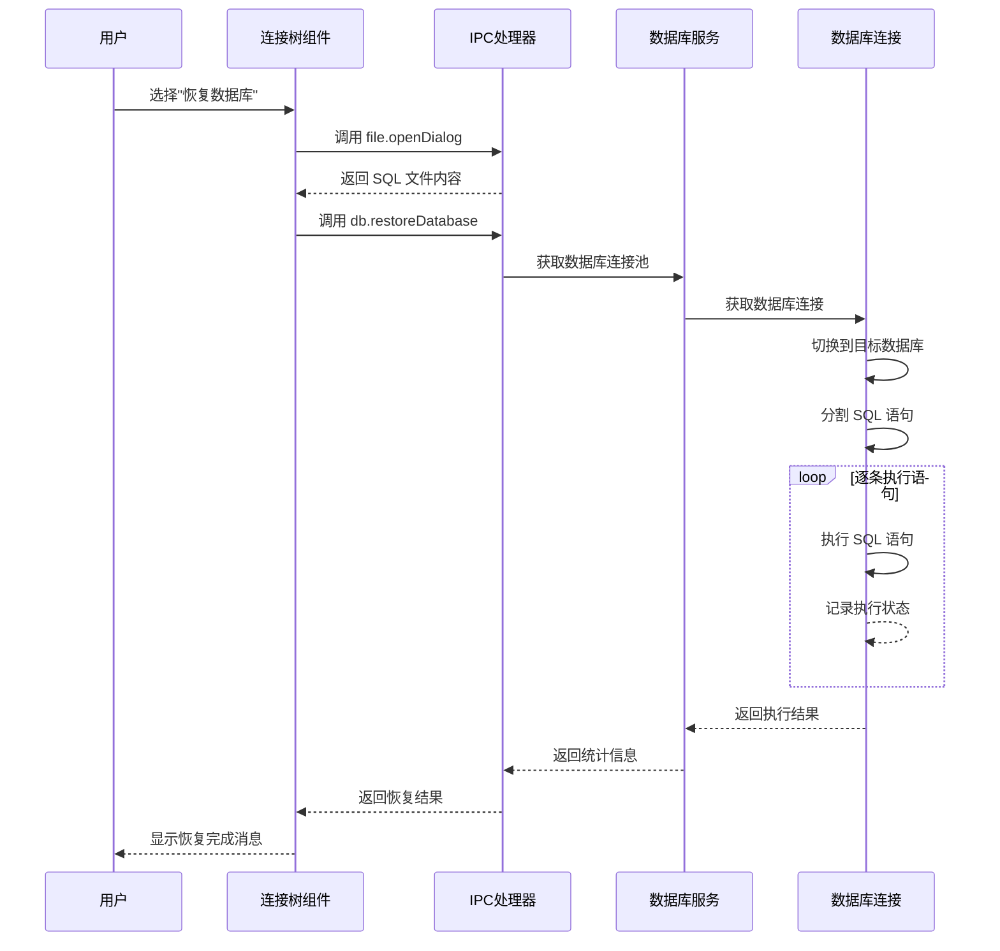
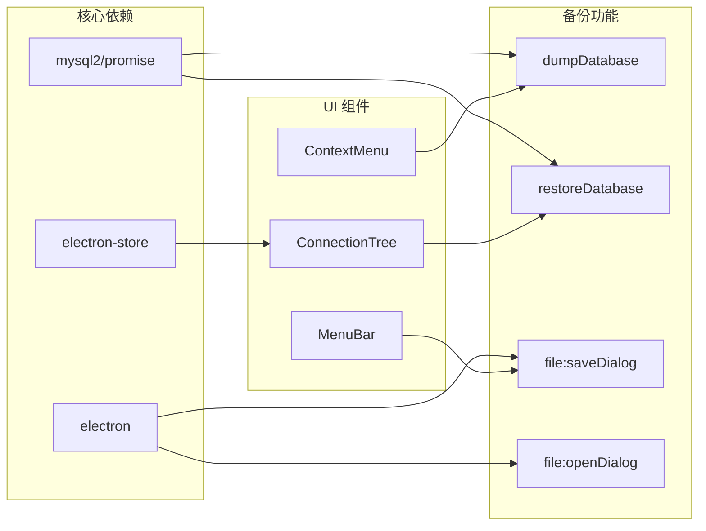

# 备份恢复功能

<cite>
**本文档引用的文件**
- [README.md](file://README.md)
- [db.ts](file://src/main/services/db.ts)
- [ipc.ts](file://src/main/ipc.ts)
- [ConnectionTree.tsx](file://src/renderer/src/components/ConnectionTree.tsx)
- [index.ts](file://src/main/index.ts)
- [types/index.ts](file://src/shared/types/index.ts)
- [package.json](file://package.json)
</cite>

## 目录
1. [简介](#简介)
2. [项目结构](#项目结构)
3. [核心组件](#核心组件)
4. [架构概览](#架构概览)
5. [详细组件分析](#详细组件分析)
6. [依赖关系分析](#依赖关系分析)
7. [性能考虑](#性能考虑)
8. [故障排除指南](#故障排除指南)
9. [结论](#结论)

## 简介

备份恢复功能是 nexSql 数据库管理工具的重要组成部分，提供完整的数据库备份和恢复能力。该功能基于纯 SQL dump 导出机制，支持结构和数据的完整备份，并提供一键恢复功能。

根据项目 README 的功能特性描述，备份恢复功能具有以下特点：
- 纯 SQL dump 导出（DDL + 批量 INSERT）
- 支持一键恢复
- 支持选择性备份（仅结构或仅数据）
- 支持全库备份和单表备份
- 包含完整的外键约束处理

## 项目结构

备份恢复功能涉及三个主要层次：

**图表来源**
- [ConnectionTree.tsx:440-470](file://src/renderer/src/components/ConnectionTree.tsx#L440-L470)
- [ipc.ts:329-370](file://src/main/ipc.ts#L329-L370)
- [db.ts:685-778](file://src/main/services/db.ts#L685-L778)

**章节来源**
- [README.md:46-50](file://README.md#L46-L50)
- [package.json:16-27](file://package.json#L16-L27)

## 核心组件

### 数据库备份服务

备份功能的核心实现在数据库服务层，提供了完整的 SQL dump 生成能力：

**图表来源**
- [db.ts:687-778](file://src/main/services/db.ts#L687-L778)
- [ipc.ts:329-370](file://src/main/ipc.ts#L329-L370)

### 用户界面集成

备份恢复功能通过连接树组件提供直观的用户界面：

**图表来源**
- [ConnectionTree.tsx:208-234](file://src/renderer/src/components/ConnectionTree.tsx#L208-L234)
- [ipc.ts:331-342](file://src/main/ipc.ts#L331-L342)

**章节来源**
- [db.ts:685-778](file://src/main/services/db.ts#L685-L778)
- [ipc.ts:329-370](file://src/main/ipc.ts#L329-L370)
- [ConnectionTree.tsx:208-234](file://src/renderer/src/components/ConnectionTree.tsx#L208-L234)

## 架构概览

备份恢复功能采用分层架构设计，确保功能的模块化和可维护性：

**图表来源**
- [index.ts:43-52](file://src/main/index.ts#L43-L52)
- [ipc.ts:48-448](file://src/main/ipc.ts#L48-L448)
- [db.ts:1-778](file://src/main/services/db.ts#L1-L778)

## 详细组件分析

### 备份流程实现

备份功能实现了完整的 SQL dump 生成流程：

**图表来源**
- [db.ts:699-778](file://src/main/services/db.ts#L699-L778)

### 恢复流程实现

恢复功能提供了安全的数据恢复机制：

**图表来源**
- [ConnectionTree.tsx:238-261](file://src/renderer/src/components/ConnectionTree.tsx#L238-L261)
- [ipc.ts:344-370](file://src/main/ipc.ts#L344-L370)

### 数据库服务层

数据库服务层提供了核心的备份恢复功能：

**章节来源**
- [db.ts:685-778](file://src/main/services/db.ts#L685-L778)

### IPC 通信层

IPC 层负责渲染进程和主进程之间的通信：

**章节来源**
- [ipc.ts:329-370](file://src/main/ipc.ts#L329-L370)

### 用户界面层

用户界面层提供了直观的操作体验：

**章节来源**
- [ConnectionTree.tsx:440-470](file://src/renderer/src/components/ConnectionTree.tsx#L440-L470)

## 依赖关系分析

备份恢复功能涉及多个技术组件的协作：

**图表来源**
- [package.json:16-27](file://package.json#L16-L27)
- [ipc.ts:372-438](file://src/main/ipc.ts#L372-L438)

**章节来源**
- [package.json:16-27](file://package.json#L16-L27)
- [types/index.ts:182-188](file://src/shared/types/index.ts#L182-L188)

## 性能考虑

备份恢复功能在性能方面采用了多项优化策略：

### 批量处理优化
- 数据导出采用 50 行批量插入的方式，平衡内存使用和执行效率
- 进度报告机制允许用户监控大型数据库的备份进度

### 连接池管理
- 使用连接池减少数据库连接建立的开销
- 支持 SSH 隧道和 SSL 加密连接的透明管理

### 内存优化
- SQL 生成过程中采用流式处理，避免一次性加载大量数据到内存
- 文件保存采用异步写入，不影响用户界面响应

## 故障排除指南

### 常见问题及解决方案

**备份失败**
- 检查数据库连接状态和权限
- 确认有足够的磁盘空间
- 验证目标数据库存在且可写

**恢复失败**
- 检查 SQL 文件格式是否正确
- 确认目标数据库字符集兼容性
- 查看具体的错误信息以定位问题

**性能问题**
- 对于大型数据库，考虑分批备份
- 监控数据库服务器负载
- 考虑在低峰期执行备份操作

**章节来源**
- [ipc.ts:18-46](file://src/main/ipc.ts#L18-L46)

## 结论

备份恢复功能是 nexSql 数据库管理工具的重要特性，提供了完整、可靠的数据保护机制。该功能具有以下优势：

1. **完整性保证**：支持结构和数据的完整备份，确保数据恢复的准确性
2. **用户友好**：通过直观的界面操作，简化复杂的备份恢复流程
3. **性能优化**：采用批量处理和连接池管理，提高大数据量场景下的处理效率
4. **安全性**：支持 SSH 隧道和 SSL 加密，确保数据传输安全
5. **灵活性**：支持选择性备份和恢复，满足不同场景需求

该功能的实现体现了现代数据库管理工具的设计理念，既保证了功能的完整性，又注重用户体验和性能表现。通过合理的架构设计和优化策略，备份恢复功能能够满足各种规模数据库的管理需求。