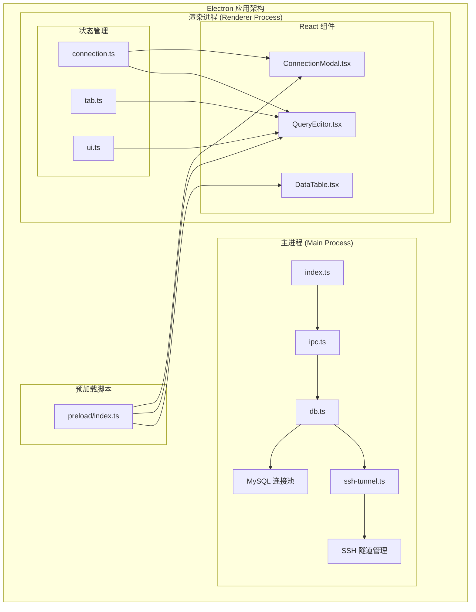
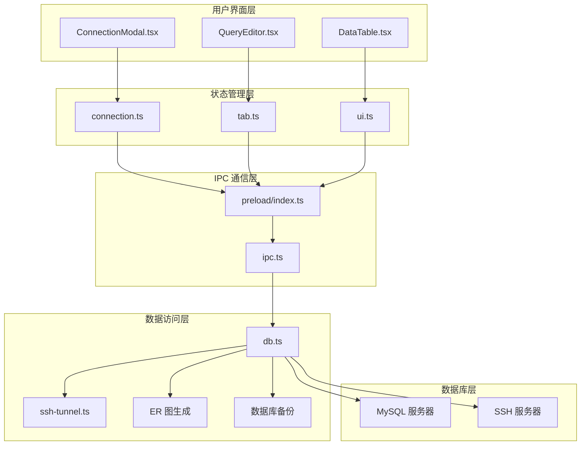
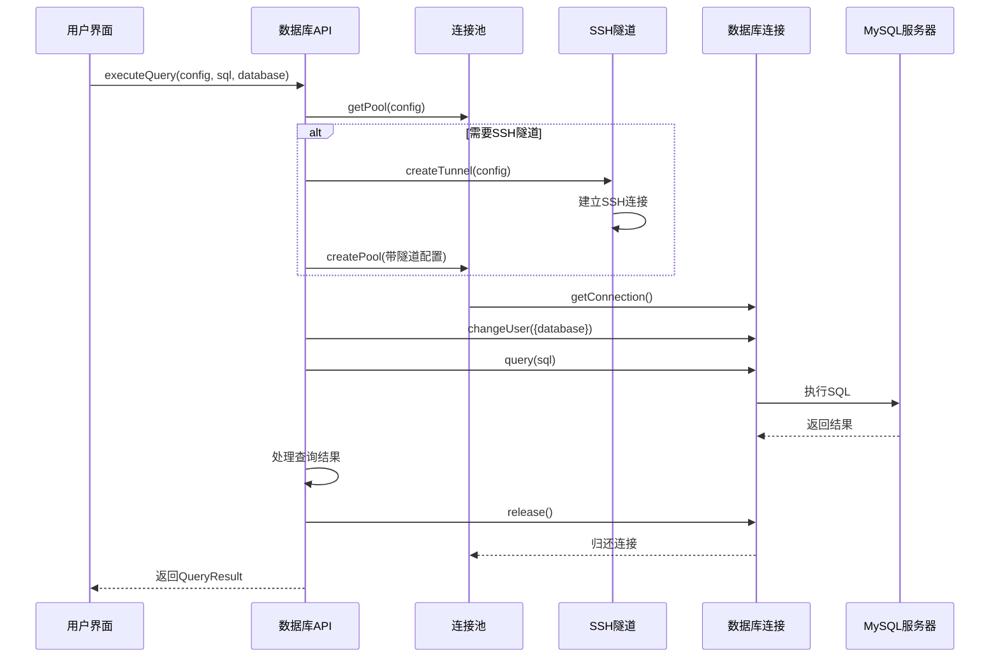
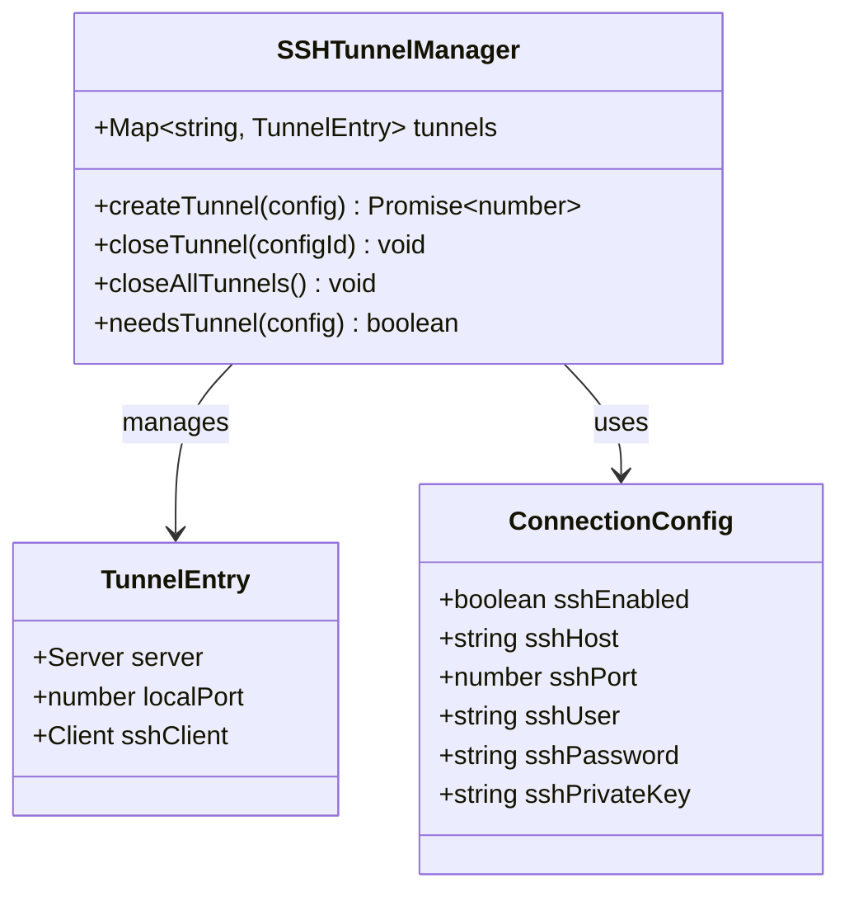
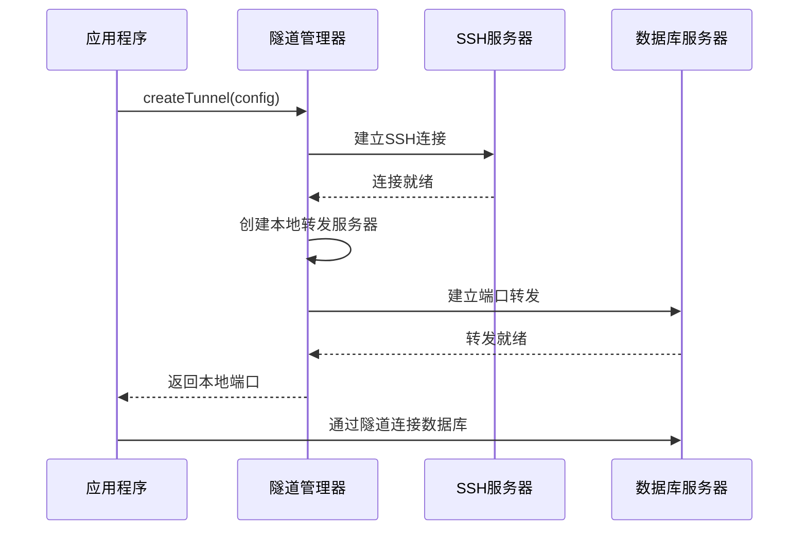
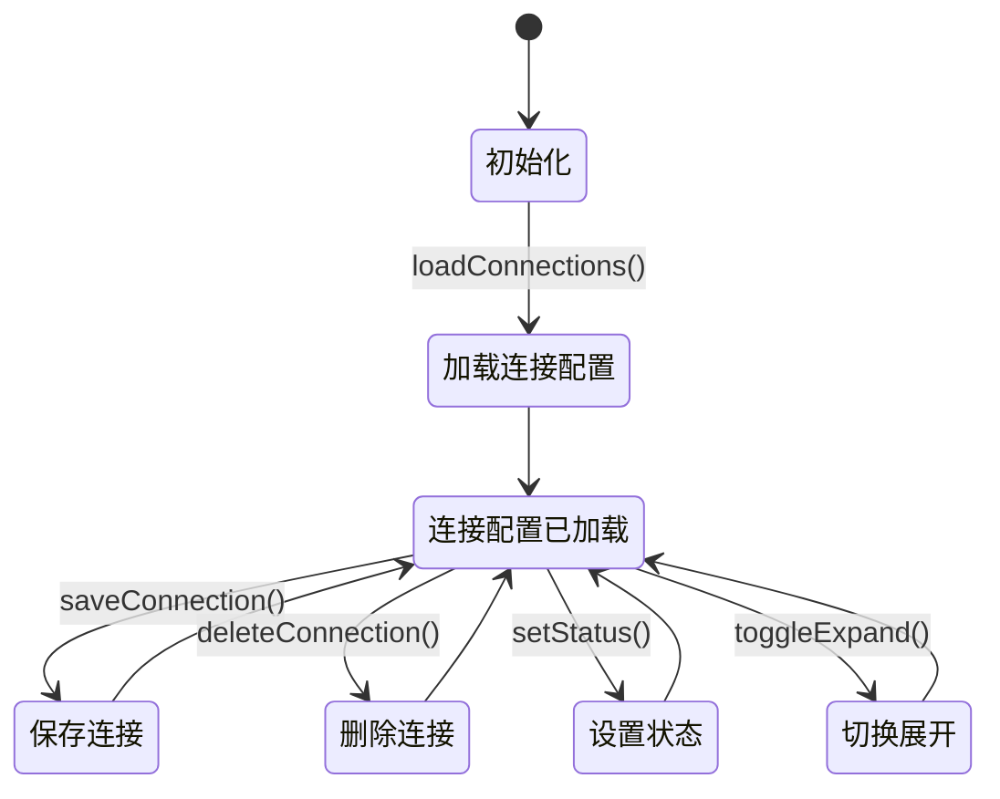
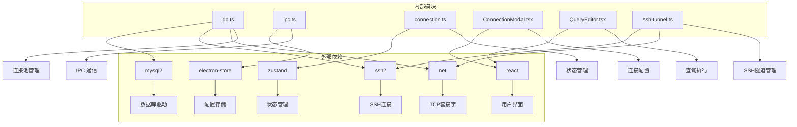
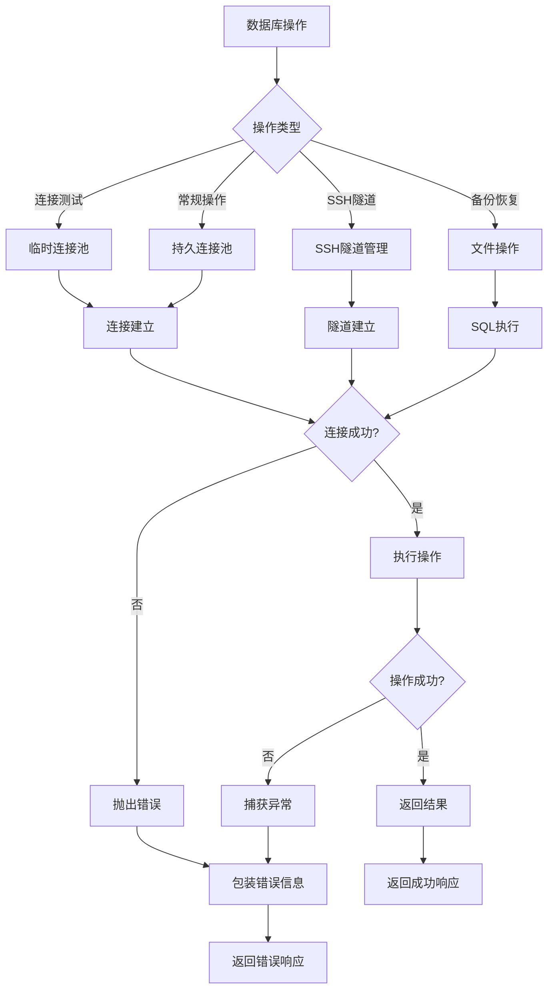

# 数据库服务层

<cite>
**本文档引用的文件**
- [db.ts](file://src/main/services/db.ts)
- [ssh-tunnel.ts](file://src/main/services/ssh-tunnel.ts)
- [index.ts](file://src/main/index.ts)
- [ipc.ts](file://src/main/ipc.ts)
- [preload/index.ts](file://src/preload/index.ts)
- [connection.ts](file://src/renderer/src/stores/connection.ts)
- [types/index.ts](file://src/shared/types/index.ts)
- [ConnectionModal.tsx](file://src/renderer/src/components/ConnectionModal.tsx)
- [QueryEditor.tsx](file://src/renderer/src/components/QueryEditor.tsx)
- [package.json](file://package.json)
</cite>

## 更新摘要
**变更内容**
- 新增SSH隧道连接支持，增强远程数据库安全连接能力
- 新增SSL加密连接支持，提升数据传输安全性
- 新增数据库备份/恢复功能，支持SQL dump导出和导入
- 新增ER关系图生成功能，支持外键关系可视化
- 增强连接池管理机制，支持复杂连接配置
- 扩展查询执行能力，支持警告信息处理和性能监控

## 目录
1. [简介](#简介)
2. [项目结构](#项目结构)
3. [核心组件](#核心组件)
4. [架构概览](#架构概览)
5. [详细组件分析](#详细组件分析)
6. [依赖关系分析](#依赖关系分析)
7. [性能考虑](#性能考虑)
8. [故障排除指南](#故障排除指南)
9. [结论](#结论)

## 简介

nexSql 是一个基于 Electron 和 React 的现代化数据库管理工具，专注于提供高效的数据库连接池管理和查询执行功能。该系统采用 MySQL 作为主要支持的数据库类型，通过增强的连接池机制实现了高性能的数据库连接管理，并提供了完整的数据库元数据查询和数据操作功能。

**更新** 系统现已支持SSH隧道连接和SSL加密，为远程数据库访问提供了更安全的解决方案。新增的数据库备份/恢复功能和ER关系图生成功能进一步增强了系统的实用性。

系统的核心优势在于其精心设计的连接池管理策略，能够有效复用数据库连接，减少连接建立和销毁的开销，同时通过完善的错误处理机制确保系统的稳定性和可靠性。

## 项目结构

该项目采用典型的 Electron 应用架构，分为主进程（Main Process）和渲染进程（Renderer Process）两个部分，通过 IPC（Inter-Process Communication）进行通信。



**图表来源**
- [index.ts:1-64](file://src/main/index.ts#L1-L64)
- [ipc.ts:1-448](file://src/main/ipc.ts#L1-L448)
- [db.ts:1-778](file://src/main/services/db.ts#L1-L778)
- [ssh-tunnel.ts:1-125](file://src/main/services/ssh-tunnel.ts#L1-L125)

**章节来源**
- [index.ts:1-64](file://src/main/index.ts#L1-L64)
- [package.json:1-42](file://package.json#L1-L42)

## 核心组件

### 增强的数据库连接池管理

系统实现了基于 Map 的连接池缓存机制，每个连接配置对应一个独立的连接池实例。连接池的关键特性包括：

- **连接复用**：通过 `connectionLimit: 5` 限制每个连接池的最大连接数
- **自动保活**：启用 `enableKeepAlive` 和 `keepAliveInitialDelay: 0`
- **超时控制**：支持自定义连接超时时间
- **字符集设置**：统一使用 `utf8mb4` 字符集
- **时区处理**：设置为 UTC 时间 (`+00:00`)
- **SSH隧道支持**：自动检测并创建SSH隧道连接
- **SSL加密支持**：支持SSL加密连接配置

### 新增功能模块

#### SSH隧道连接管理

系统新增了完整的SSH隧道支持，允许通过SSH代理连接到受保护的数据库服务器。

- **隧道自动创建**：根据连接配置自动创建SSH隧道
- **端口转发**：支持TCP端口转发功能
- **多种认证方式**：支持私钥和密码两种认证方式
- **隧道生命周期管理**：自动管理隧道的创建、使用和销毁

#### 数据库备份/恢复

系统提供了完整的数据库备份和恢复功能，支持SQL dump格式的数据导出和导入。

- **结构备份**：支持仅备份表结构或结构+数据
- **增量备份**：支持选择特定表进行备份
- **进度监控**：提供备份进度反馈
- **批量导入**：支持SQL文件的批量执行

#### ER关系图生成

系统支持生成数据库的实体关系图，通过外键关系可视化数据库结构。

- **全库外键扫描**：扫描所有表的外键关系
- **表列信息收集**：获取所有表的列定义信息
- **关系图数据生成**：生成SVG格式的关系图数据

### 数据库操作接口

系统提供了完整的数据库操作接口，涵盖以下核心功能：

- **连接测试**：验证数据库连接的有效性，支持SSH隧道和SSL
- **查询执行**：支持 SELECT、INSERT、UPDATE、DELETE 等 SQL 操作，包含性能监控
- **元数据查询**：获取数据库、表、列、索引等信息，支持视图、函数、存储过程、事件
- **事务处理**：通过连接池的事务管理机制实现
- **连接生命周期管理**：创建、维护、销毁连接池，支持SSH隧道管理
- **备份/恢复**：支持数据库的SQL dump备份和恢复
- **ER图生成**：支持实体关系图的生成和数据获取

**章节来源**
- [db.ts:11-36](file://src/main/services/db.ts#L11-L36)
- [db.ts:73-135](file://src/main/services/db.ts#L73-L135)
- [db.ts:137-276](file://src/main/services/db.ts#L137-L276)
- [ssh-tunnel.ts:18-94](file://src/main/services/ssh-tunnel.ts#L18-L94)

## 架构概览

系统采用分层架构设计，清晰分离了数据访问层、业务逻辑层和用户界面层，并新增了SSH隧道和备份恢复功能层。



**图表来源**
- [preload/index.ts:14-45](file://src/preload/index.ts#L14-L45)
- [ipc.ts:16-448](file://src/main/ipc.ts#L16-L448)
- [db.ts:1-778](file://src/main/services/db.ts#L1-L778)
- [ssh-tunnel.ts:1-125](file://src/main/services/ssh-tunnel.ts#L1-L125)

## 详细组件分析

### 数据库服务层 (db.ts)

数据库服务层是整个系统的核心，负责所有数据库相关的操作。该模块实现了完整的连接池管理机制，并新增了SSH隧道、SSL加密、备份恢复和ER图生成功能。

#### 增强的连接池管理机制

```mermaid
classDiagram
class DatabaseService {
+Map~string, Pool~ pools
+getPoolKey(config) string
+createPool(config) Pool
+getPool(config) Pool
+testConnection(config) Promise~boolean~
+connect(config) Promise~void~
+disconnect(configId) Promise~void~
+executeQuery(config, sql, database) Promise~QueryResult~
+getDatabases(config) Promise~DatabaseInfo[]~
+getTables(config, database) Promise~TableInfo[]~
+getTableColumns(config, database, table) Promise~ColumnInfo[]~
+getTableIndexes(config, database, table) Promise~IndexInfo[]~
+getTableRowCount(config, database, table) Promise~number~
+getTableDDL(config, database, table) Promise~string~
+getForeignKeys(config, database, table) Promise~ForeignKeyInfo[]~
+getTableTriggers(config, database, table) Promise~TriggerInfo[]~
+getTableOptions(config, database, table) Promise~TableOptions~
+getTableDetails(config, database, table) Promise~TableDetails~
+getViews(config, database) Promise~ViewInfo[]~
+getRoutines(config, database) Promise~RoutineInfo[]~
+getEvents(config, database) Promise~EventInfo[]~
+getAllForeignKeys(config, database) Promise~ERRelation[]~
+getAllTableColumns(config, database) Promise~ERTableColumns[]~
+dumpDatabase(config, database, options, onProgress) Promise~string~
+disconnectAll() Promise~void~
}
class ConnectionConfig {
+string id
+string name
+string type
+string host
+number port
+string user
+string password
+string database
+number connectTimeout
+boolean sshEnabled
+string sshHost
+number sshPort
+string sshUser
+string sshPassword
+string sshPrivateKey
+boolean sslEnabled
}
class QueryResult {
+QueryResultColumn[] columns
+Record~string, unknown~[] rows
+number affectedRows
+number insertId
+number changedRows
+number duration
+string warning
}
class ERRelation {
+string fromTable
+string fromColumn
+string toTable
+string toColumn
+string constraintName
}
class ERTableColumns {
+string table
+{name : string, type : string, isPK : boolean}[] columns
}
DatabaseService --> ConnectionConfig : "uses"
DatabaseService --> QueryResult : "returns"
DatabaseService --> ERRelation : "returns"
DatabaseService --> ERTableColumns : "returns"
```

**图表来源**
- [db.ts:11-36](file://src/main/services/db.ts#L11-L36)
- [db.ts:73-135](file://src/main/services/db.ts#L73-L135)
- [types/index.ts:3-22](file://src/shared/types/index.ts#L3-L22)
- [types/index.ts:80-88](file://src/shared/types/index.ts#L80-L88)
- [db.ts:611-647](file://src/main/services/db.ts#L611-L647)
- [db.ts:651-683](file://src/main/services/db.ts#L651-L683)

#### 查询执行流程



**图表来源**
- [db.ts:73-135](file://src/main/services/db.ts#L73-L135)
- [db.ts:190-224](file://src/main/services/db.ts#L190-L224)
- [ssh-tunnel.ts:18-94](file://src/main/services/ssh-tunnel.ts#L18-L94)

**章节来源**
- [db.ts:1-778](file://src/main/services/db.ts#L1-L778)

### SSH隧道服务层 (ssh-tunnel.ts)

SSH隧道服务层是新增的重要功能模块，负责管理SSH隧道连接，为远程数据库访问提供安全通道。

#### SSH隧道管理机制



**图表来源**
- [ssh-tunnel.ts:5-125](file://src/main/services/ssh-tunnel.ts#L5-L125)
- [types/index.ts:15-22](file://src/shared/types/index.ts#L15-L22)

#### SSH隧道建立流程



**图表来源**
- [ssh-tunnel.ts:28-94](file://src/main/services/ssh-tunnel.ts#L28-L94)

**章节来源**
- [ssh-tunnel.ts:1-125](file://src/main/services/ssh-tunnel.ts#L1-L125)

### IPC 通信层 (ipc.ts)

IPC 层负责主进程和渲染进程之间的通信，提供了完整的数据库操作 API，并新增了SSH隧道、备份恢复和ER图相关的处理器。

#### 增强的IPC处理器设计

```mermaid
flowchart TD
A[IPC 请求] --> B{请求类型}
B --> |config:*| C[连接配置处理器]
B --> |db:*| D[数据库操作处理器]
B --> |file:*| E[文件操作处理器]
C --> C1[getConnections]
C --> C2[saveConnection]
C --> C3[deleteConnection]
D --> D1[testConnection]
D --> D2[connect]
D --> D3[disconnect]
D --> D4[query]
D --> D5[getDatabases]
D --> D6[getTables]
D --> D7[getTableColumns]
D --> D8[getTableIndexes]
D --> D9[getTableRowCount]
D --> D10[getTableDDL]
D --> D11[getForeignKeys]
D --> D12[getTableTriggers]
D --> D13[getTableOptions]
D --> D14[getTableDetails]
D --> D15[getViews]
D --> D16[getRoutines]
D --> D17[getEvents]
D --> D18[getERRelations]
D --> D19[getERTableColumns]
D --> D20[dumpDatabase]
D --> D21[restoreDatabase]
C1 --> F[返回连接列表]
C2 --> G[保存连接配置]
C3 --> H[删除连接并断开]
D1 --> I[测试数据库连接]
D2 --> J[建立数据库连接]
D3 --> K[断开数据库连接]
D4 --> L[执行SQL查询]
D5 --> M[获取数据库列表]
D6 --> N[获取表列表]
D7 --> O[获取列信息]
D8 --> P[获取索引信息]
D9 --> Q[获取行计数]
D10 --> R[获取表DDL]
D11 --> S[获取外键信息]
D12 --> T[获取触发器信息]
D13 --> U[获取表选项]
D14 --> V[获取表详细信息]
D15 --> W[获取视图信息]
D16 --> X[获取函数/存储过程]
D17 --> Y[获取事件信息]
D18 --> Z[获取ER关系]
D19 --> AA[获取ER表列]
D20 --> BB[数据库备份]
D21 --> CC[数据库恢复]
```



**图表来源**
- [ipc.ts:16-448](file://src/main/ipc.ts#L16-L448)

**章节来源**
- [ipc.ts:1-448](file://src/main/ipc.ts#L1-L448)

### 前端状态管理 (connection.ts)

前端使用 Zustand 实现轻量级状态管理，专门用于管理数据库连接配置和状态。

#### 状态管理模式



**图表来源**
- [connection.ts:17-63](file://src/renderer/src/stores/connection.ts#L17-L63)

**章节来源**
- [connection.ts:1-64](file://src/renderer/src/stores/connection.ts#L1-L64)

### 数据类型定义 (types/index.ts)

系统定义了完整的数据传输对象（DTO），确保前后端数据交换的一致性和类型安全。

#### 增强的核心数据类型

```mermaid
erDiagram
CONNECTION_CONFIG {
string id PK
string name
string type
string host
number port
string user
string password
string database
number connectTimeout
boolean sshEnabled
string sshHost
number sshPort
string sshUser
string sshPassword
string sshPrivateKey
boolean sslEnabled
}
QUERY_RESULT {
QueryResultColumn[] columns
Record<string, unknown>[] rows
number affectedRows
number insertId
number changedRows
number duration
string warning
}
DATABASE_INFO {
string name PK
string charset
string collation
}
TABLE_INFO {
string name PK
string type
string engine
number rows
number dataSize
string comment
}
COLUMN_INFO {
string name PK
string type
boolean nullable
boolean isPrimaryKey
boolean isUnique
string defaultValue
string extra
string comment
}
INDEX_INFO {
string name PK
string column
boolean isUnique
string type
}
FOREIGN_KEY_INFO {
string name PK
string columnName
string referencedTable
string referencedColumnName
string onUpdate
string onDelete
}
TRIGGER_INFO {
string name PK
string event
string timing
string statement
string created
string definer
}
TABLE_OPTIONS {
string engine
string charset
string collation
string comment
number autoIncrement
string rowFormat
}
TABLE_DETAILS {
string name
number rows
number dataSize
number indexLength
string engine
string createTime
string updateTime
string collation
string rowFormat
number autoIncrement
string comment
}
VIEW_INFO {
string name PK
string definition
string checkOption
boolean updatable
string security
string comment
string definer
}
ROUTINE_INFO {
string name PK
string type
string returnType
string definer
string modified
string created
string comment
boolean deterministic
string security
string body
}
EVENT_INFO {
string name PK
string definer
string type
string status
string starts
string ends
string lastExecuted
string onCompletion
string comment
string body
}
QUERY_RESULT ||--o{ QUERY_RESULT_COLUMN : contains
TABLE_INFO ||--o{ COLUMN_INFO : contains
TABLE_INFO ||--o{ INDEX_INFO : contains
TABLE_INFO ||--o{ FOREIGN_KEY_INFO : contains
TABLE_INFO ||--o{ TRIGGER_INFO : contains
TABLE_INFO ||--o{ TABLE_OPTIONS : contains
TABLE_INFO ||--o{ TABLE_DETAILS : contains
TABLE_INFO ||--o{ VIEW_INFO : contains
TABLE_INFO ||--o{ ROUTINE_INFO : contains
TABLE_INFO ||--o{ EVENT_INFO : contains
```

**图表来源**
- [types/index.ts:3-22](file://src/shared/types/index.ts#L3-L22)
- [types/index.ts:80-88](file://src/shared/types/index.ts#L80-L88)
- [types/index.ts:34-47](file://src/shared/types/index.ts#L34-L47)
- [types/index.ts:49-58](file://src/shared/types/index.ts#L49-L58)
- [types/index.ts:60-65](file://src/shared/types/index.ts#L60-L65)
- [types/index.ts:68-75](file://src/shared/types/index.ts#L68-L75)
- [types/index.ts:77-84](file://src/shared/types/index.ts#L77-L84)
- [types/index.ts:86-93](file://src/shared/types/index.ts#L86-L93)
- [types/index.ts:95-107](file://src/shared/types/index.ts#L95-L107)
- [types/index.ts:116-124](file://src/shared/types/index.ts#L116-L124)
- [types/index.ts:126-137](file://src/shared/types/index.ts#L126-L137)
- [types/index.ts:139-150](file://src/shared/types/index.ts#L139-L150)

**章节来源**
- [types/index.ts:1-204](file://src/shared/types/index.ts#L1-L204)

## 依赖关系分析

系统依赖关系清晰，各模块职责明确，耦合度适中。新增的SSH隧道和备份功能模块与现有架构无缝集成。



**图表来源**
- [package.json:16-26](file://package.json#L16-L26)
- [db.ts:1](file://src/main/services/db.ts#L1)
- [ipc.ts:2](file://src/main/ipc.ts#L2)
- [ssh-tunnel.ts:1](file://src/main/services/ssh-tunnel.ts#L1)

**章节来源**
- [package.json:1-42](file://package.json#L1-L42)

## 性能考虑

### 增强的连接池优化策略

1. **连接复用**：通过 `connectionLimit: 5` 控制并发连接数，避免过度占用数据库资源
2. **连接保活**：启用 keep-alive 机制，减少连接重建开销
3. **超时控制**：合理的连接超时设置，防止长时间阻塞
4. **字符集优化**：使用 `utf8mb4` 支持完整的 Unicode 字符集
5. **SSH隧道优化**：隧道连接复用，避免重复建立SSH连接
6. **SSL连接优化**：SSL握手缓存，减少加密连接建立时间

### 查询性能优化

1. **结果集处理**：对于 SELECT 查询，系统会同时获取列信息和数据，提高元数据查询效率
2. **错误处理**：自动检测和报告 SQL 警告信息
3. **性能监控**：记录查询执行时间，便于性能分析
4. **备份性能**：支持批量插入，优化大数据量备份性能

### 内存管理

1. **连接释放**：所有数据库操作都确保在 finally 块中释放连接
2. **池清理**：应用退出时清理所有连接池和SSH隧道
3. **状态同步**：前端状态与后端连接状态保持同步
4. **隧道管理**：自动清理未使用的SSH隧道连接

## 故障排除指南

### SSH隧道连接问题

1. **SSH连接失败**：检查SSH服务器地址、端口、用户名和认证方式
2. **隧道端口冲突**：系统会自动选择可用端口，无需手动配置
3. **数据库连接超时**：确认SSH隧道已正确建立且数据库可达
4. **认证失败**：验证SSH私钥或密码的正确性

### SSL连接问题

1. **SSL握手失败**：检查SSL证书配置和网络连接
2. **证书验证错误**：确认SSL证书的有效性和完整性
3. **加密算法不兼容**：检查客户端和服务器的SSL配置

### 备份恢复问题

1. **备份文件过大**：考虑分批备份或调整备份选项
2. **恢复执行失败**：检查SQL语句的语法和数据库权限
3. **数据不一致**：确认备份时数据库状态的一致性

### 错误处理机制

系统实现了多层次的错误处理：



**图表来源**
- [db.ts:38-56](file://src/main/services/db.ts#L38-L56)
- [ipc.ts:47-81](file://src/main/ipc.ts#L47-L81)
- [ssh-tunnel.ts:72-94](file://src/main/services/ssh-tunnel.ts#L72-L94)

### 调试建议

1. **启用详细日志**：在开发环境中添加更多调试信息
2. **监控连接池**：定期检查连接池状态和使用情况
3. **SSH隧道监控**：检查隧道连接状态和端口转发
4. **备份进度监控**：跟踪备份和恢复的进度
5. **性能分析**：使用浏览器开发者工具分析前端性能
6. **内存泄漏检测**：定期检查内存使用情况

**章节来源**
- [db.ts:38-56](file://src/main/services/db.ts#L38-L56)
- [ipc.ts:47-81](file://src/main/ipc.ts#L47-L81)
- [ssh-tunnel.ts:72-94](file://src/main/services/ssh-tunnel.ts#L72-L94)

## 结论

nexSql 数据库服务层展现了现代桌面应用的最佳实践，通过精心设计的连接池管理、清晰的架构分层和完善的错误处理机制，为用户提供了一个高效、可靠的数据库管理工具。

**更新** 系统现已支持SSH隧道连接和SSL加密，为远程数据库访问提供了更安全的解决方案。新增的数据库备份/恢复功能和ER关系图生成功能进一步增强了系统的实用性和专业性。

### 主要优势

1. **高性能连接池**：通过合理的连接复用策略，显著提升数据库操作性能
2. **安全连接支持**：SSH隧道和SSL加密为远程数据库访问提供安全保障
3. **类型安全**：完整的 TypeScript 类型定义，确保前后端数据交换的准确性
4. **用户体验**：直观的界面设计和流畅的操作体验
5. **扩展性**：模块化的架构设计，便于功能扩展和维护
6. **专业功能**：备份恢复和ER图生成功能满足专业数据库管理需求

### 技术亮点

- 基于 Electron 的跨平台桌面应用
- 使用 React 构建现代化用户界面
- 通过 IPC 实现主进程和渲染进程的安全通信
- 完整的数据库元数据查询功能
- SSH隧道和SSL加密连接支持
- 数据库备份/恢复功能
- ER关系图生成功能
- 优雅的错误处理和异常恢复机制

该系统为数据库管理工具的开发提供了优秀的参考模板，展示了如何在桌面应用中实现高性能的数据库连接管理和查询执行功能，同时集成了现代数据库管理所需的高级功能。