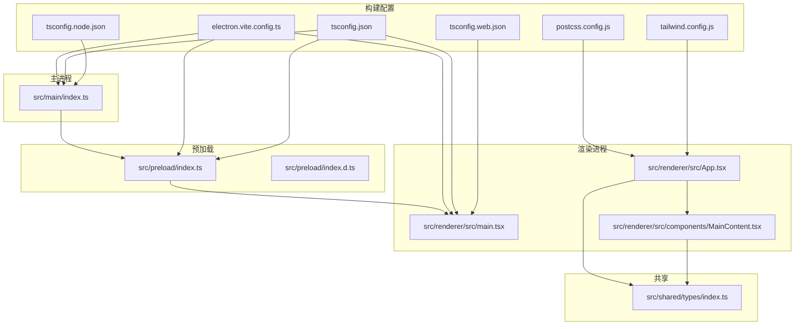
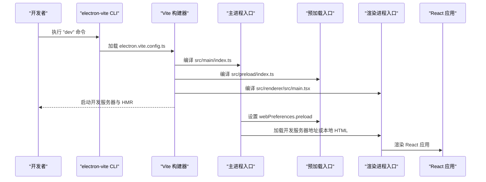
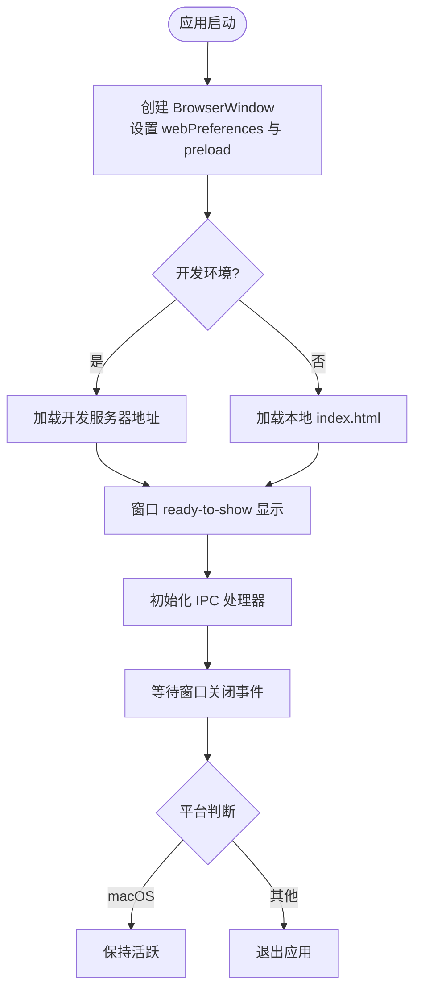
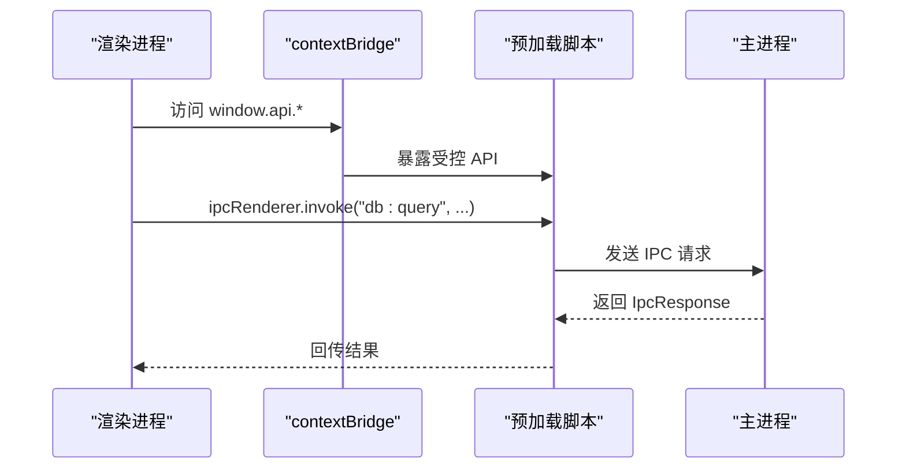
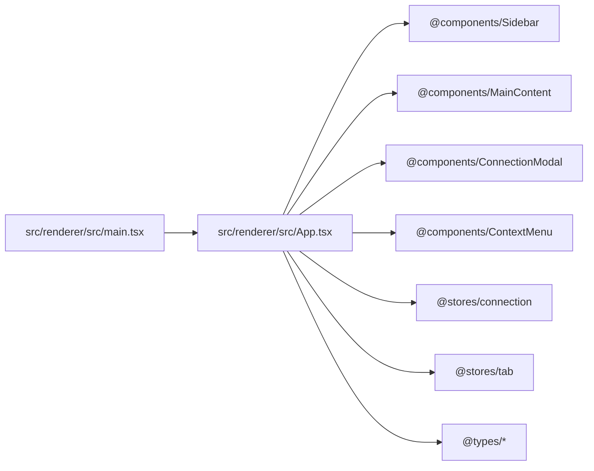
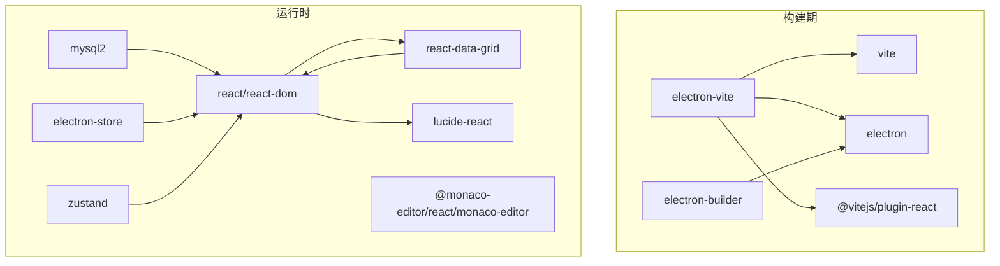

# 开发构建配置

<cite>
**本文引用的文件**
- [electron.vite.config.ts](file://electron.vite.config.ts)
- [package.json](file://package.json)
- [tsconfig.json](file://tsconfig.json)
- [tsconfig.node.json](file://tsconfig.node.json)
- [tsconfig.web.json](file://tsconfig.web.json)
- [src/main/index.ts](file://src/main/index.ts)
- [src/preload/index.ts](file://src/preload/index.ts)
- [src/preload/index.d.ts](file://src/preload/index.d.ts)
- [src/renderer/src/main.tsx](file://src/renderer/src/main.tsx)
- [src/renderer/src/App.tsx](file://src/renderer/src/App.tsx)
- [src/renderer/src/components/MainContent.tsx](file://src/renderer/src/components/MainContent.tsx)
- [src/shared/types/index.ts](file://src/shared/types/index.ts)
- [postcss.config.js](file://postcss.config.js)
- [tailwind.config.js](file://tailwind.config.js)
</cite>

## 目录
1. [简介](#简介)
2. [项目结构](#项目结构)
3. [核心组件](#核心组件)
4. [架构总览](#架构总览)
5. [详细组件分析](#详细组件分析)
6. [依赖关系分析](#依赖关系分析)
7. [性能考虑](#性能考虑)
8. [故障排查指南](#故障排查指南)
9. [结论](#结论)
10. [附录](#附录)

## 简介
本文件系统性梳理了基于 electron-vite 的开发构建配置，重点覆盖以下方面：
- electron-vite 的配置结构与各部分职责
- 主进程、预加载脚本与渲染进程的独立配置
- 路径别名配置（@main、@renderer、@components 等）及其使用方法
- 插件配置：externalizeDepsPlugin 与 @vitejs/plugin-react 的作用
- 开发服务器启动流程与热重载机制
- 开发环境变量与调试设置
- TypeScript 配置与 Vite 的集成方式

## 项目结构
该项目采用“主进程 + 预加载 + 渲染进程”的典型 Electron 架构，配合 Vite 提供的多入口构建能力，实现三端独立编译与开发体验优化。关键目录与职责如下：
- src/main：主进程源码，负责应用生命周期、窗口创建、IPC 初始化等
- src/preload：预加载脚本，负责在隔离上下文中暴露受控 API 给渲染进程
- src/renderer：渲染进程源码，包含 React 应用、组件、状态管理与样式
- src/shared：共享类型与工具，被多端复用
- 根目录配置：electron.vite.config.ts（Vite 多入口配置）、tsconfig.json（根 TS 配置）、tsconfig.node.json（主进程/预加载 TS 配置）、tsconfig.web.json（渲染进程 TS 配置）

图表来源
- [electron.vite.config.ts:1-31](file://electron.vite.config.ts#L1-L31)
- [tsconfig.json:1-29](file://tsconfig.json#L1-L29)
- [tsconfig.node.json:1-20](file://tsconfig.node.json#L1-L20)
- [tsconfig.web.json:1-28](file://tsconfig.web.json#L1-L28)
- [src/main/index.ts:1-64](file://src/main/index.ts#L1-L64)
- [src/preload/index.ts:1-60](file://src/preload/index.ts#L1-L60)
- [src/preload/index.d.ts:1-10](file://src/preload/index.d.ts#L1-L10)
- [src/renderer/src/main.tsx:1-11](file://src/renderer/src/main.tsx#L1-L11)
- [src/renderer/src/App.tsx:1-24](file://src/renderer/src/App.tsx#L1-L24)
- [src/renderer/src/components/MainContent.tsx:1-34](file://src/renderer/src/components/MainContent.tsx#L1-L34)
- [src/shared/types/index.ts:1-124](file://src/shared/types/index.ts#L1-L124)
- [postcss.config.js:1-7](file://postcss.config.js#L1-L7)
- [tailwind.config.js:1-38](file://tailwind.config.js#L1-L38)

章节来源
- [electron.vite.config.ts:1-31](file://electron.vite.config.ts#L1-L31)
- [package.json:1-42](file://package.json#L1-L42)

## 核心组件
本节聚焦 electron-vite 的三大入口配置与 TypeScript 多配置文件协作，以及关键插件的作用。

- 主进程配置（main）
  - 插件：externalizeDepsPlugin，用于将主进程依赖外置，避免打包进主进程包体，提升启动速度与减少体积
  - 路径别名：@main、@shared，便于从主进程代码中引用共享模块与主进程内部模块
- 预加载配置（preload）
  - 插件：externalizeDepsPlugin，同上
  - 用途：在隔离上下文暴露受控 API，供渲染进程调用
- 渲染进程配置（renderer）
  - 路径别名：@renderer、@shared、@components、@stores、@types，统一渲染侧模块解析
  - 插件：@vitejs/plugin-react，启用 React JSX 转换与开发时 HMR
- TypeScript 配置
  - 根 tsconfig.json：统一 compilerOptions，启用路径映射与复合工程 references，分别指向 node/web 子配置
  - tsconfig.node.json：主进程/预加载专用，包含 Electron 与 node 类型声明
  - tsconfig.web.json：渲染进程专用，包含 React JSX 与路径映射

章节来源
- [electron.vite.config.ts:5-30](file://electron.vite.config.ts#L5-L30)
- [tsconfig.json:1-29](file://tsconfig.json#L1-L29)
- [tsconfig.node.json:1-20](file://tsconfig.node.json#L1-L20)
- [tsconfig.web.json:1-28](file://tsconfig.web.json#L1-L28)

## 架构总览
下图展示开发构建阶段的总体流程：Vite 读取 electron-vite 配置，分别对主进程、预加载与渲染进程进行编译；主进程在运行时通过 preload 注入受控 API；渲染进程通过 React 与 TailwindCSS 提供界面与样式。

图表来源
- [package.json:8-15](file://package.json#L8-L15)
- [electron.vite.config.ts:5-30](file://electron.vite.config.ts#L5-L30)
- [src/main/index.ts:35-41](file://src/main/index.ts#L35-L41)
- [src/renderer/src/main.tsx:1-11](file://src/renderer/src/main.tsx#L1-L11)

## 详细组件分析

### 主进程配置与运行时行为
- 入口与窗口创建
  - 主进程入口负责创建 BrowserWindow，设置 webPreferences（包括 preload 路径、contextIsolation、禁用 Node 集成等），并在开发模式下优先加载开发服务器地址，否则加载打包后的本地 HTML
- IPC 初始化
  - 在应用就绪后初始化 IPC 处理器，为后续预加载与渲染进程交互提供支持
- 生命周期处理
  - 窗口关闭与退出策略，macOS 下保持活跃以支持菜单栏常驻

图表来源
- [src/main/index.ts:8-41](file://src/main/index.ts#L8-L41)
- [src/main/index.ts:43-64](file://src/main/index.ts#L43-L64)

章节来源
- [src/main/index.ts:1-64](file://src/main/index.ts#L1-L64)

### 预加载脚本与安全桥接
- 安全上下文
  - 使用 contextBridge 将受控 API 暴露到隔离上下文，确保渲染进程只能通过约定接口访问主进程能力
- API 设计
  - 分类清晰：配置管理、数据库操作等，均通过 ipcRenderer.invoke 与主进程通信
- 类型声明
  - 通过全局类型声明增强 TS 对 window.api 的识别，提升开发体验

图表来源
- [src/preload/index.ts:14-45](file://src/preload/index.ts#L14-L45)
- [src/preload/index.d.ts:3-7](file://src/preload/index.d.ts#L3-L7)
- [src/shared/types/index.ts:104-108](file://src/shared/types/index.ts#L104-L108)

章节来源
- [src/preload/index.ts:1-60](file://src/preload/index.ts#L1-L60)
- [src/preload/index.d.ts:1-10](file://src/preload/index.d.ts#L1-L10)
- [src/shared/types/index.ts:1-124](file://src/shared/types/index.ts#L1-L124)

### 渲染进程与组件生态
- 入口与渲染
  - 渲染入口负责创建 React 根节点并渲染 App
- 组件与状态
  - App 通过 Zustand 状态管理加载连接信息；组件按功能拆分，如 MainContent、QueryEditor、DataTable 等
- 路径别名使用
  - 组件与状态模块广泛使用 @components、@stores 等别名，提升可维护性与一致性

图表来源
- [src/renderer/src/main.tsx:1-11](file://src/renderer/src/main.tsx#L1-L11)
- [src/renderer/src/App.tsx:1-24](file://src/renderer/src/App.tsx#L1-L24)
- [src/renderer/src/components/MainContent.tsx:1-34](file://src/renderer/src/components/MainContent.tsx#L1-L34)
- [src/shared/types/index.ts:1-124](file://src/shared/types/index.ts#L1-L124)

章节来源
- [src/renderer/src/main.tsx:1-11](file://src/renderer/src/main.tsx#L1-L11)
- [src/renderer/src/App.tsx:1-24](file://src/renderer/src/App.tsx#L1-L24)
- [src/renderer/src/components/MainContent.tsx:1-34](file://src/renderer/src/components/MainContent.tsx#L1-L34)

### 路径别名配置与使用
- electron.vite.config.ts 中的别名
  - 主进程：@main、@shared
  - 预加载：无额外别名（默认使用 @shared）
  - 渲染进程：@renderer、@shared、@components、@stores、@types
- TypeScript 路径映射
  - 根 tsconfig.json 与 tsconfig.web.json 均配置了对应的 paths，确保编辑器与编译器一致解析
- 实际使用示例
  - 渲染侧组件与状态模块普遍使用 @components、@stores、@types 等别名，提升可读性与迁移成本

章节来源
- [electron.vite.config.ts:8-29](file://electron.vite.config.ts#L8-L29)
- [tsconfig.json:14-21](file://tsconfig.json#L14-L21)
- [tsconfig.web.json:13-19](file://tsconfig.web.json#L13-L19)
- [src/renderer/src/App.tsx:2-6](file://src/renderer/src/App.tsx#L2-L6)

### 插件配置与作用
- externalizeDepsPlugin
  - 作用：将主进程与预加载中的外部依赖外置，不打入最终包体，降低体积、提升启动速度
  - 应用位置：主进程与预加载入口均启用
- @vitejs/plugin-react
  - 作用：启用 React JSX 转换与开发时 HMR，提升渲染进程开发体验
  - 应用位置：渲染进程入口启用

章节来源
- [electron.vite.config.ts:7-8](file://electron.vite.config.ts#L7-L8)
- [electron.vite.config.ts:16](file://electron.vite.config.ts#L16)
- [electron.vite.config.ts:28](file://electron.vite.config.ts#L28)

### 开发服务器启动流程与热重载机制
- 启动命令
  - 通过 npm/yarn/pnpm 执行 electron-vite dev 启动开发服务器
- 流程概览
  - electron-vite 读取 electron.vite.config.ts，分别编译主进程、预加载与渲染进程
  - 渲染进程启用 HMR，组件更新即时生效
  - 主进程与预加载在开发模式下保持独立编译与重启能力
- 环境变量
  - 主进程在开发模式下通过 ELECTRON_RENDERER_URL 指定渲染进程开发服务器地址，实现热重载联动

章节来源
- [package.json:8-15](file://package.json#L8-L15)
- [src/main/index.ts:36-38](file://src/main/index.ts#L36-L38)

### 开发环境变量与调试设置
- 环境变量
  - ELECTRON_RENDERER_URL：开发模式下指定渲染进程开发服务器地址，主进程加载该地址以启用 HMR
- 调试建议
  - 主进程：使用 VS Code 或其他 IDE 的 Electron 调试配置附加到主进程进程
  - 预加载/渲染进程：利用浏览器开发者工具调试，结合 HMR 快速迭代
  - 类型检查：确保 tsconfig.node.json 与 tsconfig.web.json 正确包含对应入口，避免类型缺失

章节来源
- [src/main/index.ts:36-38](file://src/main/index.ts#L36-L38)
- [tsconfig.node.json:13-18](file://tsconfig.node.json#L13-L18)
- [tsconfig.web.json:21-26](file://tsconfig.web.json#L21-L26)

### TypeScript 配置与 Vite 集成
- 复合工程与引用
  - 根 tsconfig.json 通过 references 引入 tsconfig.node.json 与 tsconfig.web.json，形成复合工程，提升编译性能与类型隔离
- 模块解析策略
  - moduleResolution 使用 bundler，与 Vite 的模块解析兼容良好
- JSX 与路径映射
  - 渲染进程启用 jsx: react-jsx，路径映射与 electron-vite 别名保持一致，确保开发与构建一致
- 类型声明
  - 预加载通过全局类型声明 window.api，保证 TS 对 API 的识别

章节来源
- [tsconfig.json:24-27](file://tsconfig.json#L24-L27)
- [tsconfig.node.json:2-11](file://tsconfig.node.json#L2-L11)
- [tsconfig.web.json:2-12](file://tsconfig.web.json#L2-L12)
- [src/preload/index.d.ts:3-7](file://src/preload/index.d.ts#L3-L7)

## 依赖关系分析
- 构建期依赖
  - electron-vite：提供多入口构建与开发服务器
  - vite：底层构建引擎
  - @vitejs/plugin-react：React JSX 转换与 HMR
  - electron：Electron 运行时
  - electron-builder：打包与发布
- 运行时依赖
  - react/react-dom：渲染层
  - @monaco-editor/react、monaco-editor：代码编辑器
  - react-data-grid：表格组件
  - lucide-react：图标
  - mysql2：数据库驱动
  - electron-store：配置存储
  - zustand：状态管理

图表来源
- [package.json:16-40](file://package.json#L16-L40)

章节来源
- [package.json:16-40](file://package.json#L16-L40)

## 性能考虑
- 外置依赖
  - 主进程与预加载启用 externalizeDepsPlugin，减少包体体积，提升冷启动速度
- 模块解析
  - 使用 bundler 解析策略与路径映射，降低模块查找开销
- HMR
  - 渲染进程启用 React HMR，显著缩短开发反馈周期
- 样式管线
  - TailwindCSS 与 PostCSS 配置合理，按需生成样式，避免冗余

## 故障排查指南
- 症状：渲染进程无法访问 window.api
  - 检查预加载是否正确通过 contextBridge 暴露 API，确认 preload 路径与 webPreferences 配置一致
  - 参考：[src/preload/index.ts:50-60](file://src/preload/index.ts#L50-L60)
- 症状：开发服务器无法热重载
  - 确认主进程已设置 ELECTRON_RENDERER_URL 并指向开发服务器地址
  - 参考：[src/main/index.ts:36-38](file://src/main/index.ts#L36-L38)
- 症状：类型错误或模块解析失败
  - 检查 tsconfig.node.json 与 tsconfig.web.json 是否包含对应入口，确保 paths 与 electron-vite 别名一致
  - 参考：[tsconfig.node.json:13-18](file://tsconfig.node.json#L13-L18)，[tsconfig.web.json:21-26](file://tsconfig.web.json#L21-L26)，[electron.vite.config.ts:8-29](file://electron.vite.config.ts#L8-L29)
- 症状：构建报错或包体过大
  - 确认 externalizeDepsPlugin 已在主进程与预加载启用，避免将外部依赖打包进主进程
  - 参考：[electron.vite.config.ts:7-8](file://electron.vite.config.ts#L7-L8)，[electron.vite.config.ts:16](file://electron.vite.config.ts#L16)

章节来源
- [src/preload/index.ts:50-60](file://src/preload/index.ts#L50-L60)
- [src/main/index.ts:36-38](file://src/main/index.ts#L36-L38)
- [tsconfig.node.json:13-18](file://tsconfig.node.json#L13-L18)
- [tsconfig.web.json:21-26](file://tsconfig.web.json#L21-L26)
- [electron.vite.config.ts:7-8](file://electron.vite.config.ts#L7-L8)

## 结论
本项目通过 electron-vite 的多入口配置与 TypeScript 复合工程，实现了主进程、预加载与渲染进程的清晰分离与高效开发体验。路径别名与插件配置进一步提升了可维护性与开发效率。遵循本文档的配置与最佳实践，可在保证安全性的同时获得快速迭代的开发体验。

## 附录
- 构建与预览命令
  - 开发：npm run dev
  - 构建：npm run build
  - 预览：npm run preview
  - 平台打包：npm run build:mac / build:win / build:linux
- 样式与主题
  - TailwindCSS 配置位于 tailwind.config.js，PostCSS 插件位于 postcss.config.js
- 共享类型
  - 所有跨端类型定义集中在 src/shared/types/index.ts，供主进程、预加载与渲染进程共享

章节来源
- [package.json:8-15](file://package.json#L8-L15)
- [tailwind.config.js:1-38](file://tailwind.config.js#L1-L38)
- [postcss.config.js:1-7](file://postcss.config.js#L1-L7)
- [src/shared/types/index.ts:1-124](file://src/shared/types/index.ts#L1-L124)