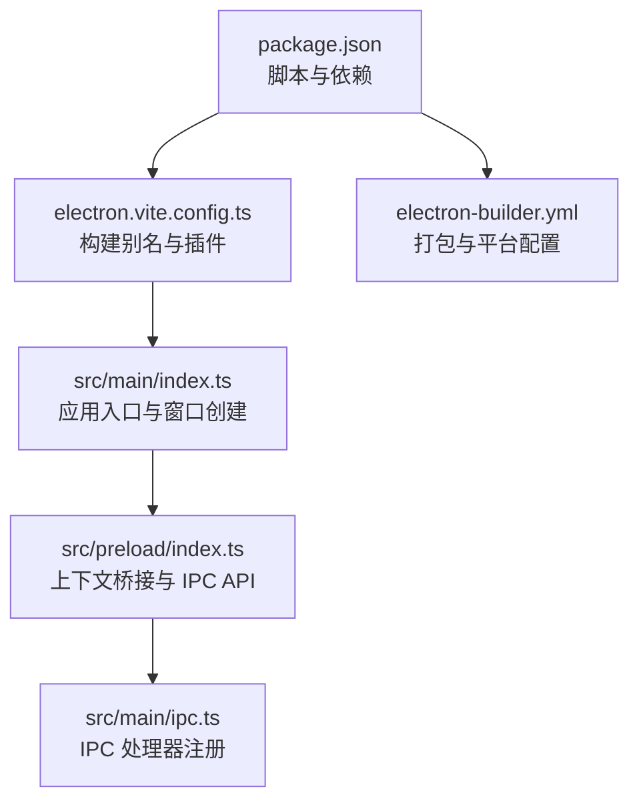
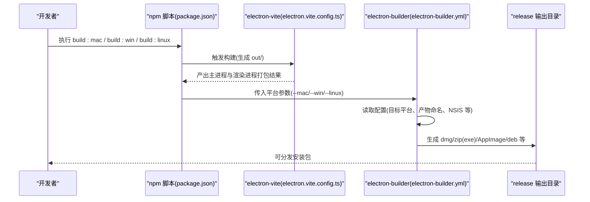
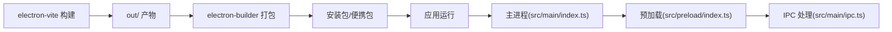

# 打包与分发

<cite>
**本文引用的文件**
- [electron-builder.yml](file://electron-builder.yml)
- [package.json](file://package.json)
- [electron.vite.config.ts](file://electron.vite.config.ts)
- [src/main/index.ts](file://src/main/index.ts)
- [src/preload/index.ts](file://src/preload/index.ts)
- [src/main/ipc.ts](file://src/main/ipc.ts)
</cite>

## 目录
1. [简介](#简介)
2. [项目结构](#项目结构)
3. [核心组件](#核心组件)
4. [架构总览](#架构总览)
5. [详细组件分析](#详细组件分析)
6. [依赖关系分析](#依赖关系分析)
7. [性能考虑](#性能考虑)
8. [故障排查指南](#故障排查指南)
9. [结论](#结论)
10. [附录](#附录)

## 简介
本文件面向应用打包与分发场景，基于仓库中的现有配置，系统性说明如何使用 electron-builder 进行跨平台构建、产物命名与目标格式、平台特定配置、安装包格式选择（如 .exe、.dmg、.deb）、以及与当前应用启动流程的衔接。同时给出可扩展的签名与自动更新建议路径，帮助团队在现有基础上完善 CI/CD 流程与版本管理策略。

## 项目结构
本项目采用 Electron + React 技术栈，使用 electron-vite 进行开发与构建；打包与分发通过 electron-builder 完成。关键目录与文件如下：
- 构建入口与打包配置：electron-builder.yml、package.json、electron.vite.config.ts
- 主进程与渲染进程：src/main/index.ts、src/preload/index.ts、src/main/ipc.ts
- 其他工具链：postcss.config.js、tailwind.config.js、tsconfig*.json 等

图表来源
- [package.json:1-42](file://package.json#L1-L42)
- [electron.vite.config.ts:1-31](file://electron.vite.config.ts#L1-L31)
- [src/main/index.ts:1-64](file://src/main/index.ts#L1-L64)
- [src/preload/index.ts:1-60](file://src/preload/index.ts#L1-L60)
- [src/main/ipc.ts:1-182](file://src/main/ipc.ts#L1-L182)
- [electron-builder.yml:1-34](file://electron-builder.yml#L1-L34)

章节来源
- [package.json:1-42](file://package.json#L1-L42)
- [electron.vite.config.ts:1-31](file://electron.vite.config.ts#L1-L31)
- [electron-builder.yml:1-34](file://electron-builder.yml#L1-L34)

## 核心组件
- 打包配置（electron-builder.yml）
  - 应用标识与输出目录：appId、productName、directories.output
  - 文件过滤规则：files 中的通配符排除项
  - 平台目标与产物命名：mac、win、linux 下的 target 与 artifactName
  - NSIS 安装器行为：oneClick、perMachine、allowToChangeInstallationDirectory
  - ASAR 解包：asarUnpack 指定资源目录解包
- 构建脚本（package.json scripts）
  - 开发与构建：dev、build、preview
  - 平台独立构建：build:mac、build:win、build:linux
- 构建别名（electron.vite.config.ts）
  - 主进程、预加载、渲染进程路径别名，便于模块导入与打包

章节来源
- [electron-builder.yml:1-34](file://electron-builder.yml#L1-L34)
- [package.json:8-14](file://package.json#L8-L14)
- [electron.vite.config.ts:5-29](file://electron.vite.config.ts#L5-L29)

## 架构总览
下图展示从构建脚本到打包配置，再到最终产物的总体流程：

图表来源
- [package.json:8-14](file://package.json#L8-L14)
- [electron.vite.config.ts:1-31](file://electron.vite.config.ts#L1-L31)
- [electron-builder.yml:15-33](file://electron-builder.yml#L15-L33)

## 详细组件分析

### electron-builder.yml 配置详解
- 基础元数据与目录
  - appId、productName：用于应用标识与产物名称
  - directories.buildResources：构建资源目录
  - directories.output：打包产物输出目录
- 文件过滤
  - 使用通配符排除开发文件、源码、配置文件等，避免将无关内容打入安装包
- 平台目标与产物命名
  - macOS：默认生成 dmg 与 zip，artifactName 使用 productName、version、arch、ext 组合
  - Windows：默认生成 nsis 与 zip，artifactName 使用 productName、version、setup、ext 组合
  - Linux：默认生成 AppImage 与 deb，artifactName 使用 productName、version、ext 组合
- NSIS 安装器行为
  - oneClick=false：非一键安装
  - perMachine=false：默认为当前用户安装
  - allowToChangeInstallationDirectory=true：允许用户修改安装目录
- ASAR 解包
  - asarUnpack 指定 resources/** 目录解包，确保运行时可访问资源文件

章节来源
- [electron-builder.yml:1-34](file://electron-builder.yml#L1-L34)

### package.json 构建脚本与依赖
- 构建脚本
  - dev/build/preview：开发、构建、预览
  - build:mac/build:win/build:linux：分别针对不同平台的打包命令
- 依赖
  - electron、electron-builder、electron-vite 等核心依赖

章节来源
- [package.json:8-14](file://package.json#L8-L14)
- [package.json:33-40](file://package.json#L33-L40)

### electron-vite 配置与别名
- 主进程、预加载、渲染进程分别配置了外部化依赖插件与路径别名
- 别名覆盖 @main、@preload、@renderer、@components、@stores、@types 等，提升模块导入清晰度

章节来源
- [electron.vite.config.ts:5-29](file://electron.vite.config.ts#L5-L29)

### 应用入口与窗口创建（主进程）
- 创建 BrowserWindow，设置窗口尺寸、最小宽高、标题栏样式、背景色、webPreferences 等
- 预加载脚本路径指向预加载文件
- 开发模式与生产模式分别加载 dev server 或本地打包页面
- macOS 窗口标题栏样式为隐藏式，以契合平台风格

章节来源
- [src/main/index.ts:8-41](file://src/main/index.ts#L8-L41)

### 预加载与 IPC API
- 通过 contextBridge 将 api 暴露至渲染进程
- 定义配置管理与数据库操作相关的 IPC 调用接口
- 在隔离上下文中安全暴露 API，避免直接注入全局对象

章节来源
- [src/preload/index.ts:14-48](file://src/preload/index.ts#L14-L48)

### IPC 处理器注册与错误日志
- 注册配置与数据库相关 IPC 处理函数
- 统一错误日志记录与错误消息提取，便于定位问题
- 断开连接时清理数据库连接状态

章节来源
- [src/main/ipc.ts:46-177](file://src/main/ipc.ts#L46-L177)

### 打包目标与产物格式
- macOS
  - 目标：dmg、zip
  - 适合分发给普通用户与开发者快速试用
- Windows
  - 目标：nsis、zip
  - nsis 支持交互式安装，zip 适合便携版
- Linux
  - 目标：AppImage、deb
  - AppImage 无需安装即可运行；deb 适合 Debian/Ubuntu 生态

章节来源
- [electron-builder.yml:15-33](file://electron-builder.yml#L15-L33)

### 便携版与安装版构建差异
- 安装版（nsis）
  - 通过 NSIS 安装器进行安装，写入系统路径，支持卸载程序
- 便携版（zip）
  - 直接打包为压缩包，解压即用，适合无管理员权限或临时使用场景
- 当前配置中，各平台均提供 zip 作为便携版选项

章节来源
- [electron-builder.yml:15-33](file://electron-builder.yml#L15-L33)

### 自动更新机制（配置与实现建议）
- 配置建议
  - 在 electron-builder.yml 中添加 publish 字段，指定发布渠道（如 GitHub Releases、私有服务器）
  - 设置 provider（github、generic、s3 等）与必要凭据
- 实现建议
  - 在主进程中集成自动更新逻辑（如基于 electron-updater），在应用启动后检查更新
  - 结合版本号与发布通道（stable、beta）进行差异化推送
- 注意事项
  - 需要为各平台配置签名与公证（尤其是 macOS），以避免系统拦截
  - 发布渠道需具备稳定的下载能力与 HTTPS 支持

[本节为通用实践说明，不直接分析具体文件，故无“章节来源”]

### 版本管理与发布渠道策略
- 版本号管理
  - 使用 package.json 的 version 字段作为应用版本
  - 通过语义化版本（SemVer）管理主次补丁版本
- 发布渠道
  - 稳定版：稳定发布，面向普通用户
  - 内测/测试版：alpha/beta，面向早期用户与测试团队
- 产物命名
  - artifactName 已按平台约定包含版本号与架构信息，便于区分版本与平台

章节来源
- [package.json:3](file://package.json#L3)
- [electron-builder.yml:19-33](file://electron-builder.yml#L19-L33)

### CI/CD 集成与自动化部署（流程建议）
- 构建矩阵
  - macOS：使用 Xcode 工具链，执行 build:mac
  - Windows：使用 MSVC 或 MinGW，执行 build:win
  - Linux：使用 AppImage/Deb 构建，执行 build:linux
- 签名与公证
  - macOS：Apple Developer 证书与公证
  - Windows：代码签名证书（时间戳、根证书链）
  - Linux：无需签名，但建议校验完整性
- 自动发布
  - 将产物上传至发布渠道（GitHub Releases、私有 CDN）
  - 更新更新服务器索引，供应用自动更新拉取
- 安全与缓存
  - 缓存 node_modules 与 electron 缓存，提升构建速度
  - 对敏感凭据使用 CI 密钥管理

[本节为通用实践说明，不直接分析具体文件，故无“章节来源”]

## 依赖关系分析
electron-builder 与应用启动流程的耦合点主要体现在以下方面：
- 构建阶段：electron-vite 产出主进程与渲染进程代码，供 electron-builder 打包
- 运行阶段：主进程根据平台设置窗口样式与加载策略，预加载脚本提供安全 API，IPC 处理器承载业务逻辑

图表来源
- [electron.vite.config.ts:1-31](file://electron.vite.config.ts#L1-L31)
- [electron-builder.yml:1-34](file://electron-builder.yml#L1-L34)
- [src/main/index.ts:1-64](file://src/main/index.ts#L1-L64)
- [src/preload/index.ts:1-60](file://src/preload/index.ts#L1-L60)
- [src/main/ipc.ts:1-182](file://src/main/ipc.ts#L1-L182)

## 性能考虑
- 构建性能
  - 合理使用 electron-vite 的 externalizeDepsPlugin，减少打包体积与编译时间
  - 控制 asarUnpack 范围，避免将过多资源解包导致启动延迟
- 产物体积
  - files 过滤规则尽量精确，避免将开发文件、日志、大体积资源打入安装包
- 运行性能
  - 预加载脚本仅暴露必要 API，降低上下文桥接成本
  - IPC 错误日志统一处理，避免异常传播影响主线程稳定性

[本节提供一般性指导，不直接分析具体文件，故无“章节来源”]

## 故障排查指南
- 打包失败或产物缺失
  - 检查 electron-builder.yml 的 files 过滤规则是否误排除了必要文件
  - 确认 electron-vite 构建已成功生成 out/ 目录
- 平台签名问题
  - macOS：确认 Apple Developer 证书与公证流程
  - Windows：确认代码签名证书有效且包含时间戳
- 安装器行为异常
  - NSIS oneClick/perMachine/安装目录修改等行为由配置决定，核对对应字段
- 运行期错误
  - 查看主进程日志与 IPC 错误消息，定位数据库连接或查询异常

章节来源
- [electron-builder.yml:25-28](file://electron-builder.yml#L25-L28)
- [src/main/ipc.ts:16-44](file://src/main/ipc.ts#L16-L44)

## 结论
本项目已具备跨平台打包的基础配置：明确的应用标识、平台目标与产物命名、NSIS 行为控制与资源解包策略。结合现有的构建脚本与 electron-vite 配置，可稳定产出 dmg/zip/exe/AppImage/deb 等多种格式。为进一步完善分发体系，建议补充签名与公证流程、自动更新配置与发布渠道策略，并在 CI/CD 中实现自动化构建与发布。

## 附录
- 关键配置位置参考
  - 打包配置：[electron-builder.yml:1-34](file://electron-builder.yml#L1-L34)
  - 构建脚本：[package.json:8-14](file://package.json#L8-L14)
  - 构建别名：[electron.vite.config.ts:5-29](file://electron.vite.config.ts#L5-L29)
  - 应用入口：[src/main/index.ts:8-41](file://src/main/index.ts#L8-L41)
  - 预加载 API：[src/preload/index.ts:14-48](file://src/preload/index.ts#L14-L48)
  - IPC 处理器：[src/main/ipc.ts:46-177](file://src/main/ipc.ts#L46-L177)