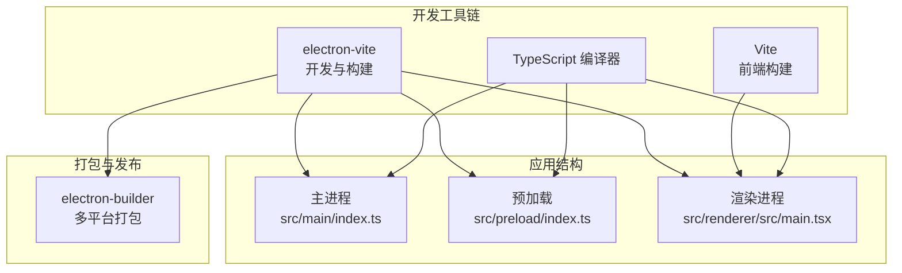
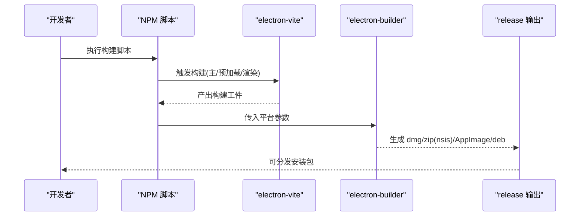
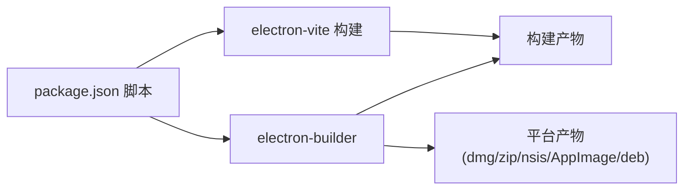

# 构建与部署

<cite>
**本文引用的文件**
- [package.json](file://package.json)
- [electron.vite.config.ts](file://electron.vite.config.ts)
- [electron-builder.yml](file://electron-builder.yml)
- [tsconfig.json](file://tsconfig.json)
- [tsconfig.node.json](file://tsconfig.node.json)
- [tsconfig.web.json](file://tsconfig.web.json)
- [src/main/index.ts](file://src/main/index.ts)
- [src/preload/index.ts](file://src/preload/index.ts)
- [src/renderer/src/main.tsx](file://src/renderer/src/main.tsx)
- [postcss.config.js](file://postcss.config.js)
- [tailwind.config.js](file://tailwind.config.js)
</cite>

## 目录
1. [简介](#简介)
2. [项目结构](#项目结构)
3. [核心组件](#核心组件)
4. [架构总览](#架构总览)
5. [详细组件分析](#详细组件分析)
6. [依赖关系分析](#依赖关系分析)
7. [性能考虑](#性能考虑)
8. [故障排查指南](#故障排查指南)
9. [结论](#结论)
10. [附录](#附录)

## 简介
本指南面向 nexSql 项目的构建与部署，覆盖开发构建与生产构建的配置与流程；详解 electron-vite 的配置项与自定义方式；文档化 electron-builder 的打包配置及多平台目标产物；给出构建脚本的使用说明与参数；说明应用签名与发布流程；提供构建优化与性能调优建议；解释 CI/CD 集成与自动化部署方案；并汇总常见构建问题的排查与解决思路。

## 项目结构
项目采用 Electron + React + TypeScript 技术栈，使用 electron-vite 进行开发与构建，electron-builder 负责打包与分发。TypeScript 多配置文件分别服务于主进程、预加载与渲染进程，确保类型隔离与路径别名一致。

图表来源
- [electron.vite.config.ts:1-31](file://electron.vite.config.ts#L1-L31)
- [package.json:8-15](file://package.json#L8-L15)
- [src/main/index.ts:1-64](file://src/main/index.ts#L1-L64)
- [src/preload/index.ts:1-60](file://src/preload/index.ts#L1-L60)
- [src/renderer/src/main.tsx:1-11](file://src/renderer/src/main.tsx#L1-L11)
- [electron-builder.yml:1-34](file://electron-builder.yml#L1-L34)

章节来源
- [package.json:8-15](file://package.json#L8-L15)
- [electron.vite.config.ts:1-31](file://electron.vite.config.ts#L1-L31)
- [tsconfig.json:1-29](file://tsconfig.json#L1-L29)
- [tsconfig.node.json:1-20](file://tsconfig.node.json#L1-L20)
- [tsconfig.web.json:1-28](file://tsconfig.web.json#L1-L28)

## 核心组件
- 构建脚本与命令
  - 开发：通过 electron-vite dev 启动热更新开发服务器
  - 生产：通过 electron-vite build 打包主进程、预加载与渲染进程
  - 平台打包：通过 electron-builder 对应平台参数进行打包
- electron-vite 配置
  - 主进程、预加载、渲染进程三入口分别设置插件与路径别名
  - 使用 externalizeDepsPlugin 将依赖外置以提升构建速度
- electron-builder 配置
  - 应用元信息、输出目录、打包排除规则、各平台目标产物与命名模板
  - Windows 安装器为 nsis，macOS 支持 dmg/zip，Linux 支持 AppImage/deb
- TypeScript 多配置
  - tsconfig.json 作为根配置，包含路径映射与引用其他 tsconfig
  - tsconfig.node.json 限定主进程与共享类型编译范围
  - tsconfig.web.json 限定渲染进程与共享类型编译范围

章节来源
- [package.json:8-15](file://package.json#L8-L15)
- [electron.vite.config.ts:5-30](file://electron.vite.config.ts#L5-L30)
- [electron-builder.yml:1-34](file://electron-builder.yml#L1-L34)
- [tsconfig.json:14-27](file://tsconfig.json#L14-L27)
- [tsconfig.node.json:13-19](file://tsconfig.node.json#L13-L19)
- [tsconfig.web.json:21-27](file://tsconfig.web.json#L21-L27)

## 架构总览
下图展示从开发到打包的关键流程：开发者运行脚本 → electron-vite 构建 → electron-builder 打包 → 生成多平台安装包。

图表来源
- [package.json:8-15](file://package.json#L8-L15)
- [electron.vite.config.ts:1-31](file://electron.vite.config.ts#L1-L31)
- [electron-builder.yml:15-33](file://electron-builder.yml#L15-L33)

## 详细组件分析

### electron-vite 配置与自定义
- 主进程
  - 使用 externalizeDepsPlugin 外置依赖，减少打包体积与提升构建速度
  - 设置路径别名 @main 与 @shared，便于模块组织与导入
- 预加载
  - 同样使用 externalizeDepsPlugin，保证与主进程一致的外置策略
- 渲染进程
  - 引入 React 插件，启用 JSX 与路径别名
  - 别名包括 @renderer、@components、@stores、@types，统一前端工程化
- 自定义建议
  - 如需启用 CSS Modules 或样式后处理器，可在渲染进程 plugins 中追加对应插件
  - 若引入 Node 特性或原生模块，应在主进程配置中调整 externalizeDepsPlugin 的行为或显式声明

章节来源
- [electron.vite.config.ts:5-30](file://electron.vite.config.ts#L5-L30)

### electron-builder 打包配置
- 基础信息
  - appId、productName、输出目录、资源目录
- 文件打包规则
  - 排除开发相关文件与配置，仅保留运行所需文件
- 多平台目标
  - macOS：dmg、zip
  - Windows：nsis、zip
  - Linux：AppImage、deb
- 安装器细节
  - Windows NSIS：可选安装目录、单击安装等策略
- 产物命名
  - 使用变量模板统一命名风格，便于版本管理与分发

章节来源
- [electron-builder.yml:1-34](file://electron-builder.yml#L1-L34)

### TypeScript 多配置体系
- 根 tsconfig
  - 统一路径映射与引用 node/web 配置
- tsconfig.node
  - 限定主进程与共享类型编译范围，包含 electron-vite/node 类型
- tsconfig.web
  - 限定渲染进程与共享类型编译范围，包含 React JSX 与路径映射

章节来源
- [tsconfig.json:14-27](file://tsconfig.json#L14-L27)
- [tsconfig.node.json:13-19](file://tsconfig.node.json#L13-L19)
- [tsconfig.web.json:21-27](file://tsconfig.web.json#L21-L27)

### 构建脚本与参数
- 开发脚本
  - dev：启动 electron-vite 开发服务器，支持热更新
- 生产脚本
  - build：执行 electron-vite 生产构建
  - preview：本地预览构建结果
- 平台脚本
  - build:mac、build:win、build:linux：先构建再按平台打包
- 参数说明
  - electron-builder 支持 --mac、--win、--linux 等参数，用于指定目标平台
  - 可结合 CI 环境变量控制签名与发布

章节来源
- [package.json:8-15](file://package.json#L8-L15)

### 应用签名与发布流程
- 签名
  - macOS：使用 Apple Developer 证书对 dmg/zip 进行签名与公证
  - Windows：使用代码签名证书对 nsis 安装包进行签名
  - Linux：通常无需签名，但可对 AppImage 进行额外校验
- 发布
  - 可将产物上传至制品库或分发平台
  - 结合 CI/CD 实现自动发布

（本节为通用实践说明，不直接分析具体文件）

### CI/CD 集成与自动化部署
- 典型流程
  - 触发构建：拉取代码 → 安装依赖 → 执行 npm run build
  - 多平台打包：在不同作业中分别执行 build:mac/build:win/build:linux
  - 产物收集：将 release 目录中的安装包归档
  - 自动发布：根据分支或标签触发发布流程
- 环境变量
  - 可通过环境变量传递签名证书、仓库 Token 等敏感信息
- 缓存策略
  - 缓存 node_modules 与 electron-builder 缓存目录，提升构建速度

（本节为通用实践说明，不直接分析具体文件）

### 开发构建与生产构建对比
- 开发构建
  - electron-vite dev 提供热更新与调试能力
  - 主进程加载开发服务器地址，渲染进程由 Vite 提供服务
- 生产构建
  - electron-vite build 产出可分发的主/预加载/渲染进程代码
  - electron-builder 根据平台生成安装包

章节来源
- [src/main/index.ts:35-41](file://src/main/index.ts#L35-L41)
- [package.json:8-15](file://package.json#L8-L15)

## 依赖关系分析
electron-vite 与 electron-builder 的协作关系如下：

图表来源
- [package.json:8-15](file://package.json#L8-L15)
- [electron.vite.config.ts:1-31](file://electron.vite.config.ts#L1-L31)
- [electron-builder.yml:15-33](file://electron-builder.yml#L15-L33)

章节来源
- [package.json:8-15](file://package.json#L8-L15)
- [electron.vite.config.ts:1-31](file://electron.vite.config.ts#L1-L31)
- [electron-builder.yml:15-33](file://electron-builder.yml#L15-L33)

## 性能考虑
- 外置依赖
  - 主进程与预加载使用 externalizeDepsPlugin，减少打包体积与提升构建速度
- 路径别名
  - 统一的路径别名减少相对路径层级，提高编辑器与编译器的解析效率
- 类型隔离
  - 分离 tsconfig.node 与 tsconfig.web，避免不必要的类型扫描
- CSS 工具链
  - Tailwind 与 Autoprefixer 已配置，建议在生产构建时开启压缩与摇树优化

章节来源
- [electron.vite.config.ts:7,16](file://electron.vite.config.ts#L7,L16)
- [tsconfig.node.json:13-19](file://tsconfig.node.json#L13-L19)
- [tsconfig.web.json:21-27](file://tsconfig.web.json#L21-L27)
- [postcss.config.js:1-7](file://postcss.config.js#L1-L7)
- [tailwind.config.js:1-38](file://tailwind.config.js#L1-L38)

## 故障排查指南
- 开发环境无法加载页面
  - 检查主进程是否正确读取开发服务器地址与渲染进程入口
  - 确认开发服务器已启动且端口未被占用
- 打包后窗口空白或白屏
  - 确认生产模式下主进程加载的是打包后的 HTML 路径
  - 检查渲染进程构建是否成功，静态资源是否正确输出
- 平台产物缺失或命名异常
  - 检查 electron-builder 的平台目标与命名模板
  - 确认构建脚本传入了正确的平台参数
- 类型错误或路径解析失败
  - 校验 tsconfig.node 与 tsconfig.web 的 include 范围
  - 确保路径别名在 tsconfig 与 vite 配置中保持一致
- 样式未生效
  - 确认 Tailwind 与 Autoprefixer 已正确配置
  - 检查构建后 CSS 是否被正确注入与压缩

章节来源
- [src/main/index.ts:35-41](file://src/main/index.ts#L35-L41)
- [electron-builder.yml:19,23,33](file://electron-builder.yml#L19,L23,L33)
- [tsconfig.json:14-27](file://tsconfig.json#L14-L27)
- [tsconfig.node.json:13-19](file://tsconfig.node.json#L13-L19)
- [tsconfig.web.json:21-27](file://tsconfig.web.json#L21-L27)
- [postcss.config.js:1-7](file://postcss.config.js#L1-L7)
- [tailwind.config.js:3,36](file://tailwind.config.js#L3,L36)

## 结论
本指南基于现有配置文件梳理了 nexSql 的构建与部署流程，明确了 electron-vite 与 electron-builder 的职责边界，并提供了性能优化与故障排查建议。建议在 CI/CD 中按平台拆分作业，结合签名与自动化发布实现稳定交付。

## 附录
- 关键文件清单
  - 构建与打包：package.json、electron.vite.config.ts、electron-builder.yml
  - 类型配置：tsconfig.json、tsconfig.node.json、tsconfig.web.json
  - 应用入口：src/main/index.ts、src/preload/index.ts、src/renderer/src/main.tsx
  - 样式工具：postcss.config.js、tailwind.config.js

（本节为概览性内容，不直接分析具体文件）