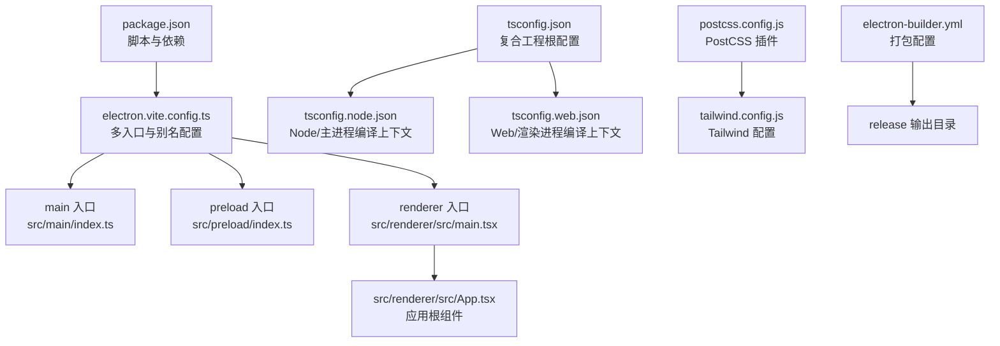
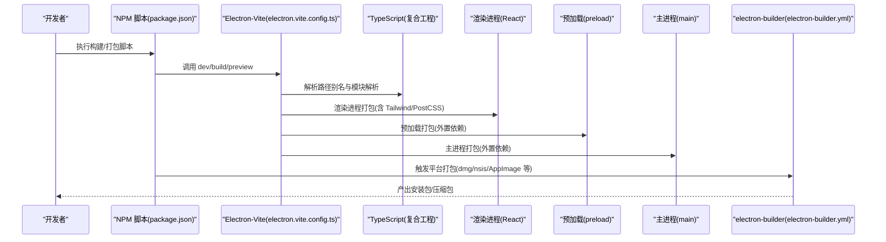
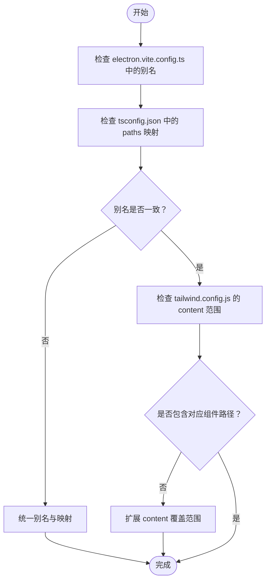
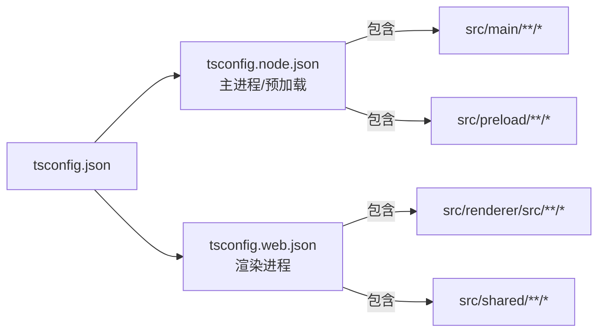
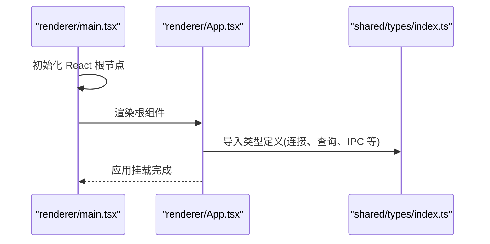
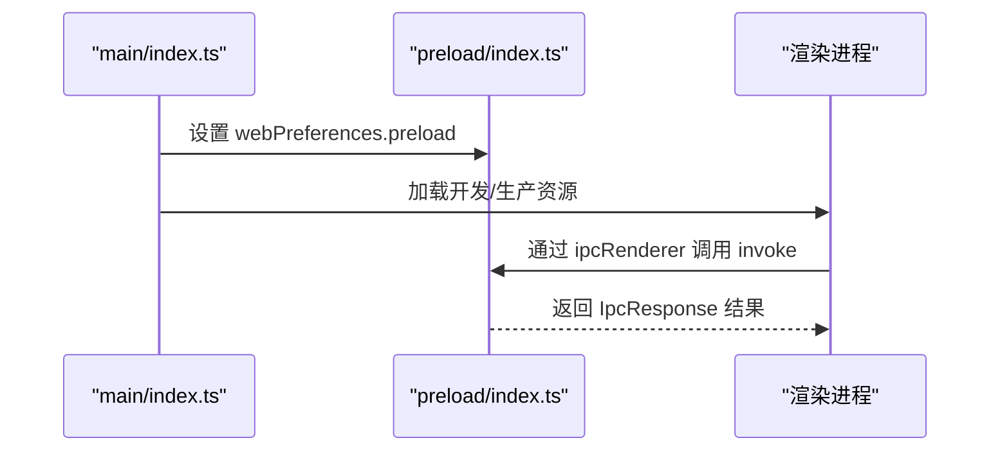
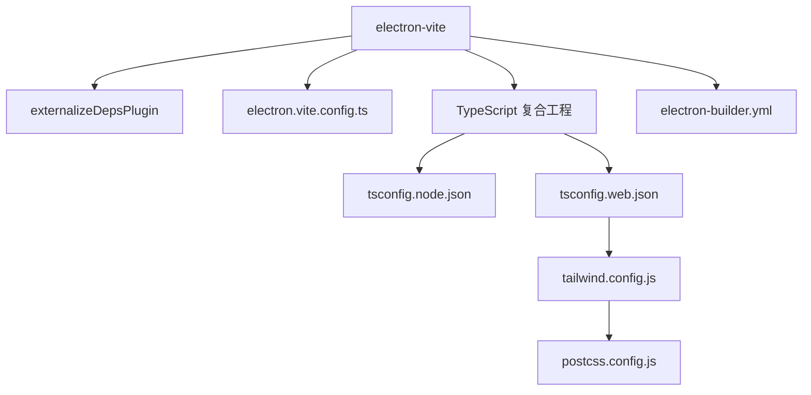

# 构建问题排查

<cite>
**本文引用的文件**
- [package.json](file://package.json)
- [electron.vite.config.ts](file://electron.vite.config.ts)
- [tsconfig.json](file://tsconfig.json)
- [tsconfig.node.json](file://tsconfig.node.json)
- [tsconfig.web.json](file://tsconfig.web.json)
- [electron-builder.yml](file://electron-builder.yml)
- [postcss.config.js](file://postcss.config.js)
- [tailwind.config.js](file://tailwind.config.js)
- [src/main/index.ts](file://src/main/index.ts)
- [src/preload/index.ts](file://src/preload/index.ts)
- [src/renderer/src/App.tsx](file://src/renderer/src/App.tsx)
- [src/renderer/src/main.tsx](file://src/renderer/src/main.tsx)
- [src/shared/types/index.ts](file://src/shared/types/index.ts)
</cite>

## 目录
1. [简介](#简介)
2. [项目结构](#项目结构)
3. [核心组件](#核心组件)
4. [架构总览](#架构总览)
5. [详细组件分析](#详细组件分析)
6. [依赖关系分析](#依赖关系分析)
7. [性能与构建速度优化](#性能与构建速度优化)
8. [故障排除指南](#故障排除指南)
9. [结论](#结论)
10. [附录：常用命令与调试工具](#附录常用命令与调试工具)

## 简介
本指南面向 nexSql 项目的构建与打包流程，聚焦于 Electron + Vite + React + TypeScript 的多环境构建场景。内容涵盖常见构建错误（依赖冲突、路径别名、模块解析、TS 编译、打包产物、平台差异）的诊断与修复；提供日志分析与错误定位技巧；给出性能优化与调试工具使用建议。

## 项目结构
项目采用 Electron-Vite 多入口架构，区分主进程、预加载脚本与渲染进程三类源码，并通过 TypeScript 复合工程拆分 Node 与 Web 编译上下文。TailwindCSS 与 PostCSS 负责样式管线。

图表来源
- [package.json:1-42](file://package.json#L1-L42)
- [electron.vite.config.ts:1-31](file://electron.vite.config.ts#L1-L31)
- [tsconfig.json:1-29](file://tsconfig.json#L1-L29)
- [tsconfig.node.json:1-20](file://tsconfig.node.json#L1-L20)
- [tsconfig.web.json:1-28](file://tsconfig.web.json#L1-L28)
- [postcss.config.js:1-7](file://postcss.config.js#L1-L7)
- [tailwind.config.js:1-38](file://tailwind.config.js#L1-L38)
- [electron-builder.yml:1-34](file://electron-builder.yml#L1-L34)

章节来源
- [package.json:1-42](file://package.json#L1-L42)
- [electron.vite.config.ts:1-31](file://electron.vite.config.ts#L1-L31)
- [tsconfig.json:1-29](file://tsconfig.json#L1-L29)
- [tsconfig.node.json:1-20](file://tsconfig.node.json#L1-L20)
- [tsconfig.web.json:1-28](file://tsconfig.web.json#L1-L28)
- [postcss.config.js:1-7](file://postcss.config.js#L1-L7)
- [tailwind.config.js:1-38](file://tailwind.config.js#L1-L38)
- [electron-builder.yml:1-34](file://electron-builder.yml#L1-L34)

## 核心组件
- 构建脚本与打包
  - 开发：electron-vite dev
  - 生产：electron-vite build
  - 预览：electron-vite preview
  - 平台打包：分别调用 electron-vite build 后由 electron-builder 生成 dmg/zip（macOS）、nsis/zip（Windows）、AppImage/deb（Linux）
- 多入口与别名
  - 主进程与预加载：externalizeDepsPlugin 外置依赖，减少打包体积
  - 渲染进程：@renderer/@components/@stores/@types 等路径别名映射到 src/renderer/src 与 src/shared
- TypeScript 复合工程
  - 根 tsconfig.json 引用 node/web 两个子配置，分别约束主进程与渲染进程编译选项
- 样式管线
  - Tailwind 内容扫描覆盖渲染入口 HTML 与 src/renderer/src 下的 TS/JS/TSX 文件
  - PostCSS 使用 tailwindcss 与 autoprefixer 插件

章节来源
- [package.json:8-15](file://package.json#L8-L15)
- [electron.vite.config.ts:5-30](file://electron.vite.config.ts#L5-L30)
- [tsconfig.json:24-27](file://tsconfig.json#L24-L27)
- [tsconfig.node.json:13-18](file://tsconfig.node.json#L13-L18)
- [tsconfig.web.json:21-26](file://tsconfig.web.json#L21-L26)
- [tailwind.config.js:3](file://tailwind.config.js#L3)
- [postcss.config.js:1-7](file://postcss.config.js#L1-L7)

## 架构总览
下图展示从开发到打包的关键流程与组件交互。

图表来源
- [package.json:8-15](file://package.json#L8-L15)
- [electron.vite.config.ts:5-30](file://electron.vite.config.ts#L5-L30)
- [tsconfig.json:24-27](file://tsconfig.json#L24-L27)
- [electron-builder.yml:15-33](file://electron-builder.yml#L15-L33)

## 详细组件分析

### 组件一：路径别名与模块解析
- 别名范围
  - 主进程/预加载：@main、@shared
  - 渲染进程：@renderer、@shared、@components、@stores、@types
- 影响点
  - TypeScript 路径映射与 baseUrl 必须与 Vite 别名一致，避免“无法解析模块”或“类型检查失败”
  - Tailwind 内容扫描需覆盖实际使用的组件路径，否则样式不生效

图表来源
- [electron.vite.config.ts:8-29](file://electron.vite.config.ts#L8-L29)
- [tsconfig.json:14-21](file://tsconfig.json#L14-L21)
- [tailwind.config.js:3](file://tailwind.config.js#L3)

章节来源
- [electron.vite.config.ts:8-29](file://electron.vite.config.ts#L8-L29)
- [tsconfig.json:14-21](file://tsconfig.json#L14-L21)
- [tailwind.config.js:3](file://tailwind.config.js#L3)

### 组件二：TypeScript 复合工程与编译上下文
- 根配置引用 node/web 子配置，确保主进程与渲染进程分别满足 Node/Electron 与浏览器运行时要求
- 关键编译选项
  - moduleResolution: bundler
  - strict、skipLibCheck、resolveJsonModule、isolatedModules 等提升类型安全与构建稳定性
  - jsx: react-jsx 与 React 运行时配合

图表来源
- [tsconfig.json:24-27](file://tsconfig.json#L24-L27)
- [tsconfig.node.json:13-18](file://tsconfig.node.json#L13-L18)
- [tsconfig.web.json:21-26](file://tsconfig.web.json#L21-L26)

章节来源
- [tsconfig.json:2-12](file://tsconfig.json#L2-L12)
- [tsconfig.node.json:2-11](file://tsconfig.node.json#L2-L11)
- [tsconfig.web.json:2-11](file://tsconfig.web.json#L2-L11)

### 组件三：渲染进程入口与组件结构
- 入口文件负责挂载 React 应用，确保 DOM 容器存在且样式已加载
- 应用根组件引入侧边栏、主内容区、连接模态框与上下文菜单等，这些组件均通过路径别名导入

图表来源
- [src/renderer/src/main.tsx:1-11](file://src/renderer/src/main.tsx#L1-L11)
- [src/renderer/src/App.tsx:1-35](file://src/renderer/src/App.tsx#L1-L35)
- [src/shared/types/index.ts:1-124](file://src/shared/types/index.ts#L1-L124)

章节来源
- [src/renderer/src/main.tsx:1-11](file://src/renderer/src/main.tsx#L1-L11)
- [src/renderer/src/App.tsx:1-35](file://src/renderer/src/App.tsx#L1-L35)
- [src/shared/types/index.ts:1-124](file://src/shared/types/index.ts#L1-L124)

### 组件四：主进程与预加载脚本
- 主进程负责创建窗口、加载预加载脚本、处理生命周期事件
- 预加载通过 contextBridge 暴露受限 API 至渲染进程，IPC 命名遵循约定

图表来源
- [src/main/index.ts:1-64](file://src/main/index.ts#L1-L64)
- [src/preload/index.ts:1-60](file://src/preload/index.ts#L1-L60)

章节来源
- [src/main/index.ts:1-64](file://src/main/index.ts#L1-L64)
- [src/preload/index.ts:14-45](file://src/preload/index.ts#L14-L45)

## 依赖关系分析
- 构建链路依赖
  - electron-vite 提供多入口与别名解析
  - externalizeDepsPlugin 将 Electron/Node 依赖外置，降低打包体积
  - electron-builder 负责跨平台打包与产物命名
- 样式依赖
  - Tailwind 与 PostCSS 插件在构建阶段执行，需确保内容扫描路径正确
- 类型依赖
  - Node/Electron 类型在 node 子配置中声明，渲染进程 JSX 由 web 子配置控制

图表来源
- [electron.vite.config.ts:5-30](file://electron.vite.config.ts#L5-L30)
- [tsconfig.node.json:11](file://tsconfig.node.json#L11)
- [tsconfig.web.json:11](file://tsconfig.web.json#L11)
- [tailwind.config.js:3](file://tailwind.config.js#L3)
- [postcss.config.js:1-7](file://postcss.config.js#L1-L7)
- [electron-builder.yml:15-33](file://electron-builder.yml#L15-L33)

章节来源
- [electron.vite.config.ts:5-30](file://electron.vite.config.ts#L5-L30)
- [tsconfig.node.json:11](file://tsconfig.node.json#L11)
- [tsconfig.web.json:11](file://tsconfig.web.json#L11)
- [tailwind.config.js:3](file://tailwind.config.js#L3)
- [postcss.config.js:1-7](file://postcss.config.js#L1-L7)
- [electron-builder.yml:15-33](file://electron-builder.yml#L15-L33)

## 性能与构建速度优化
- 外置依赖
  - 使用 externalizeDepsPlugin 将 Electron/Node 依赖外置，减少打包体积与时间
- 并行与增量
  - 使用现代打包器的并行能力；在本地开发中优先使用 dev 模式进行迭代
- 资源裁剪
  - Tailwind 内容扫描仅保留必要路径，避免扫描过多文件
- 缓存与磁盘
  - 清理 node_modules/.vite 缓存，确保磁盘空间充足
- 平台差异化
  - 不同平台的打包工具链差异较大，优先在目标平台进行最终打包验证

[本节为通用建议，无需列出章节来源]

## 故障排除指南

### 一、依赖冲突与版本不匹配
- 症状
  - 构建时报错提示找不到模块或版本不兼容
- 诊断步骤
  - 对照 electron-vite 与 electron-builder 的 Node 版本要求，确认本地 Node 版本满足最低要求
  - 检查 package.json 中依赖版本范围，避免同时安装多个不兼容版本
- 修复建议
  - 固定关键依赖版本，或使用锁定文件保证一致性
  - 清理 node_modules 并重新安装

章节来源
- [package.json:27-40](file://package.json#L27-L40)
- [electron-builder.yml:15-33](file://electron-builder.yml#L15-L33)

### 二、路径别名与模块解析失败
- 症状
  - “Cannot find module” 或 “无法解析模块” 错误
- 诊断步骤
  - 对比 electron.vite.config.ts 的别名与 tsconfig.json 的 paths 是否一致
  - 确认 Tailwind content 是否覆盖到实际组件路径
- 修复建议
  - 统一别名与映射，确保渲染进程组件路径被 Tailwind 扫描

章节来源
- [electron.vite.config.ts:8-29](file://electron.vite.config.ts#L8-L29)
- [tsconfig.json:14-21](file://tsconfig.json#L14-L21)
- [tailwind.config.js:3](file://tailwind.config.js#L3)

### 三、TypeScript 编译错误
- 常见原因
  - 严格模式导致的类型不兼容
  - 模块解析策略与打包器不匹配
  - JSX 运行时与 React 版本不一致
- 诊断步骤
  - 查看编译输出中的具体类型错误位置
  - 确认 tsconfig.node/web 的编译选项与运行时一致
- 修复建议
  - 调整 strict、skipLibCheck、moduleResolution 等选项
  - 确保 React 与 JSX 配置一致

章节来源
- [tsconfig.json:2-12](file://tsconfig.json#L2-L12)
- [tsconfig.node.json:2-11](file://tsconfig.node.json#L2-L11)
- [tsconfig.web.json:2-11](file://tsconfig.web.json#L2-L11)

### 四、打包产物缺失或平台不匹配
- 症状
  - 仅生成部分平台产物或产物不可用
- 诊断步骤
  - 检查 electron-builder.yml 的 target 与输出目录配置
  - 确认各平台打包工具链可用（如 macOS 的 dmg 工具、Windows 的 NSIS）
- 修复建议
  - 按需选择平台脚本（build:mac/build:win/build:linux），并在目标平台执行

章节来源
- [electron-builder.yml:15-33](file://electron-builder.yml#L15-L33)
- [package.json:12-14](file://package.json#L12-L14)

### 五、内存不足、磁盘空间与权限问题
- 症状
  - 构建过程中 OOM、磁盘空间不足、写入权限失败
- 诊断步骤
  - 监控构建过程的内存占用峰值
  - 检查 node_modules/.vite 缓存大小与磁盘剩余空间
- 修复建议
  - 清理缓存与临时文件，释放磁盘空间
  - 在更高内存的机器或 CI 环境中执行构建
  - 确保对输出目录具有写权限

[本节为通用建议，无需列出章节来源]

### 六、不同操作系统下的构建差异
- Windows
  - 使用 nsis/zip 目标；注意路径分隔符与大小写敏感性
- macOS
  - 使用 dmg/zip 目标；注意签名与沙盒配置
- Linux
  - 使用 AppImage/deb 目标；注意依赖库与桌面集成
- 建议
  - 在各平台本地进行最终验证，CI 中按平台矩阵执行

章节来源
- [electron-builder.yml:15-33](file://electron-builder.yml#L15-L33)
- [package.json:12-14](file://package.json#L12-L14)

### 七、构建日志分析与错误定位技巧
- 关注点
  - electron-vite 的别名解析与模块打包日志
  - TypeScript 的类型检查与编译进度
  - Tailwind 的内容扫描与警告
- 实用技巧
  - 使用 --mode 或环境变量切换开发/生产模式
  - 逐步注释组件以缩小问题范围
  - 分离主/预加载/渲染进程的构建日志，逐个排查

[本节为通用建议，无需列出章节来源]

## 结论
本指南围绕 Electron-Vite + React + TypeScript 的多入口构建体系，系统梳理了路径别名、模块解析、TS 编译、样式管线与打包产物的关键环节。通过统一配置、严格类型与平台化验证，可显著降低构建失败率并提升定位效率。

[本节为总结性内容，无需列出章节来源]

## 附录：常用命令与调试工具
- 开发与构建
  - npm run dev：启动开发服务器
  - npm run build：生产构建
  - npm run preview：预览构建产物
  - npm run build:mac / build:win / build:linux：按平台打包
- 调试要点
  - 检查 electron.vite.config.ts 的别名与 externalizeDepsPlugin
  - 校验 tsconfig.node/web 的编译选项与 include/references
  - 确认 tailwind.config.js 的 content 路径覆盖渲染组件
  - 使用最小化示例复现问题，逐步恢复依赖与配置

章节来源
- [package.json:8-15](file://package.json#L8-L15)
- [electron.vite.config.ts:5-30](file://electron.vite.config.ts#L5-L30)
- [tsconfig.json:24-27](file://tsconfig.json#L24-L27)
- [tailwind.config.js:3](file://tailwind.config.js#L3)