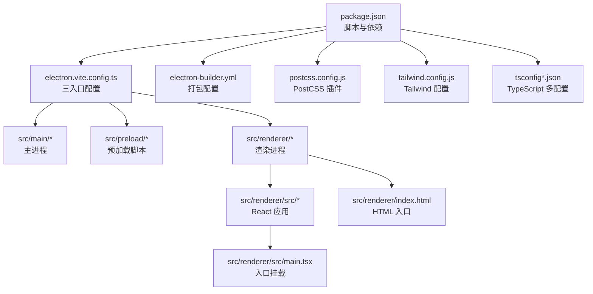
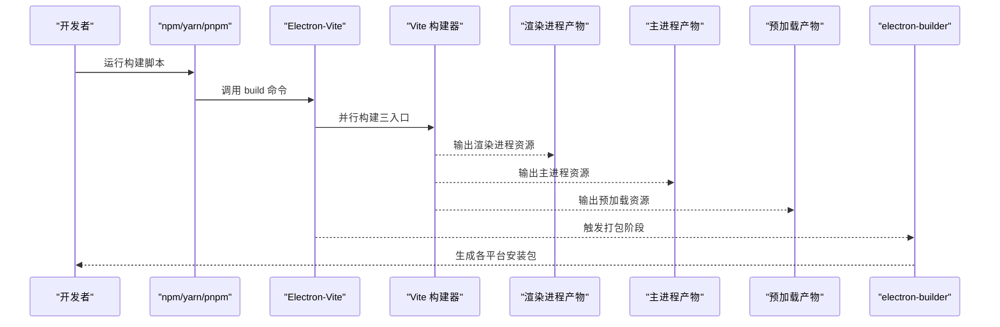
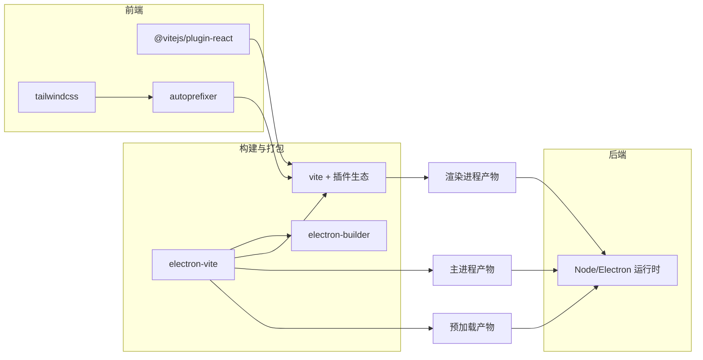

# 生产构建配置

<cite>
**本文引用的文件**
- [package.json](file://package.json)
- [electron.vite.config.ts](file://electron.vite.config.ts)
- [electron-builder.yml](file://electron-builder.yml)
- [postcss.config.js](file://postcss.config.js)
- [tailwind.config.js](file://tailwind.config.js)
- [tsconfig.json](file://tsconfig.json)
- [tsconfig.node.json](file://tsconfig.node.json)
- [tsconfig.web.json](file://tsconfig.web.json)
- [src/main/index.ts](file://src/main/index.ts)
- [src/renderer/src/main.tsx](file://src/renderer/src/main.tsx)
- [src/renderer/index.html](file://src/renderer/index.html)
- [src/preload/index.ts](file://src/preload/index.ts)
</cite>

## 目录
1. [简介](#简介)
2. [项目结构](#项目结构)
3. [核心组件](#核心组件)
4. [架构总览](#架构总览)
5. [详细组件分析](#详细组件分析)
6. [依赖关系分析](#依赖关系分析)
7. [性能考量](#性能考量)
8. [故障排查指南](#故障排查指南)
9. [结论](#结论)
10. [附录](#附录)

## 简介
本指南面向生产环境，围绕基于 Electron-Vite 的多端（主进程、预加载脚本、渲染进程）构建体系，系统阐述生产构建优化策略与配置要点，包括：
- 如何在生产环境下禁用开发相关插件与行为
- 资源压缩、代码分割与打包优化
- 静态资源处理与路径重写规则
- 生产环境变量与安全注意事项
- 构建产物结构与文件组织
- 性能与构建时间优化建议
- 产物验证与质量检查方法

## 项目结构
该项目采用 Electron-Vite 双入口（main/preload/renderer）与 Vite React 插件的组合，配合 TailwindCSS 与 PostCSS 进行样式处理，并通过 electron-builder 进行跨平台打包。

图表来源
- [package.json:1-42](file://package.json#L1-L42)
- [electron.vite.config.ts:1-31](file://electron.vite.config.ts#L1-L31)
- [electron-builder.yml:1-34](file://electron-builder.yml#L1-L34)
- [postcss.config.js:1-7](file://postcss.config.js#L1-L7)
- [tailwind.config.js:1-38](file://tailwind.config.js#L1-L38)
- [tsconfig.json:1-29](file://tsconfig.json#L1-L29)
- [tsconfig.node.json:1-20](file://tsconfig.node.json#L1-L20)
- [tsconfig.web.json:1-28](file://tsconfig.web.json#L1-L28)

章节来源
- [package.json:1-42](file://package.json#L1-L42)
- [electron.vite.config.ts:1-31](file://electron.vite.config.ts#L1-L31)
- [electron-builder.yml:1-34](file://electron-builder.yml#L1-L34)
- [postcss.config.js:1-7](file://postcss.config.js#L1-L7)
- [tailwind.config.js:1-38](file://tailwind.config.js#L1-L38)
- [tsconfig.json:1-29](file://tsconfig.json#L1-L29)
- [tsconfig.node.json:1-20](file://tsconfig.node.json#L1-L20)
- [tsconfig.web.json:1-28](file://tsconfig.web.json#L1-L28)

## 核心组件
- 构建脚本与命令：通过 npm scripts 统一触发 electron-vite 构建与打包；支持按平台的二次打包。
- 三入口配置：主进程、预加载脚本、渲染进程分别配置别名与插件，确保模块解析与开发体验一致。
- 打包与分发：electron-builder 控制产物目录、打包目标与安装器类型。
- 样式管线：TailwindCSS 与 Autoprefixer 通过 PostCSS 配置启用，内容扫描范围限定在渲染侧。
- TypeScript 多配置：区分 Node 与 Web 端编译目标与路径映射，提升类型检查效率。

章节来源
- [package.json:8-14](file://package.json#L8-L14)
- [electron.vite.config.ts:5-30](file://electron.vite.config.ts#L5-L30)
- [electron-builder.yml:3-34](file://electron-builder.yml#L3-L34)
- [postcss.config.js:1-7](file://postcss.config.js#L1-L7)
- [tailwind.config.js:3-38](file://tailwind.config.js#L3-L38)
- [tsconfig.json:14-27](file://tsconfig.json#L14-L27)
- [tsconfig.node.json:13-19](file://tsconfig.node.json#L13-L19)
- [tsconfig.web.json:13-26](file://tsconfig.web.json#L13-L26)

## 架构总览
下图展示生产构建从触发到产物产出的关键流程与组件交互。

图表来源
- [package.json:8-14](file://package.json#L8-L14)
- [electron.vite.config.ts:5-30](file://electron.vite.config.ts#L5-L30)
- [electron-builder.yml:12-14](file://electron-builder.yml#L12-L14)

## 详细组件分析

### 1) 生产构建命令与流程
- 使用统一构建命令触发三入口并行构建，随后由 electron-builder 生成平台安装包。
- 建议在 CI 中设置只读文件系统与最小化缓存，以稳定构建结果。

章节来源
- [package.json:8-14](file://package.json#L8-L14)

### 2) 三入口配置与开发/生产差异
- 主进程与预加载使用外部化依赖插件，避免将 Node 依赖打入最终包体，减小体积并提升安全性。
- 渲染进程启用 React 插件，确保 JSX 编译与开发热更新。
- 别名配置在三入口保持一致，便于共享路径与模块解析。

章节来源
- [electron.vite.config.ts:6-29](file://electron.vite.config.ts#L6-L29)

### 3) 样式与内容扫描
- Tailwind 内容扫描限定在渲染 HTML 与 TSX 文件，避免样式被意外裁剪或扫描到无关文件。
- PostCSS 启用 Tailwind 与 Autoprefixer，确保兼容性与输出整洁。

章节来源
- [tailwind.config.js:3](file://tailwind.config.js#L3)
- [postcss.config.js:1-7](file://postcss.config.js#L1-L7)

### 4) TypeScript 多配置与路径映射
- 根 tsconfig 引用 node/web 两个子配置，分别约束主进程与渲染进程的编译目标与路径映射。
- 通过路径映射减少相对路径复杂度，提升可维护性。

章节来源
- [tsconfig.json:14-27](file://tsconfig.json#L14-L27)
- [tsconfig.node.json:13-19](file://tsconfig.node.json#L13-L19)
- [tsconfig.web.json:13-26](file://tsconfig.web.json#L13-L26)

### 5) 打包与分发配置
- 输出目录与构建资源目录清晰分离，仅包含必要文件。
- 排除开发相关文件与锁文件，降低包体与泄露风险。
- 平台目标与安装器命名模板明确，便于自动化分发。

章节来源
- [electron-builder.yml:3-14](file://electron-builder.yml#L3-L14)
- [electron-builder.yml:15-33](file://electron-builder.yml#L15-L33)

### 6) 渲染进程入口与 CSP
- 渲染入口 HTML 设置了基础 CSP，限制默认来源与脚本来源，提升安全性。
- 开发模式下通过环境变量切换加载地址，生产模式加载打包后的本地 HTML。

章节来源
- [src/renderer/index.html:6](file://src/renderer/index.html#L6)
- [src/main/index.ts:36-40](file://src/main/index.ts#L36-L40)

### 7) 预加载脚本与 IPC 桥接
- 预加载脚本通过 contextBridge 暴露受限 API 至隔离上下文，遵循最小暴露原则。
- 所有数据库与配置操作经由 IPC 调用，避免在渲染层直接访问 Node/Electron API。

章节来源
- [src/preload/index.ts:14-59](file://src/preload/index.ts#L14-L59)

### 8) 构建产物结构与文件组织
- 产物输出由 electron-vite 与 electron-builder 协同完成，主/预加载/渲染三部分分别产出。
- 打包后产物仅包含运行所需资源，开发配置与源码不进入发布包。

章节来源
- [electron.vite.config.ts:5-30](file://electron.vite.config.ts#L5-L30)
- [electron-builder.yml:3-14](file://electron-builder.yml#L3-L14)

## 依赖关系分析

图表来源
- [package.json:27-40](file://package.json#L27-L40)
- [electron.vite.config.ts:3](file://electron.vite.config.ts#L3)
- [postcss.config.js:1-7](file://postcss.config.js#L1-L7)
- [tailwind.config.js:1-38](file://tailwind.config.js#L1-L38)

章节来源
- [package.json:27-40](file://package.json#L27-L40)
- [electron.vite.config.ts:3](file://electron.vite.config.ts#L3)
- [postcss.config.js:1-7](file://postcss.config.js#L1-L7)
- [tailwind.config.js:1-38](file://tailwind.config.js#L1-L38)

## 性能考量
- 并行构建：利用 Electron-Vite 对三入口并行构建的能力，缩短整体构建时间。
- 依赖外部化：主/预加载使用外部化插件，避免将 Node 依赖打入包体，显著减小体积。
- 样式按需：Tailwind 内容扫描限定在渲染侧，避免无谓的样式计算与输出。
- 构建缓存：CI 中复用 node_modules 与 Vite 缓存目录，减少重复下载与编译。
- 产物裁剪：electron-builder 排除开发文件与锁文件，降低包体与扫描成本。
- 安全前置：CSP 与预加载 API 桥接最小暴露，降低攻击面。

## 故障排查指南
- 构建失败或体积异常
  - 检查 electron-vite 三入口配置是否正确启用外部化与 React 插件。
  - 确认 Tailwind 内容扫描路径覆盖到实际使用的组件文件。
  - 核对 electron-builder 排除规则，避免误排除运行时资源。
- 运行期白屏或资源加载失败
  - 确认主进程根据环境变量选择正确的加载地址（开发服务器或本地 HTML）。
  - 检查 CSP 是否限制了必要的资源加载。
- 预加载 API 不可用
  - 确认 contextBridge 已在隔离上下文中正确暴露 API。
  - 核对 IPC 方法名与参数传递是否与主进程监听一致。

章节来源
- [electron.vite.config.ts:6-29](file://electron.vite.config.ts#L6-L29)
- [tailwind.config.js:3](file://tailwind.config.js#L3)
- [electron-builder.yml:6-12](file://electron-builder.yml#L6-L12)
- [src/main/index.ts:36-40](file://src/main/index.ts#L36-L40)
- [src/renderer/index.html:6](file://src/renderer/index.html#L6)
- [src/preload/index.ts:50-59](file://src/preload/index.ts#L50-L59)

## 结论
通过 Electron-Vite 的三入口并行构建、外部化依赖、Tailwind/Turbo 的样式管线以及 electron-builder 的跨平台打包，本项目在保证开发体验的同时，实现了生产环境的高效与安全。建议在 CI 中固化构建步骤与产物校验，持续优化构建缓存与产物体积，确保交付质量与稳定性。

## 附录
- 生产环境变量与安全
  - 在 CI 中设置只读文件系统与最小权限，避免构建期间修改源码。
  - 使用强 CSP 与最小 API 暴露策略，防止 XSS 与信息泄露。
- 构建产物验证
  - 校验 electron-builder 输出目录包含预期平台产物与安装器。
  - 校验渲染入口 HTML 与 JS/CSS 资源可正常加载。
  - 校验主/预加载产物未包含开发依赖与源码。
- 质量检查清单
  - 依赖外部化生效（主/预加载不包含 Node 依赖）
  - Tailwind 内容扫描覆盖所有组件
  - electron-builder 排除规则正确
  - CSP 与 IPC 桥接符合最小暴露原则