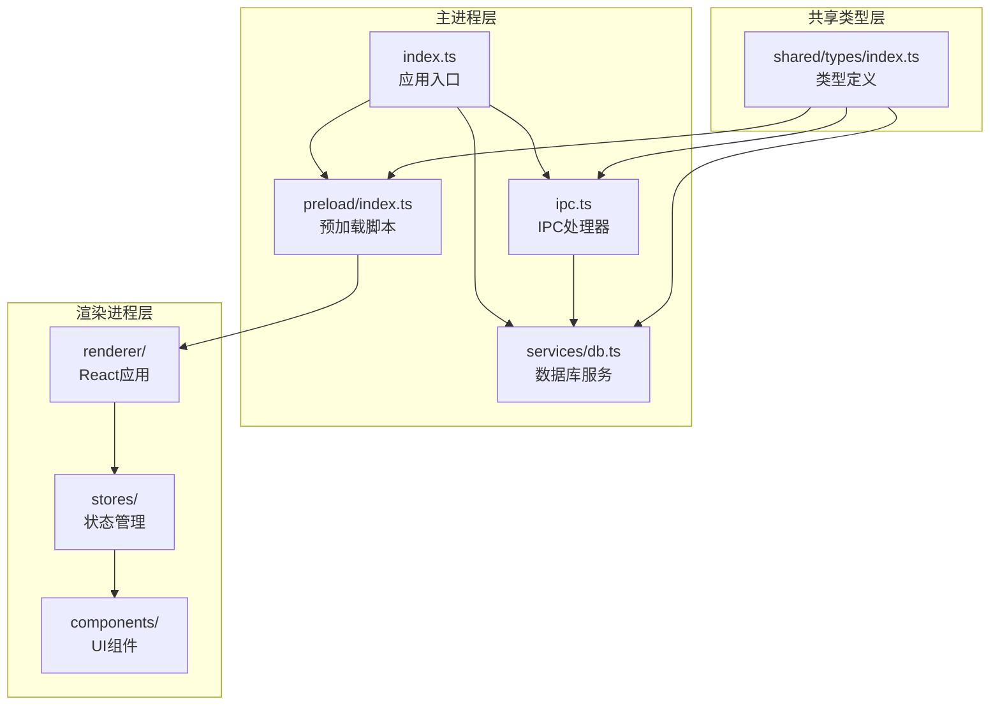
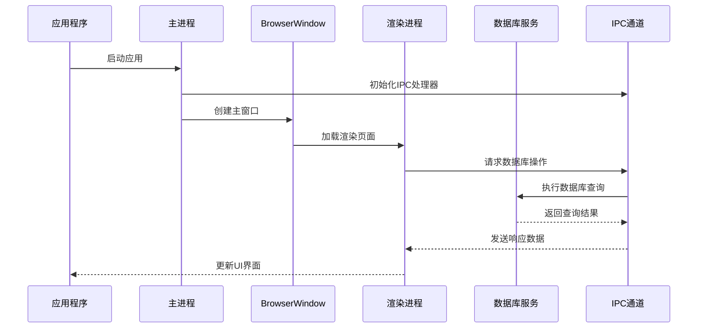
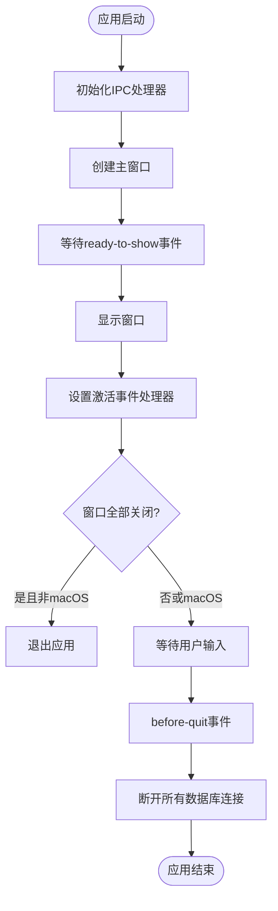
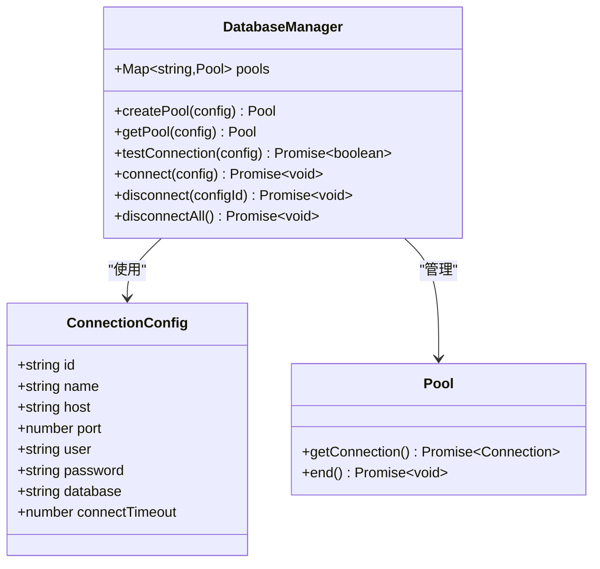
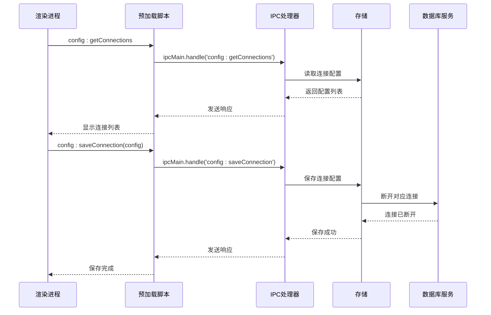
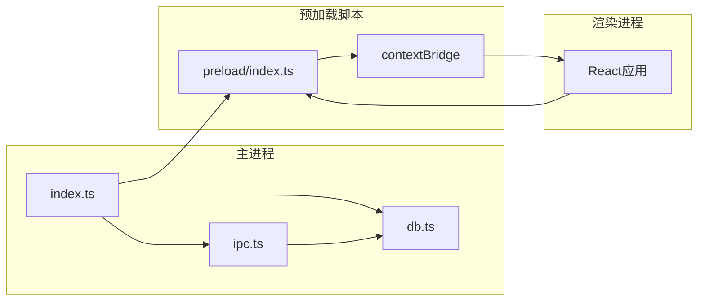

# Electron 主进程架构

<cite>
**本文档引用的文件**
- [src/main/index.ts](file://src/main/index.ts)
- [src/main/services/db.ts](file://src/main/services/db.ts)
- [src/main/ipc.ts](file://src/main/ipc.ts)
- [src/preload/index.ts](file://src/preload/index.ts)
- [src/shared/types/index.ts](file://src/shared/types/index.ts)
- [src/renderer/src/App.tsx](file://src/renderer/src/App.tsx)
- [src/renderer/src/components/ConnectionModal.tsx](file://src/renderer/src/components/ConnectionModal.tsx)
- [src/renderer/src/stores/connection.ts](file://src/renderer/src/stores/connection.ts)
- [electron.vite.config.ts](file://electron.vite.config.ts)
- [package.json](file://package.json)
</cite>

## 目录
1. [简介](#简介)
2. [项目结构](#项目结构)
3. [核心组件](#核心组件)
4. [架构概览](#架构概览)
5. [详细组件分析](#详细组件分析)
6. [依赖关系分析](#依赖关系分析)
7. [性能考量](#性能考量)
8. [故障排除指南](#故障排除指南)
9. [结论](#结论)

## 简介

本项目是一个基于 Electron 的现代化数据库管理工具，采用主进程-渲染进程架构设计。主进程负责应用程序生命周期管理、窗口创建与控制、数据库连接池管理以及进程间通信(IPC)处理。该架构通过严格的进程隔离确保安全性，同时提供了完整的数据库连接管理功能。

## 项目结构

该项目采用模块化组织方式，主要分为以下层次：



**图表来源**
- [src/main/index.ts:1-64](file://src/main/index.ts#L1-L64)
- [src/main/ipc.ts:1-132](file://src/main/ipc.ts#L1-L132)
- [src/main/services/db.ts:1-277](file://src/main/services/db.ts#L1-L277)

**章节来源**
- [src/main/index.ts:1-64](file://src/main/index.ts#L1-L64)
- [electron.vite.config.ts:1-31](file://electron.vite.config.ts#L1-L31)

## 核心组件

### 主进程入口点
主进程入口文件负责应用程序的整体协调工作，包括窗口创建、事件监听和生命周期管理。

### 数据库服务层
实现基于连接池的数据库连接管理，支持多数据库实例的并发访问。

### IPC 通信系统
提供安全的进程间通信接口，封装所有数据库操作和配置管理功能。

### 预加载脚本
在渲染进程中暴露受限的 API 接口，确保安全的跨进程调用。

**章节来源**
- [src/main/index.ts:1-64](file://src/main/index.ts#L1-L64)
- [src/main/services/db.ts:1-277](file://src/main/services/db.ts#L1-L277)
- [src/main/ipc.ts:1-132](file://src/main/ipc.ts#L1-L132)

## 架构概览

该应用采用典型的 Electron 架构模式，通过清晰的职责分离实现高效的应用程序管理：



**图表来源**
- [src/main/index.ts:43-52](file://src/main/index.ts#L43-L52)
- [src/main/ipc.ts:16-127](file://src/main/ipc.ts#L16-L127)
- [src/main/services/db.ts:73-135](file://src/main/services/db.ts#L73-L135)

## 详细组件分析

### 主进程生命周期管理

主进程通过 Electron 的应用事件系统管理应用程序的完整生命周期：

#### 应用启动流程
应用启动时执行以下关键步骤：
1. 初始化 IPC 处理器
2. 创建主窗口实例
3. 设置应用激活事件处理器
4. 配置窗口关闭行为

#### 关键生命周期钩子



**图表来源**
- [src/main/index.ts:43-63](file://src/main/index.ts#L43-L63)

#### 平台特定行为
- **macOS**: 窗口关闭后应用仍保持活跃状态
- **其他平台**: 窗口关闭触发应用退出
- **窗口激活**: 确保应用在 macOS 上正确响应激活事件

**章节来源**
- [src/main/index.ts:43-63](file://src/main/index.ts#L43-L63)

### BrowserWindow 配置详解

主进程中的 BrowserWindow 实现了完整的窗口管理配置：

#### 基础窗口属性
- **尺寸设置**: 固定宽高 1400x900，最小尺寸 900x600
- **显示控制**: 初始隐藏，通过 ready-to-show 事件显示
- **背景色**: 深色主题背景 (#1a1b1e)

#### 菜单栏配置
- **自动隐藏**: 启用 autoHideMenuBar 功能
- **平台差异**: macOS 使用隐藏式标题栏样式，其他平台使用默认样式

#### 安全配置
- **上下文隔离**: 启用 contextIsolation
- **Node集成**: 禁用 nodeIntegration
- **沙箱模式**: 禁用沙箱以获得更好的性能
- **预加载脚本**: 指定专用的预加载脚本路径

#### 窗口行为控制
- **外部链接处理**: 自动打开外部链接到系统默认浏览器
- **开发环境支持**: 支持开发服务器热重载

**章节来源**
- [src/main/index.ts:8-41](file://src/main/index.ts#L8-L41)

### 数据库连接池管理

数据库服务实现了高效的连接池管理机制：

#### 连接池架构


**图表来源**
- [src/main/services/db.ts:4-36](file://src/main/services/db.ts#L4-L36)

#### 连接池特性
- **多实例支持**: 每个连接配置维护独立的连接池
- **连接限制**: 默认最大连接数 5
- **超时配置**: 可配置连接超时时间
- **Keep-Alive**: 启用连接保持活动功能
- **字符集**: 使用 utf8mb4 字符集

#### 数据库操作方法
- **连接测试**: 验证数据库连接可用性
- **连接建立**: 获取连接并验证连通性
- **查询执行**: 支持 SELECT 和 DML 操作
- **元数据查询**: 获取数据库、表、列信息
- **连接断开**: 正确释放数据库连接

**章节来源**
- [src/main/services/db.ts:11-28](file://src/main/services/db.ts#L11-L28)
- [src/main/services/db.ts:38-63](file://src/main/services/db.ts#L38-L63)
- [src/main/services/db.ts:73-135](file://src/main/services/db.ts#L73-L135)

### IPC 通信系统

IPC 系统提供了安全的进程间通信接口：

#### 配置管理 IPC


**图表来源**
- [src/main/ipc.ts:19-43](file://src/main/ipc.ts#L19-L43)
- [src/preload/index.ts:16-23](file://src/preload/index.ts#L16-L23)

#### 数据库操作 IPC
- **连接测试**: `db:testConnection`
- **连接建立**: `db:connect`
- **连接断开**: `db:disconnect`
- **SQL 查询**: `db:query`
- **元数据获取**: `db:getDatabases`, `db:getTables`, `db:getTableColumns`, `db:getTableIndexes`, `db:getTableRowCount`

#### 错误处理机制
所有 IPC 操作都包含完善的错误处理：
- 异步异常捕获
- 用户友好的错误消息
- 成功/失败状态返回

**章节来源**
- [src/main/ipc.ts:16-127](file://src/main/ipc.ts#L16-L127)
- [src/preload/index.ts:25-45](file://src/preload/index.ts#L25-L45)

### 预加载脚本与安全模型

预加载脚本实现了安全的 API 暴露机制：

#### API 接口设计
- **配置管理**: 连接配置的增删改查
- **数据库操作**: 完整的数据库 CRUD 操作
- **类型安全**: 严格的数据类型定义

#### 安全隔离


**图表来源**
- [src/preload/index.ts:12-59](file://src/preload/index.ts#L12-L59)

#### 安全特性
- **上下文隔离**: 禁用 Node.js 集成
- **API 限制**: 仅暴露必要的 IPC 接口
- **错误处理**: 统一的错误处理机制
- **类型检查**: 编译时类型验证

**章节来源**
- [src/preload/index.ts:12-59](file://src/preload/index.ts#L12-L59)

## 依赖关系分析

应用的依赖关系体现了清晰的分层架构：

```mermaid
graph TB
subgraph "运行时依赖"
Electron[electron@^29.1.5]
MySQL[mysql2@^3.9.2]
Store[electron-store@^8.2.0]
React[react@^18.2.0]
end
subgraph "开发时依赖"
Vite[electron-vite@^2.0.0]
Builder[electron-builder@^24.13.3]
TS[typescript@^5.3.3]
Tailwind[tailwindcss@^3.4.1]
end
subgraph "应用代码"
Main[index.ts]
Services[db.ts]
IPC[ipc.ts]
Preload[preload/index.ts]
Types[types/index.ts]
end
Electron --> Main
MySQL --> Services
Store --> IPC
React --> Main
Vite --> Main
Builder --> Main
TS --> Main
Tailwind --> Main
Main --> Services
Main --> IPC
Main --> Preload
Services --> Types
IPC --> Types
Preload --> Types
```

**图表来源**
- [package.json:16-40](file://package.json#L16-L40)

**章节来源**
- [package.json:16-40](file://package.json#L16-L40)

## 性能考量

### 连接池优化
- **连接复用**: 通过连接池减少数据库连接开销
- **并发控制**: 限制最大连接数防止资源耗尽
- **超时管理**: 合理的连接超时配置
- **内存管理**: 及时释放不再使用的连接

### 内存泄漏防护
- **资源清理**: 应用退出时断开所有数据库连接
- **事件监听**: 合理管理事件处理器生命周期
- **定时器清理**: 避免定时器导致的内存泄漏

### 渲染进程优化
- **懒加载**: 按需加载大型组件
- **虚拟滚动**: 大数据集的虚拟化处理
- **状态管理**: 使用轻量级状态管理方案

## 故障排除指南

### 常见问题诊断

#### 数据库连接问题
1. **连接超时**: 检查网络连接和防火墙设置
2. **认证失败**: 验证用户名和密码配置
3. **连接池耗尽**: 调整连接池大小参数
4. **字符集问题**: 确认数据库字符集配置

#### IPC 通信问题
1. **API 调用失败**: 检查预加载脚本是否正确加载
2. **类型不匹配**: 验证共享类型定义的一致性
3. **权限不足**: 确认上下文隔离配置正确

#### 窗口显示问题
1. **窗口不显示**: 检查 ready-to-show 事件处理
2. **菜单栏异常**: 验证 autoHideMenuBar 配置
3. **标题栏样式**: 确认平台特定的标题栏设置

**章节来源**
- [src/main/services/db.ts:38-56](file://src/main/services/db.ts#L38-L56)
- [src/main/ipc.ts:47-54](file://src/main/ipc.ts#L47-L54)

## 结论

该 Electron 主进程架构展现了现代桌面应用开发的最佳实践：

### 架构优势
- **清晰的职责分离**: 主进程、渲染进程、数据库服务各司其职
- **强大的安全性**: 通过上下文隔离和 API 限制确保应用安全
- **高效的性能**: 连接池管理和资源优化提升应用性能
- **良好的扩展性**: 模块化的架构便于功能扩展和维护

### 技术亮点
- **完整的生命周期管理**: 全面的事件处理和资源清理
- **健壮的错误处理**: 统一的错误处理机制和用户反馈
- **跨平台兼容**: 平台特定的适配和优化
- **类型安全**: 完整的 TypeScript 类型定义

该架构为数据库管理工具提供了稳定可靠的技术基础，适合进一步扩展更多数据库支持和高级功能。