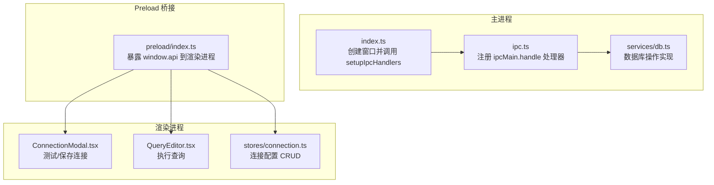
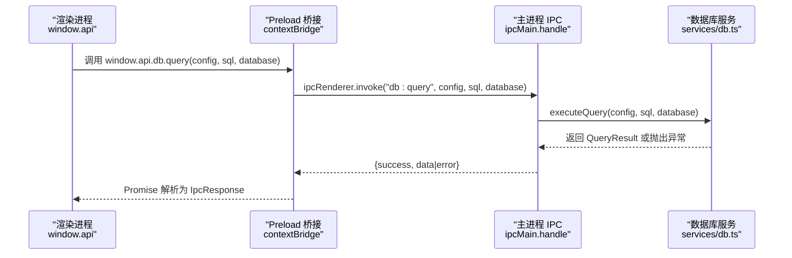
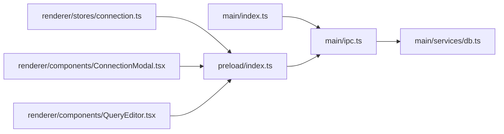

# IPC 处理器

<cite>
**本文引用的文件**
- [src/main/ipc.ts](file://src/main/ipc.ts)
- [src/main/services/db.ts](file://src/main/services/db.ts)
- [src/preload/index.ts](file://src/preload/index.ts)
- [src/main/index.ts](file://src/main/index.ts)
- [src/shared/types/index.ts](file://src/shared/types/index.ts)
- [src/renderer/src/stores/connection.ts](file://src/renderer/src/stores/connection.ts)
- [src/renderer/src/components/ConnectionModal.tsx](file://src/renderer/src/components/ConnectionModal.tsx)
- [src/renderer/src/components/QueryEditor.tsx](file://src/renderer/src/components/QueryEditor.tsx)
</cite>

## 目录
1. [简介](#简介)
2. [项目结构](#项目结构)
3. [核心组件](#核心组件)
4. [架构总览](#架构总览)
5. [详细组件分析](#详细组件分析)
6. [依赖关系分析](#依赖关系分析)
7. [性能考量](#性能考量)
8. [故障排查指南](#故障排查指南)
9. [结论](#结论)
10. [附录](#附录)

## 简介
本文件系统性地梳理了 Electron 主进程中的 IPC 处理器实现与使用方式，重点覆盖以下方面：
- 使用 ipcMain.handle() 的注册机制与消息处理器的组织方式
- 所有已实现的 IPC 接口及其参数、返回值与错误处理策略
- 渲染进程通过 preload 暴露的 API 调用方式与典型使用场景
- 最佳实践与常见问题排查建议

## 项目结构
该应用采用典型的 Electron + React 架构，IPC 层位于主进程，通过 preload 暴露给渲染进程。主要文件分布如下：
- 主进程 IPC 注册与处理器：src/main/ipc.ts
- 数据库服务层：src/main/services/db.ts
- Preload 桥接层：src/preload/index.ts
- 主进程入口：src/main/index.ts
- 共享类型定义：src/shared/types/index.ts
- 渲染侧使用示例：src/renderer/src/components/ConnectionModal.tsx、src/renderer/src/components/QueryEditor.tsx、src/renderer/src/stores/connection.ts

图表来源
- [src/main/index.ts:43-45](file://src/main/index.ts#L43-L45)
- [src/main/ipc.ts:46-177](file://src/main/ipc.ts#L46-L177)
- [src/main/services/db.ts:1-277](file://src/main/services/db.ts#L1-L277)
- [src/preload/index.ts:14-59](file://src/preload/index.ts#L14-L59)
- [src/renderer/src/components/ConnectionModal.tsx:44-65](file://src/renderer/src/components/ConnectionModal.tsx#L44-L65)
- [src/renderer/src/components/QueryEditor.tsx:36-64](file://src/renderer/src/components/QueryEditor.tsx#L36-L64)
- [src/renderer/src/stores/connection.ts:23-45](file://src/renderer/src/stores/connection.ts#L23-L45)

章节来源
- [src/main/index.ts:1-64](file://src/main/index.ts#L1-L64)
- [src/main/ipc.ts:1-182](file://src/main/ipc.ts#L1-L182)
- [src/main/services/db.ts:1-277](file://src/main/services/db.ts#L1-L277)
- [src/preload/index.ts:1-60](file://src/preload/index.ts#L1-L60)
- [src/shared/types/index.ts:1-124](file://src/shared/types/index.ts#L1-L124)

## 核心组件
- 主进程 IPC 注册器：在主进程中集中注册所有 ipcMain.handle 处理器，并统一错误记录与响应格式化。
- 数据库服务层：封装连接池、连接测试、查询执行与元数据查询等能力。
- Preload 桥接层：通过 contextBridge 将安全的 API 暴露给渲染进程，渲染侧通过 window.api 调用。
- 渲染侧使用示例：连接模态框用于测试/保存连接；查询编辑器用于执行 SQL 并展示结果；连接状态存储负责连接配置的增删改查。

章节来源
- [src/main/ipc.ts:46-177](file://src/main/ipc.ts#L46-L177)
- [src/main/services/db.ts:38-269](file://src/main/services/db.ts#L38-L269)
- [src/preload/index.ts:14-59](file://src/preload/index.ts#L14-L59)
- [src/renderer/src/components/ConnectionModal.tsx:44-65](file://src/renderer/src/components/ConnectionModal.tsx#L44-L65)
- [src/renderer/src/components/QueryEditor.tsx:36-64](file://src/renderer/src/components/QueryEditor.tsx#L36-L64)
- [src/renderer/src/stores/connection.ts:23-45](file://src/renderer/src/stores/connection.ts#L23-L45)

## 架构总览
下图展示了从渲染进程发起请求到主进程处理再到数据库服务层执行的整体流程。

图表来源
- [src/preload/index.ts:33-34](file://src/preload/index.ts#L33-L34)
- [src/main/ipc.ts:106-117](file://src/main/ipc.ts#L106-L117)
- [src/main/services/db.ts:73-135](file://src/main/services/db.ts#L73-L135)

## 详细组件分析

### IPC 注册机制与错误处理
- 注册方式：主进程通过 setupIpcHandlers(mainWindow) 统一注册所有处理器，使用 ipcMain.handle(channel, handler)。
- 错误记录：logError 会输出带时间戳的错误信息；getFullErrorMessage 收集错误消息与 requireStack 等附加信息。
- 响应格式：所有处理器均返回 IpcResponse<T>，包含 success、data、error 字段，便于渲染侧统一处理。

章节来源
- [src/main/ipc.ts:46-46](file://src/main/ipc.ts#L46-L46)
- [src/main/ipc.ts:16-44](file://src/main/ipc.ts#L16-L44)
- [src/shared/types/index.ts:104-108](file://src/shared/types/index.ts#L104-L108)

### 配置管理处理器
- config:getConnections
  - 参数：无
  - 返回：ConnectionConfig[]（连接列表）
  - 错误：无（读取本地存储）
  - 典型用途：渲染侧初始化连接树或表单
  - 章节来源
    - [src/main/ipc.ts:49-51](file://src/main/ipc.ts#L49-L51)
    - [src/preload/index.ts:17-18](file://src/preload/index.ts#L17-L18)
    - [src/renderer/src/stores/connection.ts:23-26](file://src/renderer/src/stores/connection.ts#L23-L26)

- config:saveConnection
  - 参数：ConnectionConfig
  - 返回：ConnectionConfig（保存后的配置）
  - 错误：无（写入本地存储）
  - 行为：若存在相同 id 则更新，否则生成新 id 并追加
  - 章节来源
    - [src/main/ipc.ts:53-64](file://src/main/ipc.ts#L53-L64)
    - [src/preload/index.ts:19-22](file://src/preload/index.ts#L19-L22)
    - [src/renderer/src/stores/connection.ts:28-31](file://src/renderer/src/stores/connection.ts#L28-L31)

- config:deleteConnection
  - 参数：string（连接 id）
  - 返回：boolean（删除是否成功）
  - 错误：无（删除本地存储并断开对应连接池）
  - 行为：删除后调用 db.disconnect(id)
  - 章节来源
    - [src/main/ipc.ts:66-72](file://src/main/ipc.ts#L66-L72)
    - [src/preload/index.ts:21-23](file://src/preload/index.ts#L21-L23)
    - [src/renderer/src/stores/connection.ts:33-45](file://src/renderer/src/stores/connection.ts#L33-L45)

### 数据库操作处理器
- db:testConnection
  - 参数：ConnectionConfig
  - 返回：IpcResponse<boolean>（始终返回 {success: true} 或 {success: false, error}）
  - 错误：捕获异常并记录，返回错误字符串
  - 章节来源
    - [src/main/ipc.ts:76-84](file://src/main/ipc.ts#L76-L84)
    - [src/preload/index.ts:27-28](file://src/preload/index.ts#L27-L28)
    - [src/renderer/src/components/ConnectionModal.tsx:44-50](file://src/renderer/src/components/ConnectionModal.tsx#L44-L50)

- db:connect
  - 参数：ConnectionConfig
  - 返回：IpcResponse<void>
  - 错误：捕获异常并记录
  - 章节来源
    - [src/main/ipc.ts:86-94](file://src/main/ipc.ts#L86-L94)
    - [src/preload/index.ts:29-32](file://src/preload/index.ts#L29-L32)

- db:disconnect
  - 参数：string（连接 id）
  - 返回：IpcResponse<void>
  - 错误：捕获异常并记录
  - 章节来源
    - [src/main/ipc.ts:96-104](file://src/main/ipc.ts#L96-L104)
    - [src/preload/index.ts:31-33](file://src/preload/index.ts#L31-L33)

- db:query
  - 参数：ConnectionConfig, string, database?: string
  - 返回：IpcResponse<QueryResult>
  - 错误：捕获异常并记录
  - 行为：根据 SQL 类型区分 SELECT/DDL/DML，自动获取列信息与字段元数据，计算耗时
  - 章节来源
    - [src/main/ipc.ts:106-117](file://src/main/ipc.ts#L106-L117)
    - [src/preload/index.ts:33-34](file://src/preload/index.ts#L33-L34)
    - [src/renderer/src/components/QueryEditor.tsx:36-64](file://src/renderer/src/components/QueryEditor.tsx#L36-L64)
    - [src/main/services/db.ts:73-135](file://src/main/services/db.ts#L73-L135)

- db:getDatabases
  - 参数：ConnectionConfig
  - 返回：IpcResponse<DatabaseInfo[]>
  - 错误：捕获异常并记录
  - 章节来源
    - [src/main/ipc.ts:119-127](file://src/main/ipc.ts#L119-L127)
    - [src/preload/index.ts:35-36](file://src/preload/index.ts#L35-L36)

- db:getTables
  - 参数：ConnectionConfig, string（database）
  - 返回：IpcResponse<TableInfo[]>
  - 错误：捕获异常并记录
  - 章节来源
    - [src/main/ipc.ts:129-137](file://src/main/ipc.ts#L129-L137)
    - [src/preload/index.ts:37-38](file://src/preload/index.ts#L37-L38)

- db:getTableColumns
  - 参数：ConnectionConfig, string（database）, string（table）
  - 返回：IpcResponse<ColumnInfo[]>
  - 错误：捕获异常并记录
  - 章节来源
    - [src/main/ipc.ts:139-150](file://src/main/ipc.ts#L139-L150)
    - [src/preload/index.ts:39-41](file://src/preload/index.ts#L39-L41)

- db:getTableIndexes
  - 参数：ConnectionConfig, string（database）, string（table）
  - 返回：IpcResponse<IndexInfo[]>
  - 错误：捕获异常并记录
  - 章节来源
    - [src/main/ipc.ts:152-163](file://src/main/ipc.ts#L152-L163)
    - [src/preload/index.ts:41-43](file://src/preload/index.ts#L41-L43)

- db:getTableRowCount
  - 参数：ConnectionConfig, string（database）, string（table）
  - 返回：IpcResponse<number>
  - 错误：捕获异常并记录
  - 章节来源
    - [src/main/ipc.ts:165-176](file://src/main/ipc.ts#L165-L176)
    - [src/preload/index.ts:43-44](file://src/preload/index.ts#L43-L44)

### 数据库服务层实现要点
- 连接池管理：按连接 id 维护 Map，首次访问创建连接池，后续复用；支持按 id 断开连接池。
- 连接测试：临时连接池仅限 1 连接，ping 成功即返回 true。
- 查询执行：支持切换数据库、统计耗时、区分 SELECT 与 DDL/DML，自动提取列元数据与字段信息。
- 元数据查询：基于 information_schema 查询数据库、表、列、索引与行数。

章节来源
- [src/main/services/db.ts:5-36](file://src/main/services/db.ts#L5-L36)
- [src/main/services/db.ts:38-63](file://src/main/services/db.ts#L38-L63)
- [src/main/services/db.ts:73-135](file://src/main/services/db.ts#L73-L135)
- [src/main/services/db.ts:137-155](file://src/main/services/db.ts#L137-L155)
- [src/main/services/db.ts:157-188](file://src/main/services/db.ts#L157-L188)
- [src/main/services/db.ts:190-224](file://src/main/services/db.ts#L190-L224)
- [src/main/services/db.ts:226-253](file://src/main/services/db.ts#L226-L253)
- [src/main/services/db.ts:255-269](file://src/main/services/db.ts#L255-L269)

### 渲染进程调用示例与最佳实践
- 连接测试与保存
  - 示例路径：[src/renderer/src/components/ConnectionModal.tsx:44-65](file://src/renderer/src/components/ConnectionModal.tsx#L44-L65)
  - 最佳实践：
    - 先 testConnection 再 saveConnection
    - 对空字段进行前端校验
    - 保存后刷新连接列表

- 执行查询
  - 示例路径：[src/renderer/src/components/QueryEditor.tsx:36-64](file://src/renderer/src/components/QueryEditor.tsx#L36-L64)
  - 最佳实践：
    - 支持选择区域执行
    - 显示耗时与影响行数
    - 导出 CSV 时注意转义与空值处理

- 连接配置 CRUD
  - 示例路径：[src/renderer/src/stores/connection.ts:23-45](file://src/renderer/src/stores/connection.ts#L23-L45)
  - 最佳实践：
    - 删除连接后清理状态与展开项
    - 保存后重新加载连接列表

章节来源
- [src/renderer/src/components/ConnectionModal.tsx:44-65](file://src/renderer/src/components/ConnectionModal.tsx#L44-L65)
- [src/renderer/src/components/QueryEditor.tsx:36-64](file://src/renderer/src/components/QueryEditor.tsx#L36-L64)
- [src/renderer/src/stores/connection.ts:23-45](file://src/renderer/src/stores/connection.ts#L23-L45)

## 依赖关系分析
- 主进程入口依赖 IPC 注册器与数据库服务层
- Preload 依赖共享类型定义与主进程 IPC 注册器
- 渲染侧组件依赖 Preload 暴露的 API 与状态存储

图表来源
- [src/main/index.ts:3-4](file://src/main/index.ts#L3-L4)
- [src/main/ipc.ts:1-5](file://src/main/ipc.ts#L1-L5)
- [src/main/services/db.ts:1-2](file://src/main/services/db.ts#L1-L2)
- [src/preload/index.ts:1-10](file://src/preload/index.ts#L1-L10)
- [src/renderer/src/stores/connection.ts:1-2](file://src/renderer/src/stores/connection.ts#L1-L2)
- [src/renderer/src/components/ConnectionModal.tsx:1-5](file://src/renderer/src/components/ConnectionModal.tsx#L1-L5)
- [src/renderer/src/components/QueryEditor.tsx:1-15](file://src/renderer/src/components/QueryEditor.tsx#L1-L15)

章节来源
- [src/main/index.ts:1-64](file://src/main/index.ts#L1-L64)
- [src/main/ipc.ts:1-182](file://src/main/ipc.ts#L1-L182)
- [src/main/services/db.ts:1-277](file://src/main/services/db.ts#L1-L277)
- [src/preload/index.ts:1-60](file://src/preload/index.ts#L1-L60)
- [src/shared/types/index.ts:1-124](file://src/shared/types/index.ts#L1-L124)

## 性能考量
- 连接池：默认连接池大小为 5，启用 keep-alive，减少频繁建立/销毁连接的开销。
- 查询耗时：在执行查询前后记录 performance.now()，返回 duration 供 UI 展示。
- 信息架构查询：基于 information_schema 的查询语句已添加必要排序与过滤，避免全量扫描。
- 建议：
  - 合理设置 connectTimeout，避免长时间阻塞
  - 对高频查询结果进行缓存（如表元数据），减少重复查询
  - 大结果集导出前进行分页或限制行数

章节来源
- [src/main/services/db.ts:11-28](file://src/main/services/db.ts#L11-L28)
- [src/main/services/db.ts:86-88](file://src/main/services/db.ts#L86-L88)
- [src/main/services/db.ts:141-146](file://src/main/services/db.ts#L141-L146)
- [src/main/services/db.ts:164-176](file://src/main/services/db.ts#L164-L176)
- [src/main/services/db.ts:198-210](file://src/main/services/db.ts#L198-L210)
- [src/main/services/db.ts:234-243](file://src/main/services/db.ts#L234-L243)
- [src/main/services/db.ts:263-265](file://src/main/services/db.ts#L263-L265)

## 故障排查指南
- 常见错误来源
  - 数据库连接失败：检查 host/port/user/password/database 是否正确
  - 权限不足：确认用户权限与防火墙设置
  - SQL 语法错误：查看 error 字段中的详细信息
- 日志定位
  - 主进程控制台输出包含 channel 与错误堆栈，便于快速定位
- 处理器错误处理
  - 所有处理器均捕获异常并返回 IpcResponse，渲染侧应优先检查 success 字段
- 断开连接
  - 使用 db:disconnect 或应用退出时触发 disconnectAll，确保连接池被释放

章节来源
- [src/main/ipc.ts:16-44](file://src/main/ipc.ts#L16-L44)
- [src/main/ipc.ts:76-84](file://src/main/ipc.ts#L76-L84)
- [src/main/ipc.ts:86-94](file://src/main/ipc.ts#L86-L94)
- [src/main/ipc.ts:96-104](file://src/main/ipc.ts#L96-L104)
- [src/main/ipc.ts:106-117](file://src/main/ipc.ts#L106-L117)
- [src/main/services/db.ts:271-276](file://src/main/services/db.ts#L271-L276)

## 结论
本项目的 IPC 设计清晰、职责分离明确：主进程集中注册处理器并统一错误处理，Preload 仅暴露安全 API，渲染侧通过 window.api 完成业务交互。数据库服务层提供了完善的连接池与元数据查询能力，配合共享类型定义保证了强类型约束与可维护性。遵循本文的最佳实践与排障建议，可在保证安全性的同时获得良好的用户体验与性能表现。

## 附录
- 类型定义概览
  - ConnectionConfig：连接配置对象
  - DatabaseInfo/TableInfo/ColumnInfo/IndexInfo：数据库元数据类型
  - QueryResult/IpcResponse：查询结果与通用响应类型
  - 章节来源
    - [src/shared/types/index.ts:3-22](file://src/shared/types/index.ts#L3-L22)
    - [src/shared/types/index.ts:34-65](file://src/shared/types/index.ts#L34-L65)
    - [src/shared/types/index.ts:74-88](file://src/shared/types/index.ts#L74-L88)
    - [src/shared/types/index.ts:104-108](file://src/shared/types/index.ts#L104-L108)