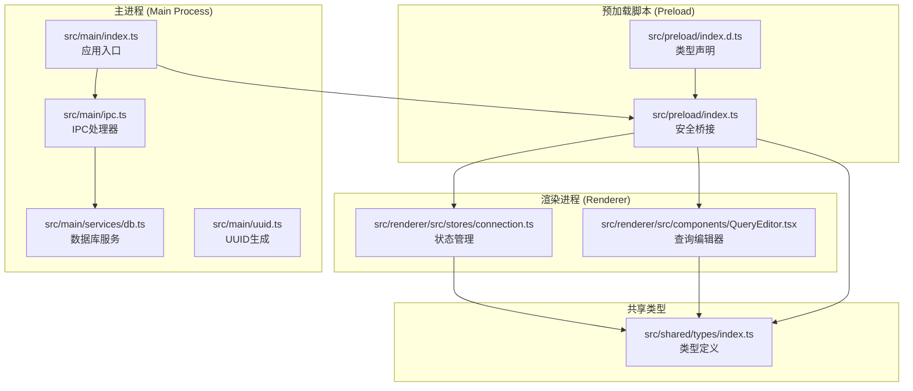
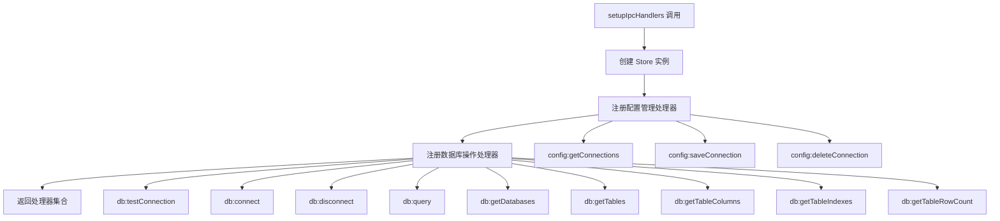
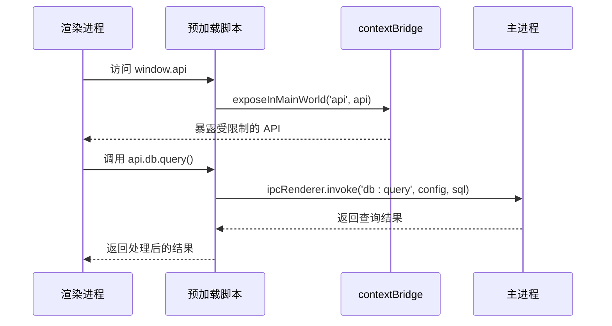
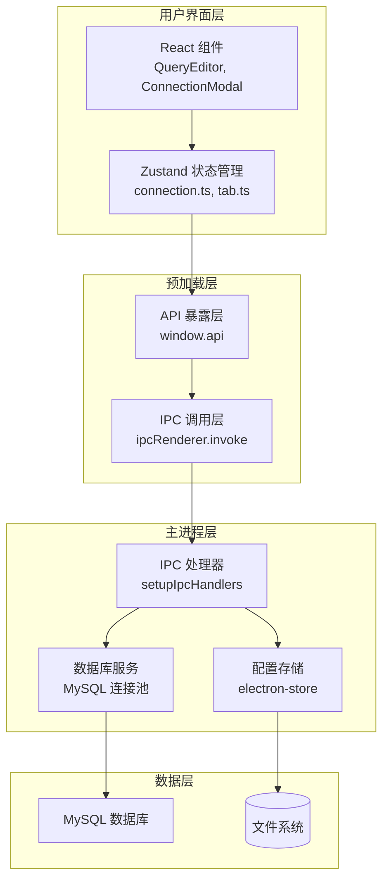
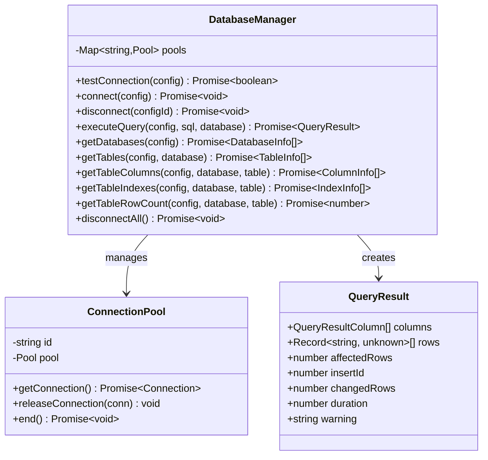
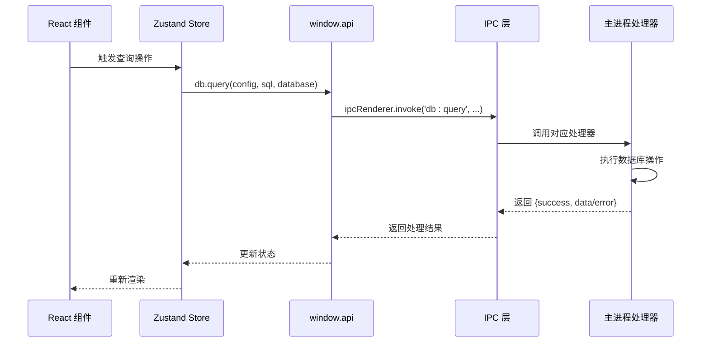

# IPC 通信系统

<cite>
**本文档引用的文件**
- [src/main/index.ts](file://src/main/index.ts)
- [src/main/ipc.ts](file://src/main/ipc.ts)
- [src/preload/index.ts](file://src/preload/index.ts)
- [src/main/services/db.ts](file://src/main/services/db.ts)
- [src/shared/types/index.ts](file://src/shared/types/index.ts)
- [src/preload/index.d.ts](file://src/preload/index.d.ts)
- [src/main/uuid.ts](file://src/main/uuid.ts)
- [src/renderer/src/stores/connection.ts](file://src/renderer/src/stores/connection.ts)
- [src/renderer/src/components/QueryEditor.tsx](file://src/renderer/src/components/QueryEditor.tsx)
- [package.json](file://package.json)
</cite>

## 目录
1. [简介](#简介)
2. [项目结构](#项目结构)
3. [核心组件](#核心组件)
4. [架构概览](#架构概览)
5. [详细组件分析](#详细组件分析)
6. [依赖关系分析](#依赖关系分析)
7. [性能考虑](#性能考虑)
8. [故障排除指南](#故障排除指南)
9. [结论](#结论)

## 简介

本项目是一个基于 Electron 的现代化数据库管理工具，采用安全的 IPC（进程间通信）机制实现主进程与渲染进程之间的数据交换。系统通过预加载脚本的安全桥接机制，为渲染进程提供受限的 API 访问权限，同时确保 Node.js 环境的安全隔离。

该 IPC 通信系统支持同步和异步通信模式，涵盖数据库连接管理、配置存储、文件系统访问等功能模块。系统采用类型安全的设计，通过共享类型定义确保前后端数据结构的一致性。

## 项目结构

项目采用模块化架构，主要包含以下核心目录：



**图表来源**
- [src/main/index.ts:1-64](file://src/main/index.ts#L1-L64)
- [src/main/ipc.ts:1-132](file://src/main/ipc.ts#L1-L132)
- [src/preload/index.ts:1-60](file://src/preload/index.ts#L1-L60)

**章节来源**
- [src/main/index.ts:1-64](file://src/main/index.ts#L1-L64)
- [src/preload/index.ts:1-60](file://src/preload/index.ts#L1-L60)
- [src/shared/types/index.ts:1-124](file://src/shared/types/index.ts#L1-L124)

## 核心组件

### IPC 处理器注册机制

系统通过 `setupIpcHandlers` 函数集中管理所有 IPC 事件处理器的注册。该函数接收主窗口实例作为参数，并在其中注册多个命名空间的处理器：



**图表来源**
- [src/main/ipc.ts:16-127](file://src/main/ipc.ts#L16-L127)

### 预加载脚本安全机制

预加载脚本通过 `contextBridge` API 创建安全的 API 桥接层：



**图表来源**
- [src/preload/index.ts:50-59](file://src/preload/index.ts#L50-L59)
- [src/main/ipc.ts:74-81](file://src/main/ipc.ts#L74-L81)

**章节来源**
- [src/main/ipc.ts:16-127](file://src/main/ipc.ts#L16-L127)
- [src/preload/index.ts:14-48](file://src/preload/index.ts#L14-L48)

## 架构概览

系统采用分层架构设计，确保职责分离和安全性：



**图表来源**
- [src/renderer/src/components/QueryEditor.tsx:1-329](file://src/renderer/src/components/QueryEditor.tsx#L1-L329)
- [src/main/ipc.ts:1-132](file://src/main/ipc.ts#L1-L132)
- [src/main/services/db.ts:1-277](file://src/main/services/db.ts#L1-L277)

## 详细组件分析

### 数据库连接池管理

系统实现了高效的连接池管理机制，支持多数据库连接的并发访问：



**图表来源**
- [src/main/services/db.ts:1-277](file://src/main/services/db.ts#L1-L277)
- [src/shared/types/index.ts:74-88](file://src/shared/types/index.ts#L74-L88)

#### 连接池配置特性

- **连接限制**: 默认最大连接数为 5
- **超时设置**: 连接超时默认 10 秒
- **Keep-Alive**: 启用连接保活机制
- **字符集**: 使用 utf8mb4 支持完整 Unicode
- **时区**: 固定 UTC+00:00 时区

**章节来源**
- [src/main/services/db.ts:11-36](file://src/main/services/db.ts#L11-L36)
- [src/main/services/db.ts:38-63](file://src/main/services/db.ts#L38-L63)

### IPC 错误处理机制

系统实现了统一的错误处理策略，确保异常情况下的用户体验：

```mermaid
flowchart TD
A[IPC 请求发送] --> B{请求类型}
B --> |配置操作| C[config:* 处理器]
B --> |数据库操作| D[db:* 处理器]
C --> E[try-catch 包装]
D --> E
E --> F{操作成功?}
F --> |是| G[返回 {success: true}]
F --> |否| H[返回 {success: false, error}]
G --> I[渲染进程处理]
H --> I
I --> J{error 存在?}
J --> |是| K[显示错误消息]
J --> |否| L[更新 UI 状态]
```

**图表来源**
- [src/main/ipc.ts:47-81](file://src/main/ipc.ts#L47-L81)

#### 错误响应格式

所有 IPC 响应遵循统一的 `IpcResponse` 接口格式：

| 字段名 | 类型 | 必需 | 描述 |
|--------|------|------|------|
| success | boolean | 是 | 操作是否成功 |
| data | T | 可选 | 成功时的数据内容 |
| error | string | 可选 | 失败时的错误信息 |

**章节来源**
- [src/shared/types/index.ts:104-108](file://src/shared/types/index.ts#L104-L108)
- [src/main/ipc.ts:47-127](file://src/main/ipc.ts#L47-L127)

### 渲染进程 API 使用模式

渲染进程通过预加载脚本暴露的 API 进行异步调用：



**图表来源**
- [src/renderer/src/components/QueryEditor.tsx:36-64](file://src/renderer/src/components/QueryEditor.tsx#L36-L64)
- [src/renderer/src/stores/connection.ts:23-45](file://src/renderer/src/stores/connection.ts#L23-L45)

**章节来源**
- [src/renderer/src/components/QueryEditor.tsx:36-64](file://src/renderer/src/components/QueryEditor.tsx#L36-L64)
- [src/renderer/src/stores/connection.ts:23-45](file://src/renderer/src/stores/connection.ts#L23-L45)

## 依赖关系分析

系统的关键依赖关系如下：

```mermaid
graph LR
subgraph "运行时依赖"
A[electron@^29.1.5]
B[mysql2@^3.9.2]
C[electron-store@^8.2.0]
D[react@^18.2.0]
E[zustand@^4.5.2]
end
subgraph "开发依赖"
F[typescript@^5.3.3]
G[electron-vite@^2.0.0]
H[@vitejs/plugin-react@^4.2.1]
end
subgraph "应用模块"
I[src/main/*]
J[src/preload/*]
K[src/renderer/*]
L[src/shared/*]
end
A --> I
B --> I
C --> I
D --> K
E --> K
F --> I
F --> K
G --> I
H --> K
I --> J
J --> K
L --> I
L --> J
L --> K
```

**图表来源**
- [package.json:16-40](file://package.json#L16-L40)

**章节来源**
- [package.json:16-40](file://package.json#L16-L40)

## 性能考虑

### 连接池优化

系统通过连接池机制优化数据库连接性能：

- **连接复用**: 避免频繁创建和销毁数据库连接
- **并发控制**: 限制最大连接数防止资源耗尽
- **自动清理**: 连接空闲时自动释放回池中
- **超时处理**: 防止连接泄漏和资源占用

### 内存管理

- **对象池**: 复用连接对象减少垃圾回收压力
- **及时释放**: 查询完成后立即释放连接
- **批量操作**: 支持批量查询减少 IPC 调用次数

### 序列化优化

系统采用高效的 JSON 序列化策略：

- **最小化传输**: 仅传输必要的查询结果数据
- **类型安全**: 通过 TypeScript 确保序列化数据结构正确
- **错误恢复**: 序列化失败时提供降级处理

## 故障排除指南

### 常见问题诊断

#### 1. IPC 调用无响应

**症状**: 渲染进程等待 IPC 响应但无返回

**排查步骤**:
1. 检查主进程是否正确注册了对应的处理器
2. 验证预加载脚本是否正确暴露了 API
3. 确认渲染进程的调用参数格式正确

**解决方案**:
- 确保 `setupIpcHandlers` 在应用启动时被调用
- 检查 `contextBridge.exposeInMainWorld` 是否执行成功
- 验证 IPC 通道名称拼写正确

#### 2. 数据库连接失败

**症状**: `db:testConnection` 或 `db:connect` 返回失败

**排查步骤**:
1. 验证数据库凭据是否正确
2. 检查网络连接和防火墙设置
3. 确认数据库服务正在运行

**解决方案**:
- 使用 `testConnection` 方法先验证连接
- 检查连接超时设置是否合理
- 查看详细的错误信息进行针对性修复

#### 3. 查询结果异常

**症状**: 查询返回空结果或错误数据

**排查步骤**:
1. 检查 SQL 语法是否正确
2. 验证目标数据库和表是否存在
3. 确认用户权限是否足够

**解决方案**:
- 使用简单的 SELECT 语句测试基础功能
- 检查数据库字符集和排序规则
- 验证查询结果的数据类型转换

### 调试技巧

#### 1. 开启详细日志

在开发环境中，可以通过以下方式启用详细日志：

```javascript
// 在预加载脚本中添加日志
console.log('IPC 调用:', channel, args);
```

#### 2. 使用开发者工具

- 打开主进程控制台：`Ctrl+Shift+I` (Windows/Linux) 或 `Cmd+Option+I` (Mac)
- 检查渲染进程控制台输出
- 监控 IPC 通信过程

#### 3. 错误边界处理

在 React 组件中实现错误边界：

```typescript
// 在组件中捕获 IPC 错误
try {
  const result = await window.api.db.query(config, sql);
  if (!result.success) {
    throw new Error(result.error || '未知错误');
  }
} catch (error) {
  // 显示友好的错误消息
  showErrorDialog(error.message);
}
```

**章节来源**
- [src/main/ipc.ts:47-127](file://src/main/ipc.ts#L47-L127)
- [src/renderer/src/components/QueryEditor.tsx:58-63](file://src/renderer/src/components/QueryEditor.tsx#L58-L63)

## 结论

本 IPC 通信系统通过精心设计的安全架构和高效的实现机制，为数据库管理工具提供了稳定可靠的进程间通信能力。系统的主要优势包括：

### 安全性保障
- 严格的上下文隔离确保 Node.js 功能不被滥用
- 受限的 API 暴露策略防止敏感操作被执行
- 类型安全的通信协议确保数据完整性

### 性能优化
- 连接池管理提升数据库访问效率
- 异步通信避免阻塞用户界面
- 最小化数据传输减少网络开销

### 可维护性
- 模块化的架构便于功能扩展
- 统一的错误处理机制简化调试
- 完善的类型定义确保代码质量

该系统为构建企业级桌面应用程序提供了良好的 IPC 通信范例，其设计理念和实现细节可以作为类似项目的参考模板。