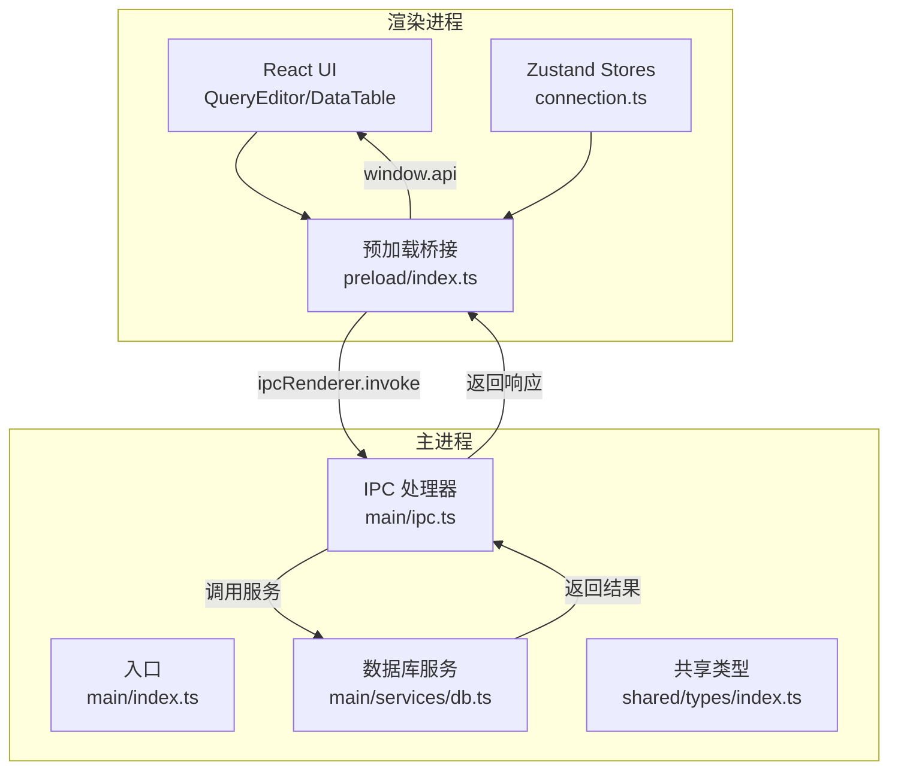
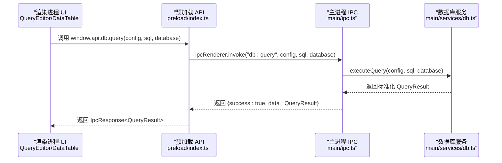
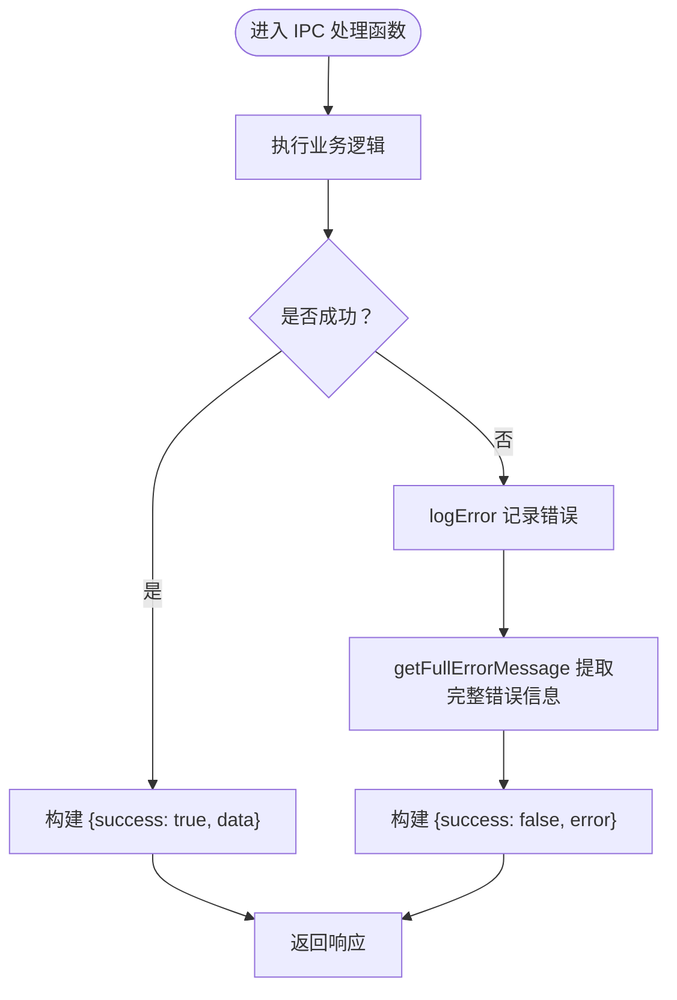
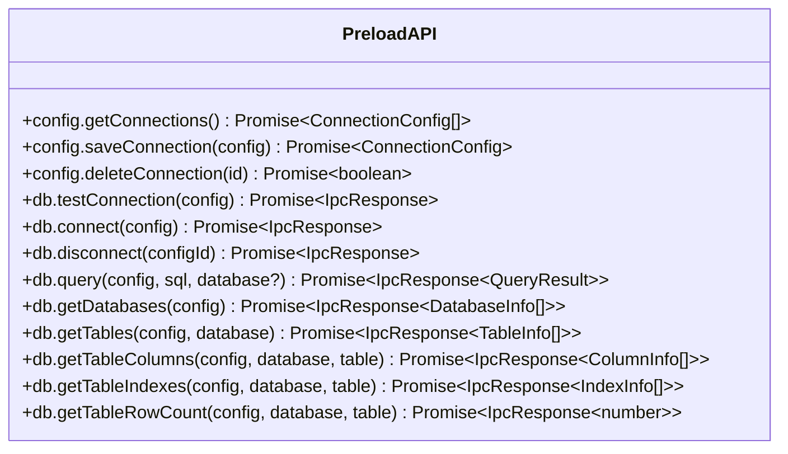
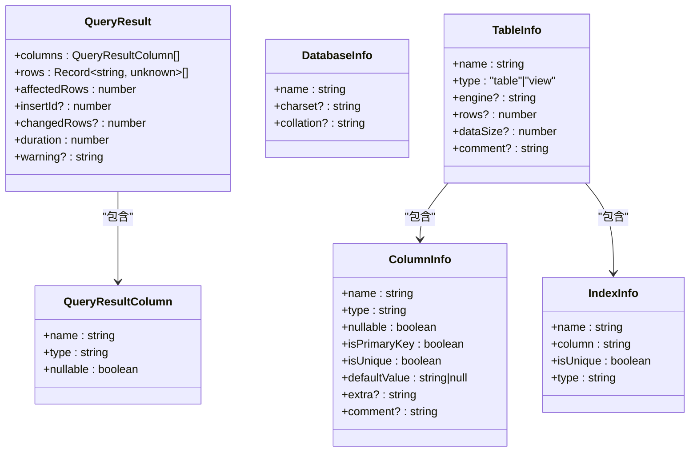
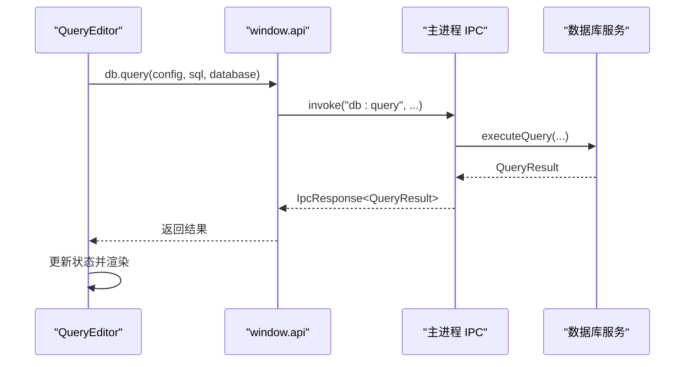
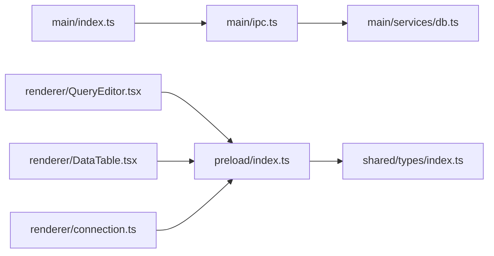

# 数据序列化与传输

<cite>
**本文档引用的文件**
- [src/main/ipc.ts](file://src/main/ipc.ts)
- [src/preload/index.ts](file://src/preload/index.ts)
- [src/main/services/db.ts](file://src/main/services/db.ts)
- [src/shared/types/index.ts](file://src/shared/types/index.ts)
- [src/main/index.ts](file://src/main/index.ts)
- [src/renderer/src/components/QueryEditor.tsx](file://src/renderer/src/components/QueryEditor.tsx)
- [src/renderer/src/components/DataTable.tsx](file://src/renderer/src/components/DataTable.tsx)
- [src/renderer/src/stores/connection.ts](file://src/renderer/src/stores/connection.ts)
</cite>

## 目录
1. [简介](#简介)
2. [项目结构](#项目结构)
3. [核心组件](#核心组件)
4. [架构概览](#架构概览)
5. [详细组件分析](#详细组件分析)
6. [依赖关系分析](#依赖关系分析)
7. [性能考量](#性能考量)
8. [故障排查指南](#故障排查指南)
9. [结论](#结论)

## 简介
本文件聚焦于 Electron 应用中 IPC（进程间通信）的数据序列化与传输机制，系统性阐述：
- 可序列化数据类型与限制
- 复杂对象（如数据库连接配置、查询结果）的传输处理方式
- 错误对象的序列化与反序列化机制
- 数据传输的最佳实践（性能优化与内存管理）

通过分析主进程 IPC 处理器、预加载桥接层、渲染进程调用方以及共享类型定义，帮助读者全面理解数据在主进程与渲染进程之间的流转过程与约束条件。

## 项目结构
该应用采用典型的 Electron + React 架构，IPC 层位于主进程，通过预加载脚本暴露安全 API 给渲染进程。数据库操作由主进程服务模块统一处理，渲染层通过窗口 API 调用主进程能力。

图表来源
- [src/main/index.ts:1-64](file://src/main/index.ts#L1-L64)
- [src/main/ipc.ts:1-182](file://src/main/ipc.ts#L1-L182)
- [src/preload/index.ts:1-60](file://src/preload/index.ts#L1-L60)
- [src/main/services/db.ts:1-277](file://src/main/services/db.ts#L1-L277)
- [src/shared/types/index.ts:1-124](file://src/shared/types/index.ts#L1-L124)

章节来源
- [src/main/index.ts:1-64](file://src/main/index.ts#L1-L64)
- [src/main/ipc.ts:1-182](file://src/main/ipc.ts#L1-L182)
- [src/preload/index.ts:1-60](file://src/preload/index.ts#L1-L60)
- [src/main/services/db.ts:1-277](file://src/main/services/db.ts#L1-L277)
- [src/shared/types/index.ts:1-124](file://src/shared/types/index.ts#L1-L124)

## 核心组件
- 主进程 IPC 处理器：集中注册所有通道（channels），负责错误日志记录、错误消息提取与统一响应格式化。
- 预加载桥接：通过 contextBridge 将受控 API 暴露给渲染进程，使用 ipcRenderer.invoke 发起请求。
- 数据库服务：封装连接池、查询执行与元数据获取，返回标准化的查询结果结构。
- 共享类型：定义连接配置、查询结果、IPC 响应等跨进程传输的数据模型。

章节来源
- [src/main/ipc.ts:46-177](file://src/main/ipc.ts#L46-L177)
- [src/preload/index.ts:14-59](file://src/preload/index.ts#L14-L59)
- [src/main/services/db.ts:73-135](file://src/main/services/db.ts#L73-L135)
- [src/shared/types/index.ts:3-124](file://src/shared/types/index.ts#L3-L124)

## 架构概览
下图展示从渲染进程发起数据库查询到返回结果的完整流程，重点标注 IPC 序列化与反序列化的边界。

图表来源
- [src/renderer/src/components/QueryEditor.tsx:36-64](file://src/renderer/src/components/QueryEditor.tsx#L36-L64)
- [src/preload/index.ts:33-34](file://src/preload/index.ts#L33-L34)
- [src/main/ipc.ts:106-117](file://src/main/ipc.ts#L106-L117)
- [src/main/services/db.ts:73-135](file://src/main/services/db.ts#L73-L135)

## 详细组件分析

### IPC 处理器与错误处理
- 通道注册：主进程通过 ipcMain.handle 注册所有通道，包括连接配置管理与数据库操作。
- 错误日志：logError 将错误信息输出到控制台，支持 Error 对象的 message 和 stack。
- 错误消息提取：getFullErrorMessage 支持扩展字段（如 code、requireStack），用于更完整的错误上下文。
- 统一响应：所有通道返回 IpcResponse<T>，包含 success、data、error 字段，便于渲染层统一处理。

图表来源
- [src/main/ipc.ts:16-44](file://src/main/ipc.ts#L16-L44)
- [src/main/ipc.ts:76-84](file://src/main/ipc.ts#L76-L84)
- [src/main/ipc.ts:106-117](file://src/main/ipc.ts#L106-L117)

章节来源
- [src/main/ipc.ts:16-44](file://src/main/ipc.ts#L16-L44)
- [src/main/ipc.ts:46-177](file://src/main/ipc.ts#L46-L177)

### 预加载桥接与 API 定义
- API 暴露：通过 contextBridge.exposeInMainWorld 将 window.api 暴露给渲染进程，确保上下文隔离安全。
- 调用模式：渲染层使用 ipcRenderer.invoke 调用主进程通道，参数与返回值均遵循 IPC 序列化规则。
- 类型约束：API 方法签名与共享类型一致，保证编译期类型安全。

图表来源
- [src/preload/index.ts:14-45](file://src/preload/index.ts#L14-L45)

章节来源
- [src/preload/index.ts:14-59](file://src/preload/index.ts#L14-L59)

### 数据库服务与查询结果序列化
- 连接池管理：以连接 id 为键维护连接池，避免重复创建。
- 查询执行：根据结果类型区分 SELECT 与 DML，分别构造列信息与行数据。
- 结果结构：QueryResult 包含 columns、rows、affectedRows、duration 等字段；rows 使用 Record<string, unknown> 表示通用数据。
- 元数据接口：数据库、表、列、索引等接口返回标准化结构，便于前端展示。

图表来源
- [src/main/services/db.ts:73-135](file://src/main/services/db.ts#L73-L135)
- [src/shared/types/index.ts:74-88](file://src/shared/types/index.ts#L74-L88)
- [src/shared/types/index.ts:34-65](file://src/shared/types/index.ts#L34-L65)

章节来源
- [src/main/services/db.ts:73-135](file://src/main/services/db.ts#L73-L135)
- [src/shared/types/index.ts:74-88](file://src/shared/types/index.ts#L74-L88)
- [src/shared/types/index.ts:34-65](file://src/shared/types/index.ts#L34-L65)

### 渲染进程调用与数据消费
- 查询执行：QueryEditor 在用户触发时调用 window.api.db.query，解析 IpcResponse 并更新状态。
- 表格数据：DataTable 通过多步 IPC 调用（列信息、行数、查询）组合生成表格数据，支持分页与排序。
- 连接管理：connection.store 通过 window.api.config.* 管理连接配置列表。

图表来源
- [src/renderer/src/components/QueryEditor.tsx:36-64](file://src/renderer/src/components/QueryEditor.tsx#L36-L64)
- [src/preload/index.ts:33-34](file://src/preload/index.ts#L33-L34)
- [src/main/ipc.ts:106-117](file://src/main/ipc.ts#L106-L117)
- [src/main/services/db.ts:73-135](file://src/main/services/db.ts#L73-L135)

章节来源
- [src/renderer/src/components/QueryEditor.tsx:36-64](file://src/renderer/src/components/QueryEditor.tsx#L36-L64)
- [src/renderer/src/components/DataTable.tsx:41-83](file://src/renderer/src/components/DataTable.tsx#L41-L83)
- [src/renderer/src/stores/connection.ts:23-45](file://src/renderer/src/stores/connection.ts#L23-L45)

## 依赖关系分析
- 主进程入口：初始化窗口与 IPC 处理器，应用退出时断开所有数据库连接。
- IPC 依赖：所有通道依赖数据库服务模块执行具体业务。
- 预加载依赖：依赖共享类型定义，确保 API 方法签名与响应结构一致。
- 渲染层依赖：依赖预加载 API 与 Zustand 状态管理，实现 UI 与数据的解耦。

图表来源
- [src/main/index.ts:1-64](file://src/main/index.ts#L1-L64)
- [src/main/ipc.ts:1-182](file://src/main/ipc.ts#L1-L182)
- [src/main/services/db.ts:1-277](file://src/main/services/db.ts#L1-L277)
- [src/preload/index.ts:1-60](file://src/preload/index.ts#L1-L60)
- [src/shared/types/index.ts:1-124](file://src/shared/types/index.ts#L1-L124)
- [src/renderer/src/components/QueryEditor.tsx:1-200](file://src/renderer/src/components/QueryEditor.tsx#L1-L200)
- [src/renderer/src/components/DataTable.tsx:1-200](file://src/renderer/src/components/DataTable.tsx#L1-L200)
- [src/renderer/src/stores/connection.ts:1-64](file://src/renderer/src/stores/connection.ts#L1-L64)

章节来源
- [src/main/index.ts:1-64](file://src/main/index.ts#L1-L64)
- [src/main/ipc.ts:1-182](file://src/main/ipc.ts#L1-L182)
- [src/main/services/db.ts:1-277](file://src/main/services/db.ts#L1-L277)
- [src/preload/index.ts:1-60](file://src/preload/index.ts#L1-L60)
- [src/shared/types/index.ts:1-124](file://src/shared/types/index.ts#L1-L124)
- [src/renderer/src/components/QueryEditor.tsx:1-200](file://src/renderer/src/components/QueryEditor.tsx#L1-L200)
- [src/renderer/src/components/DataTable.tsx:1-200](file://src/renderer/src/components/DataTable.tsx#L1-L200)
- [src/renderer/src/stores/connection.ts:1-64](file://src/renderer/src/stores/connection.ts#L1-L64)

## 性能考量
- 连接池复用：数据库服务以连接 id 为键维护连接池，减少连接建立与销毁开销。
- 查询耗时统计：查询执行过程中记录开始时间与结束时间，返回 duration 供 UI 展示。
- 分页与筛选：表格组件采用分页与简单筛选，避免一次性传输大量数据。
- 内存管理：应用退出时断开所有数据库连接，防止资源泄漏。

章节来源
- [src/main/services/db.ts:5-36](file://src/main/services/db.ts#L5-L36)
- [src/main/services/db.ts:86-88](file://src/main/services/db.ts#L86-L88)
- [src/renderer/src/components/DataTable.tsx:23-83](file://src/renderer/src/components/DataTable.tsx#L23-L83)
- [src/main/index.ts:61-63](file://src/main/index.ts#L61-L63)

## 故障排查指南
- 错误日志：主进程在通道捕获异常后会记录错误信息与堆栈，便于定位问题。
- 错误消息提取：getFullErrorMessage 支持扩展字段（如 code、requireStack），提升诊断信息完整性。
- 统一响应结构：渲染层通过 IpcResponse.success 判断成功与否，error 字段承载错误文本，便于 UI 提示。
- 常见问题定位：
  - 数据库连接失败：检查连接配置与网络连通性，关注 getFullErrorMessage 输出。
  - 查询超时或失败：查看主进程日志与错误消息，确认 SQL 语法与权限。
  - 大量数据传输导致卡顿：考虑分页、筛选或导出 CSV 等替代方案。

章节来源
- [src/main/ipc.ts:16-44](file://src/main/ipc.ts#L16-L44)
- [src/main/ipc.ts:76-84](file://src/main/ipc.ts#L76-L84)
- [src/main/ipc.ts:106-117](file://src/main/ipc.ts#L106-L117)

## 结论
本项目在 Electron 中实现了清晰的 IPC 数据序列化与传输机制：
- 通过统一的 IpcResponse 结构与严格的类型定义，确保主进程与渲染进程之间的数据一致性。
- 数据库服务将复杂查询结果标准化为轻量级结构，便于前端高效渲染。
- 错误处理与日志记录完善，结合扩展错误信息提取，显著提升可观测性。
- 性能方面通过连接池复用、耗时统计与分页策略，兼顾功能与效率。