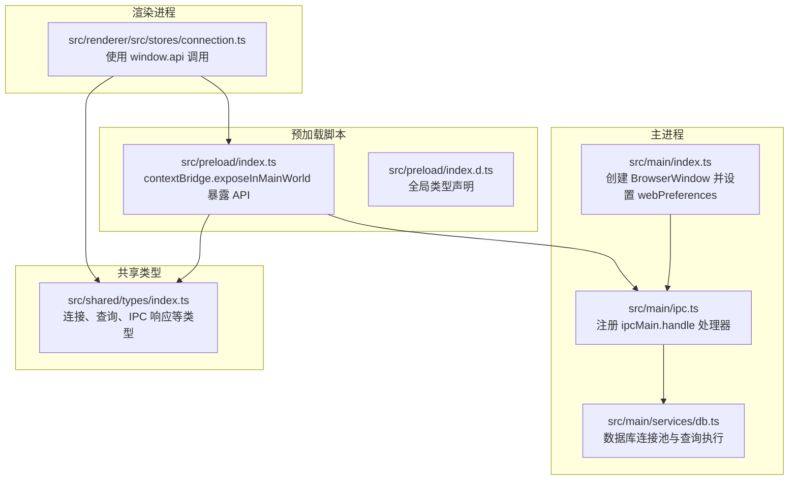
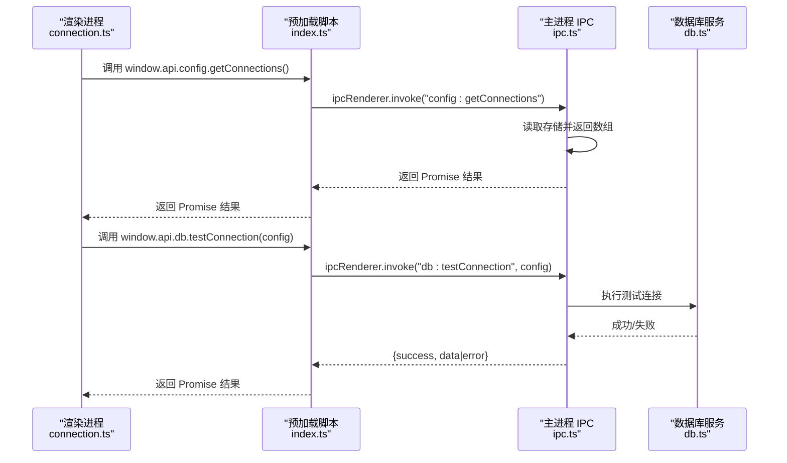
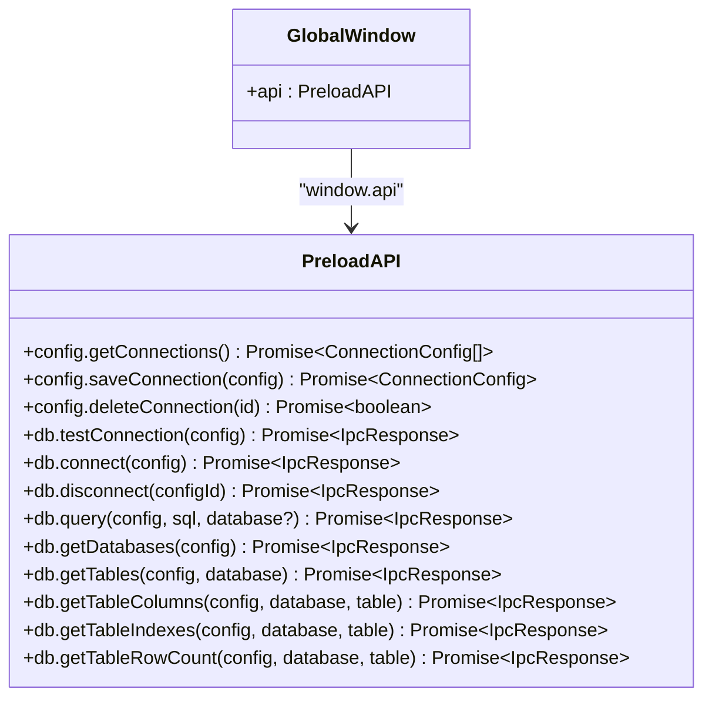
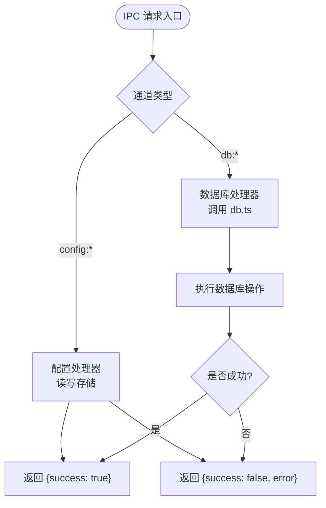
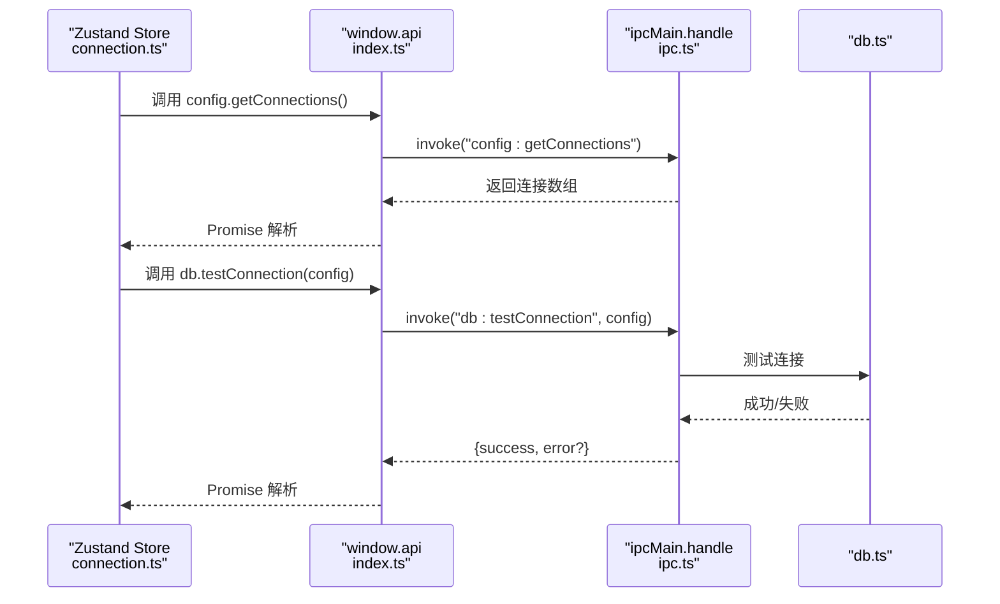
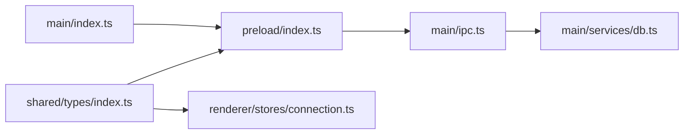

# 预加载脚本与安全

<cite>
**本文档引用的文件**
- [src/preload/index.ts](file://src/preload/index.ts)
- [src/preload/index.d.ts](file://src/preload/index.d.ts)
- [src/main/index.ts](file://src/main/index.ts)
- [src/main/ipc.ts](file://src/main/ipc.ts)
- [src/main/services/db.ts](file://src/main/services/db.ts)
- [src/shared/types/index.ts](file://src/shared/types/index.ts)
- [src/renderer/src/stores/connection.ts](file://src/renderer/src/stores/connection.ts)
- [electron.vite.config.ts](file://electron.vite.config.ts)
- [package.json](file://package.json)
</cite>

## 目录
1. [简介](#简介)
2. [项目结构](#项目结构)
3. [核心组件](#核心组件)
4. [架构总览](#架构总览)
5. [详细组件分析](#详细组件分析)
6. [依赖关系分析](#依赖关系分析)
7. [性能考量](#性能考量)
8. [故障排查指南](#故障排查指南)
9. [结论](#结论)
10. [附录](#附录)

## 简介
本文件围绕 Electron 应用中的“预加载脚本”与“安全机制”展开，重点解释：
- 预加载脚本在 Electron 安全架构中的角色与职责
- 如何通过 contextBridge 安全地将主进程能力暴露给渲染进程
- 类型定义文件如何保障 TypeScript 类型安全
- 最佳实践与安全注意事项

该应用采用严格的上下文隔离、最小权限暴露以及统一的 IPC 响应模型，确保渲染进程仅能通过受控接口访问数据库连接与配置管理等能力。

## 项目结构
该项目采用分层组织方式：主进程负责窗口创建、IPC 注册与数据库连接池管理；预加载脚本负责安全桥接；渲染进程通过状态管理与组件消费 API。

图表来源
- [src/main/index.ts:1-64](file://src/main/index.ts#L1-L64)
- [src/main/ipc.ts:1-182](file://src/main/ipc.ts#L1-L182)
- [src/main/services/db.ts:1-277](file://src/main/services/db.ts#L1-L277)
- [src/preload/index.ts:1-60](file://src/preload/index.ts#L1-L60)
- [src/preload/index.d.ts:1-10](file://src/preload/index.d.ts#L1-L10)
- [src/renderer/src/stores/connection.ts:1-64](file://src/renderer/src/stores/connection.ts#L1-L64)
- [src/shared/types/index.ts:1-124](file://src/shared/types/index.ts#L1-L124)

章节来源
- [src/main/index.ts:1-64](file://src/main/index.ts#L1-L64)
- [src/preload/index.ts:1-60](file://src/preload/index.ts#L1-L60)
- [src/preload/index.d.ts:1-10](file://src/preload/index.d.ts#L1-L10)
- [src/shared/types/index.ts:1-124](file://src/shared/types/index.ts#L1-L124)

## 核心组件
- 预加载脚本：通过 contextBridge 将受限 API 暴露至渲染进程，并在非隔离环境下进行降级处理。
- 主进程 IPC：集中注册所有 ipcMain.handle 处理器，封装数据库操作与配置持久化。
- 渲染进程状态管理：使用 window.api.config 与 window.api.db 调用主进程能力。
- 共享类型：统一定义连接配置、数据库元数据、查询结果与 IPC 响应类型，确保前后端一致的类型约束。

章节来源
- [src/preload/index.ts:14-60](file://src/preload/index.ts#L14-L60)
- [src/main/ipc.ts:46-177](file://src/main/ipc.ts#L46-L177)
- [src/renderer/src/stores/connection.ts:17-63](file://src/renderer/src/stores/connection.ts#L17-L63)
- [src/shared/types/index.ts:1-124](file://src/shared/types/index.ts#L1-L124)

## 架构总览
下图展示了从渲染进程发起调用到主进程处理再到数据库执行的完整链路，以及预加载脚本在其中的安全边界作用。

图表来源
- [src/renderer/src/stores/connection.ts:23-30](file://src/renderer/src/stores/connection.ts#L23-L30)
- [src/preload/index.ts:17-22](file://src/preload/index.ts#L17-L22)
- [src/preload/index.ts:27-34](file://src/preload/index.ts#L27-L34)
- [src/main/ipc.ts:49-84](file://src/main/ipc.ts#L49-L84)
- [src/main/services/db.ts:38-56](file://src/main/services/db.ts#L38-L56)

## 详细组件分析

### 预加载脚本与 contextBridge 安全暴露
- API 组织：预加载脚本以对象形式组织 API，分为 config 与 db 两大域，每个方法均通过 ipcRenderer.invoke 发起 IPC 调用，返回 Promise。
- 安全暴露：使用 contextBridge.exposeInMainWorld 将 api 对象暴露到渲染进程的 window 上，且仅在上下文隔离启用时生效；在非隔离环境中通过降级赋值保证兼容性。
- 类型安全：通过导出 Api 类型与全局类型声明文件，使渲染进程在编译期获得类型提示与校验。

图表来源
- [src/preload/index.ts:14-48](file://src/preload/index.ts#L14-L48)
- [src/preload/index.d.ts:3-7](file://src/preload/index.d.ts#L3-L7)

章节来源
- [src/preload/index.ts:14-60](file://src/preload/index.ts#L14-L60)
- [src/preload/index.d.ts:1-10](file://src/preload/index.d.ts#L1-L10)

### 主进程 IPC 与数据库服务
- IPC 注册：集中注册所有通道处理器，包括配置管理与数据库操作，统一返回 IpcResponse 结构，便于渲染进程统一处理成功/失败与错误信息。
- 错误处理：捕获异常并记录完整错误信息，包含 require stack 等细节，便于定位问题。
- 数据库服务：维护连接池映射，按连接 ID 管理连接；提供测试连接、执行查询、获取元数据等能力；查询结果统一转换为 QueryResult 结构。

图表来源
- [src/main/ipc.ts:46-177](file://src/main/ipc.ts#L46-L177)
- [src/main/services/db.ts:38-135](file://src/main/services/db.ts#L38-L135)

章节来源
- [src/main/ipc.ts:16-44](file://src/main/ipc.ts#L16-L44)
- [src/main/ipc.ts:49-176](file://src/main/ipc.ts#L49-L176)
- [src/main/services/db.ts:38-277](file://src/main/services/db.ts#L38-L277)

### 渲染进程使用示例
- 状态管理：渲染进程通过 Zustand 创建连接状态存储，使用 window.api.config 与 window.api.db 调用主进程能力。
- 调用流程：渲染进程调用 window.api.config.getConnections() 获取连接列表，随后根据需要调用 db 相关方法执行数据库操作。

图表来源
- [src/renderer/src/stores/connection.ts:23-30](file://src/renderer/src/stores/connection.ts#L23-L30)
- [src/preload/index.ts:17-22](file://src/preload/index.ts#L17-L22)
- [src/preload/index.ts:27-34](file://src/preload/index.ts#L27-L34)
- [src/main/ipc.ts:76-94](file://src/main/ipc.ts#L76-L94)
- [src/main/services/db.ts:38-56](file://src/main/services/db.ts#L38-L56)

章节来源
- [src/renderer/src/stores/connection.ts:17-63](file://src/renderer/src/stores/connection.ts#L17-L63)

### 类型定义与 TypeScript 安全
- 共享类型：连接配置、数据库元数据、查询结果、标签页类型与 IPC 响应类型均在共享目录中定义，确保主进程、预加载脚本与渲染进程一致的类型契约。
- 预加载类型：通过全局类型声明文件为 window.api 提供类型签名，避免在渲染进程中手动断言或绕过类型检查。
- 使用建议：新增 API 时同步更新共享类型与预加载类型声明，保持一致性。

章节来源
- [src/shared/types/index.ts:1-124](file://src/shared/types/index.ts#L1-L124)
- [src/preload/index.d.ts:1-10](file://src/preload/index.d.ts#L1-L10)

## 依赖关系分析
- 预加载脚本依赖共享类型，用于约束参数与返回值。
- 主进程 IPC 依赖数据库服务与 electron-store，负责持久化与连接池管理。
- 渲染进程依赖预加载脚本暴露的 API 与共享类型，通过状态管理消费能力。

图表来源
- [src/shared/types/index.ts:1-124](file://src/shared/types/index.ts#L1-L124)
- [src/preload/index.ts:1-60](file://src/preload/index.ts#L1-L60)
- [src/renderer/src/stores/connection.ts:1-64](file://src/renderer/src/stores/connection.ts#L1-L64)
- [src/main/ipc.ts:1-182](file://src/main/ipc.ts#L1-L182)
- [src/main/services/db.ts:1-277](file://src/main/services/db.ts#L1-L277)
- [src/main/index.ts:1-64](file://src/main/index.ts#L1-L64)

章节来源
- [src/main/index.ts:18-24](file://src/main/index.ts#L18-L24)
- [src/preload/index.ts:1-10](file://src/preload/index.ts#L1-L10)
- [src/shared/types/index.ts:1-124](file://src/shared/types/index.ts#L1-L124)

## 性能考量
- 连接池：数据库服务维护基于连接 ID 的连接池映射，减少重复建立连接的开销。
- 查询计时：查询执行时记录开始时间与结束时间，计算耗时并返回给渲染进程，便于 UI 展示与性能监控。
- 限制并发：连接池默认连接数有限，避免过度占用资源；必要时可调整连接池参数。
- IPC 异步：所有调用均为异步 Promise，避免阻塞渲染线程。

章节来源
- [src/main/services/db.ts:11-28](file://src/main/services/db.ts#L11-L28)
- [src/main/services/db.ts:73-135](file://src/main/services/db.ts#L73-L135)

## 故障排查指南
- IPC 错误日志：主进程统一记录错误时间戳与堆栈信息，便于定位问题。
- 错误信息提取：支持提取 require stack 等附加信息，帮助定位模块依赖问题。
- 常见问题：
  - 渲染进程无法访问 window.api：确认 webPreferences 中已正确设置 preload 路径且上下文隔离开启。
  - IPC 调用无响应：检查通道名称是否匹配，以及主进程是否已注册对应 handle。
  - 数据库连接失败：检查连接配置与网络连通性，查看主进程日志中的完整错误信息。

章节来源
- [src/main/ipc.ts:16-44](file://src/main/ipc.ts#L16-L44)
- [src/main/ipc.ts:17-27](file://src/main/ipc.ts#L17-L27)
- [src/main/index.ts:18-24](file://src/main/index.ts#L18-L24)

## 结论
本项目通过严格的上下文隔离与最小权限暴露策略，结合统一的 IPC 响应模型与共享类型系统，实现了预加载脚本与渲染进程之间的安全交互。预加载脚本作为“安全网关”，仅暴露必要的 API；主进程集中处理业务逻辑与错误处理；渲染进程通过状态管理消费能力。遵循本文最佳实践与安全注意事项，可进一步提升系统的安全性与可维护性。

## 附录

### 最佳实践与安全注意事项
- 严格启用上下文隔离与禁用 Node 集成
  - 确保 webPreferences 中 contextIsolation 为 true，nodeIntegration 为 false。
  - 参考：[src/main/index.ts:18-24](file://src/main/index.ts#L18-L24)
- 仅暴露必要 API
  - 预加载脚本中仅导出渲染进程所需的最小集合，避免直接暴露 Node 或 Electron 原生 API。
  - 参考：[src/preload/index.ts:14-48](file://src/preload/index.ts#L14-L48)
- 统一错误处理与日志
  - 主进程集中记录错误详情，便于定位问题。
  - 参考：[src/main/ipc.ts:16-44](file://src/main/ipc.ts#L16-L44)
- 类型驱动开发
  - 新增 API 时同步更新共享类型与预加载类型声明，确保编译期类型安全。
  - 参考：[src/shared/types/index.ts:1-124](file://src/shared/types/index.ts#L1-L124)，[src/preload/index.d.ts:1-10](file://src/preload/index.d.ts#L1-L10)
- 避免在预加载中直接挂载全局变量
  - 仅在 contextIsolated 条件下使用 exposeInMainWorld，非隔离环境再做降级处理。
  - 参考：[src/preload/index.ts:50-60](file://src/preload/index.ts#L50-L60)
- 合理使用连接池
  - 控制连接池大小与超时，避免资源泄露。
  - 参考：[src/main/services/db.ts:11-28](file://src/main/services/db.ts#L11-L28)