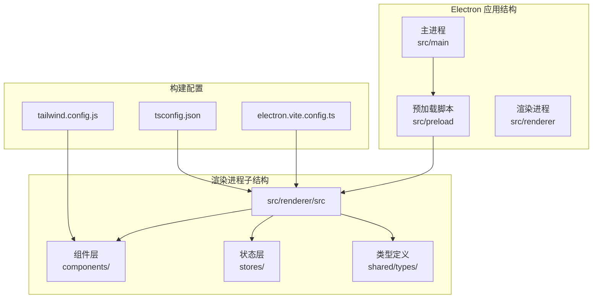
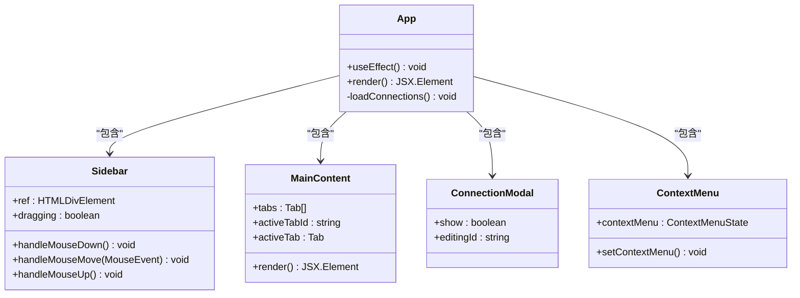
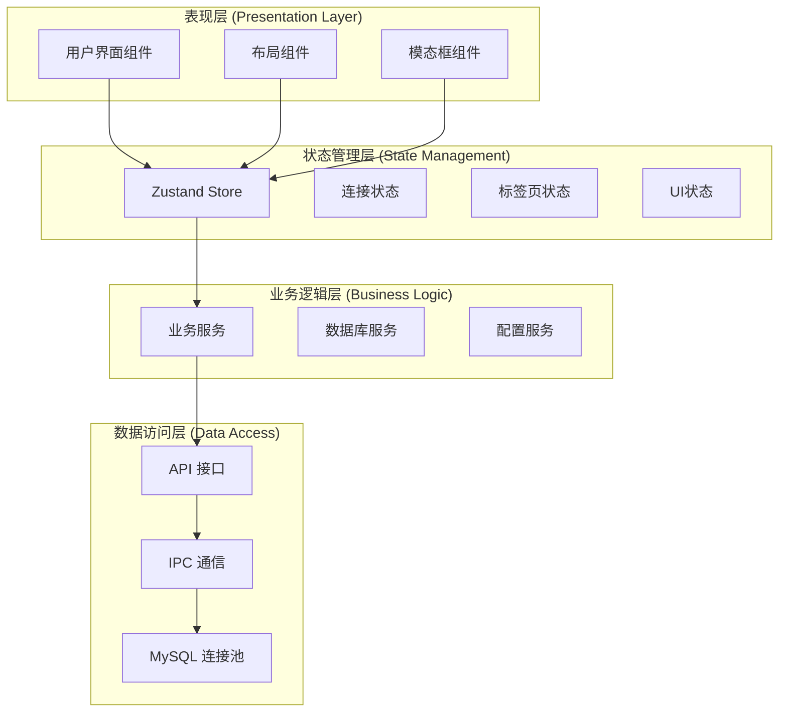
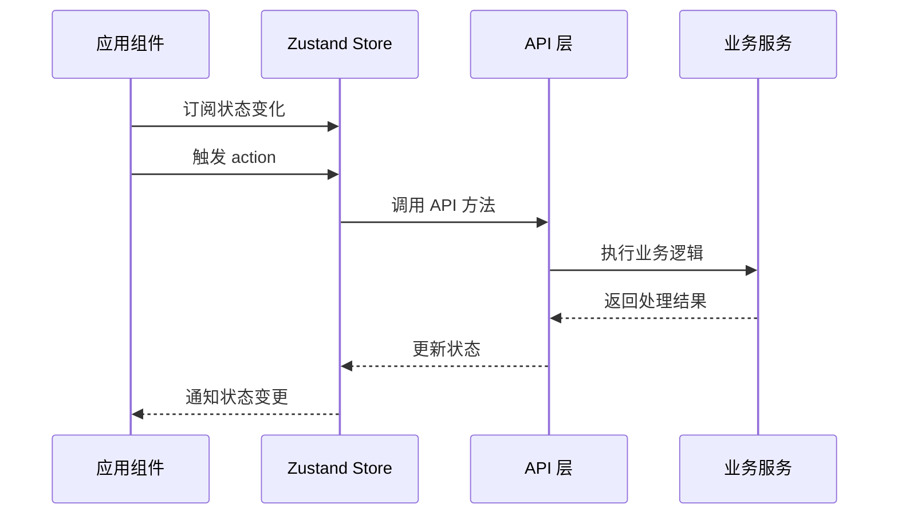
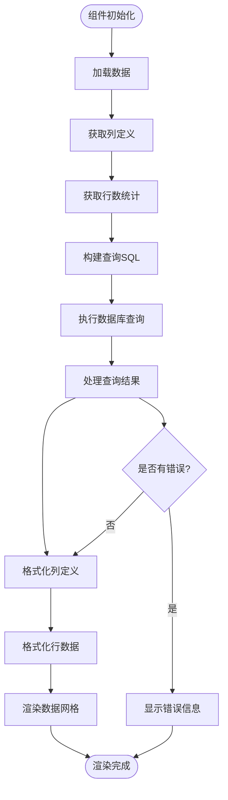
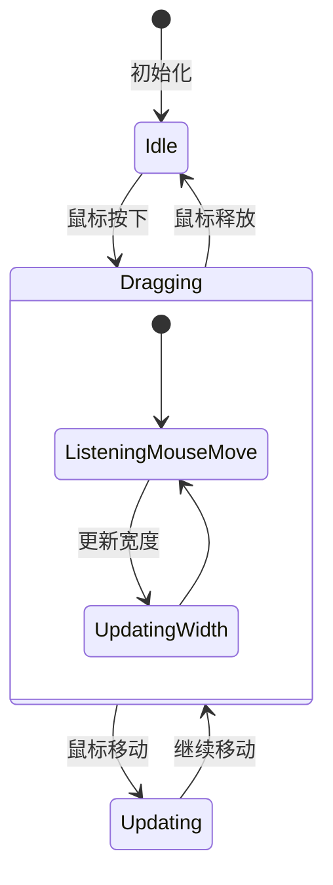

# 前端架构设计

<cite>
**本文档引用的文件**
- [package.json](file://package.json)
- [tsconfig.json](file://tsconfig.json)
- [electron.vite.config.ts](file://electron.vite.config.ts)
- [tailwind.config.js](file://tailwind.config.js)
- [src/renderer/src/main.tsx](file://src/renderer/src/main.tsx)
- [src/renderer/src/App.tsx](file://src/renderer/src/App.tsx)
- [src/renderer/src/components/Sidebar.tsx](file://src/renderer/src/components/Sidebar.tsx)
- [src/renderer/src/components/MainContent.tsx](file://src/renderer/src/components/MainContent.tsx)
- [src/renderer/src/components/DataTable.tsx](file://src/renderer/src/components/DataTable.tsx)
- [src/renderer/src/stores/connection.ts](file://src/renderer/src/stores/connection.ts)
- [src/renderer/src/stores/tab.ts](file://src/renderer/src/stores/tab.ts)
- [src/renderer/src/stores/ui.ts](file://src/renderer/src/stores/ui.ts)
- [src/shared/types/index.ts](file://src/shared/types/index.ts)
- [src/preload/index.ts](file://src/preload/index.ts)
- [src/main/services/db.ts](file://src/main/services/db.ts)
</cite>

## 目录
1. [引言](#引言)
2. [项目结构](#项目结构)
3. [核心组件](#核心组件)
4. [架构概览](#架构概览)
5. [详细组件分析](#详细组件分析)
6. [依赖关系分析](#依赖关系分析)
7. [性能考虑](#性能考虑)
8. [故障排除指南](#故障排除指南)
9. [结论](#结论)

## 引言

本项目是一个基于 Electron-Vite + React + TypeScript 的桌面数据库管理工具，采用现代化的前端架构模式。该架构通过清晰的组件化设计、类型安全的 TypeScript 实现、以及高效的构建配置，为用户提供了一个功能丰富且易于维护的数据库管理界面。

## 项目结构

项目采用模块化的目录结构，主要分为三个核心部分：



**图表来源**
- [electron.vite.config.ts:1-31](file://electron.vite.config.ts#L1-L31)
- [tsconfig.json:1-29](file://tsconfig.json#L1-L29)
- [tailwind.config.js:1-38](file://tailwind.config.js#L1-L38)

**章节来源**
- [package.json:1-42](file://package.json#L1-L42)
- [electron.vite.config.ts:1-31](file://electron.vite.config.ts#L1-L31)
- [tsconfig.json:1-29](file://tsconfig.json#L1-L29)

## 核心组件

### 应用根组件架构

应用的根组件 `App` 作为整个应用的容器，承担着以下关键职责：



**图表来源**
- [src/renderer/src/App.tsx:8-34](file://src/renderer/src/App.tsx#L8-L34)
- [src/renderer/src/components/Sidebar.tsx:6-80](file://src/renderer/src/components/Sidebar.tsx#L6-L80)
- [src/renderer/src/components/MainContent.tsx:8-34](file://src/renderer/src/components/MainContent.tsx#L8-L34)

### 组件化设计原则

系统遵循以下组件化设计原则：

1. **单一职责原则**: 每个组件专注于特定的功能领域
2. **可复用性**: 组件设计考虑跨页面使用
3. **类型安全**: 使用 TypeScript 确保组件间通信的类型正确性
4. **状态分离**: UI 状态与业务逻辑状态明确分离

**章节来源**
- [src/renderer/src/App.tsx:1-58](file://src/renderer/src/App.tsx#L1-L58)
- [src/renderer/src/main.tsx:1-11](file://src/renderer/src/main.tsx#L1-L11)

## 架构概览

系统采用分层架构设计，通过清晰的边界分离实现高内聚低耦合：



**图表来源**
- [src/renderer/src/stores/connection.ts:1-64](file://src/renderer/src/stores/connection.ts#L1-L64)
- [src/renderer/src/stores/tab.ts:1-65](file://src/renderer/src/stores/tab.ts#L1-L65)
- [src/renderer/src/stores/ui.ts:1-41](file://src/renderer/src/stores/ui.ts#L1-L41)
- [src/preload/index.ts:14-46](file://src/preload/index.ts#L14-L46)

## 详细组件分析

### 状态管理系统

系统采用 Zustand 作为轻量级状态管理解决方案，实现了高效的状态共享和更新机制：



**图表来源**
- [src/renderer/src/stores/connection.ts:17-63](file://src/renderer/src/stores/connection.ts#L17-L63)
- [src/preload/index.ts:14-46](file://src/preload/index.ts#L14-L46)

#### 连接状态管理

连接状态管理负责维护数据库连接配置和连接状态：

| 状态属性 | 类型 | 描述 | 默认值 |
|---------|------|------|--------|
| connections | ConnectionConfig[] | 连接配置列表 | [] |
| statuses | Record<string, ConnectionStatus> | 连接状态映射 | {} |
| errors | Record<string, string \| undefined> | 错误信息映射 | {} |
| expandedConnections | Set<string> | 展开的连接集合 | new Set() |

**章节来源**
- [src/renderer/src/stores/connection.ts:1-64](file://src/renderer/src/stores/connection.ts#L1-L64)
- [src/shared/types/index.ts:3-30](file://src/shared/types/index.ts#L3-L30)

### 数据表格组件

数据表格组件实现了完整的数据展示和交互功能：



**图表来源**
- [src/renderer/src/components/DataTable.tsx:41-87](file://src/renderer/src/components/DataTable.tsx#L41-L87)
- [src/renderer/src/components/DataTable.tsx:247-273](file://src/renderer/src/components/DataTable.tsx#L247-L273)

**章节来源**
- [src/renderer/src/components/DataTable.tsx:1-297](file://src/renderer/src/components/DataTable.tsx#L1-L297)

### 布局管理

侧边栏组件实现了可拖拽的布局调整功能：



**图表来源**
- [src/renderer/src/components/Sidebar.tsx:13-41](file://src/renderer/src/components/Sidebar.tsx#L13-L41)

**章节来源**
- [src/renderer/src/components/Sidebar.tsx:1-80](file://src/renderer/src/components/Sidebar.tsx#L1-L80)

## 依赖关系分析

系统采用模块化的依赖管理策略，通过路径别名实现清晰的模块引用：

```mermaid
graph LR
subgraph "路径别名配置"
Renderer["@renderer/* -> src/renderer/src/*"]
Components["@components/* -> src/renderer/src/components/*"]
Stores["@stores/* -> src/renderer/src/stores/*"]
Shared["@shared/* -> src/shared/*"]
Types["@types/* -> src/shared/types/*"]
end
subgraph "外部依赖"
React[react ^18.2.0]
ReactDOM[react-dom ^18.2.0]
Zustand[zustand ^4.5.2]
Monaco[@monaco-editor/react ^4.6.0]
Tailwind[tailwindcss ^3.4.1]
end
Renderer --> Components
Renderer --> Stores
Components --> Types
Stores --> Types
Components --> React
Stores --> Zustand
```

**图表来源**
- [tsconfig.json:14-21](file://tsconfig.json#L14-L21)
- [package.json:16-26](file://package.json#L16-L26)

**章节来源**
- [tsconfig.json:1-29](file://tsconfig.json#L1-L29)
- [package.json:1-42](file://package.json#L1-L42)

## 性能考虑

### 构建优化

系统采用多种优化策略提升构建性能：

1. **模块解析优化**: 使用 bundler 模块解析提高导入效率
2. **严格模式**: 启用 TypeScript 严格模式确保类型安全
3. **隔离模块**: 使用 isolatedModules 提升编译速度
4. **路径别名**: 通过路径别名减少模块解析时间

### 运行时性能

1. **状态管理优化**: Zustand 提供轻量级状态管理，避免不必要的重渲染
2. **组件懒加载**: 通过条件渲染减少初始渲染负担
3. **内存管理**: 合理的事件监听器清理防止内存泄漏
4. **数据库连接池**: 使用连接池管理数据库连接，提升查询性能

## 故障排除指南

### 常见问题及解决方案

| 问题类型 | 症状 | 解决方案 |
|---------|------|----------|
| 类型错误 | 编译时报类型错误 | 检查 TypeScript 配置和类型定义 |
| 状态不更新 | UI 不响应状态变化 | 确认 Zustand 状态订阅和更新逻辑 |
| 数据库连接失败 | 连接超时或认证失败 | 验证连接配置和网络设置 |
| 性能问题 | 页面卡顿或响应慢 | 检查组件渲染优化和状态更新频率 |

**章节来源**
- [src/renderer/src/stores/connection.ts:23-45](file://src/renderer/src/stores/connection.ts#L23-L45)
- [src/renderer/src/components/DataTable.tsx:78-82](file://src/renderer/src/components/DataTable.tsx#L78-L82)

## 结论

本前端架构设计通过以下关键特性实现了高质量的用户体验：

1. **清晰的架构层次**: 分层设计确保了代码的可维护性和可扩展性
2. **强类型安全保障**: TypeScript 提供了完整的类型检查和智能提示
3. **高效的构建配置**: Electron-Vite 提供了快速的开发体验和优化的生产构建
4. **模块化的组件设计**: 组件化架构支持代码复用和团队协作
5. **完善的类型系统**: 共享类型定义确保了前后端数据的一致性

该架构为数据库管理工具提供了坚实的技术基础，支持未来功能的扩展和维护需求。