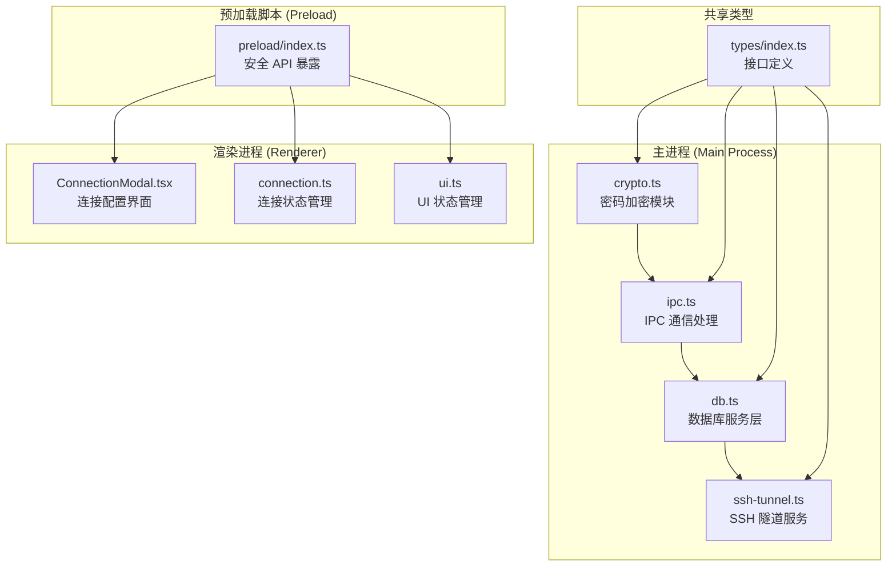
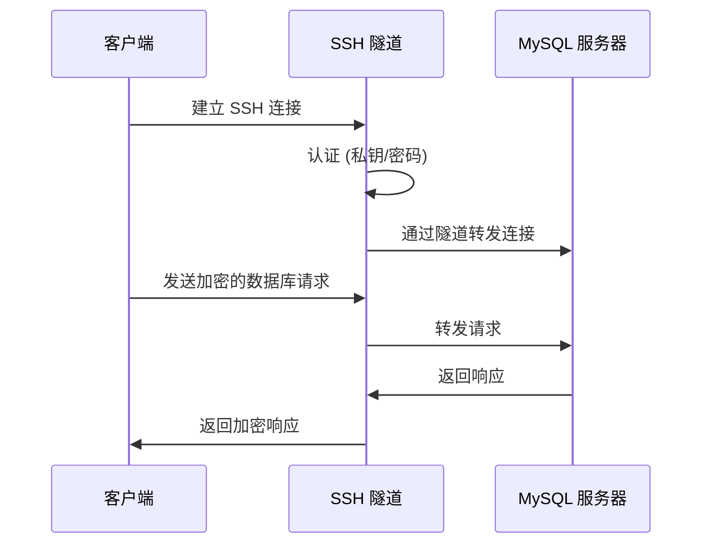
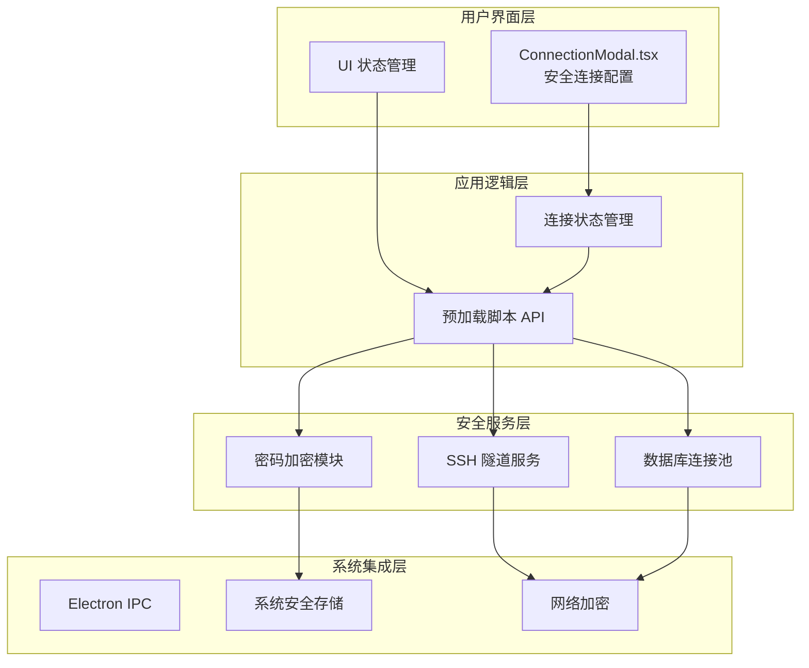
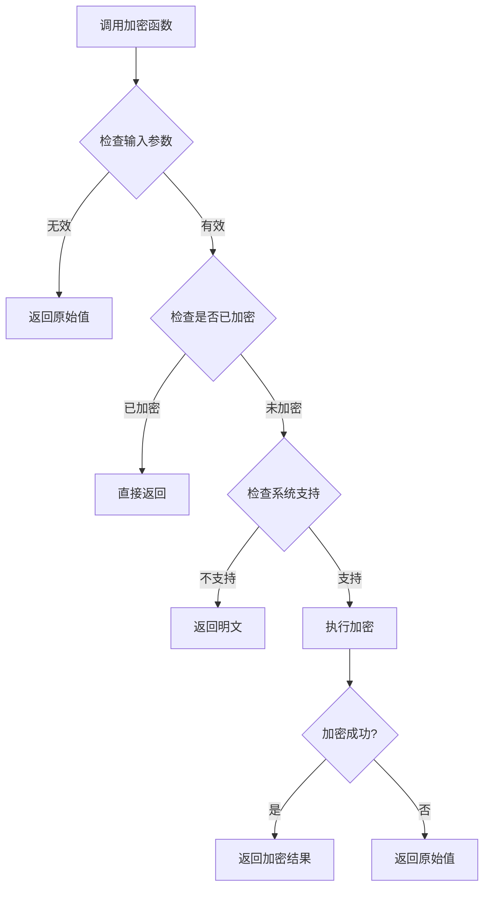
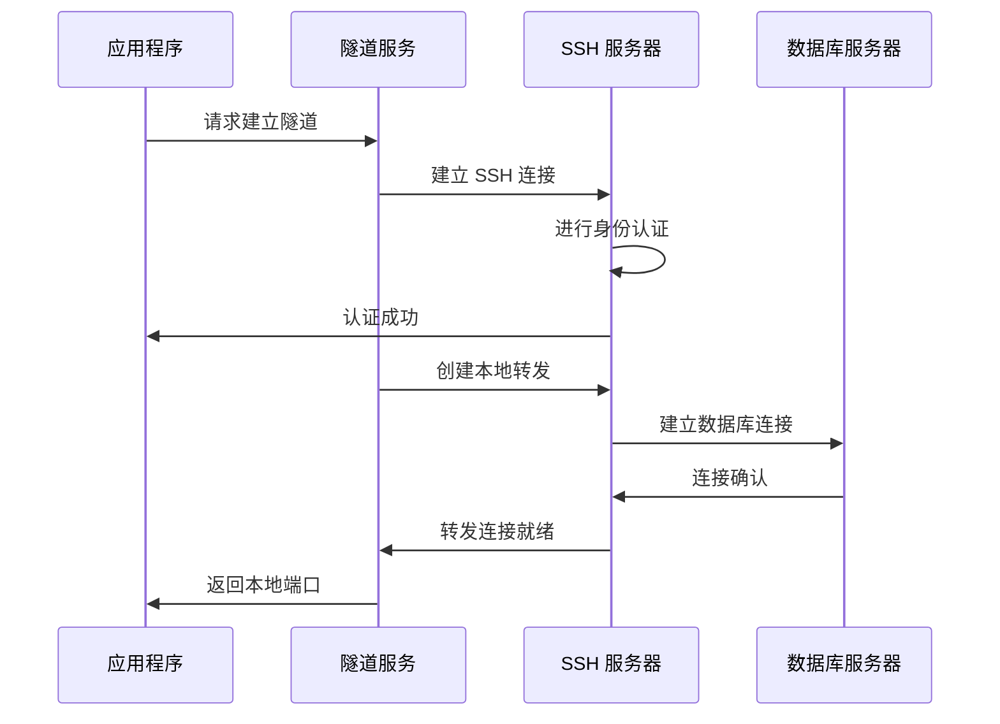
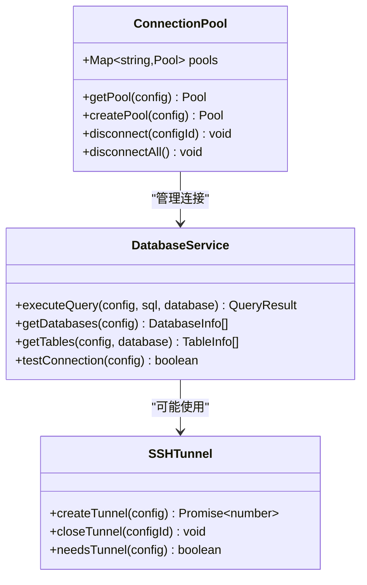
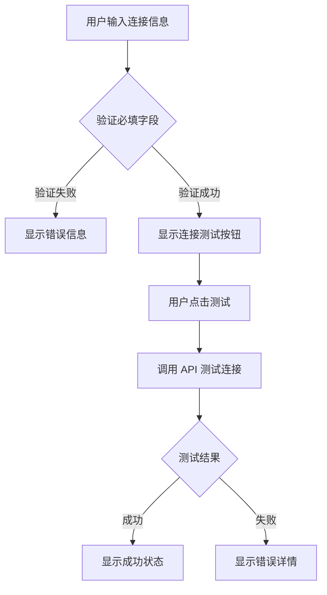
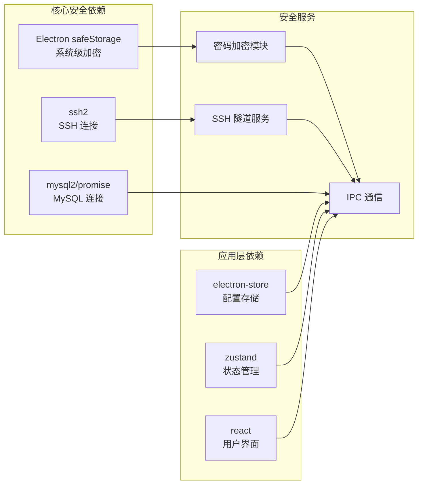

# 安全增强功能

<cite>
**本文档引用的文件**
- [crypto.ts](file://src/main/crypto.ts)
- [ipc.ts](file://src/main/ipc.ts)
- [db.ts](file://src/main/services/db.ts)
- [ssh-tunnel.ts](file://src/main/services/ssh-tunnel.ts)
- [preload/index.ts](file://src/preload/index.ts)
- [ConnectionModal.tsx](file://src/renderer/src/components/ConnectionModal.tsx)
- [connection.ts](file://src/renderer/src/stores/connection.ts)
- [ui.ts](file://src/renderer/src/stores/ui.ts)
- [types/index.ts](file://src/shared/types/index.ts)
- [package.json](file://package.json)
- [README.md](file://README.md)
</cite>

## 目录
1. [简介](#简介)
2. [项目结构](#项目结构)
3. [核心安全组件](#核心安全组件)
4. [架构概览](#架构概览)
5. [详细组件分析](#详细组件分析)
6. [依赖关系分析](#依赖关系分析)
7. [性能考虑](#性能考虑)
8. [故障排除指南](#故障排除指南)
9. [结论](#结论)

## 简介

nexSql 是一个基于 Electron + React 构建的现代化数据库管理工具，专注于 MySQL 数据库的可视化与开发。该项目在安全性方面采用了多层次的设计策略，包括密码加密存储、安全连接传输、以及用户界面的安全交互。

项目的核心安全特性包括：
- **系统级密码加密存储**：利用 Electron safeStorage 实现跨平台的密码保护
- **安全连接传输**：支持 SSH 隧道和 SSL 加密连接
- **安全的 IPC 通信**：通过预加载脚本实现受控的主进程与渲染进程通信
- **用户界面安全**：提供连接测试和安全配置验证

## 项目结构

nexSql 采用典型的 Electron 应用架构，分为主进程、预加载脚本和渲染进程三个主要部分：



**图表来源**
- [crypto.ts:1-40](file://src/main/crypto.ts#L1-L40)
- [ipc.ts:1-448](file://src/main/ipc.ts#L1-L448)
- [db.ts:1-778](file://src/main/services/db.ts#L1-L778)
- [ssh-tunnel.ts:1-125](file://src/main/services/ssh-tunnel.ts#L1-L125)
- [preload/index.ts:1-99](file://src/preload/index.ts#L1-L99)

**章节来源**
- [README.md:135-184](file://README.md#L135-L184)

## 核心安全组件

### 密码加密存储系统

项目实现了基于 Electron safeStorage 的密码加密存储机制，该机制利用操作系统提供的安全存储服务：

- **macOS Keychain**：使用系统钥匙串进行密码存储
- **Windows DPAPI**：利用 Windows 数据保护 API
- **Linux libsecret**：通过 GNOME Keyring 或其他 compatible secret service

```mermaid
flowchart TD
A[输入明文密码] --> B{检查是否已加密}
B --> |是| C[直接返回原值]
B --> |否| D{系统是否支持加密}
D --> |否| E[返回明文密码]
D --> |是| F[使用 safeStorage.encryptString]
F --> G[添加 "enc:" 前缀]
G --> H[返回加密密码]
E --> H
C --> H
```

**图表来源**
- [crypto.ts:15-26](file://src/main/crypto.ts#L15-L26)

### 安全连接传输

项目支持两种安全连接方式：

1. **SSL 加密连接**：通过 MySQL SSL 参数实现
2. **SSH 隧道连接**：通过 SSH 隧道建立安全的网络通道



**图表来源**
- [ssh-tunnel.ts:28-94](file://src/main/services/ssh-tunnel.ts#L28-L94)
- [db.ts:37-44](file://src/main/services/db.ts#L37-L44)

### 安全 IPC 通信

通过预加载脚本实现受控的主进程与渲染进程通信，确保只有授权的操作才能访问敏感功能。

**章节来源**
- [crypto.ts:1-40](file://src/main/crypto.ts#L1-L40)
- [ssh-tunnel.ts:1-125](file://src/main/services/ssh-tunnel.ts#L1-L125)
- [db.ts:1-778](file://src/main/services/db.ts#L1-L778)

## 架构概览

nexSql 的安全架构采用分层设计，每个层级都有相应的安全措施：



**图表来源**
- [ConnectionModal.tsx:1-344](file://src/renderer/src/components/ConnectionModal.tsx#L1-L344)
- [connection.ts:1-64](file://src/renderer/src/stores/connection.ts#L1-L64)
- [preload/index.ts:1-99](file://src/preload/index.ts#L1-L99)
- [crypto.ts:1-40](file://src/main/crypto.ts#L1-L40)
- [ssh-tunnel.ts:1-125](file://src/main/services/ssh-tunnel.ts#L1-L125)

## 详细组件分析

### 密码加密模块 (crypto.ts)

密码加密模块是整个安全系统的核心组件，负责处理所有敏感数据的加密和解密操作。

#### 核心功能

1. **密码加密**：使用 `safeStorage.encryptString` 将明文密码转换为加密格式
2. **密码解密**：使用 `safeStorage.decryptString` 将加密密码还原为明文
3. **兼容性处理**：支持混合存储模式，既可存储加密密码也可存储明文密码

#### 错误处理机制

模块实现了完善的错误处理机制，确保在系统不支持加密或加密失败时能够优雅降级：



**图表来源**
- [crypto.ts:16-26](file://src/main/crypto.ts#L16-L26)

**章节来源**
- [crypto.ts:1-40](file://src/main/crypto.ts#L1-L40)

### IPC 通信安全 (ipc.ts)

IPC 通信模块实现了主进程与渲染进程之间的安全通信，通过预加载脚本暴露受限的 API 接口。

#### 安全特性

1. **API 白名单**：只暴露必要的 API 方法
2. **参数验证**：对所有传入参数进行验证
3. **错误隔离**：捕获并处理异常，防止错误传播到渲染进程
4. **日志记录**：记录详细的错误信息用于调试

#### 连接配置管理

模块提供了完整的连接配置管理功能，包括：

- **连接保存**：加密保存连接信息
- **连接加载**：解密加载连接信息
- **连接删除**：安全删除连接配置

**章节来源**
- [ipc.ts:1-448](file://src/main/ipc.ts#L1-L448)

### SSH 隧道服务 (ssh-tunnel.ts)

SSH 隧道服务提供了安全的网络连接通道，通过 SSH 连接建立本地端口转发。

#### 隧道建立流程



**图表来源**
- [ssh-tunnel.ts:28-94](file://src/main/services/ssh-tunnel.ts#L28-L94)

#### 安全特性

1. **多种认证方式**：支持私钥和密码认证
2. **自动重连**：提供连接保持和自动重连机制
3. **资源清理**：确保隧道关闭时释放所有资源

**章节来源**
- [ssh-tunnel.ts:1-125](file://src/main/services/ssh-tunnel.ts#L1-L125)

### 数据库连接安全 (db.ts)

数据库连接模块实现了安全的数据库连接管理，包括连接池管理和 SSL 配置。

#### 连接池管理



**图表来源**
- [db.ts:5-53](file://src/main/services/db.ts#L5-L53)
- [ssh-tunnel.ts:11-125](file://src/main/services/ssh-tunnel.ts#L11-L125)

#### SSL 配置

模块支持 SSL 连接配置，通过 `rejectUnauthorized: false` 参数实现灵活的证书验证策略。

**章节来源**
- [db.ts:1-778](file://src/main/services/db.ts#L1-L778)

### 用户界面安全 (ConnectionModal.tsx)

连接配置界面提供了直观的安全连接设置界面，包含以下安全特性：

#### 安全配置选项

1. **SSL 连接开关**：允许用户启用 SSL 加密
2. **SSH 隧道配置**：提供 SSH 连接参数设置
3. **连接测试**：内置连接测试功能
4. **实时验证**：输入验证和错误提示

#### 用户体验优化



**图表来源**
- [ConnectionModal.tsx:44-65](file://src/renderer/src/components/ConnectionModal.tsx#L44-L65)

**章节来源**
- [ConnectionModal.tsx:1-344](file://src/renderer/src/components/ConnectionModal.tsx#L1-L344)

## 依赖关系分析

项目的安全相关依赖关系如下：



**图表来源**
- [package.json:16-27](file://package.json#L16-L27)
- [crypto.ts](file://src/main/crypto.ts#L6)
- [ssh-tunnel.ts](file://src/main/services/ssh-tunnel.ts#L1)
- [db.ts](file://src/main/services/db.ts#L1)

**章节来源**
- [package.json:1-45](file://package.json#L1-L45)

## 性能考虑

### 加密性能优化

1. **延迟加密**：只在需要时进行加密操作
2. **缓存机制**：对解密后的密码进行短期缓存
3. **异步处理**：所有加密操作都是异步的，不影响 UI 响应

### 连接池优化

1. **连接复用**：通过连接池减少连接建立开销
2. **超时控制**：合理的连接超时设置
3. **资源清理**：及时释放不再使用的连接

### 内存管理

1. **隧道资源**：确保 SSH 隧道正确关闭
2. **数据库连接**：及时释放数据库连接
3. **事件监听器**：避免内存泄漏

## 故障排除指南

### 常见安全问题

#### 密码解密失败

**症状**：连接配置中的密码显示为加密格式而非明文

**解决方案**：
1. 检查系统是否支持安全存储
2. 验证加密模块是否正常工作
3. 检查配置文件格式

#### SSH 连接失败

**症状**：SSH 隧道无法建立连接

**排查步骤**：
1. 验证 SSH 服务器可达性
2. 检查认证凭据
3. 确认防火墙设置
4. 查看 SSH 日志

#### SSL 连接问题

**症状**：SSL 连接建立失败

**解决方法**：
1. 验证 SSL 证书有效性
2. 检查 SSL 配置参数
3. 确认服务器 SSL 设置

### 调试技巧

1. **启用详细日志**：查看主进程控制台输出
2. **检查错误堆栈**：获取完整的错误信息
3. **验证配置**：确认所有配置参数正确

**章节来源**
- [ipc.ts:18-46](file://src/main/ipc.ts#L18-L46)

## 结论

nexSql 的安全增强功能体现了现代桌面应用的安全设计理念，通过多层次的安全措施确保用户数据和连接信息的安全性。

### 主要成就

1. **系统级密码保护**：利用操作系统提供的安全存储服务
2. **多层加密传输**：支持 SSL 和 SSH 隧道双重加密
3. **安全 IPC 通信**：通过预加载脚本实现受控的 API 访问
4. **用户友好的安全界面**：提供直观的安全配置和测试功能

### 最佳实践

1. **最小权限原则**：只暴露必要的 API 方法
2. **防御性编程**：对所有输入进行验证和清理
3. **错误处理**：提供清晰的错误信息但不泄露敏感细节
4. **资源管理**：确保所有安全资源正确释放

### 未来改进方向

1. **更严格的 SSL 验证**：默认启用证书验证
2. **双因素认证**：支持更高级别的身份验证
3. **审计日志**：记录重要的安全相关操作
4. **定期安全审查**：持续改进安全措施

通过这些安全增强功能，nexSql 为用户提供了可靠、安全的数据库管理体验，满足了现代企业对数据安全的严格要求。