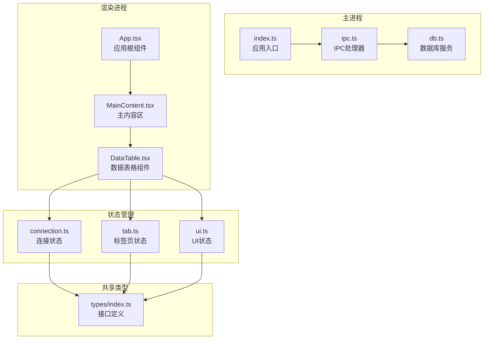
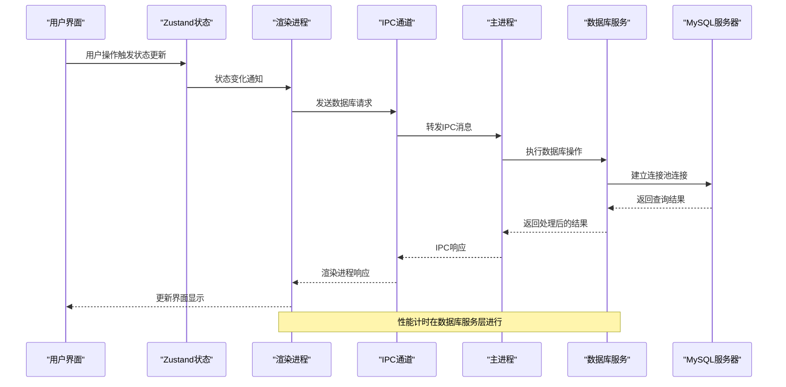
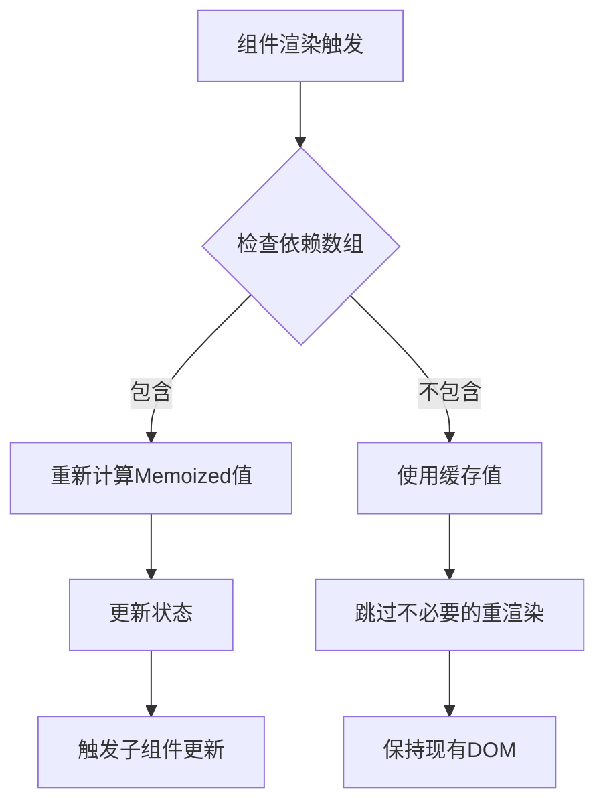
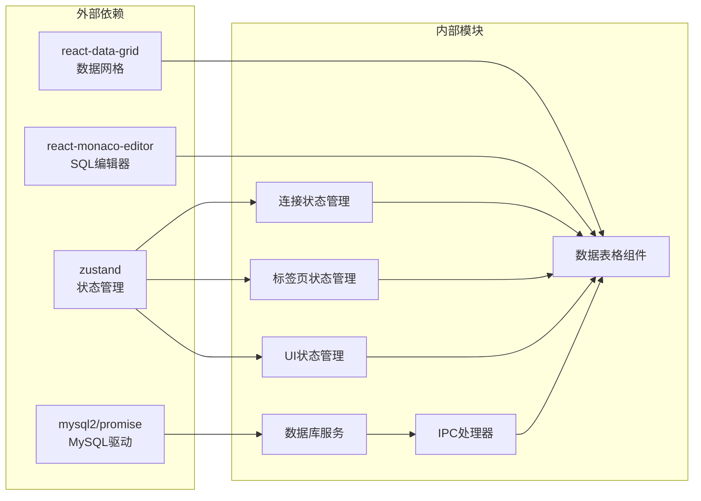
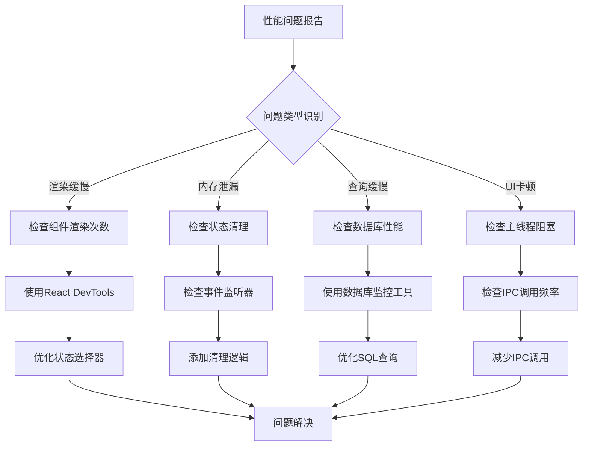

# 性能监控与优化

<cite>
**本文档引用的文件**
- [connection.ts](file://src/renderer/src/stores/connection.ts)
- [tab.ts](file://src/renderer/src/stores/tab.ts)
- [ui.ts](file://src/renderer/src/stores/ui.ts)
- [DataTable.tsx](file://src/renderer/src/components/DataTable.tsx)
- [MainContent.tsx](file://src/renderer/src/components/MainContent.tsx)
- [db.ts](file://src/main/services/db.ts)
- [ipc.ts](file://src/main/ipc.ts)
- [App.tsx](file://src/renderer/src/App.tsx)
- [index.ts](file://src/main/index.ts)
- [types/index.ts](file://src/shared/types/index.ts)
- [package.json](file://package.json)
</cite>

## 目录
1. [简介](#简介)
2. [项目结构](#项目结构)
3. [核心组件](#核心组件)
4. [架构概览](#架构概览)
5. [详细组件分析](#详细组件分析)
6. [依赖关系分析](#依赖关系分析)
7. [性能考虑因素](#性能考虑因素)
8. [故障排除指南](#故障排除指南)
9. [结论](#结论)

## 简介
本文件专注于nexSql应用的性能监控与优化策略。该应用是一个基于Electron的数据库管理工具，采用React + TypeScript前端框架和MySQL数据库连接。本文档将深入分析数据流中的性能瓶颈识别方法，包括状态更新频率、内存使用情况、渲染性能等指标，并提供状态选择器使用和性能优化策略、大数据量处理最佳实践以及性能调试工具和监控方法。

## 项目结构
应用采用典型的Electron架构，分为主进程(main process)和渲染进程(renderer process)两部分：

**图表来源**
- [index.ts](file://src/main/index.ts)
- [ipc.ts](file://src/main/ipc.ts)
- [db.ts](file://src/main/services/db.ts)
- [App.tsx](file://src/renderer/src/App.tsx)
- [MainContent.tsx](file://src/renderer/src/components/MainContent.tsx)
- [DataTable.tsx](file://src/renderer/src/components/DataTable.tsx)
- [connection.ts](file://src/renderer/src/stores/connection.ts)
- [tab.ts](file://src/renderer/src/stores/tab.ts)
- [ui.ts](file://src/renderer/src/stores/ui.ts)
- [types/index.ts](file://src/shared/types/index.ts)

**章节来源**
- [index.ts](file://src/main/index.ts)
- [ipc.ts](file://src/main/ipc.ts)
- [db.ts](file://src/main/services/db.ts)
- [App.tsx](file://src/renderer/src/App.tsx)
- [MainContent.tsx](file://src/renderer/src/components/MainContent.tsx)
- [DataTable.tsx](file://src/renderer/src/components/DataTable.tsx)
- [connection.ts](file://src/renderer/src/stores/connection.ts)
- [tab.ts](file://src/renderer/src/stores/tab.ts)
- [ui.ts](file://src/renderer/src/stores/ui.ts)
- [types/index.ts](file://src/shared/types/index.ts)

## 核心组件
应用的核心性能相关组件包括：

### 状态管理组件
- **连接状态管理**: 使用Zustand管理数据库连接配置、状态和错误信息
- **标签页状态管理**: 管理打开的标签页、活动标签页和标签页更新
- **UI状态管理**: 控制侧边栏宽度、结果面板高度等UI布局参数

### 数据展示组件
- **数据表格组件**: 实现分页、筛选、排序功能的数据网格显示
- **主内容区组件**: 根据活动标签页动态渲染不同类型的视图

### 数据库服务
- **连接池管理**: 基于mysql2的连接池实现，支持多连接并发访问
- **查询执行**: 包含性能计时和结果处理逻辑

**章节来源**
- [connection.ts](file://src/renderer/src/stores/connection.ts)
- [tab.ts](file://src/renderer/src/stores/tab.ts)
- [ui.ts](file://src/renderer/src/stores/ui.ts)
- [DataTable.tsx](file://src/renderer/src/components/DataTable.tsx)
- [MainContent.tsx](file://src/renderer/src/components/MainContent.tsx)
- [db.ts](file://src/main/services/db.ts)

## 架构概览
应用采用客户端-服务器架构，通过IPC通道进行通信：

**图表来源**
- [DataTable.tsx](file://src/renderer/src/components/DataTable.tsx)
- [ipc.ts](file://src/main/ipc.ts)
- [db.ts](file://src/main/services/db.ts)

## 详细组件分析

### 数据表格组件性能分析
数据表格组件是应用中最复杂的性能热点，需要重点关注以下方面：

#### 分页机制
组件实现了固定大小的分页策略：
- 每页默认100行记录
- 支持向前、向后、首页、末页导航
- 动态计算总页数和当前页范围

#### 状态选择器优化
组件使用了多个状态选择器来优化渲染性能：

**图表来源**
- [DataTable.tsx](file://src/renderer/src/components/DataTable.tsx)

#### 性能瓶颈识别
主要性能瓶颈包括：
1. **大数据量查询**: 单次查询返回大量数据
2. **DOM渲染**: react-data-grid组件渲染大量单元格
3. **状态更新**: 频繁的状态变更导致重渲染
4. **网络延迟**: 数据库查询响应时间

**章节来源**
- [DataTable.tsx](file://src/renderer/src/components/DataTable.tsx)

### 状态管理组件分析
应用使用Zustand实现轻量级状态管理：

#### 连接状态管理
连接状态管理器包含以下关键特性：
- **连接池映射**: 将连接ID映射到连接池实例
- **状态跟踪**: 监控每个连接的连接状态
- **错误处理**: 记录和传播连接错误

#### 标签页状态管理
标签页管理器实现智能去重和状态同步：
- **唯一性检查**: 防止重复打开相同数据表
- **状态同步**: 维护活动标签页和所有标签页状态
- **生命周期管理**: 自动清理关闭的标签页

#### UI状态管理
UI状态管理器提供灵活的布局控制：
- **范围限制**: 确保UI尺寸在合理范围内
- **即时响应**: 提供流畅的用户交互体验

**章节来源**
- [connection.ts](file://src/renderer/src/stores/connection.ts)
- [tab.ts](file://src/renderer/src/stores/tab.ts)
- [ui.ts](file://src/renderer/src/stores/ui.ts)

### 数据库服务性能分析
数据库服务层实现了完整的性能监控：

#### 连接池管理
- **连接复用**: 通过连接池减少连接建立开销
- **并发控制**: 限制最大连接数为5个
- **资源清理**: 正确释放连接和关闭连接池

#### 查询性能监控
查询执行包含精确的性能计时：
- **开始时间**: 记录查询开始时刻
- **结束时间**: 记录查询完成时刻
- **持续时间**: 计算查询执行耗时

#### 结果处理优化
- **类型安全**: 使用TypeScript确保数据结构正确
- **错误处理**: 提供详细的错误信息和堆栈跟踪
- **资源管理**: 确保数据库连接正确释放

**章节来源**
- [db.ts](file://src/main/services/db.ts)

## 依赖关系分析

**图表来源**
- [package.json](file://package.json)
- [connection.ts](file://src/renderer/src/stores/connection.ts)
- [tab.ts](file://src/renderer/src/stores/tab.ts)
- [ui.ts](file://src/renderer/src/stores/ui.ts)
- [DataTable.tsx](file://src/renderer/src/components/DataTable.tsx)
- [db.ts](file://src/main/services/db.ts)
- [ipc.ts](file://src/main/ipc.ts)

**章节来源**
- [package.json](file://package.json)
- [connection.ts](file://src/renderer/src/stores/connection.ts)
- [tab.ts](file://src/renderer/src/stores/tab.ts)
- [ui.ts](file://src/renderer/src/stores/ui.ts)
- [DataTable.tsx](file://src/renderer/src/components/DataTable.tsx)
- [db.ts](file://src/main/services/db.ts)
- [ipc.ts](file://src/main/ipc.ts)

## 性能考虑因素

### 状态更新频率优化
应用通过以下策略优化状态更新频率：

#### 状态选择器模式
- **精确订阅**: 只订阅组件实际使用的状态片段
- **避免全局监听**: 减少不必要的全局状态监听
- **批量更新**: 合并相关的状态更新操作

#### 组件渲染优化
- **useMemo缓存**: 缓存昂贵的计算结果
- **useCallback稳定**: 保持回调函数引用稳定
- **条件渲染**: 避免不必要的组件重渲染

### 内存使用情况监控
应用的内存使用主要集中在以下几个方面：

#### 数据缓存策略
- **分页加载**: 仅缓存当前页面的数据
- **连接池**: 限制同时存在的数据库连接数量
- **状态清理**: 及时清理不再使用的状态数据

#### 内存泄漏防护
- **事件监听器清理**: 确保组件卸载时移除监听器
- **定时器清理**: 避免定时器造成内存泄漏
- **闭包清理**: 注意闭包可能造成的循环引用

### 渲染性能优化
数据表格组件的渲染性能优化策略：

#### 虚拟化技术
虽然当前实现未使用虚拟化，但可以考虑以下改进：
- **行虚拟化**: 仅渲染可见区域内的行
- **列虚拟化**: 对宽表实现列虚拟化
- **动态高度**: 支持可变行高的虚拟化

#### 渲染批处理
- **批量DOM更新**: 合并多次DOM更新操作
- **requestAnimationFrame**: 使用浏览器动画帧优化渲染
- **防抖处理**: 对频繁的用户输入进行防抖

### 大数据量处理最佳实践

#### 分页策略
应用已实现基础的分页功能，建议进一步优化：
- **预加载机制**: 在用户浏览下一页前预加载数据
- **智能分页**: 根据网络状况调整每页大小
- **无限滚动**: 对于简单场景考虑无限滚动替代传统分页

#### 懒加载技术
- **按需加载**: 仅在用户切换到标签页时加载数据
- **延迟初始化**: 延迟初始化大型组件
- **渐进式渲染**: 先渲染基本结构，再异步加载详细内容

#### 查询优化
- **索引利用**: 确保常用查询字段有适当索引
- **查询计划**: 分析慢查询并优化SQL语句
- **连接复用**: 充分利用连接池减少连接开销

## 故障排除指南

### 性能问题诊断流程

### 常见性能问题及解决方案

#### 状态更新过于频繁
**问题表现**: UI频繁闪烁，渲染性能下降
**解决方案**:
- 使用更精确的状态选择器
- 合并状态更新操作
- 实施防抖和节流机制

#### 数据库连接过多
**问题表现**: 数据库连接超限，查询响应缓慢
**解决方案**:
- 优化连接池配置
- 实施连接复用策略
- 添加连接超时处理

#### 内存使用过高
**问题表现**: 应用内存持续增长
**解决方案**:
- 实施数据缓存策略
- 添加垃圾回收触发
- 优化大对象的生命周期管理

**章节来源**
- [db.ts](file://src/main/services/db.ts)
- [DataTable.tsx](file://src/renderer/src/components/DataTable.tsx)
- [connection.ts](file://src/renderer/src/stores/connection.ts)

## 结论
本文件全面分析了nexSql应用的性能监控与优化策略。通过深入分析状态管理、数据渲染、数据库连接等关键组件，我们识别了主要的性能瓶颈并提供了针对性的优化方案。

### 关键发现
1. **状态管理优化**: Zustand的精确订阅模式有效减少了不必要的重渲染
2. **数据库性能**: 连接池管理和性能计时为数据库操作提供了良好的监控基础
3. **渲染优化**: 分页机制和Memo化策略有效控制了渲染成本
4. **内存管理**: 当前实现相对简洁，但仍需关注大数据量场景下的内存使用

### 建议的改进方向
1. **虚拟化实现**: 考虑引入行虚拟化以支持更大的数据集
2. **性能监控增强**: 添加更详细的性能指标收集和可视化
3. **缓存策略**: 实施更智能的数据缓存和失效机制
4. **异步处理**: 优化长任务的异步处理，避免阻塞UI线程

这些优化措施将显著提升应用在处理大数据量时的性能表现，为用户提供更加流畅的数据库管理体验。