# 数据同步机制

<cite>
**本文档引用的文件**
- [src/main/ipc.ts](file://src/main/ipc.ts)
- [src/main/services/db.ts](file://src/main/services/db.ts)
- [src/preload/index.ts](file://src/preload/index.ts)
- [src/renderer/src/stores/connection.ts](file://src/renderer/src/stores/connection.ts)
- [src/renderer/src/stores/tab.ts](file://src/renderer/src/stores/tab.ts)
- [src/renderer/src/stores/ui.ts](file://src/renderer/src/stores/ui.ts)
- [src/renderer/src/components/DataTable.tsx](file://src/renderer/src/components/DataTable.tsx)
- [src/renderer/src/components/ConnectionTree.tsx](file://src/renderer/src/components/ConnectionTree.tsx)
- [src/renderer/src/components/QueryEditor.tsx](file://src/renderer/src/components/QueryEditor.tsx)
- [src/shared/types/index.ts](file://src/shared/types/index.ts)
- [src/main/index.ts](file://src/main/index.ts)
</cite>

## 目录
1. [简介](#简介)
2. [项目结构](#项目结构)
3. [核心组件](#核心组件)
4. [架构概览](#架构概览)
5. [详细组件分析](#详细组件分析)
6. [依赖关系分析](#依赖关系分析)
7. [性能考虑](#性能考虑)
8. [故障排除指南](#故障排除指南)
9. [结论](#结论)

## 简介

本项目是一个基于 Electron 的 MySQL 客户端应用程序，实现了完整的数据同步机制。该机制确保前端状态与后端数据库之间的实时同步，包括异步操作处理、数据一致性保证、冲突解决机制、IPC 通信格式以及缓存策略。

数据同步机制的核心目标是：
- 维护前端 UI 状态与数据库实际状态的一致性
- 提供可靠的异步操作处理和错误恢复机制
- 实现高效的缓存策略和数据刷新机制
- 确保在各种网络和系统异常情况下的数据完整性

## 项目结构

该项目采用典型的 Electron 应用程序结构，分为三个主要部分：

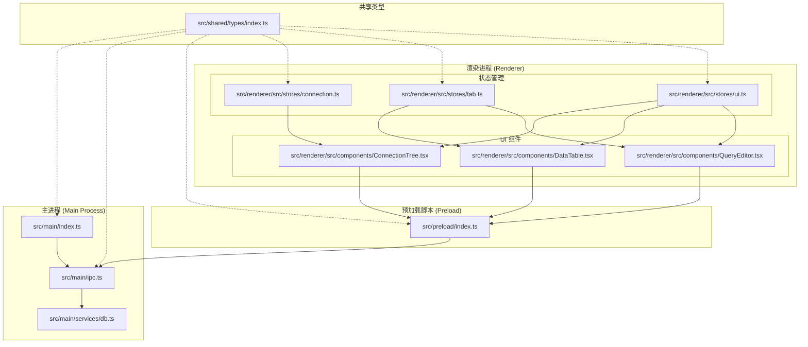

**图表来源**
- [src/main/index.ts:1-64](file://src/main/index.ts#L1-L64)
- [src/main/ipc.ts:1-182](file://src/main/ipc.ts#L1-L182)
- [src/main/services/db.ts:1-277](file://src/main/services/db.ts#L1-L277)
- [src/preload/index.ts:1-60](file://src/preload/index.ts#L1-L60)

**章节来源**
- [src/main/index.ts:1-64](file://src/main/index.ts#L1-L64)
- [src/main/ipc.ts:1-182](file://src/main/ipc.ts#L1-L182)
- [src/main/services/db.ts:1-277](file://src/main/services/db.ts#L1-L277)
- [src/preload/index.ts:1-60](file://src/preload/index.ts#L1-L60)

## 核心组件

### IPC 通信层

IPC（Inter-Process Communication）通信层是整个数据同步机制的核心，负责主进程与渲染进程之间的数据传输。

#### IPC 响应格式

所有 IPC 调用都遵循统一的响应格式：

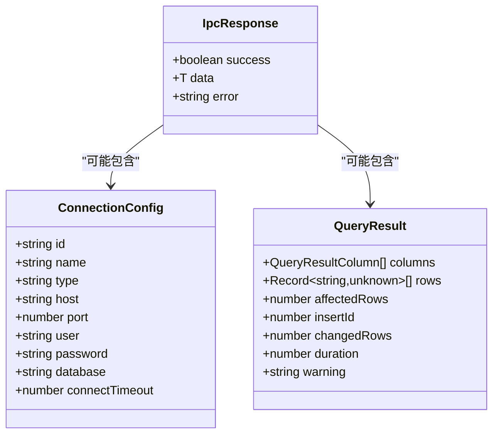

**图表来源**
- [src/shared/types/index.ts:104-108](file://src/shared/types/index.ts#L104-L108)
- [src/shared/types/index.ts:3-22](file://src/shared/types/index.ts#L3-L22)
- [src/shared/types/index.ts:80-88](file://src/shared/types/index.ts#L80-L88)

#### IPC 处理器注册

主进程通过 `setupIpcHandlers` 函数注册所有 IPC 处理器：

**章节来源**
- [src/main/ipc.ts:46-177](file://src/main/ipc.ts#L46-L177)

### 数据库服务层

数据库服务层封装了所有数据库操作，提供了连接池管理和事务处理能力。

#### 连接池管理

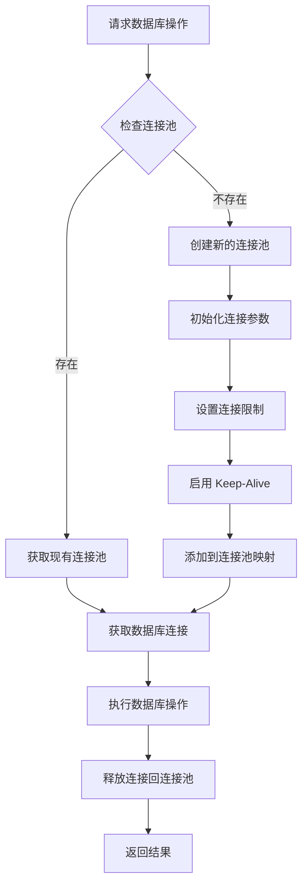

**图表来源**
- [src/main/services/db.ts:30-36](file://src/main/services/db.ts#L30-L36)
- [src/main/services/db.ts:11-28](file://src/main/services/db.ts#L11-L28)

**章节来源**
- [src/main/services/db.ts:1-277](file://src/main/services/db.ts#L1-L277)

### 状态管理层

状态管理层使用 Zustand 实现轻量级的状态管理，确保前端状态与后端数据的同步。

#### 连接状态管理

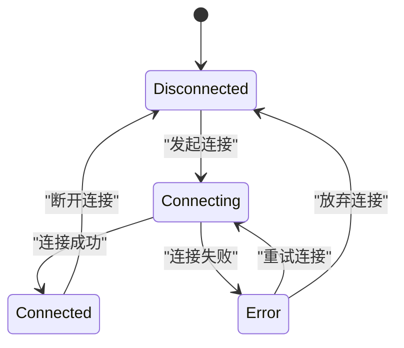

**图表来源**
- [src/renderer/src/stores/connection.ts:4-15](file://src/renderer/src/stores/connection.ts#L4-L15)

**章节来源**
- [src/renderer/src/stores/connection.ts:1-64](file://src/renderer/src/stores/connection.ts#L1-L64)

## 架构概览

数据同步机制的整体架构采用分层设计，确保各层职责清晰且松耦合：

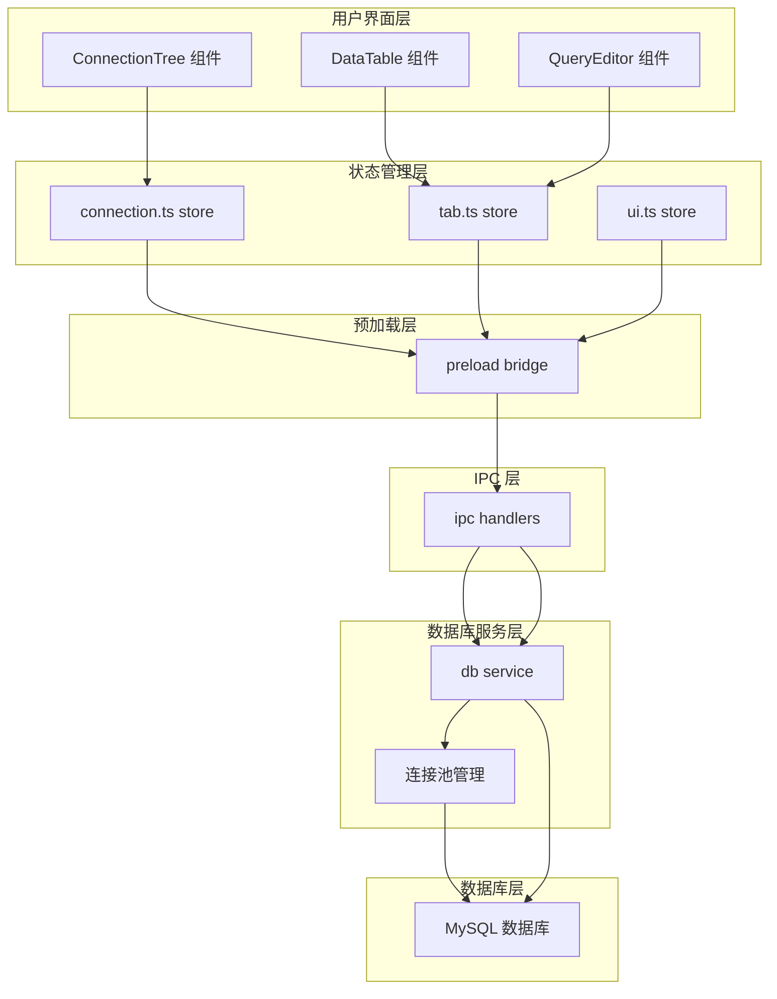

**图表来源**
- [src/renderer/src/components/ConnectionTree.tsx:1-313](file://src/renderer/src/components/ConnectionTree.tsx#L1-L313)
- [src/renderer/src/components/DataTable.tsx:1-297](file://src/renderer/src/components/DataTable.tsx#L1-L297)
- [src/renderer/src/components/QueryEditor.tsx:1-329](file://src/renderer/src/components/QueryEditor.tsx#L1-L329)
- [src/preload/index.ts:14-46](file://src/preload/index.ts#L14-L46)
- [src/main/ipc.ts:46-177](file://src/main/ipc.ts#L46-L177)
- [src/main/services/db.ts:1-277](file://src/main/services/db.ts#L1-L277)

## 详细组件分析

### 连接树组件的数据同步

连接树组件实现了层次化的数据同步机制，支持多级缓存和增量更新。

#### 缓存策略

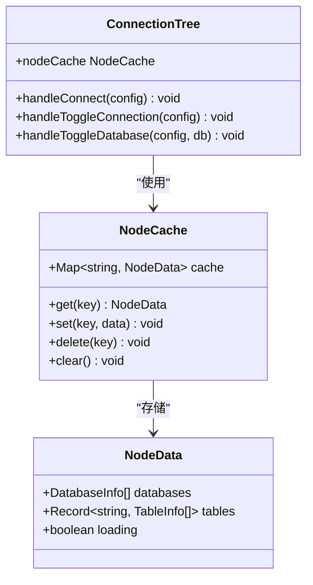

**图表来源**
- [src/renderer/src/components/ConnectionTree.tsx:22-29](file://src/renderer/src/components/ConnectionTree.tsx#L22-L29)

#### 同步流程

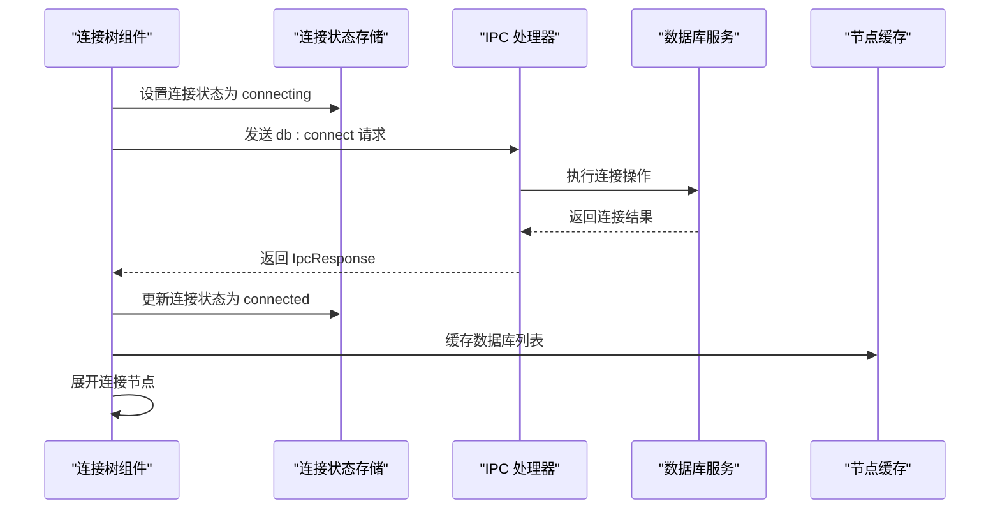

**图表来源**
- [src/renderer/src/components/ConnectionTree.tsx:40-58](file://src/renderer/src/components/ConnectionTree.tsx#L40-L58)
- [src/main/ipc.ts:86-94](file://src/main/ipc.ts#L86-L94)
- [src/main/services/db.ts:58-63](file://src/main/services/db.ts#L58-L63)

**章节来源**
- [src/renderer/src/components/ConnectionTree.tsx:1-313](file://src/renderer/src/components/ConnectionTree.tsx#L1-L313)

### 数据表格组件的分页同步

数据表格组件实现了智能的分页数据同步机制，支持动态过滤、排序和分页。

#### 分页同步机制

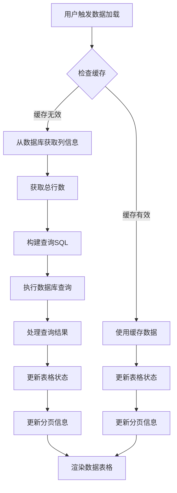

**图表来源**
- [src/renderer/src/components/DataTable.tsx:41-87](file://src/renderer/src/components/DataTable.tsx#L41-L87)

#### 数据一致性保证

数据表格组件通过以下机制保证数据一致性：

1. **时间戳同步**: 每次查询都会记录执行时间和结果
2. **增量更新**: 支持按需刷新特定表的数据
3. **错误隔离**: 单个表的查询错误不影响其他表的显示
4. **状态同步**: UI 状态与数据库状态保持同步

**章节来源**
- [src/renderer/src/components/DataTable.tsx:1-297](file://src/renderer/src/components/DataTable.tsx#L1-L297)

### 查询编辑器的实时同步

查询编辑器实现了 SQL 查询的实时同步机制，支持语法高亮、自动补全和结果展示。

#### 查询执行流程

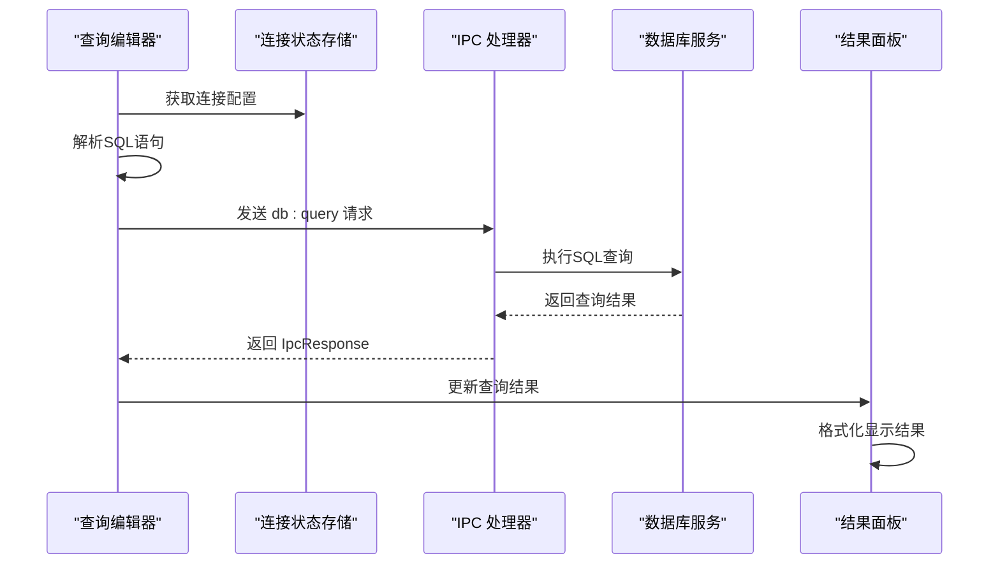

**图表来源**
- [src/renderer/src/components/QueryEditor.tsx:36-64](file://src/renderer/src/components/QueryEditor.tsx#L36-L64)
- [src/main/ipc.ts:106-117](file://src/main/ipc.ts#L106-L117)

**章节来源**
- [src/renderer/src/components/QueryEditor.tsx:1-329](file://src/renderer/src/components/QueryEditor.tsx#L1-L329)

### 状态管理的数据同步

状态管理层通过 Zustand 实现了高效的状态同步机制。

#### 状态同步流程

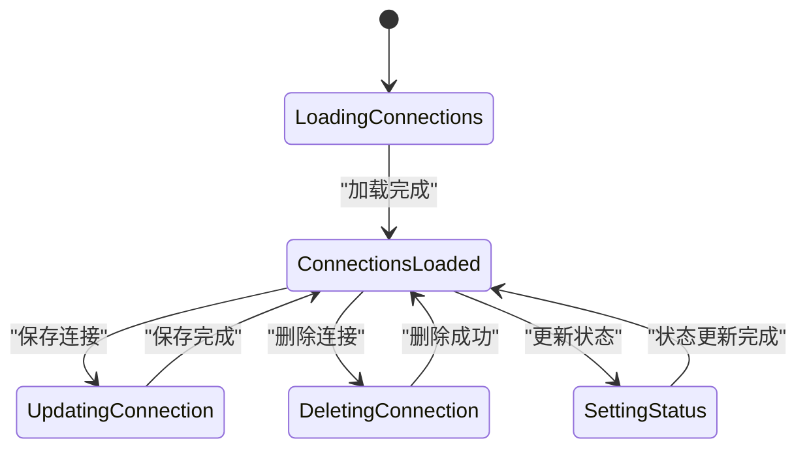

**图表来源**
- [src/renderer/src/stores/connection.ts:23-45](file://src/renderer/src/stores/connection.ts#L23-L45)

**章节来源**
- [src/renderer/src/stores/connection.ts:1-64](file://src/renderer/src/stores/connection.ts#L1-L64)
- [src/renderer/src/stores/tab.ts:1-65](file://src/renderer/src/stores/tab.ts#L1-L65)
- [src/renderer/src/stores/ui.ts:1-41](file://src/renderer/src/stores/ui.ts#L1-L41)

## 依赖关系分析

数据同步机制的依赖关系呈现清晰的分层结构：

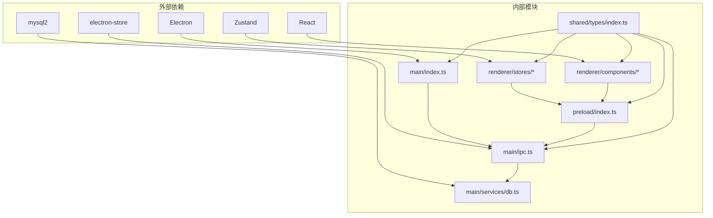

**图表来源**
- [src/main/index.ts:1-64](file://src/main/index.ts#L1-L64)
- [src/main/ipc.ts:1-5](file://src/main/ipc.ts#L1-L5)
- [src/main/services/db.ts:1](file://src/main/services/db.ts#L1)
- [src/preload/index.ts:1](file://src/preload/index.ts#L1)

### 关键依赖关系

1. **IPC 通信依赖**: 所有渲染进程组件都依赖预加载脚本提供的 API 桥接
2. **状态管理依赖**: UI 组件依赖状态存储进行数据同步
3. **数据库服务依赖**: IPC 处理器依赖数据库服务层进行实际操作
4. **类型定义依赖**: 所有模块共享类型定义，确保数据格式一致性

**章节来源**
- [src/main/ipc.ts:1-182](file://src/main/ipc.ts#L1-L182)
- [src/preload/index.ts:1-60](file://src/preload/index.ts#L1-L60)
- [src/shared/types/index.ts:1-124](file://src/shared/types/index.ts#L1-L124)

## 性能考虑

数据同步机制在设计时充分考虑了性能优化：

### 连接池优化

- **连接复用**: 使用连接池避免频繁创建和销毁数据库连接
- **连接限制**: 默认最大连接数为 5，防止资源耗尽
- **Keep-Alive**: 启用连接保活机制，减少网络延迟
- **超时控制**: 可配置连接超时时间，默认 10 秒

### 缓存策略

- **节点缓存**: 使用 Map 存储连接、数据库和表的元数据
- **增量更新**: 仅在需要时重新加载数据，避免不必要的网络请求
- **内存管理**: 及时清理不再使用的缓存数据

### 异步处理优化

- **并发控制**: 限制同时进行的数据库操作数量
- **错误恢复**: 自动重试机制和错误降级处理
- **进度反馈**: 实时显示操作进度和状态

## 故障排除指南

### 常见问题及解决方案

#### 连接失败

**症状**: 连接状态显示为错误，无法访问数据库

**诊断步骤**:
1. 检查网络连接是否正常
2. 验证数据库服务器是否在线
3. 确认连接凭据是否正确
4. 查看主进程日志中的详细错误信息

**解决方案**:
1. 重新输入正确的连接信息
2. 检查防火墙设置
3. 增加连接超时时间
4. 尝试使用不同的认证方式

#### 查询超时

**症状**: 查询长时间无响应或超时

**诊断步骤**:
1. 检查 SQL 语句的复杂度
2. 查看数据库服务器负载情况
3. 监控网络延迟

**解决方案**:
1. 优化 SQL 查询语句
2. 添加适当的索引
3. 分页处理大量数据
4. 调整连接池大小

#### 内存泄漏

**症状**: 应用程序内存使用持续增长

**诊断步骤**:
1. 检查缓存数据是否及时清理
2. 确认事件监听器是否正确移除
3. 验证数据库连接是否正确释放

**解决方案**:
1. 实施缓存过期机制
2. 使用 WeakMap 存储临时数据
3. 确保所有资源正确释放

### 错误处理机制

#### IPC 错误处理

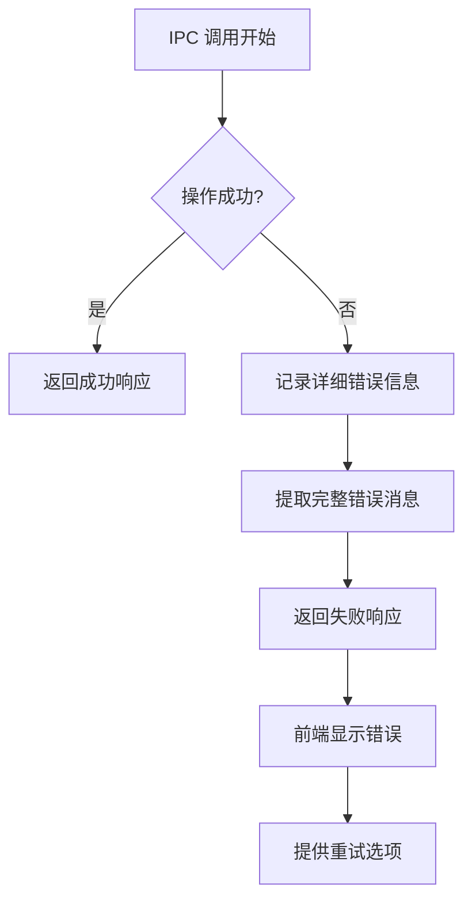

**图表来源**
- [src/main/ipc.ts:16-44](file://src/main/ipc.ts#L16-L44)

#### 数据一致性保证

1. **原子性**: 数据库操作在单个事务中完成
2. **持久性**: 关键状态变化写入本地存储
3. **隔离性**: 并发操作通过连接池管理
4. **一致性**: UI 状态与数据库状态保持同步

**章节来源**
- [src/main/ipc.ts:16-44](file://src/main/ipc.ts#L16-L44)
- [src/main/services/db.ts:73-135](file://src/main/services/db.ts#L73-L135)

## 结论

本项目实现了一个完整而高效的数据同步机制，具有以下特点：

### 技术优势

1. **分层架构**: 清晰的分层设计确保了代码的可维护性和扩展性
2. **异步处理**: 完善的异步操作处理机制，支持并发和错误恢复
3. **缓存策略**: 智能的缓存机制提高了数据访问效率
4. **错误处理**: 全面的错误处理和重试机制确保了系统的稳定性

### 设计亮点

1. **IPC 通信**: 统一的 IPC 通信协议简化了进程间数据交换
2. **状态管理**: 轻量级的状态管理方案实现了高效的 UI 同步
3. **类型安全**: 完整的 TypeScript 类型定义确保了数据格式的正确性
4. **性能优化**: 多层次的性能优化策略提升了用户体验

### 改进建议

1. **监控机制**: 可以添加更详细的性能监控和日志记录
2. **重试策略**: 可以实现更智能的指数退避重试算法
3. **缓存失效**: 可以实现基于时间戳的缓存失效机制
4. **并发控制**: 可以添加更精细的并发操作控制

该数据同步机制为类似的应用程序提供了一个优秀的参考实现，展示了如何在 Electron 环境下实现可靠的数据同步功能。