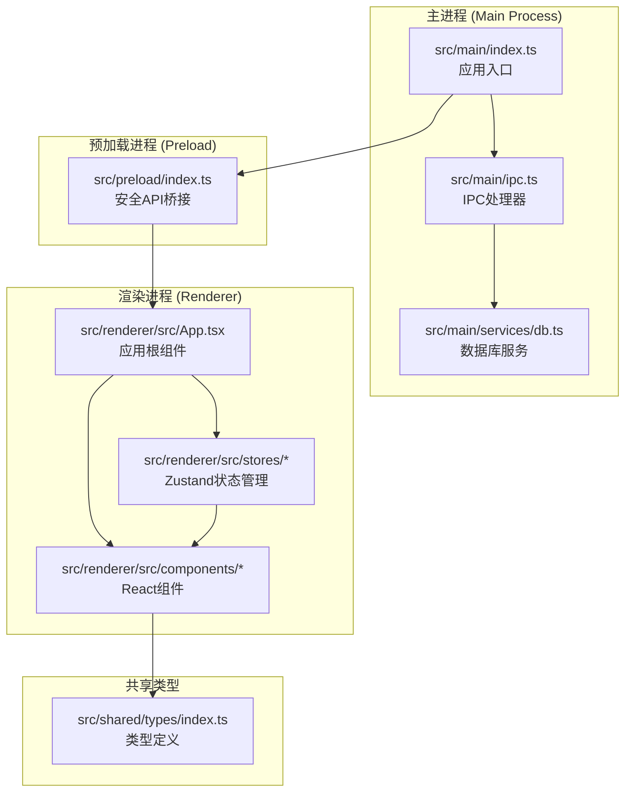
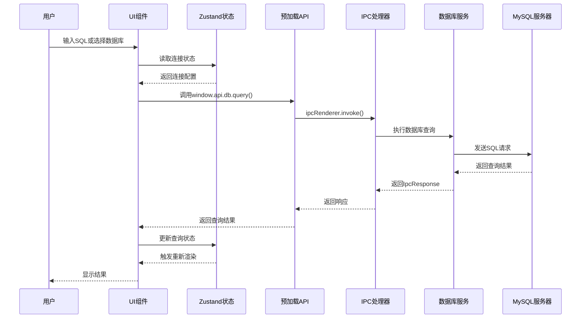
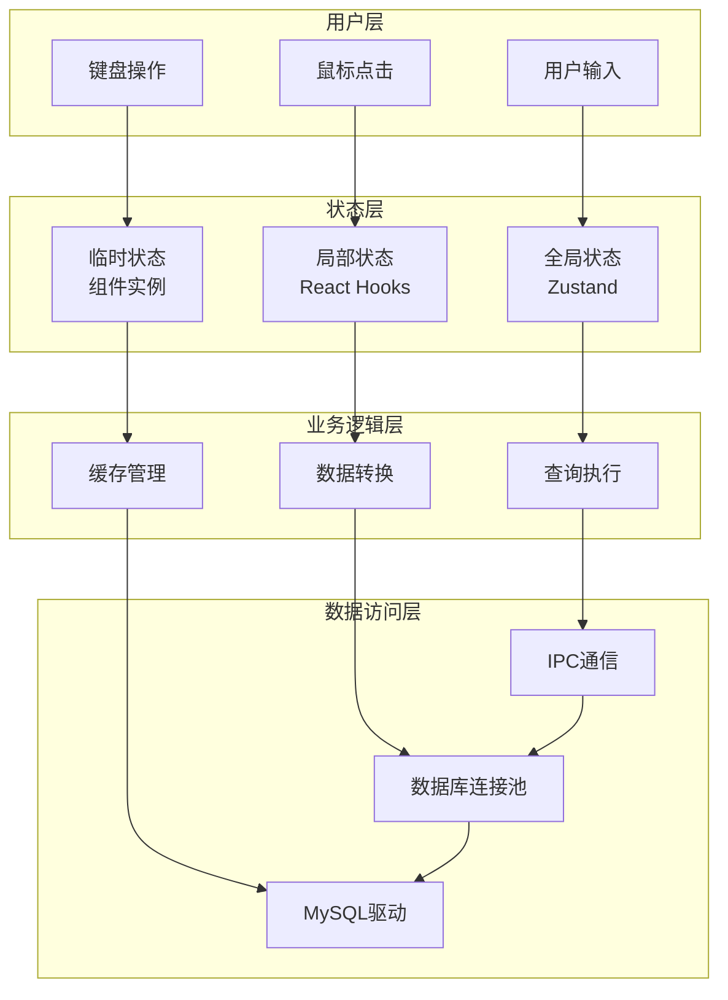
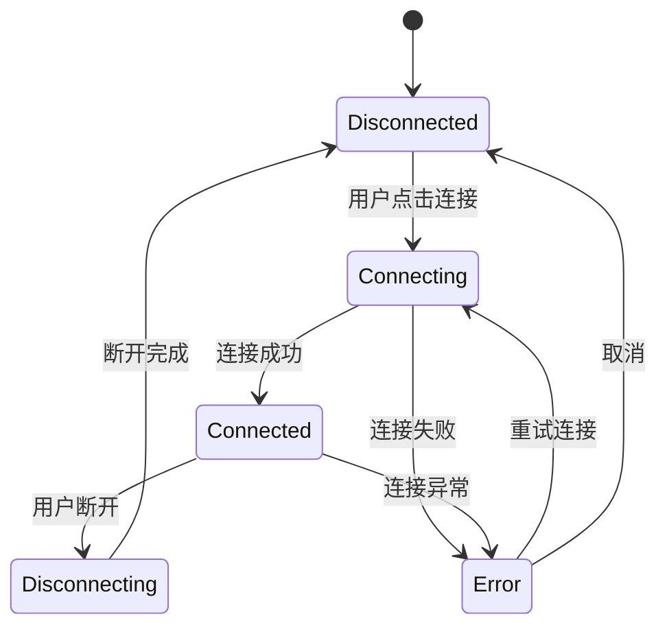
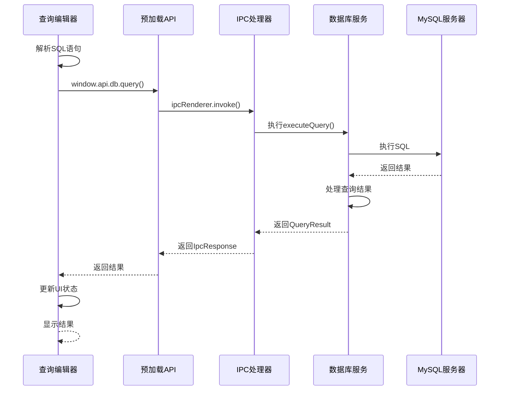
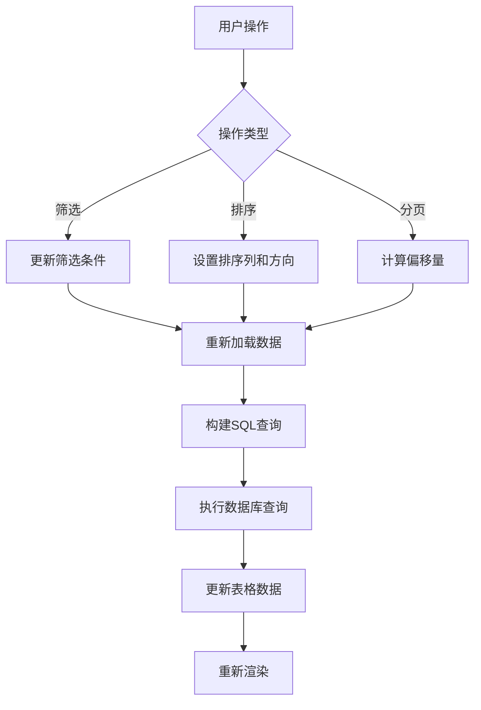
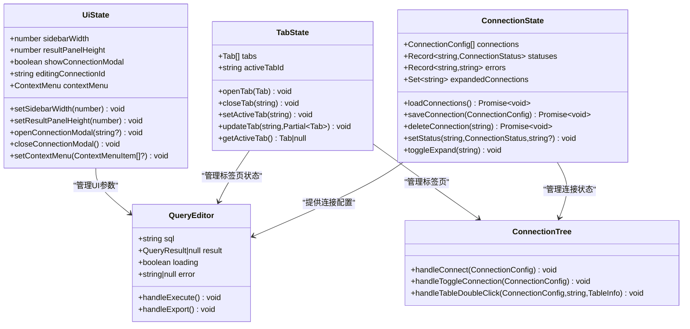
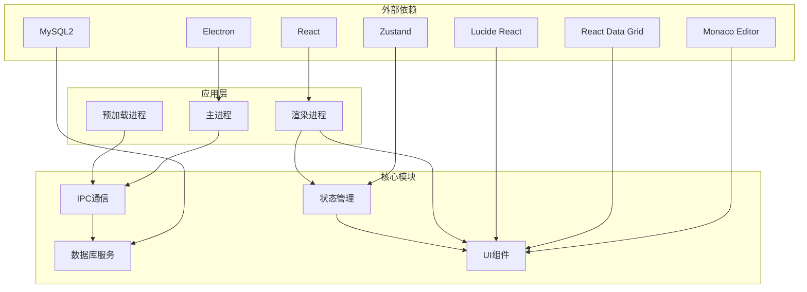
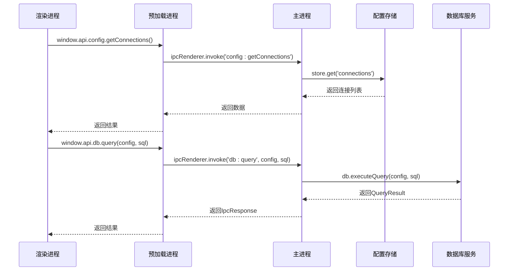
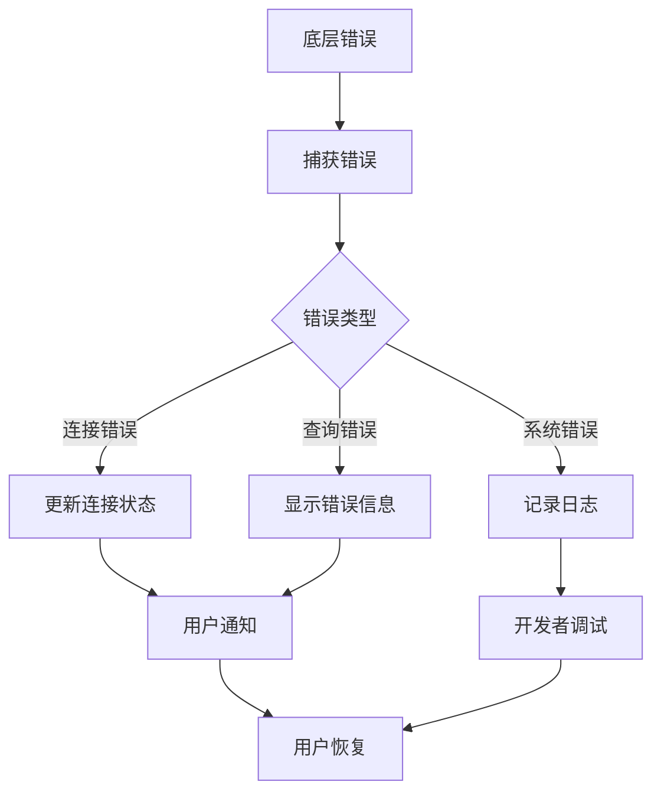

# 数据流架构

<cite>
**本文档引用的文件**
- [src/main/index.ts](file://src/main/index.ts)
- [src/main/ipc.ts](file://src/main/ipc.ts)
- [src/main/services/db.ts](file://src/main/services/db.ts)
- [src/preload/index.ts](file://src/preload/index.ts)
- [src/renderer/src/App.tsx](file://src/renderer/src/App.tsx)
- [src/renderer/src/stores/connection.ts](file://src/renderer/src/stores/connection.ts)
- [src/renderer/src/stores/tab.ts](file://src/renderer/src/stores/tab.ts)
- [src/renderer/src/stores/ui.ts](file://src/renderer/src/stores/ui.ts)
- [src/renderer/src/components/QueryEditor.tsx](file://src/renderer/src/components/QueryEditor.tsx)
- [src/renderer/src/components/DataTable.tsx](file://src/renderer/src/components/DataTable.tsx)
- [src/renderer/src/components/ConnectionTree.tsx](file://src/renderer/src/components/ConnectionTree.tsx)
- [src/shared/types/index.ts](file://src/shared/types/index.ts)
- [package.json](file://package.json)
</cite>

## 目录
1. [简介](#简介)
2. [项目结构](#项目结构)
3. [核心组件](#核心组件)
4. [架构概览](#架构概览)
5. [详细组件分析](#详细组件分析)
6. [依赖关系分析](#依赖关系分析)
7. [性能考虑](#性能考虑)
8. [故障排除指南](#故障排除指南)
9. [结论](#结论)

## 简介

nexSql 是一个基于 Electron 的现代化数据库管理工具，采用 React + TypeScript 技术栈构建。该应用实现了完整的数据流架构，涵盖了从用户输入到数据库查询再到 UI 更新的全链路数据处理流程。

本项目的核心特点是采用了分层的状态管理模式：
- **全局状态**：通过 Zustand 管理应用级状态
- **局部状态**：组件内部使用 React hooks 管理临时状态
- **临时状态**：单次交互过程中的中间状态

同时实现了智能的数据缓存和同步机制，确保用户体验的流畅性和数据的一致性。

## 项目结构

项目采用典型的 Electron + React 架构，分为三个主要层次：

**图表来源**
- [src/main/index.ts:1-64](file://src/main/index.ts#L1-L64)
- [src/main/ipc.ts:1-182](file://src/main/ipc.ts#L1-L182)
- [src/main/services/db.ts:1-277](file://src/main/services/db.ts#L1-L277)
- [src/preload/index.ts:1-60](file://src/preload/index.ts#L1-L60)
- [src/renderer/src/App.tsx:1-35](file://src/renderer/src/App.tsx#L1-L35)

**章节来源**
- [src/main/index.ts:1-64](file://src/main/index.ts#L1-L64)
- [src/preload/index.ts:1-60](file://src/preload/index.ts#L1-L60)
- [src/renderer/src/App.tsx:1-35](file://src/renderer/src/App.tsx#L1-L35)

## 核心组件

### 状态管理层

应用采用 Zustand 实现轻量级状态管理，包含三个核心状态存储：

1. **连接状态存储** (`connection.ts`)
   - 管理数据库连接配置和状态
   - 维护连接状态和错误信息
   - 处理连接树的展开/折叠状态

2. **标签页状态存储** (`tab.ts`)
   - 管理多标签页的工作流
   - 处理标签页的打开、关闭和激活
   - 维护标签页的元数据

3. **UI状态存储** (`ui.ts`)
   - 管理界面布局参数
   - 控制模态框和上下文菜单
   - 处理用户界面的临时状态

### 数据流组件

1. **查询编辑器** (`QueryEditor.tsx`)
   - 支持 SQL 编辑和执行
   - 实时结果显示和导出功能
   - 错误处理和性能监控

2. **数据表格** (`DataTable.tsx`)
   - 分页数据展示
   - 动态筛选和排序
   - 性能优化的数据网格

3. **连接树** (`ConnectionTree.tsx`)
   - 层级化的数据库浏览
   - 智能缓存机制
   - 上下文菜单操作

**章节来源**
- [src/renderer/src/stores/connection.ts:1-64](file://src/renderer/src/stores/connection.ts#L1-L64)
- [src/renderer/src/stores/tab.ts:1-65](file://src/renderer/src/stores/tab.ts#L1-L65)
- [src/renderer/src/stores/ui.ts:1-41](file://src/renderer/src/stores/ui.ts#L1-L41)
- [src/renderer/src/components/QueryEditor.tsx:1-329](file://src/renderer/src/components/QueryEditor.tsx#L1-L329)
- [src/renderer/src/components/DataTable.tsx:1-297](file://src/renderer/src/components/DataTable.tsx#L1-L297)
- [src/renderer/src/components/ConnectionTree.tsx:1-313](file://src/renderer/src/components/ConnectionTree.tsx#L1-L313)

## 架构概览

应用采用分层架构设计，实现了清晰的数据流控制：

**图表来源**
- [src/renderer/src/components/QueryEditor.tsx:36-64](file://src/renderer/src/components/QueryEditor.tsx#L36-L64)
- [src/preload/index.ts:33-34](file://src/preload/index.ts#L33-L34)
- [src/main/ipc.ts:106-117](file://src/main/ipc.ts#L106-L117)
- [src/main/services/db.ts:73-135](file://src/main/services/db.ts#L73-L135)

### 数据流分层架构

**图表来源**
- [src/renderer/src/stores/connection.ts:17-63](file://src/renderer/src/stores/connection.ts#L17-L63)
- [src/renderer/src/stores/tab.ts:15-64](file://src/renderer/src/stores/tab.ts#L15-L64)
- [src/renderer/src/stores/ui.ts:26-40](file://src/renderer/src/stores/ui.ts#L26-L40)

## 详细组件分析

### 数据库连接管理

连接管理系统实现了完整的生命周期管理：

**图表来源**
- [src/renderer/src/components/ConnectionTree.tsx:40-75](file://src/renderer/src/components/ConnectionTree.tsx#L40-L75)
- [src/renderer/src/stores/connection.ts:47-51](file://src/renderer/src/stores/connection.ts#L47-L51)

#### 连接状态管理

连接状态通过以下状态机进行管理：
- **disconnected**: 未连接状态
- **connecting**: 连接中状态
- **connected**: 已连接状态
- **error**: 错误状态

每个连接状态都维护对应的错误信息，便于用户诊断问题。

**章节来源**
- [src/renderer/src/components/ConnectionTree.tsx:40-75](file://src/renderer/src/components/ConnectionTree.tsx#L40-L75)
- [src/renderer/src/stores/connection.ts:47-51](file://src/renderer/src/stores/connection.ts#L47-L51)

### 查询执行流程

查询执行是数据流的核心环节，实现了完整的错误处理和性能监控：

**图表来源**
- [src/renderer/src/components/QueryEditor.tsx:36-64](file://src/renderer/src/components/QueryEditor.tsx#L36-L64)
- [src/main/ipc.ts:106-117](file://src/main/ipc.ts#L106-L117)
- [src/main/services/db.ts:73-135](file://src/main/services/db.ts#L73-L135)

#### 查询结果处理

查询结果处理包含多个步骤：
1. **SQL解析**：提取选中或全部SQL语句
2. **连接验证**：确保目标连接存在且可用
3. **执行查询**：通过IPC调用数据库服务
4. **结果转换**：将数据库结果转换为前端格式
5. **状态更新**：更新UI状态和显示结果

**章节来源**
- [src/renderer/src/components/QueryEditor.tsx:36-64](file://src/renderer/src/components/QueryEditor.tsx#L36-L64)
- [src/main/services/db.ts:73-135](file://src/main/services/db.ts#L73-L135)

### 数据表格组件

数据表格组件实现了高性能的数据展示和交互：

**图表来源**
- [src/renderer/src/components/DataTable.tsx:41-87](file://src/renderer/src/components/DataTable.tsx#L41-L87)
- [src/renderer/src/components/DataTable.tsx:121-137](file://src/renderer/src/components/DataTable.tsx#L121-L137)

#### 性能优化策略

数据表格实现了多项性能优化：
- **分页加载**：每页100行，避免大数据集一次性加载
- **虚拟滚动**：React Data Grid支持大数据集的虚拟滚动
- **缓存机制**：连接树和元数据的智能缓存
- **防抖处理**：输入框的防抖搜索

**章节来源**
- [src/renderer/src/components/DataTable.tsx:23-87](file://src/renderer/src/components/DataTable.tsx#L23-L87)
- [src/renderer/src/components/DataTable.tsx:121-137](file://src/renderer/src/components/DataTable.tsx#L121-L137)

### 状态管理架构

应用采用分层状态管理模式：

**图表来源**
- [src/renderer/src/stores/connection.ts:4-15](file://src/renderer/src/stores/connection.ts#L4-L15)
- [src/renderer/src/stores/tab.ts:4-13](file://src/renderer/src/stores/tab.ts#L4-L13)
- [src/renderer/src/stores/ui.ts:3-15](file://src/renderer/src/stores/ui.ts#L3-L15)
- [src/renderer/src/components/QueryEditor.tsx:21-33](file://src/renderer/src/components/QueryEditor.tsx#L21-L33)
- [src/renderer/src/components/ConnectionTree.tsx:31-38](file://src/renderer/src/components/ConnectionTree.tsx#L31-L38)

**章节来源**
- [src/renderer/src/stores/connection.ts:1-64](file://src/renderer/src/stores/connection.ts#L1-L64)
- [src/renderer/src/stores/tab.ts:1-65](file://src/renderer/src/stores/tab.ts#L1-L65)
- [src/renderer/src/stores/ui.ts:1-41](file://src/renderer/src/stores/ui.ts#L1-L41)

## 依赖关系分析

应用的依赖关系体现了清晰的分层架构：

**图表来源**
- [package.json:16-26](file://package.json#L16-L26)
- [src/main/ipc.ts:1-182](file://src/main/ipc.ts#L1-L182)
- [src/main/services/db.ts:1-277](file://src/main/services/db.ts#L1-L277)

### IPC通信机制

应用通过IPC实现主进程与渲染进程的安全通信：

**图表来源**
- [src/preload/index.ts:17-23](file://src/preload/index.ts#L17-L23)
- [src/preload/index.ts:33-34](file://src/preload/index.ts#L33-L34)
- [src/main/ipc.ts:49-51](file://src/main/ipc.ts#L49-L51)
- [src/main/ipc.ts:106-117](file://src/main/ipc.ts#L106-L117)

**章节来源**
- [src/preload/index.ts:1-60](file://src/preload/index.ts#L1-L60)
- [src/main/ipc.ts:1-182](file://src/main/ipc.ts#L1-L182)

## 性能考虑

### 数据缓存策略

应用实现了多层次的数据缓存机制：

1. **连接池缓存**：数据库连接池复用，减少连接建立开销
2. **元数据缓存**：连接树的数据库和表信息缓存
3. **查询结果缓存**：最近查询结果的短期缓存
4. **UI状态缓存**：用户界面布局和配置的持久化

### 性能监控

应用内置了性能监控机制：
- **查询时间统计**：记录每次查询的执行时间
- **内存使用监控**：跟踪组件和状态的内存占用
- **网络延迟监控**：测量IPC通信的延迟

### 优化建议

1. **懒加载**：对大型组件实现按需加载
2. **虚拟化**：对大量数据使用虚拟滚动
3. **批量更新**：合并多个状态更新操作
4. **防抖节流**：对频繁触发的操作进行优化

## 故障排除指南

### 错误传播机制

应用实现了完整的错误处理和传播机制：

**图表来源**
- [src/main/ipc.ts:16-44](file://src/main/ipc.ts#L16-L44)
- [src/main/ipc.ts:76-84](file://src/main/ipc.ts#L76-L84)

### 常见问题及解决方案

1. **连接超时**
   - 检查网络连接和防火墙设置
   - 调整连接超时参数
   - 验证数据库服务状态

2. **查询执行失败**
   - 检查SQL语法正确性
   - 验证权限设置
   - 查看错误日志详情

3. **内存泄漏**
   - 确保事件监听器正确清理
   - 检查定时器和订阅的释放
   - 监控组件的卸载过程

**章节来源**
- [src/main/ipc.ts:16-44](file://src/main/ipc.ts#L16-L44)
- [src/main/services/db.ts:38-56](file://src/main/services/db.ts#L38-L56)

## 结论

nexSql 的数据流架构展现了现代桌面应用的最佳实践：

### 核心优势

1. **清晰的分层架构**：从用户交互到数据库访问的完整数据流
2. **智能状态管理**：分层状态模式确保状态的一致性和可预测性
3. **高效的缓存机制**：多层级缓存提升用户体验
4. **完善的错误处理**：从底层到用户界面的全链路错误管理

### 技术亮点

- **Electron + React**：结合桌面应用和现代Web技术的优势
- **Zustand状态管理**：轻量级但功能强大的状态管理方案
- **IPC安全通信**：在保证安全性的同时提供高效的数据传输
- **性能优化**：从连接池到UI渲染的全方位性能考虑

### 未来发展方向

1. **实时数据同步**：实现数据库变更的实时通知
2. **离线模式**：支持离线数据操作和同步
3. **插件系统**：扩展更多数据库类型的支持
4. **AI辅助**：集成SQL优化和数据分析功能

该架构为类似的数据管理工具提供了优秀的参考模板，展示了如何在桌面应用中实现复杂的数据流管理和状态控制。