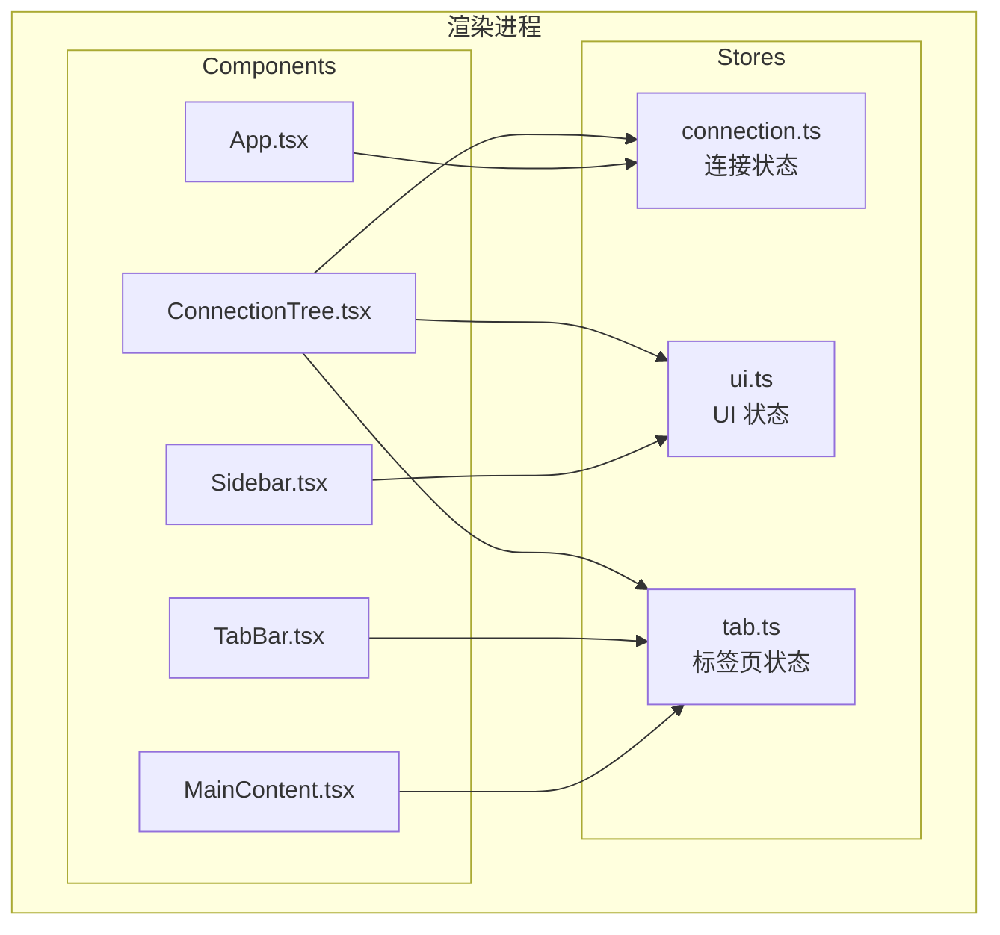
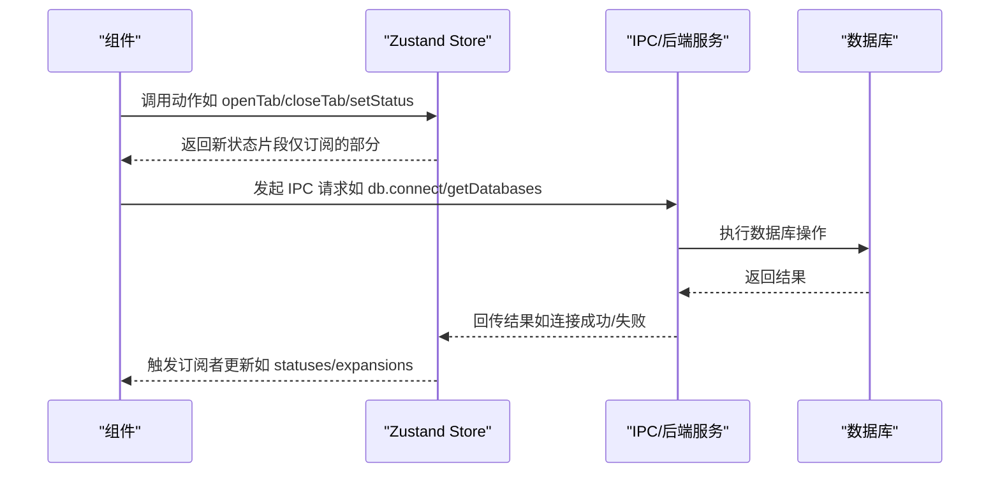
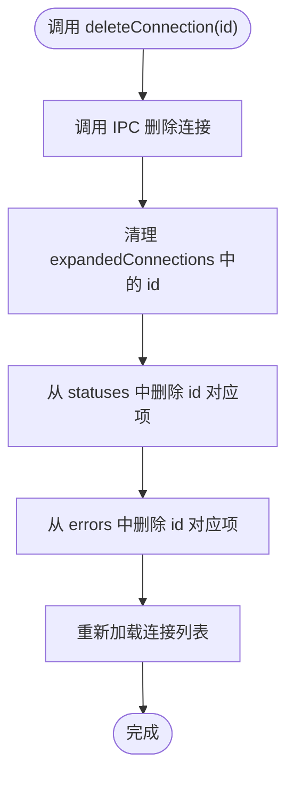
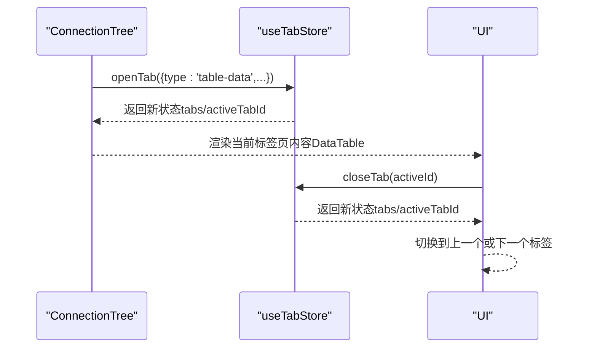
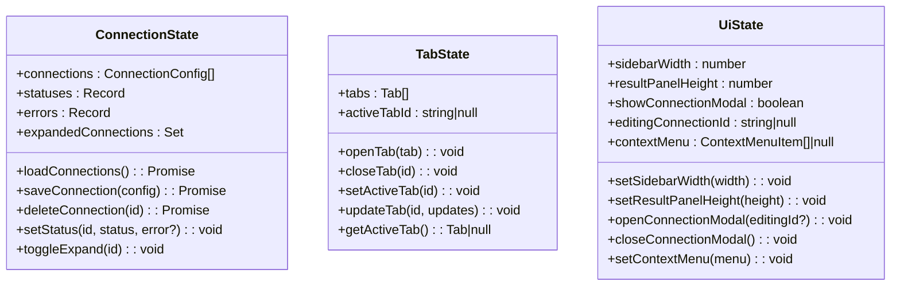
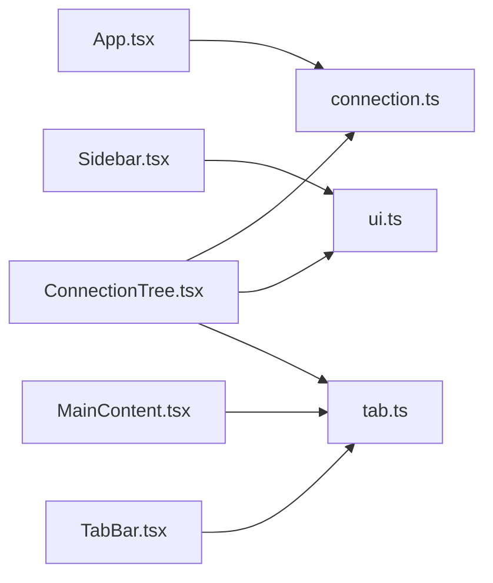

# 状态管理模式

<cite>
**本文引用的文件**
- [connection.ts](file://src/renderer/src/stores/connection.ts)
- [tab.ts](file://src/renderer/src/stores/tab.ts)
- [ui.ts](file://src/renderer/src/stores/ui.ts)
- [App.tsx](file://src/renderer/src/App.tsx)
- [Sidebar.tsx](file://src/renderer/src/components/Sidebar.tsx)
- [MainContent.tsx](file://src/renderer/src/components/MainContent.tsx)
- [TabBar.tsx](file://src/renderer/src/components/TabBar.tsx)
- [ConnectionTree.tsx](file://src/renderer/src/components/ConnectionTree.tsx)
- [index.ts](file://src/shared/types/index.ts)
- [package.json](file://package.json)
</cite>

## 目录
1. [简介](#简介)
2. [项目结构](#项目结构)
3. [核心组件](#核心组件)
4. [架构总览](#架构总览)
5. [详细组件分析](#详细组件分析)
6. [依赖关系分析](#依赖关系分析)
7. [性能考量](#性能考量)
8. [故障排查指南](#故障排查指南)
9. [结论](#结论)
10. [附录](#附录)

## 简介
本项目采用 Zustand 作为前端状态管理方案，围绕“连接配置”“标签页”“UI 布局”三大领域构建独立的 store，分别负责数据库连接、工作区标签页管理和界面布局行为。Zustand 提供轻量、直观的状态订阅与更新能力，结合 React 组件按需订阅，形成清晰的全局状态与局部状态划分：全局状态用于跨组件共享的数据（如连接列表、当前活动标签），局部状态用于组件内部的交互细节（如拖拽状态、上下文菜单坐标）。

## 项目结构
状态管理相关文件集中在渲染进程的 stores 目录，并通过组件在需要时进行订阅：
- stores/connection.ts：连接域状态与动作
- stores/tab.ts：标签页域状态与动作
- stores/ui.ts：UI 布局与交互状态
- components/*：各组件按需订阅对应 store 的片段状态
- shared/types/index.ts：类型定义，支撑 store 的数据结构

图表来源
- [connection.ts:1-64](file://src/renderer/src/stores/connection.ts#L1-L64)
- [tab.ts:1-65](file://src/renderer/src/stores/tab.ts#L1-L65)
- [ui.ts:1-41](file://src/renderer/src/stores/ui.ts#L1-L41)
- [App.tsx:1-35](file://src/renderer/src/App.tsx#L1-L35)
- [Sidebar.tsx:1-80](file://src/renderer/src/components/Sidebar.tsx#L1-L80)
- [MainContent.tsx:1-34](file://src/renderer/src/components/MainContent.tsx#L1-L34)
- [TabBar.tsx:1-53](file://src/renderer/src/components/TabBar.tsx#L1-L53)
- [ConnectionTree.tsx:1-313](file://src/renderer/src/components/ConnectionTree.tsx#L1-L313)

章节来源
- [connection.ts:1-64](file://src/renderer/src/stores/connection.ts#L1-L64)
- [tab.ts:1-65](file://src/renderer/src/stores/tab.ts#L1-L65)
- [ui.ts:1-41](file://src/renderer/src/stores/ui.ts#L1-L41)
- [App.tsx:1-35](file://src/renderer/src/App.tsx#L1-L35)
- [Sidebar.tsx:1-80](file://src/renderer/src/components/Sidebar.tsx#L1-L80)
- [MainContent.tsx:1-34](file://src/renderer/src/components/MainContent.tsx#L1-L34)
- [TabBar.tsx:1-53](file://src/renderer/src/components/TabBar.tsx#L1-L53)
- [ConnectionTree.tsx:1-313](file://src/renderer/src/components/ConnectionTree.tsx#L1-L313)

## 核心组件
- 连接状态（connection.ts）
  - 状态字段：连接列表、每个连接的状态与错误、展开的连接集合
  - 动作函数：加载连接、保存连接、删除连接、设置连接状态、切换展开
  - 更新策略：基于 set 与 get 的函数式更新，确保不可变性与细粒度订阅
- 标签页状态（tab.ts）
  - 状态字段：标签数组、当前活动标签 ID
  - 动作函数：打开标签、关闭标签、设置活动标签、更新标签、获取活动标签
  - 更新策略：去重打开、关闭时自动调整活动标签、映射更新保持不可变
- UI 状态（ui.ts）
  - 状态字段：侧边栏宽度、结果面板高度、连接模态框显示与编辑 ID、上下文菜单
  - 动作函数：设置宽度、设置高度、打开/关闭连接模态框、设置上下文菜单
  - 更新策略：边界约束与简单赋值，避免复杂计算

章节来源
- [connection.ts:4-15](file://src/renderer/src/stores/connection.ts#L4-L15)
- [connection.ts:17-63](file://src/renderer/src/stores/connection.ts#L17-L63)
- [tab.ts:4-13](file://src/renderer/src/stores/tab.ts#L4-L13)
- [tab.ts:15-64](file://src/renderer/src/stores/tab.ts#L15-L64)
- [ui.ts:3-15](file://src/renderer/src/stores/ui.ts#L3-L15)
- [ui.ts:26-40](file://src/renderer/src/stores/ui.ts#L26-L40)

## 架构总览
Zustand 在本项目中的应用遵循“按需订阅、最小化更新”的原则：
- 全局状态：连接列表、标签页集合、UI 布局参数
- 局部状态：组件内部的拖拽状态、上下文菜单坐标等
- 更新链路：组件调用 store 动作 -> Zustand 触发订阅者 -> React 重新渲染

图表来源
- [ConnectionTree.tsx:40-58](file://src/renderer/src/components/ConnectionTree.tsx#L40-L58)
- [connection.ts:23-45](file://src/renderer/src/stores/connection.ts#L23-L45)
- [tab.ts:19-34](file://src/renderer/src/stores/tab.ts#L19-L34)

## 详细组件分析

### 连接状态（connection.ts）
- 状态定义
  - connections：连接配置数组
  - statuses：以连接 ID 为键的状态映射
  - errors：以连接 ID 为键的错误信息映射
  - expandedConnections：展开的连接 ID 集合（含“连接:数据库”复合键）
- 动作函数
  - loadConnections：从 IPC 获取连接列表并写入 store
  - saveConnection/deleteConnection：通过 IPC 写入/删除后刷新列表
  - setStatus：原子地更新某连接的状态与错误
  - toggleExpand：切换连接或数据库的展开状态
- 更新策略
  - 使用 get() 读取当前状态，set() 或返回对象进行不可变更新
  - 删除连接时同步清理 statuses、errors 与 expandedConnections 中的相关项
- 依赖关系
  - 依赖 window.api.config 与 window.api.db（由主进程注入）
  - 与 UI 状态（展开控制）和标签页状态（打开表数据/设计标签）协作

图表来源
- [connection.ts:33-45](file://src/renderer/src/stores/connection.ts#L33-L45)

章节来源
- [connection.ts:4-15](file://src/renderer/src/stores/connection.ts#L4-L15)
- [connection.ts:17-63](file://src/renderer/src/stores/connection.ts#L17-L63)
- [ConnectionTree.tsx:146-151](file://src/renderer/src/components/ConnectionTree.tsx#L146-L151)

### 标签页状态（tab.ts）
- 状态定义
  - tabs：标签数组（包含类型、标题、连接 ID、数据库/表等）
  - activeTabId：当前活动标签 ID
- 动作函数
  - openTab：去重打开（若相同连接+数据库+表+类型已存在则激活现有）
  - closeTab：关闭指定标签并智能调整活动标签
  - setActiveTab/updateTab：设置活动标签或更新标签属性
  - getActiveTab：根据 activeTabId 获取当前标签
- 更新策略
  - openTab：先查找再决定是复用还是新增
  - closeTab：根据索引位置选择新的活动标签
  - updateTab：映射更新，保持不可变

图表来源
- [ConnectionTree.tsx:100-112](file://src/renderer/src/components/ConnectionTree.tsx#L100-L112)
- [tab.ts:19-34](file://src/renderer/src/stores/tab.ts#L19-L34)
- [tab.ts:36-51](file://src/renderer/src/stores/tab.ts#L36-L51)

章节来源
- [tab.ts:4-13](file://src/renderer/src/stores/tab.ts#L4-L13)
- [tab.ts:15-64](file://src/renderer/src/stores/tab.ts#L15-L64)
- [TabBar.tsx:1-53](file://src/renderer/src/components/TabBar.tsx#L1-L53)
- [MainContent.tsx:1-34](file://src/renderer/src/components/MainContent.tsx#L1-L34)

### UI 状态（ui.ts）
- 状态定义
  - sidebarWidth/resultPanelHeight：布局尺寸（带边界约束）
  - showConnectionModal/editingConnectionId：连接模态框显示与编辑目标
  - contextMenu：上下文菜单位置与项集合
- 动作函数
  - setSidebarWidth/setResultPanelHeight：边界校验后的赋值
  - openConnectionModal/closeConnectionModal：显示/隐藏并清空编辑 ID
  - setContextMenu：设置上下文菜单
- 更新策略
  - 简单赋值，避免复杂逻辑
  - 与 Sidebar、ContextMenu 组件直接绑定

章节来源
- [ui.ts:3-15](file://src/renderer/src/stores/ui.ts#L3-L15)
- [ui.ts:26-40](file://src/renderer/src/stores/ui.ts#L26-L40)
- [Sidebar.tsx:1-80](file://src/renderer/src/components/Sidebar.tsx#L1-L80)
- [ConnectionTree.tsx:127-157](file://src/renderer/src/components/ConnectionTree.tsx#L127-L157)

### 类图（状态模型）

图表来源
- [connection.ts:4-15](file://src/renderer/src/stores/connection.ts#L4-L15)
- [tab.ts:4-13](file://src/renderer/src/stores/tab.ts#L4-L13)
- [ui.ts:3-15](file://src/renderer/src/stores/ui.ts#L3-L15)

## 依赖关系分析
- 组件与 store 的耦合
  - App.tsx 订阅连接加载动作并在挂载时执行
  - Sidebar.tsx 订阅 UI 状态（宽度、模态框）并响应拖拽事件
  - MainContent.tsx 与 TabBar.tsx 订阅标签页状态，驱动内容区切换
  - ConnectionTree.tsx 订阅连接状态、UI 状态与标签页状态，协调连接、数据库、表的展开与标签页打开
- 外部依赖
  - Zustand：状态容器与订阅机制
  - Electron 主进程 IPC：提供配置与数据库操作接口
  - 类型系统：@shared/types/index.ts 定义了连接、标签、查询结果等核心类型

图表来源
- [App.tsx:8-13](file://src/renderer/src/App.tsx#L8-L13)
- [Sidebar.tsx:6-9](file://src/renderer/src/components/Sidebar.tsx#L6-L9)
- [MainContent.tsx:8-11](file://src/renderer/src/components/MainContent.tsx#L8-L11)
- [TabBar.tsx:5-9](file://src/renderer/src/components/TabBar.tsx#L5-L9)
- [ConnectionTree.tsx:17-36](file://src/renderer/src/components/ConnectionTree.tsx#L17-L36)

章节来源
- [App.tsx:1-35](file://src/renderer/src/App.tsx#L1-L35)
- [Sidebar.tsx:1-80](file://src/renderer/src/components/Sidebar.tsx#L1-L80)
- [MainContent.tsx:1-34](file://src/renderer/src/components/MainContent.tsx#L1-L34)
- [TabBar.tsx:1-53](file://src/renderer/src/components/TabBar.tsx#L1-L53)
- [ConnectionTree.tsx:1-313](file://src/renderer/src/components/ConnectionTree.tsx#L1-L313)
- [index.ts:1-124](file://src/shared/types/index.ts#L1-L124)

## 性能考量
- 订阅粒度
  - 使用选择器订阅状态片段，避免不必要的重渲染（如 Sidebar 只订阅 sidebarWidth）
- 不可变更新
  - 使用 set((state) => ...) 返回新对象，确保浅比较有效
- 缓存与批量更新
  - ConnectionTree 使用内存缓存 nodeCache 存储数据库/表列表，减少重复请求
- 边界约束
  - UI 尺寸设置时进行边界校验，避免异常值导致布局抖动
- 异步更新
  - 连接状态变更通过 setStatus 立即反馈，随后异步等待 IPC 结果，保证用户感知及时

[本节为通用指导，不直接分析具体文件]

## 故障排查指南
- 连接状态异常
  - 现象：连接状态未更新或错误未清除
  - 排查：确认 deleteConnection 是否同步清理 statuses 与 errors；确认 setStatus 是否正确调用
- 标签页错位
  - 现象：关闭标签后活动标签跳转异常
  - 排查：检查 closeTab 的索引判断逻辑是否覆盖所有分支
- 上下文菜单不显示
  - 现象：右键无反应
  - 排查：确认 setContextMenu 已被调用且 contextMenu 未被其他组件覆盖
- 拖拽失效
  - 现象：拖拽分隔条无法调整宽度
  - 排查：确认 handleMouseMove 与全局 mouseup 监听是否正确注册与注销

章节来源
- [connection.ts:33-45](file://src/renderer/src/stores/connection.ts#L33-L45)
- [tab.ts:36-51](file://src/renderer/src/stores/tab.ts#L36-L51)
- [ui.ts:33-39](file://src/renderer/src/stores/ui.ts#L33-L39)
- [Sidebar.tsx:13-41](file://src/renderer/src/components/Sidebar.tsx#L13-L41)

## 结论
本项目通过 Zustand 将“连接”“标签页”“UI”三类状态清晰分离，配合组件按需订阅与不可变更新策略，实现了高效、可维护的状态管理。连接状态与标签页状态分别承担跨组件共享与工作区管理职责，UI 状态聚焦于布局与交互细节。通过 IPC 与内存缓存的结合，既保证了用户体验，也降低了重复请求成本。建议后续可考虑：
- 为 store 添加中间件（如日志、调试）以增强可观测性
- 对高频更新的动作进行节流/防抖（如拖拽宽度）
- 对大列表的标签页进行虚拟化渲染

[本节为总结性内容，不直接分析具体文件]

## 附录
- 类型定义概览
  - 连接配置、连接状态、数据库/表/列信息、查询结果、标签类型等均在共享类型文件中定义，确保 store 与组件间的数据契约一致

章节来源
- [index.ts:1-124](file://src/shared/types/index.ts#L1-L124)