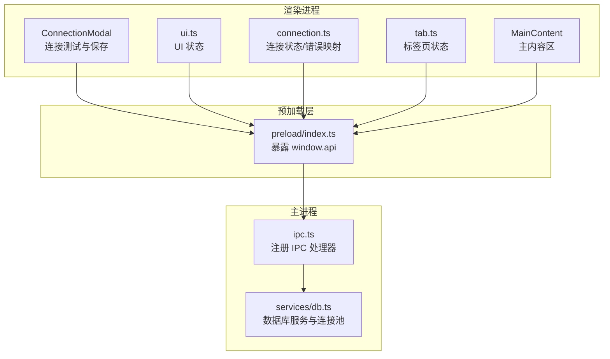
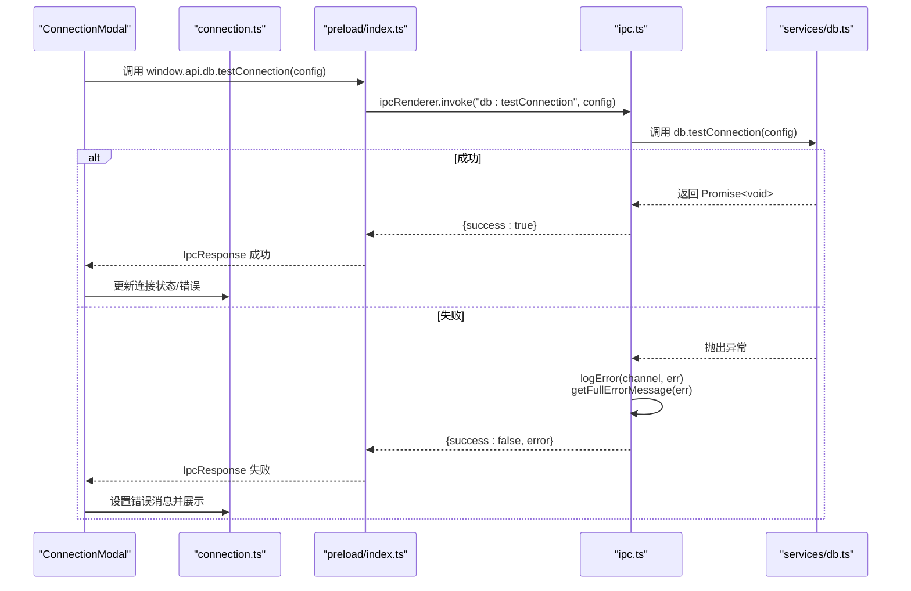
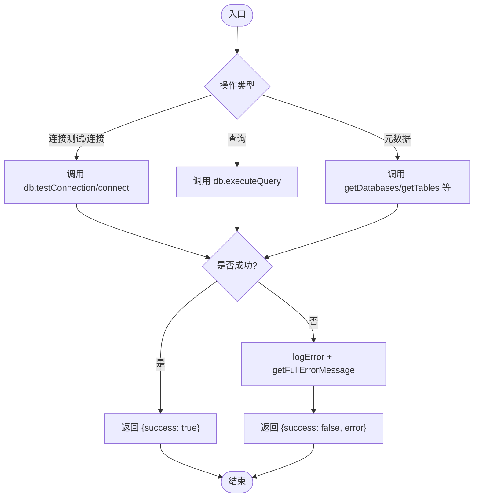
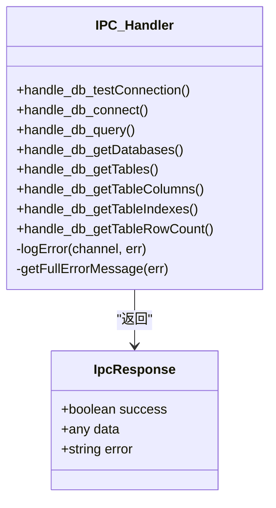
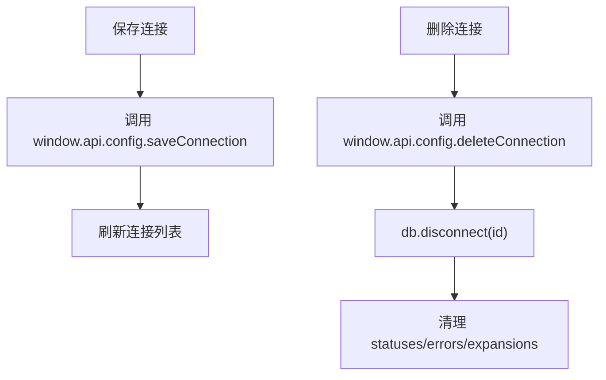

# 错误传播与处理

<cite>
**本文引用的文件**
- [src/main/services/db.ts](file://src/main/services/db.ts)
- [src/main/ipc.ts](file://src/main/ipc.ts)
- [src/preload/index.ts](file://src/preload/index.ts)
- [src/renderer/src/stores/connection.ts](file://src/renderer/src/stores/connection.ts)
- [src/renderer/src/stores/ui.ts](file://src/renderer/src/stores/ui.ts)
- [src/renderer/src/components/ConnectionModal.tsx](file://src/renderer/src/components/ConnectionModal.tsx)
- [src/renderer/src/components/MainContent.tsx](file://src/renderer/src/components/MainContent.tsx)
- [src/renderer/src/stores/tab.ts](file://src/renderer/src/stores/tab.ts)
- [src/shared/types/index.ts](file://src/shared/types/index.ts)
- [src/main/index.ts](file://src/main/index.ts)
- [package.json](file://package.json)
</cite>

## 目录
1. [简介](#简介)
2. [项目结构](#项目结构)
3. [核心组件](#核心组件)
4. [架构总览](#架构总览)
5. [详细组件分析](#详细组件分析)
6. [依赖关系分析](#依赖关系分析)
7. [性能考量](#性能考量)
8. [故障排查指南](#故障排查指南)
9. [结论](#结论)

## 简介
本文件系统性梳理应用中“错误传播与处理”的完整路径，覆盖从数据库操作到 UI 展示的全链路。重点包括：
- 错误分类与处理策略：连接错误、查询错误、配置错误等
- 错误状态的维护与清理机制
- 错误恢复与降级策略
- 通过 IPC 的统一错误封装与上报

## 项目结构
应用采用 Electron + React 架构，按职责划分为：
- 主进程：负责数据库连接池管理、IPC 响应与错误日志记录
- 预加载层：桥接渲染进程与主进程的 API 暴露
- 渲染进程：UI 组件与状态管理（Zustand），负责错误展示与用户交互

图表来源
- [src/renderer/src/components/ConnectionModal.tsx:1-231](file://src/renderer/src/components/ConnectionModal.tsx#L1-L231)
- [src/renderer/src/stores/ui.ts:1-41](file://src/renderer/src/stores/ui.ts#L1-L41)
- [src/renderer/src/stores/connection.ts:1-64](file://src/renderer/src/stores/connection.ts#L1-L64)
- [src/renderer/src/stores/tab.ts:1-65](file://src/renderer/src/stores/tab.ts#L1-L65)
- [src/renderer/src/components/MainContent.tsx:1-34](file://src/renderer/src/components/MainContent.tsx#L1-L34)
- [src/preload/index.ts:1-60](file://src/preload/index.ts#L1-L60)
- [src/main/ipc.ts:1-182](file://src/main/ipc.ts#L1-L182)
- [src/main/services/db.ts:1-277](file://src/main/services/db.ts#L1-L277)

章节来源
- [src/main/index.ts:1-64](file://src/main/index.ts#L1-L64)
- [src/preload/index.ts:1-60](file://src/preload/index.ts#L1-L60)
- [src/main/ipc.ts:1-182](file://src/main/ipc.ts#L1-L182)
- [src/main/services/db.ts:1-277](file://src/main/services/db.ts#L1-L277)

## 核心组件
- 数据库服务层（主进程）：提供连接池、连接测试、查询执行、元数据读取等能力，并在异常时向上抛出
- IPC 层：统一捕获异常，记录详细错误信息，返回标准化 IpcResponse
- 预加载层：向渲染进程暴露安全 API，屏蔽底层细节
- 渲染层状态与 UI：维护连接状态与错误消息，负责错误提示与交互

章节来源
- [src/main/services/db.ts:1-277](file://src/main/services/db.ts#L1-L277)
- [src/main/ipc.ts:1-182](file://src/main/ipc.ts#L1-L182)
- [src/preload/index.ts:1-60](file://src/preload/index.ts#L1-L60)
- [src/renderer/src/stores/connection.ts:1-64](file://src/renderer/src/stores/connection.ts#L1-L64)

## 架构总览
下图展示一次典型“连接测试”从 UI 到数据库再到 UI 的错误传播路径。

图表来源
- [src/renderer/src/components/ConnectionModal.tsx:44-50](file://src/renderer/src/components/ConnectionModal.tsx#L44-L50)
- [src/renderer/src/stores/connection.ts:47-51](file://src/renderer/src/stores/connection.ts#L47-L51)
- [src/preload/index.ts:27-28](file://src/preload/index.ts#L27-L28)
- [src/main/ipc.ts:76-84](file://src/main/ipc.ts#L76-L84)
- [src/main/services/db.ts:38-56](file://src/main/services/db.ts#L38-L56)

## 详细组件分析

### 数据库服务层（错误分类与处理）
- 连接错误
  - 来源：连接池创建、获取连接、ping 检测
  - 特征：超时、认证失败、网络不可达、权限不足
  - 处理：直接抛出，由上层捕获并封装
- 查询错误
  - 来源：SQL 执行、元数据查询
  - 特征：语法错误、权限不足、锁等待、死锁
  - 处理：捕获后返回 IpcResponse.error，不中断应用
- 配置错误
  - 来源：连接配置缺失字段、非法参数
  - 特征：必填项为空、端口非法、超时设置不合理
  - 处理：在 UI 层进行输入校验；若进入主进程，同样被封装为 IpcResponse.error

图表来源
- [src/main/services/db.ts:38-56](file://src/main/services/db.ts#L38-L56)
- [src/main/services/db.ts:58-63](file://src/main/services/db.ts#L58-L63)
- [src/main/services/db.ts:73-135](file://src/main/services/db.ts#L73-L135)
- [src/main/ipc.ts:76-176](file://src/main/ipc.ts#L76-L176)

章节来源
- [src/main/services/db.ts:38-135](file://src/main/services/db.ts#L38-L135)
- [src/main/ipc.ts:16-44](file://src/main/ipc.ts#L16-L44)

### IPC 层（错误捕获与封装）
- 统一捕获：所有 db.* 通道均使用 try/catch 包裹
- 日志记录：logError 输出时间戳、通道名与堆栈
- 错误提取：getFullErrorMessage 支持附加 code 与 requireStack
- 返回格式：IpcResponse，包含 success、data 或 error

图表来源
- [src/main/ipc.ts:76-176](file://src/main/ipc.ts#L76-L176)
- [src/shared/types/index.ts:104-108](file://src/shared/types/index.ts#L104-L108)

章节来源
- [src/main/ipc.ts:16-44](file://src/main/ipc.ts#L16-L44)
- [src/main/ipc.ts:76-176](file://src/main/ipc.ts#L76-L176)
- [src/shared/types/index.ts:104-108](file://src/shared/types/index.ts#L104-L108)

### 预加载层（API 暴露与错误透传）
- 将主进程提供的 db.* 方法以 ipcRenderer.invoke 形式暴露给渲染进程
- 保持接口一致，便于 UI 层无感使用

章节来源
- [src/preload/index.ts:26-44](file://src/preload/index.ts#L26-L44)

### 渲染层（状态维护与错误展示）
- 连接状态与错误映射：useConnectionStore 维护 statuses 与 errors 字典，按键为连接 id
- UI 展示：ConnectionModal 在测试完成后根据 IpcResponse 结果更新 testResult 并展示
- 生命周期清理：删除连接时，同步断开对应连接池并清理状态

图表来源
- [src/renderer/src/stores/connection.ts:28-45](file://src/renderer/src/stores/connection.ts#L28-L45)
- [src/main/ipc.ts:66-72](file://src/main/ipc.ts#L66-L72)
- [src/main/services/db.ts:65-71](file://src/main/services/db.ts#L65-L71)

章节来源
- [src/renderer/src/stores/connection.ts:1-64](file://src/renderer/src/stores/connection.ts#L1-L64)
- [src/renderer/src/components/ConnectionModal.tsx:44-65](file://src/renderer/src/components/ConnectionModal.tsx#L44-L65)

## 依赖关系分析
- 主进程依赖 mysql2/promise 实现连接池与查询
- 预加载层依赖 electron 的 ipcRenderer 与 contextBridge
- 渲染层依赖 Zustand 管理状态，React 组件负责 UI

图表来源
- [src/renderer/src/components/ConnectionModal.tsx:1-231](file://src/renderer/src/components/ConnectionModal.tsx#L1-L231)
- [src/renderer/src/stores/connection.ts:1-64](file://src/renderer/src/stores/connection.ts#L1-L64)
- [src/preload/index.ts:1-60](file://src/preload/index.ts#L1-L60)
- [src/main/ipc.ts:1-182](file://src/main/ipc.ts#L1-L182)
- [src/main/services/db.ts:1-277](file://src/main/services/db.ts#L1-L277)
- [package.json:16-26](file://package.json#L16-L26)

章节来源
- [package.json:16-26](file://package.json#L16-L26)

## 性能考量
- 连接池复用：通过 Map 缓存连接池，避免重复创建带来的延迟
- 超时控制：连接超时可配置，防止长时间阻塞
- 释放资源：每个数据库操作后及时 release 连接，避免连接泄漏
- UI 响应：错误路径尽量短路，避免额外渲染与计算

章节来源
- [src/main/services/db.ts:5-36](file://src/main/services/db.ts#L5-L36)
- [src/main/services/db.ts:18-25](file://src/main/services/db.ts#L18-L25)
- [src/main/services/db.ts:132-134](file://src/main/services/db.ts#L132-L134)

## 故障排查指南
- 定位错误来源
  - 查看主进程控制台输出：logError 会打印带时间戳的错误与堆栈
  - 获取完整错误信息：getFullErrorMessage 会拼接 code 与 requireStack
- 常见问题与建议
  - 连接超时/网络不通：检查 connectTimeout、防火墙与目标主机可达性
  - 权限不足：确认用户凭据与数据库权限
  - SQL 语法错误：结合 IpcResponse.error 与查询编辑器定位
  - 连接池泄漏：确保每个操作后都正确 release 连接
- 状态清理
  - 删除连接：触发 db.disconnect(id) 后，清理 statuses 与 errors
  - 应用退出：before-quit 触发 disconnectAll，确保所有连接池关闭

章节来源
- [src/main/ipc.ts:16-44](file://src/main/ipc.ts#L16-L44)
- [src/main/ipc.ts:66-72](file://src/main/ipc.ts#L66-L72)
- [src/main/index.ts:61-63](file://src/main/index.ts#L61-L63)
- [src/main/services/db.ts:271-277](file://src/main/services/db.ts#L271-L277)

## 结论
本应用通过“数据库服务层 → IPC 层 → 预加载层 → 渲染层”的清晰分层，实现了错误的可控传播与统一处理。错误在主进程被捕获、记录并标准化返回，渲染层据此维护连接状态与错误消息，最终在 UI 中直观呈现。配合连接池复用、资源释放与生命周期清理，整体具备良好的稳定性与可观测性。建议后续可在 UI 层增加“重试/降级”按钮与“错误历史”记录，进一步提升用户体验与可运维性。