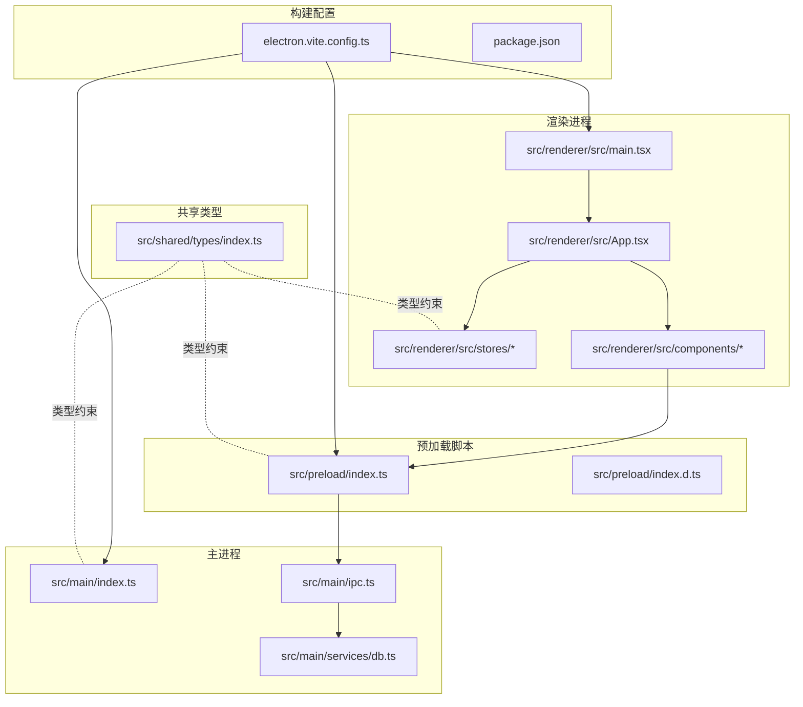
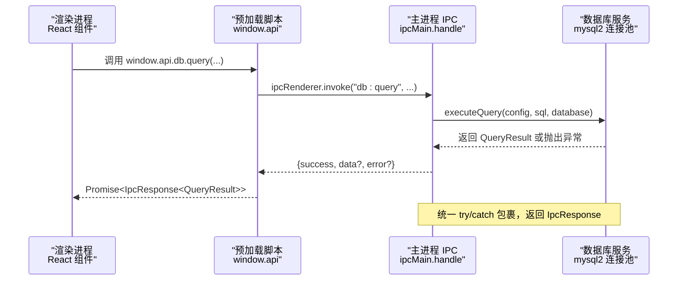
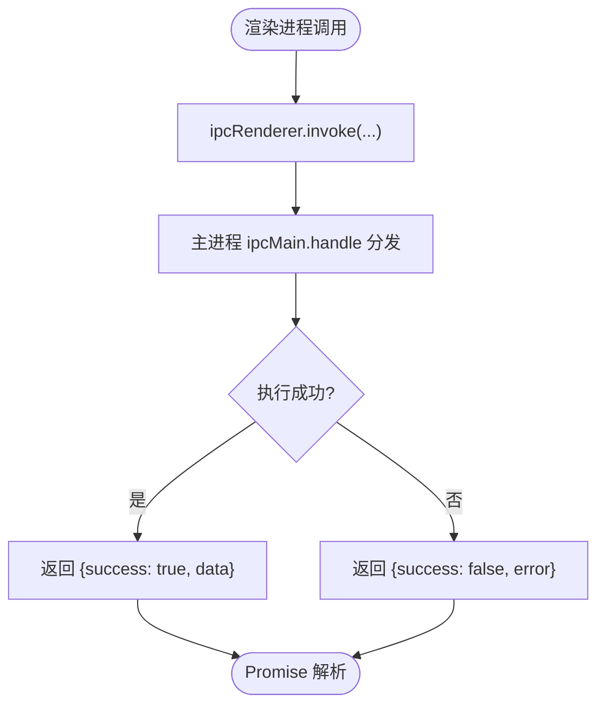
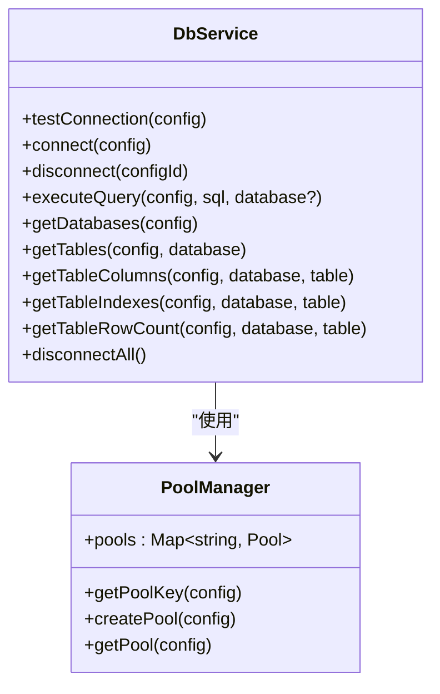
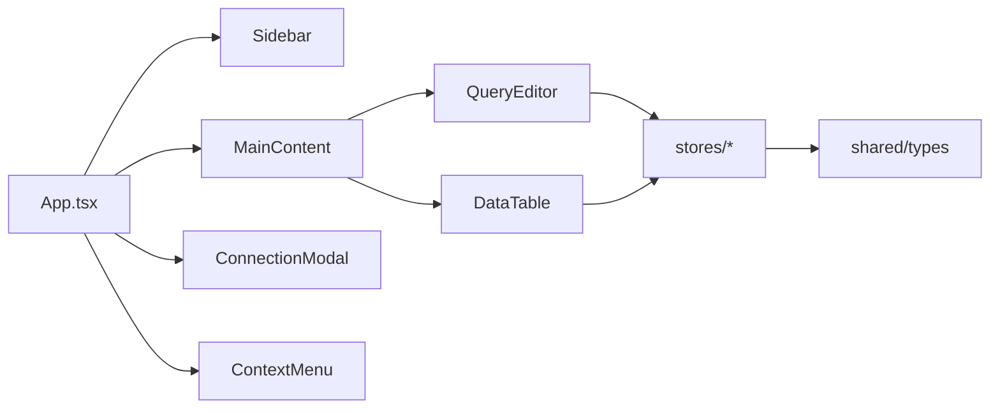
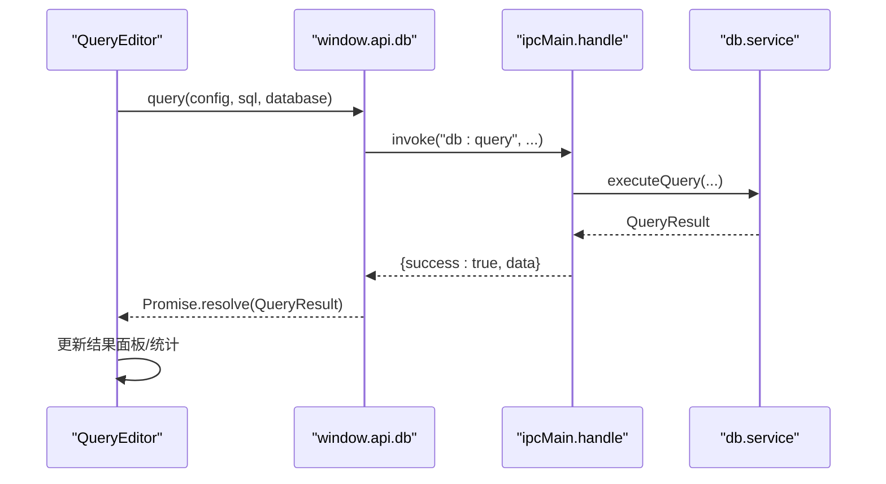
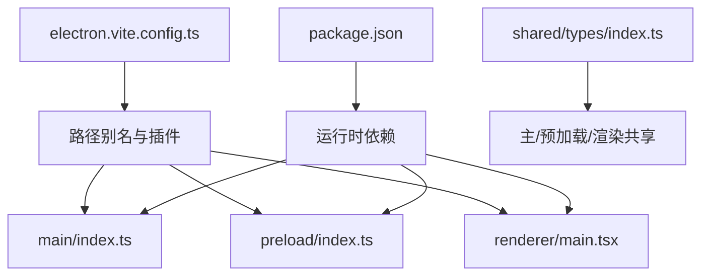

# 架构设计

<cite>
**本文引用的文件**
- [src/main/index.ts](file://src/main/index.ts)
- [src/main/ipc.ts](file://src/main/ipc.ts)
- [src/main/services/db.ts](file://src/main/services/db.ts)
- [src/preload/index.ts](file://src/preload/index.ts)
- [src/preload/index.d.ts](file://src/preload/index.d.ts)
- [src/renderer/src/main.tsx](file://src/renderer/src/main.tsx)
- [src/renderer/src/App.tsx](file://src/renderer/src/App.tsx)
- [src/renderer/src/components/QueryEditor.tsx](file://src/renderer/src/components/QueryEditor.tsx)
- [src/renderer/src/components/DataTable.tsx](file://src/renderer/src/components/DataTable.tsx)
- [src/renderer/src/stores/connection.ts](file://src/renderer/src/stores/connection.ts)
- [src/renderer/src/stores/tab.ts](file://src/renderer/src/stores/tab.ts)
- [src/renderer/src/stores/ui.ts](file://src/renderer/src/stores/ui.ts)
- [src/shared/types/index.ts](file://src/shared/types/index.ts)
- [electron.vite.config.ts](file://electron.vite.config.ts)
- [package.json](file://package.json)
</cite>

## 目录
1. [引言](#引言)
2. [项目结构](#项目结构)
3. [核心组件](#核心组件)
4. [架构总览](#架构总览)
5. [详细组件分析](#详细组件分析)
6. [依赖分析](#依赖分析)
7. [性能考量](#性能考量)
8. [故障排查指南](#故障排查指南)
9. [结论](#结论)
10. [附录](#附录)

## 引言
本文件为 nexSql 的架构设计文档，聚焦于其双进程架构（主进程-渲染进程）在 Electron 下的实现与通信机制，系统性阐述 IPC 通信协议、数据序列化与错误处理策略；同时介绍前端架构（React + TypeScript）的设计模式，包括组件化与状态管理；最后给出扩展性与性能方面的分析与建议。

## 项目结构
项目采用 Electron-Vite 的多端口工程组织方式，按“主进程”、“预加载脚本”、“渲染进程”、“共享类型”进行分层隔离，确保安全边界与职责清晰。

**图表来源**
- [src/main/index.ts:1-64](file://src/main/index.ts#L1-L64)
- [src/main/ipc.ts:1-132](file://src/main/ipc.ts#L1-L132)
- [src/main/services/db.ts:1-277](file://src/main/services/db.ts#L1-L277)
- [src/preload/index.ts:1-60](file://src/preload/index.ts#L1-L60)
- [src/preload/index.d.ts:1-10](file://src/preload/index.d.ts#L1-L10)
- [src/renderer/src/main.tsx:1-11](file://src/renderer/src/main.tsx#L1-L11)
- [src/renderer/src/App.tsx:1-24](file://src/renderer/src/App.tsx#L1-L24)
- [src/renderer/src/stores/connection.ts:1-64](file://src/renderer/src/stores/connection.ts#L1-L64)
- [src/renderer/src/stores/tab.ts:1-65](file://src/renderer/src/stores/tab.ts#L1-L65)
- [src/renderer/src/stores/ui.ts:1-41](file://src/renderer/src/stores/ui.ts#L1-L41)
- [src/shared/types/index.ts:1-124](file://src/shared/types/index.ts#L1-L124)
- [electron.vite.config.ts:1-31](file://electron.vite.config.ts#L1-L31)
- [package.json:1-42](file://package.json#L1-L42)

**章节来源**
- [src/main/index.ts:1-64](file://src/main/index.ts#L1-L64)
- [electron.vite.config.ts:1-31](file://electron.vite.config.ts#L1-L31)
- [package.json:1-42](file://package.json#L1-L42)

## 核心组件
- 主进程入口与窗口生命周期：负责创建 BrowserWindow、注入 webPreferences 安全参数、加载开发或打包资源，并在退出前断开所有数据库连接。
- 预加载脚本：通过 contextBridge 将受限 API 暴露到渲染进程，统一封装 IPC 调用，屏蔽底层细节。
- IPC 处理器：集中注册所有主进程侧的 ipcMain.handle 处理函数，提供配置与数据库操作能力，并返回标准化 IpcResponse。
- 数据库服务：基于 mysql2/promise 的连接池管理，提供连接测试、建立、断开、查询与元数据读取等能力。
- 渲染进程前端：React + TypeScript，使用 Zustand 进行轻量状态管理，组件围绕查询编辑器、数据表展示、侧边栏与标签页组织。
- 共享类型：定义连接配置、查询结果、IPC 响应等跨进程传输的数据契约。

**章节来源**
- [src/main/index.ts:1-64](file://src/main/index.ts#L1-L64)
- [src/preload/index.ts:1-60](file://src/preload/index.ts#L1-L60)
- [src/main/ipc.ts:1-132](file://src/main/ipc.ts#L1-L132)
- [src/main/services/db.ts:1-277](file://src/main/services/db.ts#L1-L277)
- [src/renderer/src/main.tsx:1-11](file://src/renderer/src/main.tsx#L1-L11)
- [src/renderer/src/App.tsx:1-24](file://src/renderer/src/App.tsx#L1-L24)
- [src/shared/types/index.ts:1-124](file://src/shared/types/index.ts#L1-L124)

## 架构总览
下图展示了从渲染进程发起请求到主进程处理再到数据库访问的完整链路，以及错误与响应的标准化流程。

**图表来源**
- [src/renderer/src/components/QueryEditor.tsx:36-64](file://src/renderer/src/components/QueryEditor.tsx#L36-L64)
- [src/preload/index.ts:33-34](file://src/preload/index.ts#L33-L34)
- [src/main/ipc.ts:74-81](file://src/main/ipc.ts#L74-L81)
- [src/main/services/db.ts:73-135](file://src/main/services/db.ts#L73-L135)

## 详细组件分析

### 双进程与进程分离原理
- 主进程负责窗口生命周期、菜单、系统级事件与数据库连接池管理；渲染进程承载 UI 与用户交互；预加载脚本作为桥接层，仅暴露受控 API。
- 安全配置要点：
  - 禁用 Node 集成，启用上下文隔离，使用预加载脚本暴露 API。
  - 外链打开由主进程接管，避免渲染进程直接调用系统 shell。
- 开发与生产加载策略：
  - 开发环境加载 Vite Dev Server；生产环境加载打包后的 HTML。

**章节来源**
- [src/main/index.ts:8-41](file://src/main/index.ts#L8-L41)
- [src/main/index.ts:30-33](file://src/main/index.ts#L30-L33)
- [src/main/index.ts:36-40](file://src/main/index.ts#L36-L40)

### IPC 通信系统
- 消息命名空间：
  - 配置类：config:getConnections、config:saveConnection、config:deleteConnection
  - 数据库类：db:testConnection、db:connect、db:disconnect、db:query、db:getDatabases、db:getTables、db:getTableColumns、db:getTableIndexes、db:getTableRowCount
- 调用模型：
  - 渲染进程通过 ipcRenderer.invoke 发起请求，主进程以 ipcMain.handle 注册处理器，返回 Promise。
- 数据序列化：
  - 使用 Electron 内置的结构化克隆，配合共享类型确保跨进程字段一致。
- 错误处理：
  - 主进程统一 try/catch，返回标准化 IpcResponse，包含 success、data、error 字段；渲染进程根据 success 判断 UI 展示与错误提示。

**图表来源**
- [src/preload/index.ts:14-45](file://src/preload/index.ts#L14-L45)
- [src/main/ipc.ts:19-43](file://src/main/ipc.ts#L19-L43)
- [src/main/ipc.ts:47-126](file://src/main/ipc.ts#L47-L126)

**章节来源**
- [src/preload/index.ts:14-45](file://src/preload/index.ts#L14-L45)
- [src/main/ipc.ts:16-127](file://src/main/ipc.ts#L16-L127)
- [src/shared/types/index.ts:104-108](file://src/shared/types/index.ts#L104-L108)

### 数据库服务与连接池
- 连接池键值：以连接配置 id 作为键，全局 Map 存储，避免重复创建。
- 连接测试：临时连接池用于验证连通性与超时设置。
- 查询执行：
  - SELECT：解析字段元信息与行数据，计算耗时，返回 columns、rows、affectedRows、duration。
  - DML：返回影响行数、插入 ID、变更行数及可选 warning。
- 元数据接口：支持获取数据库列表、表清单、列信息、索引与行数统计。
- 断开策略：按连接 id 关闭对应连接池，或应用退出时断开全部。

**图表来源**
- [src/main/services/db.ts:1-277](file://src/main/services/db.ts#L1-L277)

**章节来源**
- [src/main/services/db.ts:1-277](file://src/main/services/db.ts#L1-L277)

### 预加载脚本与 API 暴露
- 通过 contextBridge.exposeInMainWorld 将受限 API 暴露至 window.api，渲染进程以 window.api.config.* 与 window.api.db.* 调用。
- 类型声明：在 preload/index.d.ts 中声明 window.api 类型，保证 TS 检查与智能提示。
- 安全边界：仅暴露必要方法，不直接暴露 Node/Electron 能力。

**章节来源**
- [src/preload/index.ts:14-59](file://src/preload/index.ts#L14-L59)
- [src/preload/index.d.ts:1-10](file://src/preload/index.d.ts#L1-10)

### 渲染进程前端架构
- 应用入口：ReactDOM.createRoot 渲染根组件 App。
- 组件化：
  - QueryEditor：SQL 编辑、快捷键执行、结果面板、CSV 导出、结果面板拖拽调整高度。
  - DataTable：分页、筛选、排序、行号冻结、主键高亮。
  - Sidebar、MainContent、TabBar、ContextMenu 等构成页面骨架。
- 状态管理：Zustand 轻量状态，分别维护连接配置、标签页与 UI 状态。
- 类型约束：所有跨进程数据严格遵循共享类型定义，确保一致性。

**图表来源**
- [src/renderer/src/App.tsx:1-24](file://src/renderer/src/App.tsx#L1-L24)
- [src/renderer/src/components/QueryEditor.tsx:1-329](file://src/renderer/src/components/QueryEditor.tsx#L1-L329)
- [src/renderer/src/components/DataTable.tsx:1-297](file://src/renderer/src/components/DataTable.tsx#L1-L297)
- [src/renderer/src/stores/connection.ts:1-64](file://src/renderer/src/stores/connection.ts#L1-L64)
- [src/renderer/src/stores/tab.ts:1-65](file://src/renderer/src/stores/tab.ts#L1-L65)
- [src/renderer/src/stores/ui.ts:1-41](file://src/renderer/src/stores/ui.ts#L1-L41)
- [src/shared/types/index.ts:1-124](file://src/shared/types/index.ts#L1-L124)

**章节来源**
- [src/renderer/src/main.tsx:1-11](file://src/renderer/src/main.tsx#L1-L11)
- [src/renderer/src/App.tsx:1-24](file://src/renderer/src/App.tsx#L1-L24)
- [src/renderer/src/components/QueryEditor.tsx:1-329](file://src/renderer/src/components/QueryEditor.tsx#L1-L329)
- [src/renderer/src/components/DataTable.tsx:1-297](file://src/renderer/src/components/DataTable.tsx#L1-L297)
- [src/renderer/src/stores/connection.ts:1-64](file://src/renderer/src/stores/connection.ts#L1-L64)
- [src/renderer/src/stores/tab.ts:1-65](file://src/renderer/src/stores/tab.ts#L1-L65)
- [src/renderer/src/stores/ui.ts:1-41](file://src/renderer/src/stores/ui.ts#L1-L41)

### 数据流与关键交互
- 连接配置加载：渲染进程通过 window.api.config.getConnections() 读取本地存储，Zustand 状态持久化。
- 查询执行：QueryEditor 收集 SQL，选择器范围或全量 SQL，调用 window.api.db.query(...)，等待 IpcResponse，更新结果面板。
- 元数据读取：DataTable 首次进入时拉取列信息与行数，再按分页与筛选条件构造 SQL 并查询。

**图表来源**
- [src/renderer/src/components/QueryEditor.tsx:36-64](file://src/renderer/src/components/QueryEditor.tsx#L36-L64)
- [src/preload/index.ts:33-34](file://src/preload/index.ts#L33-L34)
- [src/main/ipc.ts:74-81](file://src/main/ipc.ts#L74-L81)
- [src/main/services/db.ts:73-135](file://src/main/services/db.ts#L73-L135)

## 依赖分析
- 构建与别名：
  - electron.vite.config.ts 为三端配置了路径别名，便于模块化导入与开发体验。
- 运行时依赖：
  - React 生态、Monaco Editor、React Data Grid、Zustand、mysql2、electron-store 等。
- 类型与共享契约：
  - 所有跨进程数据结构均来自 shared/types，确保前后端一致。

**图表来源**
- [electron.vite.config.ts:1-31](file://electron.vite.config.ts#L1-L31)
- [package.json:16-26](file://package.json#L16-L26)
- [src/shared/types/index.ts:1-124](file://src/shared/types/index.ts#L1-L124)

**章节来源**
- [electron.vite.config.ts:1-31](file://electron.vite.config.ts#L1-L31)
- [package.json:16-26](file://package.json#L16-L26)
- [src/shared/types/index.ts:1-124](file://src/shared/types/index.ts#L1-L124)

## 性能考量
- 连接池与并发：
  - 默认连接池上限为 5，适合桌面应用的典型并发场景；可根据数据库负载与资源限制调整。
  - 连接复用与 ping 校验减少握手开销。
- 查询性能：
  - SELECT 结果集解析与字段元数据二次查询，注意大结果集的内存占用；建议分页与筛选策略。
  - 计算耗时 duration 有助于定位慢查询。
- 渲染性能：
  - DataTable 使用 react-data-grid，建议控制列宽与分页大小，避免超大表格导致重排压力。
  - QueryEditor 的 CSV 导出对大结果集可能造成内存峰值，建议异步分块导出或提示用户。
- I/O 与序列化：
  - IPC 采用结构化克隆，避免自定义序列化成本；但大对象仍需关注传输体积与时间。
- 磁盘与配置：
  - electron-store 本地存储连接配置，建议定期清理无效连接与历史记录。

[本节为通用性能建议，无需特定文件引用]

## 故障排查指南
- 连接失败：
  - 检查主进程日志与 IpcResponse.error；确认网络、主机、端口、认证信息与超时设置。
  - 使用 db:testConnection 快速验证连通性。
- 查询异常：
  - 查看 QueryEditor 的错误区域与控制台；核对 SQL 语法与目标数据库/表是否存在。
  - 对于 DML，留意 warning 字段提示。
- 断开与释放：
  - 确认 db:disconnect 与 disconnectAll 是否被正确触发；避免连接泄漏。
- 预加载与类型：
  - 若 TS 报错 window.api 不存在，检查 preload/index.d.ts 是否生效与 contextIsolation 设置。

**章节来源**
- [src/main/ipc.ts:47-126](file://src/main/ipc.ts#L47-L126)
- [src/main/services/db.ts:38-56](file://src/main/services/db.ts#L38-L56)
- [src/renderer/src/components/QueryEditor.tsx:58-63](file://src/renderer/src/components/QueryEditor.tsx#L58-L63)

## 结论
nexSql 采用清晰的双进程架构与严格的 IPC 协议，结合 React/Zustand 的前端模式，实现了安全、可维护且易扩展的桌面数据库工具。通过连接池与分页/筛选策略，兼顾了性能与用户体验；通过共享类型与标准化响应，保障了跨进程数据一致性。后续可在连接池动态扩缩容、结果集导出异步化、元数据缓存等方面进一步优化。

## 附录
- 关键技术决策与权衡：
  - 预加载脚本 + contextBridge：在安全与可用性之间取得平衡，避免直接暴露 Node 能力。
  - IPC invoke 模式：简化请求-响应语义，便于错误与状态统一处理。
  - 共享类型：降低耦合，提升协作效率。
- 扩展建议：
  - 增加连接池监控与自动扩缩容策略。
  - 对大数据导出增加进度反馈与取消机制。
  - 引入元数据缓存与增量刷新，减少重复查询。