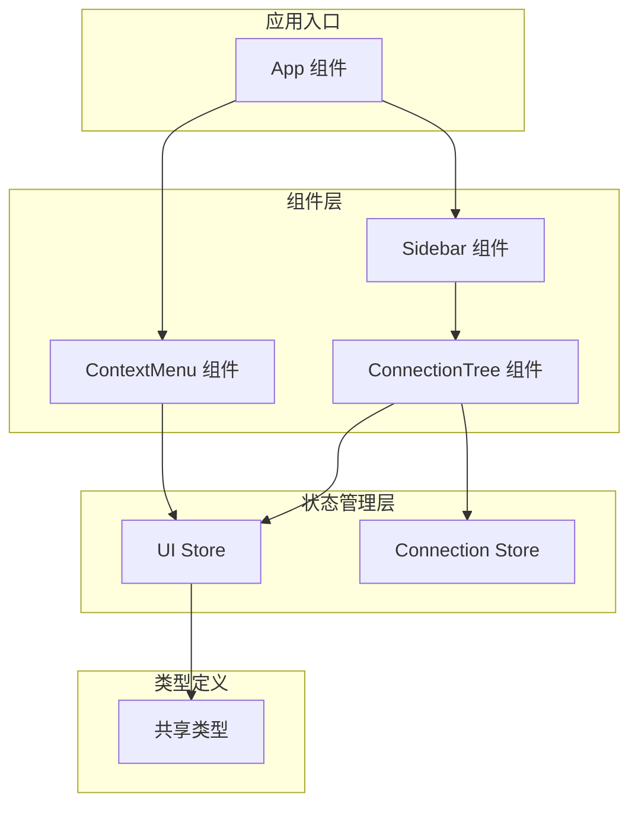
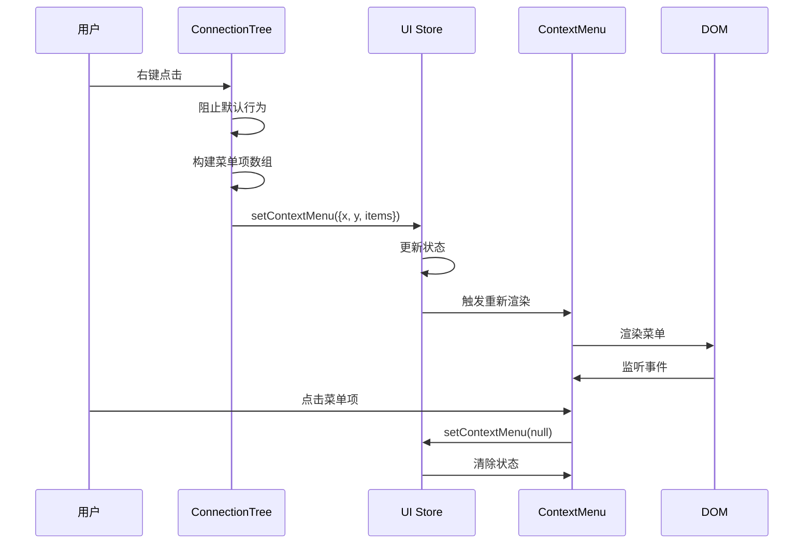
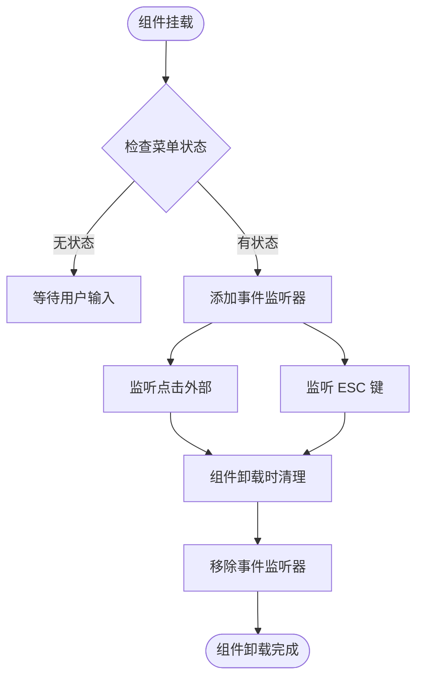
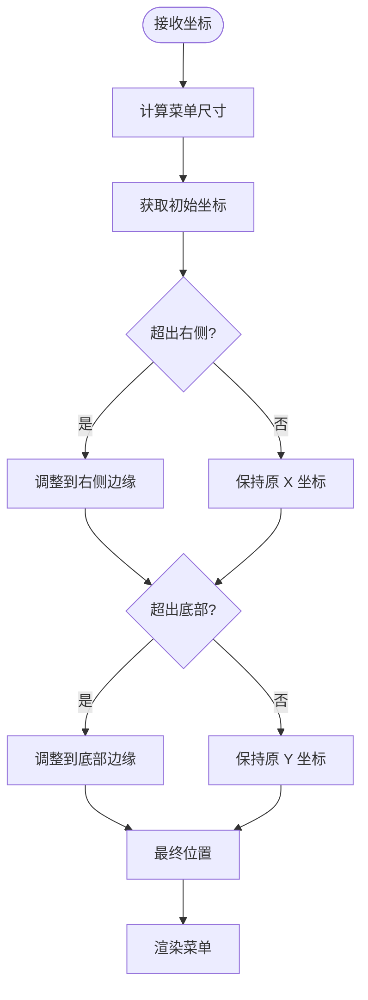
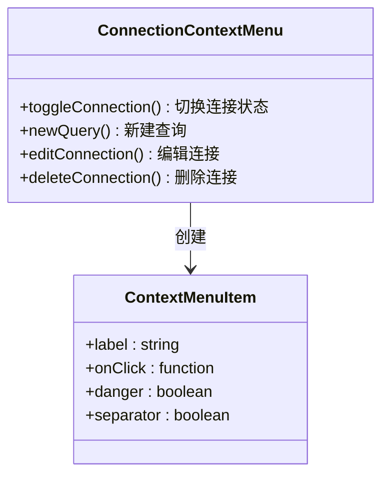
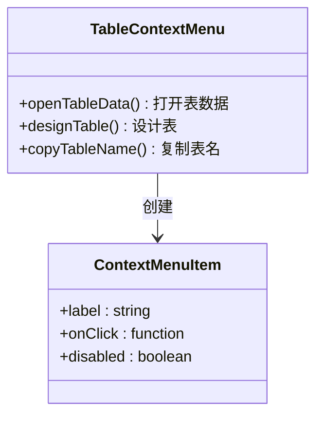
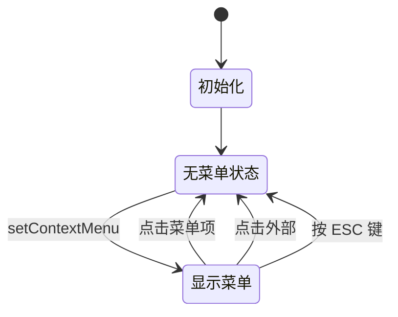
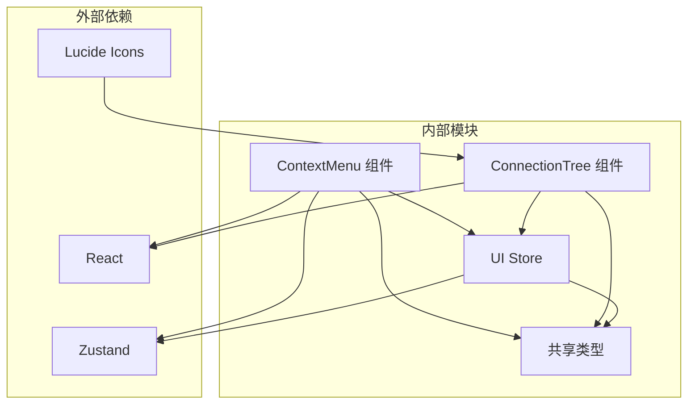

# 上下文菜单组件

<cite>
**本文档引用的文件**
- [ContextMenu.tsx](file://src/renderer/src/components/ContextMenu.tsx)
- [ui.ts](file://src/renderer/src/stores/ui.ts)
- [ConnectionTree.tsx](file://src/renderer/src/components/ConnectionTree.tsx)
- [App.tsx](file://src/renderer/src/App.tsx)
- [types/index.ts](file://src/shared/types/index.ts)
- [Sidebar.tsx](file://src/renderer/src/components/Sidebar.tsx)
- [connection.ts](file://src/renderer/src/stores/connection.ts)
</cite>

## 目录
1. [简介](#简介)
2. [项目结构](#项目结构)
3. [核心组件](#核心组件)
4. [架构概览](#架构概览)
5. [详细组件分析](#详细组件分析)
6. [依赖关系分析](#依赖关系分析)
7. [性能考虑](#性能考虑)
8. [故障排除指南](#故障排除指南)
9. [结论](#结论)

## 简介

上下文菜单组件是 nexSql 应用程序中的重要交互元素，负责提供右键菜单功能。该组件实现了完整的右键菜单系统，包括菜单项配置、事件处理、定位逻辑和可定制性设计。通过全局状态管理，该组件能够为应用程序的不同界面提供一致的上下文菜单体验。

## 项目结构

上下文菜单组件在项目中的组织结构如下：

**图表来源**
- [App.tsx:15-32](file://src/renderer/src/App.tsx#L15-L32)
- [ContextMenu.tsx:4-78](file://src/renderer/src/components/ContextMenu.tsx#L4-L78)
- [ConnectionTree.tsx:31-313](file://src/renderer/src/components/ConnectionTree.tsx#L31-L313)

**章节来源**
- [App.tsx:1-35](file://src/renderer/src/App.tsx#L1-L35)
- [ContextMenu.tsx:1-79](file://src/renderer/src/components/ContextMenu.tsx#L1-L79)

## 核心组件

### ContextMenu 组件

ContextMenu 是一个独立的 React 组件，负责渲染和管理上下文菜单。它具有以下核心特性：

- **状态管理**：通过全局 UI Store 获取当前菜单状态
- **事件处理**：监听点击外部区域和键盘事件
- **定位计算**：自动计算菜单位置，避免超出屏幕边界
- **样式定制**：支持危险操作标记和禁用状态

### UI Store 集成

UI Store 提供了完整的上下文菜单状态管理：

- **ContextMenuItem 接口**：定义菜单项的标准结构
- **setContextMenu 动作**：设置和清除菜单状态
- **全局状态共享**：确保整个应用的菜单状态一致性

**章节来源**
- [ContextMenu.tsx:4-78](file://src/renderer/src/components/ContextMenu.tsx#L4-L78)
- [ui.ts:3-40](file://src/renderer/src/stores/ui.ts#L3-L40)

## 架构概览

上下文菜单系统的整体架构采用分层设计模式：

**图表来源**
- [ConnectionTree.tsx:127-157](file://src/renderer/src/components/ConnectionTree.tsx#L127-L157)
- [ContextMenu.tsx:9-34](file://src/renderer/src/components/ContextMenu.tsx#L9-L34)

## 详细组件分析

### ContextMenu 组件实现

ContextMenu 组件的核心实现包含以下关键部分：

#### 状态管理和生命周期

组件使用 React 的 useEffect 钩子来管理事件监听器的添加和清理：

**图表来源**
- [ContextMenu.tsx:9-34](file://src/renderer/src/components/ContextMenu.tsx#L9-L34)

#### 菜单定位算法

菜单定位逻辑确保菜单不会超出屏幕边界：

**图表来源**
- [ContextMenu.tsx:38-48](file://src/renderer/src/components/ContextMenu.tsx#L38-L48)

#### 菜单项渲染

每个菜单项都支持多种配置选项：

| 属性 | 类型 | 描述 | 默认值 |
|------|------|------|--------|
| label | string | 菜单项显示文本 | 必填 |
| icon | string | 图标名称 | undefined |
| onClick | function | 点击回调函数 | undefined |
| separator | boolean | 是否显示分隔线 | false |
| danger | boolean | 是否为危险操作 | false |
| disabled | boolean | 是否禁用 | false |

**章节来源**
- [ContextMenu.tsx:56-75](file://src/renderer/src/components/ContextMenu.tsx#L56-L75)
- [ui.ts:17-24](file://src/renderer/src/stores/ui.ts#L17-L24)

### ConnectionTree 中的菜单集成

ConnectionTree 组件展示了如何在实际应用中集成上下文菜单：

#### 连接级菜单

连接级菜单提供了数据库连接管理功能：

**图表来源**
- [ConnectionTree.tsx:127-157](file://src/renderer/src/components/ConnectionTree.tsx#L127-L157)

#### 表级菜单

表级菜单提供了数据库表的操作功能：

**图表来源**
- [ConnectionTree.tsx:159-189](file://src/renderer/src/components/ConnectionTree.tsx#L159-L189)

**章节来源**
- [ConnectionTree.tsx:127-189](file://src/renderer/src/components/ConnectionTree.tsx#L127-L189)

### UI Store 状态管理

UI Store 使用 Zustand 实现轻量级状态管理：

**图表来源**
- [ui.ts:26-40](file://src/renderer/src/stores/ui.ts#L26-L40)

**章节来源**
- [ui.ts:1-41](file://src/renderer/src/stores/ui.ts#L1-L41)

## 依赖关系分析

上下文菜单组件的依赖关系图：

**图表来源**
- [ContextMenu.tsx:1-2](file://src/renderer/src/components/ContextMenu.tsx#L1-L2)
- [ConnectionTree.tsx:17-18](file://src/renderer/src/components/ConnectionTree.tsx#L17-L18)
- [ui.ts:1](file://src/renderer/src/stores/ui.ts#L1)]

### 组件间耦合度分析

- **低耦合设计**：ContextMenu 组件与具体业务逻辑解耦
- **接口统一**：通过 ContextMenuItem 接口统一菜单项格式
- **状态集中**：所有菜单状态集中在 UI Store 中管理

**章节来源**
- [ContextMenu.tsx:1-79](file://src/renderer/src/components/ContextMenu.tsx#L1-L79)
- [ConnectionTree.tsx:1-313](file://src/renderer/src/components/ConnectionTree.tsx#L1-L313)

## 性能考虑

### 渲染优化

- **条件渲染**：只有当存在菜单状态时才渲染组件
- **事件监听器管理**：正确清理事件监听器避免内存泄漏
- **延迟添加监听器**：使用 setTimeout 避免立即关闭菜单

### 计算复杂度

- **定位算法**：O(1) 时间复杂度，仅进行简单的边界检查
- **菜单项渲染**：O(n) 时间复杂度，n 为菜单项数量
- **事件处理**：O(1) 时间复杂度，每次点击处理

### 内存使用

- **状态存储**：最小化状态对象大小
- **事件监听**：及时清理不再使用的监听器
- **组件卸载**：确保组件完全卸载时释放资源

## 故障排除指南

### 常见问题及解决方案

#### 菜单无法显示

**症状**：右键点击无反应
**可能原因**：
- 事件未正确阻止默认行为
- 菜单状态未正确设置
- 组件未正确渲染

**解决方法**：
1. 检查事件处理器是否调用了 preventDefault()
2. 验证 setContextMenu 调用是否正确
3. 确认组件在 App 中正确引入

#### 菜单位置异常

**症状**：菜单显示在屏幕外或被遮挡
**可能原因**：
- 客户端坐标计算错误
- 屏幕尺寸变化未处理
- 定位算法逻辑错误

**解决方法**：
1. 检查 e.clientX 和 e.clientY 的获取
2. 验证窗口尺寸获取的正确性
3. 确认边界检查逻辑

#### 事件冲突

**症状**：菜单点击后立即消失
**可能原因**：
- 事件冒泡导致的问题
- 监听器添加时机不当
- 状态更新顺序问题

**解决方法**：
1. 确保正确阻止事件冒泡
2. 使用 setTimeout 延迟添加监听器
3. 检查状态更新的时机

**章节来源**
- [ContextMenu.tsx:12-22](file://src/renderer/src/components/ContextMenu.tsx#L12-L22)
- [ConnectionTree.tsx:128-130](file://src/renderer/src/components/ConnectionTree.tsx#L128-L130)

## 结论

上下文菜单组件通过清晰的架构设计和良好的抽象，成功实现了灵活且可扩展的右键菜单系统。其主要优势包括：

1. **模块化设计**：组件职责明确，易于维护和测试
2. **可定制性强**：通过接口定义支持各种菜单项配置
3. **用户体验优秀**：智能定位和响应式设计
4. **性能表现良好**：优化的渲染和事件处理机制

该组件为 nexSql 应用提供了坚实的基础，支持未来更多的菜单功能扩展和定制需求。通过遵循现有的设计模式和最佳实践，开发者可以轻松地为应用程序添加新的上下文菜单功能。