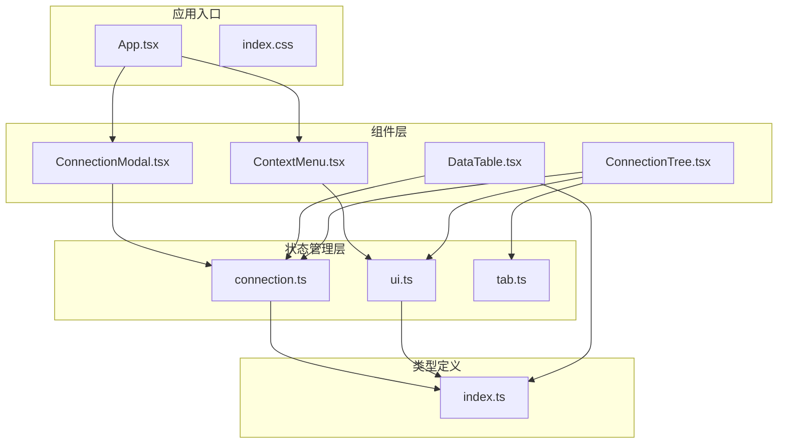
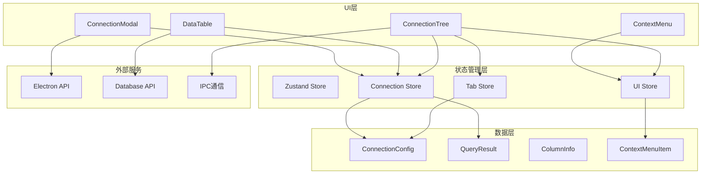
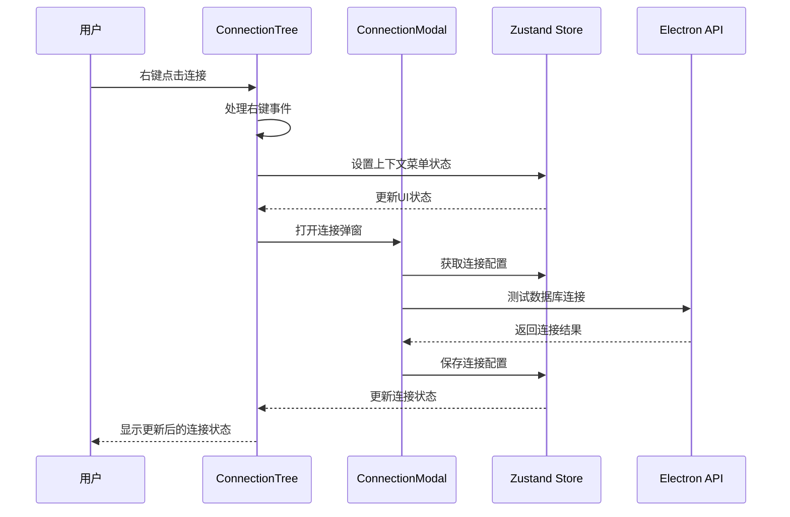
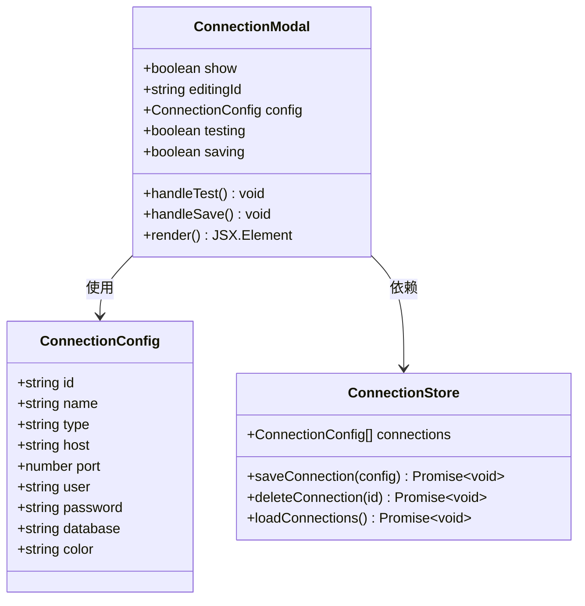
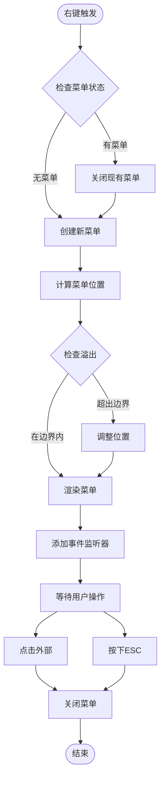
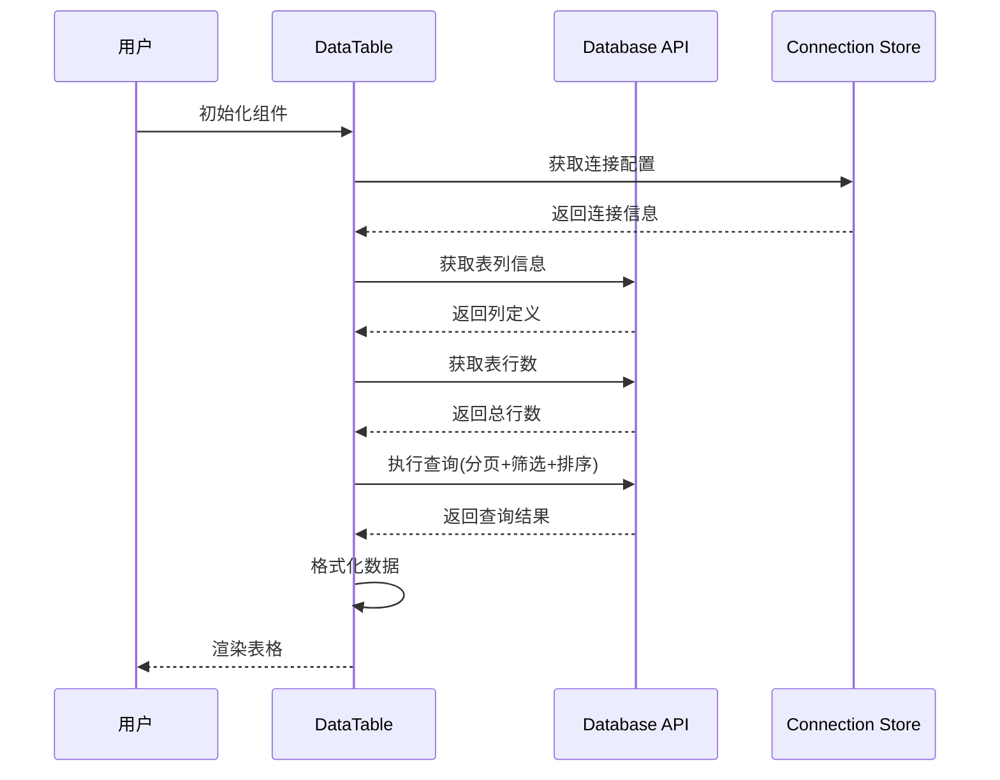
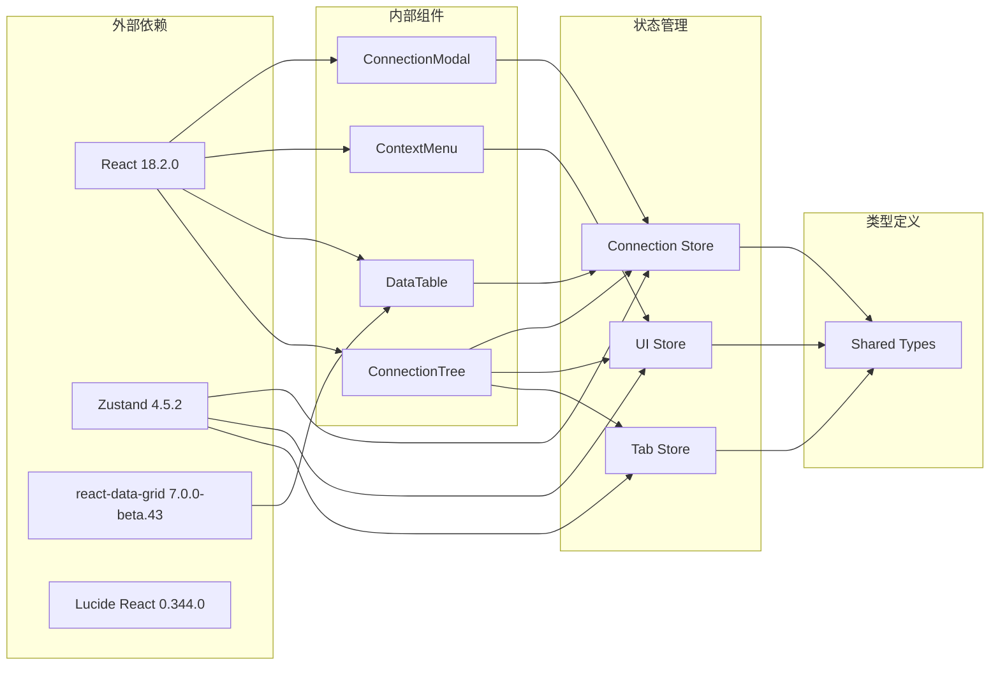

# 工具组件

<cite>
**本文档引用的文件**
- [ConnectionModal.tsx](file://src/renderer/src/components/ConnectionModal.tsx)
- [ContextMenu.tsx](file://src/renderer/src/components/ContextMenu.tsx)
- [DataTable.tsx](file://src/renderer/src/components/DataTable.tsx)
- [ConnectionTree.tsx](file://src/renderer/src/components/ConnectionTree.tsx)
- [connection.ts](file://src/renderer/src/stores/connection.ts)
- [ui.ts](file://src/renderer/src/stores/ui.ts)
- [tab.ts](file://src/renderer/src/stores/tab.ts)
- [index.ts](file://src/shared/types/index.ts)
- [App.tsx](file://src/renderer/src/App.tsx)
- [index.css](file://src/renderer/src/index.css)
- [tailwind.config.js](file://tailwind.config.js)
- [package.json](file://package.json)
</cite>

## 目录
1. [简介](#简介)
2. [项目结构](#项目结构)
3. [核心组件](#核心组件)
4. [架构概览](#架构概览)
5. [详细组件分析](#详细组件分析)
6. [依赖关系分析](#依赖关系分析)
7. [性能考虑](#性能考虑)
8. [故障排除指南](#故障排除指南)
9. [结论](#结论)

## 简介

本文档详细介绍了nexSql数据库管理工具中的工具组件系统，重点涵盖了连接弹窗、上下文菜单、数据表格等辅助功能组件。这些组件构成了应用的核心交互层，提供了用户与数据库进行高效交互的能力。

该工具组件系统采用现代化的React技术栈构建，结合了Electron跨平台框架、Zustand状态管理、TailwindCSS样式系统和TypeScript类型安全。组件设计注重用户体验、可定制性和扩展性，为开发者提供了灵活的工具集。

## 项目结构

工具组件系统位于渲染进程的组件目录中，采用按功能模块组织的结构：

**图表来源**
- [App.tsx:15-32](file://src/renderer/src/App.tsx#L15-L32)
- [ConnectionModal.tsx:1-231](file://src/renderer/src/components/ConnectionModal.tsx#L1-L231)
- [ContextMenu.tsx:1-79](file://src/renderer/src/components/ContextMenu.tsx#L1-L79)
- [DataTable.tsx:1-297](file://src/renderer/src/components/DataTable.tsx#L1-L297)

**章节来源**
- [App.tsx:1-35](file://src/renderer/src/App.tsx#L1-L35)
- [package.json:16-26](file://package.json#L16-L26)

## 核心组件

工具组件系统包含以下核心组件：

### 连接弹窗组件 (ConnectionModal)
负责数据库连接配置的创建、编辑和测试功能，提供直观的表单界面和实时连接验证。

### 上下文菜单组件 (ContextMenu)
提供全局上下文菜单功能，支持自定义菜单项、分隔符、危险操作标记和键盘快捷键支持。

### 数据表格组件 (DataTable)
基于react-data-grid实现的高性能数据展示组件，支持分页、排序、筛选、列宽调整等功能。

### 连接树组件 (ConnectionTree)
数据库连接树形结构展示，支持连接状态管理、懒加载、右键菜单和双击打开功能。

**章节来源**
- [ConnectionModal.tsx:21-231](file://src/renderer/src/components/ConnectionModal.tsx#L21-L231)
- [ContextMenu.tsx:4-79](file://src/renderer/src/components/ContextMenu.tsx#L4-L79)
- [DataTable.tsx:27-297](file://src/renderer/src/components/DataTable.tsx#L27-L297)
- [ConnectionTree.tsx:31-313](file://src/renderer/src/components/ConnectionTree.tsx#L31-L313)

## 架构概览

工具组件系统采用分层架构设计，各层职责明确，耦合度低：

**图表来源**
- [connection.ts:17-63](file://src/renderer/src/stores/connection.ts#L17-L63)
- [ui.ts:26-40](file://src/renderer/src/stores/ui.ts#L26-L40)
- [tab.ts:15-64](file://src/renderer/src/stores/tab.ts#L15-L64)
- [index.ts:3-22](file://src/shared/types/index.ts#L3-L22)

### 组件间交互流程

**图表来源**
- [ConnectionTree.tsx:127-157](file://src/renderer/src/components/ConnectionTree.tsx#L127-L157)
- [ConnectionModal.tsx:44-65](file://src/renderer/src/components/ConnectionModal.tsx#L44-L65)
- [connection.ts:28-31](file://src/renderer/src/stores/connection.ts#L28-L31)

## 详细组件分析

### 连接弹窗组件 (ConnectionModal)

#### 功能特性
- **多数据库支持**: 支持MySQL数据库连接配置
- **实时连接测试**: 内置连接测试功能，提供即时反馈
- **颜色标签系统**: 提供8种预设颜色用于连接分类标识
- **响应式设计**: 自适应窗口大小和内容布局
- **状态管理**: 集成Zustand状态管理，支持编辑模式切换

#### 配置选项
- **基础连接信息**: 连接名称、主机地址、端口号、用户名、密码
- **高级配置**: 默认数据库、SSH隧道支持、SSL配置
- **连接参数**: 超时设置、连接超时时间
- **颜色定制**: 支持8种预设颜色选择

#### 使用场景
- 新建数据库连接
- 编辑现有连接配置
- 连接测试和验证
- 连接分类和标识

**图表来源**
- [ConnectionModal.tsx:7-17](file://src/renderer/src/components/ConnectionModal.tsx#L7-L17)
- [ConnectionModal.tsx:25-26](file://src/renderer/src/components/ConnectionModal.tsx#L25-L26)
- [connection.ts:17-31](file://src/renderer/src/stores/connection.ts#L17-L31)

**章节来源**
- [ConnectionModal.tsx:1-231](file://src/renderer/src/components/ConnectionModal.tsx#L1-L231)
- [index.ts:3-22](file://src/shared/types/index.ts#L3-L22)

### 上下文菜单组件 (ContextMenu)

#### 功能特性
- **全局定位**: 自动计算菜单位置，避免超出屏幕边界
- **事件处理**: 支持点击外部区域关闭和ESC键关闭
- **灵活配置**: 支持自定义菜单项、分隔符、禁用状态
- **视觉反馈**: 提供悬停效果和危险操作高亮显示
- **延迟加载**: 避免立即关闭导致的交互问题

#### 配置选项
- **菜单项结构**: label(显示文本)、icon(图标)、onClick(点击回调)
- **状态控制**: separator(分隔符)、danger(危险操作)、disabled(禁用状态)
- **定位控制**: x、y坐标自动计算，避免溢出屏幕

#### 使用场景
- 连接树右键菜单
- 表格右键菜单
- 任意元素上下文菜单
- 快捷操作入口

**图表来源**
- [ContextMenu.tsx:9-34](file://src/renderer/src/components/ContextMenu.tsx#L9-L34)
- [ContextMenu.tsx:38-48](file://src/renderer/src/components/ContextMenu.tsx#L38-L48)

**章节来源**
- [ContextMenu.tsx:1-79](file://src/renderer/src/components/ContextMenu.tsx#L1-L79)
- [ui.ts:17-24](file://src/renderer/src/stores/ui.ts#L17-L24)

### 数据表格组件 (DataTable)

#### 功能特性
- **高性能渲染**: 基于react-data-grid优化的大数据量表格
- **分页功能**: 支持100行每页的分页显示
- **排序支持**: 单列排序，支持升序、降序和清除排序
- **筛选功能**: 全字段模糊搜索筛选
- **状态指示**: 加载状态、错误提示、空数据处理

#### 配置选项
- **分页设置**: PAGE_SIZE常量(100行/页)
- **列配置**: 动态列生成、主键高亮、列宽调整
- **排序控制**: sortCol(排序列)、sortDir(排序方向)
- **筛选条件**: filter(筛选字符串)

#### 使用场景
- 表数据浏览和查询
- 结果集展示和导出
- 数据探索和分析
- 实时数据监控

**图表来源**
- [DataTable.tsx:41-87](file://src/renderer/src/components/DataTable.tsx#L41-L87)
- [DataTable.tsx:27-30](file://src/renderer/src/components/DataTable.tsx#L27-L30)

**章节来源**
- [DataTable.tsx:1-297](file://src/renderer/src/components/DataTable.tsx#L1-L297)
- [index.ts:49-58](file://src/shared/types/index.ts#L49-L58)

### 连接树组件 (ConnectionTree)

#### 功能特性
- **树形结构**: 层次化的数据库连接展示
- **状态管理**: 连接状态跟踪(连接中、已连接、错误)
- **懒加载**: 按需加载数据库和表信息
- **缓存机制**: 内存缓存已加载的数据
- **交互丰富**: 支持展开/折叠、双击打开、右键菜单

#### 配置选项
- **节点缓存**: nodeCache内存缓存
- **展开状态**: expandedConnections集合
- **连接状态**: statuses记录连接状态
- **错误信息**: errors记录连接错误

#### 使用场景
- 数据库连接管理
- 数据库对象导航
- 快速访问常用连接
- 连接状态监控

**章节来源**
- [ConnectionTree.tsx:1-313](file://src/renderer/src/components/ConnectionTree.tsx#L1-L313)

## 依赖关系分析

工具组件系统的依赖关系清晰，遵循单一职责原则：

**图表来源**
- [package.json:16-26](file://package.json#L16-L26)
- [connection.ts:1-2](file://src/renderer/src/stores/connection.ts#L1-L2)
- [ui.ts:1-2](file://src/renderer/src/stores/ui.ts#L1-L2)
- [tab.ts:1-2](file://src/renderer/src/stores/tab.ts#L1-L2)

### 组件耦合度分析

| 组件 | 内聚性 | 耦合度 | 依赖数量 |
|------|--------|--------|----------|
| ConnectionModal | 高 | 低 | 3 |
| ContextMenu | 中 | 低 | 1 |
| DataTable | 高 | 中 | 2 |
| ConnectionTree | 中 | 高 | 4 |

**章节来源**
- [package.json:16-26](file://package.json#L16-L26)
- [connection.ts:17-63](file://src/renderer/src/stores/connection.ts#L17-L63)
- [ui.ts:26-40](file://src/renderer/src/stores/ui.ts#L26-L40)

## 性能考虑

### 渲染优化
- **虚拟滚动**: react-data-grid内置虚拟滚动，支持大数据量表格
- **状态分离**: 组件状态与全局状态分离，减少不必要的重渲染
- **记忆化**: 使用useMemo优化复杂计算，避免重复渲染

### 数据加载策略
- **懒加载**: 连接树按需加载数据库和表信息
- **缓存机制**: 内存缓存已加载的数据，避免重复请求
- **分页加载**: 数据表格采用分页策略，限制单次加载数据量

### 内存管理
- **组件卸载**: 正确清理事件监听器和定时器
- **状态清理**: 删除连接时清理相关状态和缓存
- **资源释放**: 关闭连接时释放数据库连接资源

## 故障排除指南

### 连接弹窗常见问题

**问题**: 连接测试失败
- 检查网络连接和防火墙设置
- 验证主机地址和端口号正确性
- 确认数据库服务正在运行
- 查看错误日志获取详细信息

**问题**: 颜色选择无效
- 确认颜色值格式正确(#RRGGBB)
- 检查CSS变量是否正确配置
- 验证颜色值在可用范围内

### 上下文菜单常见问题

**问题**: 菜单无法关闭
- 检查事件监听器是否正确移除
- 确认ESC键事件绑定正常
- 验证点击外部区域检测逻辑

**问题**: 菜单位置异常
- 检查窗口尺寸变化处理
- 验证边界检测算法
- 确认CSS定位属性正确

### 数据表格常见问题

**问题**: 表格渲染缓慢
- 检查数据量大小和分页设置
- 验证列定义是否合理
- 确认排序和筛选逻辑效率

**问题**: 数据不显示
- 检查连接配置是否正确
- 验证SQL查询语句
- 确认权限设置

**章节来源**
- [ConnectionModal.tsx:44-65](file://src/renderer/src/components/ConnectionModal.tsx#L44-L65)
- [ContextMenu.tsx:9-34](file://src/renderer/src/components/ContextMenu.tsx#L9-L34)
- [DataTable.tsx:78-82](file://src/renderer/src/components/DataTable.tsx#L78-L82)

## 结论

工具组件系统展现了现代前端应用的最佳实践，通过精心设计的架构和丰富的功能特性，为用户提供了一个强大而易用的数据库管理工具。

### 设计优势
- **模块化设计**: 组件职责明确，易于维护和扩展
- **状态管理**: 采用Zustand简化状态管理，提高开发效率
- **类型安全**: TypeScript提供完整的类型安全保障
- **性能优化**: 多层次的性能优化策略确保流畅体验

### 扩展性特点
- **插件化架构**: 组件接口标准化，便于添加新功能
- **配置驱动**: 大量配置选项支持个性化定制
- **主题系统**: 完善的主题和样式系统支持外观定制
- **API友好**: 清晰的接口设计便于第三方集成

### 发展建议
- **单元测试**: 建议添加组件级别的单元测试
- **文档完善**: 为每个组件添加详细的使用文档
- **性能监控**: 添加性能指标监控和分析
- **国际化**: 考虑添加多语言支持

该工具组件系统为数据库管理应用提供了一个坚实的技术基础，其设计理念和实现方式值得在类似项目中借鉴和参考。