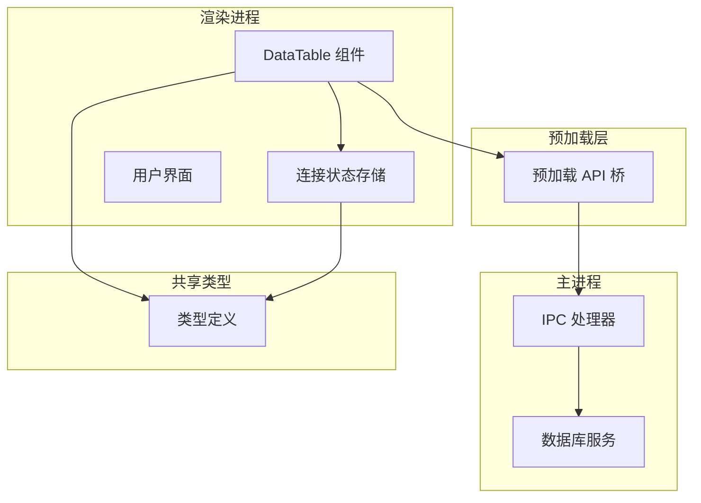
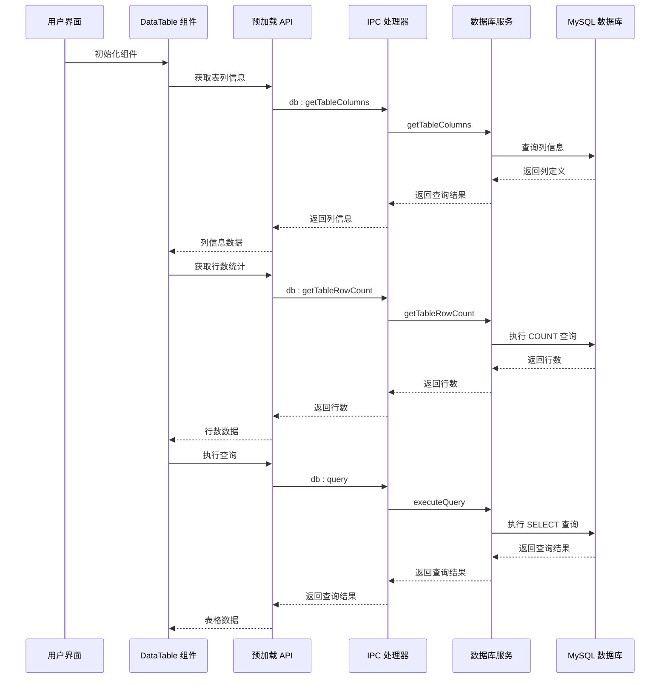
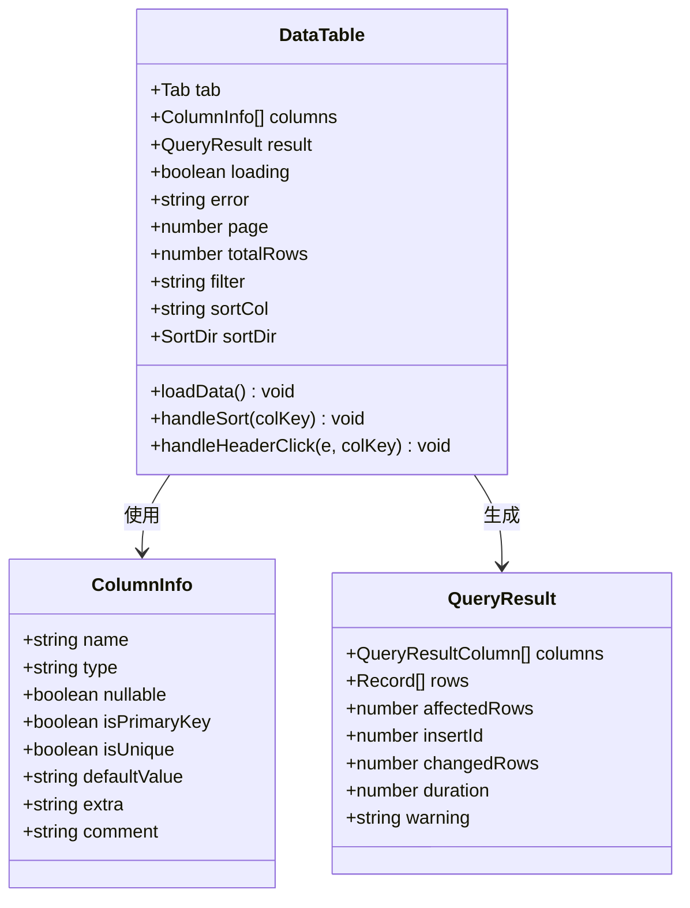
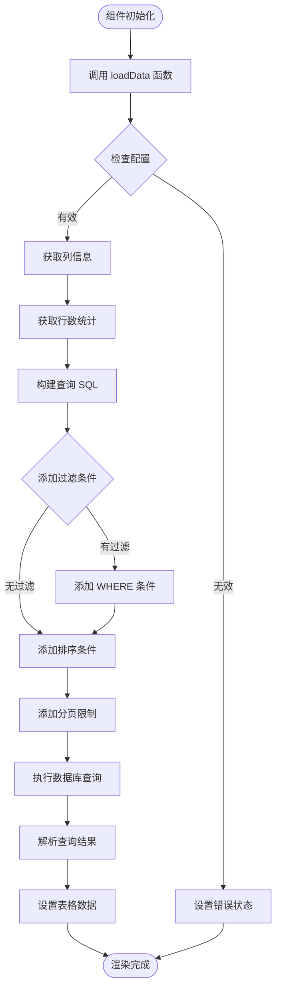
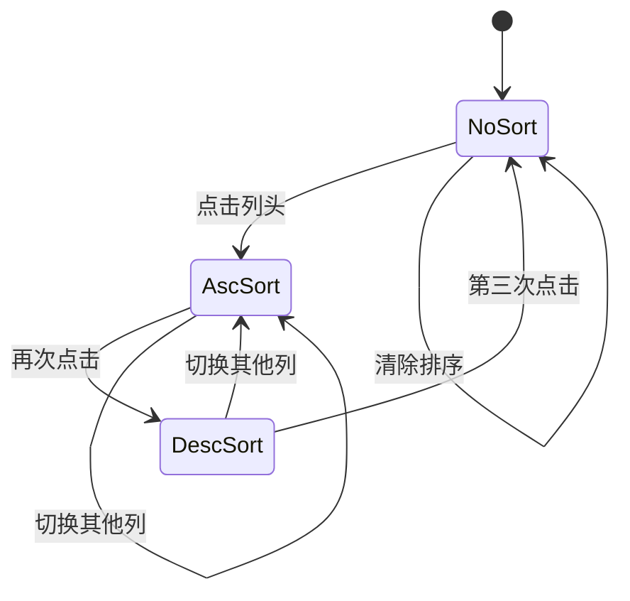
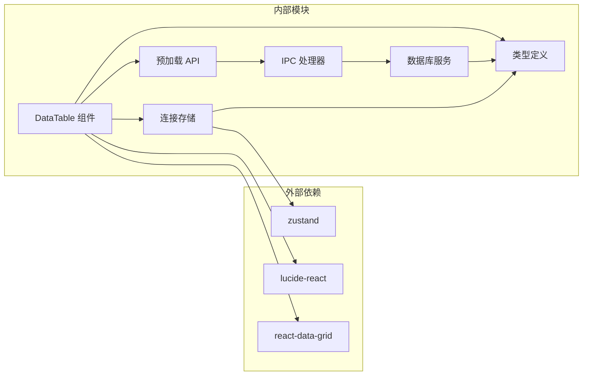
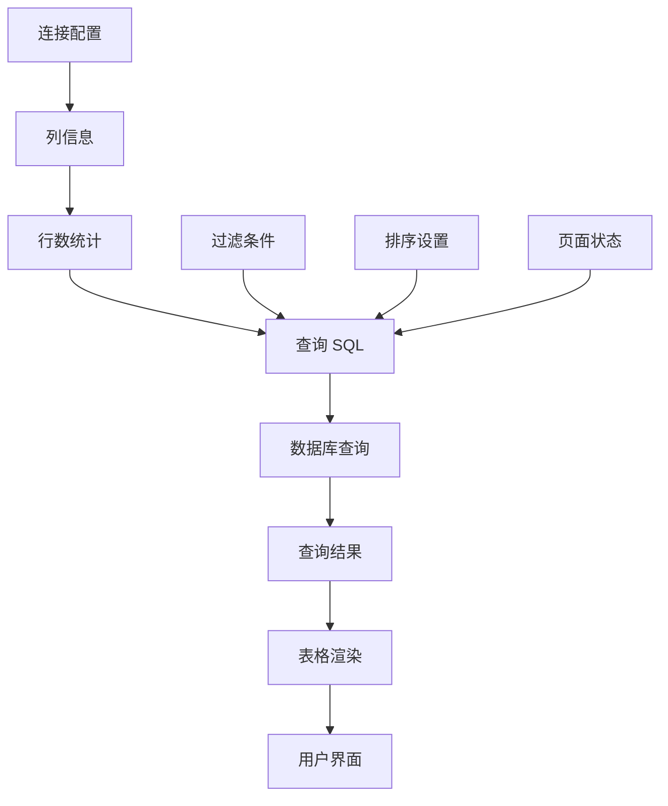
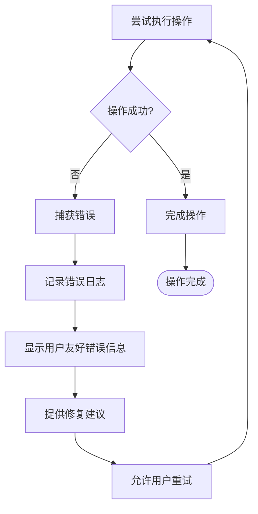

# 数据表格组件

<cite>
**本文引用的文件**
- [DataTable.tsx](file://src/renderer/src/components/DataTable.tsx)
- [db.ts](file://src/main/services/db.ts)
- [ipc.ts](file://src/main/ipc.ts)
- [index.ts](file://src/preload/index.ts)
- [types/index.ts](file://src/shared/types/index.ts)
- [connection.ts](file://src/renderer/src/stores/connection.ts)
</cite>

## 目录
1. [简介](#简介)
2. [项目结构](#项目结构)
3. [核心组件](#核心组件)
4. [架构概览](#架构概览)
5. [详细组件分析](#详细组件分析)
6. [依赖关系分析](#依赖关系分析)
7. [性能考虑](#性能考虑)
8. [故障排除指南](#故障排除指南)
9. [结论](#结论)
10. [附录](#附录)

## 简介
数据表格组件是 nexSql 应用中的核心功能模块，负责展示和操作数据库表数据。该组件实现了完整的数据表格功能，包括数据渲染、分页处理、排序功能、过滤机制以及性能优化策略。通过与后端数据库服务的紧密集成，用户可以高效地浏览和管理大量数据。

## 项目结构
数据表格组件位于渲染进程的组件目录中，采用模块化设计，与其他系统组件协同工作：



**图表来源**
- [DataTable.tsx:1-297](file://src/renderer/src/components/DataTable.tsx#L1-L297)
- [connection.ts:1-64](file://src/renderer/src/stores/connection.ts#L1-L64)
- [index.ts:1-60](file://src/preload/index.ts#L1-L60)
- [ipc.ts:1-182](file://src/main/ipc.ts#L1-L182)
- [db.ts:1-277](file://src/main/services/db.ts#L1-L277)

**章节来源**
- [DataTable.tsx:1-297](file://src/renderer/src/components/DataTable.tsx#L1-L297)
- [connection.ts:1-64](file://src/renderer/src/stores/connection.ts#L1-L64)

## 核心组件
数据表格组件提供了以下核心功能：

### 数据渲染
- 实时数据加载和显示
- 动态列生成
- 行号自动编号
- 主键高亮显示

### 分页处理
- 固定页面大小（100行）
- 总行数统计
- 分页导航控件
- 页面切换状态管理

### 排序功能
- 单列排序支持
- 升序/降序切换
- 排序状态指示
- 清除排序功能

### 过滤机制
- 全列模糊搜索
- 动态过滤条件构建
- 过滤状态持久化

**章节来源**
- [DataTable.tsx:23-83](file://src/renderer/src/components/DataTable.tsx#L23-L83)
- [DataTable.tsx:89-119](file://src/renderer/src/components/DataTable.tsx#L89-L119)
- [DataTable.tsx:121-145](file://src/renderer/src/components/DataTable.tsx#L121-L145)

## 架构概览
数据表格组件采用分层架构设计，确保各层职责清晰分离：



**图表来源**
- [DataTable.tsx:41-83](file://src/renderer/src/components/DataTable.tsx#L41-L83)
- [index.ts:25-45](file://src/preload/index.ts#L25-L45)
- [ipc.ts:106-117](file://src/main/ipc.ts#L106-L117)
- [db.ts:73-135](file://src/main/services/db.ts#L73-L135)

## 详细组件分析

### DataTable 组件架构
DataTable 组件是一个功能完整的数据表格实现，具有以下特点：



**图表来源**
- [DataTable.tsx:19-40](file://src/renderer/src/components/DataTable.tsx#L19-L40)
- [types/index.ts:49-88](file://src/shared/types/index.ts#L49-L88)

### 数据加载流程
组件的数据加载采用异步模式，确保用户体验流畅：



**图表来源**
- [DataTable.tsx:41-83](file://src/renderer/src/components/DataTable.tsx#L41-L83)

### 排序功能实现
排序功能支持单列排序，具有完整的状态管理：



**图表来源**
- [DataTable.tsx:121-137](file://src/renderer/src/components/DataTable.tsx#L121-L137)

### 分页处理机制
分页系统采用固定大小的页面设计：

| 参数 | 值 | 描述 |
|------|-----|------|
| PAGE_SIZE | 100 | 每页显示的记录数 |
| totalRows | 动态计算 | 表的总记录数 |
| totalPages | Math.ceil(totalRows/PAGE_SIZE) | 总页数 |
| startRow | page*PAGE_SIZE+1 | 当前页起始行号 |
| endRow | min((page+1)*PAGE_SIZE, totalRows) | 当前页结束行号 |

**章节来源**
- [DataTable.tsx:23](file://src/renderer/src/components/DataTable.tsx#L23)
- [DataTable.tsx:147-149](file://src/renderer/src/components/DataTable.tsx#L147-L149)

## 依赖关系分析

### 组件间依赖关系


**图表来源**
- [DataTable.tsx:1-17](file://src/renderer/src/components/DataTable.tsx#L1-L17)
- [connection.ts:1-2](file://src/renderer/src/stores/connection.ts#L1-L2)

### 数据流依赖
组件的数据流遵循严格的单向数据流原则：



**图表来源**
- [DataTable.tsx:41-83](file://src/renderer/src/components/DataTable.tsx#L41-L83)

**章节来源**
- [DataTable.tsx:1-297](file://src/renderer/src/components/DataTable.tsx#L1-L297)
- [connection.ts:1-64](file://src/renderer/src/stores/connection.ts#L1-L64)

## 性能考虑

### 数据库连接优化
- **连接池管理**: 使用连接池避免频繁建立连接
- **连接复用**: 同一连接配置复用现有连接
- **超时控制**: 设置合理的连接超时时间
- **保持连接**: 启用 keep-alive 机制

### 查询性能优化
- **分页查询**: 限制每次查询返回的记录数量
- **索引利用**: 通过 ORDER BY 和 WHERE 条件利用数据库索引
- **字段选择**: 使用 SELECT * 但仅渲染必要字段
- **缓存策略**: 利用 React.memo 避免不必要的重渲染

### 前端性能优化
- **虚拟滚动**: 使用 react-data-grid 的内置虚拟滚动
- **状态最小化**: 只在必要时更新组件状态
- **事件防抖**: 过滤输入采用防抖机制
- **内存管理**: 及时清理未使用的状态和事件监听器

### 大数据量处理方案
对于超大表的数据处理，建议采用以下策略：
1. **分页加载**: 默认使用 100 行分页
2. **索引优化**: 确保常用排序和过滤列有适当索引
3. **查询优化**: 避免 SELECT *
4. **缓存策略**: 对于频繁访问的小表启用应用级缓存

**章节来源**
- [db.ts:11-36](file://src/main/services/db.ts#L11-L36)
- [db.ts:73-135](file://src/main/services/db.ts#L73-L135)
- [DataTable.tsx:23](file://src/renderer/src/components/DataTable.tsx#L23)

## 故障排除指南

### 常见错误类型及解决方案

| 错误类型 | 触发条件 | 解决方案 |
|----------|----------|----------|
| 连接失败 | 数据库不可达或凭据错误 | 检查连接配置，验证网络连通性 |
| 查询超时 | 查询语句复杂或数据量过大 | 优化查询语句，添加适当的索引 |
| 权限不足 | 用户缺少必要的数据库权限 | 联系数据库管理员授予相应权限 |
| 内存溢出 | 大量数据一次性加载 | 使用分页功能，避免一次性加载所有数据 |

### 错误处理机制
组件实现了多层次的错误处理：



**图表来源**
- [DataTable.tsx:78-82](file://src/renderer/src/components/DataTable.tsx#L78-L82)

### 调试技巧
1. **查看错误详情**: 组件会在界面上显示详细的错误信息
2. **检查网络连接**: 确认数据库服务器可达
3. **验证 SQL 语法**: 检查生成的查询语句是否正确
4. **监控资源使用**: 关注内存和 CPU 使用情况

**章节来源**
- [DataTable.tsx:228-234](file://src/renderer/src/components/DataTable.tsx#L228-L234)
- [ipc.ts:16-44](file://src/main/ipc.ts#L16-L44)

## 结论
数据表格组件是一个功能完整、性能优化良好的数据展示解决方案。它通过合理的架构设计、完善的错误处理机制和高效的性能优化策略，为用户提供流畅的数据浏览体验。组件支持基本的 CRUD 操作，具备扩展性，可以根据需要添加更多高级功能。

## 附录

### 配置选项参考

| 属性名 | 类型 | 默认值 | 描述 |
|--------|------|--------|------|
| PAGE_SIZE | number | 100 | 每页显示的记录数 |
| columns | ColumnInfo[] | [] | 表列定义数组 |
| result | QueryResult | null | 查询结果对象 |
| loading | boolean | false | 加载状态标志 |
| error | string | null | 错误信息字符串 |
| page | number | 0 | 当前页码（从0开始） |
| totalRows | number | 0 | 表的总记录数 |
| filter | string | '' | 过滤条件字符串 |
| sortCol | string | null | 排序列名 |
| sortDir | 'ASC'\|'DESC'\|null | null | 排序方向 |

### 数据格式要求

#### ColumnInfo 结构
```typescript
interface ColumnInfo {
  name: string;           // 列名
  type: string;           // 数据类型
  nullable: boolean;      // 是否可为空
  isPrimaryKey: boolean;  // 是否为主键
  isUnique: boolean;      // 是否唯一
  defaultValue: string | null; // 默认值
  extra?: string;         // 额外信息
  comment?: string;       // 列注释
}
```

#### QueryResult 结构
```typescript
interface QueryResult {
  columns: QueryResultColumn[];   // 列定义数组
  rows: Record<string, unknown>[]; // 数据行数组
  affectedRows: number;           // 影响的行数
  insertId?: number;              // 插入的ID
  changedRows?: number;           // 更改的行数
  duration: number;               // 查询耗时（毫秒）
  warning?: string;               // 警告信息
}
```

### 使用示例

#### 基本使用
```typescript
// 在 Tab 中使用数据表格组件
<DataTable tab={currentTab} />

// 配置连接参数
const connectionConfig = {
  id: 'conn1',
  name: 'My Database',
  type: 'mysql',
  host: 'localhost',
  port: 3306,
  user: 'username',
  password: 'password'
};
```

#### 高级配置
```typescript
// 自定义分页大小
const CUSTOM_PAGE_SIZE = 50;

// 实现自定义过滤逻辑
const customFilter = (data: any[], filterText: string) => {
  return data.filter(row => 
    Object.values(row).some(value => 
      value.toString().toLowerCase().includes(filterText.toLowerCase())
    )
  );
};
```

**章节来源**
- [types/index.ts:49-88](file://src/shared/types/index.ts#L49-L88)
- [DataTable.tsx:19-40](file://src/renderer/src/components/DataTable.tsx#L19-L40)