# 连接弹窗组件

<cite>
**本文档引用的文件**
- [ConnectionModal.tsx](file://src/renderer/src/components/ConnectionModal.tsx)
- [connection.ts](file://src/renderer/src/stores/connection.ts)
- [ui.ts](file://src/renderer/src/stores/ui.ts)
- [index.ts](file://src/shared/types/index.ts)
- [db.ts](file://src/main/services/db.ts)
- [ssh-tunnel.ts](file://src/main/services/ssh-tunnel.ts)
- [ipc.ts](file://src/main/ipc.ts)
- [preload/index.ts](file://src/preload/index.ts)
- [App.tsx](file://src/renderer/src/App.tsx)
- [ConnectionTree.tsx](file://src/renderer/src/components/ConnectionTree.tsx)
- [Sidebar.tsx](file://src/renderer/src/components/Sidebar.tsx)
</cite>

## 更新摘要
**变更内容**
- 新增SSH隧道配置功能，支持通过SSH连接数据库
- 新增SSL连接设置，支持加密数据库连接
- 新增连接分组和标签功能，提升连接管理能力
- 增强连接测试机制，支持更全面的连接验证
- 更新连接配置数据结构，包含新的SSH和SSL相关字段

## 目录
1. [简介](#简介)
2. [项目结构](#项目结构)
3. [核心组件](#核心组件)
4. [架构概览](#架构概览)
5. [详细组件分析](#详细组件分析)
6. [依赖关系分析](#依赖关系分析)
7. [性能考虑](#性能考虑)
8. [故障排除指南](#故障排除指南)
9. [结论](#结论)

## 简介

连接弹窗组件是 nexSql 应用程序中的核心功能模块，用于管理和配置数据库连接。该组件提供了完整的连接配置界面，包括连接参数输入、颜色标签选择、连接测试和保存功能。组件采用现代化的 React Hooks 架构，结合 Zustand 状态管理，实现了响应式的用户交互体验。

**更新** 该组件现已支持高级连接配置功能，包括SSH隧道连接、SSL加密连接、连接分组管理和标签系统，为用户提供更加灵活和安全的数据库连接管理能力。

该组件支持多种数据库类型（当前版本主要支持 MySQL），提供了直观的图形化界面让用户能够轻松地添加、编辑和管理数据库连接。通过集成 IPC 通信机制，组件能够与主进程进行安全的数据交换，确保连接配置的安全存储和验证。

## 项目结构

连接弹窗组件位于应用程序的渲染器进程中，采用模块化的文件组织方式：

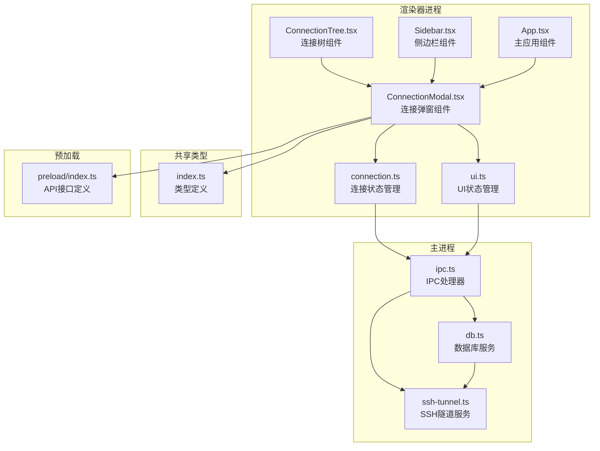

**图表来源**
- [ConnectionModal.tsx:1-344](file://src/renderer/src/components/ConnectionModal.tsx#L1-L344)
- [connection.ts:1-64](file://src/renderer/src/stores/connection.ts#L1-L64)
- [ui.ts:1-45](file://src/renderer/src/stores/ui.ts#L1-L45)

**章节来源**
- [ConnectionModal.tsx:1-344](file://src/renderer/src/components/ConnectionModal.tsx#L1-L344)
- [App.tsx:1-35](file://src/renderer/src/App.tsx#L1-L35)

## 核心组件

### 组件架构设计

连接弹窗组件采用了函数式组件的设计模式，结合 React Hooks 实现了完整的状态管理。组件的核心架构包括以下关键部分：

#### 状态管理机制

组件使用多个独立的状态钩子来管理不同的交互状态：

- **配置状态**：管理连接配置的实时更新
- **测试状态**：跟踪连接测试的执行过程
- **保存状态**：控制保存操作的用户反馈
- **显示状态**：控制弹窗的可见性

#### 数据流设计

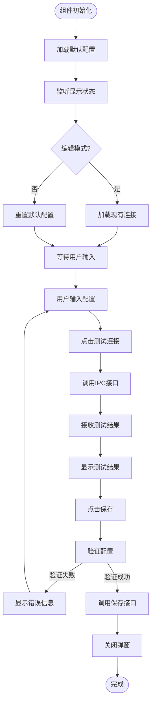

**图表来源**
- [ConnectionModal.tsx:32-65](file://src/renderer/src/components/ConnectionModal.tsx#L32-L65)

**章节来源**
- [ConnectionModal.tsx:21-65](file://src/renderer/src/components/ConnectionModal.tsx#L21-L65)

### 连接配置数据结构

连接配置采用标准化的数据结构，支持完整的数据库连接参数：

| 字段名 | 类型 | 必填 | 默认值 | 描述 |
|--------|------|------|--------|------|
| id | string | 否 | 自动生成 | 连接唯一标识符 |
| name | string | 是 | 空字符串 | 连接名称 |
| group | string | 否 | 空字符串 | 连接分组 |
| tags | string[] | 否 | 空数组 | 连接标签数组 |
| type | 'mysql' | 是 | 'mysql' | 数据库类型 |
| host | string | 是 | '127.0.0.1' | 数据库主机地址 |
| port | number | 是 | 3306 | 数据库端口号 |
| user | string | 是 | 'root' | 用户名 |
| password | string | 是 | 空字符串 | 密码 |
| database | string | 否 | 空字符串 | 默认数据库 |
| color | string | 否 | '#3b82f6' | 连接颜色标签 |
| sshEnabled | boolean | 否 | false | SSH隧道启用 |
| sshHost | string | 否 | 空字符串 | SSH主机 |
| sshPort | number | 否 | 22 | SSH端口 |
| sshUser | string | 否 | 空字符串 | SSH用户名 |
| sshPassword | string | 否 | 空字符串 | SSH密码 |
| sshPrivateKey | string | 否 | 空字符串 | SSH私钥 |
| sslEnabled | boolean | 否 | false | SSL连接启用 |
| connectTimeout | number | 否 | 10000 | 连接超时时间 |

**更新** 新增了分组（group）、标签（tags）字段，以及增强的SSH和SSL配置选项。

**章节来源**
- [index.ts:3-23](file://src/shared/types/index.ts#L3-L23)

## 架构概览

连接弹窗组件采用分层架构设计，确保了良好的代码组织和可维护性：

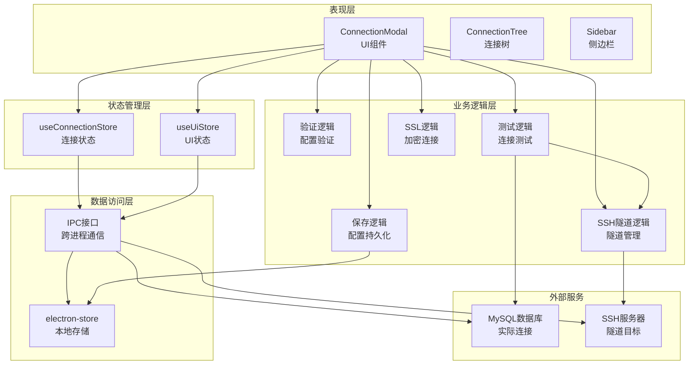

**图表来源**
- [ConnectionModal.tsx:1-344](file://src/renderer/src/components/ConnectionModal.tsx#L1-L344)
- [connection.ts:17-63](file://src/renderer/src/stores/connection.ts#L17-L63)
- [ui.ts:26-40](file://src/renderer/src/stores/ui.ts#L26-L40)

### 状态管理机制

组件的状态管理采用分层设计，确保了状态的一致性和可预测性：

#### UI状态管理

UI状态管理负责控制弹窗的显示和隐藏，以及编辑模式的切换：

- `showConnectionModal`: 控制弹窗是否显示
- `editingConnectionId`: 当前编辑的连接ID
- `openConnectionModal()`: 打开弹窗并设置编辑模式
- `closeConnectionModal()`: 关闭弹窗并清除编辑状态

#### 连接状态管理

连接状态管理负责连接配置的CRUD操作：

- `connections`: 存储所有连接配置
- `statuses`: 存储连接状态
- `errors`: 存储连接错误信息
- `loadConnections()`: 加载连接配置
- `saveConnection()`: 保存连接配置
- `deleteConnection()`: 删除连接配置

**章节来源**
- [ui.ts:3-15](file://src/renderer/src/stores/ui.ts#L3-L15)
- [connection.ts:4-15](file://src/renderer/src/stores/connection.ts#L4-L15)

## 详细组件分析

### 连接弹窗组件实现

连接弹窗组件是整个系统的核心交互界面，提供了完整的连接配置功能：

#### 组件结构分析

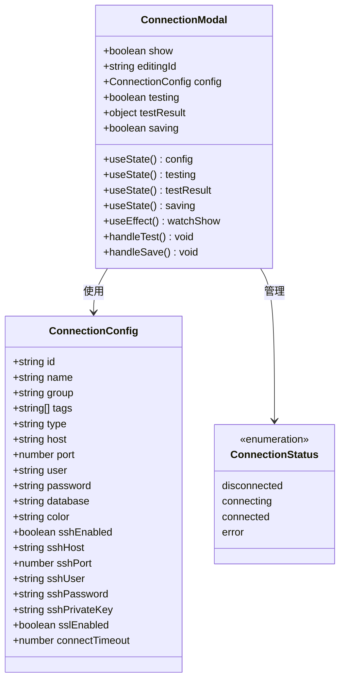

**图表来源**
- [ConnectionModal.tsx:21-65](file://src/renderer/src/components/ConnectionModal.tsx#L21-L65)
- [index.ts:3-23](file://src/shared/types/index.ts#L3-L23)

#### 功能特性实现

##### 连接参数输入

组件提供了完整的连接参数输入界面，包括：

- **连接名称**：必填字段，用于标识连接
- **分组**：可选字段，用于连接分类管理
- **标签**：可选字段，支持多个标签，用逗号分隔
- **主机地址**：支持IPv4和IPv6格式
- **端口号**：默认3306，支持自定义
- **用户名和密码**：安全的密码输入框
- **默认数据库**：可选字段
- **颜色标签**：8种预设颜色供选择

##### 连接分组和标签功能

**更新** 新增了连接分组和标签功能，提供更精细的连接管理：

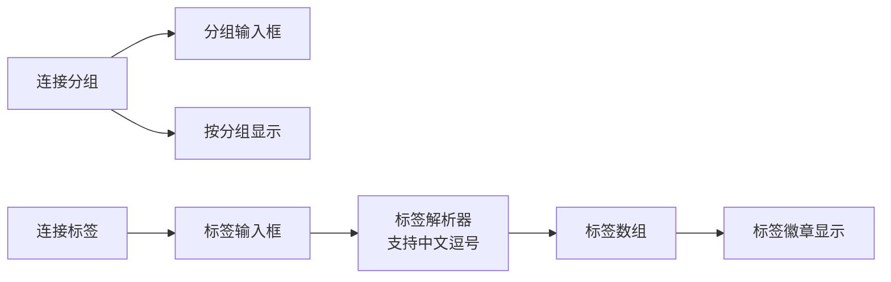

**图表来源**
- [ConnectionModal.tsx:104-129](file://src/renderer/src/components/ConnectionModal.tsx#L104-L129)

##### 颜色标签选择

颜色标签系统提供了视觉化的连接分类功能：

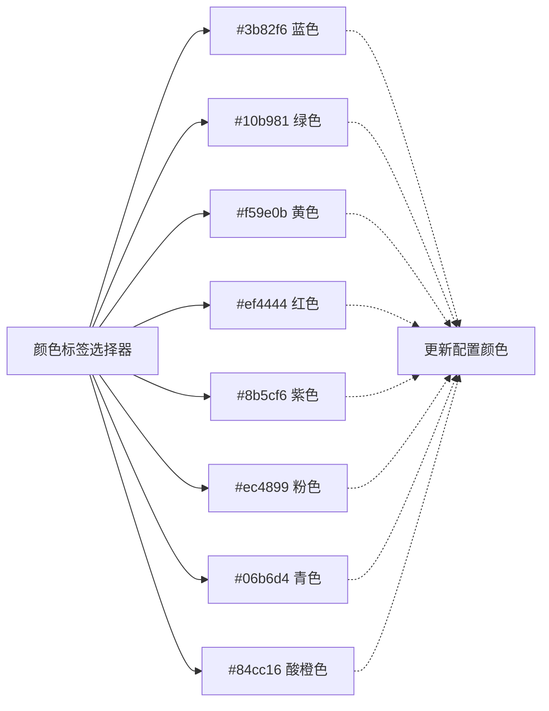

**图表来源**
- [ConnectionModal.tsx:131-147](file://src/renderer/src/components/ConnectionModal.tsx#L131-L147)

##### SSL连接设置

**更新** 新增SSL连接加密功能：

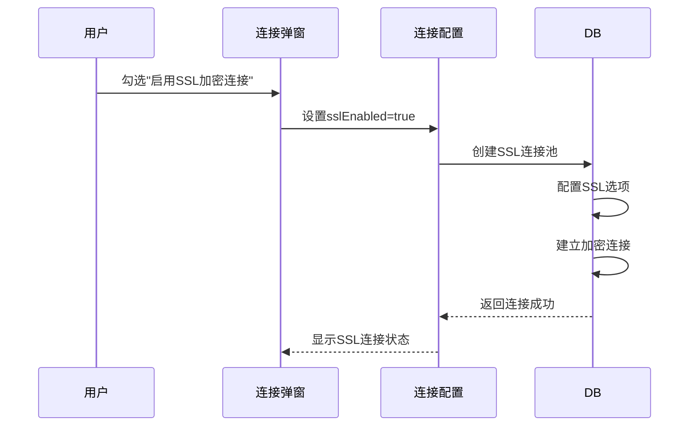

**图表来源**
- [ConnectionModal.tsx:207-219](file://src/renderer/src/components/ConnectionModal.tsx#L207-L219)
- [db.ts:31-34](file://src/main/services/db.ts#L31-L34)

##### SSH隧道配置

**更新** 新增SSH隧道连接功能：

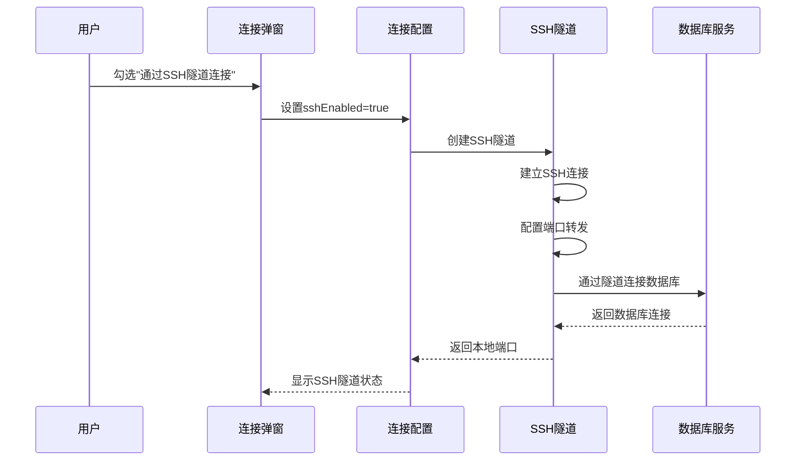

**图表来源**
- [ConnectionModal.tsx:221-291](file://src/renderer/src/components/ConnectionModal.tsx#L221-L291)
- [ssh-tunnel.ts:18-94](file://src/main/services/ssh-tunnel.ts#L18-L94)

##### 连接测试功能

连接测试功能提供了即时的连接验证机制：

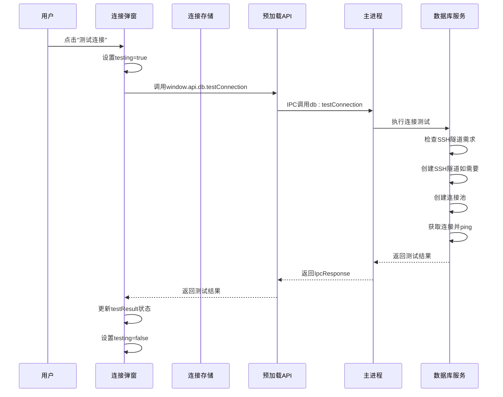

**图表来源**
- [ConnectionModal.tsx:44-50](file://src/renderer/src/components/ConnectionModal.tsx#L44-L50)
- [preload/index.ts:34-35](file://src/preload/index.ts#L34-L35)
- [ipc.ts:95-103](file://src/main/ipc.ts#L95-L103)

##### 保存功能实现

保存功能确保连接配置的安全持久化：

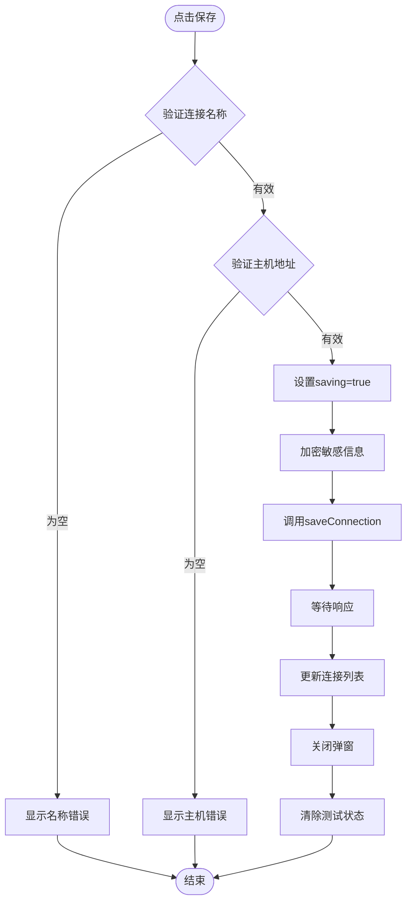

**图表来源**
- [ConnectionModal.tsx:52-65](file://src/renderer/src/components/ConnectionModal.tsx#L52-L65)
- [connection.ts:28-31](file://src/renderer/src/stores/connection.ts#L28-L31)

**章节来源**
- [ConnectionModal.tsx:67-344](file://src/renderer/src/components/ConnectionModal.tsx#L67-L344)

### 验证规则和错误处理

组件实现了多层次的验证机制，确保数据的完整性和用户体验：

#### 前端验证规则

| 验证项 | 规则描述 | 错误消息 | 触发时机 |
|--------|----------|----------|----------|
| 连接名称 | 非空且去除空白字符后不为空 | 请填写连接名称 | 保存时 |
| 主机地址 | 非空且去除空白字符后不为空 | 请填写主机地址 | 保存时 |
| 端口号 | 数字类型且在有效范围内 | 端口号无效 | 保存时 |
| 用户名 | 非空 | 请填写用户名 | 保存时 |
| 密码 | 允许为空（保持现有密码） | - | 保存时 |

#### 后端验证和错误处理

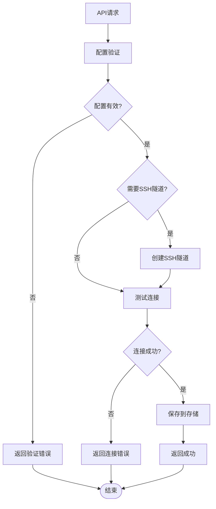

**图表来源**
- [db.ts:55-73](file://src/main/services/db.ts#L55-L73)
- [ipc.ts:95-103](file://src/main/ipc.ts#L95-L103)

**章节来源**
- [ConnectionModal.tsx:52-65](file://src/renderer/src/components/ConnectionModal.tsx#L52-L65)
- [db.ts:55-73](file://src/main/services/db.ts#L55-L73)

## 依赖关系分析

连接弹窗组件的依赖关系体现了清晰的分层架构：

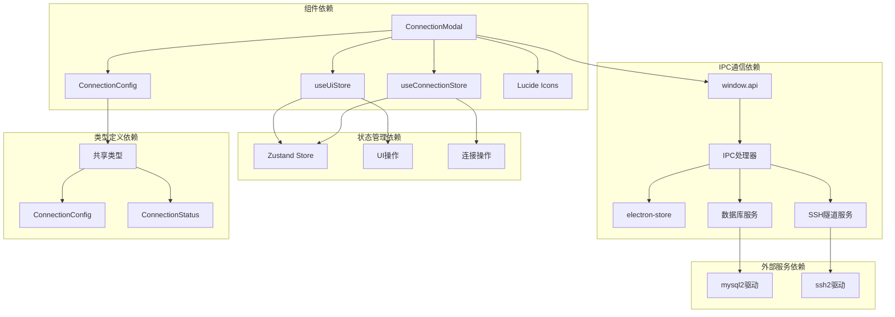

**图表来源**
- [ConnectionModal.tsx:1-6](file://src/renderer/src/components/ConnectionModal.tsx#L1-L6)
- [preload/index.ts:14-99](file://src/preload/index.ts#L14-L99)

### 外部依赖分析

组件依赖于多个外部库和服务：

#### React生态系统
- **React 18**: 核心框架，提供组件生命周期管理
- **Zustand**: 轻量级状态管理库，替代Redux
- **Lucide React**: 图标库，提供统一的视觉元素

#### Electron集成
- **Electron Store**: 本地配置存储解决方案
- **IPC通信**: 安全的进程间通信机制

#### 数据库连接
- **mysql2**: MySQL数据库驱动程序，支持Promise
- **ssh2**: SSH隧道连接库
- **加密功能**: 密码加密存储

**章节来源**
- [preload/index.ts:1-99](file://src/preload/index.ts#L1-L99)
- [db.ts:1-778](file://src/main/services/db.ts#L1-L778)

## 性能考虑

连接弹窗组件在设计时充分考虑了性能优化：

### 状态更新优化

组件采用了细粒度的状态管理策略：

- **独立状态钩子**: 将不同类型的用户交互分离到独立的状态中
- **条件渲染**: 仅在需要时重新渲染特定部分
- **防抖处理**: 对频繁的状态更新进行节流

### 内存管理

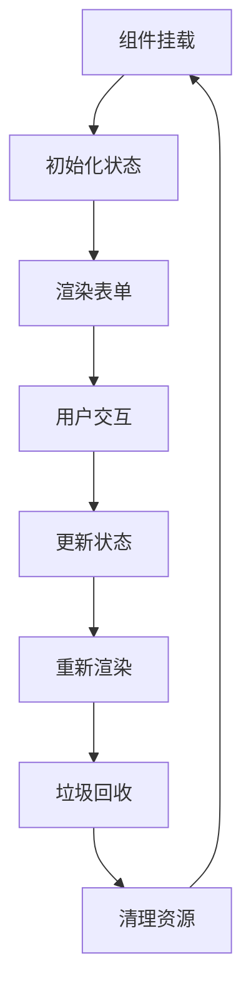

### 并发处理

组件支持并发的用户操作：

- **异步操作**: 所有网络操作都是异步的
- **状态锁定**: 在操作进行时禁用相关按钮
- **错误隔离**: 单个操作失败不影响其他操作

## 故障排除指南

### 常见问题和解决方案

#### 连接测试失败

**症状**: 点击"测试连接"后显示连接失败

**可能原因**:
1. 主机地址或端口配置错误
2. 用户名或密码不正确
3. 数据库服务未启动
4. 网络连接问题
5. SSH隧道配置错误
6. SSL证书验证失败

**解决步骤**:
1. 验证主机地址格式
2. 检查端口连通性
3. 确认数据库服务状态
4. 测试基本网络连接
5. 检查SSH隧道配置（主机、端口、认证方式）
6. 验证SSL证书设置

#### SSH隧道连接失败

**症状**: SSH隧道连接建立失败

**可能原因**:
1. SSH主机地址或端口错误
2. SSH认证凭据错误
3. SSH服务器不可达
4. 私钥文件路径错误
5. 端口转发配置冲突

**解决步骤**:
1. 验证SSH主机可达性
2. 检查SSH端口连通性
3. 确认SSH认证方式（密码或私钥）
4. 验证私钥文件路径和权限
5. 检查本地端口占用情况

#### SSL连接失败

**症状**: SSL连接建立失败

**可能原因**:
1. SSL证书验证失败
2. SSL协议版本不兼容
3. 网络防火墙阻止
4. 服务器SSL配置错误

**解决步骤**:
1. 检查SSL证书有效性
2. 验证SSL协议版本
3. 确认网络防火墙设置
4. 测试服务器SSL配置

#### 保存操作失败

**症状**: 点击"保存"后没有反应或显示错误

**可能原因**:
1. 连接名称为空
2. 主机地址格式错误
3. 权限不足
4. 存储空间不足
5. 密码加密失败

**解决步骤**:
1. 填写完整的连接名称
2. 验证主机地址格式
3. 检查文件系统权限
4. 清理存储空间
5. 检查加密服务状态

#### 状态同步问题

**症状**: 弹窗显示状态与实际状态不一致

**解决步骤**:
1. 刷新页面
2. 检查浏览器控制台错误
3. 清除浏览器缓存
4. 重启应用程序

**章节来源**
- [ConnectionModal.tsx:180-198](file://src/renderer/src/components/ConnectionModal.tsx#L180-L198)
- [connection.ts:28-31](file://src/renderer/src/stores/connection.ts#L28-L31)

## 结论

连接弹窗组件是一个设计精良、功能完整的用户界面组件，它成功地将复杂的数据库连接配置过程简化为直观的图形化操作。组件采用了现代化的架构设计，结合了React Hooks、Zustand状态管理和Electron IPC通信等先进技术。

**更新** 组件现已支持高级连接管理功能，包括SSH隧道连接、SSL加密连接、连接分组管理和标签系统，为用户提供了更加灵活和安全的数据库连接管理体验。

### 主要优势

1. **用户体验优秀**: 直观的表单设计和即时反馈机制
2. **安全性强**: 完整的输入验证和错误处理
3. **扩展性强**: 模块化的架构便于功能扩展
4. **性能优异**: 优化的状态管理和内存使用
5. **连接管理增强**: 支持分组、标签、SSH隧道和SSL加密

### 技术亮点

- **响应式设计**: 支持动态状态更新和用户交互
- **类型安全**: 完整的TypeScript类型定义
- **错误处理**: 全面的异常捕获和用户友好的错误信息
- **异步操作**: 非阻塞的用户界面体验
- **SSH隧道支持**: 安全的远程数据库连接
- **SSL加密**: 保护数据传输安全
- **连接分组**: 组织和管理大量连接
- **标签系统**: 快速识别和筛选连接

### 改进建议

1. **国际化支持**: 添加多语言界面支持
2. **连接模板**: 提供常用数据库的连接模板
3. **导入导出**: 支持连接配置的批量导入导出
4. **连接历史**: 记录最近使用的连接配置
5. **连接监控**: 实时监控连接状态和性能
6. **连接共享**: 支持团队间的连接配置共享

连接弹窗组件为nexSql应用程序提供了坚实的基础，它不仅满足了当前的功能需求，还为未来的功能扩展奠定了良好的技术基础。新增的SSH隧道、SSL加密、连接分组和标签功能进一步提升了组件的专业性和实用性。