# 主内容区组件

<cite>
**本文档引用的文件**
- [MainContent.tsx](file://src/renderer/src/components/MainContent.tsx)
- [TabBar.tsx](file://src/renderer/src/components/TabBar.tsx)
- [QueryEditor.tsx](file://src/renderer/src/components/QueryEditor.tsx)
- [DataTable.tsx](file://src/renderer/src/components/DataTable.tsx)
- [TableDesign.tsx](file://src/renderer/src/components/TableDesign.tsx)
- [tab.ts](file://src/renderer/src/stores/tab.ts)
- [ui.ts](file://src/renderer/src/stores/ui.ts)
- [connection.ts](file://src/renderer/src/stores/connection.ts)
- [db.ts](file://src/main/services/db.ts)
- [types/index.ts](file://src/shared/types/index.ts)
- [App.tsx](file://src/renderer/src/App.tsx)
</cite>

## 目录
1. [简介](#简介)
2. [项目结构](#项目结构)
3. [核心组件](#核心组件)
4. [架构概览](#架构概览)
5. [详细组件分析](#详细组件分析)
6. [依赖关系分析](#依赖关系分析)
7. [性能考虑](#性能考虑)
8. [故障排除指南](#故障排除指南)
9. [结论](#结论)

## 简介

主内容区组件是 nexSql 应用程序的核心界面组件，负责管理数据库相关的操作界面。该组件实现了标签化的多页面管理，支持查询编辑器、数据表格展示和表设计视图三种不同的工作模式。通过精心设计的状态管理和组件间通信机制，为用户提供了一个高效、直观的数据库管理体验。

主内容区组件采用模块化设计，将复杂的数据库操作功能分解为独立的功能模块，每个模块都有明确的职责边界和清晰的接口定义。这种设计不仅提高了代码的可维护性，也为用户提供了灵活的操作方式。

## 项目结构

主内容区组件位于渲染进程的组件目录中，与状态管理、类型定义和业务服务层紧密协作。整体项目结构体现了清晰的分层架构：

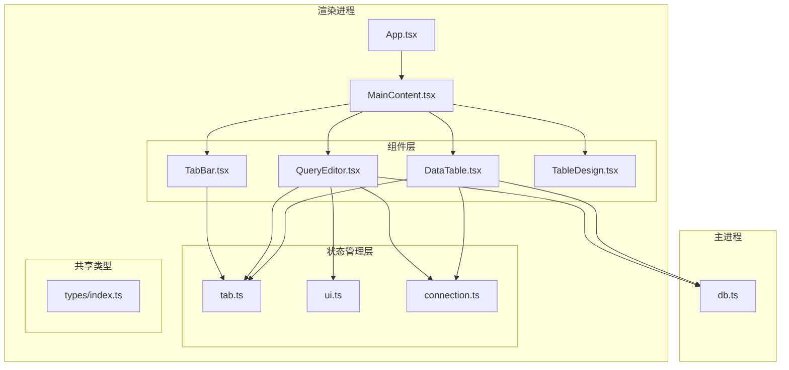

**图表来源**
- [App.tsx:15-32](file://src/renderer/src/App.tsx#L15-L32)
- [MainContent.tsx:1-33](file://src/renderer/src/components/MainContent.tsx#L1-L33)

**章节来源**
- [App.tsx:1-35](file://src/renderer/src/App.tsx#L1-L35)
- [MainContent.tsx:1-34](file://src/renderer/src/components/MainContent.tsx#L1-L34)

## 核心组件

主内容区组件系统由多个相互协作的组件构成，每个组件都承担着特定的功能职责：

### 组件层次结构

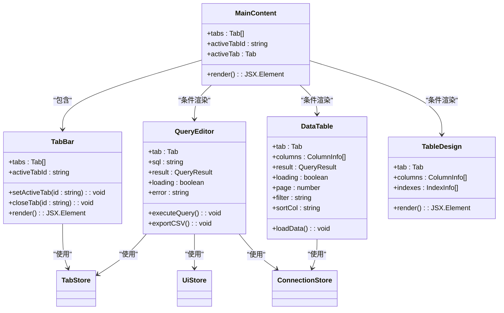

**图表来源**
- [MainContent.tsx:8-32](file://src/renderer/src/components/MainContent.tsx#L8-L32)
- [TabBar.tsx:5-52](file://src/renderer/src/components/TabBar.tsx#L5-L52)
- [QueryEditor.tsx:21-64](file://src/renderer/src/components/QueryEditor.tsx#L21-L64)
- [DataTable.tsx:27-83](file://src/renderer/src/components/DataTable.tsx#L27-L83)

### 核心功能特性

1. **标签化管理**: 支持多种类型的标签页（查询、数据表、表设计）
2. **动态内容渲染**: 根据活动标签自动切换对应的编辑器或视图
3. **状态持久化**: 使用 zustand 状态管理确保数据一致性
4. **响应式布局**: 支持窗口大小变化和内容区域自适应
5. **错误处理**: 完善的错误捕获和用户友好的错误提示

**章节来源**
- [MainContent.tsx:1-34](file://src/renderer/src/components/MainContent.tsx#L1-L34)
- [TabBar.tsx:1-53](file://src/renderer/src/components/TabBar.tsx#L1-L53)

## 架构概览

主内容区组件采用了基于状态驱动的架构模式，通过集中式状态管理实现组件间的解耦和数据同步。

### 整体架构流程

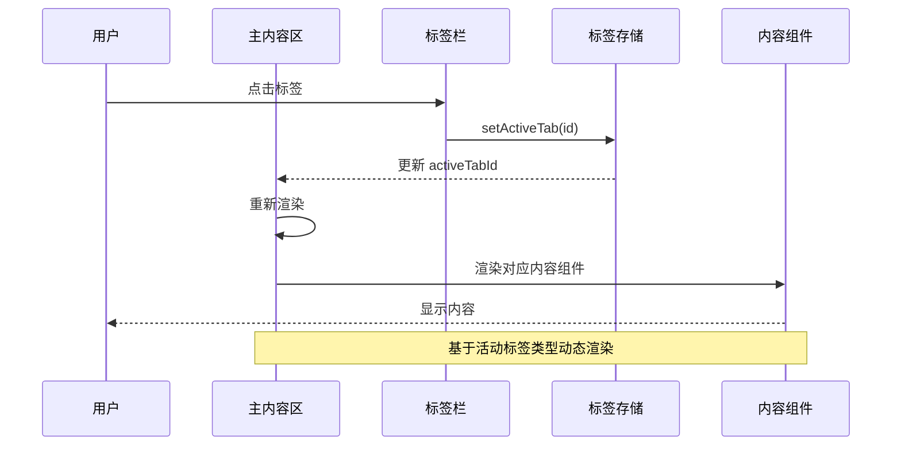

**图表来源**
- [MainContent.tsx:9-11](file://src/renderer/src/components/MainContent.tsx#L9-L11)
- [TabBar.tsx:28-28](file://src/renderer/src/components/TabBar.tsx#L28-L28)
- [tab.ts:53-53](file://src/renderer/src/stores/tab.ts#L53-L53)

### 数据流架构

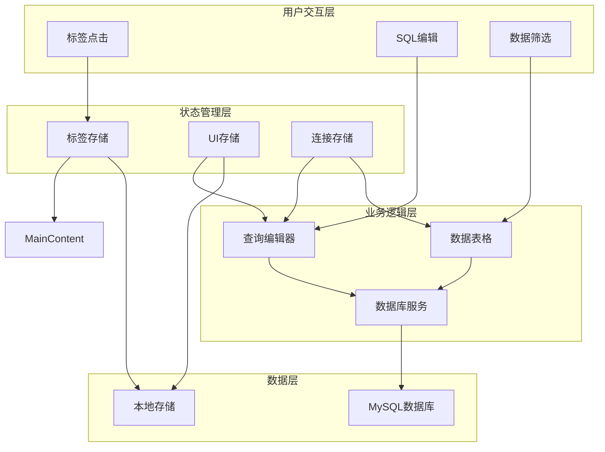

**图表来源**
- [tab.ts:15-64](file://src/renderer/src/stores/tab.ts#L15-L64)
- [ui.ts:26-40](file://src/renderer/src/stores/ui.ts#L26-L40)
- [connection.ts:17-63](file://src/renderer/src/stores/connection.ts#L17-L63)

## 详细组件分析

### 主内容区组件 (MainContent)

主内容区组件是整个应用的核心容器，负责协调各个子组件的工作。

#### 设计理念

主内容区组件采用了"容器-展示"分离的设计模式，将布局管理与具体功能实现解耦。组件本身不直接处理业务逻辑，而是通过状态管理器协调各子组件的工作。

#### 核心实现要点

1. **条件渲染策略**: 根据活动标签的类型动态渲染不同的内容组件
2. **空状态处理**: 当没有活动标签时显示引导信息
3. **布局管理**: 提供统一的容器布局，确保子组件正确显示

#### 关键状态管理

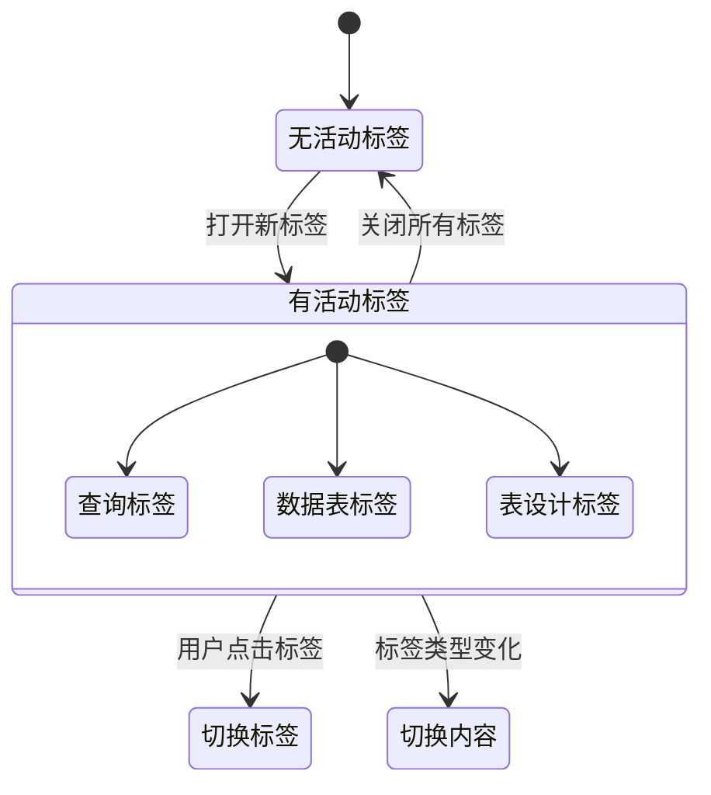

**图表来源**
- [MainContent.tsx:13-21](file://src/renderer/src/components/MainContent.tsx#L13-L21)
- [MainContent.tsx:27-29](file://src/renderer/src/components/MainContent.tsx#L27-L29)

**章节来源**
- [MainContent.tsx:1-34](file://src/renderer/src/components/MainContent.tsx#L1-L34)

### 标签栏组件 (TabBar)

标签栏组件提供了多标签页的导航和管理功能。

#### 标签类型识别

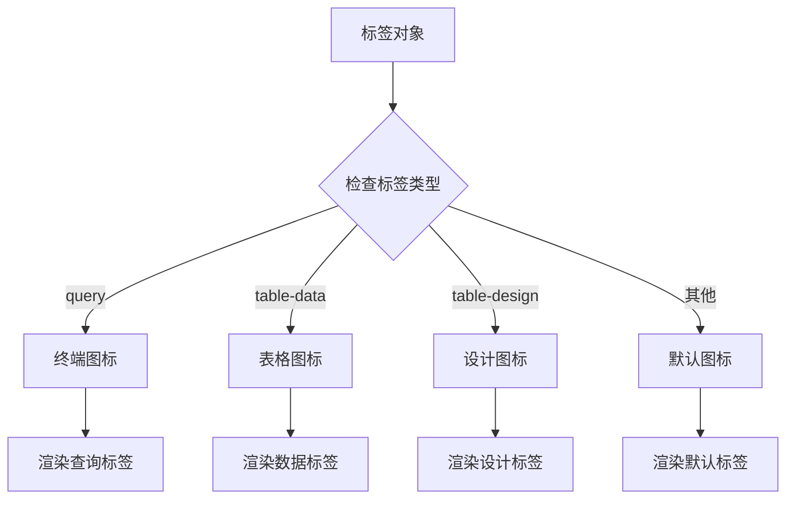

**图表来源**
- [TabBar.tsx:13-19](file://src/renderer/src/components/TabBar.tsx#L13-L19)

#### 交互行为

1. **标签切换**: 点击标签激活对应内容
2. **标签关闭**: 鼠标悬停显示关闭按钮
3. **状态指示**: 通过小圆点显示标签脏状态
4. **滚动支持**: 超出宽度时支持水平滚动

**章节来源**
- [TabBar.tsx:1-53](file://src/renderer/src/components/TabBar.tsx#L1-L53)

### 查询编辑器组件 (QueryEditor)

查询编辑器组件提供了完整的 SQL 编辑和执行环境。

#### 编辑器功能

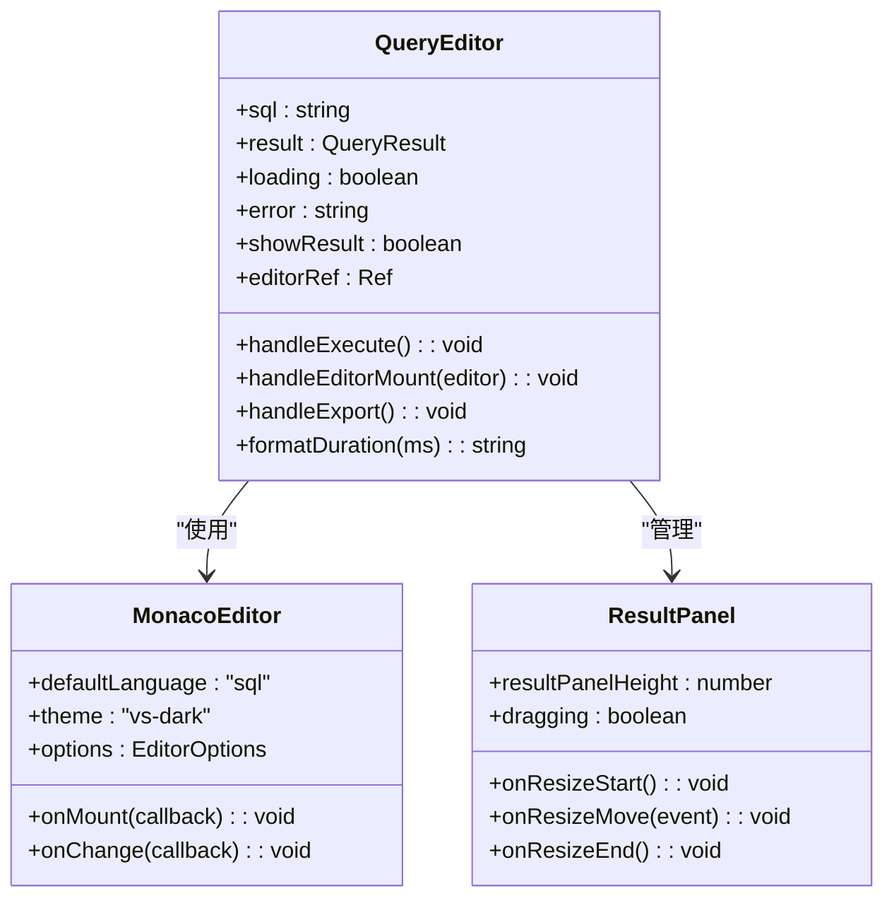

**图表来源**
- [QueryEditor.tsx:21-33](file://src/renderer/src/components/QueryEditor.tsx#L21-L33)
- [QueryEditor.tsx:171-194](file://src/renderer/src/components/QueryEditor.tsx#L171-L194)

#### 查询执行流程

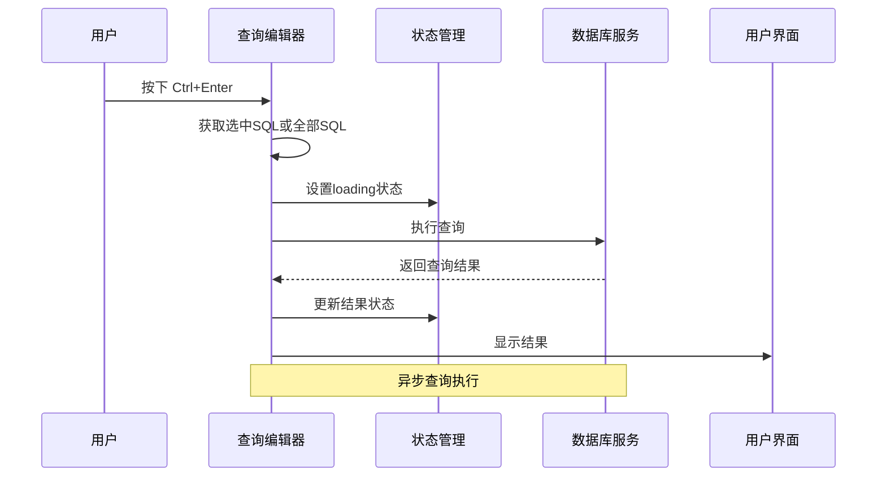

**图表来源**
- [QueryEditor.tsx:36-64](file://src/renderer/src/components/QueryEditor.tsx#L36-L64)
- [db.ts:73-135](file://src/main/services/db.ts#L73-L135)

#### 结果展示特性

1. **动态高度调整**: 支持拖拽调整结果面板高度
2. **CSV 导出**: 将查询结果导出为 CSV 文件
3. **错误处理**: 友好的错误信息展示
4. **性能统计**: 显示查询执行时间和影响行数

**章节来源**
- [QueryEditor.tsx:1-329](file://src/renderer/src/components/QueryEditor.tsx#L1-L329)

### 数据表格组件 (DataTable)

数据表格组件提供了高性能的数据浏览和筛选功能。

#### 分页和筛选机制

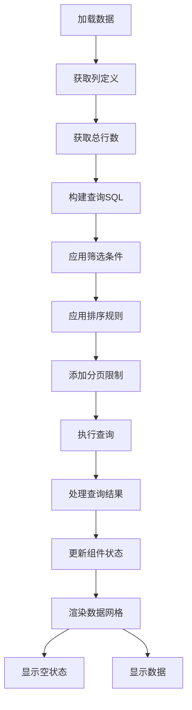

**图表来源**
- [DataTable.tsx:41-83](file://src/renderer/src/components/DataTable.tsx#L41-L83)

#### 性能优化策略

1. **分页加载**: 默认每页 100 行，避免大数据集一次性加载
2. **虚拟滚动**: 使用 react-data-grid 实现高效的表格渲染
3. **缓存机制**: 列定义和连接信息的缓存
4. **防抖处理**: 筛选输入的防抖优化

**章节来源**
- [DataTable.tsx:1-297](file://src/renderer/src/components/DataTable.tsx#L1-L297)

### 表设计组件 (TableDesign)

表设计组件提供了数据库表的可视化设计和管理功能。

#### 设计视图功能

表设计组件支持以下核心功能：
- 字段列表管理
- 索引定义查看
- 表结构信息展示
- 字段属性编辑

虽然具体的实现细节在当前分析范围内未完全展开，但该组件遵循与其它组件相同的架构模式，通过状态管理实现数据绑定和用户交互。

**章节来源**
- [TableDesign.tsx:109-128](file://src/renderer/src/components/TableDesign.tsx#L109-L128)

## 依赖关系分析

主内容区组件系统具有清晰的依赖层次结构，各组件之间的耦合度较低，便于维护和扩展。

### 组件依赖图

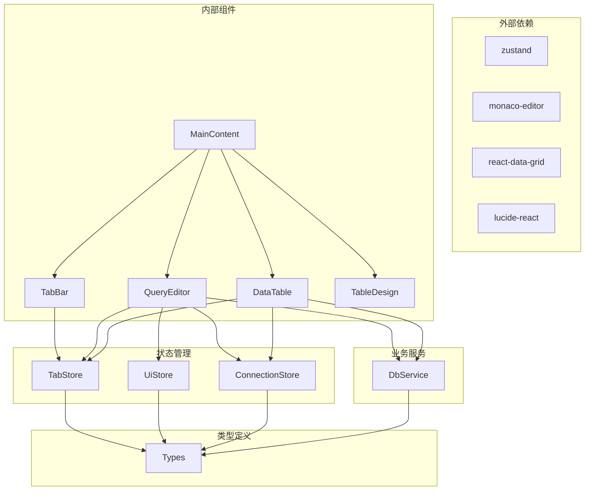

**图表来源**
- [MainContent.tsx:1-6](file://src/renderer/src/components/MainContent.tsx#L1-L6)
- [tab.ts:1-2](file://src/renderer/src/stores/tab.ts#L1-L2)
- [ui.ts:1-1](file://src/renderer/src/stores/ui.ts#L1-L1)
- [connection.ts:1-2](file://src/renderer/src/stores/connection.ts#L1-L2)

### 状态管理依赖

主内容区组件的状态管理采用 zustand 库，提供了轻量级但功能强大的状态管理解决方案。

#### 状态存储结构

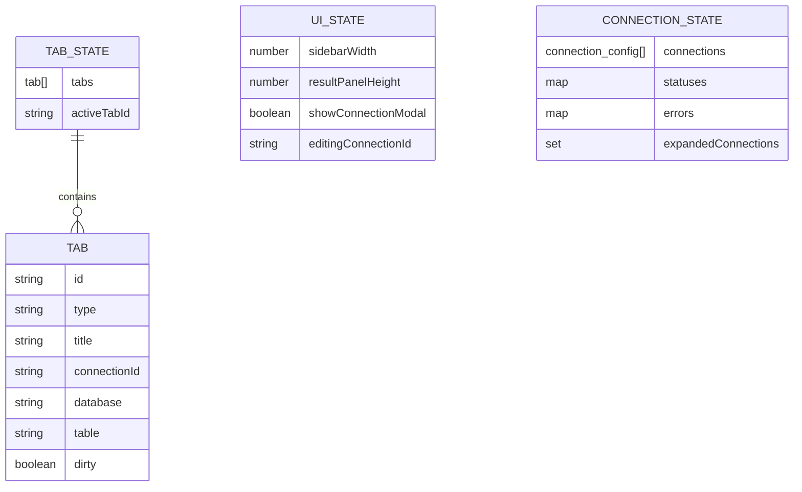

**图表来源**
- [tab.ts:4-13](file://src/renderer/src/stores/tab.ts#L4-L13)
- [ui.ts:3-15](file://src/renderer/src/stores/ui.ts#L3-L15)
- [connection.ts:4-15](file://src/renderer/src/stores/connection.ts#L4-L15)

**章节来源**
- [tab.ts:1-65](file://src/renderer/src/stores/tab.ts#L1-L65)
- [ui.ts:1-41](file://src/renderer/src/stores/ui.ts#L1-L41)
- [connection.ts:1-64](file://src/renderer/src/stores/connection.ts#L1-L64)

## 性能考虑

主内容区组件系统在设计时充分考虑了性能优化，特别是在处理大量数据和复杂交互场景下的表现。

### 性能优化策略

#### 1. 组件渲染优化

- **条件渲染**: 仅渲染当前活动标签对应的内容组件
- **状态隔离**: 各组件维护独立的状态，避免不必要的重渲染
- **引用缓存**: 使用 React 的引用缓存避免重复创建函数

#### 2. 数据加载优化

- **分页加载**: 数据表格默认每页 100 行，支持无限滚动
- **懒加载**: 编辑器按需加载，减少初始内存占用
- **缓存机制**: 连接配置和列定义的缓存

#### 3. 网络请求优化

- **连接池管理**: 主进程维护 MySQL 连接池，复用数据库连接
- **批量操作**: 支持批量查询和事务处理
- **超时控制**: 合理的查询超时设置

#### 4. UI 响应性优化

- **异步渲染**: 查询执行时不阻塞主线程
- **进度反馈**: 详细的加载状态和错误提示
- **键盘快捷键**: 支持 Ctrl+Enter 快速执行查询

### 性能监控指标

| 指标类别 | 目标值 | 测量方法 |
|---------|--------|----------|
| 查询响应时间 | < 2 秒 | 使用 performance.now() 计时 |
| 内存使用 | < 100MB | Chrome DevTools 监控 |
| 渲染帧率 | > 60 FPS | requestAnimationFrame 监控 |
| 数据加载延迟 | < 1 秒 | 分页加载时间统计 |

**章节来源**
- [QueryEditor.tsx:103-106](file://src/renderer/src/components/QueryEditor.tsx#L103-L106)
- [db.ts:78-135](file://src/main/services/db.ts#L78-L135)

## 故障排除指南

### 常见问题及解决方案

#### 1. 标签页无法切换

**症状**: 点击标签页无反应

**可能原因**:
- 状态管理器初始化失败
- 标签 ID 不匹配
- 组件渲染异常

**解决步骤**:
1. 检查标签存储的状态是否正确
2. 验证标签 ID 的唯一性和有效性
3. 查看控制台是否有错误信息

#### 2. 查询执行失败

**症状**: 点击执行按钮无响应或报错

**可能原因**:
- 数据库连接配置错误
- SQL 语法错误
- 网络连接中断

**解决步骤**:
1. 验证数据库连接配置
2. 检查 SQL 语法和权限
3. 确认网络连接状态

#### 3. 数据表格显示异常

**症状**: 表格空白或显示错误数据

**可能原因**:
- 分页参数错误
- 列定义不匹配
- 数据格式转换问题

**解决步骤**:
1. 检查分页参数和总行数
2. 验证列定义的完整性
3. 确认数据格式兼容性

#### 4. 性能问题

**症状**: 界面卡顿或响应缓慢

**可能原因**:
- 大数据集一次性加载
- 组件重渲染过多
- 内存泄漏

**解决步骤**:
1. 实施分页加载策略
2. 优化组件渲染逻辑
3. 检查内存使用情况

### 调试工具和技巧

#### 开发者工具使用

1. **React DevTools**: 检查组件树和状态变化
2. **Redux DevTools**: 监控状态管理器的变化
3. **Chrome DevTools**: 分析性能瓶颈和内存使用

#### 日志记录策略

```typescript
// 添加调试日志
console.log('标签切换:', { from, to });
console.log('查询执行:', { sql, duration });
console.log('数据加载:', { page, count, columns });
```

**章节来源**
- [QueryEditor.tsx:55-63](file://src/renderer/src/components/QueryEditor.tsx#L55-L63)
- [DataTable.tsx:78-82](file://src/renderer/src/components/DataTable.tsx#L78-L82)

## 结论

主内容区组件系统展现了现代前端应用的良好实践，通过合理的架构设计和状态管理实现了高度的模块化和可维护性。

### 设计优势

1. **清晰的职责分离**: 每个组件都有明确的功能边界
2. **强大的状态管理**: 基于 zustand 的轻量级状态管理
3. **优秀的用户体验**: 响应式的界面和流畅的交互
4. **良好的性能表现**: 针对大数据集的优化策略
5. **完善的错误处理**: 用户友好的错误提示和恢复机制

### 技术亮点

- **模块化设计**: 组件间低耦合，易于测试和维护
- **类型安全**: 完整的 TypeScript 类型定义
- **异步处理**: 合理的异步操作和状态管理
- **性能优化**: 多层次的性能优化策略

### 未来改进方向

1. **增强的错误恢复**: 更智能的错误处理和自动重试机制
2. **更多数据库支持**: 扩展对其他数据库系统的支持
3. **高级查询功能**: 添加更复杂的查询构建器和分析工具
4. **协作功能**: 支持多用户协作和版本控制

主内容区组件系统为数据库管理应用提供了一个坚实的技术基础，其设计理念和实现方案值得在类似的复杂应用开发中借鉴和参考。