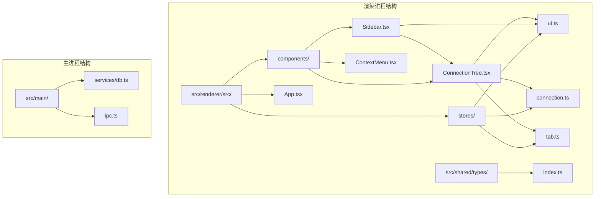
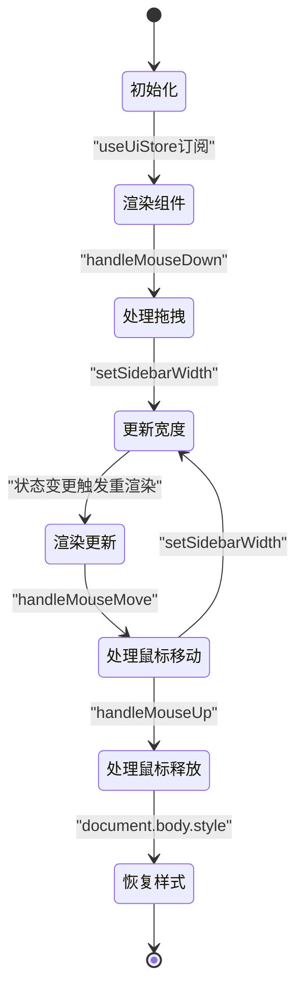
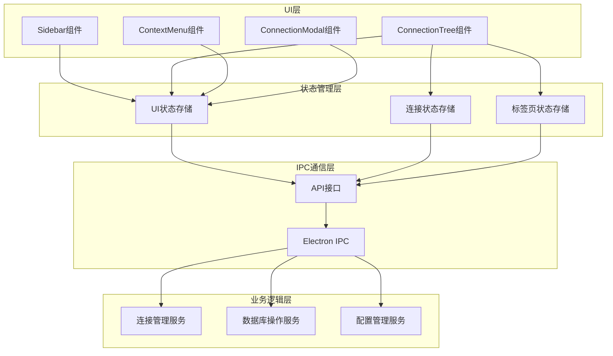
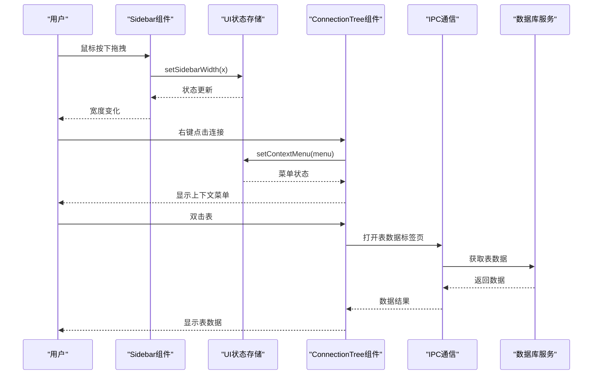
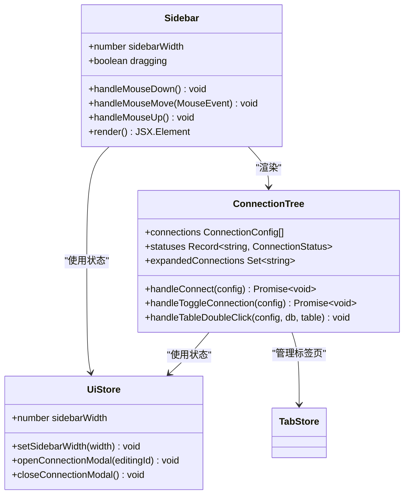
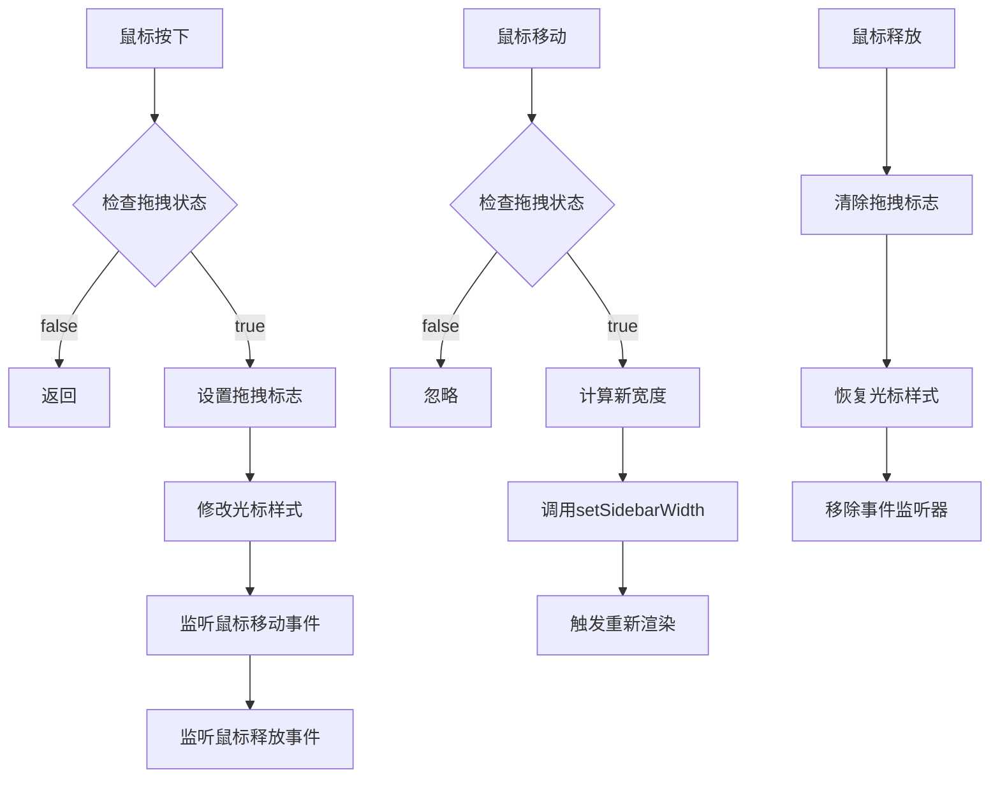
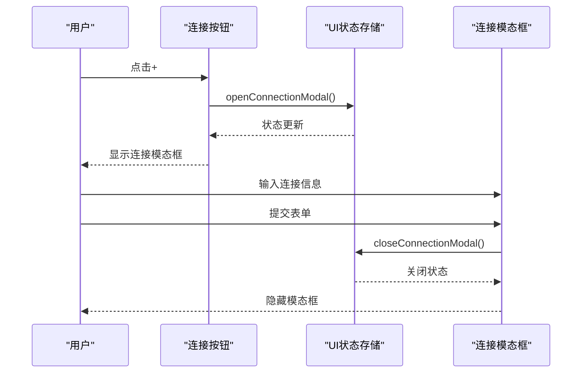
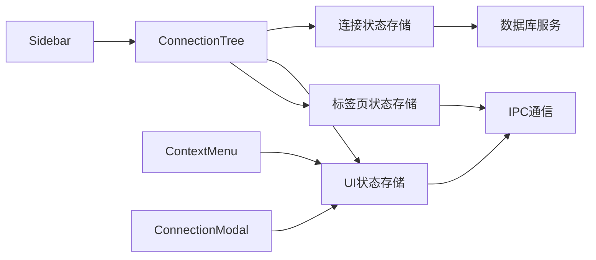
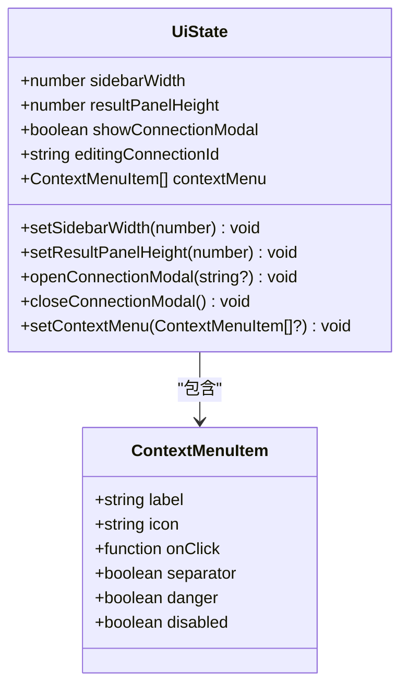
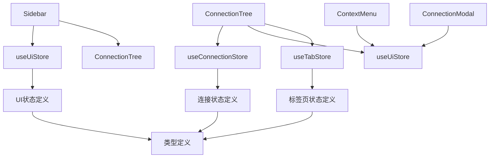

# 侧边栏组件

<cite>
**本文档引用的文件**
- [Sidebar.tsx](file://src/renderer/src/components/Sidebar.tsx)
- [ui.ts](file://src/renderer/src/stores/ui.ts)
- [ConnectionTree.tsx](file://src/renderer/src/components/ConnectionTree.tsx)
- [connection.ts](file://src/renderer/src/stores/connection.ts)
- [tab.ts](file://src/renderer/src/stores/tab.ts)
- [ContextMenu.tsx](file://src/renderer/src/components/ContextMenu.tsx)
- [index.ts](file://src/shared/types/index.ts)
- [App.tsx](file://src/renderer/src/App.tsx)
</cite>

## 目录
1. [简介](#简介)
2. [项目结构](#项目结构)
3. [核心组件](#核心组件)
4. [架构概览](#架构概览)
5. [详细组件分析](#详细组件分析)
6. [依赖关系分析](#依赖关系分析)
7. [性能考虑](#性能考虑)
8. [故障排除指南](#故障排除指南)
9. [结论](#结论)

## 简介

侧边栏组件是 nexSql 应用程序的核心界面组件之一，负责管理数据库连接的可视化展示和用户交互。该组件实现了拖拽调整宽度功能、连接管理按钮，以及与连接树组件的深度集成。通过使用 Zustand 状态管理库，侧边栏实现了响应式布局和流畅的用户体验。

## 项目结构

nexSql 采用现代化的前端架构，主要包含以下关键目录和文件：

**图表来源**
- [Sidebar.tsx:1-80](file://src/renderer/src/components/Sidebar.tsx#L1-L80)
- [ui.ts:1-41](file://src/renderer/src/stores/ui.ts#L1-L41)
- [ConnectionTree.tsx:1-313](file://src/renderer/src/components/ConnectionTree.tsx#L1-L313)

**章节来源**
- [Sidebar.tsx:1-80](file://src/renderer/src/components/Sidebar.tsx#L1-L80)
- [App.tsx:1-35](file://src/renderer/src/App.tsx#L1-L35)

## 核心组件

### 组件架构概述

侧边栏组件采用函数式组件设计，结合 React Hooks 实现复杂的状态管理和交互逻辑。组件的核心特性包括：

- **拖拽调整宽度**：通过鼠标事件实现动态宽度调整
- **连接管理**：提供连接创建、编辑、删除功能
- **树形结构展示**：层次化显示数据库连接和对象
- **上下文菜单**：右键操作支持丰富的功能选项

### 状态管理机制

组件使用 Zustand 状态管理库实现高效的状态共享：

**图表来源**
- [Sidebar.tsx:13-41](file://src/renderer/src/components/Sidebar.tsx#L13-L41)
- [ui.ts:26-40](file://src/renderer/src/stores/ui.ts#L26-L40)

**章节来源**
- [Sidebar.tsx:6-79](file://src/renderer/src/components/Sidebar.tsx#L6-L79)
- [ui.ts:3-40](file://src/renderer/src/stores/ui.ts#L3-L40)

## 架构概览

### 整体系统架构

**图表来源**
- [Sidebar.tsx:3-4](file://src/renderer/src/components/Sidebar.tsx#L3-L4)
- [ConnectionTree.tsx:17-19](file://src/renderer/src/components/ConnectionTree.tsx#L17-L19)
- [ui.ts:26-40](file://src/renderer/src/stores/ui.ts#L26-L40)

### 数据流架构

**图表来源**
- [Sidebar.tsx:13-41](file://src/renderer/src/components/Sidebar.tsx#L13-L41)
- [ConnectionTree.tsx:100-125](file://src/renderer/src/components/ConnectionTree.tsx#L100-L125)

**章节来源**
- [App.tsx:8-32](file://src/renderer/src/App.tsx#L8-L32)
- [Sidebar.tsx:43-78](file://src/renderer/src/components/Sidebar.tsx#L43-L78)

## 详细组件分析

### Sidebar 组件详细分析

#### 组件结构和职责

Sidebar 组件是一个复合组件，承担着以下核心职责：

1. **宽度管理**：通过拖拽事件动态调整侧边栏宽度
2. **连接管理**：提供连接创建和管理功能
3. **布局控制**：组织侧边栏内部的各个子组件
4. **事件处理**：处理全局鼠标事件和用户交互

#### 状态管理实现

**图表来源**
- [Sidebar.tsx:6-79](file://src/renderer/src/components/Sidebar.tsx#L6-L79)
- [ui.ts:26-40](file://src/renderer/src/stores/ui.ts#L26-L40)
- [ConnectionTree.tsx:32-36](file://src/renderer/src/components/ConnectionTree.tsx#L32-L36)

#### 拖拽调整宽度功能

拖拽功能通过以下机制实现：

1. **鼠标按下事件**：设置拖拽标志位并修改全局光标样式
2. **鼠标移动事件**：在拖拽过程中实时更新侧边栏宽度
3. **鼠标释放事件**：清理拖拽状态并恢复默认样式

**图表来源**
- [Sidebar.tsx:13-41](file://src/renderer/src/components/Sidebar.tsx#L13-L41)

#### 连接管理按钮实现

连接管理按钮提供了完整的连接生命周期管理：

**图表来源**
- [Sidebar.tsx:56-62](file://src/renderer/src/components/Sidebar.tsx#L56-L62)
- [ui.ts:35-38](file://src/renderer/src/stores/ui.ts#L35-L38)

**章节来源**
- [Sidebar.tsx:6-79](file://src/renderer/src/components/Sidebar.tsx#L6-L79)

### ConnectionTree 组件集成

#### 组件关系和交互

ConnectionTree 组件与 Sidebar 组件形成了紧密的协作关系：

**图表来源**
- [ConnectionTree.tsx:17-19](file://src/renderer/src/components/ConnectionTree.tsx#L17-L19)
- [ui.ts:26-40](file://src/renderer/src/stores/ui.ts#L26-L40)

#### 上下文菜单集成

ConnectionTree 组件实现了丰富的上下文菜单功能：

| 功能 | 触发方式 | 操作 |
|------|----------|------|
| 连接切换 | 右键点击连接节点 | 连接或断开数据库连接 |
| 新建查询 | 右键点击连接节点 | 在新标签页中打开查询编辑器 |
| 编辑连接 | 右键点击连接节点 | 打开连接编辑模态框 |
| 删除连接 | 右键点击连接节点 | 从配置中删除连接 |
| 打开表数据 | 右键点击表节点 | 在新标签页中显示表数据 |
| 设计表 | 右键点击表节点 | 打开表设计界面 |
| 复制表名 | 右键点击表节点 | 将表名复制到剪贴板 |

**章节来源**
- [ConnectionTree.tsx:127-189](file://src/renderer/src/components/ConnectionTree.tsx#L127-L189)

### 状态管理接口详解

#### UI 状态接口定义

**图表来源**
- [ui.ts:3-24](file://src/renderer/src/stores/ui.ts#L3-L24)

#### 连接状态接口

连接状态存储管理着所有数据库连接的信息：

| 状态属性 | 类型 | 描述 |
|----------|------|------|
| connections | ConnectionConfig[] | 已保存的连接配置数组 |
| statuses | Record<string, ConnectionStatus> | 每个连接的当前状态映射 |
| errors | Record<string, string> | 连接错误信息映射 |
| expandedConnections | Set<string> | 展开的连接标识符集合 |

**章节来源**
- [ui.ts:26-40](file://src/renderer/src/stores/ui.ts#L26-L40)
- [connection.ts:4-15](file://src/renderer/src/stores/connection.ts#L4-L15)

## 依赖关系分析

### 组件间依赖关系

**图表来源**
- [Sidebar.tsx:3-4](file://src/renderer/src/components/Sidebar.tsx#L3-L4)
- [ConnectionTree.tsx:17-19](file://src/renderer/src/components/ConnectionTree.tsx#L17-L19)
- [ui.ts:26-40](file://src/renderer/src/stores/ui.ts#L26-L40)

### 外部依赖分析

组件依赖的主要外部库和模块：

| 依赖项 | 版本 | 用途 |
|--------|------|------|
| react | 最新版本 | 核心框架 |
| lucide-react | 最新版本 | 图标库 |
| zustand | 最新版本 | 状态管理 |
| electron | 最新版本 | 桌面应用框架 |
| @types/react | 最新版本 | TypeScript 类型定义 |

**章节来源**
- [Sidebar.tsx:1-3](file://src/renderer/src/components/Sidebar.tsx#L1-L3)
- [package.json](file://package.json)

## 性能考虑

### 优化策略

1. **事件处理优化**
   - 使用 useCallback 包装事件处理器，避免不必要的重渲染
   - 仅在必要时添加和移除全局事件监听器

2. **状态更新优化**
   - 使用局部状态管理减少全局状态更新频率
   - 合理使用状态选择器避免无关组件重渲染

3. **渲染性能优化**
   - 使用 React.memo 包装纯组件
   - 实现虚拟滚动处理大量数据

### 内存管理

组件实现了完善的内存管理机制：

- **事件监听器清理**：在组件卸载时自动移除所有事件监听器
- **缓存管理**：合理使用 nodeCache 存储数据库元数据
- **状态清理**：连接删除时清理相关状态和缓存

## 故障排除指南

### 常见问题及解决方案

#### 拖拽功能失效

**问题描述**：侧边栏无法通过拖拽调整宽度

**可能原因**：
1. 全局事件监听器未正确绑定
2. 拖拽状态管理异常
3. 样式冲突导致事件捕获失败

**解决方案**：
1. 检查 handleMouseDown 函数是否正确设置 dragging 标志
2. 验证全局 mousemove 和 mouseup 事件监听器
3. 确认 document.body 样式修改的正确性

#### 连接管理功能异常

**问题描述**：连接创建或编辑功能无法正常工作

**可能原因**：
1. IPC 通信失败
2. 状态更新逻辑错误
3. 模态框状态管理异常

**解决方案**：
1. 检查 window.api.db.connect 方法的实现
2. 验证 useConnectionStore 的状态更新逻辑
3. 确认 ConnectionModal 的状态同步

#### 上下文菜单显示问题

**问题描述**：右键菜单无法正确显示或位置异常

**可能原因**：
1. 菜单坐标计算错误
2. 窗口边界检测逻辑问题
3. 事件冒泡处理不当

**解决方案**：
1. 检查 ContextMenu 组件的位置计算逻辑
2. 验证窗口尺寸边界检测
3. 确认事件处理的 preventDefault 和 stopPropagation 调用

**章节来源**
- [Sidebar.tsx:13-41](file://src/renderer/src/components/Sidebar.tsx#L13-L41)
- [ContextMenu.tsx:38-48](file://src/renderer/src/components/ContextMenu.tsx#L38-L48)

## 结论

侧边栏组件作为 nexSql 应用的核心界面组件，展现了现代前端开发的最佳实践。通过精心设计的状态管理、事件处理和组件集成，实现了流畅的用户体验和良好的可维护性。

### 主要优势

1. **模块化设计**：清晰的组件分离和职责划分
2. **状态管理**：高效的 Zustand 状态管理模式
3. **用户体验**：直观的拖拽交互和响应式设计
4. **扩展性**：良好的架构支持功能扩展和定制

### 技术亮点

- **拖拽调整宽度**：实现了平滑的宽度调整体验
- **上下文菜单**：提供了丰富的右键操作功能
- **状态同步**：确保各组件间的状态一致性
- **性能优化**：合理的事件处理和状态管理策略

该组件为整个应用程序奠定了坚实的基础，为后续的功能扩展和性能优化提供了良好的架构支撑。