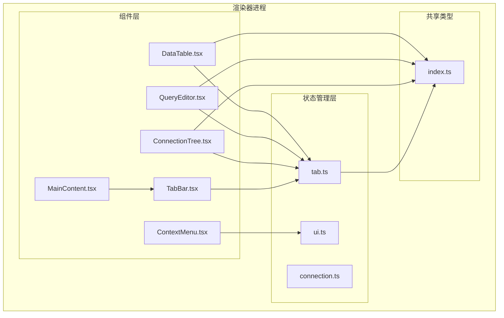
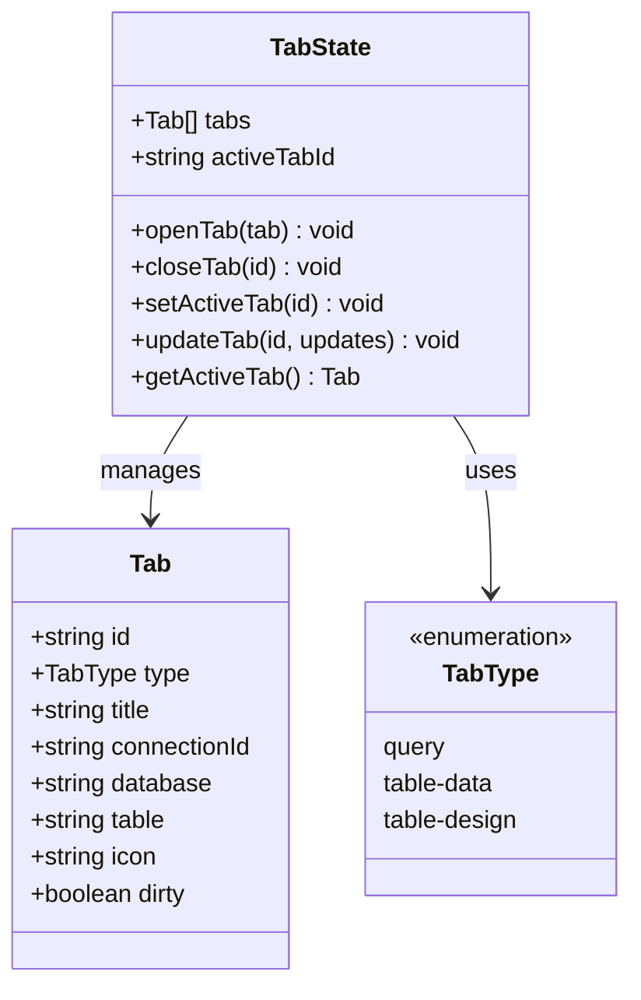
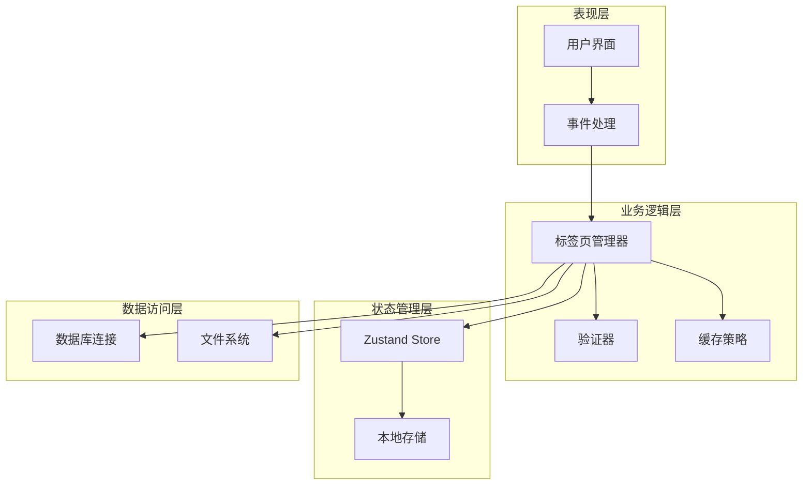
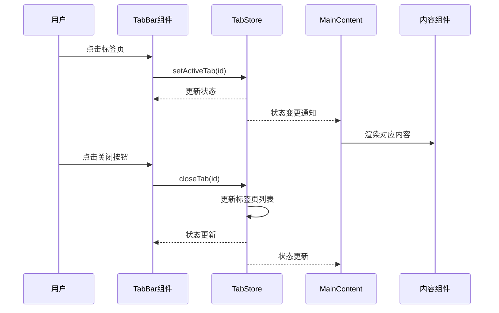
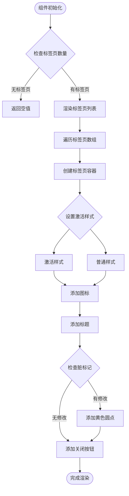
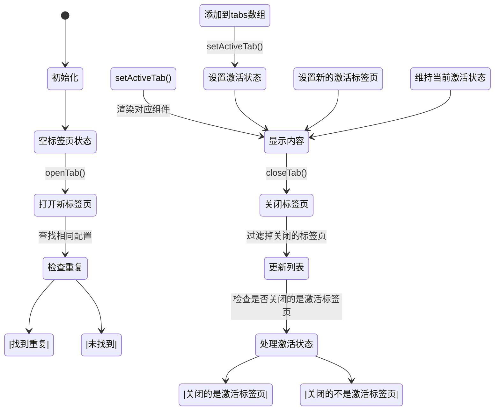
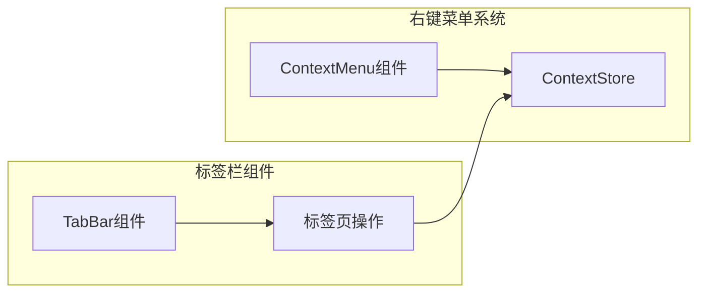
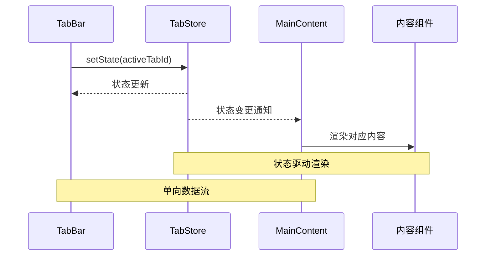
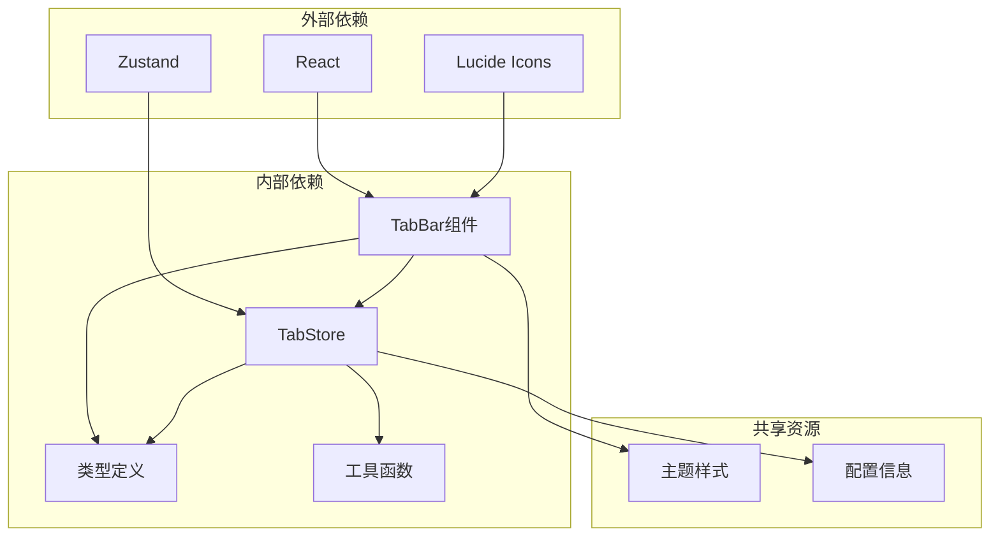

# 标签栏组件

<cite>
**本文档引用的文件**
- [TabBar.tsx](file://src/renderer/src/components/TabBar.tsx)
- [tab.ts](file://src/renderer/src/stores/tab.ts)
- [types/index.ts](file://src/shared/types/index.ts)
- [MainContent.tsx](file://src/renderer/src/components/MainContent.tsx)
- [ConnectionTree.tsx](file://src/renderer/src/components/ConnectionTree.tsx)
- [ContextMenu.tsx](file://src/renderer/src/components/ContextMenu.tsx)
- [ui.ts](file://src/renderer/src/stores/ui.ts)
- [QueryEditor.tsx](file://src/renderer/src/components/QueryEditor.tsx)
- [DataTable.tsx](file://src/renderer/src/components/DataTable.tsx)
</cite>

## 目录
1. [简介](#简介)
2. [项目结构](#项目结构)
3. [核心组件](#核心组件)
4. [架构概览](#架构概览)
5. [详细组件分析](#详细组件分析)
6. [依赖关系分析](#依赖关系分析)
7. [性能考虑](#性能考虑)
8. [故障排除指南](#故障排除指南)
9. [结论](#结论)

## 简介

标签栏组件是 nexSql 应用程序中的核心界面元素，负责管理用户在应用程序中打开的各种工作标签页。该组件实现了完整的标签页生命周期管理，包括标签页的创建、切换、关闭等功能，并提供了直观的用户交互体验。

标签栏组件支持三种不同类型的标签页：
- **查询标签页**：用于编写和执行 SQL 查询
- **表数据标签页**：用于查看和编辑数据库表的数据
- **表设计标签页**：用于设计和管理数据库表结构

## 项目结构

标签栏组件位于渲染器进程的组件目录中，采用模块化设计，与其他组件协同工作形成完整的应用界面。

**图表来源**
- [TabBar.tsx:1-53](file://src/renderer/src/components/TabBar.tsx#L1-L53)
- [tab.ts:1-65](file://src/renderer/src/stores/tab.ts#L1-L65)
- [types/index.ts:110-124](file://src/shared/types/index.ts#L110-L124)

**章节来源**
- [TabBar.tsx:1-53](file://src/renderer/src/components/TabBar.tsx#L1-L53)
- [tab.ts:1-65](file://src/renderer/src/stores/tab.ts#L1-L65)
- [types/index.ts:110-124](file://src/shared/types/index.ts#L110-L124)

## 核心组件

### TabBar 组件

TabBar 是标签栏的核心组件，负责渲染所有活动的标签页并处理用户交互。

#### 主要功能特性

1. **标签页渲染**：动态渲染所有打开的标签页
2. **标签页切换**：通过点击切换当前激活的标签页
3. **标签页关闭**：提供关闭按钮关闭特定标签页
4. **视觉反馈**：根据标签页状态提供不同的视觉样式
5. **图标标识**：为不同类型标签页显示相应的图标

#### 组件属性和方法

- `tabs`: 当前所有标签页的数组
- `activeTabId`: 当前激活标签页的 ID
- `setActiveTab`: 设置当前激活标签页的方法
- `closeTab`: 关闭指定标签页的方法

**章节来源**
- [TabBar.tsx:5-52](file://src/renderer/src/components/TabBar.tsx#L5-L52)

### TabStore 状态管理

TabStore 使用 Zustand 状态管理库实现标签页的状态管理，提供完整的 CRUD 操作和状态同步。

#### 状态结构

**图表来源**
- [tab.ts:4-13](file://src/renderer/src/stores/tab.ts#L4-L13)
- [types/index.ts:112-123](file://src/shared/types/index.ts#L112-L123)

#### 核心操作方法

1. **openTab**: 创建新标签页或激活现有标签页
2. **closeTab**: 关闭指定标签页并处理激活状态切换
3. **setActiveTab**: 设置当前激活的标签页
4. **updateTab**: 更新标签页属性
5. **getActiveTab**: 获取当前激活的标签页

**章节来源**
- [tab.ts:15-64](file://src/renderer/src/stores/tab.ts#L15-L64)

### Tab 类型定义

标签页类型定义了标签页的基本结构和属性，确保类型安全和代码可维护性。

#### Tab 接口属性

| 属性名 | 类型 | 必需 | 描述 |
|--------|------|------|------|
| id | string | 是 | 标签页唯一标识符 |
| type | TabType | 是 | 标签页类型（query/table-data/table-design） |
| title | string | 是 | 标签页显示标题 |
| connectionId | string | 是 | 关联的数据库连接 ID |
| database | string | 否 | 数据库名称 |
| table | string | 否 | 表名称 |
| icon | string | 否 | 自定义图标路径 |
| dirty | boolean | 否 | 是否标记为已修改 |

**章节来源**
- [types/index.ts:114-123](file://src/shared/types/index.ts#L114-L123)

## 架构概览

标签栏组件采用分层架构设计，各层职责明确，耦合度低，便于维护和扩展。

**图表来源**
- [TabBar.tsx:21-51](file://src/renderer/src/components/TabBar.tsx#L21-L51)
- [tab.ts:19-51](file://src/renderer/src/stores/tab.ts#L19-L51)

### 数据流架构

标签栏组件的数据流遵循单向数据流原则，确保状态的一致性和可预测性。

**图表来源**
- [TabBar.tsx:26-46](file://src/renderer/src/components/TabBar.tsx#L26-L46)
- [tab.ts:36-51](file://src/renderer/src/stores/tab.ts#L36-L51)

## 详细组件分析

### TabBar 组件实现详解

TabBar 组件实现了完整的标签页展示和交互功能，具有以下特点：

#### 视觉设计

组件采用现代化的标签页设计，支持悬停效果、激活状态高亮和渐变过渡动画。

**图表来源**
- [TabBar.tsx:21-51](file://src/renderer/src/components/TabBar.tsx#L21-L51)

#### 交互处理

组件实现了多种用户交互模式：

1. **标签页切换**：点击任意标签页激活对应内容
2. **标签页关闭**：悬停时显示关闭按钮，点击关闭特定标签页
3. **图标识别**：根据标签页类型显示相应图标
4. **状态指示**：通过小圆点显示标签页的修改状态

**章节来源**
- [TabBar.tsx:13-19](file://src/renderer/src/components/TabBar.tsx#L13-L19)
- [TabBar.tsx:38-46](file://src/renderer/src/components/TabBar.tsx#L38-L46)

### 标签页状态管理机制

标签页状态管理是整个组件的核心，涉及多个层面的状态同步和一致性保证。

#### 状态同步流程

**图表来源**
- [tab.ts:19-51](file://src/renderer/src/stores/tab.ts#L19-L51)

#### 标签页生命周期管理

标签页的生命周期包括创建、激活、使用和销毁四个阶段：

1. **创建阶段**：调用 `openTab()` 方法创建新标签页
2. **激活阶段**：通过 `setActiveTab()` 设置当前激活状态
3. **使用阶段**：渲染对应的组件内容
4. **销毁阶段**：调用 `closeTab()` 关闭标签页

**章节来源**
- [tab.ts:19-58](file://src/renderer/src/stores/tab.ts#L19-L58)

### 标签页内容缓存机制

虽然标签栏组件本身不直接管理内容缓存，但通过状态管理实现了智能的缓存策略：

#### 缓存策略

1. **内存缓存**：标签页对象保存在内存中，避免重复创建
2. **状态缓存**：标签页的激活状态和属性变化实时同步
3. **渲染缓存**：React 的虚拟 DOM 机制自动处理渲染优化

#### 性能优化

- **条件渲染**：当没有标签页时返回空值，避免不必要的渲染
- **受控组件**：使用受控组件模式确保状态一致性
- **事件冒泡控制**：阻止事件冒泡防止意外触发

**章节来源**
- [TabBar.tsx:11](file://src/renderer/src/components/TabBar.tsx#L11)
- [TabBar.tsx:39-41](file://src/renderer/src/components/TabBar.tsx#L39-L41)

### 右键菜单功能集成

标签栏组件与右键菜单系统深度集成，提供丰富的上下文操作。

#### 菜单集成架构

**图表来源**
- [ContextMenu.tsx:4-34](file://src/renderer/src/components/ContextMenu.tsx#L4-L34)
- [ConnectionTree.tsx:159-189](file://src/renderer/src/components/ConnectionTree.tsx#L159-L189)

#### 菜单功能

右键菜单为标签页提供了以下操作：
- **关闭标签页**：关闭当前标签页
- **关闭其他标签页**：关闭除当前标签页外的所有标签页
- **关闭所有标签页**：关闭所有标签页
- **刷新标签页**：重新加载标签页内容

**章节来源**
- [ContextMenu.tsx:36-78](file://src/renderer/src/components/ContextMenu.tsx#L36-L78)

### 与主内容区的数据同步机制

标签栏组件与主内容区通过状态管理实现无缝的数据同步。

#### 同步机制

**图表来源**
- [MainContent.tsx:8-32](file://src/renderer/src/components/MainContent.tsx#L8-L32)
- [tab.ts:53](file://src/renderer/src/stores/tab.ts#L53)

#### 数据同步特点

1. **单向数据流**：状态只从 TabStore 流向各个组件
2. **响应式更新**：状态变化自动触发组件重新渲染
3. **组件解耦**：各组件通过状态管理进行松耦合通信

**章节来源**
- [MainContent.tsx:9-11](file://src/renderer/src/components/MainContent.tsx#L9-L11)
- [tab.ts:6](file://src/renderer/src/stores/tab.ts#L6)

## 依赖关系分析

标签栏组件的依赖关系清晰明确，遵循单一职责原则和依赖倒置原则。

**图表来源**
- [TabBar.tsx:1](file://src/renderer/src/components/TabBar.tsx#L1)
- [tab.ts:1](file://src/renderer/src/stores/tab.ts#L1)
- [types/index.ts:110](file://src/shared/types/index.ts#L110)

### 组件间依赖关系

| 组件 | 依赖组件 | 依赖类型 | 用途 |
|------|----------|----------|------|
| TabBar | TabStore | 状态依赖 | 获取标签页状态和操作方法 |
| TabBar | Types | 类型依赖 | 使用 Tab 和 TabType 类型 |
| MainContent | TabBar | 组件依赖 | 渲染标签栏 |
| MainContent | TabStore | 状态依赖 | 获取当前激活标签页 |
| ConnectionTree | TabStore | 状态依赖 | 创建新标签页 |
| ConnectionTree | UiStore | 状态依赖 | 显示右键菜单 |

**章节来源**
- [TabBar.tsx:2](file://src/renderer/src/components/TabBar.tsx#L2)
- [MainContent.tsx:1](file://src/renderer/src/components/MainContent.tsx#L1)
- [ConnectionTree.tsx:19](file://src/renderer/src/components/ConnectionTree.tsx#L19)

### 外部依赖分析

#### React 生态系统

- **React Hooks**：使用 useState、useEffect、useCallback 等 hooks
- **React Refs**：使用 useRef 处理 DOM 引用
- **React Context**：通过 Zustand 替代 Context 实现状态共享

#### 第三方库

- **Zustand**：轻量级状态管理库，替代 Redux
- **Lucide Icons**：SVG 图标库，提供统一的图标风格
- **Monaco Editor**：SQL 编辑器（在 QueryEditor 中使用）

**章节来源**
- [tab.ts:1](file://src/renderer/src/stores/tab.ts#L1)
- [TabBar.tsx:1](file://src/renderer/src/components/TabBar.tsx#L1)

## 性能考虑

标签栏组件在设计时充分考虑了性能优化，采用了多种策略确保良好的用户体验。

### 渲染性能优化

1. **条件渲染**：当没有标签页时直接返回空值，避免不必要的 DOM 元素创建
2. **受控组件**：使用受控组件模式减少不必要的重渲染
3. **事件处理优化**：使用 useCallback 包装事件处理器，避免函数重新创建

### 状态管理性能

1. **局部状态**：每个标签页的状态仅在需要时更新
2. **状态分离**：将标签页状态与 UI 状态分离，避免无关状态影响
3. **批量更新**：使用 Zustand 的批量更新机制提高性能

### 内存管理

1. **垃圾回收友好**：及时清理不再使用的标签页引用
2. **事件监听器管理**：在组件卸载时清理事件监听器
3. **缓存策略**：合理使用缓存避免重复计算

## 故障排除指南

### 常见问题及解决方案

#### 标签页无法切换

**问题描述**：点击标签页时无法切换到对应内容

**可能原因**：
1. TabStore 状态未正确更新
2. 事件处理器绑定错误
3. 标签页 ID 不匹配

**解决步骤**：
1. 检查 `setActiveTab` 方法调用
2. 验证标签页 ID 的唯一性
3. 确认事件处理器的正确绑定

#### 标签页关闭后页面空白

**问题描述**：关闭最后一个标签页后页面显示空白

**可能原因**：
1. 关闭逻辑未正确处理最后标签页的情况
2. 激活状态未正确重置

**解决步骤**：
1. 检查 `closeTab` 方法中的激活状态处理
2. 确认当没有标签页时的默认行为
3. 验证 `activeTabId` 的正确设置

#### 标签页重复创建

**问题描述**：多次点击相同操作创建重复的标签页

**可能原因**：
1. 重复检查逻辑失效
2. 标签页标识符生成问题

**解决步骤**：
1. 检查 `openTab` 方法中的重复检查逻辑
2. 验证标签页标识符的唯一性
3. 确认比较条件的完整性

**章节来源**
- [tab.ts:20-33](file://src/renderer/src/stores/tab.ts#L20-L33)
- [tab.ts:36-51](file://src/renderer/src/stores/tab.ts#L36-L51)

### 调试技巧

#### 状态监控

使用浏览器开发者工具的 React DevTools 监控状态变化：
1. 查看 TabStore 的状态树
2. 监控标签页数组的变化
3. 跟踪激活状态的切换

#### 日志调试

在关键位置添加日志输出：
1. 标签页创建时的日志
2. 标签页切换时的日志
3. 标签页关闭时的日志

## 结论

标签栏组件作为 nexSql 应用程序的核心界面元素，展现了优秀的软件架构设计和用户体验优化。通过采用现代前端技术栈和合理的架构设计，该组件实现了：

### 设计优势

1. **模块化设计**：清晰的组件边界和职责分离
2. **状态管理**：使用 Zustand 实现简洁高效的状态管理
3. **类型安全**：完整的 TypeScript 类型定义确保代码质量
4. **用户体验**：直观的交互设计和流畅的动画效果

### 技术亮点

1. **响应式设计**：支持标签页的动态创建、切换和关闭
2. **性能优化**：采用多种优化策略确保良好的性能表现
3. **可扩展性**：清晰的架构设计便于功能扩展和维护
4. **错误处理**：完善的错误处理机制提升系统稳定性

### 最佳实践建议

基于对标签栏组件的深入分析，提出以下最佳实践建议：

1. **状态管理**：继续使用 Zustand 进行状态管理，保持架构简洁
2. **类型安全**：坚持使用 TypeScript，确保类型安全
3. **性能监控**：定期监控组件性能，及时发现和解决性能问题
4. **用户体验**：持续优化交互设计，提升用户满意度
5. **代码维护**：保持代码的可读性和可维护性，定期重构和优化

标签栏组件为整个应用程序提供了稳定可靠的基础，其设计理念和实现方式值得在其他类似项目中借鉴和学习。