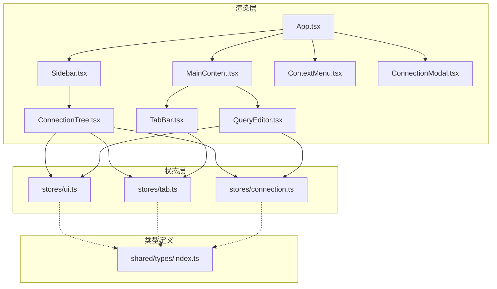
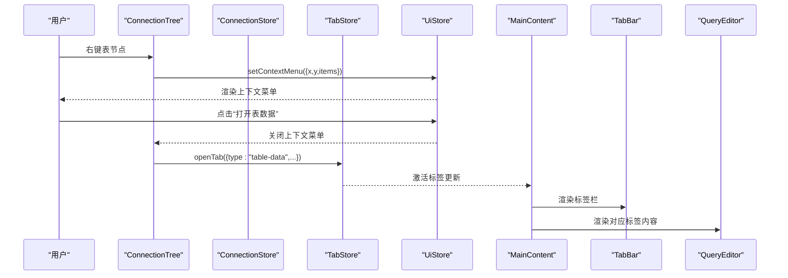
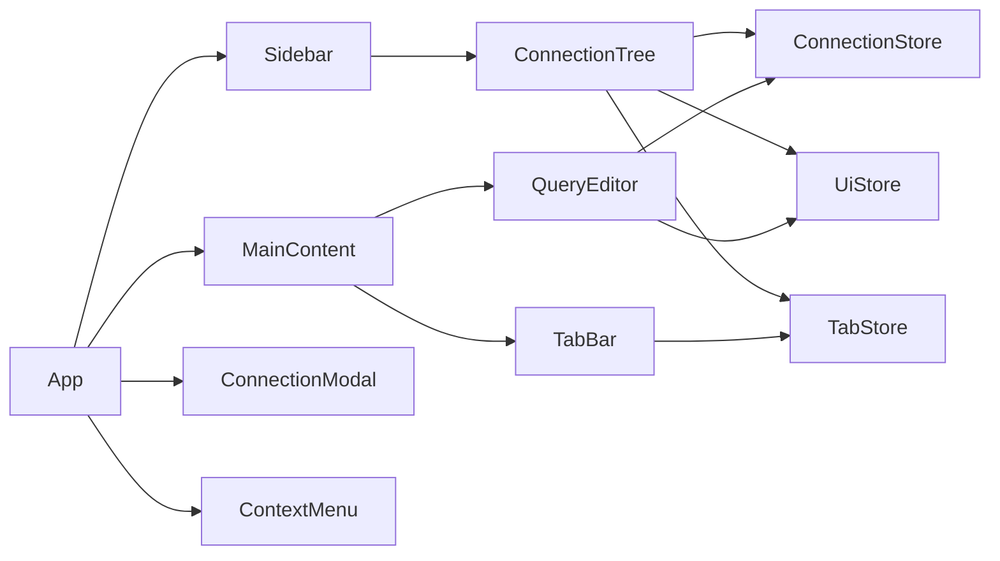

# 核心组件

<cite>
**本文引用的文件**
- [App.tsx](file://src/renderer/src/App.tsx)
- [Sidebar.tsx](file://src/renderer/src/components/Sidebar.tsx)
- [ConnectionTree.tsx](file://src/renderer/src/components/ConnectionTree.tsx)
- [MainContent.tsx](file://src/renderer/src/components/MainContent.tsx)
- [TabBar.tsx](file://src/renderer/src/components/TabBar.tsx)
- [QueryEditor.tsx](file://src/renderer/src/components/QueryEditor.tsx)
- [ContextMenu.tsx](file://src/renderer/src/components/ContextMenu.tsx)
- [ConnectionModal.tsx](file://src/renderer/src/components/ConnectionModal.tsx)
- [ui.ts](file://src/renderer/src/stores/ui.ts)
- [tab.ts](file://src/renderer/src/stores/tab.ts)
- [connection.ts](file://src/renderer/src/stores/connection.ts)
- [index.ts](file://src/shared/types/index.ts)
</cite>

## 目录
1. [简介](#简介)
2. [项目结构](#项目结构)
3. [核心组件](#核心组件)
4. [架构总览](#架构总览)
5. [组件详解](#组件详解)
6. [依赖关系分析](#依赖关系分析)
7. [性能考量](#性能考量)
8. [故障排查指南](#故障排查指南)
9. [结论](#结论)
10. [附录](#附录)

## 简介
本文件聚焦于组件系统的核心组件：侧边栏、主内容区与标签栏。我们将从设计理念、职责边界、props 接口、状态管理与事件处理机制入手，梳理组件间协作与数据传递方式，并给出最佳实践与常见问题解决方案。目标是帮助开发者快速理解并高效使用这些组件。

## 项目结构
应用采用 Electron + React 架构，渲染层位于 src/renderer，核心组件集中在 src/renderer/src/components，状态管理基于 Zustand，类型定义位于 src/shared/types。

图表来源
- [App.tsx:1-35](file://src/renderer/src/App.tsx#L1-L35)
- [Sidebar.tsx:1-80](file://src/renderer/src/components/Sidebar.tsx#L1-L80)
- [ConnectionTree.tsx:1-313](file://src/renderer/src/components/ConnectionTree.tsx#L1-L313)
- [MainContent.tsx:1-34](file://src/renderer/src/components/MainContent.tsx#L1-L34)
- [TabBar.tsx:1-53](file://src/renderer/src/components/TabBar.tsx#L1-L53)
- [QueryEditor.tsx:1-329](file://src/renderer/src/components/QueryEditor.tsx#L1-L329)
- [ContextMenu.tsx:1-79](file://src/renderer/src/components/ContextMenu.tsx#L1-L79)
- [ConnectionModal.tsx:1-231](file://src/renderer/src/components/ConnectionModal.tsx#L1-L231)
- [ui.ts:1-41](file://src/renderer/src/stores/ui.ts#L1-L41)
- [tab.ts:1-65](file://src/renderer/src/stores/tab.ts#L1-L65)
- [connection.ts:1-64](file://src/renderer/src/stores/connection.ts#L1-L64)
- [index.ts:1-124](file://src/shared/types/index.ts#L1-L124)

章节来源
- [App.tsx:1-35](file://src/renderer/src/App.tsx#L1-L35)

## 核心组件
- 侧边栏（Sidebar）：负责连接管理入口与宽度拖拽调整，承载连接树组件。
- 主内容区（MainContent）：根据当前激活标签动态渲染查询编辑器、数据表视图或表设计视图。
- 标签栏（TabBar）：展示并管理多标签页，支持切换、关闭与脏标记提示。
- 连接树（ConnectionTree）：连接、数据库、表的层级展开/折叠与上下文菜单交互。
- 上下文菜单（ContextMenu）：全局右键菜单，支持分隔线与危险项。
- 连接模态框（ConnectionModal）：连接配置的增删改查与连接测试。
- 状态存储（Zustand）：UI 状态（侧边栏宽度、结果面板高度、上下文菜单）、标签页状态、连接状态。

章节来源
- [Sidebar.tsx:1-80](file://src/renderer/src/components/Sidebar.tsx#L1-L80)
- [MainContent.tsx:1-34](file://src/renderer/src/components/MainContent.tsx#L1-L34)
- [TabBar.tsx:1-53](file://src/renderer/src/components/TabBar.tsx#L1-L53)
- [ConnectionTree.tsx:1-313](file://src/renderer/src/components/ConnectionTree.tsx#L1-L313)
- [ContextMenu.tsx:1-79](file://src/renderer/src/components/ContextMenu.tsx#L1-L79)
- [ConnectionModal.tsx:1-231](file://src/renderer/src/components/ConnectionModal.tsx#L1-L231)
- [ui.ts:1-41](file://src/renderer/src/stores/ui.ts#L1-L41)
- [tab.ts:1-65](file://src/renderer/src/stores/tab.ts#L1-L65)
- [connection.ts:1-64](file://src/renderer/src/stores/connection.ts#L1-L64)

## 架构总览
组件通过 Zustand Store 实现解耦的状态共享；UI Store 负责布局尺寸与弹窗控制；Tab Store 维护标签页集合与激活状态；Connection Store 管理连接配置、连接状态与展开状态。组件间通过 props 与回调进行数据传递，事件处理通过全局监听与局部回调结合。

图表来源
- [ConnectionTree.tsx:159-189](file://src/renderer/src/components/ConnectionTree.tsx#L159-L189)
- [tab.ts:19-34](file://src/renderer/src/stores/tab.ts#L19-L34)
- [MainContent.tsx:8-33](file://src/renderer/src/components/MainContent.tsx#L8-L33)
- [TabBar.tsx:5-52](file://src/renderer/src/components/TabBar.tsx#L5-L52)
- [ui.ts:35-39](file://src/renderer/src/stores/ui.ts#L35-L39)

## 组件详解

### 侧边栏（Sidebar）
- 设计理念
  - 提供连接管理入口与连接树展示，支持拖拽调整侧边栏宽度，保持界面布局灵活。
- 职责边界
  - 管理侧边栏宽度（读取/设置），触发连接模态框，承载连接树。
- Props 接口
  - 无外部 props，内部通过 useUiStore 读写 UI 状态。
- 状态管理
  - 使用 useUiStore 的 sidebarWidth、setSidebarWidth 控制宽度；openConnectionModal 触发模态框。
- 事件处理
  - 鼠标按下开启拖拽，全局监听 mousemove/mouseup 更新宽度；拖拽结束恢复样式。
- 协作与数据传递
  - 与 ConnectionTree、ConnectionModal、UiStore 协作；向 ConnectionTree 传递连接列表与状态。
- 最佳实践
  - 宽度限制在合理区间（最小/最大值），避免影响主内容区可读性。
- 常见问题
  - 拖拽失效：检查全局事件绑定是否正确移除；确保拖拽状态在 mouseup 时重置。

章节来源
- [Sidebar.tsx:1-80](file://src/renderer/src/components/Sidebar.tsx#L1-L80)
- [ui.ts:26-40](file://src/renderer/src/stores/ui.ts#L26-L40)

### 主内容区（MainContent）
- 设计理念
  - 动态路由式渲染：根据激活标签类型渲染不同内容组件，统一承载标签栏与内容区。
- 职责边界
  - 读取标签集合与激活标签，决定渲染 QueryEditor、DataTable 或 TableDesign。
- Props 接口
  - 无外部 props，内部通过 useTabStore 获取 tabs 与 activeTabId。
- 状态管理
  - 依赖 useTabStore 的 tabs、activeTabId；当无激活标签时显示引导占位。
- 事件处理
  - 由子组件（TabBar、各内容组件）触发状态变更，MainContent 仅负责渲染调度。
- 协作与数据传递
  - 与 TabBar、QueryEditor、DataTable、TableDesign 协作；通过 TabStore 传递标签状态。
- 最佳实践
  - 当无激活标签时提供清晰的引导信息；避免在空状态下渲染重型组件。
- 常见问题
  - 激活标签丢失：检查 TabStore 的 setActiveTab 与 closeTab 逻辑；确保关闭最后一个标签时 activeTabId 归零。

章节来源
- [MainContent.tsx:1-34](file://src/renderer/src/components/MainContent.tsx#L1-L34)
- [tab.ts:19-63](file://src/renderer/src/stores/tab.ts#L19-L63)

### 标签栏（TabBar）
- 设计理念
  - 多标签页导航与管理，支持图标区分、脏标记、关闭按钮与悬停显隐。
- 职责边界
  - 展示标签列表，处理标签切换与关闭，根据类型映射图标。
- Props 接口
  - 无外部 props，内部通过 useTabStore 获取 tabs、activeTabId、setActiveTab、closeTab。
- 状态管理
  - 依赖 useTabStore 的 tabs、activeTabId；通过 setActiveTab 切换激活标签；通过 closeTab 关闭指定标签。
- 事件处理
  - 点击标签切换；点击关闭按钮阻止冒泡并调用 closeTab。
- 协作与数据传递
  - 与 TabStore 协作；被 MainContent 渲染并作为内容区上层容器。
- 最佳实践
  - 为不同类型标签设置明确的图标与颜色；对长标题使用截断与 hover 提示。
- 常见问题
  - 关闭后无激活标签：确保 closeTab 在最后一条标签关闭时将 activeTabId 设为 null。

章节来源
- [TabBar.tsx:1-53](file://src/renderer/src/components/TabBar.tsx#L1-L53)
- [tab.ts:19-63](file://src/renderer/src/stores/tab.ts#L19-L63)

### 连接树（ConnectionTree）
- 设计理念
  - 层级化展示连接、数据库与表，支持展开/折叠、右键菜单、双击打开数据表、新建查询等操作。
- 职责边界
  - 管理连接状态与错误提示，维护节点缓存，触发标签页打开与上下文菜单。
- Props 接口
  - 无外部 props，内部通过 useConnectionStore、useUiStore、useTabStore 获取状态与动作。
- 状态管理
  - 使用 useConnectionStore 的 connections、statuses、errors、expandedConnections；使用 useUiStore 的 setContextMenu；使用 useTabStore 的 openTab。
- 事件处理
  - 连接节点点击切换连接状态；数据库节点点击切换展开；表节点双击打开数据表；右键菜单触发上下文操作。
- 协作与数据传递
  - 与 ConnectionStore、UiStore、TabStore 协作；通过 window.api.db 与 window.api.config 进行 IPC 通信。
- 最佳实践
  - 使用内存缓存 nodeCache 存储数据库与表列表，减少重复请求；右键菜单项按需分组与禁用。
- 常见问题
  - 展开状态错乱：检查 expandedConnections 的 Set 操作与 toggleExpand；确认 key 命名唯一性。

章节来源
- [ConnectionTree.tsx:1-313](file://src/renderer/src/components/ConnectionTree.tsx#L1-L313)
- [connection.ts:17-63](file://src/renderer/src/stores/connection.ts#L17-L63)
- [ui.ts:26-40](file://src/renderer/src/stores/ui.ts#L26-L40)
- [tab.ts:19-34](file://src/renderer/src/stores/tab.ts#L19-L34)

### 上下文菜单（ContextMenu）
- 设计理念
  - 全局右键菜单，自动计算位置避免溢出，支持点击外部与 ESC 关闭。
- 职责边界
  - 渲染菜单项，处理点击与关闭；不直接操作业务逻辑，仅触发回调。
- Props 接口
  - 无外部 props，内部通过 useUiStore 获取 contextMenu 并设置为 null。
- 状态管理
  - 使用 useUiStore 的 contextMenu；通过 setContextMenu 控制显示/隐藏。
- 事件处理
  - mousedown 检测点击外部；keydown 监听 ESC；菜单项点击后关闭菜单。
- 协作与数据传递
  - 与 ConnectionTree、ConnectionModal 等组件协作，接收由它们传入的菜单项。
- 最佳实践
  - 菜单项支持分隔线与危险项高亮；避免菜单过大导致溢出。
- 常见问题
  - 菜单无法关闭：检查 setContextMenu 的调用时机与事件监听移除。

章节来源
- [ContextMenu.tsx:1-79](file://src/renderer/src/components/ContextMenu.tsx#L1-L79)
- [ui.ts:26-40](file://src/renderer/src/stores/ui.ts#L26-L40)

### 连接模态框（ConnectionModal）
- 设计理念
  - 连接配置的增删改查与连接测试，支持颜色标签与表单校验。
- 职责边界
  - 管理连接表单状态，执行连接测试与保存，控制自身显示/隐藏。
- Props 接口
  - 无外部 props，内部通过 useUiStore 与 useConnectionStore 获取状态与动作。
- 状态管理
  - 使用 useUiStore 的 showConnectionModal、editingConnectionId、closeConnectionModal；使用 useConnectionStore 的 connections、saveConnection。
- 事件处理
  - 测试连接：调用 window.api.db.testConnection 并展示结果；保存连接：调用 window.api.config.saveConnection 并刷新列表。
- 协作与数据传递
  - 与 ConnectionStore、UiStore 协作；通过 window.api.db 与 window.api.config 进行 IPC 通信。
- 最佳实践
  - 表单字段必填校验与错误提示；测试与保存过程中的 Loading 状态反馈。
- 常见问题
  - 保存后未刷新：确保 saveConnection 后调用 loadConnections；编辑模式下正确回填配置。

章节来源
- [ConnectionModal.tsx:1-231](file://src/renderer/src/components/ConnectionModal.tsx#L1-L231)
- [connection.ts:23-45](file://src/renderer/src/stores/connection.ts#L23-L45)
- [ui.ts:35-39](file://src/renderer/src/stores/ui.ts#L35-L39)

### 查询编辑器（QueryEditor）
- 设计理念
  - 集成 Monaco 编辑器，支持快捷键执行、结果面板拖拽、CSV 导出与错误展示。
- 职责边界
  - 管理 SQL 文本、执行查询、展示结果与统计信息、控制结果面板可见性与高度。
- Props 接口
  - 接收 Tab 参数，用于识别连接与数据库上下文。
- 状态管理
  - 内部状态：sql、result、loading、error、showResult；使用 useUiStore 的 resultPanelHeight 与 setResultPanelHeight。
- 事件处理
  - Ctrl/Cmd+Enter 执行查询；拖拽水平分隔条调整结果面板高度；导出 CSV；清除结果。
- 协作与数据传递
  - 与 ConnectionStore、UiStore 协作；通过 window.api.db.query 发起查询。
- 最佳实践
  - 优先执行选中 SQL；结果面板高度限制在合理范围；错误信息友好展示。
- 常见问题
  - 编辑器快捷键无效：检查 Monaco onMount 回调与命令注册；确保 editorRef 正确赋值。

章节来源
- [QueryEditor.tsx:1-329](file://src/renderer/src/components/QueryEditor.tsx#L1-L329)
- [connection.ts:23-45](file://src/renderer/src/stores/connection.ts#L23-L45)
- [ui.ts:33-34](file://src/renderer/src/stores/ui.ts#L33-L34)
- [tab.ts:19-34](file://src/renderer/src/stores/tab.ts#L19-L34)

## 依赖关系分析
- 组件耦合
  - Sidebar 与 ConnectionTree 强耦合（承载关系）；MainContent 与 TabBar、内容组件弱耦合（渲染调度）。
- 状态耦合
  - TabStore 与所有标签相关组件强耦合；UiStore 与布局与弹窗相关组件强耦合；ConnectionStore 与连接相关组件强耦合。
- 外部依赖
  - 通过 window.api.db 与 window.api.config 进行 IPC 通信；Monaco Editor 提供 SQL 编辑能力。
- 循环依赖
  - 未发现循环依赖；组件通过 Store 解耦。

图表来源
- [App.tsx:1-35](file://src/renderer/src/App.tsx#L1-L35)
- [Sidebar.tsx:1-80](file://src/renderer/src/components/Sidebar.tsx#L1-L80)
- [ConnectionTree.tsx:1-313](file://src/renderer/src/components/ConnectionTree.tsx#L1-L313)
- [MainContent.tsx:1-34](file://src/renderer/src/components/MainContent.tsx#L1-L34)
- [TabBar.tsx:1-53](file://src/renderer/src/components/TabBar.tsx#L1-L53)
- [QueryEditor.tsx:1-329](file://src/renderer/src/components/QueryEditor.tsx#L1-L329)
- [ConnectionModal.tsx:1-231](file://src/renderer/src/components/ConnectionModal.tsx#L1-L231)
- [ContextMenu.tsx:1-79](file://src/renderer/src/components/ContextMenu.tsx#L1-L79)
- [connection.ts:17-63](file://src/renderer/src/stores/connection.ts#L17-L63)
- [tab.ts:19-63](file://src/renderer/src/stores/tab.ts#L19-L63)
- [ui.ts:26-40](file://src/renderer/src/stores/ui.ts#L26-L40)

## 性能考量
- 渲染优化
  - ConnectionTree 使用 nodeCache 缓存数据库与表列表，避免重复请求；TabBar 使用 map 渲染，注意 key 唯一性。
- 事件监听
  - Sidebar 与 QueryEditor 的全局 mousemove/mouseup 监听需在卸载时清理，防止内存泄漏。
- 状态粒度
  - UiStore 将布局尺寸与弹窗状态集中管理，降低跨组件同步成本。
- IPC 通信
  - 连接测试与查询执行应避免频繁触发；对错误与 Loading 状态进行节流展示。

## 故障排查指南
- 侧边栏宽度异常
  - 检查 setSidebarWidth 的最小/最大值限制；确认拖拽事件是否正确绑定与解绑。
- 标签页关闭后无激活标签
  - 检查 closeTab 的 activeTabId 重定向逻辑；确保最后一条标签关闭时 activeTabId 归零。
- 连接树展开/折叠错乱
  - 检查 expandedConnections 的 Set 操作与 toggleExpand；确认连接与数据库 key 唯一。
- 上下文菜单无法关闭
  - 检查 setContextMenu 的调用时机；确认 mousedown 与 keydown 监听是否正确移除。
- 查询编辑器快捷键无效
  - 检查 Monaco onMount 回调与 editorRef 赋值；确认命令注册参数正确。
- 连接测试失败
  - 检查表单必填字段与格式；确认 window.api.db.testConnection 返回值与错误信息。

章节来源
- [Sidebar.tsx:13-41](file://src/renderer/src/components/Sidebar.tsx#L13-L41)
- [tab.ts:36-51](file://src/renderer/src/stores/tab.ts#L36-L51)
- [ConnectionTree.tsx:53-62](file://src/renderer/src/components/ConnectionTree.tsx#L53-L62)
- [ContextMenu.tsx:9-34](file://src/renderer/src/components/ContextMenu.tsx#L9-L34)
- [QueryEditor.tsx:66-74](file://src/renderer/src/components/QueryEditor.tsx#L66-L74)
- [ConnectionModal.tsx:44-65](file://src/renderer/src/components/ConnectionModal.tsx#L44-L65)

## 结论
该组件系统通过清晰的职责划分与 Zustand 状态管理实现了高内聚低耦合的架构。侧边栏、主内容区与标签栏协同工作，配合连接树、上下文菜单与连接模态框，形成完整的数据库管理体验。遵循本文的最佳实践与故障排查建议，可进一步提升稳定性与用户体验。

## 附录
- 类型定义概览
  - 连接配置与状态、数据库/表元数据、查询结果与历史、IPC 响应、Tab 类型等均在 shared/types 中定义，确保组件间接口一致。

章节来源
- [index.ts:1-124](file://src/shared/types/index.ts#L1-L124)